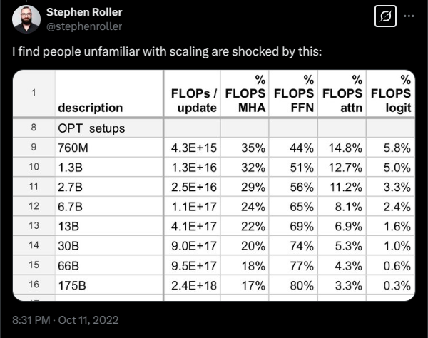
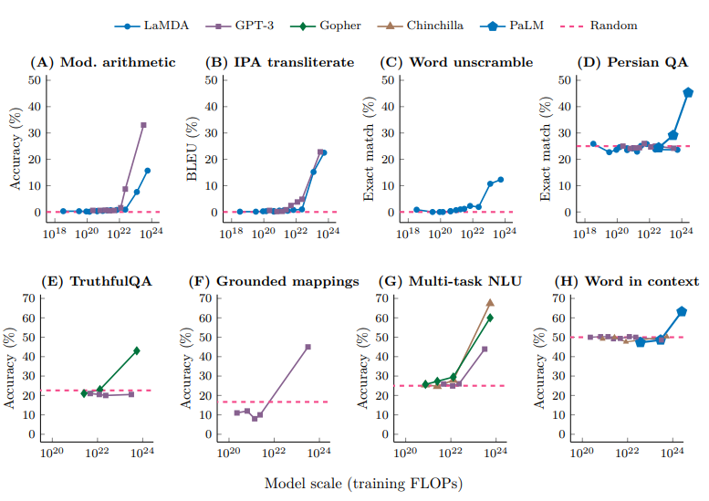
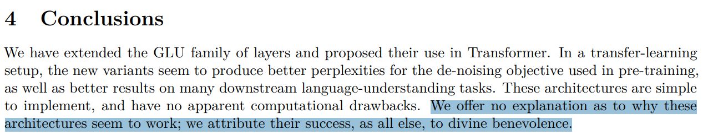
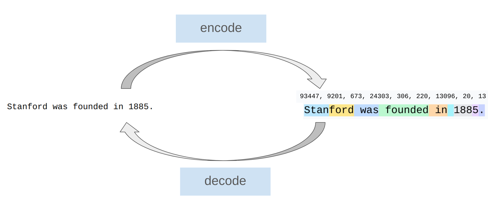
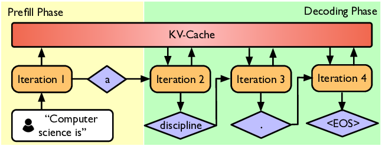

# Lecture 1 — Overview, Tokenization (course material)

This is the written content of CS336 Lecture 1, transcribed from
[`lecture_01.py`](https://github.com/stanford-cs336/lectures/blob/main/lecture_01.py).
Run it, or step through it in the browser, at
<https://cs336.stanford.edu/lectures/?trace=lecture_01>.

The spoken lecture follows this program closely but not exactly — Percy digresses,
answers questions, and expands on points that the source states in one line. For
what was *said*, see [the transcript](../transcripts/01-overview-tokenization.md).
For what was *written*, use this file.

## Sections → source lines

| Section | Function | Lines |
| --- | --- | --- |
| [Welcome](#welcome) | `welcome()` | 52–62 |
| [Why did we make this course?](#why-did-we-make-this-course) | `why_this_course_exists()` | 65–123 |
| [The current LM landscape](#the-current-lm-landscape) | `current_lm_landscape()` | 126–185 |
| [What is this program?](#what-is-this-program) | `what_is_this_program()` | 188–195 |
| [Course logistics](#course-logistics) | `course_logistics()` | 198–232 |
| [Syllabus overview](#syllabus-overview) | `course_syllabus()` | 235–253 |
| [Unit 1 — Basics](#unit-1--basics-assignment-1) | `basics()` | 265–316 |
| [Unit 2 — Systems](#unit-2--systems-assignment-2) | `systems()` | 319–374 |
| [Unit 3 — Scaling laws](#unit-3--scaling-laws-assignment-3) | `scaling_laws()` | 377–411 |
| [Unit 4 — Data](#unit-4--data-assignment-4) | `data()` | 414–452 |
| [Unit 5 — Alignment](#unit-5--alignment-assignment-5) | `alignment()` | 455–478 |
| [Tokenization — overview](#tokenization--overview) | `tokenization()` | 484–502 |
| [Intro to tokenization](#intro-to-tokenization) | `intro_to_tokenization()` | 579–588 |
| [Tokenization examples (GPT-5 / tiktoken)](#tokenization-examples-gpt-5--tiktoken) | `tokenization_examples()` | 591–615 |
| [Character tokenizer](#character-tokenizer) | `character_tokenizer()` | 627–648 |
| [Byte tokenizer](#byte-tokenizer) | `byte_tokenizer()` | 651–673 |
| [Word tokenizer](#word-tokenizer) | `word_tokenizer()` | 676–695 |
| [BPE tokenizer](#bpe-tokenizer) | `bpe_tokenizer()` | 698–726 |
| [Code — tokenizer classes and BPE training](#code--tokenizer-classes-and-bpe-training) | `Tokenizer` 256–262, `merge` 527–538, `BPETokenizerParams` 542–545, `BPETokenizer` 549–564, `get_compression_ratio` 567–571, `train_bpe` 729–750, `count_adjacent_pairs` 753–758 | 256–758 |

The top-level order is set by `main()` (lines 37–49):

```python
def main():
    welcome()
    why_this_course_exists()
    current_lm_landscape()

    what_is_this_program()

    course_logistics()
    course_syllabus()

    tokenization()  # First unit

    text("Next time: resource accounting")
```

---

## Welcome

**CS336: Language Models From Scratch (Spring 2026)**

*Figure: `images/course-staff.png` (width 600).*

"...bringing you the 3rd offering of CS336."

Lectures from the 2nd offering (Spring 2025) are on
[YouTube](https://www.youtube.com/playlist?list=PLoROMvodv4rOY23Y0BoGoBGgQ1zmU_MT_).

What's new?

- Same "from scratch" philosophy
- Prioritize high value-per-time concepts, don't lose the forest for the trees
- More coverage of modern LM ingredients (mixture of experts, long-context, agents)

---

## Why did we make this course?

Problem: researchers are becoming **disconnected** from the underlying technology.

- 2016: researchers implemented and trained their own models.
- 2018: researchers downloaded models (e.g., BERT) and fine-tuned them.
- Today: researchers prompt API models (e.g., GPT/Claude/Gemini).

Moving up levels of abstraction boosts productivity, but

- These abstractions are leaky (in contrast to programming languages or operating systems).
- There is still fundamental research to be done that requires tearing up the stack.

**Full understanding** of this technology is necessary for **fundamental research**.

Philosophy of this course: **understanding via building**.

But there's one small problem...

### The industrialization of language models

*Figure: <https://upload.wikimedia.org/wikipedia/commons/c/cc/Industrialisation.jpg> (width 400).*

Frontier models are really expensive:

- 2023: GPT-4 supposedly cost $100M to train.
  ([article](https://www.wired.com/story/openai-ceo-sam-altman-the-age-of-giant-ai-models-is-already-over/))
- 2025: xAI builds cluster with 230K GPUs for training Grok.
  ([post](https://x.com/elonmusk/status/1947701807389515912))

There are no public details on how frontier models are built. From the GPT-4
technical report ([arXiv:2303.08774](https://arxiv.org/pdf/2303.08774.pdf)):

*Figure: `images/gpt4-no-details.png` (width 600).*


*Section 2 of the GPT-4 technical report, with the disclosure refusal highlighted: "Given both the competitive landscape and the safety implications of large-scale models like GPT-4, this report contains no further details about the architecture (including model size), hardware, training compute, dataset construction, training method, or similar." Source: [`images/gpt4-no-details.png`](https://github.com/stanford-cs336/lectures/blob/main/images/gpt4-no-details.png) in the lectures repo.*

Frontier models are out of reach for us. We could build small language models
(<1B parameters), but this might not be representative of large language models.

- Example 1: fraction of FLOPs spent in attention versus MLP changes with scale.
  ([post](https://x.com/stephenroller/status/1579993017234382849))
  *Figure: `images/roller-flops.png` (width 400).*



*A screenshot of a public tweet by Stephen Roller (11 Oct 2022) giving the FLOPs split for eight OPT setups from 760M to 175B. As the model grows the feedforward share rises from 44% to 80%, while multi-head attention falls from 35% to 17%, attention from 14.8% to 3.3% and the logit layer from 5.8% to 0.3%. Source: [`images/roller-flops.png`](https://github.com/stanford-cs336/lectures/blob/main/images/roller-flops.png) in the lectures repo.*
- Example 2: emergence of behavior with scale
  ([arXiv:2206.07682](https://arxiv.org/pdf/2206.07682))
  *Figure: `images/wei-emergence-plot.png` (width 600).*



*Wei et al.'s emergent-abilities figure: eight panels (A-H), each plotting accuracy against training FLOPs for LaMDA, GPT-3, Gopher, Chinchilla and PaLM against a dashed random-chance line. In every panel the curves sit at chance across several orders of magnitude, then rise sharply past roughly 1e22-1e23 FLOPs. Source: [`images/wei-emergence-plot.png`](https://github.com/stanford-cs336/lectures/blob/main/images/wei-emergence-plot.png) in the lectures repo.*

### What can we learn in this class that transfers to frontier models?

There are three types of knowledge:

- **Mechanics**: how things work (what a Transformer is, how model parallelism works)
- **Mindset**: squeezing the most out of the hardware, taking scaling seriously
- **Intuitions**: which data and modeling decisions yield good accuracy

We can teach mechanics and mindset (these do transfer). We can only partially
teach intuitions (do not necessarily transfer across scales).

### Intuitions? 🤷

Some design decisions are simply not (yet) justifiable and just come from
experimentation. Example: Noam Shazeer paper that introduced SwiGLU
([arXiv:2002.05202](https://arxiv.org/pdf/2002.05202.pdf)).

*Figure: `images/divine-benevolence.png` (width 600).*



*The conclusion of Shazeer's 2020 GLU Variants paper, its last sentence highlighted: "We offer no explanation as to why these architectures seem to work; we attribute their success, as all else, to divine benevolence." Used in the lecture as the emblem of how empirical the architecture literature is. Source: [`images/divine-benevolence.png`](https://github.com/stanford-cs336/lectures/blob/main/images/divine-benevolence.png) in the lectures repo.*

### The bitter lesson

- Wrong interpretation: scale is all that matters, algorithms don't matter.
- Right interpretation: algorithms that scale are what matter.

**accuracy = efficiency × resources**

In fact, efficiency is way more important at larger scales (can't afford to be
wasteful). [arXiv:2005.04305](https://arxiv.org/abs/2005.04305) showed 44x
algorithmic efficiency on ImageNet between 2012 and 2019.

Framing: what is the best model one can build given a certain compute and data
budget? In other words, **maximize efficiency**!

---

## The current LM landscape

### Pre-neural (before 2010s)

- Language model to measure the entropy of English —
  Shannon, *Prediction and Entropy of Printed English* (1950)
  ([pdf](https://www.princeton.edu/~wbialek/rome/refs/shannon_51.pdf))
- N-gram language models (used in machine translation and speech recognition
  systems) — Brants et al., *Language Models in Machine Translation* (2007)
  ([pdf](https://aclanthology.org/D07-1090.pdf))

### Neural ingredients (2010s)

- Long-Short Term Memory (LSTM) — Hochreiter & Schmidhuber (1997)
  ([pdf](https://www.bioinf.jku.at/publications/older/2604.pdf))
- First neural language model — Bengio et al., *A Neural Probabilistic Language
  Model* (2003) ([pdf](https://www.jmlr.org/papers/volume3/bengio03a/bengio03a.pdf))
- Sequence-to-sequence modeling (for machine translation)
  ([arXiv:1409.3215](https://arxiv.org/pdf/1409.3215.pdf))
- Adam optimizer ([arXiv:1412.6980](https://arxiv.org/pdf/1412.6980.pdf))
- Attention mechanism (for machine translation)
  ([arXiv:1409.0473](https://arxiv.org/pdf/1409.0473.pdf))
- Transformer architecture (for machine translation)
  ([arXiv:1706.03762](https://arxiv.org/pdf/1706.03762.pdf))
- Mixture of experts ([arXiv:1701.06538](https://arxiv.org/pdf/1701.06538.pdf))
- Model parallelism — GPipe ([arXiv:1811.06965](https://arxiv.org/pdf/1811.06965.pdf)),
  ZeRO ([arXiv:1910.02054](https://arxiv.org/abs/1910.02054)),
  Megatron-LM ([arXiv:1909.08053](https://arxiv.org/pdf/1909.08053.pdf))

### Early foundation models (late 2010s)

- ELMo: pretraining with LSTMs, fine-tuning improves downstream tasks
  ([arXiv:1802.05365](https://arxiv.org/abs/1802.05365))
- BERT: pretraining with Transformer, fine-tuning improves downstream tasks
  ([arXiv:1810.04805](https://arxiv.org/abs/1810.04805))
- Google's T5 (11B): cast everything as text-to-text
  ([arXiv:1910.10683](https://arxiv.org/pdf/1910.10683.pdf))

### Embracing scaling

- OpenAI's GPT-2 (1.5B): fluent text, first signs of zero-shot
  ([pdf](https://cdn.openai.com/better-language-models/language_models_are_unsupervised_multitask_learners.pdf))
- Scaling laws: provide hope / predictability for scaling
  ([arXiv:2001.08361](https://arxiv.org/pdf/2001.08361.pdf))
- OpenAI's GPT-3 (175B): in-context learning
  ([arXiv:2005.14165](https://arxiv.org/pdf/2005.14165.pdf))
- Google's PaLM (540B): massive scale, undertrained
  ([arXiv:2204.02311](https://arxiv.org/pdf/2204.02311.pdf))
- DeepMind's Chinchilla (70B): compute-optimal scaling laws
  ([arXiv:2203.15556](https://arxiv.org/pdf/2203.15556.pdf))

### Open models

Early attempts (attempts to replicate GPT-3):

- EleutherAI's open datasets (The Pile) and models (GPT-J)
  ([arXiv:2101.00027](https://arxiv.org/pdf/2101.00027.pdf),
  [GPT-J](https://arankomatsuzaki.wordpress.com/2021/06/04/gpt-j/))
- Meta's OPT (175B): GPT-3 replication, lots of hardware issues
  ([arXiv:2205.01068](https://arxiv.org/pdf/2205.01068.pdf))
- Hugging Face / BigScience's BLOOM (176B): focused on data sourcing
  ([arXiv:2211.05100](https://arxiv.org/abs/2211.05100))

Credible open-weight models (weights + paper):

- Meta's Llama models ([1](https://arxiv.org/pdf/2302.13971.pdf),
  [2](https://arxiv.org/pdf/2307.09288.pdf), [3](https://arxiv.org/abs/2407.21783))
- Mistral's models ([7B](https://arxiv.org/pdf/2310.06825.pdf),
  [Mixtral](https://arxiv.org/pdf/2401.04088.pdf))
- DeepSeek's models ([67B](https://arxiv.org/pdf/2401.02954.pdf),
  [V2](https://arxiv.org/abs/2405.04434), [V3](https://arxiv.org/pdf/2412.19437.pdf),
  [R1](https://arxiv.org/pdf/2501.12948.pdf), [V3.2](https://arxiv.org/abs/2512.02556))
- Alibaba's Qwen models ([2.5](https://arxiv.org/abs/2412.15115),
  [3](https://arxiv.org/abs/2505.09388))
- Moonshot's Kimi models ([1.5](https://arxiv.org/pdf/2501.12599.pdf),
  [K2.5](https://arxiv.org/abs/2602.02276))
- Z.ai's GLM models ([4.5](https://arxiv.org/abs/2508.06471),
  [5](https://arxiv.org/abs/2602.15763))
- Minimax's models ([M2.5](https://www.minimax.io/news/minimax-m25))
- Xiaomi's MIMO models ([v2](https://mimo.xiaomi.com/mimo-v2-pro))

These models are approaching closed models (GPT, Claude, Gemini, etc.).

Open-source models (weights + paper + code + data):

- AI2's Olmo models ([1](https://arxiv.org/pdf/2402.00838.pdf),
  [2](https://arxiv.org/abs/2501.00656), [3](https://arxiv.org/abs/2512.13961))
- NVIDIA's Nemotron models ([15B](https://arxiv.org/pdf/2402.16819.pdf),
  [3](https://arxiv.org/abs/2512.20856))
- Marin's models (open development)
  ([8B](https://marin.readthedocs.io/en/latest/reports/marin-8b-retro/),
  [32B](https://marin.readthedocs.io/en/latest/reports/marin-32b-retro/))

Openness is important for trust and innovation
([arXiv:2403.07918](https://arxiv.org/abs/2403.07918)). Ideas from open models
enable us to teach CS336.

### What is a language model?

- 2018 (BERT): something you fine-tune
- 2020 (GPT-3): something you prompt
- 2022 (ChatGPT): something you talk to
  ([example conversation](https://huggingface.co/datasets/HuggingFaceTB/smoltalk/viewer/all/train?row=72&conversation-viewer=72))
- 2026 (agents): something that acts autonomously
  ([example trace](https://huggingface.co/datasets/nebius/SWE-rebench-openhands-trajectories/viewer/default/train?conversation-viewer=1))

The fundamentals are the same (attention, kernels, optimization). The specs are
different (longer context, inference efficiency matters even more).

---

## What is this program?

This is an *executable lecture*, a program whose execution delivers the content
of a lecture. Executable lectures make it possible to:

- view and run code (since everything is code!),
- see the hierarchical structure of the lecture

The demonstration in the source is a loop whose intermediate values are inspected
as it runs:

```python
total = 0  # @inspect total
for x in [1, 2, 3]:  # @inspect x
    total += x  # @inspect total
```

(`@inspect` is an annotation read by the tracing framework: it tells the viewer
to display that variable's value at that step.)

---

## Course logistics

All information online: [course website](https://stanford-cs336.github.io/spring2026/).

This is a 5-unit class. Comment from the Spring 2024 course evaluation:

> *The entire assignment was approximately the same amount of work as all 5
> assignments from CS 224n plus the final project. And that's just the first
> homework assignment.*

### Why you should take this course

- You have an obsessive need to understand how things work.
- You want to build up your research engineering muscles.

### Why you should not take this course

- You actually want to get research done this quarter. (Talk to your advisor.)
- You are interested in learning about the hottest new techniques in AI (e.g.,
  multimodality, RAG, etc.). (You should take a seminar class for that.)
- You want to get good results on your own application domain. (You should just
  prompt or fine-tune an existing model.)

### How you can follow along at home

- All lecture materials and assignments will be posted online, so feel free to
  follow on your own.
- Lectures are recorded via [CGOE](https://cgoe.stanford.edu/).

### Assignments

- 5 assignments (basics, systems, scaling laws, data, alignment).
- No scaffolding code, but we provide unit tests and adapter interfaces to help
  you check correctness.
- Implement locally to test for correctness, then run on cluster for benchmarking
  (accuracy and speed).
- Leaderboard for some assignments (minimize perplexity given training budget).

### AI policy

- Coding agents can solve all the assignments, but you won't learn anything.
- AI can be tremendously useful for answering questions and tutoring.
- You must use our provided `AGENTS.md` file, which asks the AI to be
  pedagogically-minded.
- Please read our
  [AI policy guide](https://docs.google.com/document/d/1SZAlExB1qAc9izHt54gwunNpjKE6wXb8Y7yA_e-baK8/edit?tab=t.0).

### Compute

- Thanks to [Modal](https://modal.com/) for providing compute. 🙏
- Please read the
  [guide](https://docs.google.com/document/d/1cHE0iKVyXLJ3XpIs2XuXTmZ-HMmPk2hIPeCvy-AydMg/edit?tab=t.otis27tacaef)
  on how to access and use the compute.

---

## Syllabus overview

The syllabus is five units, each paired with an assignment:

```python
def course_syllabus():
    basics()         # Assignment 1: tokenization, model architecture, training
    systems()        # Assignment 2: kernels, parallelism, inference
    scaling_laws()   # Assignment 3: scaling laws
    data()           # Assignment 4: evaluation, curation, transformation,
                     #               filtering, deduplication, mixing
    alignment()      # Assignment 5: RLHF, RL algorithms, RL systems
```

Remember it's all about **efficiency**:

- Resources: data + hardware (compute, memory, communication bandwidth)
- How do you train the best model given a fixed set of resources?

Today, we are compute-constrained, so design decisions will reflect squeezing the
most out of given hardware.

- Systems: clearly about efficiency
- Tokenization: working with raw bytes is elegant, but compute-inefficient with
  today's model architectures
- Model architecture: many changes motivated by reducing memory or FLOPs (e.g.,
  sharing KV caches, sliding window attention)
- Data filtering: avoid wasting precious compute updating on bad / irrelevant data
- Scaling laws: use less compute on smaller models to do hyperparameter tuning

Tomorrow, we will become data-constrained...

---

## Unit 1 — Basics (Assignment 1)

Goal: be able to train a basic language model.
Components: tokenization, model architecture, training.

### Tokenization

What are the atoms that the model operates on? Formally: a tokenizer converts
between raw inputs (bytes) and sequences of integers (tokens).

*Figure: `images/tokenized-example.png` (width 600).*



*The encode/decode round trip. "Stanford was founded in 1885." maps to the id sequence 93447, 9201, 673, 24303, 306, 220, 13096, 20, 13, shown beneath as coloured spans over the original characters; decode maps it back. Source: [`images/tokenized-example.png`](https://github.com/stanford-cs336/lectures/blob/main/images/tokenized-example.png) in the lectures repo.*

Popular tokenizer: **Byte-Pair Encoding** (BPE)
([Sennrich et al., arXiv:1508.07909](https://arxiv.org/abs/1508.07909)).
Intuition: break input into frequently-occurring chunks.

Efficiency lens:

- Reduce context length (1000 bytes → ~250 tokens)
- Adaptive computation (more modeling capacity on interesting parts of input)

The dream: tokenizer-free model architectures, which operate directly on bytes —
ByT5 ([arXiv:2105.13626](https://arxiv.org/abs/2105.13626)),
MegaByte ([arXiv:2305.07185](https://arxiv.org/pdf/2305.07185.pdf)),
BLT ([arXiv:2412.09871](https://arxiv.org/abs/2412.09871)),
T-FREE ([arXiv:2406.19223](https://arxiv.org/abs/2406.19223)),
H-Net ([arXiv:2507.07955](https://arxiv.org/abs/2507.07955)).
These are promising, but have not yet been scaled up to the frontier.

### Model architecture

Starting point: the original Transformer
([arXiv:1706.03762](https://arxiv.org/pdf/1706.03762.pdf)).

*Figure: `images/transformer-architecture.png` (width 500).*


*Two views of the model built in assignment 1. Left, the whole stack: token and absolute position embeddings, add and dropout, a run of Transformer blocks, a final norm, then the output linear and softmax. Right, one block expanded - norm, causal multi-head self-attention, dropout, add; then norm, position-wise feedforward, dropout, add - a pre-norm block, with both residual additions drawn as arrows bypassing the sublayer. Source: [`images/transformer-architecture.png`](https://github.com/stanford-cs336/lectures/blob/main/images/transformer-architecture.png) in the lectures repo.*

Refinements:

- Activation functions: ReLU, SwiGLU
  ([arXiv:2002.05202](https://arxiv.org/pdf/2002.05202.pdf))
- Positional encodings: sinusoidal, RoPE
  ([arXiv:2104.09864](https://arxiv.org/pdf/2104.09864.pdf))
- Normalization: LayerNorm, RMSNorm, QK norm, pre-norm versus post-norm
  ([LayerNorm](https://arxiv.org/pdf/1607.06450.pdf),
  [RMSNorm](https://arxiv.org/abs/1910.07467),
  [QK norm](https://arxiv.org/abs/2302.05442),
  [pre/post-norm](https://arxiv.org/pdf/2002.04745.pdf))
- Attention: full, sparse/local attention, group-query attention (GQA),
  multi-head latent attention (MLA)
  ([Sparse Transformer](https://arxiv.org/pdf/1904.10509.pdf),
  [GQA](https://arxiv.org/pdf/2305.13245.pdf),
  [MLA / DeepSeek-V2](https://arxiv.org/abs/2405.04434))
- Recurrence / state-space models / linear attention: Mamba, Gated DeltaNet
  ([linear attention](https://arxiv.org/abs/2006.16236),
  [Mamba-2](https://arxiv.org/abs/2405.21060),
  [GDN](https://arxiv.org/abs/2412.06464),
  [Mamba-3](https://arxiv.org/abs/2603.15569))
- MLP: dense, mixture of experts
  ([MoE](https://arxiv.org/pdf/1701.06538.pdf),
  [Switch Transformers](https://arxiv.org/abs/2101.03961))
- Shape (hidden dimension, depth, number of heads, number of experts)

### Training

How do you set the parameters of the model?

- Loss function (e.g., multi-token prediction)
  ([MTP](https://arxiv.org/abs/2404.19737),
  [DeepSeek-V3](https://arxiv.org/pdf/2412.19437.pdf))
- Optimizer (e.g., AdamW, SOAP, Muon)
  ([Adam](https://arxiv.org/pdf/1412.6980.pdf),
  [AdamW](https://arxiv.org/pdf/1711.05101.pdf),
  [SOAP](https://arxiv.org/abs/2409.11321),
  [Muon](https://kellerjordan.github.io/posts/muon/))
- Initialization scale (e.g., Xavier init, muP)
  ([Glorot & Bengio 2010](https://proceedings.mlr.press/v9/glorot10a/glorot10a.pdf),
  [muP](https://arxiv.org/abs/2203.03466))
- Learning rate schedule (e.g., cosine, WSD)
  ([cosine](https://arxiv.org/pdf/1608.03983.pdf),
  [WSD / MiniCPM](https://arxiv.org/pdf/2404.06395.pdf))
- Regularization (e.g., dropout, weight decay)
- Batch size (e.g., critical batch size)
  ([arXiv:1812.06162](https://arxiv.org/pdf/1812.06162.pdf))
- MoE specific: load balancing (e.g., aux-free)
  ([aux-free](https://arxiv.org/abs/2408.15664),
  [DeepSeek-V3](https://arxiv.org/pdf/2412.19437.pdf))

### Assignment 1 (basics)

[GitHub](https://github.com/stanford-cs336/assignment1-basics) ·
[PDF](https://github.com/stanford-cs336/assignment1-basics/blob/main/cs336_spring2026_assignment1_basics.pdf)

*(That PDF URL is the one written in the lecture source and is reproduced here
verbatim, but it returns 404 as of 2026-08-27 — the repo currently serves the
handout as
[`cs336_assignment1_basics.pdf`](https://github.com/stanford-cs336/assignment1-basics/blob/main/cs336_assignment1_basics.pdf).)*

- Implement BPE tokenizer
- Implement Transformer, cross-entropy loss, AdamW optimizer, training loop
- Do resource accounting
- Train on TinyStories and OpenWebText
- Leaderboard: minimize OpenWebText perplexity given 45 minutes on a B200
  ([last year's leaderboard](https://github.com/stanford-cs336/spring2025-assignment1-basics-leaderboard))

High-level principle: everything is about balancing the following:

- Expressivity (can represent complex dependencies in the data)
- Stability (keep parameter and gradient norms in goldilocks zone)
- Efficiency (runs fast on hardware, both training and inference)

---

## Unit 2 — Systems (Assignment 2)

Goal: squeeze the most out of the hardware (GPU or TPU).
Components: kernels, parallelism, inference.

### Basics

- Resource accounting: memory and compute characteristics of a model.
  The source computes `total_flops = 6 * 70e9 * 1e12`, annotated in the code as
  "Training 70B parameters on 1T tokens = 4.2e23 FLOPs".

*Figure: `images/compute-memory.png` (width 300).*


*Compute and memory as two blocks joined by a narrow pipe: many small arithmetic units in the compute block against one wide memory block, the thin connector standing for the bandwidth between them. The lecture's picture of why moving memory, not doing arithmetic, is usually the limit. Source: [`images/compute-memory.png`](https://github.com/stanford-cs336/lectures/blob/main/images/compute-memory.png) in the lectures repo.*

- Model parameters must be moved from memory (HBM) to the compute (SMs)
- Example: B200 can perform 2.25 PFLOP/sec (bf16) with 8TB/sec memory bandwidth
- Roofline analysis: understand whether we're compute-bound or memory-bound
- Benchmarking and profiling (nsight): see what happens in practice

[DGX B200](https://docs.nvidia.com/dgx/dgxb200-user-guide/introduction-to-dgxb200.html):

*Figure: <https://docs.nvidia.com/dgx/dgxb200-user-guide/_images/dgx-b200-system-topology.png> (width 500).*

### Kernels

- Kernel is a function that runs on GPU
- When using PyTorch, each primitive operation launches a standard kernel
- Can write custom kernels to make GPUs go brrr
- Principle: organize computation to minimize data movement
- Naive: read HBM; compute A; write HBM; read HBM; compute B; write HBM
- Fused: read HBM; compute A and B; write HBM
- Strategies: operator fusion (matmul + activation), tiling (FlashAttention)
- Warp divergence, memory coalescing, bank conflicts, occupancy, bulk-async
  memory transfers
- Write kernels in CUDA/**Triton**/CUTLASS/ThunderKittens

### Parallelism

- What if we have 1024 GPUs?
- Data movement between GPUs is even slower, but same "minimize data movement"
  principle holds
- Use classic collective operations (e.g., gather, reduce, all-reduce)
- Shard memory (parameters, activations, gradients, optimizer states) across GPUs
- How to split computation: {data, tensor, pipeline, sequence, expert} parallelism

### Inference

Goal: generate tokens given a prompt (needed to actually use models!). Inference
is also needed for reinforcement learning, test-time compute, evaluation.

Two phases: prefill and decode.

*Figure: `images/prefill-decode.png` (width 500).*



*Prefill and decode as two shaded phases. Prefill (yellow) is iteration 1 over the whole prompt "Computer science is"; decoding (green) is iterations 2-4, each emitting one token - "a", "discipline", ".", then <EOS>. A KV-cache bar spans both, written by every iteration and read by the next. Source: [`images/prefill-decode.png`](https://github.com/stanford-cs336/lectures/blob/main/images/prefill-decode.png) in the lectures repo.*

- Prefill (similar to training): tokens are given, can process all at once
  (compute-bound)
- Decode: need to generate one token at a time (memory-bound)

Methods to speed up decoding:

- Use cheaper model (via model pruning, quantization, distillation)
- Speculative decoding: use a cheaper "draft" model to generate multiple tokens,
  then use the full model to score in parallel (exact decoding!)
- Systems optimizations: fused kernels, continuous batching

### Assignment 2 (systems)

[GitHub](https://github.com/stanford-cs336/assignment2-systems) ·
[PDF from Spring 2025](https://github.com/stanford-cs336/assignment2-systems/blob/spring2025/cs336_spring2025_assignment2_systems.pdf)

- Implement a fused RMSNorm kernel in Triton
- Implement distributed data parallel training
- Implement optimizer state sharding
- Benchmark and profile the implementations

Recommended book: [How to Scale Your Model](https://jax-ml.github.io/scaling-book/)

- Nicely lays out how to approach systems for LLMs conceptually
- From Google, so it foregrounds TPUs, but high-level concepts are similar

---

## Unit 3 — Scaling laws (Assignment 3)

Setting: if you had 1e25 FLOPs of compute, what hyperparameters would you use to
train a good model? Too expensive to do hyperparameter tuning at full scale!

Key conceptual shift: instead of a single scale, think of a **scaling recipe**
(FLOPs → hyperparameters).

For a scaling recipe:

- Run experiments to compute the loss at various smaller scales (e.g., up to 1e24 FLOPs)
- Fit a scaling law to predict the loss of the scaling recipe at the target scale
  (e.g., 1e25 FLOPs)

Now you can:

1. Optimize the scaling recipe targeting a larger scale using smaller scale experiments
2. Predict the loss at the target scale before actually running the experiment!

Scaling laws don't happen automatically, they require careful construction of a
scaling recipe. Parameterize the model in a way to get **hyperparameter transfer**
([muP, arXiv:2203.03466](https://arxiv.org/abs/2203.03466)).
Predictability is at least as important as optimality!

Question: given a FLOPs budget (C = 6 N D), use a bigger model (N) or train on
more tokens (D)?

Classic compute-optimal scaling laws:
[Kaplan et al. 2020](https://arxiv.org/pdf/2001.08361.pdf),
[Chinchilla 2022](https://arxiv.org/pdf/2203.15556.pdf).

- ISOFLOP curves: for multiple small FLOPs budgets, find optimal N
- Then fit a scaling law to extrapolate to large FLOPs budgets

*Figure: `images/chinchilla-isoflop.png` (width 800).*


*The Chinchilla IsoFLOP analysis (Hoffmann et al. 2022). Left: training loss against parameter count for nine fixed compute budgets from 6e18 to 3e21 FLOPs, each curve a parabola in log space whose minimum moves right as the budget grows. Centre and right: those minima replotted against FLOPs, both falling on a straight line in log-log, extrapolated to Gopher's budget at 63B parameters and 1.4T tokens. Source: [`images/chinchilla-isoflop.png`](https://github.com/stanford-cs336/lectures/blob/main/images/chinchilla-isoflop.png) in the lectures repo.*

TL;DR: D = 20 N is roughly optimal (e.g., 70B parameter model should be trained
on ~1.4T tokens). Caveat: this doesn't take into account inference costs (want a
smaller model).

Live example from Marin
([post](https://x.com/percyliang/status/2034367256277533100)).

*Figure: <https://pbs.twimg.com/media/HDuErvvbsAAQ5Yt?format=jpg&name=4096x4096> (width 600).*

"Should be done training this week, should see how well we match the preregistered loss!"

### Assignment 3 (scaling laws)

[GitHub](https://github.com/stanford-cs336/assignment3-scaling) ·
[PDF from Spring 2025](https://github.com/stanford-cs336/assignment3-scaling/blob/master/cs336_spring2025_assignment3_scaling.pdf)

- We define a training API (hyperparameters → loss) based on previous runs
- Submit "training jobs" (under a FLOPs budget) and gather data points
- Fit scaling laws to the data points
- Submit extrapolated hyperparameters and loss predictions
- Leaderboard: minimize loss given FLOPs budget

---

## Unit 4 — Data (Assignment 4)

Question: What capabilities do we want the model to have? Multilingual? Good at
conversation? Agentic coding capabilities?

### Evaluation

What is the purpose of evaluation?

1. Internal: guide model development (smoothness across scales, relative
   performance matters)
2. External: measure absolute quality of a real use case (ecological validity matters)

Examples of evaluations:

1. Perplexity: ideally run on private documents not on Internet (avoid contamination)
2. Advanced use cases: GPQA, HLE, SWE-Bench, Terminal-Bench

LMs are general purpose, require a diverse set of evaluations!

### Data curation

- Data does not just fall from the sky.
- Sources: webpages crawled from the Internet, books, arXiv papers, GitHub code, etc.

*Figure: <https://ar5iv.labs.arxiv.org/html/2101.00027/assets/pile_chart2.png> (width 600).*

- Appeal to fair use to train on copyright data?
  ([arXiv:2303.15715](https://arxiv.org/pdf/2303.15715.pdf))
- Might have to license data (e.g., Google with Reddit data)
  ([article](https://www.reuters.com/technology/reddit-ai-content-licensing-deal-with-google-sources-say-2024-02-22/))
- Raw data is HTML, PDF, directories (not text), requires processing

### Data processing

- Transformation: convert HTML/PDF to text (extract main content)
- Filtering: keep high quality data, remove harmful content (via classifiers)
- Deduplication: save compute, avoid memorization; use Bloom filters or MinHash
- Data mixing: how much to upweight/downweight each source?
  ([RegMix](https://arxiv.org/abs/2407.01492),
  [Olmix](https://arxiv.org/abs/2602.12237))
- Rewriting / synthetic data: use LM to augment real data, more similar to
  downstream tasks ([WRAP](https://arxiv.org/abs/2401.16380))

Types of data:

- Pretraining data: large and diverse
- Mid-training data: high quality, including long-context
- Post-training data: supervised fine-tuning (conversations, agentic traces with
  tool calling)

### Assignment 4 (data)

[GitHub](https://github.com/stanford-cs336/assignment4-data) ·
[PDF from Spring 2025](https://github.com/stanford-cs336/assignment4-data/blob/spring2025/cs336_spring2025_assignment4_data.pdf)

- Convert Common Crawl HTML to text
- Train classifiers to filter for quality and harmful content
- Deduplication using MinHash
- Leaderboard: minimize perplexity given token budget

---

## Unit 5 — Alignment (Assignment 5)

So far, we have trained a model on full supervision (predict the next token). Now
that the model should be reasonable, we can improve it further from **weak
supervision**. Why weak supervision? When it is easier to critique than to generate.

Basic template:

1. Generate responses from the model.
2. Score responses with a {human, verifier, LM judge}.
3. Update the model to prefer better responses.

Algorithms:

- Proximal Policy Optimization (PPO) from reinforcement learning
  ([PPO](https://arxiv.org/pdf/1707.06347.pdf),
  [InstructGPT](https://arxiv.org/pdf/2203.02155.pdf))
- Direct Policy Optimization (DPO): for preference data, simpler
  ([arXiv:2305.18290](https://arxiv.org/pdf/2305.18290.pdf))
- Group Relative Preference Optimization (GRPO): remove value function
  ([DeepSeekMath, arXiv:2402.03300](https://arxiv.org/pdf/2402.03300.pdf))

Challenges:

- RL algorithms are unstable and hard to tune
- At scale, this requires a lot of new infrastructure (inference with async rollouts)
- Constantly trading off systems efficiency and on-policyness

### Assignment 5 (alignment)

[GitHub](https://github.com/stanford-cs336/assignment5-alignment) ·
[PDF from Spring 2025](https://github.com/stanford-cs336/assignment5-alignment/blob/spring2025/cs336_spring2025_assignment5_alignment.pdf)

- Implement Direct Preference Optimization (DPO)
- Implement Group Relative Preference Optimization (GRPO)

---

## Tokenization — overview

> **Provenance of the numbers in this section.** `lecture_01.py` does not print its
> worked values into the source; they appear at runtime, marked by `@inspect`
> annotations, and the trace viewer displays them as the program steps. The values
> quoted below were obtained by **executing the lecture's own code verbatim** —
> the same `merge`, `count_adjacent_pairs`, `train_bpe`, `CharacterTokenizer` and
> `ByteTokenizer` definitions reproduced at the bottom of this file, and
> `tiktoken.get_encoding("o200k_base")` for the GPT-5 tokenizer. They are
> reproducible, not recalled. Where a value depends on the installed `tiktoken`
> version, that is noted.

This unit was inspired by Andrej Karpathy's video on tokenization; check it out!
([video](https://www.youtube.com/watch?v=zduSFxRajkE))

The unit runs through four tokenizers in increasing order of sophistication:

```python
def tokenization():
    intro_to_tokenization()
    tokenization_examples()
    character_tokenizer()
    byte_tokenizer()
    word_tokenizer()
    bpe_tokenizer()
```

Summary (stated at the end of the unit):

- Tokenizer: strings ↔ tokens (indices)
- Character-based, byte-based, word-based tokenization are highly suboptimal
- BPE is an effective heuristic that is data-driven
- Tokenization is a separate step, maybe one day do it end-to-end from bytes...

But whatever solution needs to satisfy:

1. Model (e.g., Transformer) should operate on chunks (abstractions) of the
   sequence (text, video, DNA, etc.)
2. Chunks should be variable (allocate more model capacity to interesting chunks)

---

## Intro to tokenization

Raw text is generally represented as Unicode strings. The running example
throughout the unit is:

```python
string = "Hello, 🌍! 你好!"
```

A language model places a probability distribution over sequences of tokens
(usually represented by integer indices). The source illustrates this with

```python
indices = [15496, 11, 995, 0]
```

(Under the GPT-2 tokenizer these four indices decode to `Hello`, `,`, ` world`,
`!` — i.e. "Hello, world!".)

So we need a procedure that *encodes* strings into tokens. We also need a
procedure that *decodes* tokens back into strings. A `Tokenizer` is a class that
implements the encode and decode methods:

```python
class Tokenizer(ABC):
    """Abstract interface for a tokenizer."""
    def encode(self, string: str) -> list[int]:
        raise NotImplementedError

    def decode(self, indices: list[int]) -> str:
        raise NotImplementedError
```

---

## Tokenization examples (GPT-5 / tiktoken)

To get a feel for how tokenizers work, play with this
[interactive site](https://tiktokenizer.vercel.app/?encoder=gpt2).

### Observations

- A word and its preceding space are part of the same token (e.g., `" world"`).
- A word at the beginning and in the middle are represented differently (e.g.,
  `"hello hello"`).
- Numbers are tokenized into every few digits.

Running the GPT-2 encoder to confirm each observation:

| Input | Token ids | Token strings |
| --- | --- | --- |
| `" world"` | `[995]` | `[' world']` — one token, leading space included |
| `"hello world"` | `[31373, 995]` | `['hello', ' world']` |
| `"hello hello"` | `[31373, 23748]` | `['hello', ' hello']` — different ids for the same word |
| `"123456789"` | `[10163, 2231, 3134, 4531]` | `['123', '45', '67', '89']` |
| `"1234567890"` | `[10163, 2231, 30924, 3829]` | `['123', '45', '678', '90']` |

### The GPT-5 tokenizer in action

```python
def get_gpt5_tokenizer():
    # Code: https://github.com/openai/tiktoken
    return tiktoken.get_encoding("o200k_base")
```

```python
tokenizer = get_gpt5_tokenizer()
string = "Hello, 🌍! 你好!"

# Check that encode() and decode() roundtrip:
indices = tokenizer.encode(string)
reconstructed_string = tokenizer.decode(indices)
assert string == reconstructed_string

# Compression ratio: number of bytes per token
compression_ratio = get_compression_ratio(string, indices)
vocabulary_size = tokenizer.n_vocab
```

Executed (tiktoken 0.14.0):

| Quantity | Value |
| --- | --- |
| `indices` | `[13225, 11, 130321, 235, 0, 220, 177519, 0]` |
| token strings | `['Hello', ',', ' 🌍'…split…, '!', ' ', '你好', '!']` |
| number of tokens | 8 |
| UTF-8 bytes in the string | 20 |
| `compression_ratio` | **2.5** bytes/token |
| `vocabulary_size` (`n_vocab`) | **200,019** |
| roundtrip | holds |

Note two things visible in that output. `你好` — two Chinese characters, six UTF-8
bytes — is a *single* token, because it is common enough in the training data to
have earned one. The globe emoji is the opposite case: ids `130321, 235` are two
tokens that individually decode to invalid UTF-8 fragments and only together
reconstitute `🌍`. A rare character costs more tokens than a common word.

Definition of the metric being reported:

```python
def get_compression_ratio(string: str, indices: list[int]) -> float:
    """Given `string` that has been tokenized into `indices`, return the number of UTF-8 bytes per token."""
    num_bytes = len(bytes(string, encoding="utf-8"))
    num_tokens = len(indices)
    return num_bytes / num_tokens
```

The larger the compression ratio, the shorter the sequence (good since attention
is quadratic in sequence length). One could increase compression ratio by
increasing **vocabulary size** (number of possible token values increases),
leading to sparsity.

The lecture then dumps the actual vocabulary to a file:
[vocab](https://github.com/stanford-cs336/lectures/blob/main/var/gpt5_tokenizer_vocab.txt).

---

## Character tokenizer

A Unicode string is a sequence of Unicode characters. Each character can be
converted into a code point (integer) via `ord`, and back via `chr`:

```python
assert ord("a") == 97
assert ord("🌍") == 127757
assert chr(97) == "a"
assert chr(127757) == "🌍"
```

```python
class CharacterTokenizer(Tokenizer):
    """Represent a string as a sequence of Unicode code points."""
    def encode(self, string: str) -> list[int]:
        return list(map(ord, string))

    def decode(self, indices: list[int]) -> str:
        return "".join(map(chr, indices))
```

Executed on the running example:

| Quantity | Value |
| --- | --- |
| `indices` | `[72, 101, 108, 108, 111, 44, 32, 127757, 33, 32, 20320, 22909, 33]` |
| number of tokens | 13 (one per character) |
| `vocabulary_size` = `max(indices) + 1` | **127,758** — a lower bound, driven up by the single emoji |
| `compression_ratio` | **≈1.538** bytes/token (20 bytes / 13 tokens) |
| roundtrip | holds |

There are approximately 150K Unicode characters
([Wikipedia](https://en.wikipedia.org/wiki/List_of_Unicode_characters)).

- Problem 1: this is a very large vocabulary.
- Problem 2: many characters are quite rare (e.g., 🌍), which is inefficient use
  of the vocabulary.

"This tokenizer is the worst of both worlds (large vocabulary, low compression ratio)."

---

## Byte tokenizer

Unicode strings can be represented as a sequence of bytes, which can be
represented by integers between 0 and 255. The most common Unicode encoding is
[UTF-8](https://en.wikipedia.org/wiki/UTF-8).

Some Unicode characters are represented by one byte, others take multiple:

```python
assert bytes("a", encoding="utf-8") == b"a"
assert bytes("🌍", encoding="utf-8") == b"\xf0\x9f\x8c\x8d"
```

```python
class ByteTokenizer(Tokenizer):
    """Represent a string as a sequence of bytes."""
    def encode(self, string: str) -> list[int]:
        string_bytes = string.encode("utf-8")
        indices = list(map(int, string_bytes))
        return indices

    def decode(self, indices: list[int]) -> str:
        string_bytes = bytes(indices)
        string = string_bytes.decode("utf-8")
        return string
```

Executed on the running example:

| Quantity | Value |
| --- | --- |
| `indices` | `[72, 101, 108, 108, 111, 44, 32, 240, 159, 140, 141, 33, 32, 228, 189, 160, 229, 165, 189, 33]` |
| number of tokens | 20 |
| `vocabulary_size` | **256** — "nice and small: a byte can represent 256 values" |
| `compression_ratio` | **1.0** exactly; the source asserts this: `assert compression_ratio == 1` |
| roundtrip | holds |

"The compression ratio is terrible, which means the sequences will be too long.
Given that the context length of a Transformer is limited (since attention is
quadratic), this is not looking great..."

---

## Word tokenizer

Another approach (closer to what was done classically in NLP) is to split strings
into words.

```python
string = "I'll say supercalifragilisticexpialidocious!"
chunks = regex.findall(r"\w+|.", string)
```

This regular expression keeps all alphanumeric characters together (words).
Executed:

| Quantity | Value |
| --- | --- |
| `chunks` | `['I', "'", 'll', ' ', 'say', ' ', 'supercalifragilisticexpialidocious', '!']` |
| number of chunks | 8 |
| UTF-8 bytes | 44 |
| `compression_ratio` | **5.5** bytes/token |
| `vocabulary_size` | `"Number of distinct chunks in the training data"` — the source literally assigns this string, because the number is not determined by the method |

To turn this into a `Tokenizer`, we need to map these chunks into integers. Then,
we can build a mapping from each chunk into an integer.

What's good: each token is meaningful (since humans invented words). Compression
ratio is good, but vocabulary size can be huge.

Moreover:

- Many words are rare and the model won't learn much about them.
- This doesn't obviously provide a fixed vocabulary size.
- New words we haven't seen during training get a special UNK token, which is
  ugly and can mess up perplexity calculations.

---

## BPE tokenizer

### Byte Pair Encoding (BPE)

The BPE algorithm was introduced by Philip Gage in 1994 for data compression
([article](http://www.pennelynn.com/Documents/CUJ/HTML/94HTML/19940045.HTM)). It
was adapted to NLP for neural machine translation
([Sennrich et al., arXiv:1508.07909](https://arxiv.org/abs/1508.07909)).
(Previously, papers had been using word-based tokenization.) BPE was then used by
GPT-2
([Radford et al. 2019](https://cdn.openai.com/better-language-models/language_models_are_unsupervised_multitask_learners.pdf)).

Basic idea: *train* the tokenizer on raw text to construct a vocabulary tailored
to the data. Intuition: common sequences of bytes are represented by a single
token, rare sequences are represented by many tokens.

Sketch: start with each byte as a token, and successively merge the most common
pair of adjacent tokens.

### Training the tokenizer

```python
string = "the cat in the hat"
params = train_bpe(string, num_merges=3)
```

Executed step by step. The initial byte indices are

```
[116, 104, 101, 32, 99, 97, 116, 32, 105, 110, 32, 116, 104, 101, 32, 104, 97, 116]
```

| Merge | Most common pair | Bytes | Count | New index | `indices` after merge |
| --- | --- | --- | --- | --- | --- |
| 0 | `(116, 104)` | `b't'` + `b'h'` | 2 | 256 → `b'th'` | `[256, 101, 32, 99, 97, 116, 32, 105, 110, 32, 256, 101, 32, 104, 97, 116]` |
| 1 | `(256, 101)` | `b'th'` + `b'e'` | 2 | 257 → `b'the'` | `[257, 32, 99, 97, 116, 32, 105, 110, 32, 257, 32, 104, 97, 116]` |
| 2 | `(257, 32)` | `b'the'` + `b' '` | 2 | 258 → `b'the '` | `[258, 99, 97, 116, 32, 105, 110, 32, 258, 104, 97, 116]` |

Resulting `merges` dictionary: `{(116, 104): 256, (256, 101): 257, (257, 32): 258}`.
New vocabulary entries: `256: b'th'`, `257: b'the'`, `258: b'the '`.

The sequence has gone from 18 tokens to 12; `compression_ratio` after training is
**1.5** bytes/token (18 bytes / 12 tokens).

Note how the merges compose: merge 1 consumes the token produced by merge 0, and
merge 2 consumes the token produced by merge 1. This is why the merge list must be
applied *in training order* at encode time.

Also note that `b'the '` — with the trailing space — is what BPE learns here,
which is the same phenomenon as the `" world"` observation above, arrived at from
the other direction.

### Using the tokenizer

Now, given a new text, we can encode it:

```python
tokenizer = BPETokenizer(params)
string = "the quick brown fox"
indices = tokenizer.encode(string)
reconstructed_string = tokenizer.decode(indices)
assert string == reconstructed_string
```

Executed:

| Quantity | Value |
| --- | --- |
| initial bytes | `[116, 104, 101, 32, 113, 117, 105, 99, 107, 32, 98, 114, 111, 119, 110, 32, 102, 111, 120]` (19 tokens) |
| after applying the 3 merges | `[258, 113, 117, 105, 99, 107, 32, 98, 114, 111, 119, 110, 32, 102, 111, 120]` (16 tokens) |
| `compression_ratio` | **1.1875** bytes/token |
| roundtrip | holds |

Only the leading `"the "` was compressed — the merges were trained on
`"the cat in the hat"` and know nothing about `"quick brown fox"`. That is the
data-driven character of BPE, in miniature.

### In Assignment 1, you will go beyond this in the following ways

- `encode()` currently loops over all merges. Only loop over merges that matter.
- Detect and preserve special tokens (e.g., `<|endoftext|>`).
- Use pre-tokenization (e.g., the GPT-2 tokenizer regex).
- Try to make the implementation as fast as possible.

---

## Code — tokenizer classes and BPE training

Reproduced verbatim from `lecture_01.py` (comments stripped of the `@inspect` /
`@stepover` tracing annotations where they interrupt reading; the executable
statements are unchanged).

```python
def merge(indices: list[int], pair: tuple[int, int], new_index: int) -> list[int]:
    """Return `indices`, but with all instances of `pair` replaced with `new_index`."""
    new_indices = []
    i = 0
    while i < len(indices):
        if i + 1 < len(indices) and indices[i] == pair[0] and indices[i + 1] == pair[1]:
            new_indices.append(new_index)
            i += 2
        else:
            new_indices.append(indices[i])
            i += 1
    return new_indices


@dataclass(frozen=True)
class BPETokenizerParams:
    """All you need to specify a BPETokenizer."""
    vocab: dict[int, bytes]             # index -> bytes
    merges: dict[tuple[int, int], int]  # index1,index2 -> new_index


class BPETokenizer(Tokenizer):
    """BPE tokenizer given a set of merges and a vocabulary."""
    def __init__(self, params: BPETokenizerParams):
        self.params = params

    def encode(self, string: str) -> list[int]:
        indices = list(map(int, string.encode("utf-8")))
        # Note: this is a very slow implementation
        for pair, new_index in self.params.merges.items():
            indices = merge(indices, pair, new_index)
        return indices

    def decode(self, indices: list[int]) -> str:
        bytes_list = list(map(self.params.vocab.get, indices))
        string = b"".join(bytes_list).decode("utf-8")
        return string


def train_bpe(string: str, num_merges: int) -> BPETokenizerParams:
    # Start with the list of bytes of `string`.
    indices = list(map(int, string.encode("utf-8")))
    merges: dict[tuple[int, int], int] = {}       # index1, index2 => merged index
    vocab: dict[int, bytes] = {x: bytes([x]) for x in range(256)}  # index -> bytes

    for i in range(num_merges):
        # Count the number of occurrences of each pair of tokens
        counts = count_adjacent_pairs(indices)

        # Find the most common pair
        pair = max(counts, key=counts.get)

        # Merge that pair
        new_index = 256 + i
        merges[pair] = new_index
        vocab[new_index] = vocab[pair[0]] + vocab[pair[1]]
        indices = merge(indices, pair, new_index)

    compression_ratio = get_compression_ratio(string, indices)

    return BPETokenizerParams(vocab=vocab, merges=merges)


def count_adjacent_pairs(indices: list[int]) -> dict[tuple[int, int], int]:
    """Return a dictionary mapping each adjacent pair of tokens in `indices` to the number of times it occurs."""
    counts = defaultdict(int)
    for index1, index2 in zip(indices, indices[1:]):
        counts[(index1, index2)] += 1
    return counts
```

---

## Closing line

> Next time: resource accounting

(`main()`, line 49 — `main` spans lines 37–49.)
