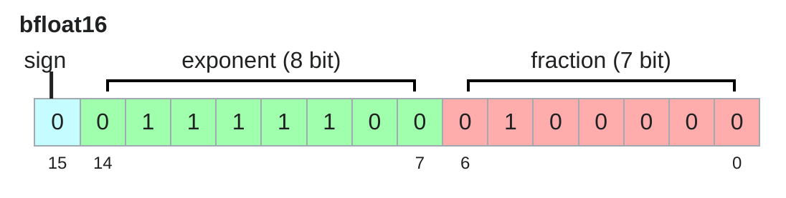

# Lecture 2 — PyTorch, Resource Accounting (course material)

This is the written content of CS336 Lecture 2, transcribed from
[`lecture_02.py`](https://github.com/stanford-cs336/lectures/blob/main/lecture_02.py).
Run it, or step through it in the browser, at
<https://cs336.stanford.edu/lectures/?trace=lecture_02>.

The spoken lecture follows this program closely but not exactly — Percy digresses,
answers questions, and expands on points that the source states in one line. For
what was *said*, see [the transcript](../transcripts/02-pytorch-resource-accounting.md).
For what was *written*, use this file.

## Sections → source lines

| Section | Function | Lines |
| --- | --- | --- |
| [Announcements and framing](#announcements-and-framing) | `main()` | 16–68 |
| [Motivating questions](#motivating-questions) | `motivating_questions()` | 71–86 |
| [Tensors — basics](#tensors--basics) | `tensors_basics()` | 89–110 |
| [Tensors — memory and data types](#tensors--memory-and-data-types) | `tensors_memory()` | 113–181 |
| [Tensors on GPUs](#tensors-on-gpus) | `tensors_on_gpus()` | 184–199 |
| [einops](#einops) | `tensor_einops()` | 202–211 |
| [einops — motivation](#einops--motivation) | `einops_motivation()` | 214–219 |
| [einops — einsum](#einops--einsum) | `einops_einsum()` | 222–247 |
| [einops — reduce](#einops--reduce) | `einops_reduce()` | 250–258 |
| [einops — rearrange](#einops--rearrange) | `einops_rearrange()` | 261–276 |
| [FLOPs of tensor operations](#flops-of-tensor-operations) | `tensor_operations_flops()` | 279–335 |
| [Arithmetic intensity](#arithmetic-intensity) | `arithmetic_intensity()` | 338–360 |
| [ReLU](#relu--memory-bound) | `arithmetic_intensity_relu()` | 363–397 |
| [GeLU](#gelu--still-memory-bound) | `arithmetic_intensity_gelu()` | 400–415 |
| [Dot product](#dot-product--memory-bound) | `arithmetic_intensity_dot_product()` | 418–431 |
| [Matrix-vector product](#matrixvector-product--memory-bound) | `arithmetic_intensity_matrix_vector_product()` | 434–446 |
| [Matrix-matrix product](#matrixmatrix-product--compute-bound) | `arithmetic_intensity_matmul()` | 449–468 |
| [Roofline plots](#roofline-plots) | `roofline_plots()` | 471–481 |
| [A deep network](#a-deep-network) | `deep_network()`, `Block`, `DeepNetwork` | 559–599 |
| [Gradients — basics](#gradients--basics) | `gradients_basics()` | 484–499 |
| [Gradients — FLOPs](#gradients--flops) | `gradients_flops()` | 502–556 |
| [Optimizer, memory and compute](#optimizer-memory-and-compute) | `optimizer()`, `AdaGrad` | 602–680 |
| [Training loop](#training-loop) | `train_loop()` | 683–715 |
| [Gradient accumulation](#gradient-accumulation) | `gradient_accumulation()` | 718–730 |
| [Activation checkpointing](#activation-checkpointing) | `activation_checkpointing()`, `DeepNetworkCheckpointed` | 733–788 |
| [Summary](#summary) | `main()` | 61–68 |
| [Helper functions](#helper-functions) | `get_memory_usage`, `get_promised_flop_per_sec`, `benchmark`, `get_num_parameters` | 791–853 |

The top-level order is set by `main()` (lines 16–68):

```python
def main():
    # ... announcements ...
    motivating_questions()

    # Memory accounting
    tensors_basics()
    tensors_memory()
    tensors_on_gpus()

    # Compute accounting
    tensor_einops()
    tensor_operations_flops()

    arithmetic_intensity()

    # Memory and compute accounting for training
    deep_network()
    gradients_basics()
    gradients_flops()
    optimizer()
    train_loop()

    # More memory optimizations
    gradient_accumulation()
    activation_checkpointing()
```

Note that `deep_network()` runs *before* `gradients_basics()` even though it is
defined later in the file. Sections below are in execution order.

---

## Announcements and framing

Announcements:

- Join the CS336 slack
- Sign up on Modal with your **Stanford** email
- Read the [AI policy guide](https://docs.google.com/document/d/1SZAlExB1qAc9izHt54gwunNpjKE6wXb8Y7yA_e-baK8/edit?tab=t.0)
- Read the [cluster guide](https://docs.google.com/document/d/1cHE0iKVyXLJ3XpIs2XuXTmZ-HMmPk2hIPeCvy-AydMg/edit?tab=t.otis27tacaef)

Marin 1e23 FLOPs run finished and
[matched forecasts](https://x.com/WilliamBarrHeld/status/2039373983632814318)!

*Figure: <https://pbs.twimg.com/media/HE1P1HmaUAAjLXF?format=jpg&name=medium> (width 800).*

Last lecture: overview, tokenization. Today: resource accounting (systems).

Recall: what's the best model one can train given fixed resources (compute,
memory)? In other words: maximize (computational) **efficiency**. Prerequisite:
understand the resources (compute, memory) for a given computation.

What knowledge to take away from this lecture:

- **Mechanics**: straightforward (PyTorch semantics)
- **Mindset**: resource accounting (remember to do it)
- **Intuitions**: get a sense of how resources are spent, no ML magic today

---

## Motivating questions

**Question**: How long would it take to train a 70B parameter model on 15T tokens
on 1024 H100s?

```python
total_flops = 6 * 70e9 * 15e12                                    # 6.3e24 (computed)
h100_flop_per_sec = 1979e12 / 2                                   # 9.895e14
mfu = 0.5
flops_per_day = h100_flop_per_sec * mfu * 1024 * 60 * 60 * 24     # 4.377e22 (computed)
days = total_flops / flops_per_day                                # 143.9 (computed)
```

So roughly **144 days**.

**Question**: What's the largest model that can you can train on 8 H100s using
AdamW?

```python
h100_bytes = 80e9
bytes_per_parameter = 2 + 2 + (4 + 4)   # parameters (2), gradients (2), optimizer state (4 + 4) = 12 (computed)
num_parameters = (h100_bytes * 8) / bytes_per_parameter   # 5.33e10 (computed)
```

So roughly **53 billion parameters**.

Caveat: activations are not accounted for (depends on batch size and sequence
length), so this is an upper bound.

This is a rough back-of-the-envelope calculation. But it gives you the flavor of
napkin math one can quickly do to get a sense of resources.

---

## Tensors — basics

Tensors are the basic building block for storing everything:

- data
- parameters
- gradients
- optimizer state
- activations

Example: parameters of the DeepSeek v3.2 model
([DeepSeek-V3.2, 2025](https://huggingface.co/deepseek-ai/DeepSeek-V3.2?show_file_info=model.safetensors.index.json)).

Each tensor has a **rank**, which is the number of dimensions.

```python
x = torch.zeros(4)        # rank 1 tensor (vector)
x = torch.zeros(4, 8)     # rank 2 tensor (matrix)
x = torch.zeros(4, 8, 2)  # rank 3 tensor
```

In Transformers, will see tensors of rank 4:

```python
B = 32   # Batch size
S = 16   # Sequence length
H = 16   # Number of heads
D = 64   # Hidden dimension per head
x = torch.zeros(B, S, H, D)
```

---

## Tensors — memory and data types

Elements of tensors are generally floating point numbers.

### fp32

*Figure: `images/fp32.png` (width 700).*


*IEEE 754 single-precision: 1 sign bit, 8 exponent bits (30 down to 23), 23 fraction bits (22 down to 0). Source: [`images/fp32.png`](https://github.com/stanford-cs336/lectures/blob/main/images/fp32.png) in the lectures repo.*
([Wikipedia](https://en.wikipedia.org/wiki/Single-precision_floating-point_format))

The fp32 data type (also known as float32 or single precision) is the default.
Traditionally, in scientific computing, fp32 is the baseline; you could use
double precision (fp64) in some cases. In deep learning, you can be a lot
sloppier.

Let's examine memory usage of these tensors. Memory is determined by (i) the
number of values and (ii) the data type of each value.

```python
x = torch.zeros(4, 8)
assert x.dtype == torch.float32   # Default type
assert x.numel() == 4 * 8
assert x.element_size() == 4      # Float is 4 bytes
assert get_memory_usage(x) == 4 * 8 * 4   # 128 bytes
```

One matrix in the feedforward layer of GPT-3:

```python
assert get_memory_usage(torch.empty(12288 * 4, 12288)) == 2304 * 1024 * 1024  # 2.3 GB
```

### fp16

*Figure: `images/fp16.png` (width 400).*


*IEEE half-precision: 1 sign bit, 5 exponent bits (14 down to 10), 10 fraction bits (9 down to 0). Source: [`images/fp16.png`](https://github.com/stanford-cs336/lectures/blob/main/images/fp16.png) in the lectures repo.*
([Wikipedia](https://en.wikipedia.org/wiki/Half-precision_floating-point_format))

The fp16 data type (also known as float16 or half precision) cuts down the
memory.

```python
x = torch.zeros(4, 8, dtype=torch.float16)
assert x.element_size() == 2
```

However, the dynamic range (especially for small numbers) isn't great.

```python
x = torch.tensor([1e-8], dtype=torch.float16)
assert x == 0   # Underflow!
```

If this happens when you train, you can get instability.

### bf16

*Figure: `images/bf16.png` (width 400).*



*bfloat16: 1 sign bit, 8 exponent bits (14 down to 7), 7 fraction bits (6 down to 0). The exponent field is the same width as fp32's, which is exactly why bf16 keeps fp32's dynamic range and gives up precision instead. Source: [`images/bf16.png`](https://github.com/stanford-cs336/lectures/blob/main/images/bf16.png) in the lectures repo.*
([Wikipedia](https://en.wikipedia.org/wiki/Bfloat16_floating-point_format))

Google Brain developed brain floating point (bf16) in 2018 to address this issue.
bf16 uses the same memory as fp16 but has the same dynamic range as fp32! The
only catch is that the resolution is worse, but this matters less for deep
learning.

```python
x = torch.tensor([1e-8], dtype=torch.bfloat16)
assert x != 0   # No underflow!
```

### Mixed precision

Implications on training:

- Training with fp32 works, but requires lots of memory.
- Training with fp16 and even bf16 is risky, and you can get instability.

Solution: **mixed precision training**
([arXiv:1710.03740](https://arxiv.org/pdf/1710.03740.pdf))

- Use bf16 for parameters, activations, and gradients
- Use fp32 for optimizer states

PyTorch has an automatic mixed precision (AMP) library
([docs](https://pytorch.org/docs/stable/amp.html)). Tries to cast things into
bf16 when safe (matmuls, not exp).

```python
with torch.amp.autocast("cuda", dtype=torch.bfloat16):
    x = torch.zeros(4, 8)
```

### fp8

In 2022, fp8 was standardized, motivated by machine learning workloads
([primer](https://docs.nvidia.com/deeplearning/transformer-engine/user-guide/examples/fp8_primer.html)).

*Figure: <https://docs.nvidia.com/deeplearning/transformer-engine/user-guide/_images/fp8_formats.png> (width 600).*

H100s support two variants of FP8: **E4M3** (range [-448, 448]) and **E5M2**
([-57344, 57344]). Reference: [arXiv:2209.05433](https://arxiv.org/pdf/2209.05433.pdf)

### fp4

In 2025, NVIDIA developed
[nvfp4](https://developer.nvidia.com/blog/introducing-nvfp4-for-efficient-and-accurate-low-precision-inference/).
Only 4 bits per value! Values: -6, -4, -3, -2, -1.5, -1.0, -0.5, 0.0, 0.5, 1.0,
1.5, 2, 3, 4, 6.

Use a separate scale factor per block, so actually get more dynamic range (but
just can't vary freely from neighbors). Nemotron 3 Super was trained in NVFP4
(Nemotron 3 Super, 2026).

Some of this is done in NVIDIA libraries outside of user control.

---

## Tensors on GPUs

By default, tensors are stored in CPU memory.

```python
x = torch.zeros(32, 32)
assert x.device == torch.device("cpu")
```

However, what about GPUs?

*Figure: `images/cpu-gpu.png` (width 600).*


*CPU and GPU as two boxes joined by the PCI bus. The CPU side holds one CPU over its RAM; the GPU side holds six streaming multiprocessors over a shared DRAM block. Source: [`images/cpu-gpu.png`](https://github.com/stanford-cs336/lectures/blob/main/images/cpu-gpu.png) in the lectures repo.*

In order to take advantage of the massive parallelism of GPUs, we need to move
them to GPU memory.

```python
x = x.to(device)
```

Or create the tensor directly on the GPU:

```python
with torch.device(device):
    x = torch.zeros(32, 32)
    assert x.device == device
```

---

## einops

Einops is a library for manipulating tensors where dimensions are **named**. It
is inspired by Einstein summation notation (Einstein, 1916).
([Einops tutorial](https://einops.rocks/1-einops-basics/))

### einops — motivation

Traditional PyTorch code:

```python
x = torch.ones(2, 2, 3)      # batch seq hidden
y = torch.ones(2, 2, 3)      # batch seq hidden
z = x @ y.transpose(-2, -1)  # batch seq seq
```

Easy to mess up the dimensions (what is -2, -1?)...

### einops — einsum

Einsum is generalized matrix multiplication with good bookkeeping.

```python
x = torch.ones(3, 4)  # seq1 hidden
y = torch.ones(4, 3)  # hidden seq2

# Old way
z = x @ y             # seq1 seq2

# New (einops) way
z = einsum(x, y, "seq1 hidden, hidden seq2 -> seq1 seq2")
```

Let's try a more complex example...

```python
x = torch.ones(2, 3, 4)  # batch seq1 hidden
y = torch.ones(2, 3, 4)  # batch seq2 hidden

# Old way
z = x @ y.transpose(-2, -1)  # batch seq1 seq2

# New (einops) way
z = einsum(x, y, "batch seq1 hidden, batch seq2 hidden -> batch seq1 seq2")
```

Dimensions that are not named in the output are **summed over**.

Or can use `...` to represent broadcasting over any number of dimensions:

```python
z = einsum(x, y, "... seq1 hidden, ... seq2 hidden -> ... seq1 seq2")
```

### einops — reduce

You can reduce a single tensor via some operation (e.g., sum, mean, max, min).

```python
x = torch.ones(2, 3, 4)  # batch seq hidden

# Old way
y = x.sum(dim=-1)

# New (einops) way
y = reduce(x, "... hidden -> ...", "sum")
```

### einops — rearrange

Sometimes, a dimension represents two dimensions ...and you want to operate on
one of them.

```python
x = torch.ones(3, 8)  # seq total_hidden
# ...where `total_hidden` is a flattened representation of `heads * hidden1`
w = torch.ones(4, 4)  # hidden1 hidden2

# Break up `total_hidden` into two dimensions (`heads` and `hidden1`)
x = rearrange(x, "... (heads hidden1) -> ... heads hidden1", heads=2)

# Perform the transformation by `w`
x = einsum(x, w, "... hidden1, hidden1 hidden2 -> ... hidden2")

# Combine `heads` and `hidden2` back together
x = rearrange(x, "... heads hidden2 -> ... (heads hidden2)")
```

---

## FLOPs of tensor operations

Having gone through all the operations, let us examine their computational cost.

A **floating-point operation (FLOP)** is a basic operation like addition (x + y)
or multiplication (x y).

Two terribly confusing acronyms (pronounced the same!):

- **FLOPs**: floating-point operations (measure of computation done)
- **FLOP/s**: floating-point operations per second (also written as FLOPS), which
  is used to measure the speed of hardware.

### Intuitions

- Training GPT-3 (2020) took **3.14e23 FLOPs**.
  ([article](https://lambdalabs.com/blog/demystifying-gpt-3))
- Training GPT-4 (2023) is speculated to take **2e25 FLOPs**.
  ([article](https://patmcguinness.substack.com/p/gpt-4-details-revealed))

H100 has a peak performance of **1979 teraFLOP/s with sparsity, 50% without**
([spec](https://resources.nvidia.com/en-us-tensor-core/nvidia-tensor-core-gpu-datasheet)),
so `h100_flop_per_sec = 1979e12 / 2 = 9.895e14`.

8 H100s for 2 weeks:

```python
total_flops = 8 * 2 * (60 * 60 * 24 * 7) * h100_flop_per_sec   # 9.575e21 (computed)
```

### Linear model

```python
if torch.cuda.is_available():
    B = 16384  # Number of points
    D = 32768  # Dimension of each point
    K = 8192   # Number of outputs
else:
    B = 1024
    D = 256
    K = 64

x = torch.ones(B, D, device=cuda_if_available())
w = torch.randn(D, K, device=cuda_if_available())
y = x @ w
```

How many FLOPs is this matmul? We have one multiplication (`x[i][j] * w[j][k]`)
and one addition per `(i, j, k)` triple.

```python
actual_num_flops = 2 * B * D * K   # 8.796e12 on GPU dims, 3.355e7 on CPU dims (computed)
```

We can also time this operation to see how long it takes.

```python
actual_time = benchmark(lambda: x @ w)
actual_flop_per_sec = actual_num_flops / actual_time
```

*(machine-dependent, not reproduced — `actual_time` and `actual_flop_per_sec`
depend on the GPU the program runs on.)*

Each GPU has a specification sheet that provides the peak performance — for
example the [H100 spec](https://resources.nvidia.com/en-us-gpu-resources/h100-datasheet-24306).
Note that the FLOP/s depends heavily on the data type! `promised_flop_per_sec =
get_promised_flop_per_sec(x.dtype)` — see [Helper functions](#helper-functions)
for the per-GPU, per-dtype table this returns.

### Model FLOPs utilization (MFU)

Definition: **MFU = (actual FLOP/s) / (promised FLOP/s)** [ignore
communication/overhead].

```python
mfu = actual_flop_per_sec / promised_flop_per_sec if promised_flop_per_sec else None
```

*(machine-dependent, not reproduced.)*

Usually, MFU of **≥ 0.5** is quite good!

But why is MFU not closer to 1? To answer this question, we need to look more
closely at how computations are done on GPUs...

---

## Arithmetic intensity

*Figure: `images/compute-memory.png` (width 300).*


*Compute and memory as two blocks joined by a narrow pipe: many small arithmetic units against one wide memory block, the thin connector standing for the bandwidth between them. Source: [`images/compute-memory.png`](https://github.com/stanford-cs336/lectures/blob/main/images/compute-memory.png) in the lectures repo.*

How to compute a thing:

1. Send inputs from memory to accelerator
2. Perform computation
3. Send outputs from accelerator to memory

How long does this take? Depends on two things:

1. Accelerator speed (FLOP/s)
2. Memory bandwidth (bytes/s)

```python
assert h100_flop_per_sec == 1979e12 / 2    # Half without sparsity
assert h100_bytes_per_sec == 3.35e12
```

Those two constants come from `facts.py`, and every calculation below uses them.

### ReLU — memory-bound

```python
n = 1024 * 1024
x = torch.ones(n, dtype=torch.bfloat16, device=cuda_if_available())
y = torch.relu(x)

bytes = (2 * n) + (2 * n)   # Read x, write y (bf16 is 2 bytes/float) = 4,194,304 (computed)
flops = n                   # n comparisons = 1,048,576 (computed)

communication_time = bytes / h100_bytes_per_sec   # 1.252e-6 s (computed)
computation_time = flops / h100_flop_per_sec      # 1.060e-9 s (computed)
```

Assume we can overlap communication and computation perfectly:

```python
total_time = max(communication_time, computation_time)   # 1.252e-6 s (computed)
```

What is the bottleneck?

- **Memory-bound**: communication time > computation time
- **Compute-bound**: computation time > communication time

In this case, ReLU is **memory-bound**.

Alternative way to see this. **Accelerator intensity**: how much work can the
accelerator do per byte transferred?

```python
h100_accelerator_intensity = h100_flop_per_sec / h100_bytes_per_sec   # 295.4 (computed)
```

**Arithmetic intensity**: how much actual work per byte for this workload?

```python
arithmetic_intensity = flops / bytes   # ~1/4 → 0.25 (computed)
```

What is the bottleneck?

- **Memory-bound**: arithmetic intensity < accelerator intensity
- **Compute-bound**: arithmetic intensity > accelerator intensity

```python
assert arithmetic_intensity < h100_accelerator_intensity
```

In general, we'll find ourselves memory bound. Can we increase arithmetic
intensity?

### GeLU — still memory-bound

```python
n = 1024 * 1024
x = torch.ones(n, dtype=torch.bfloat16, device=cuda_if_available())
y = F.gelu(x)   # GELU(x) = 0.5 x (1 + tanh(sqrt(2/pi) (x + 0.044715 x^3)))

bytes = (2 * n) + (2 * n)   # Read x, write y (bf16 is 2 bytes/float) = 4,194,304 (computed)
flops = 20 * n              # tanh can be approximated in various ways (e.g., polynomials) = 20,971,520 (computed)

arithmetic_intensity = flops / bytes   # 5.0 (computed)
assert arithmetic_intensity < h100_accelerator_intensity   # 5.0 < 295.4
```

Note that GeLU does more work than ReLU per byte moved, so it has higher
arithmetic intensity. But still memory-bound! In other words, ReLU is not faster
than GeLU (when doing things in an isolated way).

### Dot product — memory-bound

```python
n = 1024 * 1024
x = torch.ones(n, dtype=torch.bfloat16, device=cuda_if_available())
w = torch.ones(n, dtype=torch.bfloat16, device=cuda_if_available())
y = x @ w

bytes = (2 * n) + (2 * n) + 2   # Read x, read w, write y = 4,194,306 (computed)
flops = 2 * n - 1               # n multiplications, n-1 additions = 2,097,151 (computed)

arithmetic_intensity = flops / bytes   # ~1/2 → 0.4999995 (computed)
```

Memory-bound!

### Matrix–vector product — memory-bound

```python
n = 1024
x = torch.ones(n, dtype=torch.bfloat16, device=cuda_if_available())
w = torch.ones(n, n, dtype=torch.bfloat16, device=cuda_if_available())
y = x @ w

bytes = (2 * n) + (2 * n * n) + (2 * n)   # Read x, read w, write y = 2,101,248 (computed)
flops = n * (2 * n - 1)                   # n dot-products = 2,096,128 (computed)

arithmetic_intensity = flops / bytes   # ~1 → 0.9976 (computed)
```

Memory-bound!

### Matrix–matrix product — compute-bound

```python
n = 1024
x = torch.ones(n, n, dtype=torch.bfloat16, device=cuda_if_available())
w = torch.ones(n, n, dtype=torch.bfloat16, device=cuda_if_available())
y = x @ w

bytes = (2 * n * n) + (2 * n * n) + (2 * n * n)   # Read x, read w, write y = 6,291,456 (computed)
flops = n * n * (2 * n - 1)                       # n^2 dot products = 2,146,435,072 (computed)

arithmetic_intensity = flops / bytes   # ~n/3 → 341.17 (computed; n/3 = 341.33)
assert arithmetic_intensity > h100_accelerator_intensity   # 341.17 > 295.4
```

Finally, **compute-bound**!

- As long as we have large matrices, we're compute-bound (saturating the
  accelerator).
- Training Transformers involves big matrix multiplications.
- Matrix-vector product is what happens during inference, which is why inference
  is memory-bound.

Note: arithmetic/accelerator intensity also depends on the precision (bf16 versus
fp32).

### Roofline plots

We can visualize the relationship between arithmetic intensity and performance
using roofline plots.

*Figure: <https://jax-ml.github.io/scaling-book/assets/img/roofline-improved-1400.webp> (width 600).*

- Each slice on the x-axis is a particular computation (with some arithmetic
  intensity)
- Each piecewise linear function corresponds to a particular hardware
- Kink is the accelerator intensity (transition from memory-bound to
  compute-bound)

We can now relate this back to MFU:

**MFU = min(1, arithmetic-intensity / accelerator-intensity)**

([reference](https://jax-ml.github.io/scaling-book/roofline/))

---

## A deep network

*Figure: `images/deep-network.png` (width 800).*


*A three-layer MLP drawn as tensors: a B x D input, then linear (D x D), ReLU, linear, ReLU, linear, ReLU, to a B x D output, with every intermediate activation shown at its B x D shape. Source: [`images/deep-network.png`](https://github.com/stanford-cs336/lectures/blob/main/images/deep-network.png) in the lectures repo.*

Consider a deep network with L layers and D-dimensional inputs, activations, and
outputs.

```python
D = 8  # Dimensionality of input, activations, and output
L = 3  # Number of layers
model = DeepNetwork(dim=D, num_layers=L).to(cuda_if_available())

num_parameters = get_num_parameters(model)   # 192 (computed)
assert num_parameters == (D * D) * L

# Run the model on a batch of data
B = 4  # Batch size
x = torch.randn(B, D, device=cuda_if_available())
y = model(x)
```

The two modules used throughout the rest of the lecture:

```python
class Block(nn.Module):
    """Simple block that applies a linear transformation followed by a ReLU nonlinearity."""
    def __init__(self, dim: int):
        super().__init__()
        self.weight = nn.Parameter(torch.randn(dim, dim) / math.sqrt(dim))

    def forward(self, x: torch.Tensor) -> torch.Tensor:
        x = x @ self.weight  # Linear
        x = F.relu(x)        # Activation
        return x


class DeepNetwork(nn.Module):
    """Map `dim`-vector to a `dim`-vector."""
    def __init__(self, dim: int, num_layers: int):
        super().__init__()
        self.layers = nn.ModuleList([Block(dim) for i in range(num_layers)])

    def forward(self, x: torch.Tensor) -> torch.Tensor:
        # Apply all the layers sequentially
        for layer in self.layers:
            x = layer(x)
        return x
```

Note the initialization: each weight is `torch.randn(dim, dim) / math.sqrt(dim)`.

---

## Gradients — basics

So far, we've constructed tensors and passed them through operations (forward).
Now, we're going to compute the gradient (backward).

As a simple example, let's consider the simple linear model: `y = 0.5 (x * w - 5)^2`

Forward pass: compute loss.

```python
x = torch.tensor([1., 2, 3])
w = torch.tensor([1., 1, 1], requires_grad=True)  # Want gradient
pred_y = x @ w
loss = 0.5 * (pred_y - 5).pow(2)
```

Backward pass: compute gradients.

```python
loss.backward()
assert torch.equal(w.grad, torch.tensor([1, 2, 3]))
```

---

## Gradients — FLOPs

Let us count the FLOPs for computing gradients.

*Figure: `images/deep-network.png` (width 800).*

```python
B = 1024  # Number of points
D = 256   # Dimension
```

Define a simplified model (2-layer linear network):

```python
x = torch.ones(B, D, device=cuda_if_available())
w1 = torch.randn(D, D, device=cuda_if_available(), requires_grad=True)
w2 = torch.randn(D, D, device=cuda_if_available(), requires_grad=True)

# Forward pass
h1 = einsum(x, w1, "batch in, in out -> batch out")   # x @ w1
h2 = einsum(h1, w2, "batch in, in out -> batch out")  # h1 @ w2
loss = (h2.mean() - 0)**2   # Regress everything to 0 (arbitrary)

# Backward pass
h1.retain_grad()  # For debugging
h2.retain_grad()  # For debugging
loss.backward()
```

### Zoom in on one layer

Let's focus on the second layer (`h2 = h1 @ w2`).

**Forward pass**: recall the number of forward FLOPs:

```python
num_forward_flops = 2 * B * D * D   # 134,217,728 (computed)
```

**Backward pass**: how many FLOPs is running the backward pass? We need to
compute:

- `h1.grad = d loss / d h1`
- `w2.grad = d loss / d w2`

```python
h1_grad = einsum(h2.grad, w2, "batch out, in out -> batch in")
assert torch.allclose(h1.grad, h1_grad)

w2_grad = einsum(h2.grad, h1, "batch out, batch in -> in out")
assert torch.allclose(w2.grad, w2_grad)

num_backward_flops = (2 * B * D * D) + (2 * B * D * D)   # 268,435,456 (computed)
```

Note that the backward pass is **2x more expensive** than the forward pass.

### Consider all layers

This was just for `w2`, need to apply it to all parameters in the network.
Putting it together:

- **Forward pass**: 2 (# data points) (# parameters) FLOPs
- **Backward pass**: 4 (# data points) (# parameters) FLOPs
- **Total**: 6 (# data points) (# parameters) FLOPs

This is for multilayer perceptrons (MLPs) ...but it turns out to be a good
approximation for Transformers for short context lengths as well.

---

## Optimizer, memory and compute

Recall our deep network.

```python
B = 2  # Batch size
D = 4  # Dimensionality of input, activations, and output
L = 3  # Number of layers
model = DeepNetwork(dim=D, num_layers=L).to(cuda_if_available())
```

Let's define the AdaGrad optimizer. The family, stated as a sequence of additions:

- **momentum** = SGD + exponential averaging of grad
- **AdaGrad** = SGD + averaging by grad^2
- **RMSProp** = AdaGrad but with exponential averaging of grad^2
- **Adam** = RMSProp + momentum

AdaGrad (Duchi et al., 2011).

```python
optimizer = AdaGrad(model.parameters(), lr=0.01)
state = model.state_dict()

# Compute gradients
x = torch.randn(B, D, device=cuda_if_available())
y = torch.tensor([4., 5.], device=cuda_if_available())
pred_y = model(x).mean()
loss = F.mse_loss(input=pred_y, target=y)
loss.backward()

# Take a step
optimizer.step()
optimizer_state = {i: dict(p_state) for i, (p, p_state) in enumerate(optimizer.state.items())}

# Free up the memory
optimizer.zero_grad(set_to_none=True)
```

The optimizer itself:

```python
class AdaGrad(torch.optim.Optimizer):
    def __init__(self, params: Iterable[nn.Parameter], lr: float = 0.01):
        super(AdaGrad, self).__init__(params, dict(lr=lr))

    def step(self):
        for group in self.param_groups:
            lr = group["lr"]
            for p in group["params"]:
                # Optimizer state
                state = self.state[p]
                grad = p.grad.data

                # Get squared gradients g2 = sum_{i<t} g_i^2
                g2 = state.get("g2", torch.zeros_like(grad))

                # Update optimizer state
                g2 += torch.square(grad)
                state["g2"] = g2

                # Update parameters
                p.data -= lr * grad / torch.sqrt(g2 + 1e-5)
```

### Memory

```python
num_parameters = D * D * L               # 48 (computed)
parameter_memory = 2 * num_parameters    # (2 bytes for bf16) = 96 (computed)
gradient_memory = 2 * num_parameters     # (2 bytes for bf16) = 96 (computed)
optimizer_state_memory = 4 * num_parameters   # (4 bytes for fp32) = 192 (computed)
activation_memory = 2 * (B * D * L)      # (2 bytes for bf16) = 48 (computed)
```

It is customary to use fp32 for stability (accumulating averages over powers over
many steps). Optimizer state memory:

- **AdaGrad**: 4 bytes/parameter for storing second moments
- **Adam**: 8 bytes/parameter for storing first and second moments

Putting it all together:

```python
total_memory = parameter_memory + activation_memory + gradient_memory + optimizer_state_memory   # 432 (computed)
```

### Compute (for one training step)

```python
num_parameters = D * D * L
flops = 6 * B * num_parameters   # 576 (computed)
```

### Transformers

The accounting for a Transformer is more complicated, but the same idea.
Assignment 1 will ask you to do that.

- Blog post describing memory usage for Transformer training:
  [erees.dev/transformer-memory](https://erees.dev/transformer-memory/)
- Blog post describing FLOPs for a Transformer:
  [adamcasson.com/posts/transformer-flops](https://www.adamcasson.com/posts/transformer-flops)

---

## Training loop

```python
# True linear function with weights (0, 1, 2, ..., D-1)
D = 16  # Dimensionality
true_w = torch.arange(D, dtype=torch.float32, device=cuda_if_available())

# Data loader that generates (x, y) pairs
B = 4  # Batch size
def get_batch() -> tuple[torch.Tensor, torch.Tensor]:
    x = torch.randn(B, D).to(cuda_if_available())
    true_y = x @ true_w
    return (x, true_y)

# Define the model and optimizer
L = 2  # Number of layers
model = DeepNetwork(dim=D, num_layers=L).to(cuda_if_available())
optimizer = AdaGrad(model.parameters(), lr=0.01)

# Train!
num_train_steps = 3
for t in range(num_train_steps):
    # Get data
    x, y = get_batch()

    # Forward (compute loss)
    pred_y = model(x).mean()
    loss = F.mse_loss(pred_y, y)

    # Backward (compute gradients)
    loss.backward()

    # Update parameters
    optimizer.step()
    optimizer.zero_grad(set_to_none=True)
```

---

## Gradient accumulation

Large batch sizes: improve training stability. However, activation memory scales
with batch size, so might run out.

```python
B = 64     # Batch size
D = 1024   # Dimensionality
L = 16     # Number of layers
activation_memory = 2 * B * D * L   # (2 bytes for bf16) = 2,097,152 (computed)
```

Gradient accumulation:

- Compute gradient on micro batches
- Accumulate the gradients (don't zero it out)
- Every `batch_size / micro_batch_size` steps, update the parameters and zero out
  the gradients

```python
micro_batch_size = B / 4            # 16.0 (computed)
activation_memory = 2 * micro_batch_size * D * L   # 524,288 (computed)
```

---

## Activation checkpointing

For training, we need to store the activations of all layers. For inference, we
don't compute gradients, so we only need to store the current layer's
activations.

*Figure: `images/deep-network.png` (width 800).*

The memory usage is

```python
B = 64     # Batch size
D = 1024   # Dimensionality
L = 16     # Number of layers

x = torch.randn(B, D, device=cuda_if_available(), requires_grad=True)
activation_memory = 2 * B * D * L   # 2,097,152 (computed)

model = DeepNetwork(dim=D, num_layers=L).to(cuda_if_available())
memory = get_max_memory_usage(lambda: model(x).sum().backward())
```

*(`memory` is machine-dependent, not reproduced.)*

Can we reduce this?

**Activation checkpointing = gradient checkpointing = rematerialization.** Key
idea:

- Forward pass: keep only activations at subset of layers
- Backward pass: recompute the missing activations from the last checkpoint

Philosophy: **tradeoff memory for compute.**

```
# Store all activations:    x g1 h1 g2 h2 g3 h3 g4 h4
# Activation checkpointing: x    h1    h2    h3    h4
```

Define the model with checkpointing:

```python
model = DeepNetworkCheckpointed(dim=D, num_layers=L).to(cuda_if_available())
checkpointed_memory = get_max_memory_usage(lambda: model(x).sum().backward())
```

*(`checkpointed_memory` is machine-dependent, not reproduced.)*

```python
class DeepNetworkCheckpointed(nn.Module):
    """Same as DeepNetwork, but with activation checkpointing."""
    def __init__(self, dim: int, num_layers: int):
        super().__init__()
        self.layers = nn.ModuleList([Block(dim) for i in range(num_layers)])

    def forward(self, x: torch.Tensor) -> torch.Tensor:
        # Apply all the layers sequentially
        for layer in self.layers:
            # KEY: only store activations at checkpoints, recompute the rest
            x = torch.utils.checkpoint.checkpoint(layer, x)
        return x
```

Can we reduce this even more, especially for deep networks (large L)?

```
# Store all layers:   | h1 h2 h3 h4 h5 h6 h7 h8 h9 |
# Store no layers:    |                            |
# Store some layers:  |    h3       h6          h9 |
```

How frequently to checkpoint?

- If store each layer's activations, then activation memory is O(L) and no
  recomputation.
- If store no activations, then activation memory is O(1) and compute is O(L^2)
  (recompute from the start for each layer).
- If store every sqrt(L) layers, then activation memory is O(sqrt(L)) and O(L)
  recomputation.

---

## Summary

- Everything is operations on tensors (parameters, gradients, activations,
  optimizer states, data)
- einops: better way to think about tensor operations
- 6 (# data points) (# parameters) FLOPs per training step
- Arithmetic intensity / roofline analysis: compute-bound or memory-bound?
- Matrix multiplications are compute-bound, elementwise operations are
  memory-bound
- Gradient accumulation, activation checkpointing: reduce memory to use bigger
  batch sizes

---

## Helper functions

```python
def get_memory_usage(x: torch.Tensor):
    return x.numel() * x.element_size()


def get_promised_flop_per_sec(dtype: torch.dtype) -> float:
    """Return the peak FLOP/s for `device` operating on `dtype`."""
    if not torch.cuda.is_available():
        # No CUDA device available, so can't get FLOP/s
        return 1
    properties = torch.cuda.get_device_properties(cuda_if_available())

    if "A100" in properties.name:
        if dtype == torch.float32:
            return 19.5e12
        if dtype in (torch.bfloat16, torch.float16):
            return 312e12
        raise ValueError(f"Unknown dtype: {dtype}")

    if "H100" in properties.name:
        if dtype == torch.float32:
            return 67.5e12
        if dtype in (torch.bfloat16, torch.float16):
            return 1979e12 / 2  # 1979 is for sparse, dense is half of that
        raise ValueError(f"Unknown dtype: {dtype}")

    if "B200" in properties.name:
        if dtype == torch.float32:
            return 75e12
        if dtype in (torch.bfloat16, torch.float16):
            return 4.5e15 / 2  # 4.5e15 is for sparse, dense is half of that
        raise ValueError(f"Unknown dtype: {dtype}")

    # Unknown GPU: return None so caller can handle gracefully
    return None


def benchmark(func, num_trials: int = 5) -> float:
    """Return the number of seconds required to perform `func`."""
    # Wait until previous CUDA threads are done
    if torch.cuda.is_available():
        torch.cuda.synchronize()

    def run():
        # Perform the operation
        func()

        # Wait until CUDA threads are done
        if torch.cuda.is_available():
            torch.cuda.synchronize()

    # Time the operation `num_trials` times
    total_time = timeit.timeit(run, number=num_trials)

    return total_time / num_trials


def get_num_parameters(model: nn.Module) -> int:
    return sum(param.numel() for param in model.parameters())
```

The peak-FLOP/s table above is the one the lecture's MFU calculation divides by.
The A100 and B200 branches are in the source but were not exercised in the
lecture as delivered.

## References cited

Imported from `references.py`: `deepseek_v3_2_2025`, `adagrad_2011`,
`nemotron_3_super_2026`. Constants imported from `facts.py`:
`h100_flop_per_sec`, `h100_bytes_per_sec`.
