# Lecture 4 — Attention Alternatives and Mixtures of Experts (course material)

This is the written content of CS336 Lecture 4, transcribed page by page from
[`lecture_04.pdf`](https://github.com/stanford-cs336/lectures/blob/main/lecture_04.pdf)
(Tatsunori Hashimoto, Stanford CS336, Spring 2026). Where lecture 3 surveyed how
the standard transformer is tweaked, this deck covers the two places where modern
models depart from it structurally: replacing quadratic attention with something
linear or sparse, and replacing the dense feedforward block with a sparsely
routed mixture of experts.

Headings are **PDF page numbers** — the deck prints no slide numbers. See the
`numbering` note in the front matter.

## Sections → slide ranges

| Section | Slides |
| --- | --- |
| Title | 1 |
| Attention alternatives: why context cost matters, and the basic toolkit | 2–3 |
| Linear attention and its recurrent form | 4–5 |
| Linear-attention hybrids in practice: MiniMax M1, Mamba-2, Nemotron 3, gated DeltaNet, Qwen 3.5 | 6–11 |
| Sparse attention: DeepSeek Sparse Attention | 12–13 |
| Mixture of experts: what an MoE is, and why they became popular | 14–19 |
| MoE results in practice, and why MoEs were slow to catch on | 20–24 |
| Anatomy of an MoE layer, and what varies between them | 25–26 |
| Routing functions: types, top-k in detail, variants and ablations | 27–35 |
| Training MoEs: the discreteness problem, RL and stochastic approximations | 36–39 |
| Load-balancing losses and per-expert biases | 40–43 |
| The systems side: expert parallelism | 44–46 |
| Stability, stochasticity and fine-tuning issues | 47–50 |
| Upcycling a dense model into an MoE | 51–53 |
| DeepSeek MoE v1→v3, plus MLA and multi-token prediction | 54–59 |
| Summary | 60 |

## Slide 1 — Lecture 4: Attention Alternatives and Mixtures of Experts

The title slide. Centred on a white page, in black: "**Lecture 4**". Beneath it,
in blue small-caps: "Attention Alternatives and Mixtures of Experts". Below that,
in grey: "CS336" and "Tatsu H". A wide blue band runs across the bottom of the
page. No figure.

## Slide 2 — Attention alternatives

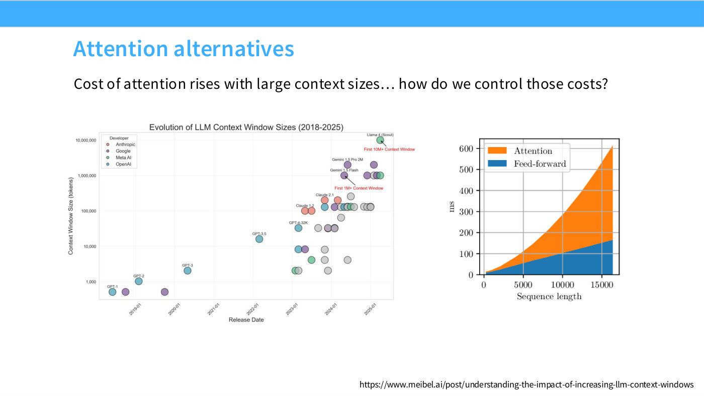

Text: "Cost of attention rises with large context sizes… how do we control those
costs?"

Credit at the foot of the page:
`https://www.meibel.ai/post/understanding-the-impact-of-increasing-llm-context-windows`

**Figure 1 (left) — scatter plot, "Evolution of LLM Context Window Sizes
(2018-2025)".** The x-axis is "Release Date", ticked yearly at 2019-01 through
2025-01; the y-axis is "Context Window Size (tokens)" on a log scale, ticked
1,000 / 10,000 / 100,000 / 1,000,000 / 10,000,000. Points are filled circles.
The legend, titled "Developer", names **four** colour categories — *Anthropic*
(salmon/red), *Google* (purple), *Meta AI* (green), *OpenAI* (blue) — and a
large number of further points are drawn in plain grey (models by developers not
in the legend).

- The cloud rises steeply from bottom-left to top-right. Individually labelled
  points, reading up the trend: **GPT-1** (blue, ~2018, about 512 tokens),
  **GPT-2** (blue, 2019, about 1,000), **GPT-3** (blue, 2020, about 2,000),
  **GPT-3.5** (blue, late 2022, about 16,000), **GPT-4-32K** (blue, early 2023,
  about 32,000), **Claude 1.2** (salmon, 2023, about 100,000), **Claude 2.1**
  (salmon, late 2023, about 200,000), **Gemini 1.5 Flash** (purple, 2024, about
  1,000,000), **Gemini 1.5 Pro 2M** (purple, 2024, about 2,000,000), and
  **Llama 4 (Scout)** (green, 2025, about 10,000,000).
- Two red annotations with arrows: "First 1M+ Context Window" pointing at Gemini
  1.5 Flash, and "First 10M+ Context Window" pointing at Llama 4 (Scout).
- A dense band of unlabelled points sits at roughly 128,000 tokens across
  2024–2025, with scattered grey points down at 4,000–32,000 in the same period.

**Figure 2 (right) — stacked area chart.** The x-axis is "Sequence length",
ticked 0, 5000, 10000, 15000; the y-axis is "ms", ticked 0 to 600 in steps of
100. There are **two** stacked bands, listed in the legend as:

- *Blue*, "Feed-forward": the lower band, growing roughly linearly — about 10 ms
  near sequence length 0, ~55 ms at 5000, ~100 ms at 10000, ~150 ms at 15000, and
  about 165 ms at the right edge (just past 16000).
- *Orange*, "Attention": the upper band, growing superlinearly. The stack total
  (top of the orange band) is about 15 ms near 0, ~110 ms at 5000, ~270 ms at
  10000, ~490 ms at 15000, and about 610 ms at the right edge. The attention
  contribution alone therefore grows from a few ms to roughly 450 ms, overtaking
  feed-forward at around sequence length 4000.

## Slide 3 — The 'basic' toolkit

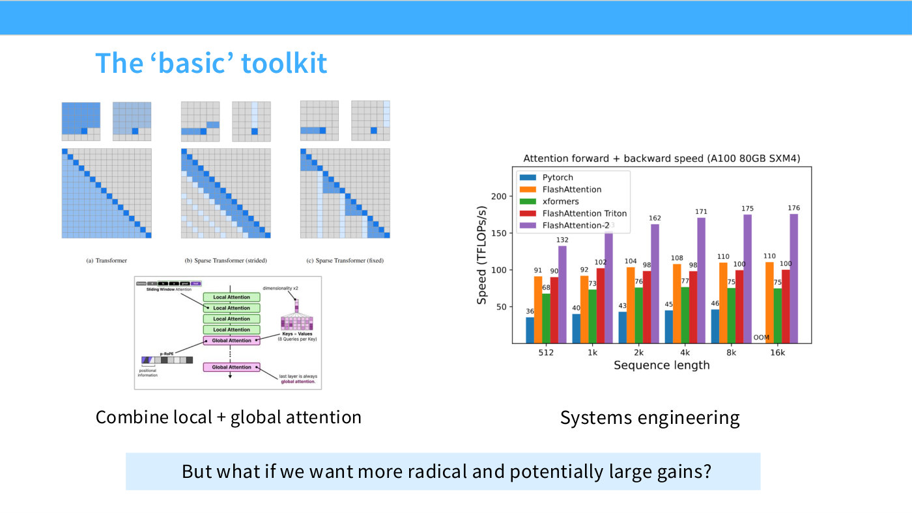

The slide's own text is two captions and a banner. Under the left figure group:
"Combine local + global attention". Under the right figure: "Systems
engineering". Across the bottom, in a pale blue banner: "But what if we want
more radical and potentially large gains?"

**Figure 1 (top left) — attention-mask diagrams, three panels captioned "(a)
Transformer", "(b) Sparse Transformer (strided)", "(c) Sparse Transformer
(fixed)".** Each panel shows a small pair of grids on top (illustrating which
positions one query attends to, with the query cell in dark blue and the attended
cells in medium blue on a grey background) and a large square connectivity matrix
underneath.

- *(a) Transformer*: the large matrix is the full lower triangle filled solid
  light blue with a dark blue diagonal — dense causal attention.
- *(b) Sparse Transformer (strided)*: the large matrix keeps a narrow dark blue
  band along the diagonal plus regularly spaced diagonal stripes of pale blue
  running parallel below it; the rest is grey. The two small grids show a row
  segment and a column segment being attended.
- *(c) Sparse Transformer (fixed)*: the large matrix keeps the diagonal band plus
  a few full pale-blue *columns* at fixed positions; the rest is grey.

**Figure 2 (bottom middle) — a pasted diagram of the Gemma-style local/global
stack.** At the top left, a tokenised strip reads "Gemma | 4 | is | a | great |
tool", labelled "**Sliding Window** Attention". A vertical arrow runs down the
middle of the diagram through a column of boxes: four green boxes labelled
"Local Attention", then a pink box labelled "Global Attention", then a vertical
ellipsis, then another pink "Global Attention" box at the bottom. Arrows from the
"Sliding Window Attention" label point into the green Local Attention boxes. On
the right, an arrow labelled "dimensionality x2" points to a small stack of
purple cells above a fan-out diagram captioned "**Keys = Values** (8 Queries per
Key)", connected to the Global Attention boxes. At the bottom left, a coloured
token strip is labelled "p-RoPE" above and "positional information" below. A note
at the bottom right reads "last layer is always **global attention**."

**Figure 3 (right) — grouped bar chart, "Attention forward + backward speed (A100
80GB SXM4)".** The x-axis is "Sequence length" with six groups: 512, 1k, 2k, 4k,
8k, 16k. The y-axis is "Speed (TFLOPs/s)", ticked 50, 100, 150, 200. There are
**five** series; the legend order matches the left-to-right bar order within each
group:

- *Blue*, "Pytorch": 36, 40, 43, 45, 46, and OOM at 16k (the bar is absent and
  the group is annotated "OOM").
- *Orange*, "FlashAttention": 91, 92, 104, 108, 110, 110.
- *Green*, "xformers": 68, 73, 76, 77, 75, 75.
- *Red*, "FlashAttention Triton": 90, 102, 98, 98, 100, 100.
- *Purple*, "FlashAttention-2": 132, 153, 162, 171, 175, 176. (The 1k label is
  overprinted by the legend box on the page; the bar tops out just above the 150
  gridline and the visible last digit is 3. The value 153 was confirmed
  externally rather than read off the render.)

## Slide 4 — Linear attention

Text: "Consider the usual attention operation.. $Q \in R^{n \times d_k}, K \in R^{n \times d_k}, V \in R^{n \times d_v}$"

$$Attn(Q, K, V) = \rho(QK^\top)V$$

"This is quadratic due to $QK^\top$ ($n^2 d_k$). Can we do better (when $\rho$ is
the identity)?"

In a pale blue box:

$$(QK^\top)V = Q(K^\top V)$$

"This is very silly, but surprisingly important.. We get from $n^2 d_k + n^2 d_v$
to $2 n d_v d_k$"

Citation at the foot: "[Shen et al 2018, Katharopoulos 2020 for kernel version.
Also connections to things like fast weight programmers]".

No figure on this page.

## Slide 5 — Recurrent form of linear attention

Text: "Recall that in purely linear attention, we consider the reordering"

$$(QK^\top)V = Q(K^\top V)$$

"This is linear time (great) but the even nicer thing is that this looks like a
RNN."

$$S_t = S_{t-1} + k_t v_t^\top \quad \text{and} \quad y_t = q_t^\top S_t$$

"This 'duality' allows us to train efficiently (using the parallel, quadratic
form) and inference efficiently (using the serial, linear form)"

At the bottom right: "(Note: if one weights $S_{t-1}$ by $\gamma$, you get a
RetNet)".

No figure on this page.

## Slide 6 — Minimax M1

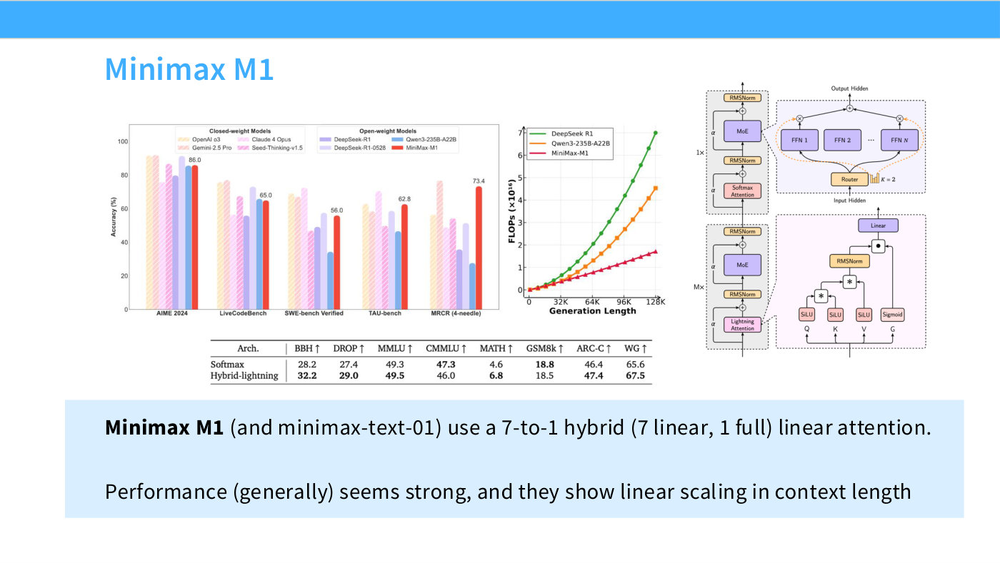

The slide's own text is a pale blue banner across the bottom: "**Minimax M1**
(and minimax-text-01) use a 7-to-1 hybrid (7 linear, 1 full) linear attention."
and, below it, "Performance (generally) seems strong, and they show linear
scaling in context length". Everything above the banner is pasted figures from
the MiniMax-M1 report.

**Figure 1 (left) — grouped bar chart of benchmark accuracy.** The y-axis is
"Accuracy (%)", ticked 0, 20, 40, 60, 80, 100. The x-axis has five benchmark
groups: **AIME 2024**, **LiveCodeBench**, **SWE-bench Verified**, **TAU-bench**,
**MRCR (4-needle)**. There are **eight** series, split across two legend blocks;
within each group the bars run left to right in legend order.

- *Closed-weight Models* (drawn with diagonal hatching): **OpenAI o3** (pale
  orange), **Gemini-2.5 Pro** (pale salmon), **Claude 4 Opus** (pale pink),
  **Seed-Thinking-v1.5** (magenta).
- *Open-weight Models* (solid fill): **DeepSeek-R1** (medium purple),
  **DeepSeek-R1-0528** (pale lavender), **Qwen3-235B-A22B** (blue), **MiniMax-M1**
  (solid red).
- Only the MiniMax-M1 bar carries a printed value in each group: **86.0** on AIME
  2024, **65.0** on LiveCodeBench, **56.0** on SWE-bench Verified, **62.8** on
  TAU-bench, **73.4** on MRCR (4-needle).
- Reading the unlabelled bars approximately: on *AIME 2024* — o3 ≈ 91, Gemini-2.5
  Pro ≈ 92, Claude 4 Opus ≈ 76, Seed-Thinking-v1.5 ≈ 86, DeepSeek-R1 ≈ 79,
  DeepSeek-R1-0528 ≈ 91, Qwen3 ≈ 85, MiniMax-M1 = 86. On *LiveCodeBench* — o3 ≈
  76, Gemini ≈ 76, Claude ≈ 56, Seed ≈ 67, DeepSeek-R1 ≈ 55, R1-0528 ≈ 73, Qwen3
  ≈ 65, M1 = 65. On *SWE-bench Verified* — o3 ≈ 69, Gemini ≈ 67, Claude ≈ 72,
  Seed ≈ 47, DeepSeek-R1 ≈ 49, R1-0528 ≈ 57, Qwen3 ≈ 34, M1 = 56. On *TAU-bench*
  — o3 ≈ 63, Gemini ≈ 58, Claude ≈ 71, Seed ≈ 50, R1-0528 ≈ 58, Qwen3 ≈ 46, M1 =
  62.8 (this group has only seven bars: the DeepSeek-R1 bar is missing). On
  *MRCR (4-needle)* — o3 ≈ 56, Gemini ≈ 76, Claude ≈ 48, Seed ≈
  54, DeepSeek-R1 ≈ 35, R1-0528 ≈ 51, Qwen3 ≈ 27, M1 = 73.4.

**Figure 2 (middle) — line chart of inference cost.** The x-axis is "Generation
Length", ticked 0, 32K, 64K, 96K, 128K; the y-axis is "FLOPs ($\times 10^{16}$)",
ticked 0 through 7. There are **three** series:

- *Green with round markers*, "DeepSeek R1": convex, rising fastest — about 0.1 at
  8K, 0.45 at 24K, 0.9 at 40K, 1.6 at 56K, 3.0 at 80K, 3.6 at 88K, 4.9 at 104K,
  6.3 at 120K, and 7.0 at 128K.
- *Orange with square markers*, "Qwen3-235B-A22B": also convex but lower — about
  0.1 at 8K, 0.26 at 24K, 0.6 at 40K, 1.05 at 56K, 1.94 at 80K, 2.3 at 88K, 3.15
  at 104K, 4.1 at 120K, and 4.55 at 128K.
- *Crimson with triangle markers*, "MiniMax-M1": very nearly a straight line —
  about 0.08 at 8K, 0.3 at 24K, 0.45 at 40K, 0.65 at 56K, 0.98 at 80K, 1.15 at
  96K, 1.44 at 112K, and 1.7 at 128K. (Markers sit at multiples of 8K.)

**Figure 3 (below the two charts) — a pasted ablation table.** Two architectures
compared on eight benchmarks; the best value in each column is bolded in the
original.

| Arch. | BBH ↑ | DROP ↑ | MMLU ↑ | CMMLU ↑ | MATH ↑ | GSM8k ↑ | ARC-C ↑ | WG ↑ |
| --- | --- | --- | --- | --- | --- | --- | --- | --- |
| Softmax | 28.2 | 27.4 | 49.3 | **47.3** | 4.6 | **18.8** | 46.4 | 65.6 |
| Hybrid-lightning | **32.2** | **29.0** | **49.5** | 46.0 | **6.8** | 18.5 | **47.4** | **67.5** |

(The table has no average or total row.)

**Figure 4 (right) — the MiniMax-M1 architecture diagram.** Two stacked grey
dashed blocks form the model body, each drawn around a vertical residual arrow.

- The *lower* block, marked "**M×**", contains, reading upward: a pink
  "**Lightning Attention**" box whose output joins a $\oplus$ on the residual
  stream (the skip connection is labelled $\alpha$), then an orange "RMSNorm",
  then a purple "**MoE**" box joining a second $\oplus$ (again labelled $\alpha$),
  then another "RMSNorm".
- The *upper* block, marked "**1×**", is identical except the attention box is a
  salmon "**Softmax Attention**".
- Dashed leader lines expand the two coloured boxes into detail panels on the
  right. The **MoE** panel (lavender) shows "Input Hidden" feeding an orange
  "Router"; the router fans out to purple boxes "FFN 1", "FFN 2", "…", "FFN $N$";
  each selected expert's output passes through a $\otimes$ (multiplied by the
  router weight, shown as orange dashed arrows from the router) and the two
  selected paths meet at a $\oplus$ producing "Output Hidden". A small bar-chart
  icon beside the router is annotated "$K = 2$".
- The **Lightning Attention** panel (pink) shows the input fanning out to four
  branches labelled **Q**, **K**, **V**, **G**, each through an activation box —
  SiLU for Q, K and V, and Sigmoid for G. Q and K meet at a $*$ node; that result
  and V meet at a second $*$; the result passes through an orange "RMSNorm", then
  a $\odot$ node where it is combined with the sigmoid gate G, and finally a
  purple "Linear" projection produces the output.

## Slide 7 — From linear attention to Mamba-2

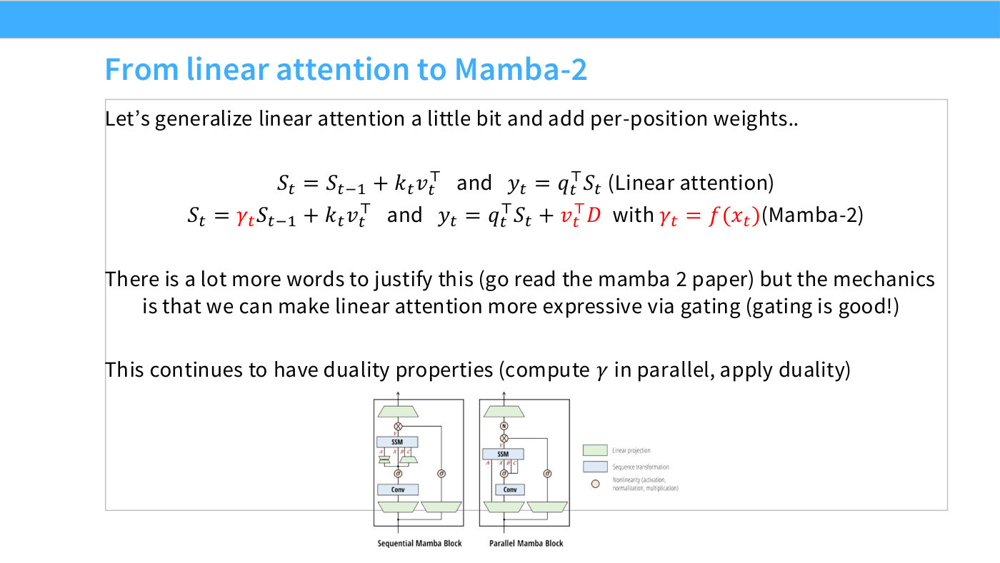

The whole slide sits in a thin black box.

Text: "Let's generalize linear attention a little bit and add per-position
weights.."

$$S_t = S_{t-1} + k_t v_t^\top \quad \text{and} \quad y_t = q_t^\top S_t \quad \text{(Linear attention)}$$
$$S_t = \gamma_t S_{t-1} + k_t v_t^\top \quad \text{and} \quad y_t = q_t^\top S_t + v_t^\top D \quad \text{with } \gamma_t = f(x_t) \quad \text{(Mamba-2)}$$

(In the second line $\gamma_t$, $v_t^\top D$ and $\gamma_t = f(x_t)$ are printed in
red — the parts that are new relative to linear attention.)

"There is a lot more words to justify this (go read the mamba 2 paper) but the
mechanics is that we can make linear attention more expressive via gating (gating
is good!)"

"This continues to have duality properties (compute $\gamma$ in parallel, apply
duality)"

**Figure (bottom centre) — two block diagrams from the Mamba-2 paper, captioned
"Sequential Mamba Block" and "Parallel Mamba Block"**, with a shared three-entry
key on the right: a green trapezoid = "Linear projection", a blue rectangle =
"Sequence transformation", a peach circle = "Nonlinearity (activation,
normalization, multiplication)".

- *Sequential Mamba Block (left).* From the bottom: the input splits into two
  green linear-projection trapezoids. The main branch goes up through a blue
  "**Conv**", a peach $\sigma$, then into small green projections that produce the
  red-labelled parameters **A**, **X**, **B**, **C** feeding a blue "**SSM**" box;
  the SSM output is labelled **Y** in red and passes into a $\otimes$. The side
  branch goes up through its own peach $\sigma$ and into the same $\otimes$ (the
  gate). The product exits through a final green linear projection.
- *Parallel Mamba Block (right).* Same components, but the projections producing
  **A**, **X**, **B**, **C** are computed in parallel directly from the input
  projection rather than after the convolution, and an extra peach circle marked
  "**N**" (a normalization) is inserted between the gating $\otimes$ and the final
  green output projection.

## Slide 8 — Nemotron 3

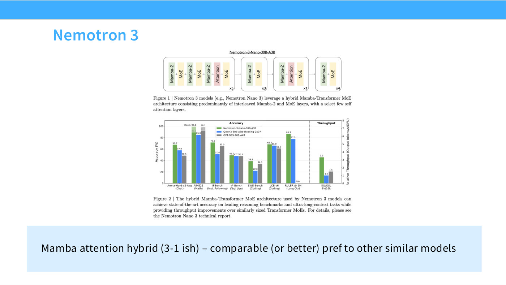

The slide's own text is a pale blue banner across the bottom: "Mamba attention
hybrid (3-1 ish) – comparable (or better) pref to other similar models".
Everything else is two pasted figures from the Nemotron Nano 3 report, with their
original captions.

**Figure 1 (top) — layer-stack diagram, headed "Nemotron-3-Nano-30B-A3B".** Four
rounded-rectangle groups sit left to right, joined by arrows; each group carries
a repetition count in its bottom-right corner. Inside each group the layers are
vertical coloured strips read left to right, joined by small arrows: Mamba-2
layers are green, MoE layers are yellow, Attention layers are pink.

- Group 1, "**×5**": Mamba-2 → MoE → Mamba-2 → MoE → Mamba-2 → Attention → MoE.
- Group 2, "**×3**": Mamba-2 → MoE.
- Group 3, "**×1**": Mamba-2 → Attention → MoE.
- Group 4, "**×4**": Mamba-2 → MoE.

Caption: "**Figure 1** | Nemotron 3 models (e.g., Nemotron Nano 3) leverage a
hybrid Mamba-Transformer MoE architecture consisting predominantly of interleaved
Mamba-2 and MoE layers, with a select few self attention layers."

**Figure 2 (bottom) — grouped bar chart with two panels separated by a dashed
vertical line**, the left panel headed "**Accuracy**" and the right panel headed
"**Throughput**". The left y-axis is "Accuracy (%)", ticked 0, 20, 40, 60, 80,
100; the right y-axis is "Relative Throughput (Output tokens/s/GPU)", ticked 0
through 8. There are **three** series, in legend order and in left-to-right bar
order within each group:

- *Green*, "Nemotron-3-Nano-30B-A3B".
- *Blue*, "Qwen3-30B-A3B-Thinking-2507".
- *Grey*, "GPT-OSS-20B-A4B".

Every bar carries a printed value. By group:

| Group | Nemotron-3-Nano-30B-A3B (green) | Qwen3-30B-A3B-Thinking-2507 (blue) | GPT-OSS-20B-A4B (grey) |
| --- | --- | --- | --- |
| Arena-Hard-v2-Avg (Chat) | 67.7 | 57.8 | 48.5 |
| AIME25 (Math) | 89.1, extended to 99.2 with tools | 85.0 | 91.7, extended to 98.7 |
| IFBench (Inst. Following) | 71.5 | 51.0 | 65.0 |
| $\tau^2$-Bench (Tool Use) | 49.0 | 47.7 | 47.5 |
| SWE-Bench (Coding) | 38.8 | 22.0 | 34.0 |
| LCB v6 (Coding) | 68.2 | 66.0 | 61.0 |
| RULER @ 1M (Long Ctx) | 86.3 | 77.5 | N/A (no bar) |
| ISL/OSL 8k/16k *(throughput axis)* | 3.3 | 1.0 | 1.5 |

In the AIME25 group the green and grey bars each have a pale upper extension
above the solid bar; the solid heights are annotated inside the bar (89.1 green,
91.7 grey) and the extended totals above it (annotated "+tools: 99.2" for the
green bar and "98.7" for the grey).

Caption: "**Figure 2** | The hybrid Mamba-Transformer MoE architecture used by
Nemotron 3 models can achieve state-of-the-art accuracy on leading reasoning
benchmarks and ultra-long-context tasks while providing throughput improvements
over similarly sized Transformer MoEs. For details, please see the Nemotron Nano
3 technical report."

## Slide 9 — Gated delta net (and friends)

Text: "Let's generalize things further – gate the input and selectively erase the
state."

$$S_t = \gamma_t S_{t-1} + k_t v_t^\top \quad \text{and} \quad y_t = q_t^\top S_t + v_t^\top D \quad \text{with } \gamma_t = f(x_t) \quad \text{(Mamba-2)}$$

Then, in a pale blue box:

$$S_t = \gamma_t (I - \beta_t k_t k_t^\top) S_{t-1} + \beta_t k_t v_t^\top \quad \text{and}$$
$$y_t = q_t^\top S_t \quad \text{with } \gamma_t = f(x_t),\ \beta_t = f(x_t) \quad \text{(Gated Delta Net)}$$

"The gated delta net adds a 'no input operation' gate ($\beta = 0$)"
"And *erases* anything in the direction of the current key ($I - \beta_t k_t k_t^\top$)"

Below the box: "Close relationships to various fast weight programming / test time
training ideas."

(In the Mamba-2 line, $\gamma_t$, $v_t^\top D$ and $f(x_t)$ are printed in red; in
the Gated Delta Net line, the newly introduced $\beta_t$ terms are printed in
blue.)

No figure on this page.

## Slide 10 — Qwen 3.5 / Qwen Next

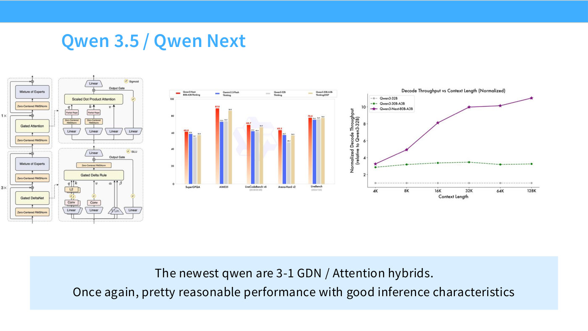

The slide's own text is a pale blue banner across the bottom: "The newest qwen
are 3-1 GDN / Attention hybrids." and "Once again, pretty reasonable performance
with good inference characteristics". Everything above is three pasted figures.

**Figure 1 (left) — the Qwen3-Next architecture diagram.** Two dashed blocks form
the repeating body, each drawn around a residual stream with $\oplus$ junctions.

- The block marked "**1×**" contains, reading up: "Zero-Centered RMSNorm" →
  "**Gated Attention**" → $\oplus$ → "Zero-Centered RMSNorm" → "**Mixture of
  Experts**" → $\oplus$.
- The block marked "**3×**" is identical except the attention sublayer is
  "**Gated DeltaNet**" instead of Gated Attention.
- Dashed leaders expand each attention block into a detail panel on the right.
  The **Gated Attention** panel: four "Linear" projections at the bottom; the
  first two pass through "Zero-Centered RMSNorm" then "Partial Rope" to produce
  $q$ and $k$; the third produces $v$ directly; the fourth passes through a
  $\sigma$ (annotated "Sigmoid" in the panel's key) to form an "Output Gate".
  $q$, $k$, $v$ enter "**Scaled Dot Product Attention**"; its output meets the
  gate at a $\otimes$, then a final "Linear".
  The **Gated DeltaNet** panel: linear projections at the bottom; the $q$/$k$
  branch goes "Linear" → "Conv" → $\sigma$ → "L2" (normalization) producing $q$
  and $k$; the $v$ branch goes "Linear" → "Conv" → $\sigma$; two further small
  linear projections produce $\alpha$ and $\beta$; and a separate "Linear" →
  $\sigma$ produces the "Output Gate". All of $q, k, v, \alpha, \beta$ enter the
  "**Gated Delta Rule**" box, whose output passes through "Zero-Centered RMSNorm",
  then a $\otimes$ with the output gate, then a final "Linear". This panel's key
  marks $\sigma$ as "SiLU".

**Figure 2 (middle) — grouped bar chart of benchmark scores.** The y-axis is
unlabelled but ticked 0, 20, 40, 60, 80, 100. Five benchmark groups along the
x-axis: **SuperGPQA**, **AIME25**, **LiveCodeBench v6** (subtitled
"(25.02-25.05)"), **Arena-Hard v2**, **LiveBench** (subtitled "(20241125)").
There are **four** series; the legend runs left to right in the same order as the
bars within each group:

- *Red*, "Qwen3-Next-80B-A3B-Thinking" (its value is printed in red and larger
  than the others).
- *Blue*, "Gemini-2.5-Flash Thinking".
- *Grey*, "Qwen3-32B Thinking".
- *Tan*, "Qwen3-30B-A3B-Thinking2507".

Every bar is labelled:

| Group | Qwen3-Next-80B-A3B-Thinking | Gemini-2.5-Flash Thinking | Qwen3-32B Thinking | Qwen3-30B-A3B-Thinking2507 |
| --- | --- | --- | --- | --- |
| SuperGPQA | 60.8 | 57.8 | 54.1 | 56.8 |
| AIME25 | 87.8 | 72.0 | 72.9 | 85.0 |
| LiveCodeBench v6 (25.02-25.05) | 68.7 | 61.2 | 60.6 | 66.0 |
| Arena-Hard v2 | 62.3 | 56.7 | 48.4 | 56.0 |
| LiveBench (20241125) | 76.6 | 74.3 | 74.9 | 76.8 |

(A faint watermark logo sits behind the plot area.)

**Figure 3 (right) — line chart, "Decode Throughput vs Context Length
(Normalized)".** The x-axis is "Context Length", ticked 4K, 8K, 16K, 32K, 64K,
128K; the y-axis is "Normalized Decode Throughput (relative to Qwen3-32B)",
ticked 2, 4, 6, 8, 10. There are **three** series:

- *Grey dashed with round markers*, "Qwen3-32B": flat at 1.0 across every context
  length (it is the normalization baseline).
- *Green dashed with round markers*, "Qwen3-30B-A3B": roughly flat — 2.9 at 4K,
  3.2 at 8K, 3.4 at 16K, 3.5 at 32K, 3.2 at 64K, 3.3 at 128K.
- *Purple solid with star markers*, "Qwen3-Next-80B-A3B": rises steadily — 3.3 at
  4K, 4.9 at 8K, 8.1 at 16K, 10.0 at 32K, 10.1 at 64K, 11.0 at 128K.

## Slide 11 — Hybrid performance

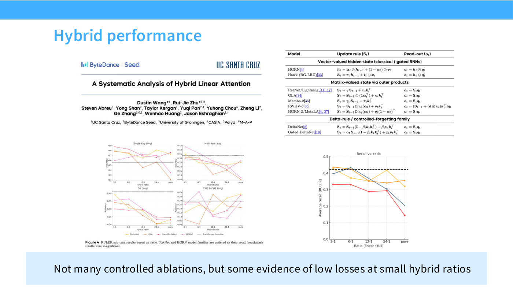

The slide's own text is a pale blue banner across the bottom: "Not many
controlled ablations, but some evidence of low losses at small hybrid ratios".
Everything else is pasted from one paper.

**Figure 1 (top left) — the paper's title block.** ByteDance Seed and UC Santa
Cruz logos, then the title "**A Systematic Analysis of Hybrid Linear
Attention**", then the author list: "Dustin Wang*¹, Rui-Jie Zhu*¹,², Steven
Abreu³, Yong Shan², Taylor Kergan¹, Yuqi Pan²,⁴, Yuhong Chou⁵, Zheng Li², Ge
Zhang²,⁶,†, Wenhao Huang², Jason Eshraghian¹,†", with affiliations "¹UC Santa
Cruz, ²ByteDance Seed, ³University of Groningen, ⁴CASIA, ⁵PolyU, ⁶M-A-P".

**Figure 2 (top right) — a taxonomy table** with three columns, "Model", "Update
rule ($S_t$)" and "Read-out ($o_t$)", divided into three labelled sections. The
bracketed numbers are the paper's own reference citations.

*Section "Vector-valued hidden state (classical / gated RNNs)":*

| Model | Update rule ($S_t$) | Read-out ($o_t$) |
| --- | --- | --- |
| HGRN[4] | $h_t = \alpha_t \odot h_{t-1} + (1 - \alpha_t) \odot v_t$ | $o_t = h_t \odot q_t$ |
| Hawk (RG-LRU)[33] | $h_t = r_t\, h_{t-1} + i_t \odot x_t$ | $o_t = h_t \odot q_t$ |

*Section "Matrix-valued state via outer products":*

| Model | Update rule ($S_t$) | Read-out ($o_t$) |
| --- | --- | --- |
| RetNet/Lightning [11, 17] | $S_t = \gamma\, S_{t-1} + v_t k_t^\top$ | $o_t = S_t q_t$ |
| GLA[34] | $S_t = S_{t-1} \odot (1 \alpha_t^\top) + v_t k_t^\top$ | $o_t = S_t q_t$ |
| Mamba-2[35] | $S_t = \gamma_t\, S_{t-1} + v_t k_t^\top$ | $o_t = S_t q_t$ |
| RWKV-6[36] | $S_t = S_{t-1}\mathrm{Diag}(\alpha_t) + v_t k_t^\top$ | $o_t = (S_{t-1} + (d \odot v_t) k_t^\top) q_t$ |
| HGRN-2/MetaLA[4, 37] | $S_t = S_{t-1}\mathrm{Diag}(\alpha_t) + v_t (1 - \alpha_t)^\top$ | $o_t = S_t q_t$ |

*Section "Delta-rule / controlled-forgetting family":*

| Model | Update rule ($S_t$) | Read-out ($o_t$) |
| --- | --- | --- |
| DeltaNet[5] | $S_t = S_{t-1}(I - \beta_t k_t k_t^\top) + \beta_t v_t k_t^\top$ | $o_t = S_t q_t$ |
| Gated DeltaNet[19] | $S_t = \alpha_t\, S_{t-1}(I - \beta_t k_t k_t^\top) + \beta_t v_t k_t^\top$ | $o_t = S_t q_t$ |

**Figure 3 (bottom left) — four line charts in a 2×2 grid**, titled "Single-Key
(avg)", "Multi-Key (avg)", "QA (avg)" and "CWE & FWE (avg)". Every panel has
x-axis "Hybrid ratio" with ticks 3-1, 6-1, 12-1, 24-1, pure, and y-axis
"Accuracy". A single shared legend below the grid names **four** series plus one
reference line: *yellow* "DeltaNet", *orange* "GLA", *red* "GatedDeltaNet",
*magenta/pink* "HGRN2", and a black dotted horizontal "Transformer baseline"
(a reference line, not a model curve).

- *Single-Key (avg)*, y ticked 0.2–0.9, baseline at ≈0.56. DeltaNet: 0.79, 0.75,
  0.65, 0.81, 0.73. GLA: 0.79, 0.74, 0.45, 0.56, 0.21. GatedDeltaNet: 0.87, 0.83,
  0.69, 0.66, 0.76. HGRN2: 0.59, 0.66, 0.73, 0.70, 0.35.
- *Multi-Key (avg)*, y ticked 0.05–0.45, baseline at ≈0.33. DeltaNet: 0.35, 0.245,
  0.23, 0.22, 0.25. GLA: 0.315, 0.305, 0.11, 0.16, 0.05. GatedDeltaNet: 0.29,
  0.28, 0.245, 0.165, 0.27. HGRN2: 0.435, 0.355, 0.27, 0.21, 0.07.
- *QA (avg)*, y ticked 0.20–0.40, baseline at ≈0.415 (above every curve).
  DeltaNet: 0.39, 0.307, 0.29, 0.204, 0.23. GLA: 0.342, 0.327, 0.257, 0.205, 0.21.
  GatedDeltaNet: 0.30, 0.292, 0.295, 0.248, 0.245. HGRN2: 0.356, 0.365, 0.298,
  0.231, 0.229.
- *CWE & FWE (avg)*, y ticked 0.00–0.40, baseline at ≈0.285. DeltaNet: 0.155,
  0.245, 0.166, 0.33, 0.383. GLA: 0.062, 0.008, 0.375, 0.234, 0.215.
  GatedDeltaNet: 0.271, 0.272, 0.12, 0.174, 0.367. HGRN2: 0.248, 0.412, 0.103,
  0.081, 0.286.

Caption: "**Figure 4** RULER sub task results based on ratio. RetNet and HGRN
model families are omitted as their recall benchmark results were insignificant."

**Figure 4 (bottom right) — a line chart titled "Recall vs. ratio".** x-axis
"Ratio (linear : full)", ticked 3-1, 6-1, 12-1, 24-1, pure; y-axis "Average
recall (RULER)", ticked 0.0 to 0.5 in steps of 0.1. There are **four** curves
plus one black dashed horizontal reference line at ≈0.42 (the transformer
baseline — a reference line, not a fifth series). This panel carries no legend of
its own, so the curves are identified by colour and marker:

- *Red with round markers*: 0.331, 0.330, 0.288, 0.294, 0.144 — lowest at the
  "pure" end.
- *Slate-blue with triangle markers*: 0.396, 0.434, 0.369, 0.305, 0.205.
- *Orange with triangle markers*: 0.432, 0.427, 0.353, 0.340, 0.355.
- *Yellow with square markers*: 0.427, 0.371, 0.352, 0.418, 0.320. (At the 3-1
  ratio the orange series, at 0.434, sits just above this one.)

## Slide 12 — Alternative to hybrids: sparse adaptation


Subtitle, in bold: "Instead of attending to every token, do sparse attention
(DSA)".

Two lines at the foot of the slide: "The indexer can be very lightweight, giving
significant gains" and "Can be 'post hoc' adapted after dense short context
pretraining".

**Figure — a pasted block of paper text with two numbered equations** (from the
DeepSeek Sparse Attention description). It reads:

"**Prototype of DSA.** The prototype of DSA primarily consists of two components:
a lightning indexer and a fine-grained token selection mechanism.

The **lightning indexer** computes the index score $I_{t,s}$ between the query
token $\mathbf{h}_t \in \mathbb{R}^d$ and a preceding token $\mathbf{h}_s \in
\mathbb{R}^d$, determining which tokens to be selected by the query token:

$$I_{t,s} = \sum_{j=1}^{H^I} w^I_{t,j} \cdot \mathrm{ReLU}\left(\mathbf{q}^I_{t,j} \cdot \mathbf{k}^I_s\right), \qquad (1)$$

where $H^I$ denotes the number of indexer heads; $\mathbf{q}^I_{t,j} \in
\mathbb{R}^{d^I}$ and $w^I_{t,j} \in \mathbb{R}$ are derived from the query token
$\mathbf{h}_t$; and $\mathbf{k}^I_s \in \mathbb{R}^{d^I}$ is derived from the
preceding token $\mathbf{h}_s$. We choose ReLU as the activation function for
throughput consideration. Given that the lightning indexer has a small number of
heads and can be implemented in FP8, its computational efficiency is remarkable.

Given the index scores $\{I_{t,s}\}$ for each query token $\mathbf{h}_t$, our
**fine-grained token selection mechanism** retrieves only the key-value entries
$\{\mathbf{c}_s\}$ corresponding to the top-k index scores. Then, the attention
output $\mathbf{u}_t$ is computed by applying the attention mechanism between the
query token $\mathbf{h}_t$ and the sparsely selected key-value entries
$\{\mathbf{c}_s\}$:

$$\mathbf{u}_t = \mathrm{Attn}\left(\mathbf{h}_t, \{\mathbf{c}_s \mid I_{t,s} \in \mathrm{Top\text{-}k}(I_{t,:})\}\right). \qquad (2)$$"

## Slide 13 — DSA – Deepseek Sparse Attention (v3.2, GLM5)


The slide has no body text of its own beyond the title: it is four pasted
figures.

**Figure 1 (top left) — grouped bar chart of DeepSeek-V3.2 benchmark results.**
The left y-axis is "Accuracy / Pass@1 (%)", ticked 0–100 in steps of 20; the
right y-axis is "Codeforces Rating", ticked 0–3000 in steps of 500 (used only by
the Codeforces group). A dashed vertical divider splits the x-axis into two
labelled halves, "**Reasoning Capabilities**" (AIME 2025 *(Pass@1)*, HMMT 2025
*(Pass@1)*, HLE *(Pass@1)*, Codeforces *(Rating)*) and "**Agentic Capabilities**"
(SWE Verified *(Resolved)*, Terminal Bench 2.0 *(Acc)*, $\tau^2$ Bench
*(Pass@1)*, Tool Decathlon *(Pass@1)*). There are **five** series, in legend
order:

- *Solid light blue*, "DeepSeek-V3.2-Speciale" — present only in the four
  reasoning groups.
- *Blue with white diagonal hatching*, "DeepSeek-V3.2-Thinking".
- *Dark grey*, "GPT-5-High".
- *Medium grey*, "Claude-4.5-Sonnet".
- *Very pale grey*, "Gemini-3.0-Pro".

| Group | V3.2-Speciale | V3.2-Thinking | GPT-5-High | Claude-4.5-Sonnet | Gemini-3.0-Pro |
| --- | --- | --- | --- | --- | --- |
| AIME 2025 (Pass@1) | 96.0 | 93.1 | 94.6 | 87.0 | 95.0 |
| HMMT 2025 (Pass@1) | 99.2 | 90.2 | 88.3 | 79.2 | 97.5 |
| HLE (Pass@1) | 30.6 | 25.1 | 26.3 | 13.7 | 37.7 |
| Codeforces (Rating) | 2701 | 2386 | 2537 | 1480 | 2708 |
| SWE Verified (Resolved) | — | 73.1 | 74.9 | 77.2 | 76.2 |
| Terminal Bench 2.0 (Acc) | — | 46.4 | 35.2 | 42.8 | 54.2 |
| $\tau^2$ Bench (Pass@1) | — | 80.3 | 80.2 | 84.7 | 85.4 |
| Tool Decathlon (Pass@1) | — | 35.2 | 29.0 | 38.6 | 36.4 |

**Figure 2 (bottom left) — two line charts, captioned "(a) Prefilling" and "(b)
Decoding".** Both have x-axis "Token Position" and y-axis "Cost Per Million
Tokens", and both show **two** series:

- *Blue*, "DeepSeek-V3.1-Terminus".
- *Orange*, "DeepSeek-V3.2".

In *(a) Prefilling*, x is ticked 0K, 32K, 64K, 96K, 128K and y from \$0 to
\$0.7\$ in steps of \$0.1. The blue line rises linearly from about \$0.05 at 0K
to \$0.19 at 32K, \$0.36 at 64K, \$0.51 at 96K and \$0.66 at 128K. The orange
line jumps to about \$0.10 immediately and then rises very slowly — \$0.115 at
32K, \$0.138 at 64K, \$0.16 at 96K, \$0.185 at 128K. The two cross at roughly 8K.

In *(b) Decoding*, x is ticked 0K, 32K, 64K, 96K (the plot extends past 96K) and
y from \$0 to \$2.4 in steps of \$0.4. The blue line rises linearly from about
\$0.08 at 0K to \$0.7 at 32K, \$1.1 at 64K and about \$1.75 near the right edge.
The orange line sits almost flat at about \$0.15 rising to only \$0.24 at the
right edge.

**Figure 3 (top right) — an eight-panel grouped bar chart for GLM-5**, arranged
in two rows of four small panels, each panel a single benchmark. The legend names
**five** series: *bright blue* "GLM-5", *dark grey* "DeepSeek-V3.2", *medium
grey* "Claude Opus 4.5", *light grey* "Gemini 3 Pro", *very pale grey* "GPT-5.2
(xhigh)". Each bar carries a small vendor logo and its value; the GLM-5 value is
bolded.

| Panel | GLM-5 | DeepSeek-V3.2 | Claude Opus 4.5 | Gemini 3 Pro | GPT-5.2 (xhigh) |
| --- | --- | --- | --- | --- | --- |
| Humanity's Last Exam | 50.4 w/ Tools (30.5 without) | 40.8 w/ Tools (25.1) | 43.4 w/ Tools (28.4) | 45.8 w/ Tools (37.2) | 45.5 w/ Tools (35.4) |
| SWE-bench Verified | 77.8 | 73.1 | 80.9 | 76.2 | 80.0 |
| SWE-bench Multilingual | 73.3 | 70.2 | 77.5 | 65.0 | 72.0 |
| Terminal-Bench 2.0 | 56.2 | 46.4 | 59.3 | 54.2 | 54.0 |
| BrowseComp | 75.9 | 51.4 | 67.8 | 59.2 | 65.8 |
| MCP-Atlas | 67.8 | 62.2 | 65.2 | 66.6 | 68.0 |
| $\tau^2$-Bench | 89.7 | 85.3 | 91.6 | 90.7 | 85.5 |
| Vending Bench 2 | \$4,432 | \$1,034 | \$4,967 | \$5,478 | \$3,591 |

**Figure 4 (bottom right) — a pasted table.** Caption above it: "Table 6: RULER
benchmark results for the GLM-4.7-Flash with DSA. The warmup-only variant trains
only the indexer while keeping the base model frozen, the full DSA variant
jointly trains both for 150B tokens."

| | 4K | 8K | 16K | 32K | 64K | 128K |
| --- | --- | --- | --- | --- | --- | --- |
| GLM-4.7-Flash | 97.44 | 96.72 | 95.83 | 92.96 | 85.34 | 79.21 |
| GLM-4.7-Flash + DSA warmup | 97.51 | 96.54 | 95.40 | 90.09 | 84.05 | 71.35 |
| GLM-4.7-Flash + DSA | 96.77 | 96.25 | 96.69 | 93.45 | 87.06 | 78.86 |

(The table has no average or total row.)

## Slide 14 — Mixture of experts


The slide has no prose beyond the title; it is a collage of six pasted images
plus one hand-typed caption, "GPT4 (?)", under the first image.

**Image 1 (top left) — a photograph of a conference slide**, black background
with lime-green text and points and a green trend line rising left to right,
plus a shallower blue line at the bottom. It is a model-size-over-time plot. The
green labelled points, reading upward: **BERT Large**, **XLNet**,
**Megatron-NLG**, **GPT-2 1.5B**, **Microsoft T-NLG**, **GPT3-175B**, **MT NLG
530B**, **PaLM**, **BLOOM**, **Chinchilla**, and at the top right
**GPT-MoE-1.8T** (the endpoint of the green line). Two blue-labelled points sit
on the lower blue line: **MoCo ResNet50** and **Wav2Vec 2.0**. Beneath the image
the slide adds "GPT4 (?)".

**Image 2 (top middle) — a screenshot of a tweet from "Mistral AI @MistralAI"**
whose body is a bare magnet link:
`magnet:?xt=urn:btih:9238b09245d0d8cd915be09927769d5f7584c1c9&dn=mixtral-8x22b&tr=udp%3A%2F%2Fopen.demonii.com%3A1337%2Fannounce&tr=http%3A%2F%2Ftracker.opentrackr.org%3A1337%2Fannounce`

**Image 3 (top right) — the xAI "Grok" logo**, white on a black rectangle.

**Image 4 (middle left) — a paper title card**, DeepSeek logo above the title
"DeepSeekMoE: Towards Ultimate Expert Specialization in Mixture-of-Experts
Language Models".

**Image 5 (middle right) — a second DeepSeek title card**, logo above
"DeepSeek-V3 Technical Report".

**Image 6 (bottom left) — a screenshot of the Llama 4 announcement page**,
headed "Llama 4: Leading Multimodal Intelligence" with the strapline "Newest
model suite offering unrivaled speed and efficiency". Three model cards:
"**Llama 4 Behemoth** — 288B active parameter, 16 experts, 2T total parameters.
The most intelligent teacher model for distillation. (Preview)"; "**Llama 4
Maverick** — 17B active parameters, 128 experts, 400B total parameters"; and
"**Llama 4 Scout**", with the note "Native multimodal with 1M context length".

**Image 7 (bottom right) — the OLMoE paper title block**: "**OLMoE**: Open
Mixture-of-Experts Language Models", with the author list "Niklas Muennighoff,
Luca Soldaini, Dirk Groeneveld, Kyle Lo, Jacob Morrison, Sewon Min, Weijia Shi,
Pete Walsh, Oyvind Tafjord, Nathan Lambert, Yuling Gu, Shane Arora, Akshita
Bhagia, Dustin Schwenk, David Wadden, Alexander Wettig, Binyuan Hui, Tim
Dettmers, Douwe Kiela, Ali Farhadi, Noah A. Smith, Pang Wei Koh, Amanpreet
Singh, Hannaneh Hajishirzi", affiliations "Allen Institute for AI, Contextual AI,
University of Washington, Princeton University", and contacts
"n.muennighoff@gmail.com  hannah@allenai.org".

## Slide 15 — What's a MoE?

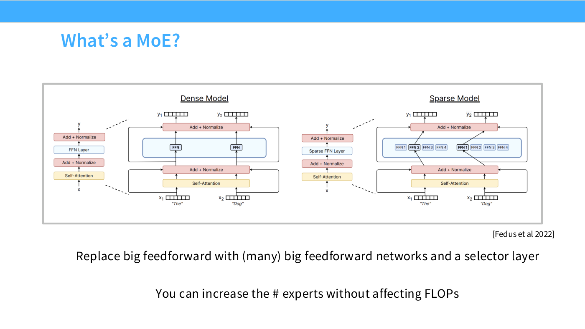

Text below the figure: "Replace big feedforward with (many) big feedforward
networks and a selector layer" and "You can increase the # experts without
affecting FLOPs". Credit at the right, beneath the figure: "[Fedus et al 2022]".

**Figure — a two-panel diagram, "Dense Model" (left) and "Sparse Model"
(right).** Each panel has a small abstract stack on its far left and, connected
to it by dashed leader lines, an expanded two-token view on its right.

- *Dense Model.* The small stack, reading up from $x$: yellow "Self-Attention" →
  red "Add + Normalize" → blue "FFN Layer" → red "Add + Normalize" → $y$. The
  expanded view shows two token inputs, $x_1$ ("The") and $x_2$ ("Dog"), each
  drawn as a row of six cells. Both feed a single wide yellow "Self-Attention"
  box, whose outputs go to a wide red "Add + Normalize" (with residual arrows
  looping around from the inputs). From there each token goes to its **own copy
  of the same** grey "FFN" box inside a pale blue "FFN layer" panel, then to a
  second wide red "Add + Normalize" (again with residual loops), producing $y_1$
  and $y_2$.
- *Sparse Model.* The small stack is identical except the blue box now reads
  "Sparse FFN Layer". In the expanded view the pale blue panel contains **two
  banks of four experts each**, labelled "FFN 1, FFN 2, FFN 3, FFN 4". Diagonal
  arrows show routing: the $x_1$ ("The") path goes to **FFN 2** in the first bank
  (drawn with a heavy black outline), and the $x_2$ ("Dog") path goes to **FFN 1**
  in the second bank (also heavily outlined). Each routed output then goes on to
  the top "Add + Normalize", producing $y_1$ and $y_2$. The unselected experts
  have no arrows into or out of them.

## Slide 16 — Why are MoEs getting popular?


Subtitle: "Same FLOP, more param does better". Credit at the bottom right:
"[Fedus et al 2022]".

**Figure 1 (left) — a single-series line chart.** The x-axis is "Sparse Model
Parameters" on a log scale, ticked at $10^9$ and $10^{10}$; the y-axis is "Test
Loss", ticked 4.8 to 6.0 in steps of 0.2. **One** series: a blue dashed line with
round markers, monotonically decreasing. Each marker is annotated with its expert
count: **1e** at ≈6.00, **2e** at ≈5.88, **4e** at ≈5.70, **8e** at ≈5.50,
**16e** at ≈5.29, **32e** at ≈5.13, **64e** at ≈5.02, **128e** at ≈4.92, **256e**
at ≈4.85 (just above $10^{10}$ parameters). The point labels are annotations on
the one curve, not additional series.

**Figure 2 (right) — a line chart of training curves.** The x-axis is "Training
Step", ticked 0, 1, 2, 3, 4 with the multiplier "1e5" at the right; the y-axis is
"Neg Log Perplexity", ticked $-2.0$ up to $-1.2$ in steps of 0.1. There are
**five** series, in legend order:

- *Blue*, "Switch-Base: 128e": rises fastest — about $-1.49$ at step 1e5, $-1.41$
  at 2e5, $-1.36$ at 3e5, $-1.33$ at 4e5, ending near $-1.315$.
- *Red*, "Switch-Base: 64e": essentially alongside the blue but slightly below —
  $-1.50$ at 1e5, $-1.42$ at 2e5, $-1.37$ at 3e5, $-1.345$ at 4e5, ending near
  $-1.335$.
- *Green*, "Switch-Base: 32e": $-1.52$ at 1e5, $-1.44$ at 2e5, $-1.40$ at 3e5,
  $-1.38$ at 4e5, ending near $-1.37$.
- *Orange*, "Switch-Base: 16e": $-1.55$ at 1e5, $-1.47$ at 2e5, $-1.435$ at 3e5,
  $-1.42$ at 4e5, ending near $-1.41$.
- *Purple*, "T5-Base": clearly the lowest — $-1.685$ at 1e5, $-1.62$ at 2e5,
  $-1.59$ at 3e5, $-1.57$ at 4e5, ending near $-1.56$.

## Slide 17 — Why are MoEs getting popular?


Subtitle: "Faster to train MoEs". Credit at the bottom right: "[OlMoE]".

**Figure 1 (left) — a line chart with a wall-clock x-axis.** The x-axis is
"Training Time", ticked 50, 100, 150, 200, 250, 300, 350; the y-axis is "Neg Log
Perplexity", ticked $-2.0$ to $-1.2$ in steps of 0.1. There are **four** series
in the legend (note this panel drops the 16e run and recolours the rest relative
to slide 16):

- *Blue*, "Switch-Base: 128e".
- *Green*, "Switch-Base: 64e".
- *Orange*, "Switch-Base: 32e".
- *Red*, "T5-Base".

The three Switch curves lie almost on top of one another: about $-1.53$ at time
50, $-1.46$ at 100, $-1.415$ at 150, $-1.385$ at 200, $-1.36$ at 250, $-1.345$ at
300, $-1.33$ at 350 (the orange 32e curve runs a little below the other two after
about time 150, ending near $-1.365$). The red T5-Base curve is far below: about
$-1.68$ at 50, $-1.60$ at 100, $-1.58$ at 150, $-1.56$ at 200, $-1.545$ at 250,
$-1.535$ at 300, and it reaches $-1.53$ only at about 350.

A black double-headed horizontal arrow annotated "**7x Speedup**" spans the plot
at the $\approx -1.53$ level, from where the Switch curves cross it (around
training time 50) to where the T5-Base curve reaches it (around 350). This arrow
is an annotation, not a data series.

**Figure 2 (right) — a 2×3 grid of small line charts**, columns titled "Training
loss", "Validation loss (C4)" and "HellaSwag". The top row has x-axis "Tokens
(B)" ticked 10, 40, 70, 100, 130; the bottom row has x-axis "Training time (h)"
ticked 1–7. Every panel shows **two** series, named in the legend inside the
bottom-right panel: *magenta/pink* "MoE" and *cyan* "Dense".

- *Training loss* (y ticked 2.4–3.2). Top row: MoE falls from 3.2 at ≈8B to 2.75
  at 40B, 2.6 at 70B, 2.5 at 100B, 2.4 at 130B; Dense falls from 3.2 to 2.85 at
  40B, 2.72 at 70B, 2.65 at 100B, 2.57 at 130B. Bottom row: the two curves start
  together and separate after ≈2 h — MoE reaches 2.6 at 4 h and 2.46 at 7 h,
  Dense 2.68 at 4 h and 2.58 at 7 h.
- *Validation loss (C4)* (y ticked around 3.0 and 3.5). Top row: MoE drops below
  Dense immediately, reaching ≈3.0 at 25B and ≈2.75 at 130B; Dense reaches ≈3.0
  at 45B and ≈2.85 at 130B. Bottom row: the curves overlap until ≈1.5 h, then MoE
  runs slightly lower, ending ≈2.78 vs Dense ≈2.85 at 7 h.
- *HellaSwag* (y ticked 30, 40, 50, 60). Top row: MoE climbs from ≈26 at 8B to
  ≈50 at 20B, 57 at 40B, 62 at 70B, 66 at 130B; Dense climbs from ≈26 to 42 at
  20B, 48 at 40B, 53 at 70B, 57 at 130B. An orange arrow points left from the
  Dense curve's endpoint to the MoE curve at the same accuracy, annotated "**~3x
  less FLOPs or tokens**". Bottom row: MoE and Dense track together to ≈1.5 h,
  then MoE pulls ahead — ≈57 at 4 h and 62 at 7 h vs Dense ≈50 at 4 h and 57 at
  7 h; a second orange arrow is annotated "**~2x faster**". Both arrows are
  annotations, not series.

Caption (partly cut off at the slide's edge): "**Figure 4: MoE vs. Dense.** We
train a 1.3B parameter dense model and a 1.3B active, 6.9B total parameter MoE
model, each on 128 H100 GPUs. Apart from MoE-related changes, we train both …"

## Slide 18 — Why are MoEs getting popular?

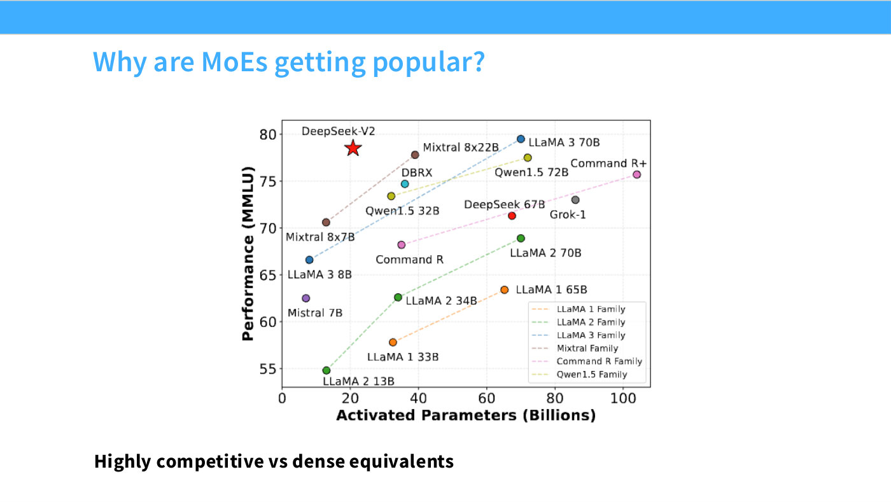

Text at the foot, in bold: "Highly competitive vs dense equivalents".

**Figure — a scatter plot with family trend lines.** The x-axis is "**Activated
Parameters (Billions)**", ticked 0, 20, 40, 60, 80, 100; the y-axis is
"**Performance (MMLU)**", ticked 55, 60, 65, 70, 75, 80. Individual models are
coloured dots, each labelled; **six** dashed trend lines connect the members of a
family, named in the legend at the bottom right: *orange* "LLaMA 1 Family",
*green* "LLaMA 2 Family", *blue* "LLaMA 3 Family", *brown* "Mixtral Family",
*pink* "Command R Family", *yellow* "Qwen1.5 Family". One extra point, a large
**red star** labelled "**DeepSeek-V2**", sits at about 21B activated parameters
and MMLU ≈78.5 — above every trend line at that x-position, which is the point of
the figure.

The labelled points, by approximate coordinates:

| Model | Activated params (B) | MMLU |
| --- | --- | --- |
| LLaMA 2 13B | 13 | 54.8 |
| LLaMA 1 33B | 32 | 57.8 |
| LLaMA 2 34B | 34 | 62.5 |
| Mistral 7B | 7 | 62.4 |
| LLaMA 1 65B | 65 | 63.4 |
| LLaMA 3 8B | 8 | 66.5 |
| Command R | 35 | 68.2 |
| LLaMA 2 70B | 70 | 68.9 |
| Mixtral 8x7B | 13 | 70.6 |
| DeepSeek 67B | 67 | 71.3 |
| Grok-1 | 86 | 73.0 |
| Qwen1.5 32B | 32 | 73.4 |
| DBRX | 36 | 74.7 |
| Command R+ | 104 | 75.7 |
| Qwen1.5 72B | 72 | 77.5 |
| Mixtral 8x22B | 39 | 77.8 |
| **DeepSeek-V2** (red star) | 21 | 78.5 |
| LLaMA 3 70B | 70 | 79.5 |

## Slide 19 — Why are MoEs getting popular?

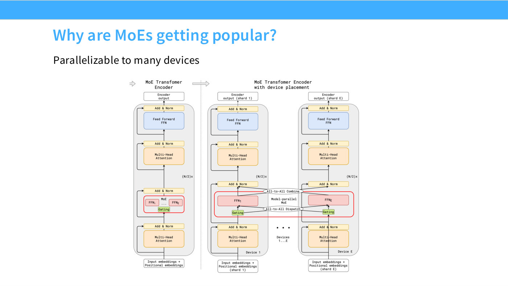

Subtitle: "Parallelizable to many devices".

**Figure — a two-part block diagram** (the GShard MoE figure), with a hollow
grey arrow pointing from the left part to the right part.

- *Left, headed "MoE Transfomer Encoder"* (the misspelling is in the original).
  One grey rounded block, annotated "(N/2)x" on its right edge, sits between
  "Input embeddings + Positional embeddings" at the bottom and "Encoder output" at
  the top. Reading up the block: an orange "Multi-Head Attention" → yellow "Add &
  Norm" (with a residual arrow bypassing the attention) → a **red-outlined "MoE"
  group** containing pink boxes "FFN₁ … FFN_E" above a green "Gating" box → yellow
  "Add & Norm" → a second orange "Multi-Head Attention" → yellow "Add & Norm" →
  a blue "Feed Forward FFN" → yellow "Add & Norm". So the MoE layer replaces the
  FFN in every other layer.
- *Right, headed "MoE Transfomer Encoder with device placement"*. The same stack
  is drawn twice, side by side, labelled "Device 1" and "Device E" with "Devices
  1…E" and an ellipsis between them; each device has its own "Input embeddings +
  Positional embeddings (shard 1 / shard E)" and "Encoder output (shard 1 /
  shard E)", and each is annotated "(N/2)x". The red-outlined MoE group now spans
  both devices and is labelled "**Model-parallel MoE**": Device 1 holds only
  **FFN₁** and Device E only **FFN_E**. Two ellipse-shaped nodes sit between the
  devices: "**All-to-All Dispatch**", into which each device's green "Gating" box
  feeds and out of which arrows run to the FFN on *both* devices; and, above the
  experts, "**All-to-All Combine**", into which both FFNs feed and out of which
  arrows run to the "Add & Norm" on *both* devices. The attention and dense-FFN
  sublayers are replicated per device and carry no cross-device arrows.

## Slide 20 — Some MoE results – from the west

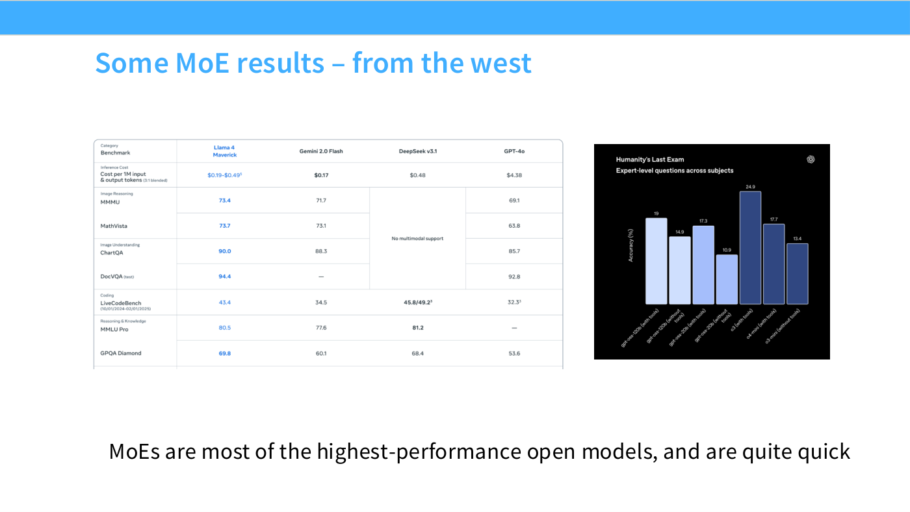

Text at the foot: "MoEs are most of the highest-performance open models, and are
quite quick".

**Figure 1 (left) — a screenshot of the Llama 4 benchmark table.** Four model
columns — **Llama 4 Maverick** (its column heading and all its numbers set in
blue), **Gemini 2.0 Flash**, **DeepSeek v3.1**, **GPT-4o** — against a
category/benchmark column on the left. The DeepSeek v3.1 column is merged across
the four multimodal rows with the note "No multimodal support".

| Category / Benchmark | Llama 4 Maverick | Gemini 2.0 Flash | DeepSeek v3.1 | GPT-4o |
| --- | --- | --- | --- | --- |
| *Inference Cost* — Cost per 1M input & output tokens (3:1 blended) | \$0.19–\$0.49⁵ | **\$0.17** | \$0.48 | \$4.38 |
| *Image Reasoning* — MMMU | **73.4** | 71.7 | No multimodal support | 69.1 |
| MathVista | **73.7** | 73.1 | No multimodal support | 63.8 |
| *Image Understanding* — ChartQA | **90.0** | 88.3 | No multimodal support | 85.7 |
| DocVQA (test) | **94.4** | — | No multimodal support | 92.8 |
| *Coding* — LiveCodeBench (10/01/2024-02/01/2025) | 43.4 | 34.5 | **45.8/49.2³** | 32.3³ |
| *Reasoning & Knowledge* — MMLU Pro | 80.5 | 77.6 | **81.2** | — |
| GPQA Diamond | **69.8** | 60.1 | 68.4 | 53.6 |

(The screenshot is cropped just below the GPQA Diamond row; a further row begins
but is cut off. There is no average or total row in the visible portion.)

**Figure 2 (right) — a screenshot of an OpenAI chart**, white text and blue bars
on a black panel with the OpenAI logo in the top-right corner. It is titled
"**Humanity's Last Exam**" with the subtitle "Expert-level questions across
subjects". The y-axis is "Accuracy (%)" and carries no ticks. It is a single
series of **seven** bars (shaded from pale blue for the gpt-oss models to dark
navy for the o-series), each labelled with its value:

| Bar | Accuracy |
| --- | --- |
| gpt-oss-120b (with tools) | 19 |
| gpt-oss-120b (without tools) | 14.9 |
| gpt-oss-20b (with tools) | 17.3 |
| gpt-oss-20b (without tools) | 10.9 |
| o3 (with tools) | 24.9 |
| o4-mini (with tools) | 17.7 |
| o3-mini (without tools) | 13.4 |
## Slide 21 — Earlier MoE results from Chinese groups – Qwen

Subtitle: "Chinese LLM companies are also doing quite a bit of MoE work on the
smaller end".

The rest of the page is **two pasted tables side by side**, both from the Qwen1.5-MoE
report, with no caption and no credit line. The left one gives benchmark scores, the
right one gives parameter counts, and the two share four of their five model rows.

**Left table — benchmark results.**

| Model | MMLU | GSM8K | HumanEval | Multilingual | MT-Bench |
| --- | --- | --- | --- | --- | --- |
| Mistral-7B | 64.1 | 47.5 | 27.4 | 40.0 | 7.60 |
| Gemma-7B | 64.6 | 50.9 | 32.3 | – | – |
| Qwen1.5-7B | 61.0 | 62.5 | 36.0 | 45.2 | 7.60 |
| DeepSeekMoE 16B | 45.0 | 18.8 | 26.8 | – | 6.93 |
| Qwen1.5-MoE-A2.7B | 62.5 | 61.5 | 34.2 | 40.8 | 7.17 |

**Right table — parameters, in billions.** Note that this table orders its rows
differently from the left one: Qwen1.5-7B comes before Gemma-7B here.

| Model | #Parameters | #(Activated) Parameters |
| --- | --- | --- |
| Mistral-7B | 7.2 | 7.2 |
| Qwen1.5-7B | 7.7 | 7.7 |
| Gemma-7B | 8.5 | 7.8 |
| DeepSeekMoE 16B | 16.4 | 2.8 |
| Qwen1.5-MoE-A2.7B | 14.3 | 2.7 |

The point the pairing makes is that Qwen1.5-MoE-A2.7B holds 14.3B total parameters
but activates only 2.7B, and still scores at or near the dense 7B models on every
column.

## Slide 22 — Earlier MoE results from Chinese groups - DeepSeek

Subtitle: "There's also some good recent ablation work on MoEs showing they're
generally good".

The body is a single **pasted table** (set in a serif/academic style, from the
DeepSeekMoE paper), comparing a Dense baseline against two sparse routers — Hash
Layer and Switch — at matched activated parameters and matched FLOPs. A vertical
rule separates the "# Shot" column from the three result columns, and horizontal
rules group the rows into blocks.

| Metric | # Shot | Dense | Hash Layer | Switch |
| --- | --- | --- | --- | --- |
| # Total Params | N/A | 0.2B | 2.0B | 2.0B |
| # Activated Params | N/A | 0.2B | 0.2B | 0.2B |
| FLOPs per 2K Tokens | N/A | 2.9T | 2.9T | 2.9T |
| # Training Tokens | N/A | 100B | 100B | 100B |
| Pile (Loss) | N/A | 2.060 | 1.932 | 1.881 |
| HellaSwag (Acc.) | 0-shot | 38.8 | 46.2 | 49.1 |
| PIQA (Acc.) | 0-shot | 66.8 | 68.4 | 70.5 |
| ARC-easy (Acc.) | 0-shot | 41.0 | 45.3 | 45.9 |
| ARC-challenge (Acc.) | 0-shot | 26.0 | 28.2 | 30.2 |
| RACE-middle (Acc.) | 5-shot | 38.8 | 38.8 | 43.6 |
| RACE-high (Acc.) | 5-shot | 29.0 | 30.0 | 30.9 |
| HumanEval (Pass@1) | 0-shot | 0.0 | 1.2 | 2.4 |
| MBPP (Pass@1) | 3-shot | 0.2 | 0.6 | 0.4 |
| TriviaQA (EM) | 5-shot | 4.9 | 6.5 | 8.9 |
| NaturalQuestions (EM) | 5-shot | 1.4 | 1.4 | 2.5 |

Switch beats the dense baseline on every row except MBPP (0.4 vs the Hash Layer's
0.6, though still above dense's 0.2), at identical activated parameters and
identical FLOPs.

## Slide 23 — Recent MoE results – DeepSeek v3

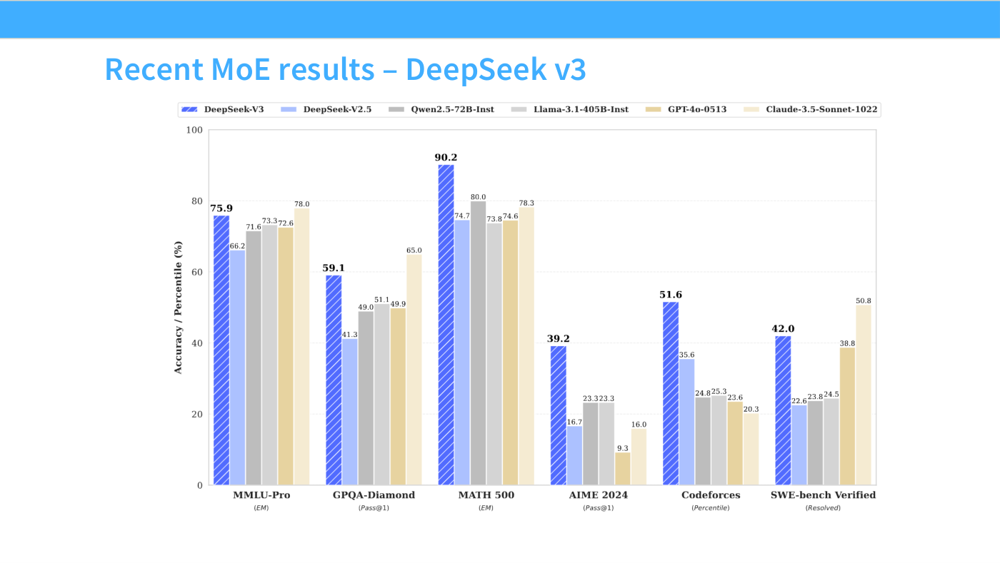

The slide has no text of its own beyond the title. The body is one large **pasted
grouped bar chart** (the headline figure from the DeepSeek-V3 report).

The y-axis is "Accuracy / Percentile (%)", ticked 0, 20, 40, 60, 80, 100, with faint
dashed gridlines. The x-axis has six benchmark groups, each labelled with the metric
in italics beneath: **MMLU-Pro** *(EM)*, **GPQA-Diamond** *(Pass@1)*, **MATH 500**
*(EM)*, **AIME 2024** *(Pass@1)*, **Codeforces** *(Percentile)*, **SWE-bench
Verified** *(Resolved)*.

There are **six** series, given in a legend strip across the top; the bars within
each group appear in legend order, left to right:

- *Blue with white diagonal hatching*, **DeepSeek-V3** — the leftmost bar of each
  group, and its value is printed in large bold type: 75.9, 59.1, 90.2, 39.2, 51.6,
  42.0.
- *Light periwinkle blue (solid)*, **DeepSeek-V2.5** — 66.2, 41.3, 74.7, 16.7, 35.6,
  22.6.
- *Medium grey*, **Qwen2.5-72B-Inst** — 71.6, 49.0, 80.0, 23.3, 24.8, 23.8.
- *Light grey*, **Llama-3.1-405B-Inst** — 73.3, 51.1, 73.8, 23.3, 25.3, 24.5.
- *Dark sand / tan*, **GPT-4o-0513** — 72.6, 49.9, 74.6, 9.3, 23.6, 38.8.
- *Pale cream*, **Claude-3.5-Sonnet-1022** — 78.0, 65.0, 78.3, 16.0, 20.3, 50.8.

DeepSeek-V3 leads on MATH 500, AIME 2024 and Codeforces by wide margins; Claude-3.5-
Sonnet leads on MMLU-Pro, GPQA-Diamond and SWE-bench Verified.

## Slide 24 — Why haven't MoEs been more popular?


Two reasons, each a heading with a pasted excerpt beneath it.

**First heading:** "Infrastructure is complex / advantages on multi node". Beneath it
is a **boxed quotation** — a screenshot of a paragraph of paper text, credited at the
right below the box as "[Fedus et al 2022]". It reads in full:

> At a high level, sparsity is good when you have many accelerators (e.g. GPU/TPU) to
> host all the additional parameters that comes when using sparsity. Typically models
> are trained using data-parallelism where different machines will get different
> slices of the training/inference data. The machines used for operating on the
> different slices of data can now be used to host many more model parameters.
> Therefore, sparse models are good when training with data parallelism and/or have
> high throughput while serving: training/serving on many machines which can host all
> of the parameters.

**Second heading:** "Training objectives are somewhat heuristic (and sometimes
unstable)". Beneath it is a **boxed screenshot from a paper**, credited at the right
below the box as "[Zoph et al 2022]". Its own caption text at the top reads: "Sparse
models often suffer from training instabilities (Figure 1) worse than those observed
in standard densely-activated Transformers."

Under that caption are **two small line charts side by side**, each with one blue
series and each with x-axis "Step" ticked 0, 2500, 5000, 7500, 10000, 12500, 15000:

- *Left chart*, y-axis "Training Loss" ticked 0, 50, 100, 150, 200, 250, 300, 350.
  The single blue curve sits flat near the bottom of the axis (roughly 5–10) for
  almost the whole run, drifting up slightly around step 10000–12500, then explodes
  vertically from about step 14000 to reach roughly 340 at step 15000. This is the
  divergence.
- *Right chart*, y-axis "Training Loss" ticked 2 through 8. The single blue curve
  falls from about 8.0 at step 0 to ~5.3 by step 2500, ~4.4 at step 5000 (with a
  visible shoulder), ~2.5 at step 7500, ~2.1 at step 10000, and flattens around
  1.8 from step 12500 to 15000. This is a healthy run, shown for contrast.

## Slide 25 — What MoEs generally look like


Two column headings — "Typical: replace MLP with MoE layer" on the left, "Less
common: MoE for attention heads" on the right — over two pasted diagrams. The credit
"[ModuleFormer, JetMoE]" sits at the bottom right, applying to the right-hand
diagram.

**Left figure — "Sparse Model" (the Switch Transformer / Fedus-style schematic).**
At the far left is a small stack showing one ordinary transformer block: input $x$ at
the bottom feeding a yellow **Self-Attention** box, then a pink **Add + Normalize**,
then a blue **Sparse FFN Layer**, then a second pink **Add + Normalize**, and output
$y$ at the top. Two dashed lines fan out from this stack to the right, expanding it
into the detailed diagram.

The detailed diagram takes two token inputs at the bottom, $x_1$ = *"The"* and $x_2$ =
*"Dog"*, each drawn as a row of six small cells. Both feed a single wide yellow
**Self-Attention** box, whose outputs go up into a pink **Add + Normalize** bar. From
that bar, two arrows rise into a blue-shaded **sparse FFN band** which contains two
copies of a four-expert row: for token 1, boxes FFN 1, **FFN 2**, FFN 3, FFN 4, with
**FFN 2** outlined in bold as the selected expert; for token 2, boxes **FFN 1**, FFN
2, FFN 3, FFN 4, with **FFN 1** bold as the selected expert. The selected experts'
outputs rise to a second pink **Add + Normalize** bar, and out of it come $y_1$ and
$y_2$, again drawn as rows of six cells. Skip connections run around the outside of
both the attention block and the FFN block back into the Add + Normalize bars.

**Right figure — MoE over attention heads (ModuleFormer / JetMoE).** A tall block
diagram of one layer, drawn with a vertical residual line running up the middle
through two $\oplus$ addition nodes. Reading from the bottom: a purple **Layer Norm**
bar; above it a rounded box holding four blue **Att 1 … Att 4** boxes in a row with a
blue **Router** box beneath them, curved lines connecting the Router to a subset of
the attention experts; the box's output joins the residual line at the lower $\oplus$.
Above that, a second purple **Layer Norm** bar; above it a second rounded box holding
four yellow **MLP 1 … MLP 4** boxes in a row with a yellow **Router** beneath them,
again with curved lines to a subset; its output joins the residual line at the upper
$\oplus$. So both the attention sub-layer and the MLP sub-layer are made sparse, each
with its own router.

## Slide 26 — MoE – what varies?

A pure text slide, three diamond bullets and nothing else — no figure:

- Routing function
- Expert sizes
- Training objectives

These are the three axes the following sections work through.

## Slide 27 — Routing function - overview

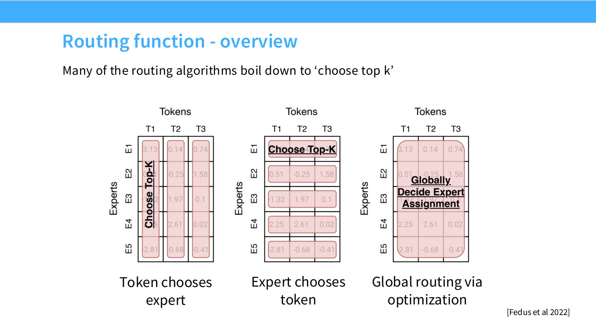

Subtitle: "Many of the routing algorithms boil down to 'choose top k'". Credit at the
bottom right: "[Fedus et al 2022]".

**Figure — three pasted matrix schematics side by side**, each showing the *same*
5×3 router-score matrix with a different selection pattern shaded in pink. In every
panel the columns are tokens T1, T2, T3 (with "Tokens" written above) and the rows
are experts E1 … E5 (with "Experts" written down the left). The underlying score
matrix is:

| | T1 | T2 | T3 |
| --- | --- | --- | --- |
| **E1** | 3.13 | 0.14 | 0.74 |
| **E2** | 0.51 | -0.25 | 1.58 |
| **E3** | -1.32 | 1.97 | 0.1 |
| **E4** | 2.25 | 2.61 | 0.02 |
| **E5** | -2.81 | -0.68 | -0.41 |

- *Left panel*, captioned "**Token chooses expert**": three tall pink rounded
  rectangles, one per token column, each spanning all five experts. The bold
  underlined label "**Choose Top-K**" is printed vertically down the T1 column. The
  selection happens within a column — each token picks its top-k experts.
- *Middle panel*, captioned "**Expert chooses token**": five wide pink rounded
  rectangles, one per expert row, each spanning all three tokens. The bold underlined
  label "**Choose Top-K**" is printed horizontally across the E1 row. The selection
  happens within a row — each expert picks its top-k tokens.
- *Right panel*, captioned "**Global routing via optimization**": a single pink
  rounded rectangle covering the entire 5×3 grid at once, with the bold underlined
  three-line label "**Globally Decide Expert Assignment**" printed across its middle.
  The selection is made jointly over the whole matrix.

## Slide 28 — Routing type

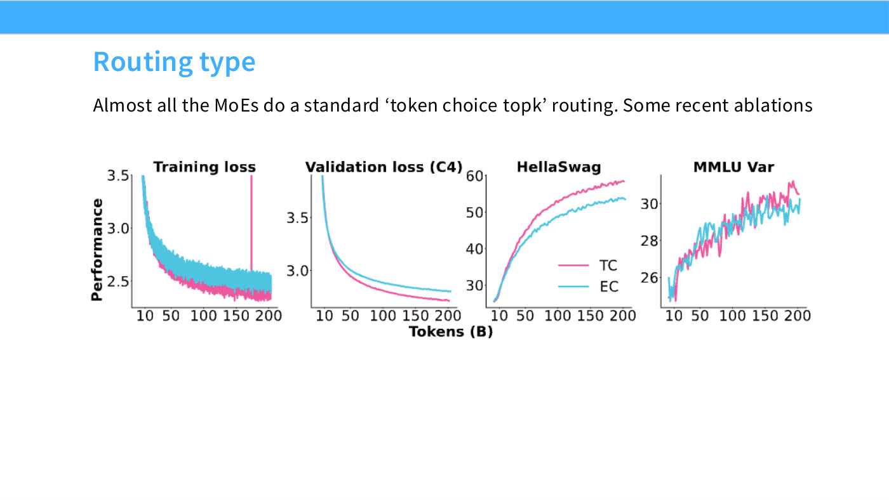

Subtitle: "Almost all the MoEs do a standard 'token choice topk' routing. Some recent
ablations". No credit line is printed on the page.

**Figure — one pasted strip of four line charts sharing a legend and an x-axis.**
The shared x-axis label is "**Tokens (B)**", ticked 10, 50, 100, 150, 200 on every
panel; the shared y-axis label, printed once at the far left, is "**Performance**".
Every panel has exactly **two** series, labelled in a legend inside the HellaSwag
panel:

- *Pink/magenta*, **TC** (token choice)
- *Cyan/light blue*, **EC** (expert choice)

Panel by panel:

- **"Training loss"** — y-axis ticked 2.5, 3.0, 3.5. Both curves start at ~3.5 at
  10B and fall steeply; the pink TC curve is consistently *below* the cyan EC curve
  from about 30B onward, reaching ~2.45 at 100B and ~2.35 by 200B, while EC sits
  around 2.65 at 100B and ~2.5 at 200B. Both traces are noisy bands rather than clean
  lines. A single thin vertical pink spike shoots to the top of the panel at about
  175B — a loss spike in the TC run, not a separate series.
- **"Validation loss (C4)"** — y-axis ticked 3.0, 3.5. Both curves fall from ~3.9 at
  10B; they overlap until about 30B, after which pink TC runs below cyan EC. At 100B
  TC is ~2.95 and EC ~3.02; at 200B TC is ~2.75 and EC ~2.85.
- **"HellaSwag"** — y-axis ticked 30, 40, 50, 60. Both curves rise from ~25 at 10B.
  Pink TC is above cyan EC throughout the second half: ~45 vs ~43 at 50B, ~52 vs ~49
  at 100B, ~56 vs ~52 at 150B, ~59 vs ~54 at 200B.
- **"MMLU Var"** — y-axis ticked 26, 28, 30. Both curves are very noisy and rise from
  ~25–26 at 10B to ~29–30 by 200B; they are essentially indistinguishable, crossing
  repeatedly, with pink TC touching ~31 near 175B and both ending around 29.5–30.

The takeaway is that token choice (TC) beats expert choice (EC) on loss and HellaSwag
while the two are a wash on MMLU.

## Slide 29 — Common routing variants in detail

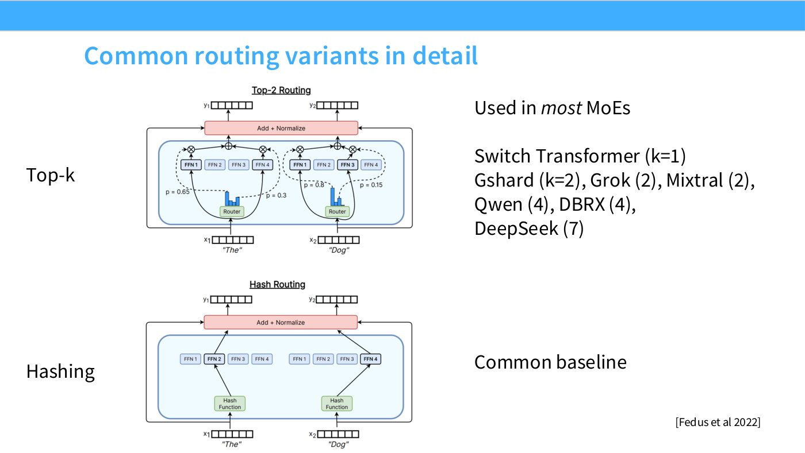

Two row labels down the left — "Top-k" and "Hashing" — each with a pasted diagram in
the middle column and commentary text on the right. Credit at the bottom right:
"[Fedus et al 2022]".

**Top row — figure titled "Top-2 Routing".** Two tokens enter at the bottom, $x_1$ =
*"The"* and $x_2$ = *"Dog"*, drawn as rows of six cells. Each feeds a green **Router**
box, and beside each router a small blue bar histogram shows the router's distribution
over the four experts. From each router, dashed lines carry routing probabilities out
to the expert row: for token 1, FFN 1, FFN 2, FFN 3, **FFN 4**, with **FFN 1**
(p = 0.65) and **FFN 4** (p = 0.3) drawn in bold as the two selected experts; for
token 2, **FFN 1** (p = 0.8), FFN 2, **FFN 3** (p = 0.15), FFN 4, with FFN 1 and
FFN 3 selected. Each selected expert's output passes through a $\otimes$ node (scaling
by its probability) and the two products meet at a $\oplus$ node (summing them). The
sums rise into a pink **Add + Normalize** bar and out as $y_1$ and $y_2$; a skip
connection runs around the whole block into that bar.

Commentary on the right: "Used in *most* MoEs", then a list of models with their $k$:
"Switch Transformer (k=1) / Gshard (k=2), Grok (2), Mixtral (2), Qwen (4), DBRX (4),
DeepSeek (7)".

**Bottom row — figure titled "Hash Routing".** Same layout, but each token feeds a
green **Hash Function** box instead of a router, and there is no probability
histogram and no scaling node. A single solid arrow runs from each hash box straight
to one bold expert — **FFN 2** for token 1 and **FFN 4** for token 2 — and from there
straight up to the pink **Add + Normalize** bar, producing $y_1$ and $y_2$. Routing is
deterministic and unweighted.

Commentary on the right: "Common baseline".

## Slide 30 — Other routing methods

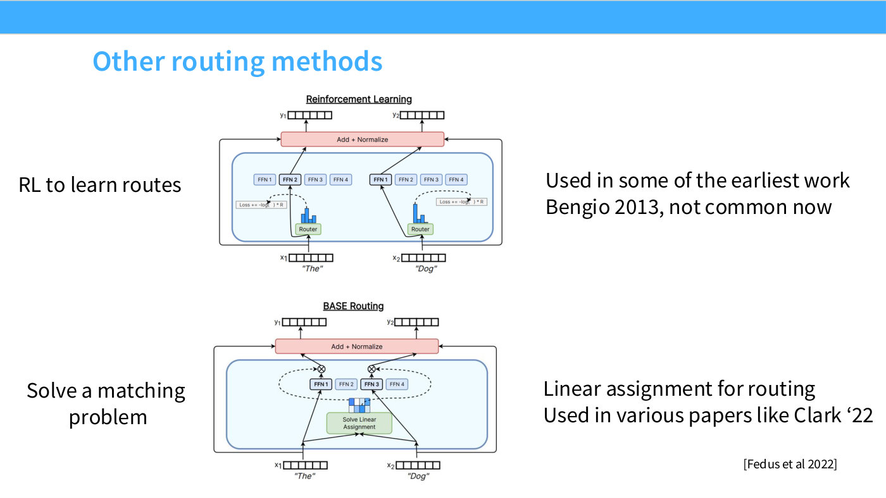

Same three-column layout as slide 29 — row label at the left, pasted diagram in the
middle, commentary at the right. Credit at the bottom right: "[Fedus et al 2022]".

**Top row, labelled "RL to learn routes" — figure titled "Reinforcement Learning".**
Tokens $x_1$ = *"The"* and $x_2$ = *"Dog"* each feed a green **Router**, each with a
small blue bar histogram of its distribution over the four experts beside it. One
expert is selected per token and drawn in bold — **FFN 2** for token 1, **FFN 1** for
token 2 — with a solid arrow from that expert up to the pink **Add + Normalize** bar,
yielding $y_1$ and $y_2$. Beside each router a small boxed formula shows the training
signal: "Loss += -log( ) * R" — that is, a REINFORCE-style term $\text{Loss} \mathrel{+}= -\log(p) \cdot R$
where $p$ is the router probability of the chosen expert and $R$ the reward — with a
dashed arrow linking the box back to the router's histogram. Skip connections run
around the block into the Add + Normalize bar.

Commentary on the right: "Used in some of the earliest work Bengio 2013, not common
now".

**Bottom row, labelled "Solve a matching problem" — figure titled "BASE Routing".**
Both tokens $x_1$ and $x_2$ feed a *single shared* green **Solve Linear Assignment**
box (four arrows converge on it, two from each token), with a small grid of blue/white
cells above it representing the assignment matrix. A large dashed ellipse encircles
the four experts FFN 1 … FFN 4, indicating the joint decision; **FFN 1** and **FFN 3**
are drawn in bold as the two assigned experts. Each assigned expert's output passes
through a $\otimes$ node up to the pink **Add + Normalize** bar, producing $y_1$ and
$y_2$.

Commentary on the right: "Linear assignment for routing Used in various papers like
Clark '22".

## Slide 31 — Top-K routing in detail.

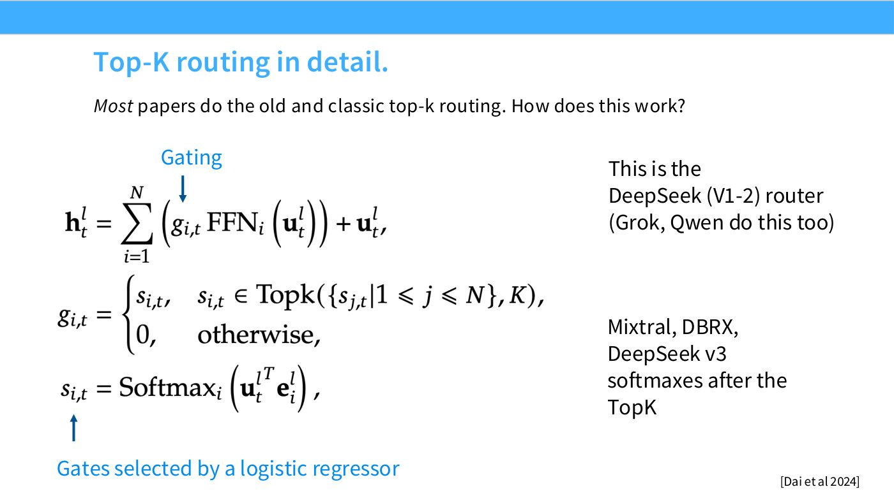

Subtitle, with the first word in italics: "*Most* papers do the old and classic
top-k routing. How does this work?" Credit at the bottom right: "[Dai et al 2024]".

The left two-thirds of the page is a three-line display of the DeepSeekMoE router,
with two blue annotations pointing into it. A blue label "**Gating**" sits above the
first line with a blue arrow pointing down at the factor $g_{i,t}$; a blue arrow
points up at $s_{i,t}$ in the third line from the blue caption "**Gates selected by
a logistic regressor**" printed at the bottom left.

$$\mathbf{h}^l_t = \sum_{i=1}^{N} \left( g_{i,t}\, \mathrm{FFN}_i\left(\mathbf{u}^l_t\right) \right) + \mathbf{u}^l_t,$$

$$g_{i,t} = \begin{cases} s_{i,t}, & s_{i,t} \in \mathrm{Topk}(\{s_{j,t} \mid 1 \leqslant j \leqslant N\}, K), \\ 0, & \text{otherwise,} \end{cases}$$

$$s_{i,t} = \mathrm{Softmax}_i\left(\mathbf{u}^{l\,T}_t \mathbf{e}^l_i\right),$$

Here $\mathbf{u}^l_t$ is the layer-$l$ hidden state for token $t$, $\mathbf{e}^l_i$
is the centroid (embedding) of expert $i$, $s_{i,t}$ is the router score, $g_{i,t}$
the gate, $N$ the number of experts and $K$ the number kept.

Two notes run down the right margin, aligned with the equations:

- Beside the first line: "This is the DeepSeek (V1-2) router (Grok, Qwen do this
  too)".
- Beside the second and third: "Mixtral, DBRX, DeepSeek v3 softmaxes after the TopK".

The distinction being drawn is where the softmax goes — before the top-k selection
(as written above, so the surviving gates do not sum to 1) or after it.

## Slide 32 — Recent variations from DeepSeek and other Chinese LMs

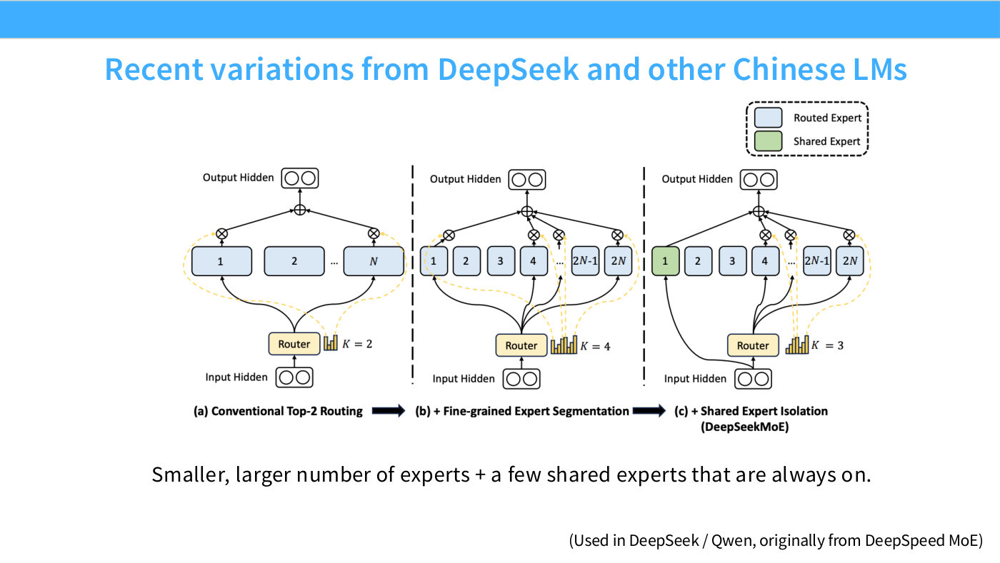

The slide's own text is one line beneath the figure — "Smaller, larger number of
experts + a few shared experts that are always on." — and a credit at the bottom
right, "(Used in DeepSeek / Qwen, originally from DeepSpeed MoE)".

**Figure — a pasted three-panel diagram (the DeepSeekMoE architecture figure),
panels separated by vertical dashed rules and joined by thick black arrows reading
left to right.** A legend box at the top right defines the colours: a **blue** box is
a "Routed Expert", a **green** box is a "Shared Expert".

Every panel has the same skeleton: "Input Hidden" (a two-circle box) at the bottom
feeds a yellow **Router** box; beside the router a small orange bar histogram shows
the routing distribution and a label gives $K$; solid black arrows run from the input
up to the selected experts; orange dashed curves carry the gate weights from the
router to $\otimes$ nodes above the selected experts; the $\otimes$ outputs meet at a
$\oplus$ node that feeds "Output Hidden" (another two-circle box) at the top.

- **(a) Conventional Top-2 Routing** — one row of $N$ blue experts labelled 1, 2, …,
  $N$. $K = 2$; experts 1 and $N$ are the two selected.
- **(b) + Fine-grained Expert Segmentation** — the same parameter budget cut into
  twice as many, half-sized experts: a row labelled 1, 2, 3, 4, …, $2N{-}1$, $2N$,
  all blue. $K = 4$; four experts are selected.
- **(c) + Shared Expert Isolation (DeepSeekMoE)** — the same $2N$-expert row, but
  expert 1 is now **green** (a shared expert) and is reached by a solid arrow
  straight from the input hidden, bypassing the router entirely — it is always on.
  The router chooses among the remaining blue experts with $K = 3$.

Beneath the panels, the three captions are printed in bold: "(a) Conventional Top-2
Routing", "(b) + Fine-grained Expert Segmentation", "(c) + Shared Expert Isolation
(DeepSeekMoE)".

## Slide 33 — Various ablations from the DeepSeek paper

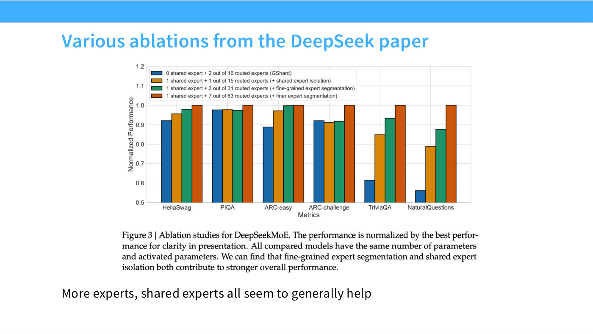

The slide's own text is the single line at the bottom: "More experts, shared experts
all seem to generally help". Everything above it is a pasted figure with its own
caption.

**Figure — a grouped bar chart.** The y-axis is "Normalized Performance", ticked 0.5
through 1.2 in steps of 0.1 (the axis starts at 0.5, so bar heights are exaggerated).
The x-axis is labelled "Metrics" with six groups: HellaSwag, PIQA, ARC-easy,
ARC-challenge, TriviaQA, NaturalQuestions. There are **four** series, listed in a
legend box at the top left; bars appear in legend order within each group:

- *Blue*, "0 shared expert + 2 out of 16 routed experts (GShard)" — 0.92, 0.98, 0.89,
  0.92, 0.615, 0.56.
- *Orange/amber*, "1 shared expert + 1 out of 15 routed experts (+ shared expert
  isolation)" — 0.955, 0.978, 0.97, 0.913, 0.85, 0.79.
- *Green*, "1 shared expert + 3 out of 31 routed experts (+ fine-grained expert
  segmentation)" — 0.98, 0.974, 0.998, 0.92, 0.935, 0.878.
- *Red-orange*, "1 shared expert + 7 out of 63 routed experts (+ finer expert
  segmentation)" — 1.00 in every one of the six groups; it is the normalising
  best-performing configuration.

The gap between the blue baseline and the red-orange best is small on PIQA
(0.98 → 1.00) and enormous on the knowledge benchmarks TriviaQA (0.615 → 1.00) and
NaturalQuestions (0.56 → 1.00).

The pasted caption beneath reads: "**Figure 3 | Ablation studies for DeepSeekMoE.**
The performance is normalized by the best performance for clarity in presentation.
All compared models have the same number of parameters and activated parameters. We
can find that fine-grained expert segmentation and shared expert isolation both
contribute to stronger overall performance."

## Slide 34 — Ablations from OlMoE

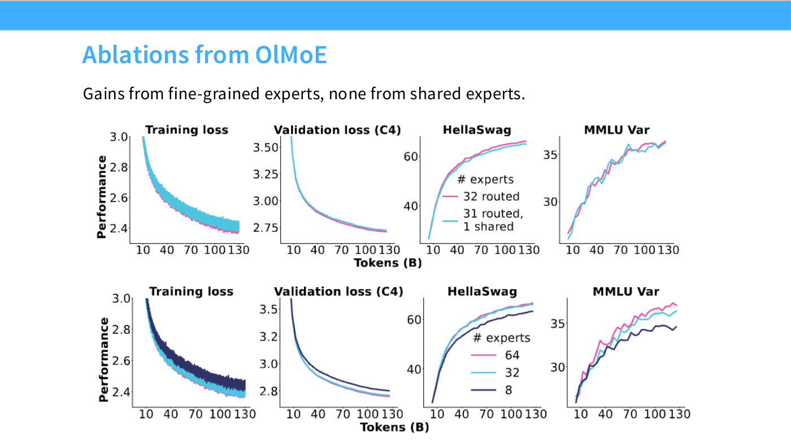

Subtitle: "Gains from fine-grained experts, none from shared experts."

**Figure — two rows of four line charts each, in the same house style as slide 28.**
Both rows share the column titles "Training loss", "Validation loss (C4)",
"HellaSwag", "MMLU Var", the y-axis label "**Performance**" printed once at the left,
and the x-axis label "**Tokens (B)**", ticked 10, 40, 70, 100, 130 on every panel.
The two rows test different things and have different legends.

**Top row — shared experts (2 series), legend "# experts" inside the HellaSwag
panel:** *pink/magenta* = "32 routed", *cyan* = "31 routed, 1 shared".

- *Training loss* (y ticked 2.4, 2.6, 2.8, 3.0): both fall from 3.0 at 10B to about
  2.4 at 130B, drawn as overlapping noisy bands. The pink 32-routed trace sits
  fractionally *below* the cyan trace for most of the run (~2.55 vs ~2.58 at 70B),
  but the two are close to indistinguishable.
- *Validation loss (C4)* (y ticked 2.75, 3.00, 3.25, 3.50): both fall from ~3.6 at
  10B to ~2.72 at 130B and lie essentially on top of each other the whole way.
- *HellaSwag* (y ticked 40, 60): both rise from ~25 at 10B to ~65 at 130B; pink is a
  hair above cyan over the second half (~62 vs ~61 at 100B).
- *MMLU Var* (y ticked 30, 35): both rise from ~25 at 10B to ~36.5 at 130B, weaving
  around each other with no consistent separation.

That is the "none from shared experts" half of the subtitle: 31 routed + 1 shared is
no better than 32 routed.

**Bottom row — number of experts (3 series), legend "# experts" inside the HellaSwag
panel:** *pink/magenta* = "64", *cyan* = "32", *dark navy* = "8".

- *Training loss* (y ticked 2.4, 2.6, 2.8, 3.0): all three fall from 3.0 at 10B. They
  separate in clear order — pink 64 lowest, cyan 32 just above it, navy 8 clearly
  highest. At 130B roughly 2.37 (64), 2.40 (32), 2.47 (8).
- *Validation loss (C4)* (y ticked 2.8, 3.0, 3.2, 3.5): pink and cyan run together
  and below navy from about 30B on. At 130B roughly 2.76 (64), 2.77 (32), 2.81 (8).
- *HellaSwag* (y ticked 40, 60): all rise from ~25 at 10B; pink and cyan track each
  other to ~66 at 130B while navy 8 lags at ~62.
- *MMLU Var* (y ticked 30, 35): pink 64 highest at ~37 by 130B, cyan 32 next at ~36,
  navy 8 clearly lowest and flattening around ~34.5.

That is the "gains from fine-grained experts" half: more, smaller experts is
consistently better, and the 8-expert run is the worst on every panel.

## Slide 35 — Expert routing setups for recent MoEs

The whole slide is a **native, vector-drawn table** in the deck's own blue house
style — a dark navy header row with white text and alternating light-grey/pale-blue
body rows. There is no other text on the page and no credit line. "Routed" is the
total number of routed experts, "Active" the number activated per token, "Shared" the
number of always-on shared experts, and "Fine-grained ratio" the size of one expert
relative to a full FFN. Blank cells are blank in the original.

| Model | Routed | Active | Shared | Fine-grained ratio |
| --- | --- | --- | --- | --- |
| GShard | 2048 | 2 | 0 | |
| Switch Transformer | 64 | 1 | 0 | |
| ST-MOE | 64 | 2 | 0 | |
| Mixtral | 8 | 2 | 0 | |
| DBRX | 16 | 4 | 0 | |
| Grok | 8 | 2 | 0 | |
| DeepSeek v1 | 64 | 6 | 2 | 1/4 |
| Qwen 1.5 | 60 | 4 | 4 | 1/8 |
| DeepSeek v3 | 256 | 8 | 1 | 1/14 |
| OlMoE | 64 | 8 | 0 | 1/8 |
| MiniMax | 32 | 2 | 0 | ~1/4 |
| Llama 4 (maverick) | 128 | 1 | 1 | 1/2 |

The table has twelve model rows and no average or total row. The split it displays is
between the six older Western models (GShard through Grok), which have no shared
experts and no fine-grained ratio at all, and the six more recent models, all of which
report a fine-grained ratio and most of which use shared experts.

## Slide 36 — How do we train MoEs?

A pure text slide; no figure.

"**Major challenge:** we need sparsity for training-time efficiency… But sparse
gating decisions are not differentiable!"

"**Solutions?**"

1. Reinforcment learning to optimize gating policies *(spelled "Reinforcment" on the
   slide)*
2. Stochastic perturbations
3. Heuristic 'balancing' losses.

Centred beneath, as the rhetorical setup for the next slides: "Guess which one people
use in practice?"

## Slide 37 — RL for MoEs

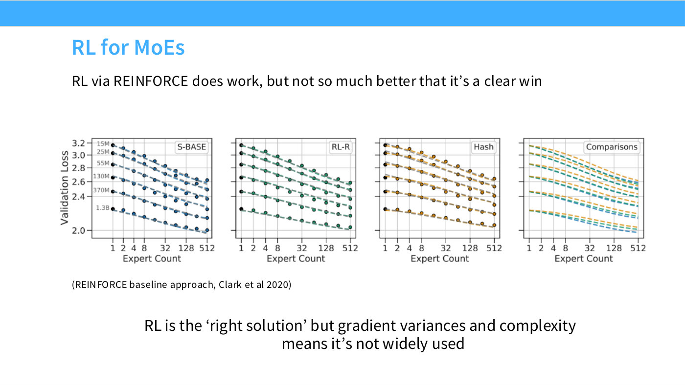

Subtitle: "RL via REINFORCE does work, but not so much better that it's a clear win".
A small credit beneath the figure reads "(REINFORCE baseline approach, Clark et al
2020)". A two-line conclusion is centred at the foot: "RL is the 'right solution' but
gradient variances and complexity means it's not widely used".

**Figure — a pasted strip of four scatter-plus-fit panels sharing axes.** Every panel
has x-axis "**Expert Count**" on a log scale ticked 1, 2, 4, 8, 32, 128, 512, and
y-axis "**Validation Loss**" (labelled once, on the leftmost panel) with labelled
ticks 2.0, 2.4, 2.6, 2.8, 3.0, 3.2. Each panel carries its method name in a small
box at its top right.

Each of the first three panels shows **six** series — one per model size — each a
run of round markers with a dashed fit line through them. The six sizes are annotated
in grey text at the left endpoint of each curve in the first panel only, top to
bottom: **15M, 25M, 55M, 130M, 370M, 1.3B**. (These are curve annotations, not extra
series.) Every curve slopes down and to the right: more experts, lower loss, at every
model size.

- **Panel 1, "S-BASE"** — markers and fits in *blue*. The 15M curve runs from ~3.15
  at 1 expert to ~2.6 at 512; the 1.3B curve from ~2.30 at 1 expert to ~2.0 at 512.
  The four curves in between are stacked evenly between them.
- **Panel 2, "RL-R"** — the same six curves in *green*, spanning the same range, with
  the 1.3B curve reaching about 2.02 at 512 experts.
- **Panel 3, "Hash"** — the same six curves in *gold/orange*. The curves are visibly
  flatter at the right-hand end than the other two panels: the 1.3B curve bottoms out
  around 2.05, and several of the smaller-model curves flatten past 128 experts.
- **Panel 4, "Comparisons"** — all three methods overlaid as dashed fit lines only,
  no markers, in blue, green and gold. The blue (S-BASE) and green (RL-R) lines run
  close together and below the gold (Hash) lines at high expert counts; at the far
  right of each size band the gold line sits highest.

The point the slide draws from this is that RL-R is competitive with S-BASE but not
decisively better than it.

## Slide 38 — Stochastic approximations

The slide is a boxed three-equation display (the noisy top-k gating of Shazeer et al
2017), followed by prose.

$$G(x) = Softmax(KeepTopK(H(x), k))$$

$$H(x)_i = (x \cdot W_g)_i + StandardNormal() \cdot Softplus((x \cdot W_{noise})_i)$$

$$KeepTopK(v, k)_i = \begin{cases} v_i & \text{if } v_i \text{ is in the top } k \text{ elements of } v. \\ -\infty & \text{otherwise.} \end{cases}$$

Beneath the box: "From Shazeer et al 2017 – routing decisions are *stochastic* with
gaussian perturbations." Then two numbered points:

1. This naturally leads to experts that are a bit more robust.
2. The softmax means that the model learns how to rank K experts

No figure other than the equation box.

## Slide 39 — Stochastic approximations

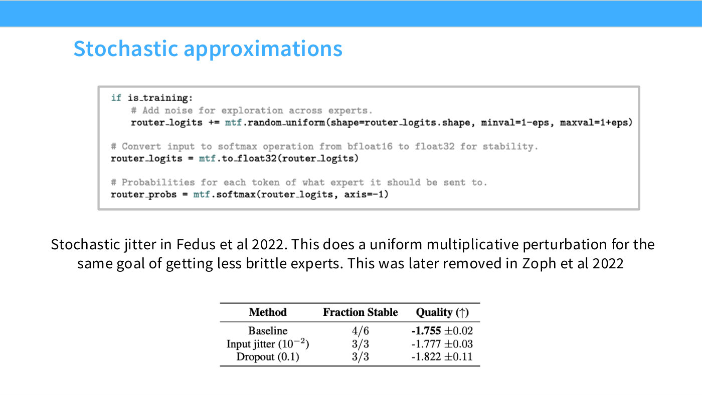

The second of the two same-titled slides. Two pasted images and one line of prose
between them.

**Figure 1 (top) — a boxed code screenshot** (Mesh-TensorFlow source, syntax
highlighted, comments in grey):

```
if is_training:
    # Add noise for exploration across experts.
    router_logits += mtf.random_uniform(shape=router_logits.shape, minval=1-eps, maxval=1+eps)

# Convert input to softmax operation from bfloat16 to float32 for stability.
router_logits = mtf.to_float32(router_logits)

# Probabilities for each token of what expert it should be sent to.
router_probs = mtf.softmax(router_logits, axis=-1)
```

Slide text beneath it: "Stochastic jitter in Fedus et al 2022. This does a uniform
multiplicative perturbation for the same goal of getting less brittle experts. This
was later removed in Zoph et al 2022".

Note the mismatch the code itself shows: the noise is drawn on $[1-\epsilon,
1+\epsilon]$ (a multiplicative jitter) but is applied with `+=`.

**Figure 2 (bottom) — a small pasted three-row table** (from Zoph et al 2022),
comparing stability and quality. The "Quality" column is marked with an up arrow
(higher is better) and the best entry is bolded in the original:

| Method | Fraction Stable | Quality (↑) |
| --- | --- | --- |
| Baseline | 4/6 | **-1.755** ±0.02 |
| Input jitter ($10^{-2}$) | 3/3 | -1.777 ±0.03 |
| Dropout (0.1) | 3/3 | -1.822 ±0.11 |

Jitter and dropout make every run stable (3/3 vs the baseline's 4/6) but cost quality,
which is why the jitter was dropped.

## Slide 40 — Heuristic balancing losses

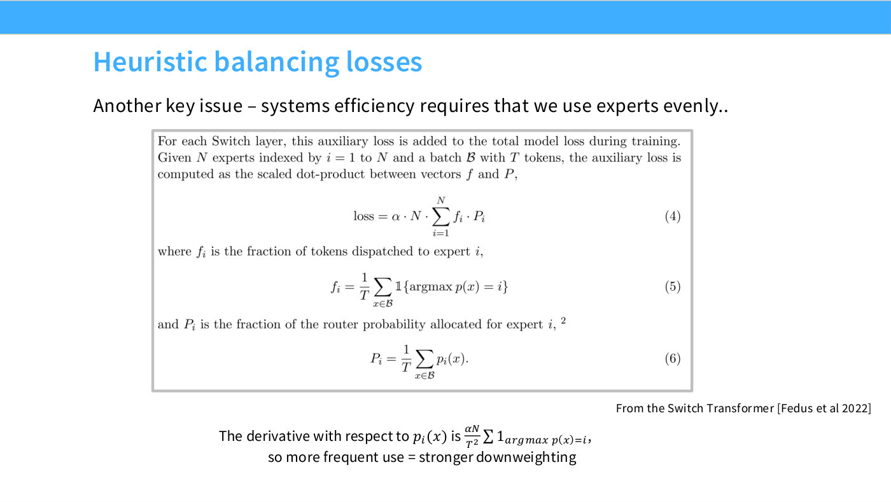

Subtitle: "Another key issue – systems efficiency requires that we use experts
evenly..". Credit at the right beneath the box: "From the Switch Transformer [Fedus
et al 2022]".

**Figure — a boxed screenshot of the Switch Transformer's auxiliary-loss derivation**,
carrying the paper's own equation numbers (4), (5), (6). Its text and equations read:

"For each Switch layer, this auxiliary loss is added to the total model loss during
training. Given $N$ experts indexed by $i = 1$ to $N$ and a batch $\mathcal{B}$ with
$T$ tokens, the auxiliary loss is computed as the scaled dot-product between vectors
$f$ and $P$,"

$$\mathrm{loss} = \alpha \cdot N \cdot \sum_{i=1}^{N} f_i \cdot P_i \qquad (4)$$

"where $f_i$ is the fraction of tokens dispatched to expert $i$,"

$$f_i = \frac{1}{T} \sum_{x \in \mathcal{B}} \mathbb{1}\{\arg\max p(x) = i\} \qquad (5)$$

"and $P_i$ is the fraction of the router probability allocated for expert $i$, $^2$"

$$P_i = \frac{1}{T} \sum_{x \in \mathcal{B}} p_i(x). \qquad (6)$$

Slide text centred beneath, in the deck's own font (this is Hashimoto's addition, not
part of the pasted figure):

"The derivative with respect to $p_i(x)$ is $\frac{\alpha N}{T^2} \sum \mathbb{1}_{arg\,max\ p(x)=i}$, so more frequent use = stronger downweighting"
## Slide 41 — Example from deepseek (v1-2)

Two headed sections, each followed by a grey-bordered box holding a numbered
equation block pasted from the DeepSeek paper. There are no charts or diagrams on
this page.

**"Per-expert balancing** – same as the switch transformer".

$$\mathcal{L}_{\mathrm{ExpBal}} = \alpha_1 \sum_{i=1}^{N'} f_i P_i, \qquad (12)$$

$$f_i = \frac{N'}{K'T} \sum_{t=1}^{T} \mathbb{1}(\text{Token } t \text{ selects Expert } i), \qquad (13)$$

$$P_i = \frac{1}{T} \sum_{t=1}^{T} s_{i,t}, \qquad (14)$$

**"Per-device balancing** – the objective above, but aggregated by device."

$$\mathcal{L}_{\mathrm{DevBal}} = \alpha_2 \sum_{i=1}^{D} f'_i P'_i, \qquad (15)$$

$$f'_i = \frac{1}{|\mathcal{E}_i|} \sum_{j \in \mathcal{E}_i} f_j, \qquad (16)$$

$$P'_i = \sum_{j \in \mathcal{E}_i} P_j, \qquad (17)$$

Here $N'$ is the number of routed experts, $K'$ the number selected per token, $T$
the number of tokens, $s_{i,t}$ the routing score of expert $i$ on token $t$, $D$
the number of devices and $\mathcal{E}_i$ the set of experts placed on device $i$;
$\alpha_1$ and $\alpha_2$ are the two loss weights.

## Slide 42 — DeepSeek v3 variation – per-expert biases

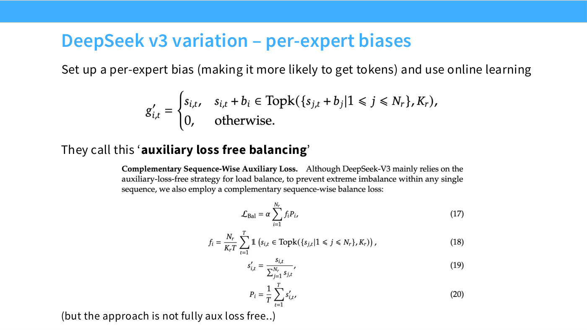

Text: "Set up a per-expert bias (making it more likely to get tokens) and use
online learning", followed by the gate definition:

$$g'_{i,t} = \begin{cases} s_{i,t}, & s_{i,t} + b_i \in \mathrm{Topk}(\{s_{j,t} + b_j \mid 1 \leqslant j \leqslant N_r\},\, K_r), \\[4pt] 0, & \text{otherwise.} \end{cases}$$

Then: "They call this '**auxiliary loss free balancing**'".

**Figure — a pasted paragraph and equation block from the DeepSeek-V3 report.**
The paragraph is headed **"Complementary Sequence-Wise Auxiliary Loss."** and
reads: "Although DeepSeek-V3 mainly relies on the auxiliary-loss-free strategy for
load balance, to prevent extreme imbalance within any single sequence, we also
employ a complementary sequence-wise balance loss:". Beneath it, four numbered
equations:

$$\mathcal{L}_{\mathrm{Bal}} = \alpha \sum_{i=1}^{N_r} f_i P_i, \qquad (17)$$

$$f_i = \frac{N_r}{K_r T} \sum_{t=1}^{T} \mathbb{1}\left(s_{i,t} \in \mathrm{Topk}(\{s_{j,t} \mid 1 \leqslant j \leqslant N_r\},\, K_r)\right), \qquad (18)$$

$$s'_{i,t} = \frac{s_{i,t}}{\sum_{j=1}^{N_r} s_{j,t}}, \qquad (19)$$

$$P_i = \frac{1}{T} \sum_{t=1}^{T} s'_{i,t}, \qquad (20)$$

At the foot of the page: "(but the approach is not fully aux loss free..)".

## Slide 43 — What happens when removing load balancing losses?

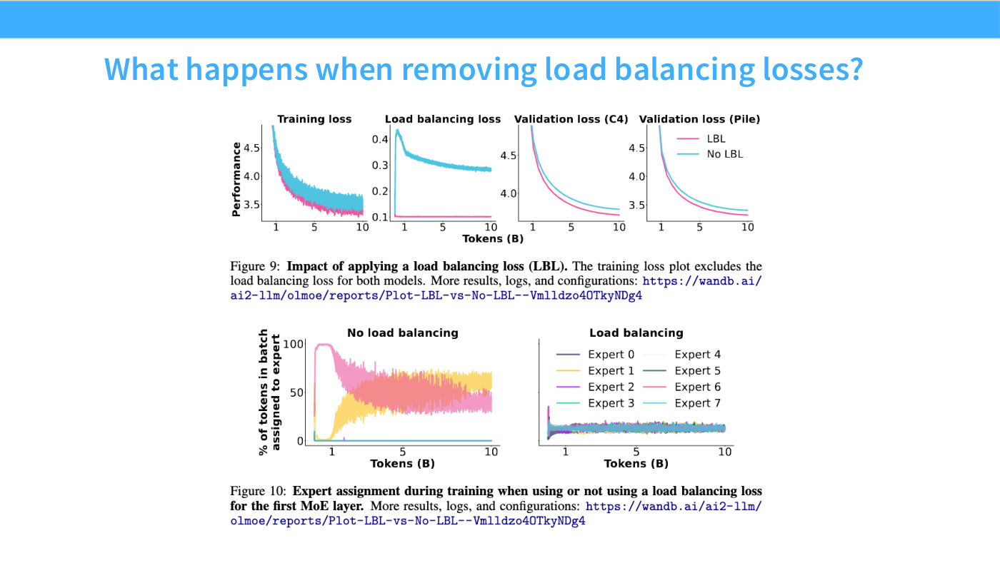

The title is the only text the slide itself contributes; the two pasted OLMoE
figures, with their printed captions, are the content.

**Figure 1 (top) — a four-panel line chart, captioned "Figure 9: Impact of
applying a load balancing loss (LBL). The training loss plot excludes the load
balancing loss for both models. More results, logs, and configurations:
`https://wandb.ai/ai2-llm/olmoe/reports/Plot-LBL-vs-No-LBL--Vmlldzo4OTkyNDg4`"**
The four panels share one x-axis label,
"Tokens (B)", ticked 1, 5, 10, and one y-axis label, "Performance", printed once
at the far left. The x-axis is linear, with 1B, 5B and 10B evenly spaced. Every
panel plots the same **two** series, with the legend drawn in the fourth panel:

- *Pink/magenta*, "LBL"
- *Cyan*, "No LBL"

Panel by panel:

- **"Training loss"** (y ticks 3.5, 4.0, 4.5). Both traces are noisy bands falling
  steeply then flattening. *LBL* (pink) is about 4.24 at 1B tokens, 3.50 at 5B and
  3.35 at 10B. *No LBL* (cyan) sits consistently above it — about 4.45 at 1B, 3.78
  at 5B, 3.55 at 10B.
- **"Load balancing loss"** (y ticks 0.1, 0.2, 0.3, 0.4). *No LBL* (cyan) spikes
  up to about 0.44 at roughly 0.2B, then decays: ~0.36 at 1B, ~0.31 at 5B, ~0.285
  at 10B. *LBL* (pink) is a flat line at about 0.105 for the whole run — the model
  trained with the loss keeps the load-balancing loss near its floor.
- **"Validation loss (C4)"** (y ticks 4.0, 4.5). Both curves enter the top of the
  panel at about 4.97, before the 1B tick; at 1B they are already ~0.15 apart, with
  *LBL* (pink) at roughly 4.62 and *No LBL* (cyan) at roughly 4.77. LBL then falls
  to roughly 3.83 at 5B and 3.70 at 10B; No LBL stays above it at roughly 3.92 at
  5B and 3.78 at 10B.
- **"Validation loss (Pile)"** (y ticks 3.5, 4.0, 4.5). *LBL* (pink) is about 4.38
  at 1B, 3.47 at 5B, 3.32 at 10B; *No LBL* (cyan) about 4.55 at 1B, 3.56 at 5B,
  3.40 at 10B. The two nearly coincide at 1B and separate by roughly 0.08-0.09 nats
  thereafter, with LBL lower throughout.

**Figure 2 (bottom) — a two-panel line chart, captioned "Figure 10: Expert
assignment during training when using or not using a load balancing loss for the
first MoE layer. More results, logs, and configurations:
`https://wandb.ai/ai2-llm/olmoe/reports/Plot-LBL-vs-No-LBL--Vmlldzo4OTkyNDg4`"**
(same wandb report URL as Figure 9). Shared y-axis label "% of tokens in batch
assigned to expert", ticked 0, 50, 100; each panel prints its own x-axis label
"Tokens (B)", ticked 1, 5, 10 on a linear scale (only the y-axis label is shared). Both panels plot the same **eight** series, one per expert; the legend
sits inside the right-hand panel and lists, in two columns, Expert 0 (dark
slate-blue), Expert 1 (yellow/gold), Expert 2 (magenta-purple), Expert 3 (green),
Expert 4 (very pale cream), Expert 5 (dark teal), Expert 6 (pink), Expert 7 (light
blue).

- **Left panel, "No load balancing".** Routing collapses. Expert 6 (pink) jumps to
  100% almost immediately and holds it until about 1B tokens, then decays into a
  wide noisy band centred near 50% and drifting down towards ~40% by 10B. Expert 1
  (yellow) is near 0% through the collapse, then rises from about 1B to join the
  same band, ending as the upper of the two around 55–65% at 10B. All six remaining
  experts sit flat on 0% for the entire run.
- **Right panel, "Load balancing".** After a brief spike at the very start (one
  series reaching about 35%), all eight experts converge into a single overlapping
  noisy band around 12–15% — i.e. roughly the uniform 1/8 share — and stay there
  for the rest of training. No expert is distinguishable from the others after
  ~1B tokens.

## Slide 44 — Training MoEs – the systems side

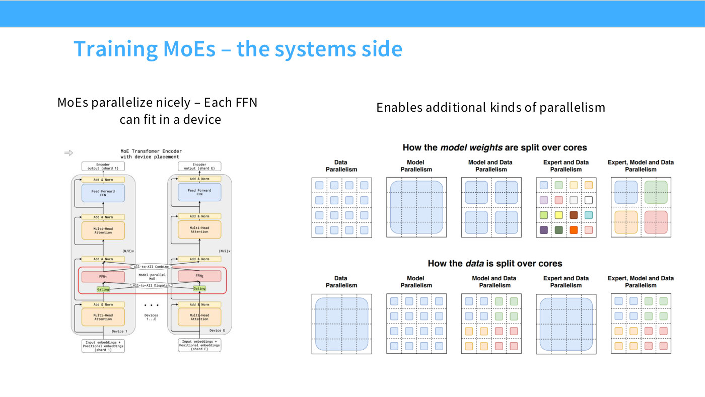

Two headed halves, each a pasted figure. Left heading: "MoEs parallelize nicely –
Each FFN can fit in a device". Right heading: "Enables additional kinds of
parallelism".

**Figure 1 (left) — block diagram titled "MoE Transfomer Encoder with device
placement"** (the typo "Transfomer" is in the original). Two identical encoder
stacks are drawn side by side inside rounded grey panels labelled **Device 1** and
**Device E**, with an ellipsis and the label "Devices 1...E" between them. Reading
each stack from the bottom up:

- A white box "Input embeddings + Positional embeddings (shard 1)" (respectively
  "(shard E)") feeds up into an orange **Multi-Head Attention** box, whose output
  goes to a yellow **Add & Norm**; a residual arrow bypasses the attention into
  the same Add & Norm.
- Above that sits the MoE layer, outlined in red and annotated "Model-parallel
  MoE". Inside it, the stream reaches a green **Gating** box; from Gating, arrows
  run into a white ellipse labelled **All-to-All Dispatch**, which fans out to the
  pink **FFN₁** box on device 1 and the pink **FFN_E** box on device E (the
  crossing arrows show each device's tokens being sent to either expert). The FFN
  outputs feed a second white ellipse, **All-to-All Combine**, whose arrows cross
  back to the yellow **Add & Norm** on each device.
- Above the MoE layer, a second sub-stack repeats the dense pattern: orange
  **Multi-Head Attention** → yellow **Add & Norm** → blue **Feed Forward FFN** →
  yellow **Add & Norm**, each with its own residual arrow. This upper group is
  annotated **(N/2)x** on both sides.
- The top box on each stack is "Encoder output (shard 1)" / "Encoder output
  (shard E)".

A small grey arrow in the top-left margin points into the figure.

**Figure 2 (right) — two rows of five 4×4 grids, each grid representing 16 cores
with dashed gridlines.** The top row is headed "**How the *model weights* are
split over cores**", the bottom row "**How the *data* is split over cores**".
Both rows use the same five column headings: "Data Parallelism", "Model
Parallelism", "Model and Data Parallelism", "Expert and Data Parallelism",
"Expert, Model and Data Parallelism".

Top row (model weights):

- *Data Parallelism*: 16 small identical blue squares, one per core — the whole
  weight matrix is replicated everywhere.
- *Model Parallelism*: one single large blue rounded square spanning all 16 cores
  — one copy of the weights, sharded across the whole mesh.
- *Model and Data Parallelism*: four large blue rounded squares, each spanning a
  2×2 block of cores — two replicas each sharded over four cores.
- *Expert and Data Parallelism*: 16 small squares in 16 *different* colours (blue,
  green, cream, orange; lilac, salmon, off-white, white; olive-green, yellow,
  brown, teal; dark purple, dark green, red-orange, pale pink) — one distinct
  expert per core.
- *Expert, Model and Data Parallelism*: four large rounded squares in four
  different colours (blue top-left, green top-right, orange bottom-left, red
  bottom-right), each spanning a 2×2 block — four experts, each sharded over four
  cores.

Bottom row (data):

- *Data Parallelism*: one large blue rounded square over the whole grid — the
  batch is split across all cores.
- *Model Parallelism*: 16 small identical blue squares — every core sees the same
  data.
- *Model and Data Parallelism*: 16 small squares coloured in four 2×2 blocks
  (blue top-left, green top-right, orange bottom-left, red bottom-right).
- *Expert and Data Parallelism*: one large blue rounded square over the whole grid.
- *Expert, Model and Data Parallelism*: 16 small squares in the same four-block
  colouring as "Model and Data Parallelism" (blue, green, orange, red 2×2 blocks).

## Slide 45 — Training MoEs – the systems side

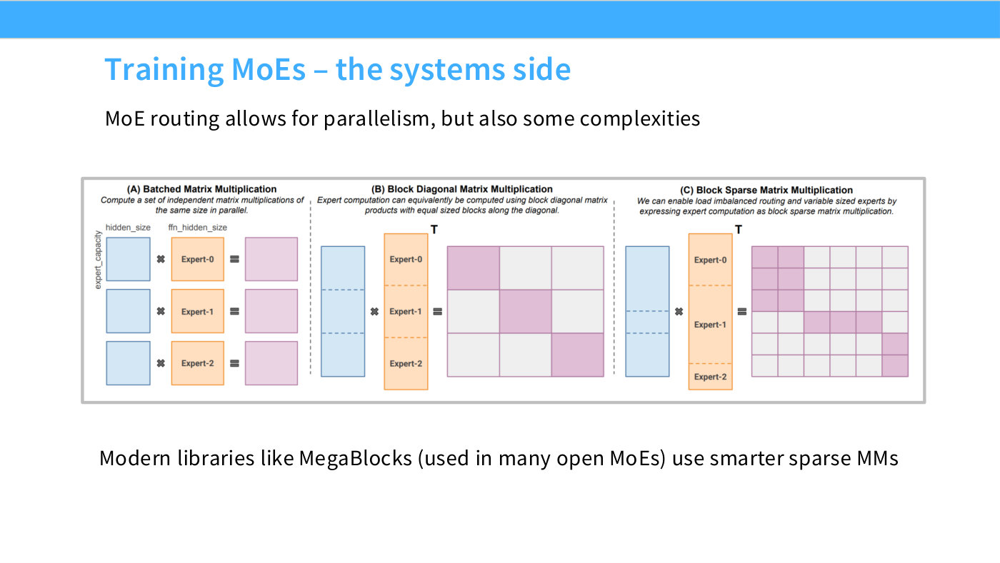

Text above the figure: "MoE routing allows for parallelism, but also some
complexities". Text beneath it: "Modern libraries like MegaBlocks (used in many
open MoEs) use smarter sparse MMs".

**Figure — a three-panel schematic (one grey-bordered strip, panels separated by
dashed vertical rules) contrasting three ways of computing the expert layer.**
Each panel draws a matrix product: a blue operand, a **✻** multiplication symbol,
an orange operand labelled with expert names, an **=** sign, and a purple/grey
result.

- **(A) Batched Matrix Multiplication** — italic caption "Compute a set of
  independent matrix multiplications of the same size in parallel." Three separate
  products are stacked vertically. Each row is: a blue square (its width annotated
  `hidden_size`, the stack's height annotated `expert_capacity` down the left
  margin) ✻ an orange square labelled **Expert-0**, **Expert-1** or **Expert-2**
  (width annotated `ffn_hidden_size`) = a solid purple square. All three products
  are the same size.
- **(B) Block Diagonal Matrix Multiplication** — italic caption "Expert computation
  can equivalently be computed using block diagonal matrix products with equal
  sized blocks along the diagonal." One tall blue column (divided by two dashed
  horizontal lines into three equal segments) ✻ one tall orange column labelled,
  top to bottom, **Expert-0**, **Expert-1**, **Expert-2** and marked with a
  superscript **T** (transpose) = a 3×3 grid of blocks in which only the three
  diagonal blocks are filled purple; the six off-diagonal blocks are pale grey.
  All three diagonal blocks are the same size.
- **(C) Block Sparse Matrix Multiplication** — italic caption "We can enable load
  imbalanced routing and variable sized experts by expressing expert computation as
  block sparse matrix multiplication." One tall blue column (again split by two
  dashed lines, but into *unequal* segments) ✻ one tall orange column, marked
  **T**, split by dashed lines into unequal segments labelled **Expert-0** (largest),
  **Expert-1** (middle) and **Expert-2** (smallest) = a 6×6 grid of blocks in which
  the purple-filled cells form a *staircase* of differently sized diagonal blocks:
  a 3-row × 2-column purple block at the top left, then a 1-row × 3-column purple
  block in the middle, then a 2-row × 1-column purple block at the bottom right.
  Everything else is pale grey.

## Slide 46 — MoE parallelism and architecture modifications


The only slide text besides the title is the line beneath the figure: "New ideas
from Nemotron 3 – down-projecting the activations to reduce communication".

**Figure — a two-panel block diagram pasted from a paper, headed
"2.2. LatentMoE: Hardware-Aware Expert Design for Improved Accuracy per Byte".**
The two panels are captioned "(a) Standard MoE architecture." and
"(b) LatentMoE architecture.". Both are drawn bottom-to-top with two ⊕ residual
adders on the main vertical path.

- **(a) Standard MoE architecture.** From the bottom: "From previous layer" feeds a
  **Self-Attention** box, with a residual line bypassing it; both meet at the lower
  **⊕**. From that adder, one branch goes right into the **Router** box (drawn with
  a small four-bar histogram of routing scores sitting on top of it), one branch goes
  up into **All-to-All dispatch**, and one long branch goes up-left into the **SE**
  box (the shared expert). The Router also feeds an arrow into All-to-All dispatch.
  Above the dispatch box sits a row of five boxes: **SE**, **E1**, **E2**, **E3**,
  **E4**; **E2** and **E3** are hatched (the two experts selected for this token) and
  are the only ones the dispatch box's solid arrows reach. Each of E2 and E3 feeds a
  circled **⊗** gate; dotted arrows run from the router's histogram bars into those
  same ⊗ gates, supplying the gating weights. The ⊗ outputs and the SE output feed
  **All-to-All combine**, whose output goes to the upper **⊕**, which also receives
  the long residual line from the lower adder. From there, "To next layer".
- **(b) LatentMoE architecture.** Same skeleton, with two green-shaded boxes added
  and twice as many experts. From the lower **⊕** the stream goes up into a green
  **Latent down-proj** box before reaching **All-to-All dispatch**; on the way out,
  **All-to-All combine** feeds a green **Latent up-proj** box before the upper **⊕**.
  The expert bank is now two rows of four: top row **E1**, **E2**, **E3**, **E4**;
  bottom row **E5**, **E6**, **E7**, **E8**. Hatched (selected) here are **E1**,
  **E2**, **E4** and **E7** — four experts rather than two — and four circled **⊗**
  gates sit above them, each fed by a dotted arrow from the router's histogram (now
  drawn with more, smaller bars). **SE** again bypasses the dispatch/combine path and
  feeds straight into **All-to-All combine**; the long residual from the lower ⊕ runs
  up the left side to the upper ⊕. Bottom of the panel: **Self-Attention** and
  "From previous layer" as in (a).

The visual point is that the green down- and up-projections sit on either side of
the all-to-all, so the tensors that cross the network are the low-dimensional
latents.

## Slide 47 — Fun side issue – stochasticity of MoE models


Text above the figure: "MoEs can have additional stochasticity beyond normal
models.." and "Why would a MoE have additional randomness?". Text beneath it, in
larger type: "Token dropping from routing happens at a *batch* level – this means
that other people's queries can drop your token!"

**Figure — a four-stage pipeline diagram (one grey-bordered strip divided by
dashed vertical rules), each stage with a bold heading and an italic caption.**
The worked example uses the six tokens "the", "quick", "brown", "fox", "jumped",
"over".

- **(1) Routing** — *"Assign token feature vectors to experts based on
  probabilities."* A blue stack of six labelled rows ("the", "quick", "brown",
  "fox", "jumped", "over"), braced `tokens` down the left side and `hidden_size`
  across the top. An arrow drops from the stack into a purple vertical **Router**
  box, which emits two blue index strips: **Expert Indices** = `1 2 0 2 1 2` and
  **Probabilities** = `.66 .43 .91 .37 .54 .75`. A separate arrow runs from the
  token stack across to stage 2.
- **(2) Permutation** — *"Group tokens by expert. Drop tokens that exceed expert
  capacity."* An orange vertical **Permutation** bar, fed by the token stack and by
  the Expert-Indices strip, fans out into three dashed grey group boxes annotated
  `capacity_factor=1` (two slots each): the top box holds "brown" and *(unused)*;
  the middle box holds "the" and "jumped"; the bottom box holds "quick" and "fox".
  A large red **✗** with the italic label *(dropped)* marks the sixth token,
  "over", which exceeds capacity and is discarded. (The printed index vector
  `1 2 0 2 1 2` and the expert labels used in stages 3–4 do not line up: stages
  3–4 label "brown" as Expert-2's token and "quick"/"fox" as Expert-0's.)
- **(3) Computation** — *"Compute the expert layers for the set of tokens they were
  assigned."* Each group box feeds a teal vertical expert box — top to bottom
  **Expert-2**, **Expert-1**, **Expert-0** — and each expert emits a dashed grey
  output block.
- **(4) Un-Permutation** — *"Un-permute the results and scale each by its expert
  probability."* The three output blocks feed a second orange **Permutation** bar,
  whose crossing arrows restore the original token order into a blue six-row stack:
  **Expert-1("the")**, **Expert-0("quick")**, **Expert-2("brown")**,
  **Expert-0("fox")**, **Expert-1("jumped")**, and a final grey row reading **0** —
  the dropped token's slot. That stack feeds a red vertical **Scale** box and then
  out of the figure. Two long feedback lines run along the bottom of the whole
  strip: one from the Expert-Indices strip up into the second Permutation bar, and
  one from the Probabilities strip up into the Scale box.

## Slide 48 — Issues with MoEs - stability

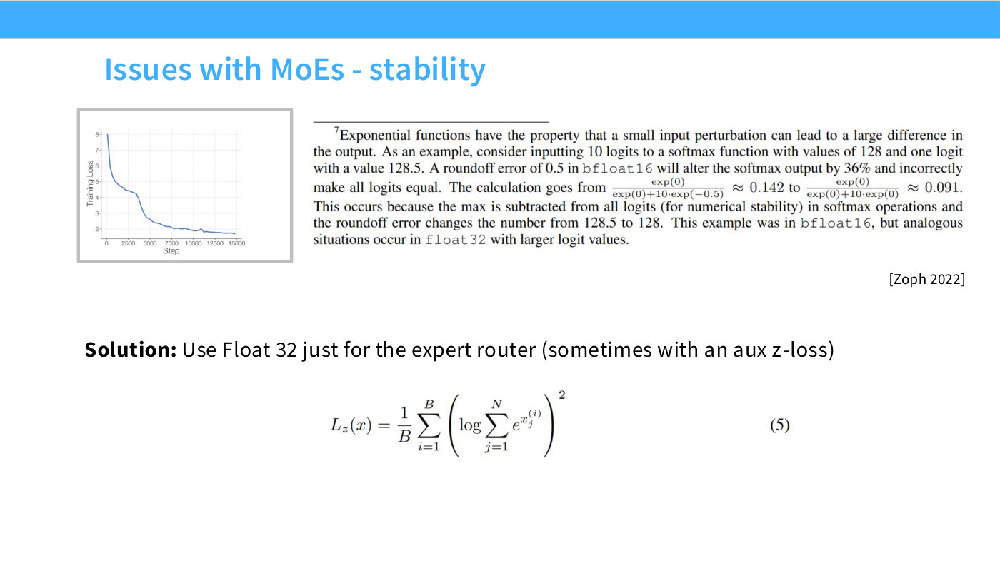

Credit at the right, beneath the pasted text: "[Zoph 2022]".

**Figure 1 (top left) — a single-series line chart.** x-axis "Step", ticked 0,
2500, 5000, 7500, 10000, 12500, 15000; y-axis "Training Loss", ticked 2 through 8
in steps of 1. **One** series, a solid blue line: it starts at 8 at step ~100,
plunges to about 5.9 by step 500 and 5.0 by step 1000, eases to a shelf near 4.45
around step 2500, sits at ~4.25 by 3500, then falls sharply again to about 2.75 by
step 4700, decays slowly to ~2.15 at 7500, ~2.05 at 9000, jitters (a small bump to
~2.05 near 11000, a step down to ~1.85 just after), and ends at about 1.7 at
15000. The trace is a loss curve with visible plateaus and small discontinuities
rather than a smooth decay.

**Figure 2 (top right) — a pasted footnote (footnote 7) from Zoph 2022**, printed
above a horizontal rule:

"Exponential functions have the property that a small input perturbation can lead
to a large difference in the output. As an example, consider inputting 10 logits
to a softmax function with values of 128 and one logit with a value 128.5. A
roundoff error of 0.5 in `bfloat16` will alter the softmax output by 36% and
incorrectly make all logits equal. The calculation goes from
$\frac{\exp(0)}{\exp(0)+10\cdot\exp(-0.5)} \approx 0.142$ to
$\frac{\exp(0)}{\exp(0)+10\cdot\exp(0)} \approx 0.091$. This occurs because the
max is subtracted from all logits (for numerical stability) in softmax operations
and the roundoff error changes the number from 128.5 to 128. This example was in
`bfloat16`, but analogous situations occur in `float32` with larger logit values."

Slide text in bold beneath: "**Solution:** Use Float 32 just for the expert router
(sometimes with an aux z-loss)", followed by the pasted z-loss equation:

$$L_z(x) = \frac{1}{B} \sum_{i=1}^{B} \left( \log \sum_{j=1}^{N} e^{x_j^{(i)}} \right)^2 \qquad (5)$$

## Slide 49 — Z-loss stability for the router


Below the figure, the slide asks: "What happens when we remove the z-loss?"

**Figure — a four-panel chart with a shared x-axis label "Tokens (B)", ticked 10,
250, 500, 750, and the shared y-axis label "Performance" printed at the far left.**
Every panel plots the same **two** series; the legend sits inside the third panel:

- *Pink/magenta*, "Z-loss"
- *Cyan*, "No z-loss"

Panel by panel:

- **"Training loss"** (y ticks 2.5, 3.0, 3.5, 4.0; the axis is clipped at 4.0).
  Both traces descend from above 4.0 to a baseline that falls from about 2.5 at
  10B to roughly 2.2 by 750B, but both are shot through with vertical loss spikes
  that run off the top of the panel. The cyan "No z-loss" run spikes far more
  often — dozens of full-height spikes across the whole run — while the pink
  "Z-loss" run shows only a handful (a wide one near 100B and a few narrow ones
  around 450B, 700B and 730B). The pink baseline also sits slightly *below* the
  cyan baseline for most of the run.
- **"Validation loss (C4)"** (y ticks 2.5, 3.0, 3.5, 4.0). Both curves fall from
  above 4.0 at 10B to about 2.7 by 100B and drift down to ~2.6 by 750B. Cyan
  carries several tall isolated spikes — one reaching past 4.0 near 280B, one to
  ~3.05 near 380B, one to ~3.15 near 540B — plus a cluster of smaller ones between
  550B and 700B; pink has only small bumps (about 2.95 near 100B).
- **"HellaSwag"** (y ticks 40, 60). Both rise steeply from about 27 at 10B to ~57
  by 150B and then climb slowly to ~64–65 at 750B. Pink is the smoother and
  slightly higher of the two after ~200B; cyan tracks it but drops repeated deep
  downward spikes — to ~50 near 200B, to ~34 near 290B, to ~48 near 420B, and a
  cluster in the 500–650B range — recovering each time.
- **"MMLU Var"** (y ticks 25, 30, 35). Both rise from about 24.5 at 10B to ~31 by
  150B, then climb noisily to ~33 by 750B. Pink runs slightly above cyan over the
  second half (reaching ~34.5 at its peaks); cyan again shows deeper downward
  excursions, dipping to ~25.5 near 290B and to ~28 several times between 400B and
  700B.

Printed caption beneath the panels: "Figure 11: **Router z-loss.** We compare
adding router z-loss with a loss weight of 0.001 versus no additional z-loss. More
results, logs, and configurations:
`https://wandb.ai/ai2-llm/olmoe/reports/Plot-Zloss-vs-none--Vmlldzo4NDM4NjUz`".

## Slide 50 — Issues with MoEs – fine-tuning

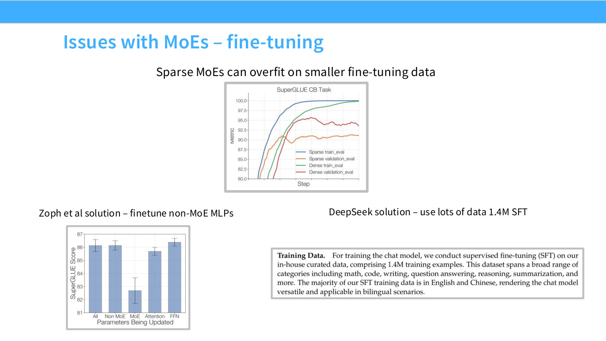

Heading above the first figure: "Sparse MoEs can overfit on smaller fine-tuning
data". Two captions below: "Zoph et al solution – finetune non-MoE MLPs" (left)
and "DeepSeek solution – use lots of data 1.4M SFT" (right).

**Figure 1 (top centre) — a line chart titled "SuperGLUE CB Task".** x-axis "Step"
(gridlines only, no numeric ticks printed); y-axis "Metric", ticked 80.0, 82.5,
85.0, 87.5, 90.0, 92.5, 95.0, 97.5, 100.0. **Four** series, in legend order:

- *Blue*, "Sparse train_eval": rises fastest — off the bottom of the axis at the
  left, through ~87 early, ~92.5 at the point where the other curves are still
  climbing, ~96 shortly after, ~97.8 and then flattening onto 100.0, which it holds
  for the whole right-hand half of the plot.
- *Orange*, "Sparse validation_eval": climbs to about 90.8 quickly, dips to ~89.4,
  recovers to ~90.5–91.0 and then stays flat in the 90.3–91.2 band for the rest of
  the run, ending at about 91.1. It is the lowest curve over the second half.
- *Green*, "Dense train_eval": rises more slowly than blue — around 87 where blue
  is already at 92.5 — crosses 95 later, then climbs steadily to ~98 and finally to
  about 99.8 at the right edge, still just short of blue.
- *Red*, "Dense validation_eval": climbs to about 94.3, peaks near 95.7, then
  decays and oscillates in the 93.5–94.8 band, ending at about 93.6. It sits well
  above the orange sparse-validation curve throughout.

The intended reading: the sparse model reaches perfect training accuracy first but
its validation curve saturates about 3 points below the dense model's — the MoE
overfits.

**Figure 2 (bottom left) — a bar chart with error bars.** x-axis "Parameters Being
Updated" with five categories; y-axis "SuperGLUE Score", ticked 81 through 87 in
steps of 1. **One** series (all bars the same slate-blue); the black whiskers are
error bars, not a second series.

| Parameters being updated | Bar height | Error bar (approx.) |
| --- | --- | --- |
| All | ~86.15 | 85.7 – 86.6 |
| Non MoE | ~86.15 | 85.75 – 86.5 |
| MoE | ~82.7 | 81.7 – 83.65 |
| Attention | ~85.7 | 85.4 – 86.0 |
| FFN | ~86.4 | 86.1 – 86.7 |

Updating only the MoE parameters is both much worse (~3.5 points below the others)
and much more variable; every other subset lands within a few tenths of updating
everything.

**Figure 3 (bottom right) — a pasted paragraph from the DeepSeek report**, in a
grey-bordered box:

"**Training Data.** For training the chat model, we conduct supervised fine-tuning
(SFT) on our in-house curated data, comprising 1.4M training examples. This dataset
spans a broad range of categories including math, code, writing, question
answering, reasoning, summarization, and more. The majority of our SFT training
data is in English and Chinese, rendering the chat model versatile and applicable
in bilingual scenarios."

## Slide 51 — Other training methods - upcycling


The only slide text besides the title is the question at the foot: "Can we use a
pre-trained LM to initialize a MoE?" Two pasted figures sit above it.

**Figure 1 (left) — a block diagram in two stacked grey panels, "Original Dense
Block" (top) and "Upcycled MoE Block" (bottom).**

- *Original Dense Block*, left to right along the residual stream: a yellow **Layer
  Norm** → a green **Attention** → a **⊕** adder (with a residual line bypassing
  the first two boxes) → a second yellow **Layer Norm** → a blue **MLP** → a second
  **⊕** adder (again with a bypassing residual line) → out.
- Three dotted arrows labelled **"copy weights"** run down from the dense block's
  Layer Norm, Attention and second Layer Norm to the corresponding boxes in the
  lower panel. A fourth dotted arrow runs from the dense **MLP** rightwards into a
  pink stacked-pages icon labelled **"Make E MLP copies"**, and from that icon
  three dotted arrows descend into the experts of the MoE.
- *Upcycled MoE Block*, left to right: yellow **Layer Norm** → green **Attention** →
  **⊕** → yellow **Layer Norm** → a pink **Router** box annotated "from scratch" →
  a dotted-bordered **MoE** sub-panel containing three blue expert boxes stacked
  vertically, **MLP 1**, **MLP 2**, ⋮, **MLP E**, all fed by the Router and all
  feeding a pink **Weighted Sum** box (the Router also feeds the Weighted Sum
  directly, supplying the gate weights) → **⊕** → out. Residual lines bypass the
  attention and the whole MoE sub-block.

The point: everything except the router is copied from the dense checkpoint, the
MLP is replicated $E$ times, and only the router is new.

**Figure 2 (right) — a scatter plot.** x-axis "Extra Pretraining Time
(TPU-core-days)", log scale, ticked $10^1$, $10^2$, $10^3$; y-axis "C4 Validation
Token Accuracy", ticked 68%, 70%, 72%, 73%, 75%. Marker *size* encodes a second
variable: the legend has two blocks, "method" (colour) and "variant" (size, small
= **Base**, medium = **Large**, large = **XL**). There are **two** data series:

- *Blue*, "Dense": three size-graded runs. The Base-sized points start at ~67.9% at
  4 TPU-core-days and creep up to ~68.4% by ~35 days; the Large-sized points start
  at ~71.8% near 35 days and rise to ~72.2% by ~300 days; the XL-sized points start
  at ~74.0% near 130 days and rise to ~74.4% by ~1500 days. Each dense run gains
  only a few tenths of a percent for a 10× increase in compute.
- *Orange*, "Upcycling": also size-graded, and it climbs far more steeply. The
  Base-sized upcycled points run from ~68.3% at ~6 days through ~69.2% at 10 days,
  ~69.9% at 15, ~70.4% at 25, to ~71.1% at ~55 days; the Large-sized points run
  from ~72.3% at ~50 days through ~72.8% at 100, ~73.1% at 130, ~73.6% at 220, to
  ~74.1% near 350 days; the XL-sized points continue from ~74.2% at ~350 days up
  through ~74.6% at 700, ~74.9% at 1000, ~75.3% at 1300, to ~75.6% at ~1600 days —
  the highest points on the chart.

Three horizontal dashed light-blue **reference lines** are drawn across the plot
and labelled in the right margin **Base** (at ~68.0%), **Large** (at ~71.8%) and
**XL** (at ~74.0%); these mark the starting accuracy of each dense checkpoint and
are annotations, not data series.

## Slide 52 — Upcycling example - MiniCPM


Text above the table: "Uses the MiniCPM model (topk=2, 8 experts, ~ 4B active
params)." Text below it: "Simple MoE, shows gains from the base model with ~ 520B
tokens for training".

**Figure — a benchmark table pasted as an image**, captioned "Table 6: Benchmark
results of MiniCPM-MoE. † means evaluation results on the full set of MBPP,
instead of the hand-verified set (Austin et al., 2021). The evaluation results of
Llama2-34B and Qwen1.5-7B are taken from their technical reports." A horizontal
rule separates the four baseline models from the two MiniCPM rows; the
MiniCPM-MoE row is set in bold, as are individual best-in-column figures.

| Model | C-Eval | CMMLU | MMLU | HumanEval | MBPP | GSM8K | MATH | BBH |
| --- | --- | --- | --- | --- | --- | --- | --- | --- |
| Llama2-34B | - | - | 62.6 | 22.6 | 33.0† | 42.2 | 6.24 | **44.1** |
| Deepseek-MoE (16B) | 40.6 | 42.5 | 45.0 | 26.8 | 39.2 | 18.8 | 4.3 | - |
| Mistral-7B | 46.12 | 42.96 | **62.69** | 27.44 | 45.20 | 33.13 | 5.0 | 41.06 |
| Gemma-7B | 42.57 | 44.20 | 60.83 | 38.41 | 50.12 | 47.31 | 6.18 | 39.19 |
| MiniCPM-2.4B | 51.13 | 51.07 | 53.46 | 50.00 | 47.31 | 53.83 | 10.24 | 36.87 |
| **MiniCPM-MoE (13.6B)** | **58.11** | **58.80** | 58.90 | **56.71** | **51.05** | **61.56** | **10.52** | 39.22 |

The table has no average or total row. MiniCPM-MoE improves on its own 2.4B base
model in every column.

## Slide 53 — Upcycling example – Qwen MoE


Text above the table: "**Qwen MoE** – Initialized from the Qwen 1.8B model
top-k=4, 60 experts w/ 4 shared." Text beneath: "Similar architecture / setup to
DeepSeekMoE, but one of the first (confirmed) upcycling successes".

**Figure — a results table pasted as an image** (no caption, no bolded cells, no
average row). The two parameter columns are in billions.

| Model | #Parameters | #(Activated) Parameters | MMLU | GSM8K | HumanEval | Multilingual | MT-Bench |
| --- | --- | --- | --- | --- | --- | --- | --- |
| Mistral-7B | 7.2 | 7.2 | 64.1 | 47.5 | 27.4 | 40.0 | 7.60 |
| Qwen1.5-7B | 7.7 | 7.7 | 64.6 | 50.9 | 32.3 | - | - |
| Gemma-7B | 8.5 | 7.8 | 61.0 | 62.5 | 36.0 | 45.2 | 7.60 |
| DeepSeekMoE 16B | 16.4 | 2.8 | 45.0 | 18.8 | 26.8 | - | 6.93 |
| Qwen1.5-MoE-A2.7B | 14.3 | 2.7 | 62.5 | 61.5 | 34.2 | 40.8 | 7.17 |

## Slide 54 — DeepSeek MoE v1-v2-v3

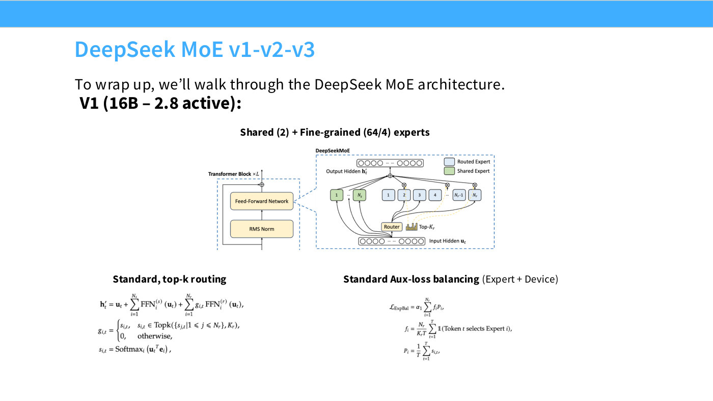

Text: "To wrap up, we'll walk through the DeepSeek MoE architecture." Then, in
bold, "**V1 (16B – 2.8 active):**". Centred above the figure, in bold: "Shared (2)
+ Fine-grained (64/4) experts".

**Figure — the DeepSeekMoE layer diagram (pasted from the DeepSeek paper).** On
the left, a dashed-blue box labelled "**Transformer Block** $\times L$" containing
two yellow rounded boxes stacked on a residual stream: **RMS Norm** at the bottom,
**Feed-Forward Network** above it, with a ⊕ adder at the top and a residual line
running up the left side. Two dashed blue lines expand the Feed-Forward Network
into the larger dashed-blue panel on the right, labelled "**DeepSeekMoE**".

Inside that panel, bottom to top: a row of circles labelled "**Input Hidden**
$\mathbf{u}_t$"; arrows fan out from it to every expert and to a yellow **Router**
box. Beside the Router sits a small yellow bar histogram annotated "Top-$K_r$".
The expert row consists of two green boxes labelled **1** and $N_s$ (legend:
"Shared Expert"), separated by an ellipsis, followed by six blue boxes labelled
**1**, **2**, **3**, **4**, ellipsis, $N_r$-**1**, $N_r$ (legend: "Routed
Expert"). Dashed yellow arrows run from the Router's histogram to three circled
**⊗** gates that sit above the selected routed experts (2, one of the middle ones,
and $N_r$); each ⊗ multiplies that expert's output by its gate weight. The shared
experts' outputs and the ⊗ outputs all feed a single ⊕, whose output is the row of
circles labelled "**Output Hidden** $\mathbf{h}'_t$". A legend at the top right
gives the two colours: light blue = **Routed Expert**, green = **Shared Expert**.

Beneath the figure, two labelled equation blocks.

**"Standard, top-k routing"** (left):

$$\mathbf{h}'_t = \mathbf{u}_t + \sum_{i=1}^{N_s} \mathrm{FFN}^{(s)}_i(\mathbf{u}_t) + \sum_{i=1}^{N_r} g_{i,t}\,\mathrm{FFN}^{(r)}_i(\mathbf{u}_t),$$

$$g_{i,t} = \begin{cases} s_{i,t}, & s_{i,t} \in \mathrm{Topk}(\{s_{j,t} \mid 1 \leqslant j \leqslant N_r\},\, K_r), \\[4pt] 0, & \text{otherwise,} \end{cases}$$

$$s_{i,t} = \mathrm{Softmax}_i\!\left(\mathbf{u}_t^{T} \mathbf{e}_i\right),$$

**"Standard Aux-loss balancing** (Expert + Device)" (right):

$$\mathcal{L}_{\mathrm{ExpBal}} = \alpha_1 \sum_{i=1}^{N_r} f_i P_i,$$

$$f_i = \frac{N_r}{K_r T} \sum_{t=1}^{T} \mathbb{1}(\text{Token } t \text{ selects Expert } i),$$

$$P_i = \frac{1}{T} \sum_{t=1}^{T} s_{i,t},$$

## Slide 55 — DeepSeek MoE v2


Bold text: "**V2 (236B – 21 active):**". Centred above the figure, in bold:
"Shared (2) + Fine-grained (160/10) experts, 6 active". Below the figure, in bold:
"New things:".

**Figure 1 (top) — the same DeepSeekMoE layer diagram as slide 54**, pixel for
pixel: the dashed "Transformer Block $\times L$" box with **RMS Norm** and
**Feed-Forward Network** on a residual stream, expanded into the "DeepSeekMoE"
panel with **Input Hidden** $\mathbf{u}_t$ at the bottom, the yellow **Router**
with its "Top-$K_r$" histogram, the green shared experts **1** … $N_s$, the blue
routed experts **1**, **2**, **3**, **4**, …, $N_r$-**1**, $N_r$, the dashed
yellow gate arrows into three **⊗** nodes, the summing ⊕, and **Output Hidden**
$\mathbf{h}'_t$ at the top, with the "Routed Expert" / "Shared Expert" legend.

**Left half — heading "Top-M device routing", then a pasted paragraph** in a
grey-bordered box:

"For DeepSeek-V2, beyond the naive top-K selection of routed experts, we
additionally ensure that the target experts of each token will be distributed on
at most $M$ devices. To be specific, for each token, we first select $M$ devices
that have experts with the highest affinity scores in them. Then, we perform top-K
selection among experts on these $M$ devices. In practice, we find that when
$M \geqslant 3$, the device-limited routing can achieve a good performance roughly
aligned with the unrestricted top-K routing."

**Right half — heading "Communication balancing loss – balancing both
communication in *and* out", then a pasted equation block and paragraph** in a
grey-bordered box:

$$\mathcal{L}_{\mathrm{CommBal}} = \alpha_3 \sum_{i=1}^{D} f''_i P''_i, \qquad (29)$$

$$f''_i = \frac{D}{MT} \sum_{t=1}^{T} \mathbb{1}(\text{Token } t \text{ is sent to Device } i), \qquad (30)$$

$$P''_i = \sum_{j \in \mathcal{E}_i} P_j, \qquad (31)$$

"where $\alpha_3$ is a hyper-parameter called communication balance factor. The
device-limited routing mechanism operates on the principle of ensuring that each
device transmits at most $MT$ hidden states to other devices. Simultaneously, the
communication balance loss is employed to encourage each device to receive around
$MT$ hidden states from other devices. The communication balance loss guarantees a
balanced exchange of information among devices, promoting efficient
communications."

## Slide 56 — DeepSeek MoE v3

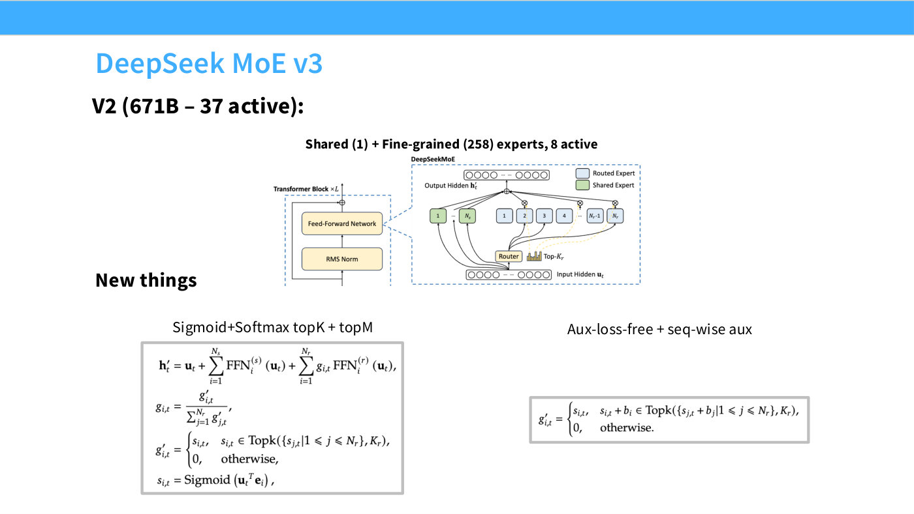

Bold text: "**V2 (671B – 37 active):**" (printed as "V2" on the slide even though
the title says v3). Centred above the figure, in bold: "Shared (1) + Fine-grained
(258) experts, 8 active". Below the figure, in bold: "New things".

**Figure 1 (top) — the same DeepSeekMoE layer diagram as slides 54 and 55**,
unchanged: "Transformer Block $\times L$" with **RMS Norm** and **Feed-Forward
Network**, expanded into the "DeepSeekMoE" panel — **Input Hidden**
$\mathbf{u}_t$, the yellow **Router** with its "Top-$K_r$" histogram, green shared
experts **1** … $N_s$, blue routed experts **1**, **2**, **3**, **4**, …,
$N_r$-**1**, $N_r$, dashed yellow gate arrows into three **⊗** nodes, the summing
⊕, **Output Hidden** $\mathbf{h}'_t$, and the "Routed Expert" / "Shared Expert"
legend. (The diagram still shows two green shared experts even though the slide's
own heading says the v3 configuration has one.)

**Left half — heading "Sigmoid+Softmax topK + topM", then a grey-bordered equation
box:**

$$\mathbf{h}'_t = \mathbf{u}_t + \sum_{i=1}^{N_s} \mathrm{FFN}^{(s)}_i(\mathbf{u}_t) + \sum_{i=1}^{N_r} g_{i,t}\,\mathrm{FFN}^{(r)}_i(\mathbf{u}_t),$$

$$g_{i,t} = \frac{g'_{i,t}}{\sum_{j=1}^{N_r} g'_{j,t}},$$

$$g'_{i,t} = \begin{cases} s_{i,t}, & s_{i,t} \in \mathrm{Topk}(\{s_{j,t} \mid 1 \leqslant j \leqslant N_r\},\, K_r), \\[4pt] 0, & \text{otherwise,} \end{cases}$$

$$s_{i,t} = \mathrm{Sigmoid}\!\left(\mathbf{u}_t^{T} \mathbf{e}_i\right),$$

**Right half — heading "Aux-loss-free + seq-wise aux", then a grey-bordered
equation box** holding the biased-gate rule already seen on slide 42:

$$g'_{i,t} = \begin{cases} s_{i,t}, & s_{i,t} + b_i \in \mathrm{Topk}(\{s_{j,t} + b_j \mid 1 \leqslant j \leqslant N_r\},\, K_r), \\[4pt] 0, & \text{otherwise.} \end{cases}$$

## Slide 57 — Bonus: What else do you need to make DeepSeek MoE v3?

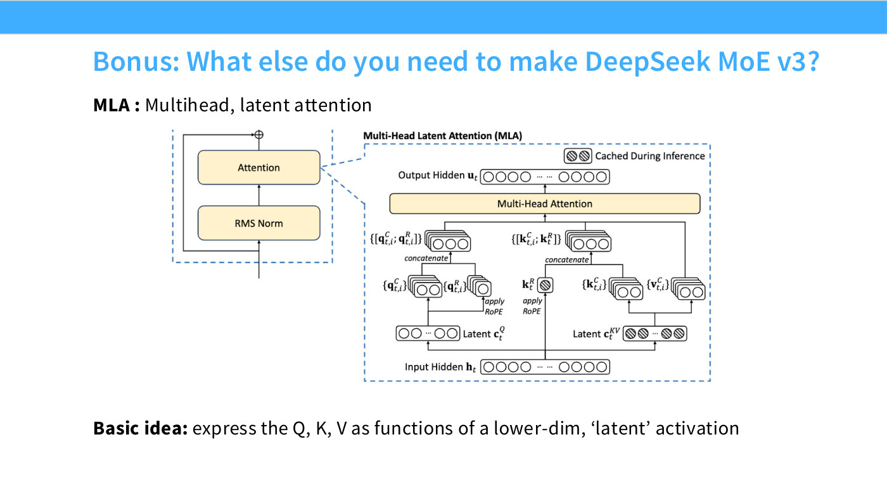

Text above the figure: "**MLA :** Multihead, latent attention". Text beneath it:
"**Basic idea:** express the Q, K, V as functions of a lower-dim, 'latent'
activation".

**Figure — a two-part block diagram.** On the left, a small dashed-blue box on a
residual stream holding two yellow rounded boxes, **RMS Norm** at the bottom and
**Attention** above it, with a ⊕ adder at the top and a residual line up the left
side. Two dashed blue lines expand the **Attention** box into the large dashed-blue
panel on the right, headed "**Multi-Head Latent Attention (MLA)**". A key at the
top right of that panel shows a hatched-circle pair meaning "**Cached During
Inference**" — in the diagram, hatched circles mark exactly the tensors that are
cached.

Reading the MLA panel from the bottom up:

- **Input Hidden** $\mathbf{h}_t$, a row of plain (unhatched) circles.
- From $\mathbf{h}_t$, three paths leave. Left: down into a box of plain circles
  labelled "**Latent** $\mathbf{c}^Q_t$". Right: into a box of *hatched* circles
  labelled "**Latent** $\mathbf{c}^{KV}_t$" — the cached KV latent. Middle: a
  vertical line straight up, annotated "*apply RoPE*", into a single hatched cell
  labelled $\mathbf{k}^R_t$ — the one rotary key that is also cached.
- From $\mathbf{c}^Q_t$: two stacked-card groups, $\{\mathbf{q}^C_{t,i}\}$ (left)
  and $\{\mathbf{q}^R_{t,i}\}$ (right); the arrow into the second is annotated
  "*apply RoPE*". Both feed a **concatenate** step producing the stacked group
  $\{[\mathbf{q}^C_{t,i}; \mathbf{q}^R_{t,i}]\}$.
- From $\mathbf{c}^{KV}_t$: two stacked-card groups, $\{\mathbf{k}^C_{t,i}\}$ and
  $\{\mathbf{v}^C_{t,i}\}$. The $\{\mathbf{k}^C_{t,i}\}$ group and the single
  $\mathbf{k}^R_t$ cell feed a second **concatenate** producing
  $\{[\mathbf{k}^C_{t,i}; \mathbf{k}^R_t]\}$.
- The query group, the key group and the value group
  $\{\mathbf{v}^C_{t,i}\}$ all feed the wide yellow **Multi-Head Attention** bar,
  whose output is the row of circles labelled **Output Hidden** $\mathbf{u}_t$.

The hatching makes the point of the slide visible: only $\mathbf{c}^{KV}_t$ and
$\mathbf{k}^R_t$ are cached, not the full per-head keys and values.

## Slide 58 — What else do you need to make DeepSeek MoE v3?

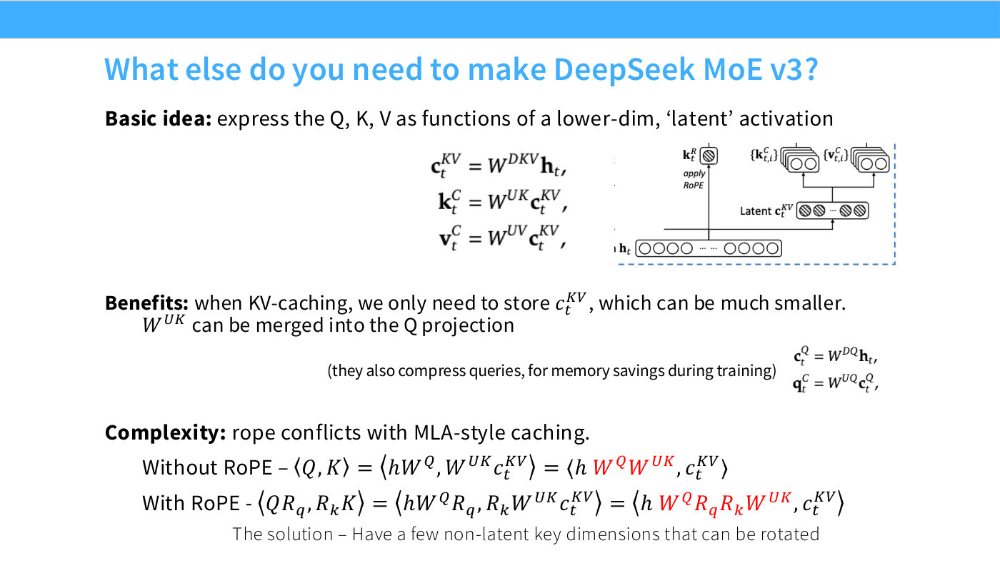

Restates at the top: "**Basic idea:** express the Q, K, V as functions of a
lower-dim, 'latent' activation", followed by the three defining equations:

$$\mathbf{c}^{KV}_t = W^{DKV}\mathbf{h}_t,$$

$$\mathbf{k}^{C}_t = W^{UK}\mathbf{c}^{KV}_t,$$

$$\mathbf{v}^{C}_t = W^{UV}\mathbf{c}^{KV}_t,$$

**Figure (top right) — a cropped fragment of the MLA diagram from slide 57**,
showing just the right-hand, key/value half: **Input Hidden** $\mathbf{h}_t$ at the
bottom, a branch going up through "*apply RoPE*" into the hatched $\mathbf{k}^R_t$
cell, and a branch going into the hatched "**Latent** $\mathbf{c}^{KV}_t$" row,
which in turn feeds the two stacked-card groups $\{\mathbf{k}^C_{t,i}\}$ and
$\{\mathbf{v}^C_{t,i}\}$.

**"Benefits:** when KV-caching, we only need to store $c^{KV}_t$, which can be much
smaller. $W^{UK}$ can be merged into the Q projection". A parenthetical to the
right reads "(they also compress queries, for memory savings during training)",
next to the two query-side equations:

$$\mathbf{c}^{Q}_t = W^{DQ}\mathbf{h}_t,$$

$$\mathbf{q}^{C}_t = W^{UQ}\mathbf{c}^{Q}_t,$$

**"Complexity:** rope conflicts with MLA-style caching." Two lines follow; in each,
the final grouping is printed in **red** to show which product can be pre-merged
into a single matrix and which cannot:

Without RoPE –
$$\langle Q, K \rangle = \left\langle hW^{Q},\, W^{UK}c^{KV}_t \right\rangle = \left\langle h\,W^{Q}W^{UK},\, c^{KV}_t \right\rangle$$

(here $W^{Q}W^{UK}$ is the part printed in red)

With RoPE -
$$\langle QR_q,\, R_k K \rangle = \left\langle hW^{Q}R_q,\, R_k W^{UK} c^{KV}_t \right\rangle = \left\langle h\,W^{Q}R_q R_k W^{UK},\, c^{KV}_t \right\rangle$$

(here $W^{Q}R_q R_k W^{UK}$ is the part printed in red)

(The red merged factor in the second line depends on the relative position through
$R_q R_k$, so it cannot be precomputed once — that is the conflict.)

Beneath, in smaller grey type: "The solution – Have a few non-latent key dimensions
that can be rotated".

## Slide 59 — What else do you need to make DeepSeek MoE v3?


Text: "**MTP:** Have small, lightweight models that predict multiple steps ahead".
Two pasted figures side by side, credited beneath as "[Deepseek v3]" (left) and
"[EAGLE]" (right). Under the left figure: "(But they only do MTP with one token
ahead)". At the bottom right: "(See paper for ablations)".

**Figure 1 (left, DeepSeek v3) — a three-panel block diagram of multi-token
prediction**, with an ellipsis at the right suggesting further modules. A row of
grey **Input Tokens** runs along the bottom and a row of grey **Target Tokens**
along the top; each panel is a dashed blue box.

- *Main Model (Next Token Prediction)*: input tokens $t_1, t_2, t_3, t_4$ → a green
  **Embedding Layer** → a stack of yellow cards labelled **Transformer Block**
  $\times L$ → a green **Output Head** → a yellow **Cross-Entropy Loss** box, which
  also receives target tokens $t_2, t_3, t_4, t_5$ from above and emits
  $\mathcal{L}_{Main}$ to the right.
- *MTP Module 1 (Next² Token Prediction)*: input tokens $t_2, t_3, t_4, t_5$ → green
  **Embedding Layer** → two side-by-side yellow **RMSNorm** boxes whose outputs meet
  at a step annotated "*concatenation*" → a yellow **Linear Projection** → a single
  yellow **Transformer Block** → a green **Output Head** → **Cross-Entropy Loss**,
  fed by target tokens $t_3, t_4, t_5, t_6$, emitting $\mathcal{L}^1_{\mathrm{MTP}}$.
  One of the two RMSNorm inputs comes from the Main Model's last hidden state (a
  solid line drawn from the Main Model's output-head input across into this module).
- *MTP Module 2 (Next³ Token Prediction)*: identical structure, input tokens
  $t_3, t_4, t_5, t_6$, target tokens $t_4, t_5, t_6, t_7$, loss
  $\mathcal{L}^2_{\mathrm{MTP}}$, and its extra RMSNorm input taken from MTP Module
  1's hidden state.
- Green dotted lines labelled "*Shared*" connect the three **Embedding Layer**
  boxes to one another and the three **Output Head** boxes to one another — those
  weights are shared across all modules.

**Figure 2 (right, EAGLE) — a two-part speculative-decoding diagram**, labelled
"target LLM" (left part) and "Draft model" (right part), with a "Forward 1" band
under the target and "Forward 1 / Forward 2 / Forward 3" bands under the draft.

- *target LLM*: the tokens "How", "can" enter a blue **Embedding** (marked with a
  snowflake, i.e. frozen), producing $e_{\mathrm{how}}, e_{\mathrm{can}}$ (green
  cells), then blue frozen **Transformer Layers**, producing features
  $f_{\mathrm{how}}, f_{\mathrm{can}}$ (peach cells), then a blue frozen **LM Head**,
  then a grey **Sampling** box, which outputs the tokens "can" and "I".
- *Draft model*: the same frozen **Embedding** and **LM Head** but a yellow **One
  Auto-regression Head** in place of the transformer stack. Its inputs are pairs of
  a feature and an embedding stacked in one cell — Forward 1 uses
  ($f_{\mathrm{how}}, e_{\mathrm{can}}$) and ($f_{\mathrm{can}}, e_{\mathrm{I}}$);
  Forward 2 uses ($f_{\mathrm{I}}, e_{\mathrm{make}}$) and
  ($f_{\mathrm{I}}, e_{\mathrm{help}}$); Forward 3 uses
  ($f_{\mathrm{help}}, e_{\mathrm{with}}$) and ($f_{\mathrm{help}}, e_{\mathrm{you}}$).
  The head emits new features $f_{\mathrm{I}}$, $f_{\mathrm{make}}$,
  $f_{\mathrm{help}}$, $f_{\mathrm{with}}$, $f_{\mathrm{you}}$, which go through the
  **LM Head** into a grey "**Sampling multiple times**" bar, producing the candidate
  token pairs "make/help", "a/our", "with/you", "the/your", "to/feel" at the top.
  Orange dashed arrows carry each produced feature back down into the next forward
  pass's input cell; black dashed arrows carry the sampled tokens back to the
  bottom-row token boxes. Everything belonging to the draft's speculative branch is
  outlined in red.

Beneath both figures, the DeepSeek MTP equations:

$$\mathbf{h}'^{k}_i = M_k\left[\mathrm{RMSNorm}(\mathbf{h}^{k-1}_i);\, \mathrm{RMSNorm}(\mathrm{Emb}(t_{i+k}))\right],$$

$$\mathbf{h}^{k}_{1:T-k} = \mathrm{TRM}_k\!\left(\mathbf{h}'^{k}_{1:T-k}\right),$$

$$P^{k}_{i+k+1} = \mathrm{OutHead}\!\left(\mathbf{h}^{k}_i\right).$$

## Slide 60 — MoE summary

A text-only closing slide: three bullets, each marked with a blue ❖, and no figure.

- "MoEs take advantage of sparsity – not all inputs need the full model"
- "Discrete routing is hard, but top-k heuristics seem to work"
- "Lots of empirical evidence now that MoEs work, and are cost-effective"

The three bullets are set at different indents (the second is indented further than
the first and third), but they are a single flat list, not a hierarchy.
