# Lecture 5 — GPUs (and TPUs) (course material)

This is the written content of CS336 Lecture 5, transcribed page by page from
[`lecture_05.pdf`](https://github.com/stanford-cs336/lectures/blob/main/lecture_05.pdf)
(Tatsunori Hashimoto, Stanford CS336, Spring 2026). It opens the course's systems
unit. Lectures 3 and 4 asked what to build; this one asks what the hardware
actually does when you run it — how a GPU is put together, what makes a workload
fast or slow on one, and how those two answers combine into FlashAttention.

Headings are **PDF page numbers** — the deck prints no slide numbers. See the
`numbering` note in the front matter and the section below.

## Sections → slide ranges

| Section | Slides |
| --- | --- |
| Title | 1 |
| Outline, credits, and the plan for the day | 2–4 |
| Why compute scaling drives performance: Dennard scaling and its end | 5–7 |
| How a GPU differs from a CPU; anatomy of execution units and memory | 8–10 |
| The execution model (threads, blocks, warps) and the memory model | 11–12 |
| Side thread: what about TPUs? | 13–14 |
| Strengths of the GPU model; matmul hardware and the memory wall | 15–18 |
| Recap of part 1 | 19 |
| Part 2 opens: the roofline model and the list of tricks | 20–22 |
| Control divergence | 23 |
| Trick 1 — low precision, and the FP8/MXFP8/MXFP4 frontier | 24–29 |
| Trick 2 — operator fusion | 30–33 |
| Trick 3 — recomputation | 34–36 |
| Trick 4 — memory coalescing and DRAM | 37–39 |
| Trick 5 — tiling, its arithmetic, and its complications | 40–44 |
| The matrix mystery: tiling and wave quantization explain a benchmark | 45–48 |
| Recap of part 2 | 49 |
| Part 3 — FlashAttention read through the tricks above | 50–54 |
| Recap of the whole lecture | 55 |

## Slide numbers vs PDF pages

There is no distinction to make: the deck prints no numbers, so `## Slide N` here
means PDF page N of `lecture_05.pdf`, for every N from 1 to 55, with no gaps and
no offset. A citation to "slide 41" opens as page 41. This is the same situation
as lectures 3 and 4, and unlike those two the evidence is threefold — the script,
a corner-position text-layer scan, and three independent readers each checking
their own range by eye.

## Things this deck gets wrong or leaves ambiguous

Recorded as printed rather than silently reconciled, and repeated here so a reader
meets them before quoting a page:

- **Slides 27 and 29 disagree on the scale-factor format.** Slide 27 gives MXFP8
  scale factors as FP8 **E8M0**, one per 32 values; slide 29 gives MXFP4 as one
  per **16** with **E4M3** scale factors. The deck does not reconcile the two.
- **Slide 47's chart carries an unlabelled fifth series.** Four series are labelled
  by K divisibility (K = 2, 8, 16, 32); a fifth dense blue band is plotted with no
  legend entry. The entry says so rather than folding it into a labelled series.
- **Slide 50's pasted excerpt is partly occluded by the deck's own heading.** The
  first line of the quoted FlashAttention passage sits under the bold "Technique
  from paper:" text printed on top of it. This is the deck's layout, not a
  resolution limit — it stays unreadable at 2400 dpi — and only the visible
  fragment is transcribed.
- **Slide 17's x-axis label reads "M80".** Confirmed at 600 dpi. The
  Maxwell-generation part is normally called M40, so this is very likely an error
  in the source chart; it is transcribed as printed.
- **Slide 34's caption calls the stored activations "yellow"** while the diagram
  renders them orange/amber. Transcribed as printed.

## Slide 1 — Lecture 5: GPUs

The title slide. Centred on a white page, in black: "**Lecture 5**". Beneath it,
in blue letter-spaced caps: "G P U s". Below that, in grey: "CS336" and
"Tatsu H". A wide blue band runs across the bottom of the page. No figure.

## Slide 2 — Outline and goals

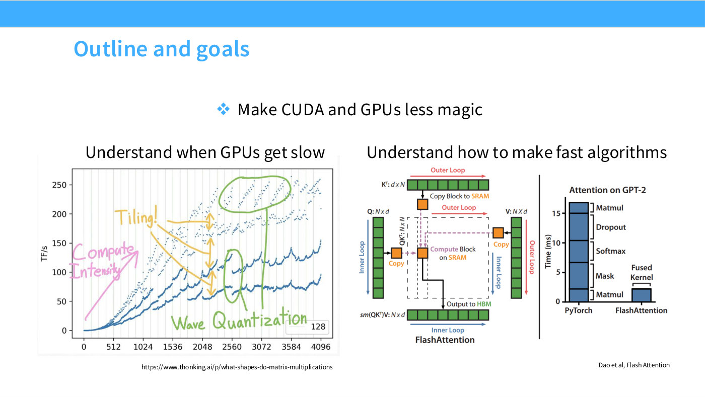

Text: "❖Make CUDA and GPUs less magic", and, as two sub-headings over the two
figures, "Understand when GPUs get slow" (left) and "Understand how to make
fast algorithms" (right).

Credit lines at the foot of the page: `https://www.thonking.ai/p/what-shapes-do-matrix-multiplications`
(under the left figure) and "Dao et al, Flash Attention" (under the right
figures).

**Figure 1 (left) — annotated scatter plot of achieved matmul throughput.**
The y-axis is "TF/s", ticked 0, 50, 100, 150, 200, 250. The x-axis is
unlabelled (no axis title printed) and ticked 0, 512, 1024, 1536, 2048, 2560,
3072, 3584, 4096, with faint vertical gridlines at regular intervals; a small
boxed "128" sits in the lower-right corner of the plot area. All of the
underlying data points are the same colour (blue) — there is no legend
mapping colours to named series. The points form several visually distinct
sawtooth-shaped bands rather than one smooth curve: reading bottom to top,
one band rises from (0, 0) to about (4096, 90); a second, offset to start
around x=1024, climbs to about (4096, 140); and a dotted band occupying
roughly 130–260 TF/s runs across the upper part of the plot, itself uneven
(dips and re-climbs, i.e. its own internal sawtooth). Because every point
shares one colour and no legend or axis title identifies what varies between
bands, this deck's page does not name what the bands represent individually;
by the URL credited at the foot (a blog post on matrix-multiplication
"shapes") this is very likely throughput swept over one matrix dimension for
several different fixed values of another, producing the classic tile/wave
"sawtooth" pattern. The lecturer has added hand-drawn annotations on top: a
pink arrow labelled "Compute Intensity" pointing up and to the right from the
plot's origin region; an orange "Tiling!" label with two lines running down to
double-headed orange arrows spanning the vertical gaps between the sawtooth
bands around x≈2200–2300 (marking the vertical jump caused by a tile-size
boundary); a green oval circling a cluster of high points around x≈2600–3600,
y≈220–265; a smaller green oval circling a dip in the second band around
x≈2700; and the green label "Wave Quantization" with two vertical lines
pointing up into the circled clusters.

**Figure 2 (middle) — the FlashAttention tiling diagram.** A block diagram
titled "FlashAttention" at the bottom. At the top, a row of green cells
labelled "$K^T: d \times N$" with a red "Outer Loop" arrow above it pointing
right. An orange "Copy" box receives an arrow from this row labelled "Copy
Block to SRAM". On the left, a column of green cells labelled "Q: $N \times
d$" with a blue "Inner Loop" arrow pointing down beside it, feeding through an
orange "Copy" box into a purple-dashed "$QK^T: N \times N$" region. A second
red "Outer Loop" arrow points right above this dashed region, and a blue
"Inner Loop" arrow points down its right edge. Purple dashed arrows converge
from the K-copy box and the Q-copy box into a central orange square labelled
via the caption "Compute Block on SRAM". On the right, a column of green
cells labelled "V: $N \times d$" with a red "Outer Loop" arrow pointing down
beside it, feeding through an orange "Copy" box (arrow labelled "Copy") into
the same dashed compute region. A black arrow runs down from the central
orange compute square, labelled "Output to HBM", into a bottom row of green
cells labelled "$sm(QK^T)V: N \times d$", under which a blue "Inner Loop"
arrow points right. In short: the figure shows Q, K, V held in slow memory
(green blocks) being copied block-by-block into fast on-chip SRAM (orange
boxes) to compute an attention block, with nested outer/inner loops (red and
blue arrows) tiling over the sequence dimension, and only the final output
written back out to HBM.

**Figure 3 (right) — bar chart, "Attention on GPT-2".** The y-axis is "Time
(ms)", ticked 0, 5, 10, 15. The x-axis has two categories: "PyTorch" and
"FlashAttention". This is a stacked/segmented bar chart in a single colour
(blue) rather than a multi-colour legend — the two bars are broken into
bracket-labelled segments by height rather than by colour, so there are
**two** bars, not multiple colour series:
- **PyTorch** (left bar): built of five stacked segments, bracket-labelled
  bottom to top as "Matmul" (0–~2 ms), "Mask" (~2–6.5 ms), "Softmax" (~6.5–10.5
  ms), "Dropout" (~10.5–15 ms), and "Matmul" again (~15–17 ms) — total bar
  height about 17 ms.
- **FlashAttention** (right bar): a single short segment bracket-labelled
  "Fused Kernel", reaching about 2 ms total.

## Slide 3 — Before we start..


Text: "Substantial credit goes to a few sources that I'd like to highlight..",
and, beneath the three screenshotted cards, the captions "Horace He's blog",
"CUDA Mode group", and "TPU (and now GPU) book (!!)". At the foot: "And other
sources including https://nichijou.co/, https://jonathan-hui.medium.com/"
(the first URL rendered as an orange hyperlink).

**Figure 1 (left) — screenshot of a blog card, "Thonk From First
Principles."** Below a small folded-hands emoji, the subtitle reads "ML
Systems from first principles. Aims to be better than a ChatGPT summary."

**Figure 2 (middle) — screenshot of a YouTube channel card, "CUDA MODE."**
Shows a channel avatar (a stylised orange/red flame character), the handle
"@CUDAMODE · 2.62K subscribers · 13 videos", the description "A CUDA reading
group and community https://discord.gg/cudamode", the link
"github.com/cuda-mode", and a black "Subscribe" button.

**Figure 3 (right) — screenshot of the "How to Scale Your Model" web book
cover.** Title "How to Scale Your Model", subtitle "A Systems View of LLMs on
TPUs", with a parenthetical "(Part 0: Intro | Part 1: Rooflines)". Body text:
"Training LLMs often feels like alchemy, but understanding and optimizing the
performance of your models doesn't have to. This book aims to demystify the
science of scaling language models on TPUs: how TPUs work and how they
communicate with each other, how LLMs run on real hardware, and how to
parallelize your models during training and inference so they run efficiently
at massive scale. If you've ever wondered 'how expensive should this LLM be to
train' or 'how much memory do I need to serve this model myself' or 'what's an
AllGather', we hope this will be useful to you." Below, an author list in two
columns — Jacob Austin, Sholto Douglas, Roy Frostig, Anselm Levskaya, Charlie
Chen, Sharad Vikram (left column) and Federico Lebron, Peter Choy, Vinay
Ramasesh, Albert Webson, Reiner Pope (right column) — with "AFFILIATION:
Google DeepMind" and "PUBLISHED: Feb. 4, 2025" at top right.

## Slide 4 — Organization today:

Text: "❖ **Part 1**: GPUs in depth – how they work and important parts",
"❖ **Part 2**: Understanding GPU performance", "❖ **Part 3**: Putting it
together – unpacking FlashAttention". No figure.

## Slide 5 — Setting the stage: compute leads to predictable perf

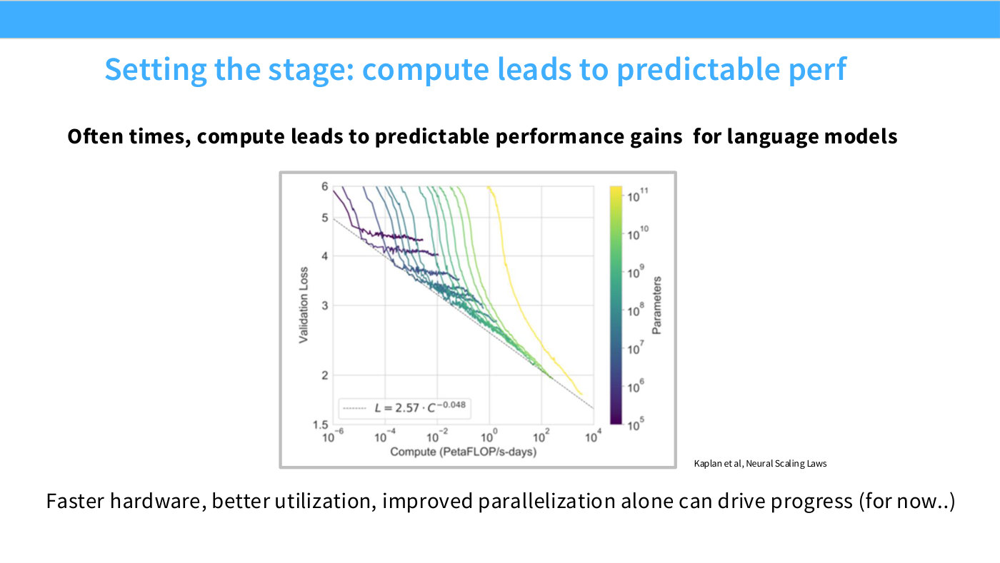

Text: "Often times, compute leads to predictable performance gains for
language models" and, below the figure, "Faster hardware, better utilization,
improved parallelization alone can drive progress (for now..)". Credit at the
foot: "Kaplan et al, Neural Scaling Laws".

**Figure 1 (centre) — line chart, the Kaplan et al. scaling-laws plot of
validation loss vs. compute.** The x-axis is "Compute (PetaFLOP/s-days)" on a
log scale, ticked $10^{-6}, 10^{-4}, 10^{-2}, 10^{0}, 10^{2}, 10^{4}$. The
y-axis is "Validation Loss", ticked 1.5, 2, 3, 4, 5, 6 (log-ish spacing,
top of axis at 6). A vertical colourbar on the right, titled "Parameters", is
ticked $10^{5}, 10^{6}, 10^{7}, 10^{8}, 10^{9}, 10^{10}, 10^{11}$ and runs
through a continuous viridis-like gradient from dark purple (small, $10^5$) up
through blue, teal, green to yellow (large, $10^{11}$). This chart does not
have a small set of discrete, individually named legend series; instead it
plots roughly 15–20 individual training curves — one per fixed model size —
each coloured by where its parameter count falls on that continuous scale, so
"one bullet per series with a colour name" does not apply cleanly. Describing
them by colour band instead:
- The **dark purple** curves (smallest models, ~$10^5$–$10^6$ params) are
  short, confined to the lowest-compute region (roughly $10^{-6}$ to
  $10^{-3}$ PetaFLOP/s-days), and plateau earliest, flattening out around
  validation loss 4–4.5 without continuing to fall.
- The **teal/green** curves (mid-sized models, ~$10^7$–$10^9$ params) extend
  further right, into the $10^{-2}$–$10^{0}$ range, reaching losses around
  2.5–3.5 before flattening.
- The single **yellow** curve (the largest model, ~$10^{11}$ params) extends
  furthest right, out to about $10^{2}$–$10^{4}$ PetaFLOP/s-days, and reaches
  the lowest loss on the plot, around 1.7.
- A dashed grey reference line, labelled "$L = 2.57 \cdot C^{-0.048}$", is the
  fitted power-law envelope traced across the left edge of the family of
  curves — this is an annotation of the trend, not an additional data series.

## Slide 6 — How do we get compute scaling? Early on – Dennard scaing

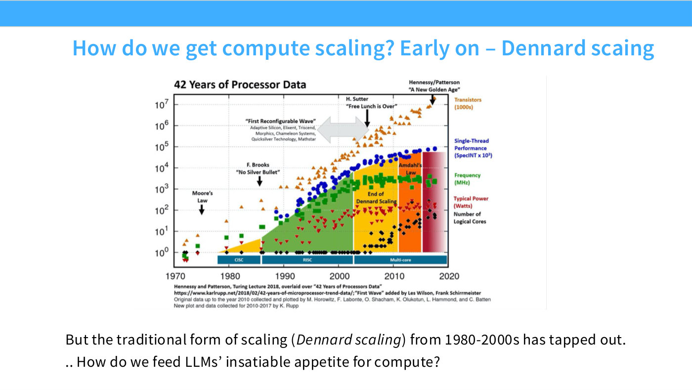

(Title printed exactly as shown, including the typo "scaing" for "scaling".)
Text: "But the traditional form of scaling (*Dennard scaling*) from 1980-2000s
has tapped out." / ".. How do we feed LLMs' insatiable appetite for compute?"

**Figure 1 — the Karl Rupp "42 Years of Processor Data" chart.** Titled "42
Years of Processor Data" in the image itself. The y-axis is log-scaled,
ticked $10^0$ through $10^7$ (no printed axis title, but the legend at right
identifies the quantities plotted). The x-axis runs 1970 to 2020, ticked every
decade. A legend at the right lists **five** series by colour and marker
shape:
- **Orange triangles** — "Transistors (1000s)": rising from near 0 in 1970 to
  roughly $10^7$ (i.e. tens of billions of transistors) by 2020, the
  steepest and highest-reaching series throughout.
- **Blue circles** — "Single-Thread Performance (SpecINT ×$10^3$)": near-flat
  and low before ~1985, then rising steeply through the 1990s–2000s to about
  $10^4$–$10^5$ by 2010, then flattening.
- **Green squares** — "Frequency (MHz)": rises through the 1980s–1990s to
  roughly $10^3$–$10^4$ by the early 2000s, then goes essentially flat for the
  rest of the chart — this plateau is explicitly boxed with the label "End of
  Dennard Scaling".
- **Red inverted triangles** — "Typical Power (Watts)": rises alongside
  frequency through the 1990s to roughly $10^2$, then also plateaus after the
  early 2000s.
- **Black diamonds** — "Number of Logical Cores": stays at about 1 until the
  early-to-mid 2000s, then begins climbing, reaching roughly 10–100 by 2020 —
  this is the series that takes over growth once frequency and power
  flatten.

Overlaid annotations (arrows and call-out boxes, not additional data series):
"Moore's Law" (arrow down, ~1980), "F. Brooks 'No Silver Bullet'" (arrow down,
~1986), a grey double-headed arrow labelled "First Reconfigurable Wave"
listing "Adaptive Silicon, Elixent, Triscend, Morphics, Chameleon Systems,
Quicksilver Technology, Mathstar" (~1995–2005), "H. Sutter 'Free Lunch is
Over'" (arrow down, ~2004), a shaded region labelled "End of Dennard Scaling"
(early-to-mid 2000s onward), "Amdahl's Law" (plain floating text with **no**
arrow, sitting inside the orange band at the yellow/orange boundary, ~2010–2011
— the only one of these annotations that is not drawn with an arrow), and
"Hennessy/Patterson 'A New Golden Age'" (arrow down, ~2017–2018) at top right.
A background colour wash runs left-to-right under the whole plot in **five**
regions: yellow (1970s–1980s), green (RISC era, ~1985–2003), **yellow again**
(~2003–2010, the same gold fill as the first band rather than a distinct
colour), a solid orange band (~2010–2014, the one under the "Amdahl's Law"
label), then a red-to-dark-red gradient (~2014–2020). A bracketed timeline bar beneath the
x-axis labels three eras: "CISC" (up to ~1985), "RISC" (~1985–2003), and
"Multi-core" (~2003–2020).

Credit text at the foot of the figure (three lines): "Hennessy and Patterson,
Turing Lecture 2018, overlaid over '42 Years of Processors Data'" /
"https://www.karlrupp.net/2018/02/42-years-of-microprocessor-trend-data/;
'First Wave' added by Les Wilson, Frank Schirrmeister" / "Original data up to
the year 2010 collected and plotted by M. Horowitz, F. Labonte, O. Shacham, K.
Olukotun, L. Hammond, and C. Batten" / "New plot and data collected for
2010-2017 by K. Rupp."

## Slide 7 — Parallel scaling continues


Text: "Parallel scaling with GPUs has scaled > 1000x in 10 years." / "*There
is no LLM scaling without GPU scaling*". Credit at the foot: "Bill dally,
HotChips keynote" (printed lower-case as shown).

**Figure 1 — a HotChips keynote slide screenshot, "Single-Chip Inference
Performance – 1000X in 10 years."** On the left, a bulleted "Gains from" list
(this is native text pasted as part of the image, not the deck's own text):
"Number Representation" → "FP32, FP16, Int8" → "(TF32, BF16)" → "~16x";
"Complex Instructions" → "DP4, HMMA, IMMA" → "~12.5x"; "Process" → "28nm,
**16nm**, **7nm**, **5nm**" (each process node coloured green/cyan/purple) →
"~2.5x"; "Sparsity" → "~2x"; and finally "Model efficiency has also improved –
overall gain > 1000x". On the right, a line chart: y-axis "Int8 TOPS", ticked
0.00 to 4500.00 in steps of 500; x-axis is a sequence of dates: 4/1/12,
8/14/13, 12/27/14, 5/10/16, 9/22/17, 2/4/19, 6/18/20, 10/31/21, 3/15/23. This
is a **single** dark-red line/series with circular markers at each labelled
chip generation:
- Scalar FP32, K20X — 3.94 TOPS (4/1/12)
- M40 — 6.84 TOPS (12/27/14)
- FP16 DP4A, P100 — 21.20 TOPS (5/10/16)
- HMMA Tensor Cores, V100 — 125.00 TOPS (9/22/17)
- IMMA Int8 Tensor Cores, Q8000 — 261.00 TOPS (2/4/19)
- A100, Structured Sparsity — 1248.00 TOPS (6/18/20)
- H100, FP8 Transformer Eng — 4000.00 TOPS (10/31/21, plotted at the
  second-to-last x-position even though the axis's last tick is 3/15/23)

An inset photo is pasted over the upper-left portion of the chart, showing
Bill Dally presenting at a podium in front of a partly-obscured version of
this same chart (a small slice of its "1500.00" gridline and "Scalar FP32
K20X 3.94" label are visible behind him) — this is a photo of the speaker, not
separate chart data.

## Slide 8 — How is a GPU different from a CPU?

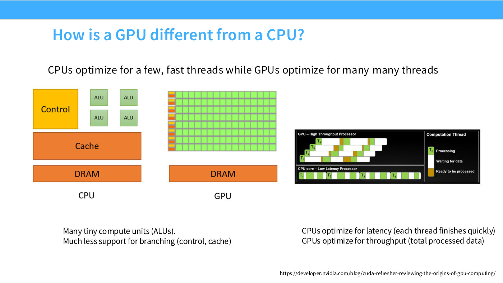

Text: "CPUs optimize for a few, fast threads while GPUs optimize for many
many threads"; below the two block diagrams, "Many tiny compute units
(ALUs). / Much less support for branching (control, cache)" (left) and "CPUs
optimize for latency (each thread finishes quickly) / GPUs optimize for
throughput (total processed data)" (right). Credit at the foot:
`https://developer.nvidia.com/blog/cuda-refresher-reviewing-the-origins-of-gpu-computing/`

**Figure 1 (left) — CPU vs. GPU block-diagram comparison.** Two side-by-side
stacks of coloured rectangles, each labelled at the bottom "CPU" / "GPU".
*CPU stack*: a large yellow "Control" box beside a 2×2 grid of small green
boxes each labelled "ALU"; below that, a wide orange "Cache" bar; below that,
a wide orange "DRAM" bar. *GPU stack*: a dense grid of small green squares
(roughly 9 rows × 13 columns, each an unlabelled compute unit standing in for
an ALU) with a thin strip of orange/yellow cells down the left edge (standing
in for lightweight per-row control); below that, a wide orange "DRAM" bar
matching the CPU's. The visual point: the CPU devotes most of its area to
one large control block plus cache, with only 4 ALUs, while the GPU devotes
nearly all its area to many small ALUs with minimal control/cache.

**Figure 2 (right) — latency vs. throughput scheduling diagram.** A
two-panel dark diagram. Top panel, "GPU – High Throughput Processor": four
rows labelled $T_4, T_3, T_2, T_1$ (top to bottom, staggered like a staircase,
each starting slightly further right/lower than the one above), each row a
horizontal bar made of coloured segments (green, white, and brown/gold
blocks) representing that thread's timeline. Bottom panel, "CPU core – Low
Latency Processor": four rows labelled $T_1, T_2, T_3, T_4$, drawn as full-
width, non-staggered horizontal bars, each also made of green/white/brown
segments, but processed one after another rather than overlapped. A legend
box at the right, titled "Computation Thread", maps the three colours: green
= "Processing", white = "Waiting for data", brown/gold = "Ready to be
processed". The figure's point: the GPU keeps many threads' work
interleaved/overlapping (staggered staircase) to hide the white "waiting"
segments, whereas the CPU core processes each thread's full timeline with its
own waiting gaps, one thread at a time.

## Slide 9 — Anatomy of a GPU (execution units)

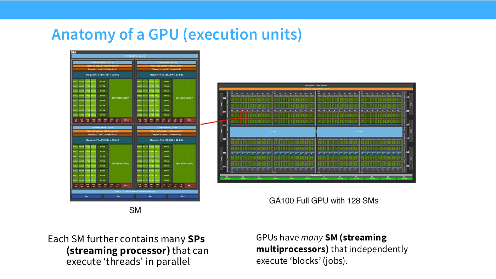

Text: below the two figures, "Each SM further contains many **SPs (streaming
processor)** that can execute 'threads' in parallel" (left) and "GPUs have
*many* **SM (streaming multiprocessors)** that independently execute
'blocks' (jobs)." (right).

**Figure 1 (left) — labelled block diagram of one SM (streaming
multiprocessor), captioned "SM" beneath.** A tall rectangle titled "SM" at
top left, with a blue "L1 Instruction Cache" bar spanning its width. Below
that the SM is divided into **four** identical quadrant "partitions"
(arranged 2×2), each containing, top to bottom: an "L0 Instruction Cache" bar;
an orange "Warp Scheduler (32 thread/clk)" bar; a "Dispatch Unit (32
thread/clk)" bar; a teal "Register File (16,384 x 32-bit)" bar; a grid of
small green cells labelled "INT32 INT32 FP32 FP32 FP64" repeated down
~6 rows, beside a large green "TENSOR CORE" block spanning the same rows; and
a bottom row of small "LD/ST" cells plus a red "SFU" cell. Beneath all four
partitions, a wide blue bar reads "192KB L1 Data Cache / Shared Memory", and
beneath that, four dark-blue boxes labelled "Tex" (texture units). A red line runs from the right
edge of this figure across the page to Figure 2, meeting it at the boundary
between the top-right and bottom-right partitions. Figure 1 itself carries **no**
red box or highlight anywhere inside it; the highlighted tile is in Figure 2.

**Figure 2 (right) — full-die schematic, captioned "GA100 Full GPU with 128
SMs."** A wide rectangle representing the whole GPU die. A top bar reads "PCI
Express 4.0 Host Interface"; below it a bar reads "GigaThread Engine with MIG
Control". The main body is divided into **eight** blocks, each
labelled "GPC" (graphics processing cluster) at its corner and arranged as a
2-row x 4-column grid — four GPCs across the top and four across the bottom,
separated by the horizontal L2 Cache band. Each GPC is tiled with small
green/grey cells (each cell an "SM/TPC" unit, too small to read individual
labels at this scale). Down the **left and right** edges — not the top and
bottom — run vertical bars labelled "HBM2" and "Memory Controller": **three
HBM2 boxes and six Memory Controller boxes per side**, each HBM2 stack pairing
with two Memory Controller segments, identically on both edges. A horizontal band runs across the vertical
middle of the die, split into two halves each labelled "L2 Cache" (left half
/ right half), separated by a thin vertical divider. A grey "High-Speed Hub"
bar runs along the bottom, above a row of small green boxes each labelled
"NVLink" (**twelve** of them, counted on the rendered row). A thin red line is drawn from one small
highlighted (red-outlined) tile inside the die over to Figure 1, indicating
that Figure 1 is a zoomed-in view of one single SM inside this full die.

## Slide 10 — Anatomy of a GPU (memory)


Text: "**The closer the memory to the SM, the faster it is** – L1 and shared
memory is *inside* the SM. L2 cache is on die, and global memory are the
memory chips next to the GPU". Below the figures: "SRAM (shared/cache memory)
is much more expensive (100x) but ~ 8x faster than DRAM (Global memory)".

**Figure 1 (top left) — a table, "TABLE IV: THE MEMORY ACCESSES LATENCIES."**
Two columns, "Memory type" and "CPI (cycles)":

| Memory type | CPI (cycles) |
| --- | --- |
| Global memory | 290 |
| L2 cache | 200 |
| L1 cache | 33 |
| Shared Memory (ld/st) | (23/19) |

**Figure 2 (bottom left) — an annotated photo of a physical GPU
board/module.** A green PCB card viewed at an angle, with red arrows and
labels pointing to: "Interconnection interface" (top edge connectors),
"Graphics Processing Unit (GPU)" (the large central chip, bearing an NVIDIA
logo), "Video Memory (VRAM)" (chips surrounding the GPU die), "Network
interface" (a port on the left edge), "Data Processing Unit (DPU)" (a smaller
chip near the bottom left), "Motherboard interface" (the card-edge connector
along the bottom), and "Voltage regulator module (VRM)" (components to the
lower right of the GPU).

**Figure 3 (right) — an annotated die-shot photo, "Nvidia GA100, 7nm
TSMC."** A high-resolution photograph of the physical GA100 die with
coloured overlay boxes and text labels (annotated by "Locuza, June 2021", per
a credit printed in the image itself). Reading the layout: brown/gold bars
read "HBM2(e) PHY, 1024-Bit @ 2.430 - 3.186 Gpbs" and run along the **top and
bottom edges only**, three per edge (six in all), alternating with magenta bars
reading "3x 512-Bit Memory Control" (two per edge, four in all). The two side
edges carry something else entirely: cyan vertical strips along the **left**
edge read "4x NVLINK PHY (4x 50GB/s Bidirectional)", with orange accent stripes
beside them, while the **right** edge reads "PCIe Control, NV Video Decoder,
Miscellaneous" and "16x PCIe4.0 (64 GB/s Bidirectional)". No HBM sits on either
side edge.
The main die area is split into four large green quadrants, each labelled
(top-left quadrant, as the fully legible example) "4x SM" with sub-text "SM =
64 FP32 ALUs, 32 FP64 ALUs, 64 INT32 ALUs, 4 Tensor Units, 192KiB L1$/SMEM",
plus "3x Streaming Multiprocessor" and three separate "3x SM" tiles stacked
below it; the other three quadrants are each simply labelled "16x SM" (large
green tiled blocks, two per die-half). Down the centre of each die-half runs a
blue cross-shaped region labelled "24MiB L2$ Partition" (two of these, one per
half), and set into the arms of each blue cross are purple tiled blocks
labelled "24x 0.5MiB = 12MiB L2$" (four of these overall). Only **one** of the
four — the top arm of the left-hand cross, beside the "4x SM" callout — has its
individual cells labelled "0.5MB L2$"; the other three carry the aggregate
label over unlabelled cells. A black text panel at the
top right of the figure (outside this crop, seen in the unzoomed page) reads:
"Nvidia GA100, 7nm TSMC" / "x8 GPC, x64 TPC, 128x SM" / "8192 FP32 'Units'" /
"4096 FP64 'Units'" / "48MB L2 Cache" / "6144-Bit HBM2(e)" / "Die size w/
scribe lines: 836.66mm²" / "Die size w/o scribe lines: ~826mm²" / "Die shot
from Nvidia" / "Annotations by Locuza, June 2021".

## Slide 11 — Execution model of a GPU

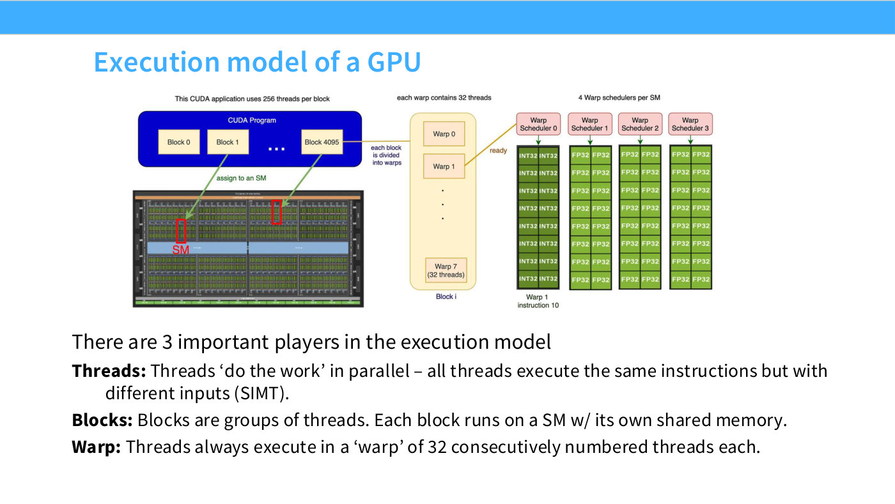

Text: "There are 3 important players in the execution model"; "**Threads:**
Threads 'do the work' in parallel – all threads execute the same
instructions but with different inputs (SIMT)."; "**Blocks:** Blocks are
groups of threads. Each block runs on a SM w/ its own shared memory.";
"**Warp:** Threads always execute in a 'warp' of 32 consecutively numbered
threads each."

Note on the corner-numeral check for this page specifically: the two bare
numerals the text layer reports at mid-page position (a "3" around x=130,
y=264 and a "32" around x=344, y=350, in 72-dpi page coordinates on a
720×405 page) are both ordinary body text, not a printed folio — the "3" is
from "There are **3** important players" and the "32" is from "warp of **32**
consecutively numbered threads each" (and the figure's own "Warp 7 (32
threads)" label repeats the same number). Neither sits in a page corner;
both are mid-page, inline with sentences. No printed page number is visible
anywhere on this page.

**Figure 1 — a three-part diagram of the CUDA execution hierarchy.** Reading
left to right:
- *Left panel*, captioned "This CUDA application uses 256 threads per
  block": a dark-blue rounded rectangle labelled "CUDA Program" containing
  three small tan boxes, "Block 0", "Block 1", "…", "Block 4095". Green arrows
  labelled "assign to an SM" run down from Block 1 and Block 4095 to two
  red-outlined tiles inside a die-shot image below (the same style of
  GA100-like tiled die diagram seen on slide 9/10, here unlabelled except for
  a red "SM" callout under the left tile), illustrating that each block is
  assigned to run on one SM.
- *Middle panel*, captioned "each warp contains 32 threads": a tall tan
  rounded box labelled "Block i" containing stacked cells "Warp 0", "Warp 1",
  a vertical ellipsis, and "Warp 7 (32 threads)" — i.e. a block subdivided
  into 8 warps of 32 threads. An orange line labelled "ready" runs from Warp
  1 to a "Warp Scheduler 0" box in the next panel, with the annotation "each
  block is divided into warps" bridging the left and middle panels.
- *Right panel*, captioned "4 Warp schedulers per SM": four pink boxes,
  "Warp Scheduler 0" through "Warp Scheduler 3", each with an arrow down into
  a column of green cells. The first column (under Scheduler 0) is labelled
  "INT32 INT32" repeated down 8 rows; the remaining three columns (under
  Schedulers 1–3) are each labelled "FP32 FP32" repeated down 8 rows. The
  first column is captioned beneath "Warp 1 instruction 10" and "Block i",
  tying this back to the middle panel's Warp 1.

## Slide 12 — Memory model of a GPU

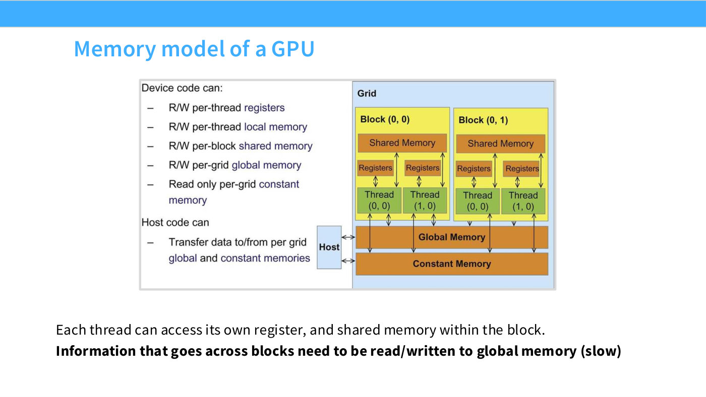

Text: "Each thread can access its own register, and shared memory within
the block."; "**Information that goes across blocks need to be read/written
to global memory (slow)**". No credit line.

**Figure 1 — the CUDA memory-model diagram (device/host code + Grid box).**
Left side, plain text: "Device code can:" with a dash-bulleted list — "R/W
per-thread registers", "R/W per-thread local memory", "R/W per-block shared
memory", "R/W per-grid global memory", "Read only per-grid constant memory" —
followed by "Host code can" and "Transfer data to/from per grid global and
constant memories" (the memory-type words in each line are coloured purple,
matching the diagram's box labels). A small blue "Host" box sits below the
text, with double-headed arrows to two orange bars on the right labelled
"Global Memory" and "Constant Memory". Above those bars, a light-blue region
labelled "Grid" contains two yellow boxes, "Block (0, 0)" and "Block (0, 1)".
Each block box contains an orange "Shared Memory" bar, below it two orange
"Registers" boxes, and below those two green boxes "Thread (0, 0)" and
"Thread (1, 0)". Double-headed black arrows connect: each Thread up to its
own Registers box, each Registers box up to the block's shared Shared Memory
bar, and both blocks down to the shared "Global Memory" and "Constant
Memory" bars at the bottom. This nested-box structure is the figure's point:
registers are private per thread, shared memory is shared within a block,
and global/constant memory is shared across all blocks in the grid.

## Slide 13 — Side thread – What about TPUs?

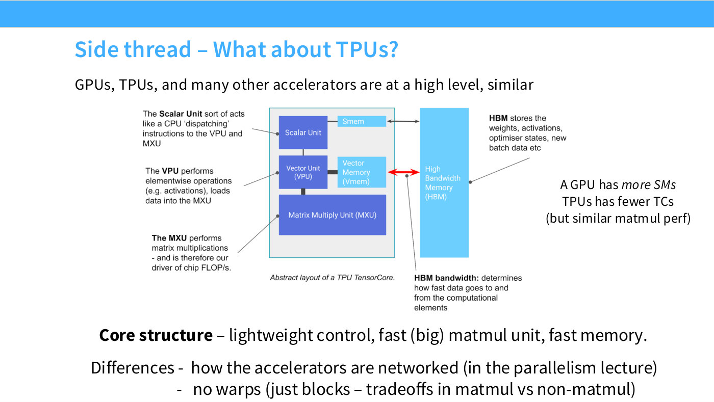

Text: "GPUs, TPUs, and many other accelerators are at a high level, similar";
"**Core structure** – lightweight control, fast (big) matmul unit, fast
memory."; "Differences - how the accelerators are networked (in the
parallelism lecture)" / "- no warps (just blocks – tradeoffs in matmul vs
non-matmul)"; "A GPU has *more* SMs" / "TPUs has fewer TCs" / "(but similar
matmul perf)".

**Figure 1 — labelled abstract layout of a TPU TensorCore.** A boxed diagram
captioned beneath "Abstract layout of a TPU TensorCore." Inside the box: a
dark-blue "Scalar Unit" block connected to a lighter-blue "Smem" block beside
it; below the Scalar Unit, a "Vector Unit (VPU)" block connected to a
"Vector Memory (Vmem)" block beside it; below that, a wider "Matrix Multiply
Unit (MXU)" block. To the right of the whole box, a tall cyan bar labelled
"High Bandwidth Memory (HBM)", connected to the Smem/Vmem column by a
horizontal double-headed arrow (drawn in red between the Vector Memory and
HBM specifically) and a black double-headed arrow at the Smem level.
Call-out captions with leader lines explain each block: "The **Scalar Unit**
sort of acts like a CPU 'dispatching' instructions to the VPU and MXU"; "The
**VPU** performs elementwise operations (e.g. activations), loads data into
the MXU"; "The **MXU** performs matrix multiplications - and is therefore our
driver of chip FLOP/s."; "**HBM** stores the weights, activations, optimiser
states, new batch data etc"; "**HBM bandwidth**: determines how fast data
goes to and from the computational elements."

## Slide 14 — Side thread – What about TPUs?

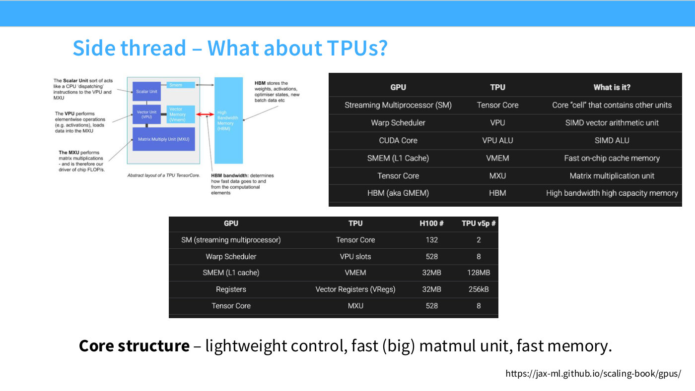

(Same heading text as slide 13 — this is a follow-on build slide reusing the
title.) No standalone body text beyond the figure captions and the repeated
closing line "**Core structure** – lightweight control, fast (big) matmul
unit, fast memory." Credit at the foot: `https://jax-ml.github.io/scaling-book/gpus/`

**Figure 1 (top left) — the same "Abstract layout of a TPU TensorCore"
diagram described in Slide 13** (Scalar Unit / VPU+Vmem / MXU, connected to
an HBM bar), shown here smaller alongside two comparison tables.

**Figure 2 (top right) — a three-column correspondence table, "GPU | TPU |
What is it?"**

| GPU | TPU | What is it? |
| --- | --- | --- |
| Streaming Multiprocessor (SM) | Tensor Core | Core "cell" that contains other units |
| Warp Scheduler | VPU | SIMD vector arithmetic unit |
| CUDA Core | VPU ALU | SIMD ALU |
| SMEM (L1 Cache) | VMEM | Fast on-chip cache memory |
| Tensor Core | MXU | Matrix multiplication unit |
| HBM (aka GMEM) | HBM | High bandwidth high capacity memory |

**Figure 3 (bottom) — a four-column quantitative comparison table, "GPU |
TPU | H100 # | TPU v5p #"**

| GPU | TPU | H100 # | TPU v5p # |
| --- | --- | --- | --- |
| SM (streaming multiprocessor) | Tensor Core | 132 | 2 |
| Warp Scheduler | VPU slots | 528 | 8 |
| SMEM (L1 cache) | VMEM | 32MB | 128MB |
| Registers | Vector Registers (VRegs) | 32MB | 256kB |

Note on this table as printed: the H100 column gives **32MB** for both the SMEM
row and the Registers row. That repetition is what the slide prints; it is
recorded here rather than reconciled.
| Tensor Core | MXU | 528 | 8 |

Note: the deck's own tables list the same row label "Tensor Core" on the GPU
side twice across Figures 2 and 3 (once mapped to "MXU" generally, once with
counts) — this is simply the same GPU↔TPU term pair being restated with
numbers in the second table, not a contradiction.

## Slide 15 — Strengths of the GPU model

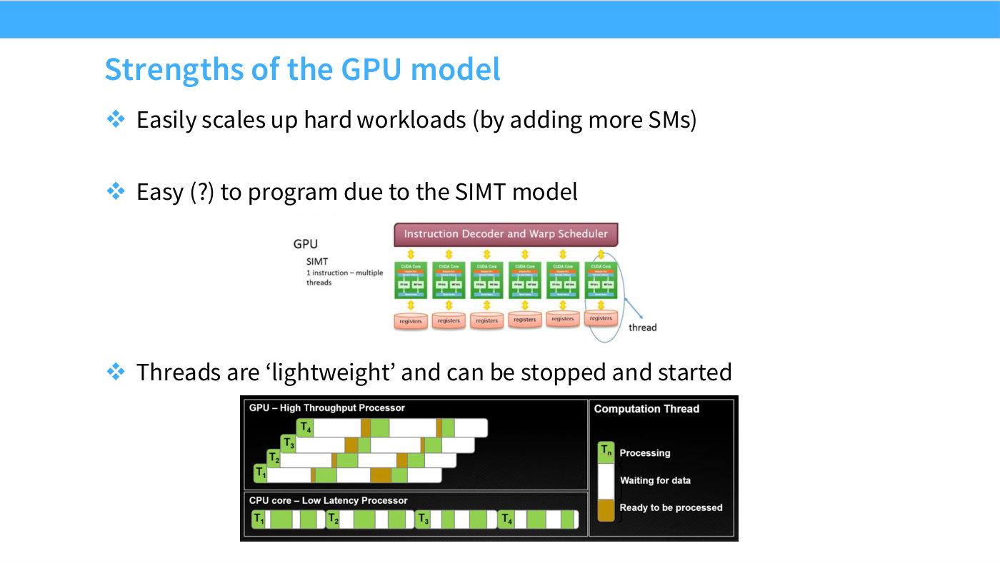

Text: "❖ Easily scales up hard workloads (by adding more SMs)"; "❖ Easy (?)
to program due to the SIMT model"; "❖ Threads are 'lightweight' and can be
stopped and started".

**Figure 1 (middle) — SIMT execution diagram.** A maroon bar reads
"Instruction Decoder and Warp Scheduler" spanning the top. Below it, **six**
identical green "CUDA Core" columns, each connected to the scheduler bar
above by a yellow double-headed arrow. Each CUDA Core box internally
contains, top to bottom: an orange "Dispatch Port" bar, a blue "Operand
Collector" bar, a row of two sub-units "FP Unit" and "INT Unit" side by side,
and a blue "Result Queue" bar. Each CUDA Core column also connects downward
via a yellow double-headed arrow to its own peach-coloured cylinder labelled
"registers". A curved blue arrow loops from the sixth (rightmost) CUDA Core
back up and around, labelled "thread" — illustrating a thread being tracked
through the pipeline. To the left of the diagram, plain text labels this as
"GPU / SIMT / 1 instruction – multiple threads."

**Figure 2 (bottom) — the same two-panel latency-vs-throughput scheduling
diagram already described in Slide 8, Figure 2** (staggered "GPU – High
Throughput Processor" staircase of $T_1$–$T_4$ timelines above a sequential
"CPU core – Low Latency Processor" panel, with the "Processing / Waiting for
data / Ready to be processed" colour legend at right) — reused here
unchanged.

## Slide 16 — GPUs as fast matrix multipliers


Text: "Early days of NVIDIA GPUs – programmable shaders. Researchers hacked
this to do matmuls". No URL credit line (the figure itself is a scanned
paper).

**Figure 1 — the first page of a scanned academic paper, "Fast Matrix
Multiplies using Graphics Hardware."** Authors "E. Scott Larsen" and "David
McAllister", both "Department of Computer Science, University of North
Carolina at Chapel Hill, Chapel Hill, NC 27599-3175 USA", emails
larsene@cs.unc.edu and davemc@cs.unc.edu. The right column, headed
"Implementation", reads: "We mention here some observations we made during
our implementation that may be of interest to those duplicating our
results." followed by four labelled findings: "**Refresh Rate** We found
that setting the refresh rate on the monitor as low as possible made
marginal improvements (about 10%)."; "**RGBA** We found that 4 numbers can be
packed into a single pixel, by setting the red, green, blue, and alpha
channels to different values."; "**Texture Format** Changing the format of
the texture creation and read-back from RGBA to ABGR_EXT (in OpenGL) gave
about 40% improvement on our hardware. This is because the hardware driver
avoids reformatting the data from the application format to the card format.
There is a number of options here, with near equal performance for each
option except the one used natively on the specific hardware. The native
format should give significant improvement."; "**Full Screen** Running full
screen instead of in a window provides improved performance." — followed by
"Various other optimizations yielded minor (<1%) improvements." The paper's
left column, under the title, is otherwise blank in this crop (the actual
abstract/body text is not shown — the slide crops to just the header and the
right column).

## Slide 17 — New matmul hardware means matmuls are fast and special


Text: "Tensor cores (introduced in V, T series) are specialized matrix
multiplication circuits."; "**Matmuls are >10x faster than other floating
point ops!**" No URL credit line.

**Figure 1 — line chart, "Matmul vs. non-matmul FLOPS across GPUs."** The
y-axis is "TFLOP/S" on a log scale, ticked $10^1$, $10^2$, $10^3$. The x-axis
is "GPU", with categorical ticks (as printed in the chart) K80, M80, P100,
V100, A100, H100. There are **two** series, per the chart's own legend:
- **Blue, "non-matmul"**: about 8 TFLOP/s at K80, ~9 at M80, ~10.5 at P100,
  ~15 at V100, ~20 at A100, and ~60 at H100 — a shallow, steady climb.
- **Orange, "matmul"**: tracks the blue line almost exactly through K80→P100
  (about 8→10.5 TFLOP/s), then breaks sharply upward after P100, reaching
  ~120 at V100, ~300 at A100, and ~1000 at H100.

The two series are identical up to P100 and diverge only once tensor cores
appear (V100 onward), which is the chart's point.

## Slide 18 — Compute scaling is faster than memory scaling

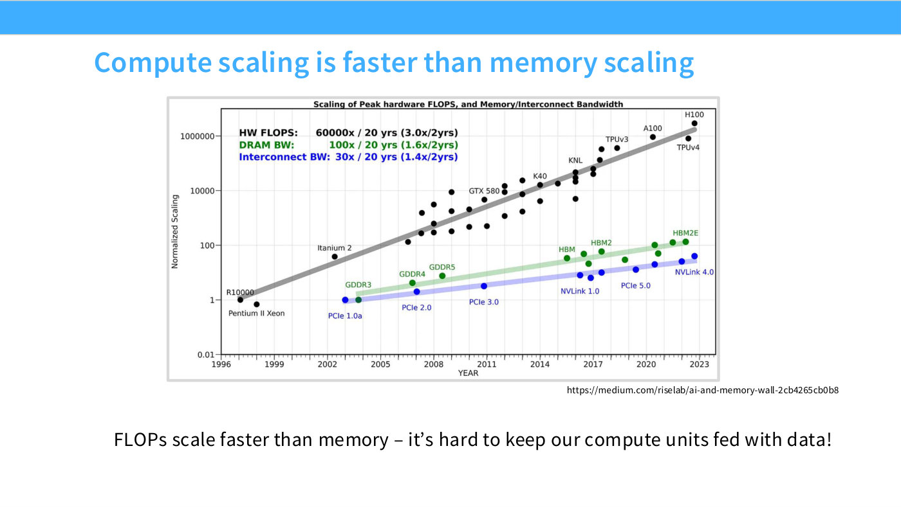

Text: "FLOPs scale faster than memory – it's hard to keep our compute units
fed with data!" Credit at the foot: `https://medium.com/riselab/ai-and-memory-wall-2cb4265cb0b8`

**Figure 1 — scatter/line chart, "Scaling of Peak hardware FLOPS, and
Memory/Interconnect Bandwidth."** The y-axis is "Normalized Scaling" on a log
scale, ticked 0.01, 1, 100, 10000, 1000000. The x-axis is "YEAR", ticked 1996,
1999, 2002, 2005, 2008, 2011, 2014, 2017, 2020, 2023. An in-plot text block
gives the three trend rates directly: "**HW FLOPS:** 60000x / 20 yrs
(3.0x/2yrs)" (black), "**DRAM BW:** 100x / 20 yrs (1.6x/2yrs)" (green),
"**Interconnect BW:** 30x / 20 yrs (1.4x/2yrs)" (blue). There are **three**
series, each a scatter of labelled points with a fitted trend line of the
matching colour:
- **Black ("HW FLOPS")**: individually labelled points climb from
  Pentium II Xeon and R10000 (~1996–1998, normalized scaling ≈ 1) through
  Itanium 2 (~2002, ≈60), GTX 580 (~2010, ≈9000), K40 (~2013, ≈12000), KNL
  (~2016, clustered ≈15000–35000), up to TPUv3 (~2018, ≈70000), A100 (~2020,
  ≈900000), H100 and TPUv4 (~2022–2023, ≈1,000,000–1,600,000). Many
  additional unlabelled black points fill in the trend between these.
- **Green ("DRAM BW")**: labelled points GDDR3 (~2004, ≈1), GDDR4 (~2007,
  ≈2), GDDR5 (~2009, ≈3), HBM (~2016, ≈55), HBM2 (~2017, ≈80), and HBM2E
  (~2021–2022, ≈100–120), tracking a shallower green trend line.
- **Blue ("Interconnect BW")**: labelled points PCIe 1.0a (~2004, ≈1), PCIe
  2.0 (~2007, ≈1.5), PCIe 3.0 (~2011, ≈2), NVLink 1.0 (~2016, ≈25), PCIe 5.0
  (~2019, ≈35), and NVLink 4.0 (~2022, ≈60), tracking the shallowest trend
  line of the three, visibly below the green DRAM-BW line for most of the
  chart's span.

The overall point, reiterated by the in-plot text, is that the black
(compute) trend line rises far more steeply than either memory-bandwidth
trend line.

## Slide 19 — Recap: GPUs – what are they and how do they work

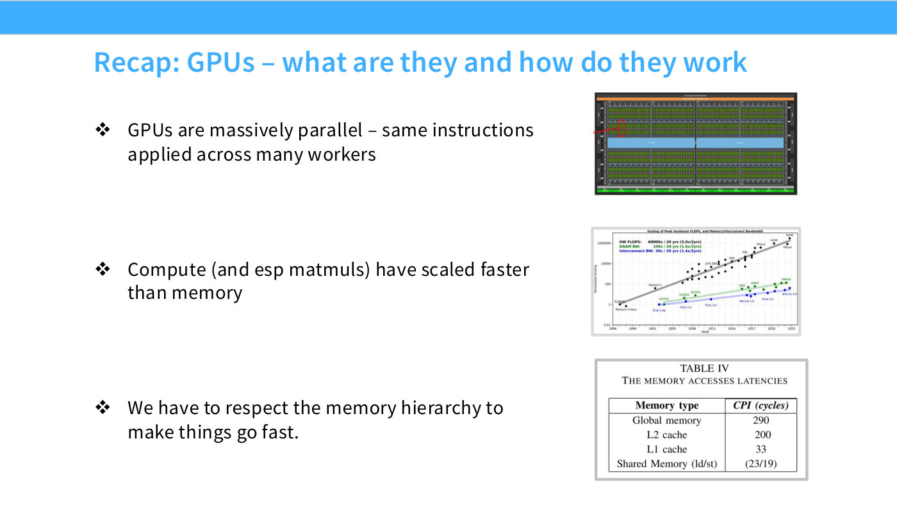

Text: "❖ GPUs are massively parallel – same instructions applied across many
workers"; "❖ Compute (and esp matmuls) have scaled faster than memory"; "❖ We
have to respect the memory hierarchy to make things go fast." No credit
line.

This slide recaps Part 1 by reprising three earlier figures as small
thumbnails down the right-hand side, unchanged in content:

**Figure 1 (top right) — the same GA100-style full-die tile diagram** used
as Slide 9's Figure 2 / visible again inside Slide 11's left panel (rows of
green SM tiles in four GPC quadrants around a blue central L2-cache band,
with NVLink ports along the bottom and a red-outlined tile on the left edge
highlighting one SM).

**Figure 2 (middle right) — the same "Scaling of Peak hardware FLOPS, and
Memory/Interconnect Bandwidth" chart from Slide 18**, shown as a small
thumbnail with its three labelled trend lines (HW FLOPS / DRAM BW /
Interconnect BW) too small to re-read individual point labels at this size,
but the overall shape (black line diverging above the green and blue lines)
matches Slide 18 exactly.

**Figure 3 (bottom right) — the same "TABLE IV: THE MEMORY ACCESSES
LATENCIES" table from Slide 10**, reprised unchanged: Global memory 290,
L2 cache 200, L1 cache 33, Shared Memory (ld/st) (23/19).
## Slide 20 — Part 2: Making ML workloads fast on a GPU

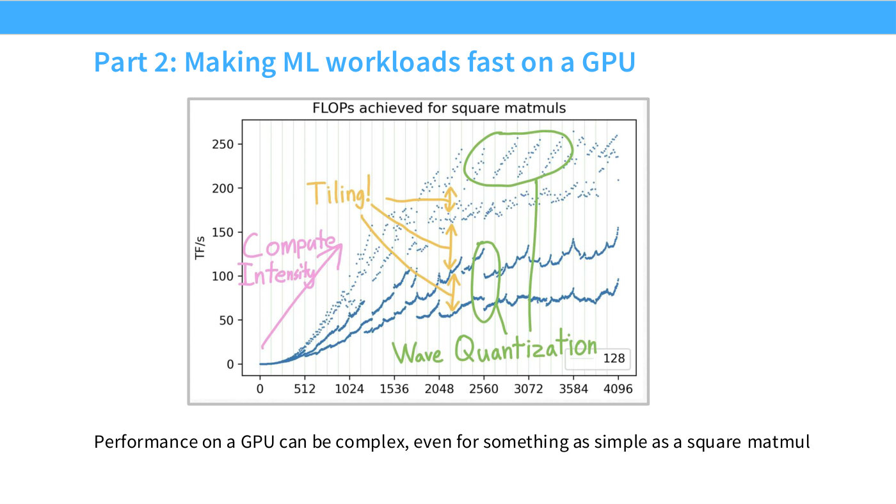

A section-header slide. Below the heading is a chart, and below that the line:
"Performance on a GPU can be complex, even for something as simple as a square
matmul".

**Figure 1 — scatter plot, "FLOPs achieved for square matmuls", with handwritten
annotations overlaid.** The y-axis is "TF/s", ticked 0, 50, 100, 150, 200, 250.
The x-axis is ticked 0, 512, 1024, 1536, 2048, 2560, 3072, 3584, 4096 (matrix
side length for the square matmul, unlabeled as such but consistent with that
reading). There is **one** data series: many small blue dots, each apparently
one measured matmul configuration, which trace out several separate rising,
sawtooth-shaped bands rather than a single curve — the bands sit at roughly
three tiers (a lower band around 50-150 TF/s, a middle band around 100-180
TF/s, and a cluster of higher points reaching up to ~250-260 TF/s toward the
right edge). A small grey-outlined legend box in the lower right of the plot,
near the 3584-4096 tick region, contains a single faint line swatch labelled
"128" (a native chart legend entry, not a hand annotation — its swatch color is
too faint to identify, but the label reads "128").

Overlaid in the instructor's handwriting, in three colors:
- Pink/magenta: "Compute Intensity", with an arrow running diagonally up and to
  the right along the bottom band of points.
- Orange: "Tiling!", with two diagonal leader lines running from the label down
  to a group of **three** stacked double-headed vertical arrows at roughly
  x=1536-2048. The three arrows measure three separate gaps between four band
  levels, at roughly TF/s 185, 140, 95 and 55. (Slide 46 shows the same chart
  and the same three arrows.)
- Green: "Wave Quantization", with an oval circled around the topmost cluster
  of dots (around x=2560-3072, the highest TF/s values), and a vertical
  loop/line drawn down from that oval toward the middle band around x=3072.

## Slide 21 — What makes ML workloads fast?


Bold sub-heading: "The roofline model". Footer line: "Key to this section:
**how do we avoid being memory bound?**"

**Figure 1 — the classic roofline chart (log-log plot).** The y-axis is
"Throughput (gflops)", log-scaled, with labelled gridlines at 1, 10, 100, 1000
(the plotted lines extend above the 1000 label without a further labelled
tick). The x-axis is "Operational Intensity (flops/byte)", log-scaled, with
labelled ticks at 0.01, 0.1, 1, 10, 100, 1000. A legend at top reads "Dense
matrix multiply" (blue filled diamond marker) and "Sparse matrix multiply"
(blue filled circle marker) — these are marker-shape keys for the four plotted
data points, not separate line series.

There are **four** diagonal/plateau "roofline" lines, each a memory-bandwidth
ceiling that turns into a flat compute-throughput ceiling as operational
intensity increases:
- Red line, labelled "GPU registers" along its diagonal portion, flattening
  into a plateau labelled "GPU ALU throughput" at the top of the chart (the
  highest ceiling, flattening out at the smallest operational intensity of the
  four).
- Orange line, labelled "GPU shared memory", diagonal, flattening into the same
  "GPU ALU throughput" plateau as the red line but bending over later (further
  right) than the red line.
- Yellow/gold line, labelled "GPU main memory", diagonal, also flattening into
  the "GPU ALU throughput" plateau, bending over later still (furthest right of
  the three GPU memory lines, around operational intensity ~20).
- Green line, labelled "CPU main memory", diagonal from the lowest point on the
  chart, flattening into a lower plateau labelled "CPU ALU throughput" (well
  below the GPU ALU throughput plateau), bending over at around operational
  intensity ~20.

Four data points are plotted: two blue diamonds ("Dense matrix multiply") sit
at high operational intensity (~1000) — one on the "GPU ALU throughput"
plateau near the top, one on the "CPU ALU throughput" plateau lower down. Two
blue circles ("Sparse matrix multiply") sit at low operational intensity
(~0.4-0.5) — one roughly on the "GPU main memory" diagonal, one roughly on the
"CPU main memory" diagonal, each well below its respective ALU-throughput
ceiling (i.e., memory-bound).

## Slide 22 — How do we make GPUs go fast?

No figure. A numbered list of six techniques, presented as this section's
outline:

1. Control divergence (not a memory bottleneck..)
2. Low precision computation
3. Operator fusion
4. Recomputation
5. Coalescing memory
6. Tiling

## Slide 23 — Control divergence (not a memory issue)


Text: "GPUs operate in a SIMT model – every thread in a warp is executing the
same instruction" and, below the first figure, "Conditionals are fine, but
lead to significant overhead from the execution model".

**Figure 1 — SIMT hardware diagram.** A box labelled "GPU" containing the
label "SIMT / 1 instruction – multiple threads" on the left. To its right, a
maroon banner "Instruction Decoder and Warp Scheduler" sits above a row of six
green boxes each labelled "CUDA Core" (each shown with internal sub-blocks
suggesting a dispatch port, operand collector, FP/INT units, and result
queue). Yellow double-headed arrows connect the instruction decoder/warp
scheduler down to each CUDA core, and each CUDA core connects down via another
yellow arrow to its own salmon-colored cylinder labelled "registers" — six
such register cylinders in total, one per core. A blue oval circles one core
plus its register cylinder and an arrow labels this pairing "thread" — i.e.,
one CUDA core plus its register file is one thread's execution resource within
the warp.

**Figure 2 — code-and-timeline diagram of control divergence.** On the left, a
grey code box:
```
if (threadIdx.x < 4) {
    A;
    B;
} else {
    X;
    Y;
}
Z;
```
On the right, a horizontal timeline (arrow labelled "Time" at the bottom). A
dark grey vertical bar labelled "diverge" marks the branch point. From it, two
parallel tracks of green boxes (each box filled with small black arrows
representing active threads) proceed in sequence: one track executes "A;" then
"B;" (bottom row), the other executes "X;" then "Y;" (top row, offset to start
after the divergence point) — illustrating that the two branches execute
serially rather than concurrently. Both tracks then rejoin into a single green
box labelled "Z;" at the right, once the warp reconverges.

## Slide 24 — Trick 1: Low precision computation

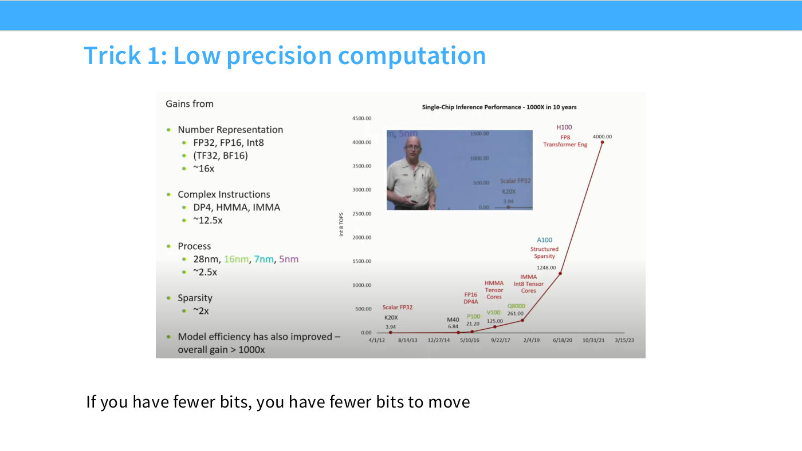

Text below the figure: "If you have fewer bits, you have fewer bits to move".

**Figure 1 (left, bulleted text) — "Gains from" list**, not a chart but a
structured text panel breaking down the ~1000x/10-year gain into factors:
- Number Representation: FP32, FP16, Int8; (TF32, BF16); ~16x
- Complex Instructions: DP4, HMMA, IMMA; ~12.5x
- Process: 28nm, 16nm, 7nm, 5nm (each node name printed in a different color —
  grey, green, cyan, magenta respectively); ~2.5x
- Sparsity: ~2x
- Model efficiency has also improved – overall gain > 1000x

**Figure 2 (right) — line chart, "Single-Chip Inference Performance - 1000X in
10 years".** The y-axis is "Int 8 TOPS", ticked 0.00, 500.00, 1000.00,
1500.00, 2000.00, 2500.00, 3000.00, 3500.00, 4000.00, 4500.00. The x-axis is
dates, ticked 4/1/12, 8/14/13, 12/27/14, 5/10/16, 9/22/17, 2/4/19, 6/18/20,
10/31/21, 3/15/23. There is **one** data series (a dark red line with circular
markers at each labelled GPU generation), rising from near zero to 4000 TOPS:
- Scalar FP32, K20X: 3.94 (at 4/1/12)
- M40: 6.84 (at ~12/27/14)
- FP16 DP4A, P100: 21.20 (at ~5/10/16)
- HMMA Tensor Cores, V100: 125.00 (at ~9/22/17)
- IMMA Int8 Tensor Cores, Q8000: 261.00 (at ~2/4/19)
- A100, Structured Sparsity: 1248.00 (at ~6/18/20)
- H100, FP8 Transformer Eng: 4000.00 (at ~10/31/21)
The curve is essentially flat near zero through 2017, then rises steeply
(convex, accelerating) from 2019 onward. Superimposed in the upper-left of the
chart area is a small inset photo/screenshot of a presenter (a man in a light
shirt, gesturing) standing beside a small duplicate/earlier version of the
same chart on a presentation screen, with axis labels "1500.00" / "1000.00" /
"500.00" / "0.00" and a callout "Scalar FP32 / K20X / 3.94" visible in the
inset — i.e., this whole figure is itself a photo/screenshot of someone
presenting this chart (a pasted image, not a native chart).

## Slide 25 — Low precision improves arithmetic intensity

Text: "**Example:** elementwise ReLU ($x = \max(0, x)$) on a vector of size
$n$."

(Float 32 case)
**Memory access**: 1 read (x), 1 write (if x < 0), float 32 = 4 bytes per op
**Operations:** 1 comparison op, 1 FLOP.
**Intensity:** 8 bytes / FLOP

(Float 16)
**Memory access**: 1 read (x), 1 write (if x < 0), float 16 = 2 bytes per op
**Operations:** 1 comparison op, 1 FLOP.
**Intensity:** 4 bytes / FLOP

No figure.

## Slide 26 — Low precision drives faster matrix multiplies

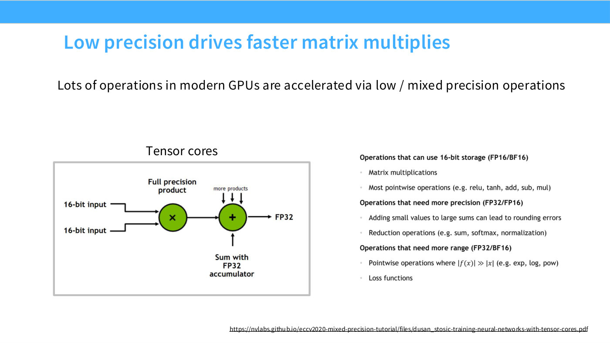

Text: "Lots of operations in modern GPUs are accelerated via low / mixed
precision operations". Credit line at the foot of the page:
`https://nvlabs.github.io/eccv2020-mixed-precision-tutorial/files/dusan_stosic_training-neural-networks-with-tensor-cores.pdf`

**Figure 1 (left) — "Tensor cores" diagram.** A grey-outlined box containing:
two arrows labelled "16-bit input" feeding into a green circle marked "×"
(multiply); its output, labelled "Full precision product," feeds into a second
green circle marked "+" (add/accumulate), which also receives several more
incoming arrows labelled "more products" (drawn as a small fan of down-arrows
above the "+" circle) and a labelled input "Sum with FP32 accumulator"
feeding into the same "+" circle from below; the combined output exits the box
to the right labelled "FP32". This depicts one tensor-core MAC: multiple
16-bit input products are summed into an FP32 accumulator.

**Figure 2 (right) — bulleted text panel, "Operations that can use 16-bit
storage (FP16/BF16)" vs. operations needing more precision or range:**
- *Operations that can use 16-bit storage (FP16/BF16)*: Matrix
  multiplications; Most pointwise operations (e.g. relu, tanh, add, sub, mul)
- *Operations that need more precision (FP32/FP16)*: Adding small values to
  large sums can lead to rounding errors; Reduction operations (e.g. sum,
  softmax, normalization)
- *Operations that need more range (FP32/BF16)*: Pointwise operations where
  $|f(x)| \gg |x|$ (e.g. exp, log, pow); Loss functions

## Slide 27 — Frontiers in low precision


Two side-by-side panels.

**Left panel, headed "Very low precision (FP8) with different tradeoffs" —
bit-field diagrams for four number formats**, each row showing colored cells
(blue = sign, orange = exponent, green = mantissa) with the column headers
"sign / exponent / mantissa" printed above the first row, and the decoded
decimal value given at the right of each row:
- **FP16**: sign `0`; exponent (5 bits) `0 1 1 0 1`; mantissa (10 bits)
  `1 0 0 1 0 1 0 0 1 1` = 0.395264
- **BF16**: sign `0`; exponent (8 bits) `0 1 1 1 1 1 0 1`; mantissa (7 bits)
  `1 0 0 1 0 1 0` = 0.394531
- **FP8 E4M3**: sign `0`; exponent (4 bits) `0 1 0 1`; mantissa (3 bits)
  `1 0 1` = 0.40625
- **FP8 E5M2**: sign `0`; exponent (5 bits) `0 1 1 0 1`; mantissa (2 bits)
  `1 0` = 0.375

These four rows all encode approximately the same real value (~0.375-0.40625),
illustrating how the same quantity is represented with progressively fewer
exponent/mantissa bits as precision drops from FP16 to FP8.

**Right panel, headed "Multiple scaling factors MXFP8 (Blackwell)" — block
diagram comparing plain FP8 to MXFP8.** On the left, a small block labelled
"FP8" shows a uniform grid of orange cells labelled "data" above a single
small orange square labelled "Scaling factor" — i.e., one scale factor for the
whole block. On the right, a block labelled "MXFP8" shows the same-size grid
of "data" cells — 4 rows x 8 columns, 32 cells — now subdivided into **eight**
coloured groups of 4 cells each, arranged 4 x 2: row 1 orange | green, row 2
grey | blue-slate, row 3 light-blue | pink, row 4 yellow | purple. The
"Scaling factor" panel beside it correspondingly holds **eight** swatches,
arranged 4 x 2 to match and each coloured to its group and labelled "E8M0" — i.e., MXFP8 assigns one E8M0 (8-bit exponent, 0-bit
mantissa) scale factor per small group of elements rather than one scale
factor for the entire block.

**Figure 3 (lower right) — a "Forward pass / Backward pass" flow diagram.** A
tan box headed "Forward pass" contains "High precision" -> "Cast" -> *rowwise*
-> "Matrix multiply (fwd)". A *columnwise* arrow runs down from it into a
light-blue box headed "Backward pass", which contains "Matrix multiply (dgrad)"
(fed *rowwise*) and "Matrix multiply (wgrad)" (fed *columnwise*), together with
a second "Cast" fed by "High precision" entering from the right. The arrow
joining the two boxes is labelled "Weights". This is the figure that motivates
the "Transposes are now nontrivial!" bullet below: the forward pass wants the
data laid out rowwise and the backward pass wants it columnwise, and a
per-32-element scale factor does not survive a transpose unchanged.

Below the left panel, text: "MXFP8 has many *interesting* things about it" —
- Uses E4M3 (more mantissa) due to more scale factors
- Scale factors themselves are FP8 (E8M0), 1 per 32
- Transposes are now nontrivial!

## Slide 28 — MXFP8 training in practice


Text below the figure: "Notice – not all weights in MXFP8, transposes also
separately quantized". Credit line at the foot: `https://arxiv.org/html/2506.08027v2`

**Figure 1 — two-part pipeline diagram.** The top part shows a legend/diagram
titled "Transformer block" (drawn with a "BF16" / "MXFP8" line-style key at top
left) containing, left to right: "Layer Norm" → three small green boxes
stacked and labelled Q, K, V → "BMM 1" → "Softmax" → "BMM 2" → "Projection"
(green) → "Add" → "Layer Norm" → "FC1" (green) → "Act Func" → "FC2" (green) →
"Add". A green bar labelled "Weights" runs along the bottom of this block,
connecting up via vertical green lines to the Q/K/V boxes, the "Projection"
box, "FC1", and "FC2" — indicating those are the components with quantized
weights.

The bottom part is a flow diagram of the forward/backward computation:
- "Weight" (BF16) and "Activation" (BF16) each flow into a "quantize" step
  (orange oval for weight, blue/purple oval for activation), producing MXFP8,
  which feeds "FPROP" (a rounded box); its output goes "To next layer" in BF16.
- Separately, "Weight" and "Activation" (BF16) also flow into "transpose &
  quantize" steps (orange and blue/purple ovals) producing MXFP8, feeding
  "DGRAD", which outputs BF16 back "To optimizer for master-weights update".
- The incoming "Gradient" (BF16) flows into a "quantize" step (dark green
  oval) producing MXFP8 feeding into "DGRAD", and into a "transpose &
  quantize" step (dark green oval) producing MXFP8 feeding into "WGRAD".
- "WGRAD" takes the transposed/quantized weight and activation (MXFP8) and
  outputs FP32 "To optimizer for master-weights update".

Overall the figure shows that weights, activations, and gradients are each
quantized to MXFP8 twice — once in their natural orientation and once
transposed — because a transpose of an already-quantized MXFP8 tensor is not
equivalent to quantizing the transposed tensor directly (matching the "Notice"
caption and the "Transposes are now nontrivial!" bullet from slide 27).

## Slide 29 — Frontiers in low precision


Text: "MXFP4.." and, below the figure: "This is all the values you can
represent! 1 per 16 scaling, E4M3 scaling factors."

**Figure 1 — two columns of bit-field diagrams, MXFP4 (E2M1 format: 1 sign bit,
2 exponent bits, 1 mantissa bit — headers "sign / exponent / mantissa" atop
each column).** Left column (sign = 0, positive values):
- `0 0 0 0` = 0.0
- `0 0 0 1` = 0.5
- `0 0 1 0` = 1.0
- `0 0 1 1` = 1.5
- `0 1 0 0` = 2.0
- `0 1 0 1` = 3.0
- `0 1 1 0` = 4.0
- `0 1 1 1` = 6.0

Right column (sign = 1, negative values, otherwise identical bit patterns):
- `1 0 0 0` = -0.0
- `1 0 0 1` = -0.5
- `1 0 1 0` = -1.0
- `1 0 1 1` = -1.5
- `1 1 0 0` = -2.0
- `1 1 0 1` = -3.0
- `1 1 1 0` = -4.0
- `1 1 1 1` = -6.0

This is the complete 16-value representable set for MXFP4 (E2M1): sixteen
4-bit codes covering {0, ±0.5, ±1, ±1.5, ±2, ±3, ±4, ±6} with a signed zero.
The caption's claim that the shared scaling factor is "E4M3" describes the
MXFP4 scale-factor format on this page; note that this differs from the
scale-factor format shown on slide 27 for MXFP8, which was labelled "E8M0" in
both the figure and the accompanying bullet ("Scale factors themselves are FP8
(E8M0)") — the deck does not reconcile why the two adjacent MX formats are
given different scale-factor encodings, so both are recorded here as printed.

## Slide 30 — Trick 2: Operator fusion

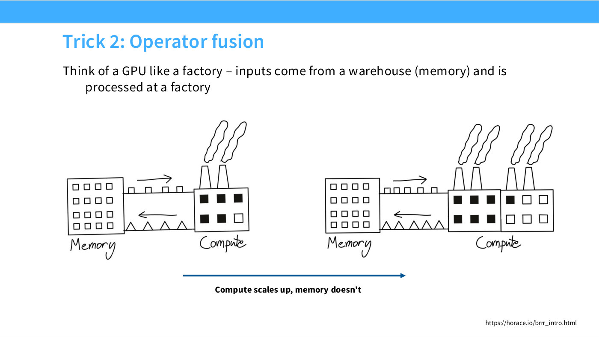

Text: "Think of a GPU like a factory – inputs come from a warehouse (memory)
and is processed at a factory". Bold caption below the figure: "**Compute
scales up, memory doesn't**", under a horizontal arrow spanning from the left
diagram to the right diagram (indicating progression, e.g. over hardware
generations). Credit line at the foot: `https://horace.io/brrr_intro.html`

**Figure 1 (left) — hand-drawn "factory" diagram.** A building labelled
"Memory" (drawn as a 4x4 grid of small white squares, i.e. 16 empty cells) is
joined by a double conveyor-belt-style connector to a factory building
labelled "Compute" with two smokestacks (drawn as wavy plumes) on its roof.
The top lane of the connector has small square teeth and an arrow pointing
right (Memory → Compute); the bottom lane has triangular teeth and an arrow
pointing left (Compute → Memory). Inside the "Compute" factory is a 2x3 grid
of squares: top row all three filled black, bottom row two filled black and
one left white — five of six compute cells "busy," one idle.

**Figure 2 (right) — the same diagram, redrawn with compute scaled up.** The
"Memory" building is identical (still a 4x4 grid of 16 white squares,
unchanged in size), connected by the same style of double conveyor. The
"Compute" factory has grown to **four** smokestacks and is now two adjoining
factory blocks side by side, each still a 2x3 grid of squares: the left block
is fully filled black (all six cells busy), the right block has only one
filled black cell (top-left) and five left white (mostly idle). So compute
capacity has doubled (6 → 12 cells) while memory is unchanged, and the newly
added compute sits mostly idle — illustrating "compute scales up, memory
doesn't."

## Slide 31 — Operator fusion to minimize memory access

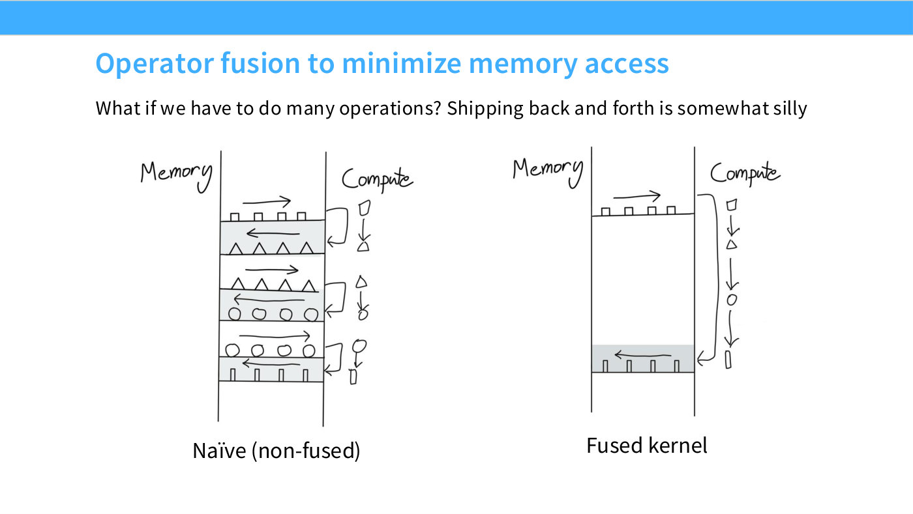

Text: "What if we have to do many operations? Shipping back and forth is
somewhat silly"

**Figure 1 (left) — "Naïve (non-fused)" diagram.** Two vertical parallel lines
labelled "Memory" (left line) and "Compute" (right line) at the top. Between
them, **three** repeated grey horizontal bands are stacked, each representing
one operation's round trip: each band shows a row of small square "teeth"
with a rightward arrow above (data going from memory to compute) and a row of
triangular teeth with a leftward arrow below (result going back from compute
to memory); to the right of each band, a small icon pair (a square and a
triangle/circle shape connected by a curved bracket) marks the compute step
performed on that data. The three bands are stacked vertically to represent
three sequential operations, each requiring its own round trip to memory.
Caption below: "Naïve (non-fused)".

**Figure 2 (right) — "Fused kernel" diagram.** The same two vertical lines
"Memory" and "Compute", but now only **one** grey band with square teeth and a
rightward arrow appears near the top (a single read from memory), followed by
a tall blank gap between the lines with a bracket alongside it marking three
stacked small icons (square, triangle, circle) — representing three compute
steps performed back-to-back without returning to memory in between — and
then a single grey band with triangular teeth and a leftward arrow near the
bottom (a single write back to memory). Caption below: "Fused kernel". The
contrast between the two figures shows fusion collapsing three round trips to
memory into one read and one write.

## Slide 32 — Example – sines and cosines

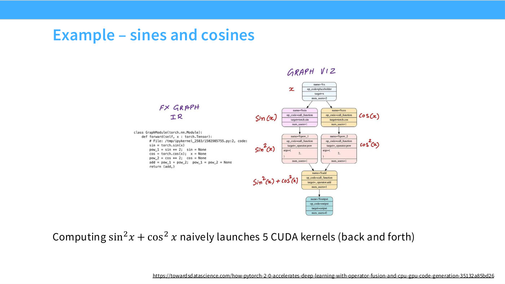

Text below the figures: "Computing $\sin^2 x + \cos^2 x$ naively launches 5
CUDA kernels (back and forth)". Credit line at the foot:
`https://towardsdatascience.com/how-pytorch-2-0-accelerates-deep-learning-with-operator-fusion-and-cpu-gpu-code-generation-35132a85bd26`

**Figure 1 (left) — "FX GRAPH IR" code listing**, a screenshot of a PyTorch
FX-traced module:
```
class GraphModule(torch.nn.Module):
    def forward(self, x : torch.Tensor):
        # File: /tmp/ipykernel_2583/1502985755.py:2, code:
        sin = torch.sin(x)
        pow_1 = sin ** 2;  sin = None
        cos = torch.cos(x);  x = None
        pow_2 = cos ** 2;  cos = None
        add = pow_1 + pow_2;  pow_1 = pow_2 = None
        return (add,)
```

**Figure 2 (right) — "GRAPH VIZ" node diagram**, the same computation drawn as
a directed graph of FX-node boxes (each box a stack of fields: `name=`,
`op_code=`, `target=`, `num_users=`, plus `args=(...)` where relevant), with
handwritten red annotations giving the mathematical meaning of each stage:
- A root node `name=%x`, `op_code=placeholder`, `target=x`, `num_users=2`,
  splits into two branches.
- Left branch: `name=%sin`, `op_code=call_function`, `target=torch.sin`,
  `num_users=1` — annotated "$\sin(x)$" — feeding into `name=%pow_1`,
  `op_code=call_function`, `target=_operator.pow`, `args=(2,)`,
  `num_users=1` — annotated "$\sin^2(x)$".
- Right branch (symmetric, not separately re-read at high resolution but
  matching the left branch's field structure): `name=%cos`,
  `op_code=call_function`, `target=torch.cos`, `num_users=1` — annotated
  "$\cos(x)$" — feeding into `name=%pow_2`, `op_code=call_function`,
  `target=_operator.pow`, `args=(2,)`, `num_users=1` — annotated
  "$\cos^2(x)$".
- Both `%pow_1` and `%pow_2` feed into `name=%add`, `op_code=call_function`,
  `target=operator.add` (partially legible), `num_users=1` — annotated
  "$\sin^2(x) + \cos^2(x)$".
- `%add` feeds into a final `name=%output`, `op_code=output`, `target=output`,
  `num_users=0`.

Each of the five FX nodes (sin, cos, pow_1, pow_2, add) corresponds to one of
the five separately-launched CUDA kernels named in the caption.

## Slide 33 — Fusion example

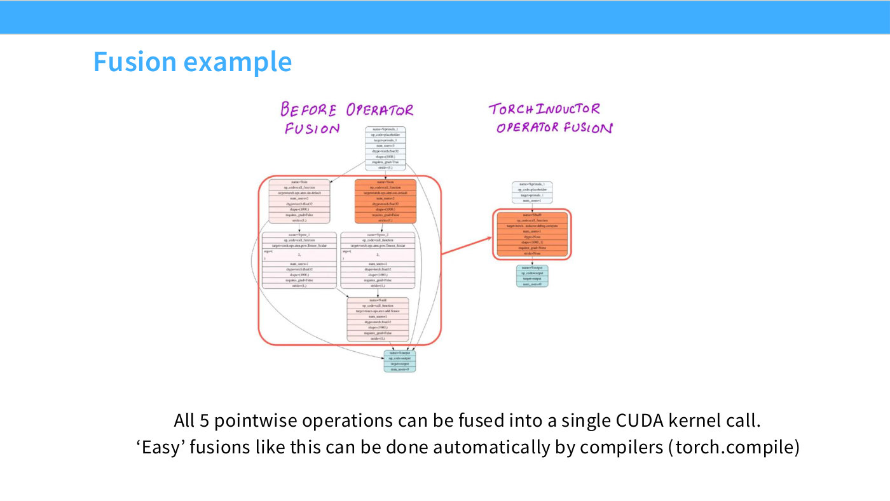

No native body text apart from two purple handwritten headers over the figure
and the caption below it: "All 5 pointwise operations can be fused into a
single CUDA kernel call. 'Easy' fusions like this can be done automatically by
compilers (torch.compile)"

**Figure 1 (left, headed in purple handwriting "BEFORE OPERATOR FUSION") — a
more detailed, lower-level FX/ATen graph** than slide 32's, using
`torch.ops.aten` targets and adding `dtype`/`shape`/`requires_grad`/`stride`
fields to each node box, e.g.: `name=%cos`, `op_code=call_function`,
`target=torch.ops.aten.cos.default`, `num_users=2`, `dtype=torch.float32`,
`shape=(1000,)`, `requires_grad=False`, `stride=(1,)`; feeding `name=%pow_2`,
`target=torch.ops.aten.pow.Tensor_Scalar`, `args=(2,)`, `num_users=1`,
`dtype=torch.float32`, `shape=(1000,)`, `requires_grad=False`, `stride=(1,)`;
feeding (together with the mirrored sin/pow_1 branch, off the left edge of
this crop) into `name=%add`, `target=torch.ops.aten.add.Tensor`,
`num_users=1`, `dtype=torch.float32`, `shape=(1000,)`, `requires_grad=False`,
`stride=(1,)`; feeding a final `name=%output`, `op_code=output`,
`target=output`, `num_users=0`. A thick red rounded outline encloses this
entire cluster of intermediate nodes (cos, pow_2, and the mirrored sin/pow_1
nodes, plus add), marking them as the region to be fused.

**Figure 2 (right, headed in purple handwriting "TORCHINDUCTOR OPERATOR
FUSION") — the same computation after fusion.** `name=%primals_1`,
`op_code=placeholder`, `target=primals_1`, `num_users=1`, feeds into a single
node `name=%buf0`, `op_code=call_function`,
`target=torch._inductor.debug.compute`, `num_users=1`, `dtype=None`,
`shape=(1000, 1)`, `requires_grad=None`, `stride=None` — this node is
double-outlined in red/orange, marking it as the one fused kernel — which
feeds a final `name=%output`, `op_code=output`, `target=output`,
`num_users=0`. A thick red arrow runs from the red-outlined cluster in the
left figure to the red-outlined `%buf0` node in the right figure, visually
depicting the whole cluster of ATen ops collapsing into the single
`torch._inductor.debug.compute` kernel call.

## Slide 34 — Trick 3: recomputation

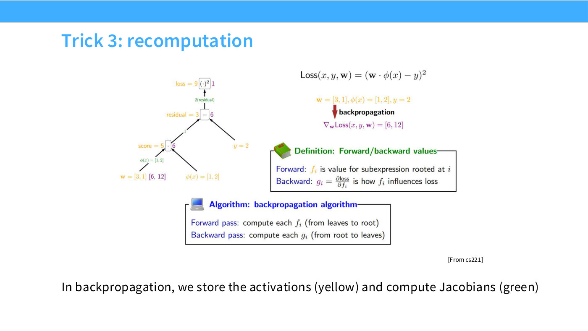

Displayed equation at top: $$\text{Loss}(x, y, \mathbf{w}) = (\mathbf{w}
\cdot \phi(x) - y)^2$$
Citation at the foot: "[From cs221]". Caption below the figure: "In
backpropagation, we store the activations (yellow) and compute Jacobians
(green)" — note the figure's forward-value labels actually render in an
orange/amber color, not yellow, so this is recorded as printed without
reconciling the color name.

**Figure 1 (left) — a hand-labelled computation graph for backpropagation**,
built from three binary/unary operation boxes:
- Top box "$(\cdot)^2$" (squaring), with orange forward-value label
  "loss = 9" to its left and purple "1" to its right (the root's own
  gradient, trivially 1). The edge below it is labelled in green
  "2(residual)" — the local derivative of squaring.
- Middle box "−" (subtraction), with orange forward-value label
  "residual = 3" to its left and purple "6" to its right. Its left input
  comes from the "score" box via an edge labelled "1" (the local derivative
  of subtraction); its right input comes directly from a leaf node labelled
  orange "$y = 2$".
- Bottom box "·" (dot product), with orange forward-value label "score = 5"
  to its left and purple "6" to its right. Its two inputs are leaf nodes:
  one labelled orange "$\mathbf{w} = [3, 1]$" with purple gradient
  "$[6, 12]$" alongside it, and one labelled green "$\phi(x) = [1, 2]$"
  (appearing twice in the figure, once along each incoming edge/leaf
  position).

**Figure 2 (right) — two definition/algorithm call-out boxes plus a worked
numeric summary.** Above the boxes, orange text "$\mathbf{w} = [3, 1],
\phi(x) = [1, 2], y = 2$", a downward dark-red arrow labelled "backpropagation"
in bold, and the result in purple: "$\nabla_{\mathbf{w}} \text{Loss}(x, y,
\mathbf{w}) = [6, 12]$".
- A green-bordered box with a green book icon, headed "Definition:
  Forward/backward values": "**Forward:** $f_i$ is value for subexpression
  rooted at $i$" / "**Backward:** $g_i = \frac{\partial \text{loss}}{\partial
  f_i}$ is how $f_i$ influences loss".
- A blue-bordered box with a blue laptop icon, headed "Algorithm:
  backpropagation algorithm": "**Forward pass:** compute each $f_i$ (from
  leaves to root)" / "**Backward pass:** compute each $g_i$ (from root to
  leaves)".

## Slide 35 — Storing (and retrieving) activations can be expensive!

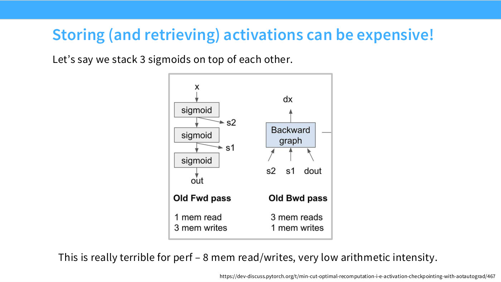

Text: "Let's say we stack 3 sigmoids on top of each other." Caption below the
figure: "This is really terrible for perf – 8 mem read/writes, very low
arithmetic intensity." Credit line at the foot:
`https://dev-discuss.pytorch.org/t/min-cut-optimal-recomputation-i-e-activation-checkpointing-with-aotautograd/467`

Note on the numeral question: this page's only bare digit is the "8" inside
the body sentence "8 mem read/writes" quoted above — it is running text at
the bottom of the page, not a number printed in a page corner, and it is not
a slide/folio number.

**Figure 1 — boxed diagram of a stack of three sigmoids, forward and backward
passes side by side.** Left half, headed "Old Fwd pass": input `x` flows down
through three stacked boxes labelled "sigmoid," "sigmoid," "sigmoid," with
intermediate outputs branching off to the right labelled `s2` (after the
first sigmoid) and `s1` (after the second sigmoid), and a final output `out`
at the bottom. Below it: "1 mem read / 3 mem writes". Right half, headed "Old
Bwd pass": a single box labelled "Backward graph" with output `dx` at top and
three inputs at the bottom labelled `s2`, `s1`, `dout`. Below it: "3 mem
reads / 1 mem writes". The two halves are separated by a thin vertical
divider line.

## Slide 36 — Throw away the activations, re-compute them!

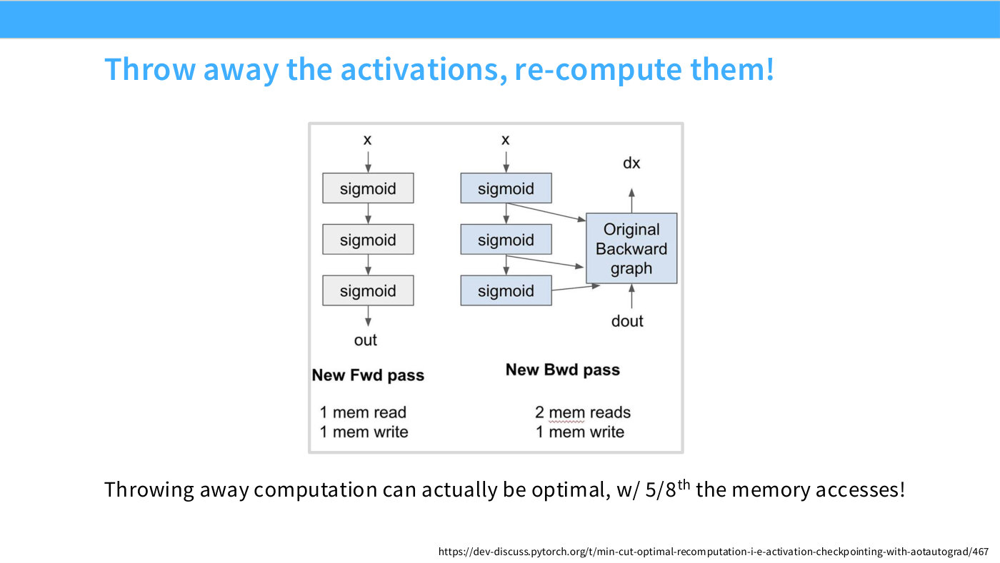

Caption below the figure: "Throwing away computation can actually be optimal,
w/ 5/8th the memory accesses!" Credit line at the foot:
`https://dev-discuss.pytorch.org/t/min-cut-optimal-recomputation-i-e-activation-checkpointing-with-aotautograd/467`

**Figure 1 — boxed diagram, again forward and backward passes side by side,
now contrasting old vs. new backward strategy.** Left: the unchanged "New Fwd
pass" — input `x` down through three stacked "sigmoid" boxes to output `out`,
labelled "1 mem read / 1 mem write" below. Right, headed "New Bwd pass": a
second copy of `x` flows down through three more stacked "sigmoid" boxes
(colored light blue, distinguishing them as recomputed rather than stored),
each of which now feeds an arrow directly into a box labelled "Original
Backward graph" (rather than being stored to memory and reloaded); that box
takes `dout` as an additional input at the bottom and outputs `dx` at the
top. Labelled below: "2 mem reads / 1 mem write". The figure shows that
instead of storing and reloading the three intermediate activations (s1, s2)
as in slide 35, the forward sigmoids are simply recomputed during the
backward pass and fed straight into the backward graph.

## Slide 37 — Trick (?) 4: Memory coalescing and DRAM


Text: "**DRAM** (global memory) is read in 'burst mode' – each read gives you
many bytes!" Bulleted text in the figure's grey box:
- Each address space is partitioned into burst sections
  - Whenever a location is accessed, all other locations in the same section
    are also delivered to the processor
- Basic example: a 16-byte address space, 4-byte burst sections
  - In practice, we have at least 4GB address space, burst section sizes of
    128-bytes or more

Below the figure, an arrow and text: "← Burst mode comes from the slow
per-row copy to the sense amplifier". Two credit lines are printed at the
foot: `[https://blog.csdn.net/xll_bit/article/details/117702476]` and
`[https://www.youtube.com/watch?v=9BjVUmaXaCQ]`; a faint diagonal watermark
reading "https://blog.csdn.net/xll_bit" also runs across Figure 2.

**Figure 1 (top) — a strip of 16 numbered, colored cells illustrating burst
sections.** The cells are numbered 0 through 15 left to right and grouped
into **four** "Burst section" groups of four cells each, each group labelled
"Burst section" above it: cells 0-3 are yellow, cells 4-7 are red, cells 8-11
are navy blue, and cells 12-15 are green.

**Figure 2 (bottom left) — a DRAM array diagram.** A green vertical bar on
the left labelled "Row AddressDecoder" feeds a grid of light-blue square
memory cells (rows and columns), with one full column highlighted by a
yellow outline (the burst section currently being accessed). Below the grid,
a row of colored squares (an alternating pattern of red and dark-navy
squares) represents the per-column sense amplifiers/output latches, with the
one aligned under the highlighted column outlined in yellow. Below that, a
green trapezoid labelled "Column Multiplexer/Demultiplexer" gathers the
sense-amplifier outputs; red and blue wires lead out from it toward the
bottom of the figure, representing the data path to the output pins. This
illustrates that reading one column pulls an entire burst section's worth of
cells through the sense amplifiers at once.
## Slide 38 — Memory coalescing


Text: "Memory accesses are *coalesced* if all the threads (in a warp) fall within the same burst"

**Figure 1 (top) — a pasted diagram illustrating coalesced loads.** A horizontal strip of 16 numbered cells, 0–15, is grouped into four colour-coded "Burst section" blocks of four cells each: cells 0–3 (yellow), 4–7 (red), 8–11 (dark navy), 12–15 (green). Above the yellow block, a "Coalesced Loads" box lists $T_0, T_1, T_2, T_3$, with four upward arrows connecting each thread to one of the four yellow cells (cell 0→$T_0$, 1→$T_1$, 2→$T_2$, 3→$T_3$). A second, identical "Coalesced Loads" box with $T_0$–$T_3$ sits above the dark-navy block, with arrows from cells 8, 9, 10, 11 up to $T_0$–$T_3$. Below the strip, a caption reads: "When all threads of a warp execute a load instruction, if all accessed locations fall into the same burst section, only one DRAM request will be made and the access is fully coalesced." A faint grey watermark is overprinted on this caption: "https://blog.csdn.net/xll_bit".

**Figure 2 (bottom left) — a pasted architecture diagram of CUDA thread/warp/SM scheduling.** Left block, labelled "This CUDA application uses 256 threads per block": a blue "CUDA Program" bar containing three small boxes "Block 0", "Block 1", "…", "Block 4095". Green arrows labelled "assign to an SM" run from Block 1 and Block 4095 down to two red-outlined rectangles marking specific SM columns on a large green-and-grey processor-die photo below (labelled "SM" in red). Middle block, labelled "each block is divided into warps": a tall cream box titled "Block i" listing "Warp 0", "Warp 1", "...", "Warp 7 (32 threads)", with a gold arrow labelled "ready" running from Warp 1 to the right. Right block, labelled "4 Warp schedulers per SM": four pink boxes "Warp Scheduler 0" through "Warp Scheduler 3", each with a downward arrow into a column of green execution-unit cells (the first column's cells labelled "INT32", the other three columns' cells labelled "FP32"), captioned at the bottom "Warp 1 instruction 10".

To the right of Figure 2, boxed text: "**Reminder**: a warp is a set of 32 consecutively numbered threads that execute together in a block. Memory accesses happen together"

## Slide 39 — Coalescing for matrix multiplication


Text: "For row-major matrices – **threads that move along rows are not coalesced**" / "Note how the second diagram reads the entire vector at each step!"

**Figure 1 (left pair) — two green square diagrams labelled "(A)" and "(B)".** Panel (A), captioned "not coalesced": a green square labelled "d_M" at top left and "WIDTH" at bottom, with two horizontal orange lines marked "Thread 1" and "Thread 2" running left-to-right across two different rows, each ending in a rightward arrow — each thread reads along a row. Panel (B), captioned "coalesced": a green square labelled "d_N" at top left and "WIDTH" (rotated text) at right, with two vertical orange lines running top-to-bottom ending in a downward arrow — threads read down a column instead.

**Figure 2 (right) — a pasted diagram of the access order for a coalesced load of matrix $M$.** At top, a small 4×4 grid of cells labelled $M_{0,0}$…$M_{3,3}$, colour-coded by row (row 0 yellow, row 1 red/orange, row 2 dark blue, row 3 green), with an arrow above captioned "Access direction in Kernel code" pointing right. Below, two stacked horizontal brackets labelled "Load iteration 1" and "Load iteration 0", each spanning four thread labels $T_0, T_1, T_2, T_3$, with upward arrows running from a 16-cell horizontal strip up into the $T_0$–$T_3$ labels of both iterations. The 16-cell strip at the bottom is the flattened row-major layout of matrix $M$: $M_{0,0}, M_{0,1}, M_{0,2}, M_{0,3}$ (yellow), $M_{1,0}, M_{1,1}, M_{1,2}, M_{1,3}$ (red), $M_{2,0}, M_{2,1}, M_{2,2}, M_{2,3}$ (dark blue), $M_{3,0}, M_{3,1}, M_{3,2}, M_{3,3}$ (green), with a label "M" and a downward arrow at the far left marking the start of the array.

## Slide 40 — Trick 5 (the big one): tiling

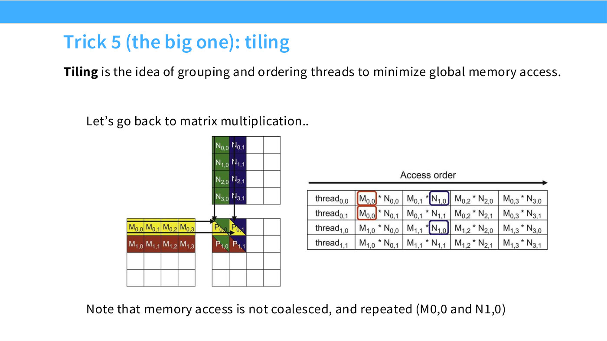

Text: "**Tiling** is the idea of grouping and ordering threads to minimize global memory access." / "Let's go back to matrix multiplication.." / "Note that memory access is not coalesced, and repeated (M0,0 and N1,0)"

(The "5" in the slide title is the trick's own number, "Trick 5" — not a printed page number. See the corner-numeral note at the end of this file's coverage.)

**Figure 1 (left) — a diagram of one step of naive (untiled) matrix multiplication.** A 4×2 matrix $N$ (column 0 green: $N_{0,0}, N_{1,0}, N_{2,0}, N_{3,0}$; column 1 dark blue: $N_{0,1}, N_{1,1}, N_{2,1}, N_{3,1}$) sits at top right. A 2×4 matrix $M$ (row 0 yellow: $M_{0,0..3}$; row 1 red: $M_{1,0..3}$) sits at bottom left. Two downward arrows run from $N_{0,0}$/$N_{0,1}$ and two rightward arrows run from $M_{0,0}$/$M_{1,0}$ into a small 2×2 tile of the output ($P_{0,0}, P_{0,1}, P_{1,0}, P_{1,1}$, drawn as yellow/green/red/dark-blue triangular quadrants) inside a larger, otherwise-blank output grid — showing that computing just this one output tile requires reading a full row of $M$ and a full column of $N$.

**Figure 2 (right) — a table titled "Access order" showing, for four threads, the sequence of multiply operations each performs.** Rows: thread$_{0,0}$, thread$_{0,1}$, thread$_{1,0}$, thread$_{1,1}$; columns are four successive access steps.
- thread$_{0,0}$: $M_{0,0}*N_{0,0}$, $M_{0,1}*N_{1,0}$, $M_{0,2}*N_{2,0}$, $M_{0,3}*N_{3,0}$
- thread$_{0,1}$: $M_{0,0}*N_{0,1}$, $M_{0,1}*N_{1,1}$, $M_{0,2}*N_{2,1}$, $M_{0,3}*N_{3,1}$
- thread$_{1,0}$: $M_{1,0}*N_{0,0}$, $M_{1,1}*N_{1,0}$, $M_{1,2}*N_{2,0}$, $M_{1,3}*N_{3,0}$
- thread$_{1,1}$: $M_{1,0}*N_{0,1}$, $M_{1,1}*N_{1,1}$, $M_{1,2}*N_{2,1}$, $M_{1,3}*N_{3,1}$

Two cells are boxed to highlight repeated global reads: $M_{0,0}$ (red box) appears in both thread$_{0,0}$'s and thread$_{0,1}$'s first step, and $N_{1,0}$ (dark-blue box) appears in both thread$_{0,0}$'s and thread$_{1,0}$'s second step — illustrating the uncoalesced, repeated access named in the caption below the figure.

## Slide 41 — Tiling – store and reuse information in shared memory


Text: "Cut up the matrix into smaller 'tiles', and load this into shared memory" / "Compute the matrix multiply in 'phases'", numbered: "1. Load $M_{0,0}$ and $N_{0,0}$ tiles into SHM", "2. Compute partial sums for $P$" (grey sub-note: "(Done with one tile)"), "3. Load the $M_{0,0}$ and $N_{2,0}$ tile into SHM", "4. …" / "**Advantages**: repeated reads now access shared, not global memory and memory access can be coalesced"

**Figure 1 (left) — a diagram of tiled matrix multiplication using 2×2 tiles.** Top right: a 4×2 matrix $N$ divided into two bold-outlined 2×2 tiles — the top tile ($N_{0,0}, N_{0,1}, N_{1,0}, N_{1,1}$, green/dark-blue by column) and the bottom tile ($N_{2,0}, N_{2,1}, N_{3,0}, N_{3,1}$, same colours). Bottom left: a 2×4 matrix $M$ divided into two bold-outlined 2×2 tiles — a left tile ($M_{0,0..1}, M_{1,0..1}$, yellow/red rows) and a right tile ($M_{0,2..3}, M_{1,2..3}$). Two black arrows run from the top $N$ tile down into a 4×4 output grid of $P$ values ($P_{0,0}$ through $P_{3,3}$); the top-left 2×2 block of $P$ ($P_{0,0}, P_{0,1}, P_{1,0}, P_{1,1}$) is outlined in bold and filled with matching yellow/green/red/dark-blue triangular quadrants, marking it as the tile currently being computed, while the other nine $P$ cells are blank.

## Slide 42 — Tiling math


No page text besides the figure caption/legend and the two definitional statements beneath it.

**Figure 1 — three side-by-side annotated grids, "Matrix A", "Matrix B", "Matrix C", sharing one legend.** Matrix A (left) is an 8×8 grid with one full horizontal band of light-purple cells ("Outer loop over tiles") containing a 2×2 sub-block in darker purple ("Current tile in outer loop"), which in turn contains a 1×2 pair of pale-green cells ("Inner loop over elements") with one cell in bright green ("Current element in inner loop"). Matrix B (middle) mirrors this with a vertical light-purple column band and vertical purple sub-block instead of a horizontal one, and is labelled "tile size $T$" at the top with a brace spanning the light-purple column. Matrix C (right) is a plain 8×8 grid labelled "matrix size $N$" at the top with a brace spanning its full width, containing one 2×2 sub-block in orange ("Temporary result tile") with one bright-green cell inside it matching the current element being written. Legend: light purple = "Outer loop over tiles", bright/dark purple = "Current tile in outer loop", pale green = "Inner loop over elements", bright green = "Current element in inner loop", orange = "Temporary result tile".

Below the figure: "**Non-tiled matrix multiply:** each input is read $N$ times from global memory" and "**Tiled matrix multiply:** each input is read $\frac{N}{T}$ times from global memory, and $T$ times within each tile. This is a factor of $T$ reduction in global memory access"

## Slide 43 — Complexities with tiling

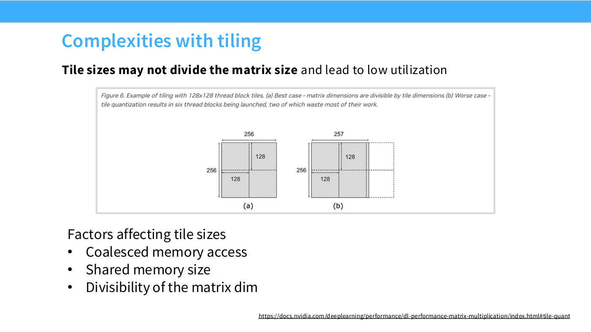

Text: "**Tile sizes may not divide the matrix size** and lead to low utilization" / "Factors affecting tile sizes", bullets: "Coalesced memory access", "Shared memory size", "Divisibility of the matrix dim"

Credit at the foot: `https://docs.nvidia.com/deeplearning/performance/dl-performance-matrix-multiplication/index.html#tile-quant`

**Figure 1 — a pasted NVIDIA documentation figure**, captioned in-image: "Figure 6. Example of tiling with 128x128 thread block tiles. (a) Best case - matrix dimensions are divisible by tile dimensions (b) Worse case - tile quantization results in six thread blocks being launched, two of which waste most of their work." Panel (a): a square labelled 256 on both axes, divided by dashed lines into a 2×2 grid of shaded 128×128 tiles — all four tiles are full and useful. Panel (b): a rectangle labelled 257 across the top and 256 down the left, divided into a 2×2 grid of shaded 128×128 tiles plus a dashed, unshaded sliver of tile space to the right (the leftover single column beyond 256), forcing a third column of thread blocks that mostly go to waste.

## Slide 44 — Complexities with tiling 2 – memory alignment


Text: "Memory comes in bursts" / "Loading tiles are fast if bursts align with the matrix" / "**Coalesced accesses may be impossible depending on the dimension of the matrix..** (have to do padding)"

(The "2" in the slide title is the section's own numbering, "...tiling 2 – memory alignment" — not a printed page number. See the corner-numeral note at the end of this file's coverage.)

Credit at the foot: `https://www.thonking.ai/p/what-shapes-do-matrix-multiplications`

**Figure 1 (top) — the same "Burst section" strip as Slide 38**, showing 16 numbered cells (0–15) grouped into four colour-coded four-cell burst sections (yellow, red, dark navy, green), here without the thread/arrow annotations.

**Figure 2 (bottom) — a hand-drawn-style comparison of "Aligned Layout" and "Unaligned Layout" for storing a small multi-field structure in memory bursts.** Left ("Aligned Layout"): four horizontal colour stripes (dark blue, green, yellow, pink) stacked to represent four fields/rows in memory, with a black-bordered box neatly enclosing exactly one burst's worth of all four stripes, captioned below "One Nice Tile 🙂" — the burst boundary lines up exactly with the data boundary. Right ("Unaligned Layout"): the same four stripes, but the data start is offset from the burst boundary, so a black-bordered burst box straddles two different underlying tiles (diagonal hatching marks the partly-covered regions, and the pink stripe overhangs into what would be a second row); two lines point from the caption "Two Bad Tiles 😦" up to the two partially-wasted tiles.

## Slide 45 — Putting it together: understanding a matrix mystery


Text: "Why is it *faster* to have bigger matrices?"

Credit at the foot: "This section is from https://www.thonking.ai/p/what-shapes-do-matrix-multiplications"

**Figure 1 — a screenshot of a tweet by Andrej Karpathy (@karpathy), verified account, timestamped 10:36 AM · Feb 3, 2023 · 1.2M Views.** Tweet text: "The most dramatic optimization to nanoGPT so far (~25% speedup) is to simply increase vocab size from 50257 to 50304 (nearest multiple of 64). This calculates added useless dimensions but goes down a different kernel path with much higher occupancy. Careful with your Powers of 2."

## Slide 46 — Matrix mystery


Text: "We understand some of this (compute intensity, tiling). Let's take a closer look.."

**Figure 1 — a scatter chart titled "FLOPs achieved for square matmuls", with hand-drawn annotations overlaid.** The y-axis is "TF/s", ticked 0, 50, 100, 150, 200, 250; the x-axis is ticked 0, 512, 1024, 1536, 2048, 2560, 3072, 3584, 4096, with no printed axis-title text on this version of the chart (an axis title appears only on the next slide's copy of this same chart). A legend box in the **bottom right** of the plot area (near x ~ 4000, low
TF/s) holds a single entry, "128", drawn as a plain grey horizontal line with no marker — this matches the faint vertical grey gridlines spaced every 128 units across the plot and is a spacing reference, not a plotted data series.

- There is **one** data series: a single-coloured (blue) cloud of scatter points giving measured TF/s for square matmuls at each size $N$ from near 0 up to 4096. Because so many closely-spaced $N$ values are plotted, the cloud resolves into several visually distinct diagonal "sawtooth" bands rather than one curve: a widest, sparsest top band climbing to roughly 250–265 TF/s by the right edge; a denser middle band that reads almost as a solid line, rising to roughly 120–155 TF/s; and the densest, lowest band, rising to roughly 75–100 TF/s. All three bands repeat the same sawtooth shape — a sharp rise followed by a partial drop — as $N$ increases.
- Hand-drawn additions (not part of the original chart): a pink arrow labelled "Compute Intensity" points from the origin up along the initial common rise of all bands at small $N$. Orange annotations reading "Tiling!" lead to **three** stacked vertical double-headed arrows marking the vertical gaps between the bands at around $N\approx2048$–2200, spanning roughly TF/s 180–195, 90–160 and 55–90. Two of the three leader lines visibly start from the word "Tiling!"; the third, feeding the topmost arrow, is a separate near-horizontal squiggle beginning in blank space to the left of the lettering at the same height. A large green ellipse circles the top band's points between roughly $N=2560$ and $N=3584$; a smaller green ellipse circles part of the middle band around $N\approx2700$–2900; and a green vertical line runs from about $N=3072$ down to the green caption "Wave Quantization" at the bottom of the chart, naming the effect behind the top band's structure.

## Slide 47 — Part 1: tiling

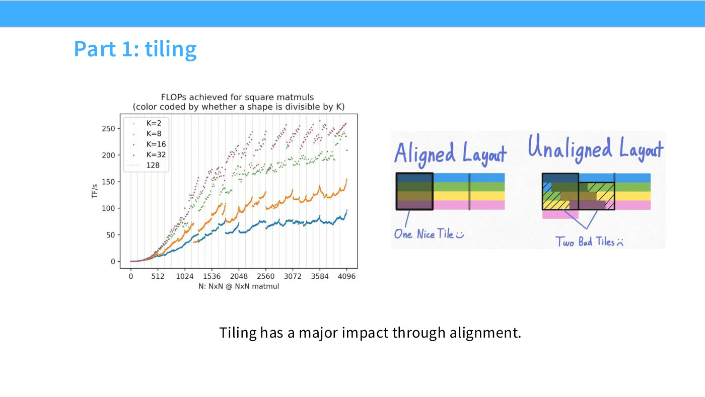

Text: "Tiling has a major impact through alignment."

**Figure 1 (left) — the "matrix mystery" scatter chart from the previous slide, now colour-coded and explained, titled "FLOPs achieved for square matmuls (color coded by whether a shape is divisible by K)".** The y-axis is "TF/s", ticked 0, 50, 100, 150, 200, 250; the x-axis is labelled "N: NxN @ NxN matmul", ticked 0, 512, 1024, 1536, 2048, 2560, 3072, 3584, 4096. The legend lists four dot colours plus one line:

- *Orange dots*, "K=2": the densest labelled band, forming a nearly solid sawtooth line — roughly 45 TF/s at $N=1024$, 75 at 1536, 95 at 2048, 115 at 2560, 130 at 3072, and about 145–155 by 4096.
- *Green dots*, "K=8": a sparser sawtooth band above the orange one — roughly 90–100 TF/s at 1024, 130–150 at 1536, 155–165 at 2048, 170–185 at 2560, 185–195 at 3072, climbing to roughly 230–240 by 4096.
- *Dark red/maroon dots*, "K=16": interleaved with, and slightly above, the K=32 band for most of the range — roughly 105–115 TF/s at 1024, 160–180 at 1536, 190–200 at 2048, 215–230 at 2560, 230–245 at 3072, reaching roughly 250–260 by 4096.
- *Slate-purple dots*, "K=32": the topmost, sparsest band — roughly 115–125 TF/s at 1024, 170–190 at 1536, 195–210 at 2048, 220–235 at 2560, 235–250 at 3072, reaching the chart's highest points, roughly 260–270, by 4096.
- *Unlabeled blue dots* (not in the legend): the densest, lowest band of all — roughly 35 TF/s at 1024, 50 at 1536, 60–65 at 2048, 65–70 at 2560, 70–75 at 3072, and about 90–95 by 4096. This is presumably $N$ not divisible even by 2 (odd $N$), left in the default plotting colour and not called out in the legend.
- *"128"* (grey line, no marker): as on the previous slide, a spacing reference for the vertical gridlines drawn every 128 units — not a plotted data series.

So the chart carries **five** visible point series (one of them unlabeled) plus one non-data reference line. Reading across the four labelled bands, higher divisibility by a larger power of two consistently reaches higher TF/s at every $N$ — the mechanism the deck is building up to explain.

**Figure 2 (right) — the same "Aligned Layout" / "Unaligned Layout" hand-drawn-style diagram as Slide 44, reused unchanged**, including its "One Nice Tile 🙂" and "Two Bad Tiles 😦" callouts, but without the source-URL credit line that accompanied it on Slide 44.

## Slide 48 — Part 2: wave quantization


Text: "What's with the periodic behavior?" / "This happens at 1792 to 1793 size." / "Why? Using a tile size of $256\times128$, there are" / "tiles. If we increase this to 1793, we have" / "tiles." / "**An A100 has 108 SMs, so it cannot execute all 120**"

$$\frac{1792}{256} \times \frac{1792}{128} = 7 \times 14 = 98$$
$$8 \times 15 = 120$$

(All of "256", "128", "7", "14", "98", "8", "15", "120", "108", "120" on this page are this equation's and the surrounding prose's own numbers — none is a printed page number.)

**Figure 1 — a small, y-axis-less inset crop of the "matrix mystery" scatter chart, zoomed to the range $N=1536$–2048.** Only the x-axis is labelled, with ticks at 1536 and 2048; there is no y-axis scale shown, just a grey border box. Two series are visible: an *orange* band (the "K=2" band from the full chart) and, below it, a *blue* band (the unlabeled baseline band). A tiny fragment of *green* dots (the "K=8" band) pokes into the top-left corner of the crop. Both the orange and blue bands show a sharp dip right around $N=1792$–1793 — a sudden vertical drop followed by a plateau — which is the "periodic behavior" the slide is explaining: this is the point where the number of thread-block tiles jumps from 98 to 120, exceeding the GPU's 108 SMs.

## Slide 49 — Recap of part 2: making ML workloads go fast


Text, a three-level nested bullet list: "Reduce memory accesses" → "Coalescing", "Fusion"; "Move memory to shared memory" → "Tiling"; "Trade memory for compute/accuracy" → "Quantization", "Recomputation"

**Figure 1 (top right) — a small reused copy of the "coalesced loads" burst-section diagram from Slide 38**, with its "When all threads of a warp execute a load instruction..." caption, shown at reduced size.

**Figure 2 (middle right) — a small reused copy of the "Tiling math" Matrix A / Matrix B / Matrix C diagram from Slide 42**, with its full legend, shown at reduced size.

**Figure 3 (bottom right) — a new diagram illustrating recomputation, contrasting a "New Fwd pass" and "New Bwd pass".** Left ("New Fwd pass"): a vertical chain $x \to$ sigmoid $\to$ sigmoid $\to$ sigmoid $\to$ out, each box in plain grey with a downward arrow to the next. Right ("New Bwd pass"): the same three-sigmoid chain in blue, again taking $x$ as input, but now each of the three sigmoid boxes also sends a diagonal arrow rightward into a box labelled "Original Backward graph", which itself receives "dout" from below and outputs "dx" above. This illustrates recomputation: the forward sigmoids are recomputed during the backward pass and fed into the original backward graph rather than being stored from the first forward pass.

## Slide 50 — Part 3: Using what we know to understand Flash Attention

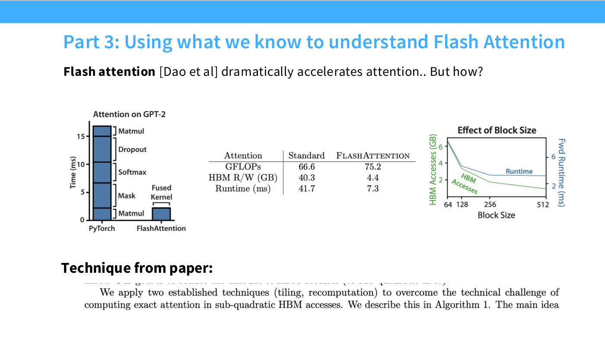

Text: "**Flash attention** [Dao et al] dramatically accelerates attention.. But how?" / "**Technique from paper:**" followed by a pasted paragraph from the FlashAttention paper.

The pasted paper excerpt has two lines. The first line is largely occluded by the bold "Technique from paper:" heading printed on top of it; only fragments peek out from under the heading, reading approximately "...Our goal is to reduce the amount of HBM accesses (to sub-quadratic in N)." — this cannot be fully confirmed because the heading physically overlaps the text, not because of image resolution. The second, unobscured line reads: "We apply two established techniques (tiling, recomputation) to overcome the technical challenge of computing exact attention in sub-quadratic HBM accesses. We describe this in Algorithm 1. The main idea" — the sentence is cut off there because the pasted paragraph image is clipped by the bottom of the slide.

**Figure 1 (left) — a stacked bar chart titled "Attention on GPT-2".** The y-axis is "Time (ms)", ticked 0, 5, 10, 15; the x-axis has two categories, "PyTorch" and "FlashAttention". The PyTorch bar is divided into five stacked segments (all the same blue fill, separated by bracket labels), bottom to top: "Matmul" (~0–2 ms), "Mask" (~2–6.5 ms), "Softmax" (~6.5–10.5 ms), "Dropout" (~10.5–15.5 ms), "Matmul" (~15.5–17 ms), for a total of about 17 ms. The FlashAttention bar is a single blue segment about 2 ms tall, bracketed and labelled "Fused Kernel".

**Figure 2 (middle) — a table comparing "Standard" and "FlashAttention" attention.** Rows: "GFLOPs" (Standard 66.6, FlashAttention 75.2), "HBM R/W (GB)" (Standard 40.3, FlashAttention 4.4), "Runtime (ms)" (Standard 41.7, FlashAttention 7.3).

**Figure 3 (right) — a dual-axis line chart titled "Effect of Block Size".** The x-axis is "Block Size", ticked 64, 128, 256, 512. The left y-axis, in green, is "HBM Accesses (GB)", ticked 2, 4, 6; the right y-axis, in blue, is "Fwd Runtime (ms)", ticked 2, 6. There are **two** series:
- *Green*, "HBM Accesses": starts at about 6.7 GB at block size 64, drops sharply to about 3.2 GB at 128, then declines more gradually to about 1.8 GB at 256 and about 1.1 GB at 512.
- *Blue*, "Runtime": starts at about 6.7 ms at block size 64 (visually overlapping the green line's start), drops to about 3.6 ms at 128, about 2.6 ms at 256, and levels off at about 2.5 ms at 512.

## Slide 51 — Recap of attention computation

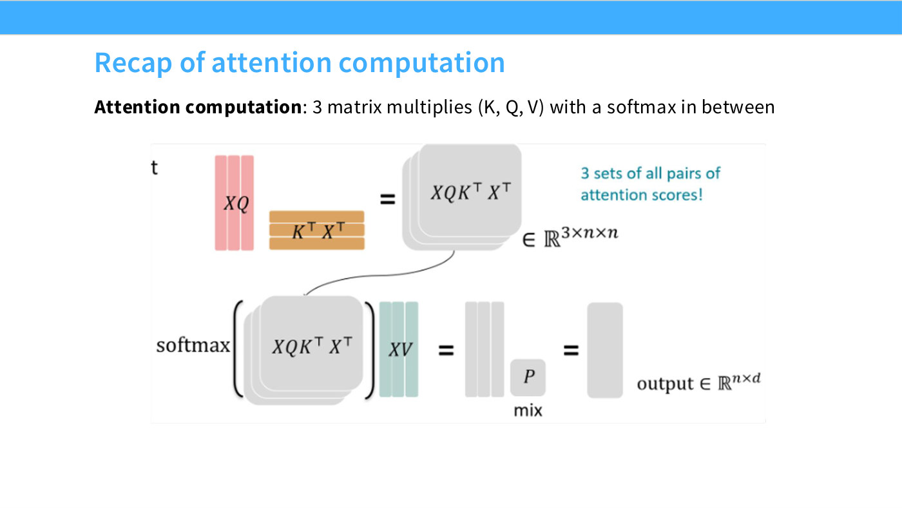

Text: "**Attention computation**: 3 matrix multiplies (K, Q, V) with a softmax in between"

**Figure 1 — a labelled block diagram of the attention computation as batched matrix multiplies.** At the top left, a single letter "t" labels the diagram. Below it, a pink block of three side-by-side vertical bars is labelled "$XQ$"; to its right, a tan/orange block of three stacked horizontal bars is labelled "$K^\top X^\top$". These feed (via an "=") into a grey, depth-stacked block of three overlapping rounded squares labelled "$XQK^\top X^\top$", annotated to the right "$\in \mathbb{R}^{3\times n\times n}$" with a teal caption "3 sets of all pairs of attention scores!"

Below, a black curved arrow carries this stacked result down into a second row: "softmax(" wraps the same grey depth-stacked "$XQK^\top X^\top$" block ")", multiplied by a teal block of three vertical bars labelled "$XV$", equals a grey block of vertical bars feeding into a small box labelled "$P$" with the sub-label "mix" underneath it, which in turn equals a single grey vertical bar labelled "output $\in \mathbb{R}^{n\times d}$".

## Slide 52 — Tiling part 1: tiling for the KQV matrix multiply


Text: "This figure 1 from the paper is literally just tiling for a KQV matrix multiply.." / "**But what do we do about the softmax?**"

(The "1" found by the text-layer scan on this page is simply the "1" in "figure 1" in that sentence — not a page number.)

**Figure 1 (left) — a pyramid diagram, "Memory Hierarchy with Bandwidth & Memory Size".** Three stacked triangular bands, narrowest at top: orange "GPU SRAM" (labelled "SRAM: 19 TB/s (20 MB)"), green "GPU HBM" (labelled "HBM: 1.5 TB/s (40 GB)"), and teal "Main Memory (CPU DRAM)" (labelled "DRAM: 12.8 GB/s (>1 TB)") forming the wide base.

**Figure 2 (right) — the FlashAttention paper's own tiling diagram, labelled "FlashAttention" at the bottom.** At top, a green row of blocks labelled "$K^\top: d\times N$" with a red "Outer Loop" arrow above it; a black arrow labelled "Copy Block to SRAM" runs down from it through an orange square into a large dashed rectangle. To the left, a green column labelled "$Q: N\times d$" with a blue "Inner Loop" arrow, feeding through an orange "Copy" square into the dashed rectangle, which contains "$QK^\top: N\times N$" and, inside it, a smaller dashed box labelled "Compute Block on SRAM" (in purple text) with a second red "Outer Loop" arrow above. To the right, a green column labelled "$V: N\times d$" with its own red "Outer Loop" arrow and blue "Inner Loop" arrow, feeding through an orange "Copy" square (arrow pointing left into the dashed rectangle) via a dashed purple connector. A black arrow labelled "Output to HBM" runs from the dashed rectangle down to a green row at the bottom labelled "$sm(QK^\top)V: N\times d$", under a blue "Inner Loop" arrow.

## Slide 53 — Tiling part 2: incremental computation of the softmax


Text: "From Mikailov and Gimelshein 2018," / "**Normal softmax**" / "All major DL frameworks are using this safe version for the Softmax computation: TensorFlow" / "**Online softmax**" / "To keep track of the max, incrementally update the max, and set up a telescoping sum" / "**This lets you compute the softmax tile-by-tile**"

$$y_i = \frac{e^{x_i - \max_{k=1}^{V} x_k}}{\sum_{j=1}^{V} e^{x_j - \max_{k=1}^{V} x_k}} \qquad (2)$$

**Figure 1 (left) — "Algorithm 2 Safe softmax", a pasted pseudocode box:**
1: $m_0 \leftarrow -\infty$
2: **for** $k \leftarrow 1, V$ **do**
3: $\quad m_k \leftarrow \max(m_{k-1}, x_k)$
4: **end for**
5: $d_0 \leftarrow 0$
6: **for** $j \leftarrow 1, V$ **do**
7: $\quad d_j \leftarrow d_{j-1} + e^{x_j - m_V}$
8: **end for**
9: **for** $i \leftarrow 1, V$ **do**
10: $\quad y_i \leftarrow \dfrac{e^{x_i - m_V}}{d_V}$
11: **end for**

**Figure 2 (right) — "Algorithm 3 Safe softmax with online normalizer calculation", a pasted pseudocode box:**
1: $m_0 \leftarrow -\infty$
2: $d_0 \leftarrow 0$
3: **for** $j \leftarrow 1, V$ **do**
4: $\quad m_j \leftarrow \max(m_{j-1}, x_j)$
5: $\quad d_j \leftarrow d_{j-1}\times e^{m_{j-1}-m_j} + e^{x_j - m_j}$
6: **end for**
7: **for** $i \leftarrow 1, V$ **do**
8: $\quad y_i \leftarrow \dfrac{e^{x_i - m_V}}{d_V}$
9: **end for**

The two algorithms compute the same normal-softmax formula above, but Algorithm 3 folds the running-max update into a single pass over $j$ (updating $d_j$ by rescaling the previous accumulator by $e^{m_{j-1}-m_j}$ each time the running max changes), instead of Algorithm 2's separate max pass followed by a separate sum pass — this single-pass, incrementally-rescaled form is what makes tile-by-tile softmax computation possible.

## Slide 54 — Putting it all together – the forward pass of flash attention


Text: "From Dao 2023, we see" bullets: "Tile-wise computation of the inner products, $(S)$", "Fusion of the exponential operator", "Tile-wise computation of the softmax via the online, telescoping sum trick" / "(We won't cover the backward pass – but they recompute tile-by-tile..)"

**Figure 1 — a worked two-tile numerical trace of the FlashAttention forward pass, with a legend distinguishing "Stored in HBM" (solid light-blue boxes) from "Computed in SRAM (not materialized in HBM)" (dashed orange boxes).** Top row: two solid blue boxes, $(K^{(1)})^\top$ and $(K^{(2)})^\top$, each with a downward arrow into a dashed orange box below it. Second row: a solid blue box $Q$ on the left with an arrow into the two dashed orange boxes $S^{(1)} = Q(K^{(1)})^\top$ and $S^{(2)} = Q(K^{(2)})^\top$. Third row: two more dashed orange boxes, $A^{(1)} = \exp(S^{(1)})$ and $A^{(2)} = \exp(S^{(2)})$, each with a downward arrow from the $S$ box above it. Below these, in red and blue text respectively:

$$l^{(1)} = \sum_i \exp(S^{(1)})_i \qquad l^{(2)} = l^{(1)} + \sum_i \exp(S^{(2)})_i$$

To the right, two solid blue boxes $V^{(1)}$ and $V^{(2)}$ stacked vertically, multiplied ($\cdot$) into a solid blue "Output" box containing:

$$O^{(1)} = \frac{A^{(1)}}{l^{(1)}} \cdot V^{(1)}$$
$$O^{(2)} = \frac{l^{(1)}}{l^{(2)}} O^{(1)} + \frac{A^{(2)}}{l^{(2)}} \cdot V^{(2)}$$

A grey arrow points from the $\frac{l^{(1)}}{l^{(2)}}$ term in the $O^{(2)}$ line to a caption reading "Rescaling to correct denominator" — marking that term as the correction factor that turns the tile-1-only estimate $O^{(1)}$ into a running estimate correctly normalized by the combined denominator $l^{(2)}$.

## Slide 55 — Recap for the whole lecture

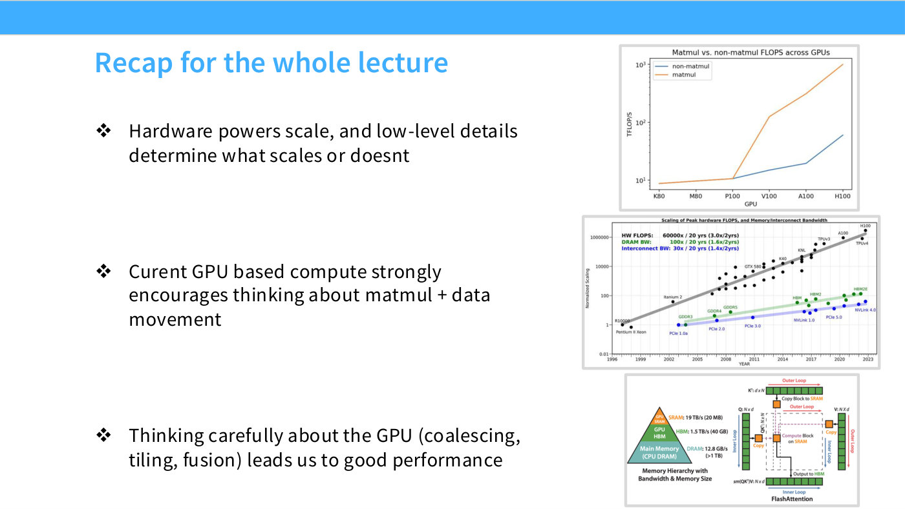

Text, three top-level bullets: "Hardware powers scale, and low-level details determine what scales or doesnt" / "Curent GPU based compute strongly encourages thinking about matmul + data movement" / "Thinking carefully about the GPU (coalescing, tiling, fusion) leads us to good performance"

**Figure 1 (top right) — a line chart titled "Matmul vs. non-matmul FLOPS across GPUs".** The y-axis is "TFLOP/S" on a log scale, ticked $10^1, 10^2, 10^3$; the x-axis is "GPU", with six categories in order: K80, M80, P100, V100, A100, H100. There are **two** series:
- *Orange*, "matmul": about 9 at K80, 9.5 at M80, 11 at P100, then a steep jump to about 125 at V100, about 310 at A100, and about 1000 ($10^3$) at H100.
- *Blue*, "non-matmul": about 8.5 at K80, 9 at M80, 10.5 at P100, rising only modestly to about 15 at V100, about 20 at A100, and about 55–60 at H100.

Both series track closely together through P100, then diverge sharply — matmul throughput scales far faster across GPU generations than non-matmul (elementwise/softmax/etc.) throughput.

**Figure 2 (middle right) — a scatter-and-trend-line chart titled "Scaling of Peak hardware FLOPS, and Memory/Interconnect Bandwidth".** The y-axis is "Normalized Scaling" on a log scale, ticked 0.01, 1, 100, 10000, 1000000; the x-axis is "YEAR", ticked 1996, 1999, 2002, 2005, 2008, 2011, 2014, 2017, 2020, 2023. A text box in the upper left states the three trend rates: "**HW FLOPS:** 60000x / 20 yrs (3.0x/2yrs)" (black/grey), "**DRAM BW:** 100x / 20 yrs (1.6x/2yrs)" (green), "**Interconnect BW:** 30x / 20 yrs (1.4x/2yrs)" (blue). There are **three** series:
- *Black/grey dots with a grey trend line*, hardware peak FLOPS: individually labelled points rising from "Pentium II Xeon" and "R10000" (~1996, normalized scaling ≈1) through "Itanium 2" (~2002), a dense cluster of unlabelled points through the mid-2000s to mid-2010s, "GTX 580", "K40", "KNL", "TPUv3" (~2018), up to "A100" (~2020) and "H100" (~2023, the topmost point, ≈1,000,000) with "TPUv4" plotted just below H100.
- *Green dots with a green trend line*, DRAM bandwidth generations: "GDDR3" (~2004), "GDDR4" (~2007), "GDDR5" (~2009), "HBM" (~2016), "HBM2" (~2017), "HBM2E" (~2021), rising much more gradually than the FLOPS line.
- *Blue dots with a blue trend line*, interconnect bandwidth generations: "PCIe 1.0a" (~2004), "PCIe 2.0" (~2007), "PCIe 3.0" (~2011), "NVLink 1.0" (~2016), "PCIe 5.0" (~2019), "NVLink 4.0" (~2022), the shallowest-rising of the three trends.

The widening vertical gap between the black/grey FLOPS line and the green/blue bandwidth lines over time is the chart's point: compute has scaled far faster than the memory and interconnect bandwidth needed to feed it.

**Figure 3 (bottom right) — a small reused copy of the memory-hierarchy pyramid and FlashAttention tiling diagram from Slide 52**, shown at reduced size with the same labels ("SRAM: 19 TB/s (20 MB)", "HBM: 1.5 TB/s (40 GB)", "DRAM: 12.8 GB/s (>1 TB)"; "Outer Loop" / "Inner Loop" / "Copy" / "Compute Block on SRAM" / "Output to HBM").
