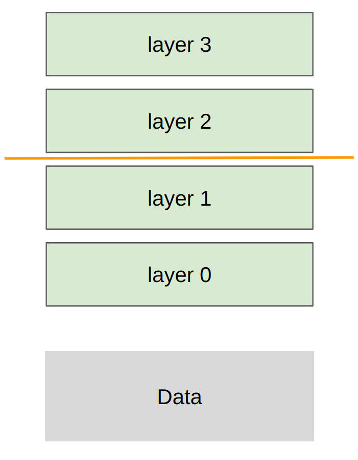

# Lecture 7 — Parallelism (course material)

This is the written content of CS336 Lecture 7, transcribed from
[`lecture_07.py`](https://github.com/stanford-cs336/lectures/blob/main/lecture_07.py).
Run it, or step through it in the browser, at
<https://cs336.stanford.edu/lectures/?trace=lecture_07>.

Lectures 5 and 6 made **one** GPU go fast — the hardware, then the kernels. This
lecture crosses the chip boundary. It has a two-part shape that the source states
explicitly: first the *building blocks* of distributed computation (the collective
operations, the interconnect hardware that carries them, NCCL, `torch.distributed`,
and a measurement of what bandwidth you actually get), and then *distributed
training*, in which deep MLPs are cut up three ways — along the batch (data
parallelism), along the width (tensor parallelism), and along the depth (pipeline
parallelism).

A structural note that matters when reading the program: this lecture really does
launch multiple processes, so it cannot be traced the way earlier lectures were.
`spawn()` (lines 577–592) checks `sys.gettrace()` and, when traced, runs the
function directly in a single process with every `torch.distributed` call replaced
by a no-op. Stepping through the lecture in the browser therefore shows the code
without any communication actually happening. The real output comes from running
it directly, which is why the course publishes the stdout separately.

The spoken lecture follows this program closely but not exactly — Percy digresses,
answers questions, and expands on points that the source states in one line. For
what was *said*, see [the transcript](../transcripts/07-parallelism.md). For what
was *written*, use this file.

## Sections → source lines

| Section | Function | Lines |
| --- | --- | --- |
| [Framing: from one GPU to many](#framing-from-one-gpu-to-many) | `main()` | 20–43 |
| [Roadmap](#roadmap) | `main()` | 45–56 |
| [What's missing](#whats-missing) | `main()` | 58–64 |
| [Summary](#summary) | `main()` | 66–73 |
| [Collective operations — setup](#collective-operations--setup) | `collective_operations()` | 76–89 |
| [Broadcast](#broadcast) | `collective_operations()` | 91–103 |
| [Scatter](#scatter) | `collective_operations()` | 105–115 |
| [Gather](#gather) | `collective_operations()` | 117–127 |
| [Reduce](#reduce) | `collective_operations()` | 129–140 |
| [All-gather](#all-gather) | `collective_operations()` | 142–154 |
| [Reduce-scatter](#reduce-scatter) | `collective_operations()` | 156–170 |
| [All-reduce](#all-reduce) | `collective_operations()` | 172–187 |
| [All-to-all](#all-to-all) | `collective_operations()` | 189–201 |
| [Remembering the terminology](#remembering-the-terminology) | `collective_operations()` | 203–206 |
| [Hardware: how GPUs are connected](#hardware-how-gpus-are-connected) | `hardware()` | 209–223 |
| [Bypassing the CPU](#bypassing-the-cpu) | `hardware()` | 225–227 |
| [Advancements](#advancements) | `hardware()` | 229–230 |
| [NCCL](#nccl) | `hardware()` | 232–236 |
| [torch.distributed](#torchdistributed) | `torch_distributed()` | 239–247 |
| [Collectives in PyTorch, for real](#collectives-in-pytorch-for-real) | `collective_operations_main()` | 249–285 |
| [Benchmarking collectives](#benchmarking-collectives) | `benchmarking()` | 287–299 |
| [Benchmarking all-reduce](#benchmarking-all-reduce) | `all_reduce()` | 301–336 |
| [Benchmarking reduce-scatter](#benchmarking-reduce-scatter) | `reduce_scatter()` | 338–372 |
| [Data parallelism](#data-parallelism) | `data_parallelism()` | 375–394 |
| [Data parallelism — implementation](#data-parallelism--implementation) | `data_parallelism_main()` | 397–436 |
| [Tensor parallelism](#tensor-parallelism) | `tensor_parallelism()` | 439–445 |
| [Tensor parallelism — implementation](#tensor-parallelism--implementation) | `tensor_parallelism_main()` | 447–481 |
| [Pipeline parallelism](#pipeline-parallelism) | `pipeline_parallelism()` | 484–490 |
| [Pipeline parallelism — implementation](#pipeline-parallelism--implementation) | `pipeline_parallelism_main()` | 492–537 |
| [Process-group setup and teardown](#process-group-setup-and-teardown) | `setup()`, `cleanup()` | 540–554 |
| [How the lecture fakes multiprocessing when traced](#how-the-lecture-fakes-multiprocessing-when-traced) | `DisableDistributed`, `spawn()` | 556–592 |
| [Helpers](#helpers) | `get_init_params()` … `render_duration()` | 594–616 |

The top-level structure, from `main()`:

```python
def main():
    text("# Lecture 7: parallelism")
    ...
    text("### Part 1: building blocks of distributed communication/computation")
    collective_operations()    # Programming model
    hardware()                 # Hardware: how GPUs are connected
    torch_distributed()        # How this is implemented in NCCL/PyTorch
    benchmarking()             # Measure actual NCCL bandwidth

    text("### Part 2: distributed training")
    data_parallelism()         # Cut up along the batch dimension
    tensor_parallelism()       # Cut up along the width dimension
    pipeline_parallelism()     # Cut up along the depth dimension
```

---

## Framing: from one GPU to many

Last week: parallelism within a single GPU. This week: parallelism across multiple
GPUs.

*Figure: `images/gpu-node-overview.png` (width 700).*


*One node: four GPUs, each with four streaming multiprocessors (a register file and L1/shared memory apiece) over an L2 cache and its own HBM. Each GPU meets an NVSwitch over NVLink, and the switch leaves the node over InfiniBand or Ethernet. The file is a screen capture and carries a stray "To exit full screen, press Esc" browser banner across the top. Source: [`images/gpu-node-overview.png`](https://github.com/stanford-cs336/lectures/blob/main/images/gpu-node-overview.png) in the lectures repo.*

In both cases, **compute** (arithmetic logic units) is far from inputs/outputs
(**data**).

Unifying theme: orchestrate computation to avoid data transfer bottlenecks.

Generalized hierarchy:

- Single node, single GPU: L1 cache / shared memory (fastest)
- Single node, single GPU: HBM
- Single node, multi-GPU: NVLink/NVSwitch
- Multi-node, multi-GPU: Infiniband/Ethernet (slowest)

Last week: reduce memory accesses via fusion/tiling. This week: reduce
communication across GPUs/nodes via replication/sharding.

**Why do multi-GPU?**

1. Your parameters (optimizer state + gradients + activations) don't fit on a
   single GPU.
2. You want to use more GPUs (more FLOPs) to train faster.

A source comment (lines 41–42) explains the execution caveat: when you execute this
lecture directly (`python lecture_07.py`), it uses multiprocessing, which produces
output from each process. However, when you trace this lecture
(`python -m edtrace.execute -m lecture_07`), multiprocessing is turned off. The
lecture links its own recorded standard output at `var/traces/lecture_07_stdout.txt`.

---

## Roadmap

### Part 1: building blocks of distributed communication/computation

- `collective_operations()` — programming model
- `hardware()` — how GPUs are connected
- `torch_distributed()` — how this is implemented in NCCL/PyTorch
- `benchmarking()` — measure actual NCCL bandwidth

### Part 2: distributed training

Walk through bare-bones implementations of each strategy on deep MLPs. Recall that
MLPs are the compute bottleneck in Transformers, so this is representative.

- `data_parallelism()` — cut up along the batch dimension
- `tensor_parallelism()` — cut up along the width dimension
- `pipeline_parallelism()` — cut up along the depth dimension

---

## What's missing

The source lists what this lecture does *not* cover (lines 58–64):

- Communication/computation overlap
- More general models (with attention, etc.)
- Other forms of parallelism (e.g., sequence parallelism, expert parallelism,
  combinations)
- Jax/TPUs: just define the model, the sharding strategy, and the Jax compiler
  handles the rest — linked to
  [levanter](https://crfm.stanford.edu/2023/06/16/levanter-1_0-release.html)
- But we're doing PyTorch so you can see how one builds up from the primitives

---

## Summary

The source's own closing summary (lines 66–73):

- Many ways to parallelize: data (batch), tensor/expert (width), pipeline (depth),
  sequence (length)
- Data parallelism: DDP (all-reduce), FSDP/ZeRO (all-gather + reduce-scatter)
- Tensor parallelism: requires very fast interconnects (e.g., NVLink)
- Pipeline parallelism: can work with slow interconnects, but need to work to
  reduce pipeline bubbles
- Can **re-compute** or store in **memory** or store in another GPUs memory and
  **communicate**
- Hardware is getting faster, but will always want bigger models, so will have this
  hierarchical structure

---

## Collective operations — setup

**Collective operations** are the conceptual primitives used for distributed
programming
([Wikipedia: collective operation](https://en.wikipedia.org/wiki/Collective_operation)).

- These are classic in the parallel programming literature from the 1980s.
- *Collective* means that you specify a general communication pattern across many
  devices.
- This can be better/faster than managing point-to-point communication yourself.

**Setup**:

*Figure: `images/ranks.png` (width 500).*

- **Rank**: a particular device/GPU (e.g., 0, 1, 2, 3)
- **World size**: total number of devices (e.g., 4)

Operations:

- Broadcast, scatter, gather, reduce (foundations)
- All-gather, reduce-scatter, all-reduce (workhorse)
- All-to-all (for MoEs)

Each operation below is stated in the source as an explicit input/output listing
across four ranks. Those listings are reproduced verbatim.

---

## Broadcast

**Broadcast**: copy from rank 0 to all ranks.

```python
# Input
rank0 = tensor([0., 1, 2, 3])

# Output
rank0 = tensor([0., 1, 2, 3])
rank1 = tensor([0., 1, 2, 3])
rank2 = tensor([0., 1, 2, 3])
rank3 = tensor([0., 1, 2, 3])
```

Minor use case: rank 0 loads initial checkpoint and broadcasts to all ranks.

---

## Scatter

**Scatter** tensor on rank 0 to all ranks.

```python
# Input
rank0 = tensor([0., 1, 2, 3])

# Output
rank0 = tensor([0.])
rank1 = tensor([1.])
rank2 = tensor([2.])
rank3 = tensor([3.])
```

Note: stepping stone to understanding reduce-scatter.

---

## Gather

**Gather** pieces from all ranks to rank 0 (opposite of scatter).

```python
# Input
rank0 = tensor([0.])
rank1 = tensor([1.])
rank2 = tensor([2.])
rank3 = tensor([3.])

# Output
rank0 = tensor([0., 1, 2, 3])
```

Note: stepping stone to understanding all-gather.

---

## Reduce

**Reduce** pieces from all ranks to rank 0, applying some operation (e.g., sum,
min, max).

```python
# Input
rank0 = tensor([0.])
rank1 = tensor([1.])
rank2 = tensor([2.])
rank3 = tensor([3.])

# Output
rank0 = tensor([6.])  # Sum of all ranks (0 + 1 + 2 + 3)
```

Note: stepping stone to understanding all-reduce.

---

## All-gather

**All-gather**: perform gather to all ranks, not just rank 0.

```python
# Input
rank0 = tensor([0.])
rank1 = tensor([1.])
rank2 = tensor([2.])
rank3 = tensor([3.])

# Output
rank0 = tensor([0., 1, 2, 3])
rank1 = tensor([0., 1, 2, 3])
rank2 = tensor([0., 1, 2, 3])
rank3 = tensor([0., 1, 2, 3])
```

Use case: each rank holds parameter shard, gather to get full parameters for
forward pass.

---

## Reduce-scatter

**Reduce-scatter**: perform reduce on each dimension, scatter results.

```python
# Input
rank0 = tensor([0., 1, 2, 3])
rank1 = tensor([1., 2, 3, 4])
rank2 = tensor([2., 3, 4, 5])
rank3 = tensor([3., 4, 5, 6])

# Output
rank0 = tensor([6.])  # Sum along dim 0 (0 + 1 + 2 + 3)
rank1 = tensor([10.]) # Sum along dim 1 (1 + 2 + 3 + 4)
rank2 = tensor([14.]) # Sum along dim 2 (2 + 3 + 4 + 5)
rank3 = tensor([18.]) # Sum along dim 3 (3 + 4 + 5 + 6)
```

Use case: after backward pass, sum gradients from different data shards, but
distribute storage.

---

## All-reduce

**All-reduce** = reduce-scatter + all-gather.

```python
# Input
rank0 = tensor([0., 1, 2, 3])
rank1 = tensor([1., 2, 3, 4])
rank2 = tensor([2., 3, 4, 5])
rank3 = tensor([3., 4, 5, 6])

# Output
rank0 = tensor([6., 10, 14, 18])
rank1 = tensor([6., 10, 14, 18])
rank2 = tensor([6., 10, 14, 18])
rank3 = tensor([6., 10, 14, 18])
```

Use case: after backward pass, sum gradients from different data shards, but
replicate full parameters.

Breaking all-reduce into reduce-scatter + all-gather allows for flexibility (e.g.,
ZeRO/FSDP).

---

## All-to-all

**All-to-all**: each rank sends each other rank some tensor (most general).

```python
# Input
rank0 = tensor([0., 1, 2, 3])      # send  0 to rank 0,  1 to rank 1,  2 to rank 2,  3 to rank 3
rank1 = tensor([4., 5, 6, 7])      # send  4 to rank 0,  5 to rank 1,  6 to rank 2,  7 to rank 3
rank2 = tensor([8., 9, 10, 11])    # send  8 to rank 0,  9 to rank 1, 10 to rank 2, 11 to rank 3
rank3 = tensor([12., 13, 14, 15])  # send 12 to rank 0, 13 to rank 1, 14 to rank 2, 15 to rank 3

# Output
rank0 = tensor([0, 4, 8, 12])
rank1 = tensor([1, 5, 9, 13])
rank2 = tensor([2, 6, 10, 14])
rank3 = tensor([3, 7, 11, 15])
```

Notes:

- Useful for MoEs: each rank has split of data and subset of experts; need to route
  data to experts
- For balanced splits, all-to-all looks like transpose
- Also handles unbalanced splits (but want splits to be as balanced as possible)

---

## Remembering the terminology

Way to remember the terminology:

- Reduce: performs some associative/commutative operation (sum, min, max)
- Scatter is inverse of gather
- All: means destination is all devices

---

## Hardware: how GPUs are connected

**Classic (in the home):**

*Figure: `https://media.springernature.com/lw685/springer-static/image/art%3A10.1186%2Fs42774-021-00098-3/MediaObjects/42774_2021_98_Fig1_HTML.png?as=webp` (width 500).*

- GPUs on same node communicate via a PCI(e) bus (v7.0, 16 lanes => 242 GB/s)
  ([Wikipedia: PCI Express](https://en.wikipedia.org/wiki/PCI_Express))
- GPUs on different nodes communicate via Ethernet (~200 MB/s)

**Modern (in the data center):**

*Figure: `images/gpu-node-overview.png` (width 700).*

Typical setup:

- 8 GPUs per node, connected by NVLink to an NVSwitch (B200s' NVLink 5.0 gets
  1.8 TB/s; HBM was 8 TB/s)
- 256 nodes per pod, connected by Infiniband (via PCIe -> HCA / Infiniband NIC ->
  Infiniband cable) (~0.05 TB/s)
- N pods per cluster / datacenter, connected by Ethernet (via PCIe -> CPU)

These four figures are written constants in the source, and together they are the
lecture's quantitative case for the whole hierarchy: HBM at 8 TB/s, NVLink at
1.8 TB/s, Infiniband at ~0.05 TB/s, Ethernet at ~200 MB/s. Each step outward costs
roughly an order of magnitude.

---

## Bypassing the CPU

- Ethernet requires passing through the CPU (copying data to kernel socket buffer,
  build TCP packets, copy to NIC ring buffer)
- Remote Direct Memory Access (RDMA): allows one GPU to directly read/write another
  GPU's memory without involving the CPU
- Infiniband supports RDMA, but standard Ethernet does not

---

## Advancements

- GB200/GB300 NVL72: 8 GPUs per tray, 9 trays per rack -> 72 GPUs in one NVLink
  domain
- RDMA over Converged Ethernet (RoCE): Ethernet bypasses CPU, similar but
  cheaper/weaker than Infiniband, used by Meta

---

## NCCL

### NVIDIA Collective Communication Library (NCCL)

NCCL translates collective operations into low-level packets that are sent between
GPUs
([talk](https://www.nvidia.com/en-us/on-demand/session/gtcspring21-s31880/)).

- Detects topology of hardware (e.g., number of nodes, switches, NVLink/PCIe)
- Optimizes the path between GPUs
- Launches GPU kernels to send/receive data

---

## torch.distributed

PyTorch distributed library (`torch.distributed`)
([documentation](https://pytorch.org/docs/stable/distributed.html)).

- Provides clean interface for collective operations (e.g., `all_gather_into_tensor`)
- Supports multiple backends for different hardware: gloo (CPU), nccl (GPU)
- Also supports higher-level algorithms (e.g., `FullyShardedDataParallel`) [not used
  in this course]

Let's walk through some examples: `spawn(collective_operations_main, world_size=4)`.

---

## Collectives in PyTorch, for real

`collective_operations_main(rank, world_size)` (lines 249–285) runs asynchronously
for each process (rank = 0, …, world_size − 1) and demonstrates the identity
all-reduce = reduce-scatter + all-gather on real tensors.

**All-reduce.** `dist.barrier()` waits for all processes to get to this point (in
this case, for print statements).

```python
data = tensor([0., 1, 2, 3], device=cuda_if_available(rank)) + rank  # Both input and output

print(f"Rank {rank} [before all-reduce]: {data}", flush=True)
dist.all_reduce(tensor=data, op=dist.ReduceOp.SUM, async_op=False)  # Modifies tensor in place
print(f"Rank {rank} [after all-reduce]: {data}", flush=True)
```

**Reduce-scatter.**

```python
input = torch.arange(world_size, dtype=torch.float32, device=cuda_if_available(rank)) + rank  # Input
output = torch.empty(1, device=cuda_if_available(rank))  # Allocate output

dist.reduce_scatter_tensor(output=output, input=input, op=dist.ReduceOp.SUM, async_op=False)
```

**All-gather.** The input is the output of reduce-scatter:

```python
input = output  # Input is the output of reduce-scatter
output = torch.empty(world_size, device=cuda_if_available(rank))  # Allocate output

dist.all_gather_into_tensor(output_tensor=output, input_tensor=input, async_op=False)
```

The source's conclusion, printed after the all-gather: *"Indeed, all-reduce =
reduce-scatter + all-gather!"*

**What the recorded run printed** (recorded run — see the front matter; ordering
across ranks is nondeterministic and has been sorted here for readability):

```
Rank 0 [before all-reduce]: tensor([0., 1., 2., 3.], device='cuda:0')
Rank 1 [before all-reduce]: tensor([1., 2., 3., 4.], device='cuda:1')
Rank 2 [before all-reduce]: tensor([2., 3., 4., 5.], device='cuda:2')
Rank 3 [before all-reduce]: tensor([3., 4., 5., 6.], device='cuda:3')
Rank 0 [after all-reduce]: tensor([ 6., 10., 14., 18.], device='cuda:0')
Rank 1 [after all-reduce]: tensor([ 6., 10., 14., 18.], device='cuda:1')
Rank 2 [after all-reduce]: tensor([ 6., 10., 14., 18.], device='cuda:2')
Rank 3 [after all-reduce]: tensor([ 6., 10., 14., 18.], device='cuda:3')

Rank 0 [after reduce-scatter]: input = tensor([0., 1., 2., 3.]), output = tensor([6.])
Rank 1 [after reduce-scatter]: input = tensor([1., 2., 3., 4.]), output = tensor([10.])
Rank 2 [after reduce-scatter]: input = tensor([2., 3., 4., 5.]), output = tensor([14.])
Rank 3 [after reduce-scatter]: input = tensor([3., 4., 5., 6.]), output = tensor([18.])

Rank 0 [after all-gather]: input = tensor([6.]),  output = tensor([ 6., 10., 14., 18.])
Rank 1 [after all-gather]: input = tensor([10.]), output = tensor([ 6., 10., 14., 18.])
Rank 2 [after all-gather]: input = tensor([14.]), output = tensor([ 6., 10., 14., 18.])
Rank 3 [after all-gather]: input = tensor([18.]), output = tensor([ 6., 10., 14., 18.])
```

This reproduces exactly the abstract input/output listings given earlier for
all-reduce, reduce-scatter and all-gather: the same `[0,1,2,3] … [3,4,5,6]` inputs,
the same `6, 10, 14, 18` reduction, and the reduce-scatter outputs feeding the
all-gather to give back the all-reduce result.

One detail visible only in the recorded run: the `torch.empty` output buffers hold
uninitialized memory before the collective fills them, so the "before all-gather"
lines print leftover contents rather than zeros — on rank 0,
`output = tensor([0., 10., 14., 18.])` before the all-gather has run.

---

## Benchmarking collectives

How fast does communication happen?

```python
# All-reduce
spawn(all_reduce, world_size=4, num_elements=100 * 1024**2)

# Reduce-scatter
spawn(reduce_scatter, world_size=4, num_elements=100 * 1024**2)
```

`num_elements = 100 * 1024**2 = 104,857,600` elements (computed), which in float32
is 419,430,400 bytes = 400 MiB per tensor (computed).

References given in the source:

- [How to reason about collective operations](https://github.com/NVIDIA/nccl-tests/blob/master/doc/PERFORMANCE.md#allreduce)
- [Sample benchmarking code](https://github.com/stas00/ml-engineering/blob/master/network/benchmarks/all_reduce_bench.py)

---

## Benchmarking all-reduce

`all_reduce(rank, world_size, num_elements)` (lines 301–336). The harness has the
same shape as Lecture 6's single-GPU benchmarking — warm up, then time — with one
addition that only distributed code needs: a `dist.barrier()` alongside the
`torch.cuda.synchronize()`, so the clock is not stopped while another rank is still
working.

```python
# Create tensor
data = torch.randn(num_elements, device=cuda_if_available(rank))

# Warmup
dist.all_reduce(tensor=data, op=dist.ReduceOp.SUM, async_op=False)
torch.cuda.synchronize()  # Wait for CUDA kernels to finish
dist.barrier()            # Wait for all the processes to get here

# Perform all-reduce
start_time = time.time()
dist.all_reduce(tensor=data, op=dist.ReduceOp.SUM, async_op=False)
torch.cuda.synchronize()  # Wait for CUDA kernels to finish
dist.barrier()            # Wait for all the processes to get here
end_time = time.time()
```

The effective-bandwidth calculation:

```python
size_bytes = data.element_size() * data.numel()
sent_bytes = size_bytes * 2 * (world_size - 1)  # 2x because send + receive, world_size-1 steps in all-reduce
total_duration = world_size * duration
bandwidth = sent_bytes / total_duration
```

Source notes (lines 331–334):

- Effective bandwidth ~ 2 * size_bytes / total_duration
- Independent of world_size
- Independent of topology (ring or tree)

For this benchmark, `sent_bytes = 419,430,400 × 2 × 3 = 2,516,582,400` bytes
(computed).

**Recorded run** (4 GPUs, Modal, CUDA 13.2 — measurements of that machine):

| Rank | Duration | Measured bandwidth |
| --- | --- | --- |
| 0 | 1.60 ms | 366 GB/s |
| 1 | 1.50 ms | 390 GB/s |
| 2 | 1.38 ms | 426 GB/s |
| 3 | 1.38 ms | 425 GB/s |

Re-deriving these from the formula and the printed durations reproduces the printed
bandwidths to within one unit in the last place (366, 391, 425, 425), the residual
coming from the durations being displayed rounded to two decimals. Ranks 2 and 3
report the same 1.38 ms but 426 and 425 GB/s for the same reason.

---

## Benchmarking reduce-scatter

`reduce_scatter(rank, world_size, num_elements)` (lines 338–372) has the same
structure, but note the input is a **matrix**, `world_size × num_elements`, not a
vector — so this benchmark moves four times as much input data as the all-reduce one
above, and the two are not a like-for-like payload comparison.

```python
input = torch.randn(world_size, num_elements, device=cuda_if_available(rank))  # Each rank has a matrix
output = torch.empty(num_elements, device=cuda_if_available(rank))
```

The bandwidth calculation, which differs from all-reduce in dropping the factor of
two:

```python
data_bytes = input.element_size() * input.numel()  # How much data in the input
sent_bytes = data_bytes * (world_size - 1)  # How much needs to be sent (no 2x here)
total_duration = world_size * duration  # Total time for transmission
bandwidth = sent_bytes / total_duration
```

Source notes (lines 369–371):

- all-reduce = reduce-scatter + all-gather
- all-reduce moves 2x the data in 2x the time compared to reduce-scatter, so similar
  bandwidth

Here `data_bytes = 4 × 104,857,600 × 4 = 1,677,721,600` bytes = 1600 MiB, and
`sent_bytes = 1,677,721,600 × 3 = 5,033,164,800` bytes (both computed).

**Recorded run:**

| Rank | Duration | Measured bandwidth |
| --- | --- | --- |
| 0 | 2.61 ms | 450 GB/s |
| 1 | 2.47 ms | 475 GB/s |
| 2 | 2.39 ms | 490 GB/s |
| 3 | 2.39 ms | 490 GB/s |

Recomputing from the printed durations gives 449, 474, 490, 490 — again matching to
rounding.

The lecture's claim is that the two collectives should show *similar* bandwidth,
and on this run they do to within about 15%, with reduce-scatter measuring somewhat
higher (450–490 GB/s) than all-reduce (366–426 GB/s). Note that the comparison rests
on the formulas' differing conventions as much as on the hardware: all-reduce counts
a factor of two for send-plus-receive and reduce-scatter does not.

---

## Data parallelism

*Figure: `images/data-parallelism.png` (width 300).*


*Data parallelism as a cut: four layers stacked above a Data block, with a horizontal orange line through the Data block only. The model is replicated; the batch is split. Source: [`images/data-parallelism.png`](https://github.com/stanford-cs336/lectures/blob/main/images/data-parallelism.png) in the lectures repo.*

Sharding strategy: each rank gets a slice of the data.

```python
data = generate_sample_data()
spawn(data_parallelism_main, world_size=4, data=data, num_layers=4, num_steps=1)
```

Notes:

- Losses are different across ranks (computed on local data)
- Gradients are all-reduced to be the same across ranks
- Therefore, parameters remain the same across ranks

Next time: FSDP/ZeRO: use all-gather and reduce-scatter to avoid holding all
parameters in memory.

The shared sample data, used by all three strategies (`generate_sample_data()`,
lines 390–394):

```python
batch_size = 128
num_dim = 1024
data = torch.randn(batch_size, num_dim)
```

---

## Data parallelism — implementation

`data_parallelism_main(rank, world_size, data, num_layers, num_steps)` (lines
397–436).

**Slice the batch.** The source's comment draws the split as four horizontal bands
`--- B0 ---` … `--- B3 ---`, and notes that in practice each rank should load only
its own data rather than slicing a full copy.

```python
batch_size = data.size(0)                                # @inspect batch_size
num_dim = data.size(1)                                   # @inspect num_dim
local_batch_size = int_divide(batch_size, world_size)    # @inspect local_batch_size
start_index = rank * local_batch_size                    # @inspect start_index
end_index = start_index + local_batch_size               # @inspect end_index
data = data[start_index:end_index].to(cuda_if_available(rank))
```

With `batch_size = 128`, `num_dim = 1024` and `world_size = 4`:
`local_batch_size = 32`, and rank 0 takes rows 0–32 while rank 3 takes rows 96–128
(all computed).

**Every rank holds every parameter**, and its own optimizer state:

```python
# Create MLP parameters params[0], ..., params[num_layers - 1] (each rank has all parameters)
params = [get_init_params(num_dim, num_dim, rank) for layer in range(num_layers)]
optimizer = torch.optim.AdamW(params, lr=1e-3)  # Each rank has own optimizer state
```

**The training step**, with the one line that makes it distributed:

```python
for step in range(num_steps):
    # Forward pass
    x = data
    for param in params:
        x = x @ param
        x = F.gelu(x)
    loss = x.square().mean()  # Loss function is average squared magnitude

    # Backward pass
    loss.backward()

    # Sync gradients across workers (ONLY difference between standard training and DDP)
    for param in params:
        dist.all_reduce(tensor=param.grad, op=dist.ReduceOp.AVG, async_op=False)

    # Update parameters
    optimizer.step()
```

Two details worth noting in that loop. The reduction is `ReduceOp.AVG`, not `SUM` —
each rank computed a mean loss over its own 32 rows, so averaging the gradients
gives the gradient of the mean loss over all 128. And because every rank starts from
identical parameters (`get_init_params` seeds with `torch.random.manual_seed(0)`) and
applies an identical averaged gradient, the parameters stay in lockstep with no
further communication.

**Recorded run** — this is the evidence for the three notes above:

```
[data_parallelism] Rank 0: step = 0, loss = 0.01151061337441206,   params = ['1024x1024[-0.0299...]', '1024x1024[-0.0299...]', '1024x1024[-0.0279...]', '1024x1024[-0.0299...]']
[data_parallelism] Rank 1: step = 0, loss = 0.012116298079490662,  params = ['1024x1024[-0.0299...]', '1024x1024[-0.0299...]', '1024x1024[-0.0279...]', '1024x1024[-0.0299...]']
[data_parallelism] Rank 2: step = 0, loss = 0.011991873383522034,  params = ['1024x1024[-0.0299...]', '1024x1024[-0.0299...]', '1024x1024[-0.0279...]', '1024x1024[-0.0299...]']
[data_parallelism] Rank 3: step = 0, loss = 0.012755745090544224,  params = ['1024x1024[-0.0299...]', '1024x1024[-0.0299...]', '1024x1024[-0.0279...]', '1024x1024[-0.0299...]']
```

The four losses differ (0.0115, 0.0121, 0.0120, 0.0128) because each was computed on
a different 32-row slice; the four parameter summaries are identical across ranks,
which is the point. The loss values themselves depend on an unseeded
`torch.randn(128, 1024)` and will differ on any other run.

---

## Tensor parallelism

*Figure: `images/tensor-parallelism.png` (width 300).*


*Tensor parallelism as a cut: the same four-layer stack, with a vertical orange line running through every layer. The model is split by width. Source: [`images/tensor-parallelism.png`](https://github.com/stanford-cs336/lectures/blob/main/images/tensor-parallelism.png) in the lectures repo.*

Sharding strategy: each rank gets part of each layer, transfer all data/activations.

```python
data = generate_sample_data()
spawn(tensor_parallelism_main, world_size=4, data=data, num_layers=4)
```

---

## Tensor parallelism — implementation

`tensor_parallelism_main(rank, world_size, data, num_layers)` (lines 447–481).

Here the **data is replicated** and the **parameters are cut**, the mirror image of
data parallelism. Each rank owns a vertical stripe of every weight matrix — the
source draws it as `W0 W1 W2 W3` side by side.

```python
data = data.to(cuda_if_available(rank))  # All ranks get the data (batch_size x num_dim)
batch_size = data.size(0)                              # @inspect batch_size
num_dim = data.size(1)                                 # @inspect num_dim
local_num_dim = int_divide(num_dim, world_size)        # Shard `num_dim`  @inspect local_num_dim

# Create model (each rank gets 1/world_size of the parameters)
#  |  |  |  |
# W0 W1 W2 W3
#  |  |  |  |
params = [get_init_params(num_dim, local_num_dim, rank) for layer in range(num_layers)]
```

With `num_dim = 1024` and `world_size = 4`, `local_num_dim = 256` (computed), so each
rank's per-layer weight is $1024 \times 256$ rather than $1024 \times 1024$.

**The forward pass communicates once per layer:**

```python
x = data
for layer in range(num_layers):
    # Compute activations (batch_size x local_num_dim)
    x = x @ params[layer]  # Note: this is only on a slice of the parameters
    x = F.gelu(x)

    # Allocate memory for activations (world_size x batch_size x local_num_dim)
    activations = [torch.empty(batch_size, local_num_dim, device=cuda_if_available(rank)) for _ in range(world_size)]

    # Send activations via all gather
    dist.all_gather(tensor_list=activations, tensor=x, async_op=False)

    # Concatenate them to get batch_size x num_dim
    x = torch.cat(activations, dim=1)
```

Each rank produces a $128 \times 256$ slice of the activations, all-gathers the four
slices, and concatenates along dimension 1 to rebuild the full $128 \times 1024$
activation before the next layer (computed shapes). This is why the source's summary
says tensor parallelism "requires very fast interconnects (e.g., NVLink)": the
communication is not once per step as in data parallelism, but once per *layer*, and
it carries activations rather than gradients.

Note the GeLU is applied *before* the all-gather, on each rank's own slice. That is
correct only because GeLU is elementwise.

The backward pass is left as a homework exercise.

**Recorded run** — all four ranks end with the same full-width activations:

```
[tensor_parallelism] Rank 0: forward pass produced activations 128x1024[4.0669...]
[tensor_parallelism] Rank 1: forward pass produced activations 128x1024[4.0669...]
[tensor_parallelism] Rank 2: forward pass produced activations 128x1024[4.0669...]
[tensor_parallelism] Rank 3: forward pass produced activations 128x1024[4.0669...]
```

---

## Pipeline parallelism

*Figure: `images/pipeline-parallelism.png` (width 300).*



*Pipeline parallelism as a cut: the same four-layer stack, with a horizontal orange line between layer 1 and layer 2. The model is split by depth. Source: [`images/pipeline-parallelism.png`](https://github.com/stanford-cs336/lectures/blob/main/images/pipeline-parallelism.png) in the lectures repo.*

Sharding strategy: each rank gets subset of layers, transfer all data/activations.

```python
data = generate_sample_data()
spawn(pipeline_parallelism_main, world_size=2, data=data, num_layers=4, num_micro_batches=4)
```

Note this one runs with `world_size=2`, not 4.

---

## Pipeline parallelism — implementation

`pipeline_parallelism_main(rank, world_size, data, num_layers, num_micro_batches)`
(lines 492–537).

Now the **depth** is cut: each rank owns a contiguous block of layers and the
activations flow along the chain.

```python
# Use all the data
data = data.to(cuda_if_available(rank))
batch_size = data.size(0)                                   # @inspect batch_size
num_dim = data.size(1)                                      # @inspect num_dim

# Split up layers
local_num_layers = int_divide(num_layers, world_size)       # @inspect local_num_layers

# Each rank gets a subset of layers
local_params = [get_init_params(num_dim, num_dim, rank) for layer in range(local_num_layers)]
```

With `num_layers = 4` and `world_size = 2`, `local_num_layers = 2` (computed).

**Micro-batching**, which is what pipeline parallelism exists to get right:

```python
# Break up into micro batches to minimize the bubble
micro_batch_size = int_divide(batch_size, num_micro_batches)   # @inspect micro_batch_size
if rank == 0:
    # The data
    micro_batches = data.chunk(chunks=num_micro_batches, dim=0)
else:
    # Allocate memory for activations
    micro_batches = [torch.empty(micro_batch_size, num_dim, device=cuda_if_available(rank)) for _ in range(num_micro_batches)]
```

With `batch_size = 128` and `num_micro_batches = 4`, `micro_batch_size = 32`
(computed). Rank 0 chunks the real data; every later rank allocates empty buffers of
the right shape to receive into.

**The chain**, built from point-to-point `send`/`recv` rather than a collective —
the only place in this lecture where that happens:

```python
for x in micro_batches:
    # Get activations from previous rank
    if rank - 1 >= 0:
        dist.recv(tensor=x, src=rank - 1)

    # Compute layers assigned to this rank
    for param in local_params:
        x = x @ param
        x = F.gelu(x)

    # Send to the next rank
    if rank + 1 < world_size:
        dist.send(tensor=x, dst=rank + 1)
```

The source states plainly what this version does not do: *"Not handled: overlapping
communication/computation to eliminate pipeline bubbles."* The micro-batching is
there to shrink the bubble, but the loop as written still processes micro-batches
strictly in sequence. The backward pass is again a homework exercise.

**Recorded run** — rank 0 sends its four $32 \times 1024$ micro-batches to rank 1:

```
[pipeline_parallelism] Rank 0: sending 32x1024[0.2459...] to rank 1
[pipeline_parallelism] Rank 0: sending 32x1024[0.1663...] to rank 1
[pipeline_parallelism] Rank 0: sending 32x1024[0.7809...] to rank 1
[pipeline_parallelism] Rank 0: sending 32x1024[-0.1654...] to rank 1
```

---

## Process-group setup and teardown

`setup(rank, world_size)` (lines 540–549) initializes the distributed environment at
the start of each process:

```python
# Specify where master lives (rank 0), used to coordinate (actual data goes through NCCL)
os.environ["MASTER_ADDR"] = "localhost"
os.environ["MASTER_PORT"] = "15623"

if torch.cuda.is_available():
    dist.init_process_group("nccl", rank=rank, world_size=world_size)
else:
    dist.init_process_group("gloo", rank=rank, world_size=world_size)
```

The master address is only for coordination; the actual data goes through NCCL. The
backend falls back to gloo when there is no GPU, which is what makes the lecture
runnable on a laptop.

`cleanup()` (lines 552–554) calls `torch.distributed.destroy_process_group()`.

---

## How the lecture fakes multiprocessing when traced

`DisableDistributed` (lines 556–575) is a context manager that temporarily replaces
every function in `torch.distributed` with a no-op. The docstring gives the reason:
this is for when the lecture is being traced, since multiprocessing cannot be traced,
so the function is run directly without distributed communication.

`spawn(func, world_size, *args, **kwargs)` (lines 577–592) launches `world_size`
processes that each call `func`:

```python
if not sys.gettrace():
    # This is the normal code path for multiprocessing
    args = (world_size,) + args + tuple(kwargs.values())
    mp.spawn(func, args=args, nprocs=world_size, join=True)
else:
    # If we're being traced (inside edtrace), just run the function directly.
    with DisableDistributed():
        args = (0, world_size,) + args + tuple(kwargs.values())
        func(*args)
```

**This is why the traced view of the lecture shows no communication and no printed
results.** In the traced branch the rank is hard-coded to 0, so any `@inspect` value
that depends on rank — `start_index` and `end_index` in data parallelism — shows the
rank-0 value only. It also means the collective calls return `None` without touching
their output buffers, so the traced run's tensors are not the ones in the recorded
stdout above.

Also worth knowing: at module import, if CUDA is unavailable the lecture replaces
`torch.cuda.synchronize` with a no-op (lines 16–17).

---

## Helpers

`get_init_params(num_inputs, num_outputs, rank)` (lines 594–598) creates parameters
on the rank-th GPU, seeded for reproducibility:

```python
torch.random.manual_seed(0)  # For reproducibility
return nn.Parameter(torch.randn(num_inputs, num_outputs, device=cuda_if_available(rank)) / math.sqrt(num_outputs))
```

The $1/\sqrt{\text{num\_outputs}}$ scaling is the standard initialization from
Lecture 2's discussion of variance; the shared seed is what makes all ranks start
identically in data parallelism.

`int_divide(a, b)` (lines 600–604) returns `a / b` and asserts there is no remainder
— which is what forces `batch_size`, `num_dim` and `num_layers` to divide evenly by
the world size throughout this lecture.

`summarize_tensor(tensor)` (lines 606–608) renders a tensor as its shape joined by
`x` plus its first element, e.g. `128x1024[4.0669...]`. `render_duration(duration)`
(lines 610–614) prints microseconds below 1 ms, milliseconds below 1 s, and seconds
above.
