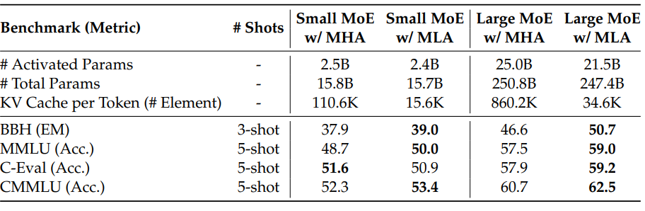
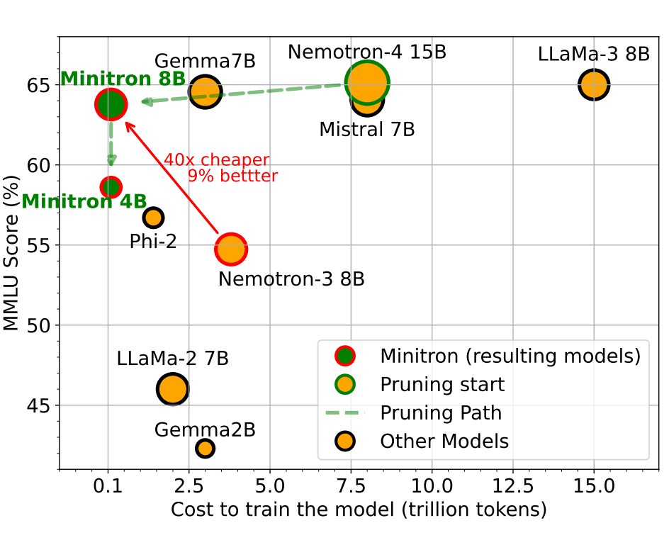
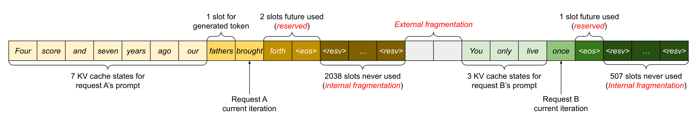
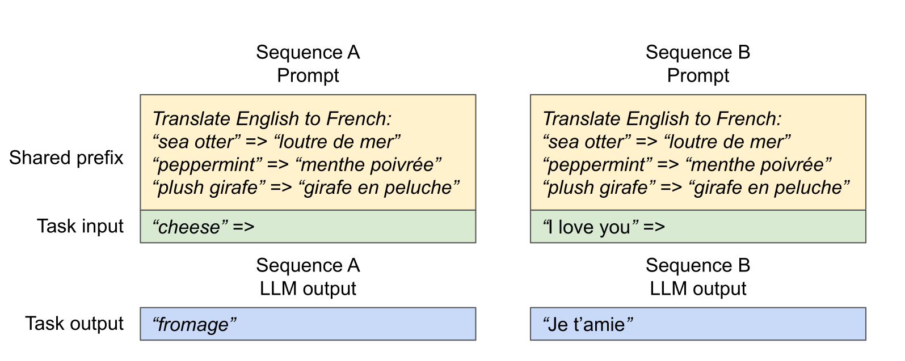
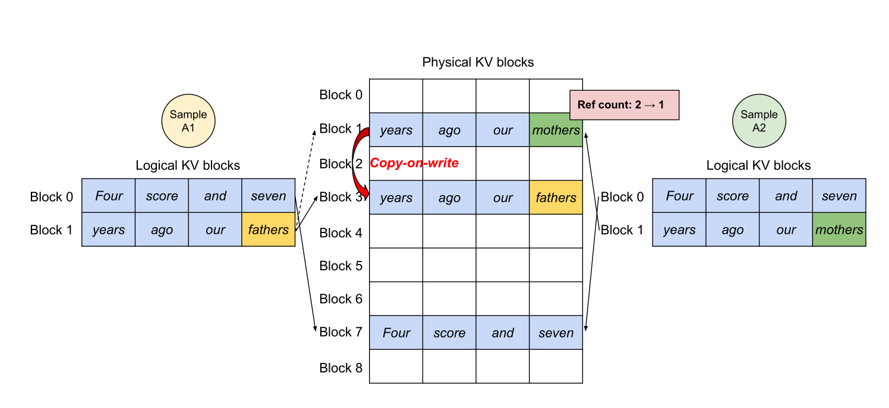

# Lecture 10 — Inference (course material)

This is the written content of CS336 Lecture 10, transcribed from
[`lecture_10.py`](https://github.com/stanford-cs336/lectures/blob/main/lecture_10.py).
Run it, or step through it in the browser, at
<https://cs336.stanford.edu/lectures/?trace=lecture_10>.

Every lecture up to this point has been about *training*: how to build the model
(1–4), how to make one chip and then many chips go fast (5–8), and how to decide
what size model to train (9). This lecture is the first about what happens
*afterwards* — you have a trained model and a prompt, and you want the response,
as accurately and as quickly as possible.

The lecture's spine is a single measurement, which it derives rather than
asserts: **generation is memory-bound**. Everything after that derivation is a
way of buying back the memory traffic. The techniques divide into three groups,
and the source's own top-level headings name them:

1. **Taking shortcuts (lossy)** — change the model so there is less to read:
   architectures with a smaller KV cache (GQA, MLA, CLA, local attention),
   quantization, and pruning-plus-distillation. These can cost accuracy, so each
   one is presented with an accuracy check.
2. **Use shortcuts but double check (lossless)** — speculative sampling, which
   guesses with a cheap model and verifies with the expensive one, and provably
   returns an exact sample from the expensive model.
3. **Handling dynamic workloads** — continuous batching and PagedAttention, which
   are not about the model at all but about the fact that real requests arrive at
   different times, share prefixes, and have different lengths.

A note on how to read the arithmetic. This lecture computes with sympy, so the
intermediate quantities are algebra, not numbers, and the conclusions are limits
("assume $B$ is much smaller than $D$ and $F$") rather than measurements. The
`assert` statements in the source are the lecture checking its own claims; they
are quoted below because they are the lecture's own statement of what each
expression is supposed to come out to.

The spoken lecture follows this program closely but not exactly — Percy digresses,
answers questions, and expands on points that the source states in one line. For
what was *said*, see [the transcript](../transcripts/10-inference.md). For what
was *written*, use this file.

## Sections → source lines

| Section | Function | Source lines |
| --- | --- | --- |
| [Roadmap](#roadmap) | `main` | 16–60 |
| [The inference landscape](#the-inference-landscape) | `landscape` | 63–98 |
| [Review: the Transformer and its notation](#review-the-transformer-and-its-notation) | `review_transformer` | 100–116 |
| [Review: arithmetic intensity](#review-arithmetic-intensity) | `review_of_arithmetic_intensity` | 118–160 |
| [Arithmetic intensity of inference](#arithmetic-intensity-of-inference) | `arithmetic_intensity_of_inference` | 162–261 |
| [— MLP layers](#mlp-layers) | (same) | 179–217 |
| [— Attention layers](#attention-layers) | (same) | 219–261 |
| [The performance model](#the-performance-model) | `TransformerPerformanceStats`, `compute_transformer_performance_stats`, `llama2_13b_config` | 263–330 |
| [Throughput and latency](#throughput-and-latency) | `throughput_and_latency` | 332–369 |
| [Reducing the KV cache](#reducing-the-kv-cache) | `reduce_kv_cache_size` | 371–447 |
| [— Grouped-query attention (GQA)](#grouped-query-attention-gqa) | (same) | 376–406 |
| [— Multi-head latent attention (MLA)](#multi-head-latent-attention-mla) | (same) | 408–418 |
| [— Cross-layer attention (CLA)](#cross-layer-attention-cla) | (same) | 420–425 |
| [— Local (sliding window) attention](#local-sliding-window-attention) | (same) | 427–434 |
| [— DeepSeek v4 attention](#deepseek-v4-attention) | (same) | 435–441 |
| [Quantization](#quantization) | `quantization` | 449–488 |
| [Model pruning](#model-pruning) | `model_pruning` | 490–505 |
| [Speculative sampling](#speculative-sampling) | `speculative_sampling` | 507–551 |
| [Continuous batching](#continuous-batching) | `continuous_batching` | 553–574 |
| [PagedAttention](#pagedattention) | `paged_attention` | 576–608 |
| [Summary](#summary) | `main` | 54–60 |

## Symbols

The lecture declares its dimension symbols at the top of the file (lines 8–11) and
uses them throughout. They are the same letters the
[JAX scaling book](https://jax-ml.github.io/scaling-book/transformers/) uses.

| Symbol | Meaning |
| --- | --- |
| $B$ | batch size (at inference: the number of concurrent requests) |
| $S$ | number of tokens conditioned on (the KV cache length) |
| $T$ | number of tokens being generated / scored in this step |
| $D$ | model dimension |
| $F$ | feed-forward (MLP up-projection) dimension |
| $N$ | number of query heads |
| $K$ | number of key/value heads (groups, for GQA) |
| $H$ | head dimension |
| $L$ | number of layers |
| $V$ | vocabulary size |
| $c$ | "just a constant that helps with taking limits" (source comment, line 10) |
| `memory_bandwidth` | bytes per second moved to and from HBM |

Two more symbols appear in the conventions rather than the declaration:
$G = N/K$, the GQA group size, and $C$, the MLA latent dimension.

## Roadmap

*Source: `main`, lines 16–60.*

> ## Lecture 10: inference

*Figure: `images/inference-schema.png` (width 600).*


*A simple block diagram with three input/output boxes around a central blue box labeled "Inference". Two boxes on the left, "model" (orange) and "prompt" (grey), each have an arrow pointing into the "Inference" box; a single arrow leaves the "Inference" box on the right and points to a grey box labeled "response". The diagram frames inference as a function that consumes a model and a prompt and produces a response. Source: [`images/inference-schema.png`](https://github.com/stanford-cs336/lectures/blob/main/images/inference-schema.png) in the lectures repo.*

The program then calls its sections in order. The top-level headings, verbatim
from the source, are:

- **Understanding the inference workload** — `landscape`, `review_transformer`,
  `review_of_arithmetic_intensity`, `arithmetic_intensity_of_inference`,
  `throughput_and_latency`
- **Taking shortcuts (lossy)** — `reduce_kv_cache_size`, `quantization`,
  `model_pruning`
- **Use shortcuts but double check (lossless)** — `speculative_sampling`
- **Handling dynamic workloads** — `continuous_batching`, `paged_attention`

Between the lossy and lossless sections the source states the summary of the
lossy group and the two recipes for getting a faster model (lines 31–42):

> Summary: reduce inference complexity without hurting accuracy
>
> From scratch recipe:
> 1. Define faster model architecture
> 2. Train faster model
>
> Distillation recipe:
> 1. Define faster model architecture
> 2. Initialize weights using original model (which has a different architecture)
> 3. Repair faster model (distillation)

And before the dynamic-workload section, the three properties of live traffic that
make batching hard (lines 44–48):

> Batching over sequences in live traffic is tricky because:
> 1. Requests arrive at different times (waiting for batch is bad for early requests)
> 2. Sequences have shared prefixes (e.g., system prompts, generating multiple samples)
> 3. Sequences have different lengths (padding is inefficient)

## The inference landscape

*Source: `landscape`, lines 63–98.*

### Where inference shows up

> Inference shows up in many places:
> - Actual use (chatbots, code completion, agents, batch data processing)
> - Model evaluation (e.g., on instruction following)
> - Reinforcement learning (sample many generations, then apply score)

### Why efficiency matters here in particular

> Why **efficiency** matters: training is one-time cost, inference is repeated many times
> - OpenAI processes ~8.6T tokens per day
> - For reference, DeepSeek v4 was trained on 32T tokens

The first figure is sourced to a
[PYMNTS article](https://www.pymnts.com/artificial-intelligence-2/2025/openai-bests-google-in-race-for-consumer-ai-token-consumption/);
the second to the DeepSeek v4 reference in `references.py`. The comparison is the
point: OpenAI's daily *inference* token volume is within a small factor of a
frontier model's entire *training* corpus.

> Moreover:
> - Chatbots: most tokens are meant for human consumption (humans are bottleneck)
> - Agents: query → internal trace → output for human (number of tokens generated can grow unbounded)
> - Tokens generated = compute spent

That last line is the lecture's reason for treating inference as a first-class
efficiency problem rather than a deployment detail. In the chatbot regime there is
a natural ceiling on useful speed — a human can only read so fast. In the agentic
regime there is none, because the tokens are consumed by the agent itself.

### Who does inference

> Companies doing inference (a big deal for anyone who has a product or platform):
> - Providers serving closed models (OpenAI, Anthropic, Google, etc.)
> - Providers serving open-weight models (Together, Fireworks, Baseten, DeepInfra, Groq, Cerebras, etc.)

> Open-source packages:
> - vLLM: from Berkeley, pioneered PagedAttention, popular and good default — [GitHub](https://github.com/vllm-project/vllm)
> - SGLang: from Berkeley, pioneered RadixAttention, good for agentic workloads — [project](https://sgl-project.github.io/)
> - TensorRT-LLM: from NVIDIA, highly optimized for GPUs — [overview](https://nvidia.github.io/TensorRT-LLM/overview.html)
> - llama.cpp: C++ only, supports CPU inference, runs locally — [GitHub](https://github.com/ggml-org/llama.cpp)

> Inference is huge. Important to make it fast.

### What "fast" means

Three metrics, and the source says which application each one belongs to:

> What does "fast" mean (metrics)?
> - Time-to-first-token (TTFT): how long user waits before any generation happens (for interactive applications)
> - Latency (seconds/token): how fast tokens appear for *one* query (for interactive applications)
> - Throughput (tokens/second): how fast tokens appear for *many* queries (for batch processing)

Note the units. Latency is seconds **per token** and throughput is tokens **per
second**, so they look like reciprocals — and for a single request they are. They
come apart as soon as there is a batch, and the whole of
[Throughput and latency](#throughput-and-latency) is about how.

### Why inference is harder to make efficient than training

> What governs efficiency?
> - Training (supervised): you see all tokens, can parallelize over sequence (matmul in Transformer)
> - Inference: you have to generate sequentially, can't parallelize over generation, so harder to fully utilize compute

## Review: the Transformer and its notation

*Source: `review_transformer`, lines 100–116.*

Reference: [Scaling book chapter on Transformers](https://jax-ml.github.io/scaling-book/transformers/).

The notation is the einops-style shape algebra from
[lecture 2](02-pytorch-resource-accounting.md), with a colour convention for what
happens to each dimension in a matrix multiply. In the rendered lecture the
dimension letters are literally coloured; here the colour is named in brackets.

> Notation (similar to einops):
> - Symbols denote dimensions (and their length): B (batch), T (sequence), D (model dim), H (head dim)
> - Example: BT**D** x **D**H → BTH  *(D in red)*
> - **Contracting (red)** dimensions appear in both operands and disappear from result
> - Regular (black) dimensions appear in one operand and stay in result
> - Example: **B****D** x **B****D** → B  *(B in blue, D in red)*
> - **Batching (blue)** dimensions appear in both operands and stay in result

*Figure: <https://jax-ml.github.io/scaling-book/assets/img/transformer-diagram.png> (width 800). Third-party image, not copied into this repository.*

> Conventions:
> - F = 4 D (MLP up-projects into 4x the model dimension)
> - D = N H (model dimension split across N heads)
> - N = K G (for GQA, number of heads split across K groups)
> - S = T (during training, condition on S input tokens to predict T output tokens)

That last convention is the one that breaks at inference, and the break is the
subject of the next two sections: during **generation** $T = 1$ while $S$ keeps
growing, so the training-time assumption $S = T$ is exactly what stops holding.

## Review: arithmetic intensity

*Source: `review_of_arithmetic_intensity`, lines 118–160.*

This section re-derives, for one matrix multiply, the quantity
[lecture 2](02-pytorch-resource-accounting.md) introduced and
[lecture 5](05-gpus-tpus.md) grounded in hardware. It is the tool the rest of the
lecture uses.

> Setup: multiply X *(B x D)* and W *(D x F)* matrix
>
> Intuition: B is batch size, D is hidden dimension, F is up-projection dimension in MLP

> Let's do FLOPs and memory read/write accounting for the matrix multiplication (X * W).

The accounting is done by accumulating into two running totals, one step per line:

| Step | Operation | FLOPs added | Bytes added |
| --- | --- | --- | --- |
| 1 | Read X *(B x D)* from HBM | — | $2BD$ |
| 2 | Read W *(D x F)* from HBM | — | $2DF$ |
| 3 | Compute Y = X *(B x D)* @ W *(D x F)* | $2BDF$ | — |
| 4 | Write Y *(B x F)* to HBM | — | $2BF$ |

The 2 in every byte count is bf16 (2 bytes per number); the 2 in the FLOP count is
the multiply-and-add. The source then asserts the totals:

```python
assert flops == 2*B*D*F
assert bytes_transferred == 2*B*D + 2*D*F + 2*B*F
```

> Recall that **arithmetic intensity** is how much compute we do per byte transferred (want to be high).

$$\text{intensity} = \frac{2BDF}{2BD + 2DF + 2BF} = \frac{BDF}{BD + BF + DF}$$

(computed — this is the simplified form sympy returns).

> Assuming B is much less than D and F, then we can simplify:

The source takes this limit literally, substituting $D = cB$ and $F = cB$ and
letting $c \to \infty$:

$$\lim_{c \to \infty} \frac{B \cdot cB \cdot cB}{B\,cB + B\,cB + cB\,cB} = B$$

(computed; the source asserts `intensity == B`.)

**So the arithmetic intensity of a matrix multiply is the batch size.** That one
sentence is the hinge of the entire lecture.

> Accelerator intensity of H100:

```python
flops_per_second = 989e12
memory_bandwidth = 3.35e12
accelerator_intensity = flops_per_second / memory_bandwidth   # 295.2238805970149
assert round(accelerator_intensity) == 295
```

(computed: 295.2238805970149, which rounds to 295.)

> If computation intensity > accelerator intensity, **compute-bound** (good)
>
> If computation intensity < accelerator intensity, **memory-bound** (bad)
>
> Conclusion: compute-bound iff B > 295

> Extreme case (B = 1, corresponding to matrix-vector product):
> - Arithmetic intensity: 1
> - Memory-bound (read D x F matrix, perform only 2 D F FLOPs)
> - This is basically what happens with inference...

## Arithmetic intensity of inference

*Source: `arithmetic_intensity_of_inference`, lines 162–261.*

Reference: [Scaling book chapter on inference](https://jax-ml.github.io/scaling-book/inference/).

### Naive inference and the KV cache

*Figure: <https://jax-ml.github.io/scaling-book/assets/img/naive-inference-1400.webp> (width 800). Third-party image, not copied into this repository.*

> Naive inference: to generate each token, feed history into Transformer
>
> Complexity: generating T tokens requires O(T^3) FLOPs (one feedforward pass is O(T^2))

> Observation: a lot of the work can be shared across prefixes
>
> Solution: store **KV cache** in HBM

*Figure: <https://jax-ml.github.io/scaling-book/assets/img/cached-inference-1400.webp> (width 800). Third-party image, not copied into this repository.*

> KV cache: for every sequence (B), token (S), layer (L), head (K), store an H-dimensional vector

That sentence is the size formula, and it is worth reading as one: the cache is
$B \times S \times L \times K \times H$ vectors' worth of numbers, times 2 for
key-and-value, times 2 bytes for bf16. It reappears as code in
[the performance model](#the-performance-model).

### The two stages

> Two stages of inference:
> 1. **Prefill**: given a prompt, encode into vectors (parallelizable like in training)
> 2. **Generation**: generate new response tokens (sequential)

> Let's compute the FLOPs and memory IO for both the MLP and attention layers.
>
> S is the number of tokens we're conditioning on, T is the number of tokens we're generating.
>
> Later, we'll specialize to prefill (T = S) and generation (T = 1).

### MLP layers

*Source lines 179–217. Heading in the source: "### MLP layers (only looking at the matrix multiplications)".*

The MLP here is the gated variety from [lecture 3](03-architectures.md) — three
weight matrices, $W_{up}$, $W_{gate}$ and $W_{down}$ — so the accounting has eight
steps rather than four:

| Step | Operation | FLOPs added | Bytes added |
| --- | --- | --- | --- |
| 1 | Read X *(B x T x D)* from HBM | — | $2BTD$ |
| 2 | Read Wup *(D x F)*, Wgate *(D x F)*, Wdown *(F x D)* from HBM | — | $3 \cdot 2DF$ |
| 3 | Compute U = X *(B x T x D)* @ Wup *(D x F)* | $2BTDF$ | — |
| 4 | Write U *(B x T x F)* to HBM | — | $2BTF$ |
| 5 | Compute G = X *(B x T x D)* @ Wgate *(D x F)* | $2BTDF$ | — |
| 6 | Write G *(B x T x F)* to HBM | — | $2BTF$ |
| 7 | Compute Y = GeLU(G)*U *(B x T x F)* @ Wdown *(F x D)* | $2BTDF$ | — |
| 8 | Write Y *(B x T x D)* to HBM | — | $2BTD$ |

```python
assert flops == 6*B*T*D*F
assert bytes_transferred == 4*B*T*D + 4*B*T*F + 6*D*F
```

$$\text{intensity} = \frac{6BTDF}{4BTD + 4BTF + 6DF} = \frac{3BDFT}{2BDT + 2BFT + 3DF}$$

(computed — the simplified form sympy returns.)

> Assume that B*T is much smaller than D and F.

Taking the same style of limit, with $D = cBT$ and $F = cBT$ and $c \to \infty$:

$$\text{intensity} \to BT$$

(computed; the source asserts `intensity == B*T`.)

So the MLP's intensity is the number of tokens in flight — batch size times
sequence position count. The two stages then follow immediately:

> For the two stages:
> 1. Prefill: easy to make compute-bound (good) by making `B*T` large enough (large batches, long sequences)
> 2. Generation: two problems
> - Generating one token at a time (T = 1)
> - B is number of concurrent requests, unpredictable for interactive applications

### Attention layers

*Source lines 219–261. Heading in the source: "### Attention layers (focusing on the matrix multiplications with FlashAttention)".*

"With FlashAttention" is doing real work in that heading: it is why the
$B \times S \times T$ attention matrix never appears in the byte count. As
[lecture 6](06-kernels-triton.md) showed, FlashAttention never writes it to HBM.

> - S is number of previous tokens (already generated)
> - T is number of next tokens (to generate logits for)

| Step | Operation | FLOPs added | Bytes added |
| --- | --- | --- | --- |
| 1 | Read Q *(B x T x D)*, K *(B x S x D)*, V *(B x S x D)* from HBM | — | $2BTD + 2BSD + 2BSD$ |
| 2 | Compute A = Q *(B x T x D)* @ K *(B x S x D)* | $2BSTD$ | — |
| 3 | Compute Y = softmax(A) *(B x S x T x K x G)* @ V *(B x S x K x H)* | $2BSTD$ | — |
| 4 | Write Y *(B x T x D)* to HBM | — | $2BTD$ |

```python
assert flops == 4*B*S*T*D
assert bytes_transferred == 4*B*S*D + 4*B*T*D
```

$$\text{intensity} = \frac{4BSTD}{4BSD + 4BTD} = \frac{ST}{S + T}$$

(computed; the source asserts `intensity == S*T / (S + T)`.)

Specializing to the two stages:

> 1. Prefill: T = S

$$\text{intensity} = \frac{S \cdot S}{S + S} = \frac{S}{2}$$

(computed; the source asserts `prefill_intensity == S/2` and comments "Good!")

> 2. Generation: T = 1

$$\text{intensity} = \frac{S}{S + 1}$$

(computed; the source asserts `generate_intensity < 1` and comments "Bad!" —
$S/(S+1)$ is strictly less than 1 for every positive $S$, and approaches 1 from
below as the context grows.)

Then the observation that makes attention a different problem from the MLP:

> Unlike MLPs, no dependence on B, so batching doesn't help!
>
> Why?
> - In MLP layers, every sequence hits the same MLP weights (Wup, Wgate, Wdown don't depend on B)
> - In attention layers, every sequence has its own KV cache vectors (Q, K, V all depend on B)

This is the structural reason the rest of the lecture attacks the KV cache
specifically. Batching amortizes a *shared* read; the weights are shared across
the batch, so batching helps the MLP. The KV cache is per-sequence, so batching
buys nothing there — $B$ cancels out of the ratio entirely.

> Summary:
> - Prefill is compute-bound, generation is memory-bound
> - Prefill MLP intensity: `B*S`
> - Prefill attention intensity: `S/2`
> - Generation MLP intensity: `B` (requires concurrent requests)
> - Generation attention intensity: `<1` (impossible to improve)

## The performance model

*Source: `TransformerPerformanceStats` (lines 263–285),
`compute_transformer_performance_stats` (287–315), `llama2_13b_config` (317–330).*

Having established that generation is memory-bound, the lecture builds a small
symbolic model that turns a Transformer configuration into four numbers. The
docstring states what they are:

> Performance stats of a Transformer:
> - num_params: number of parameters (in bytes)
> - memory: total memory usage (parameters + KV cache) in bytes
> - latency: time to generate one token (seconds/token)
> - throughput: tokens generated per second

*(The docstring's "(in bytes)" on `num_params` is a slip in the source: the
expression assigned to `num_params` is a count of parameters, and it is
`parameter_size = 2*num_params` that is in bytes.)*

The model itself is six lines (lines 290–305):

```python
num_params = 2*V*D + D*F*3*L + (2*D*N*H + 2*D*K*H)*L

parameter_size = 2*num_params        # 2 for bf16 (training requires a larger multiple)

kv_cache_size_per_seq = S * (K*H) * L * 2 * 2   # 2 for key + value, 2 for bf16

memory = B * kv_cache_size_per_seq + parameter_size

latency = memory / memory_bandwidth   # read all parameters and KV cache each step
throughput = B / latency              # generating B tokens in parallel
```

Read the parameter count term by term: $2VD$ is the input and output embeddings,
$3DFL$ is the three MLP matrices in each of $L$ layers, $2DNHL$ is the query and
output projections, and $2DKHL$ is the key and value projections — and it is that
last term, the only one carrying $K$, that GQA shrinks.

The two comments on the latency and throughput lines are the model's whole
argument:

> *Latency* is determined by memory IO (read all parameters and KV cache for each step)
>
> *Throughput* is the inverse of latency, but we're generating B tokens in parallel

The configuration it is instantiated with is Llama 2 13B on an H100:

```python
S: 1024,   # Sequence length
D: 5120,   # Model dim
F: 13824,  # Feed-forward dim
N: 40,     # Number of query heads
K: 40,     # Number of key/value heads
H: 128,    # Head dimension
L: 40,     # Number of layers
V: 32000,  # Vocabulary size
memory_bandwidth: 3.35e12,  # Memory bandwidth (bytes/second)
```

$K = N = 40$ is multi-head attention — this configuration is the *before* picture
that the GQA section then improves on.

Substituting everything but $B$ gives (computed):

| Quantity | Expression | Value |
| --- | --- | --- |
| `num_params` | — | 13,015,449,600 ≈ 13.0B |
| `memory` (bytes) | $838{,}860{,}800\,B + 26{,}030{,}899{,}200$ | 0.84 GB per sequence + 26.0 GB of weights |
| `latency` (s) | $0.000250406\,B + 0.00777042$ | — |
| `throughput` (tok/s) | $127792.36\,B / (32B + 993)$ | — |

The 0.84 GB per sequence is the KV cache for a single 1024-token request:
$1024 \times (40 \times 128) \times 40 \times 2 \times 2 = 838{,}860{,}800$ bytes
(computed). It is worth pausing on that number — **one** modest 1024-token request
costs nearly a gigabyte of cache in this configuration, against 26 GB for the
entire model.

## Throughput and latency

*Source: `throughput_and_latency`, lines 332–369.*

> So we have shown that inference is memory-bound.
>
> Let us now compute the theoretical maximum latency and throughput of a single request.
>
> Assumption: can overlap compute and communication perfectly and ignore overhead.

> Instantiate latency and throughput for Llama 2 13B on an H100:

The source steps through three batch sizes. All values below are computed from the
lecture's own expressions:

| Batch size | Memory | Latency | Throughput | Source's comment |
| --- | --- | --- | --- | --- |
| $B = 1$ | 26.87 GB | 8.02 ms/token | 124.7 tok/s | — |
| $B = 64$ | 79.72 GB | 23.80 ms/token | 2,689.5 tok/s | "Result: worse latency, better throughput" |
| $B = 256$ | 240.78 GB | 71.87 ms/token | 3,561.8 tok/s | "Result: even worse latency, even better throughput" |

```python
h100_memory = 80e9   # H100 memory in bytes
assert b256.memory > h100_memory   # Doesn't fit in memory!
```

> Result: doesn't fit into memory and throughput gains are diminishing too...

Both halves of that sentence are visible in the table. 240.78 GB against an 80 GB
H100 is a factor of three over budget — and note that $B = 64$ at 79.72 GB only
just fits, with the model weights and cache alone leaving nothing over. Meanwhile
throughput went up 21.6× from $B=1$ to $B=64$, but only a further 1.32× from
$B=64$ to $B=256$: the parameter-reading cost has already been amortized away, and
what is left is the per-sequence cache, which batching cannot amortize.

> What increasing batch size does:
> - Worsens latency because larger KV cache (O(B) size) to read/write
> - Improves throughput because amortizes the cost of reading parameters

> **Tradeoff** between latency and throughput:
> 1. Smaller batch sizes yield better latency but worse throughput
> 2. Larger batch sizes yield better throughput but worse latency

> Easy parallelism: if you launch M copies of the model, latency is the same, throughput increases by M!
>
> Harder parallelism: shard the model and the KV cache

> Note: time-to-first-token (TTFT) is essentially a function of prefill time
>
> Use smaller batch sizes during prefill for faster TTFT
>
> Use larger batch sizes during generation to improve throughput

That final pair of lines is the practical consequence of prefill and generation
having opposite bottlenecks, and it is the reason production systems schedule the
two phases separately.

# Taking shortcuts (lossy)

*The first of the source's three technique groups. Each method here changes the
model, so each is presented with an accuracy check as well as a speed claim.*

## Reducing the KV cache

*Source: `reduce_kv_cache_size`, lines 371–447.*

> Recall that memory is the bottleneck for inference.
>
> So let's try to reduce the size of the KV cache
>
> ...but make sure we don't lose too much accuracy.

### Grouped-query attention (GQA)

*Source lines 376–406. Reference: [Ainslie et al. 2023](https://arxiv.org/abs/2305.13245).*

*Figure: <https://jax-ml.github.io/scaling-book/assets/img/gmqa.png> (width 800). Third-party image, not copied into this repository.*

> Idea: N query heads, but only K key and value heads, each interacting with N/K query heads
>
> Multi-headed attention (MHA): K=N
>
> Multi-query attention (MQA): K=1
>
> Group-query attention (GQA): K is somewhere in between

> Latency/throughput improves:

*Figure: `images/gqa-speed.png` (width 500).*


*Line chart with x-axis "GQA groups" on a log-like scale with labeled ticks 1, 4, 8, 16, 32, 64, and y-axis "Time per sample (s)" carrying ticks only at 1 and 2, so every value below 1 is read off an unlabelled region. The legend lists three entries, but only ONE is a swept curve: GQA is the solid blue line with square markers, and the MHA (pink dashed) and MQA (orange dotted) lines are flat horizontal reference levels, not conditions being swept — treating them as swept series is the standard way to misread this chart. The GQA curve starts on the MQA level at 1 group, stays there through 4 and 8 groups, lifts slightly at 16, reaches about 0.8 s at 32, and rises sharply to land exactly on the MHA level at 64 groups. This KB audited the same figure at higher resolution from lecture 3's deck, where it appears as slide 63; that reading puts MHA at about 2.6 s, MQA at about 0.40 s, and the GQA curve starting at about 0.42 s. Source: [`images/gqa-speed.png`](https://github.com/stanford-cs336/lectures/blob/main/images/gqa-speed.png) in the lectures repo.*

> Why does GQA improve latency and throughput?
>
> GQA reduces the KV cache by a factor of N/K.
>
> Reminder: reducing memory usage leads to speedup (since we're memory-bound).

The lecture then puts that claim through the performance model. Three
configurations, all computed:

| Configuration | Params | Memory | Latency | Throughput |
| --- | --- | --- | --- | --- |
| $K = 40$, $B = 64$ (MHA, the original) | 13.02B | 79.72 GB | 23.80 ms/token | 2,689.5 tok/s |
| $K = 8$, $B = 64$ (GQA, 1:5 ratio) | 11.34B | 33.41 GB | 9.97 ms/token | 6,416.7 tok/s |
| $K = 8$, $B = 256$ (GQA, bigger batch) | 11.34B | 65.63 GB | 19.59 ms/token | 13,068.2 tok/s |

> Result: Worse latency, but better throughput (and it fits in memory now!)
>
> Result: Worse latency, but better throughput (and still fits in memory!)

**A note on those two comments.** Read against the row immediately above it, the
first one is not what the arithmetic says: moving from $K=40$ to $K=8$ at the same
batch size *improves* latency, from 23.80 ms to 9.97 ms. Both comments are
consistent only if the baseline being compared against is the $B = 1$ row from the
previous section — 8.02 ms and 124.7 tok/s — and against that baseline both GQA
rows are indeed worse in latency and much better in throughput. The reader should
take the numbers, which the source computes, over the comments, which the source
writes by hand. The substantive claims are unaffected: the KV cache falls by
exactly the factor $N/K = 5$ (0.84 GB → 0.168 GB per sequence, computed), the
$B=256$ configuration that did not fit in 80 GB now fits in 65.63 GB, and
throughput at that batch size rises from an infeasible 3,561.8 to 13,068.2 tok/s.

The parameter count also drops, from 13.02B to 11.34B, because the $2DKHL$ term
shrinks with $K$ — GQA makes the model slightly smaller as well as its cache much
smaller.

> Check that accuracy doesn't drop:

*Figure: `images/gqa-accuracy.png` (width 800).*


*A results table (no visible figure/table number in the crop) with columns Model, T_infer (s), Average, then per-dataset scores for CNN (R1), arXiv (R1), PubMed (R1), MediaSum (R1), MultiNews (R1), WMT (BLEU), and TriviaQA (F1). Four rows are shown: MHA-Large (T_infer 0.37s, Average 46.0), MHA-XXL (1.51s, 47.2), MQA-XXL (0.24s, 46.6), and GQA-8-XXL (0.28s, 47.1). Reading across GQA-8-XXL: CNN 43.5, arXiv 45.4, PubMed 47.7, MediaSum 36.3, MultiNews 47.2, WMT 28.4, TriviaQA 81.6. No cells are bolded or highlighted; the table shows GQA-8-XXL achieving inference time close to MQA-XXL (0.28s vs 0.24s) while average accuracy (47.1) is close to the much slower MHA-XXL (47.2, at 1.51s). Source: [`images/gqa-accuracy.png`](https://github.com/stanford-cs336/lectures/blob/main/images/gqa-accuracy.png) in the lectures repo.*

### Multi-head latent attention (MLA)

*Source lines 408–418. Reference: [DeepSeek-V2, 2024](https://arxiv.org/abs/2405.04434).*

*Figure: `images/mla-schema.png` (width 800).*


*A four-panel diagram, one panel each for Multi-Head Attention (MHA), Grouped-Query Attention (GQA), Multi-Query Attention (MQA), and Multi-Head Latent Attention (MLA), separated by dashed vertical lines. Each panel shows a row of light query boxes at the bottom connecting upward (dotted lines) to key and value column boxes above; a hatched fill pattern (legend: "Cached During Inference") marks which boxes are stored in the KV cache. In MHA, all 8 query heads have their own hatched key and value columns (8 cached key + 8 cached value columns). In GQA, the 8 queries are grouped in pairs sharing one hatched key/value column per group (4 cached key + 4 cached value columns). In MQA, all 8 queries share a single hatched key column and single hatched value column. In MLA, each of the 8 queries again has its own key and value column, but these are drawn in plain (non-hatched) blue and are produced by a "projection" arrow from a single hatched column on the right labeled "Compressed Latent KV" — that compressed column, not the per-head keys/values, is what is actually cached during inference. Source: [`images/mla-schema.png`](https://github.com/stanford-cs336/lectures/blob/main/images/mla-schema.png) in the lectures repo.*

> Normal attention: KV cache consists of K = W_K h, V = W_V h (N*H dimensions)
>
> MLA: store compressed vector c = W_c h (C dimensions), project up to K = W_K c, V = W_V c when needed
>
> DeepSeek v2: reduce N*H = 16384 to C = 512
>
> Wrinkle: MLA is not compatible with RoPE, so need to add additional 64 dimensions for RoPE, so 512 + 64 = 576 total dimensions
>
> Latency/throughput improvements follow similarly from the KV cache reduction as argued earlier

The compression ratio is the headline: $16384 \to 576$ is a factor of about 28,
against GQA's factor of $N/K$. The RoPE wrinkle is a real architectural
constraint, not a detail — [lecture 3](03-architectures.md) covers why RoPE acts
on the key vectors themselves, which is exactly what MLA declines to store.

> Let's now check the accuracy.
>
> First, MHA is better than GQA (though more expensive) [Table 8]

*Figure: `images/mla-accuracy.png` (width 800).*


*A screenshot of "Table 8" from the MLA/DeepSeek-V2 paper, captioned "Comparison among 7B dense models with MHA, GQA, and MQA, respectively. MHA demonstrates significant advantages over GQA and MQA on hard benchmarks." Columns are Benchmark (Metric), # Shots, and three model columns: Dense 7B w/ MQA (7.1B params), Dense 7B w/ GQA (8 Groups) (6.9B params), and Dense 7B w/ MHA (6.9B params). Rows: BBH (EM, 3-shot) 33.2 / 35.6 / 37.0; MMLU (Acc., 5-shot) 37.9 / 41.2 / 45.2; C-Eval (Acc., 5-shot) 30.0 / 37.7 / 42.9; CMMLU (Acc., 5-shot) 34.6 / 38.4 / 43.5. Every value in the MHA column is bolded, showing MHA scoring highest on all four benchmarks, with GQA in between and MQA lowest. Source: [`images/mla-accuracy.png`](https://github.com/stanford-cs336/lectures/blob/main/images/mla-accuracy.png) in the lectures repo.*

> Second, MLA is even a bit better than MHA (and much cheaper) [Table 9]

*Figure: `images/mla-accuracy2.png` (width 800).*



*A table (no caption visible in this crop; the lecture text identifies it as Table 9 of the MLA/DeepSeek-V2 paper) with columns Benchmark (Metric), # Shots, and four model columns: Small MoE w/ MHA, Small MoE w/ MLA, Large MoE w/ MHA, Large MoE w/ MLA. Header rows give # Activated Params (2.5B/2.4B/25.0B/21.5B), # Total Params (15.8B/15.7B/250.8B/247.4B), and KV Cache per Token (# Element) (110.6K/15.6K/860.2K/34.6K) — MLA's per-token KV cache is roughly 7x-25x smaller than MHA's in both settings. Benchmark rows: BBH (EM, 3-shot) 37.9/39.0/46.6/50.7; MMLU (Acc., 5-shot) 48.7/50.0/57.5/59.0; C-Eval (Acc., 5-shot) 51.6/50.9/57.9/59.2; CMMLU (Acc., 5-shot) 52.3/53.4/60.7/62.5. Bolding marks the better of each MHA/MLA pair: for Small MoE, MLA is bolded on BBH, MMLU, and CMMLU while MHA is bolded on C-Eval; for Large MoE, MLA is bolded on all four benchmarks. Source: [`images/mla-accuracy2.png`](https://github.com/stanford-cs336/lectures/blob/main/images/mla-accuracy2.png) in the lectures repo.*

Note the shape of that two-step argument. GQA buys speed and gives up a little
accuracy; MLA is claimed to give up none — to be better than the *expensive*
baseline while being cheaper than the cheap one.

### Cross-layer attention (CLA)

*Source lines 420–425. Reference: [Brandon et al. 2024](https://arxiv.org/abs/2405.12981).*

*Figure: `images/cla-diagram.png` (width 500).*


*A two-panel block diagram of two stacked Transformer layers, labeled "Traditional Transformer" (left) and "Transformer with Cross-Layer Attention (Ours)" (right). Each panel shows, per layer bottom-to-top, boxes for Norm., Q Proj. and K,V Proj. (outlined in red) feeding into Attention, then Out Proj., a "+" residual-add node, and FFN. In the left (traditional) panel, both the lower and upper layers each have their own red "K, V Proj." box feeding their own Attention box. In the right (CLA) panel, the lower layer still has its own "K, V Proj." box, but the upper layer has no K,V Proj. box of its own — instead a red arrow runs directly from the lower layer's "K, V Proj." box up into the upper layer's Attention box, alongside that layer's own Q Proj. arrow, illustrating that the upper layer reuses (shares) the key/value projections computed in the lower layer rather than computing new ones. Source: [`images/cla-diagram.png`](https://github.com/stanford-cs336/lectures/blob/main/images/cla-diagram.png) in the lectures repo.*

> Idea: share KVs across **layers** (just as GQA shares KVs across heads)
>
> Empirically improves the pareto frontier of accuracy and KV cache size (latency and throughput)

*Figure: `images/cla-results.png` (width 700).*


*Scatter plot titled "Pareto Frontier with and without CLA (1B Models)". X-axis is "KV Cache Bytes Per Token (16-Bit Precision)" on a log scale from about 10^3 to a bit past 10^5; y-axis is "Validation Perplexity" ranging from about 13.2 to 14.4. Each point is a labeled model configuration; there are two colour groups rather than continuous lines. Blue points (baselines without CLA) run from H32-MQA (~2.5e3 bytes, perplexity ~14.37) through H46-MQA (~3.7e3, ~13.97), H64-MQA (~5.2e3, ~13.81), H128-MQA (~1.0e4, ~13.54), H128-GQA2 (~2.1e4, ~13.52), H128-GQA4 (~4.3e4, ~13.36), down to H128-MHA (~1.6e5, ~13.15). Red points (with CLA2, i.e. sharing KV across 2 layers) are H64-MQA-CLA2 (~2.6e3, ~13.89), H90-MQA-CLA2 (~3.7e3, ~13.74), H128-MQA-CLA2 (~5.2e3, ~13.60), H256-MQA-CLA2 (~1.0e4, ~13.50), and H512-MQA-CLA2 (~2.1e4, ~13.49). At comparable KV-cache-per-token budgets, the red CLA2 points sit at lower (better) perplexity than the blue non-CLA points at similar x-positions, indicating an improved accuracy/cache-size tradeoff. Source: [`images/cla-results.png`](https://github.com/stanford-cs336/lectures/blob/main/images/cla-results.png) in the lectures repo.*

The parenthetical is the organizing idea of this whole section: the KV cache has
four axes — sequence ($S$), layer ($L$), head ($K$) and dimension ($H$) — and each
method picks a different one to shrink. GQA cuts $K$, MLA cuts $H$ (by storing a
latent instead), CLA cuts $L$, and local attention, next, cuts $S$.

### Local (sliding window) attention

*Source lines 427–434. References: [Longformer, 2020](https://arxiv.org/abs/2004.05150),
[Sparse Transformer, 2019](https://arxiv.org/abs/1904.10509),
[Mistral 7B, 2023](https://arxiv.org/abs/2310.06825).*

*Figure: `images/longformer-attention.png` (width 800).*


*Four square grid diagrams, each cell representing whether one token attends to another, labeled (a) through (d) beneath. (a) "Full n^2 attention": the entire grid is filled green, i.e. every token attends to every other token, with a slightly darker green diagonal. (b) "Sliding window attention": only a diagonal band of green cells is filled, i.e. each token attends only to a fixed-width local window of nearby tokens around the diagonal, with the rest of the grid white/empty. (c) "Dilated sliding window": a similar diagonal band but with a checkerboard/gapped pattern of filled and empty cells within the band, spreading the same number of attended positions over a wider span by skipping positions. (d) "Global+sliding window": the same local diagonal band as (b), plus a few additional fully-green rows and columns cutting across the whole grid, representing a small set of "global" tokens that attend to and are attended to by every other token in addition to the local window. Source: [`images/longformer-attention.png`](https://github.com/stanford-cs336/lectures/blob/main/images/longformer-attention.png) in the lectures repo.*

> Idea: just look at the local context, which is most relevant for modeling
>
> Effective context scales linearly with the number of layers
>
> KV cache is independent of sequence length!
>
> Problem: this can still hurt accuracy
>
> Solution: interleave local attention with global attention (hybrid layers)

"KV cache is independent of sequence length" is the strongest claim available in
this section — it changes the cache from $O(S)$ to $O(1)$ — and it is why the
technique survives despite the accuracy cost. The "effective context scales
linearly with the number of layers" line is the standard defence: a window of $w$
stacked $L$ deep lets information travel $wL$ tokens, even though no single layer
looks further than $w$.

### DeepSeek v4 attention

*Source lines 435–441. Reference: DeepSeek v4 (2026), from `references.py`.*

> - Supports 1M context length

*Figure: `images/deepseek-v4-attention.png` (width 800).*


*A detailed architecture diagram, unlabeled with any paper figure number in this crop. At the bottom are two inputs: a long row of yellow/tan boxes labeled "Hidden States of KV Tokens" (left, with "..." indicating many tokens) and a single green box labeled "Hidden State of Query Token" (right). The "Hidden States of KV Tokens" feed a "Token-Level Compressor" (grey trapezoid) producing "Compressed KV Entries" (yellow boxes with "..."), and also feed directly up the left side as "Sliding Window KV Entries" (yellow boxes). On the right, a dashed box labeled "Lightning Indexer" contains: a second "Token-Level Compressor" that turns the same hidden states into "Compressed Indexer Keys"; "Indexer Queries" (green boxes) branched from the query hidden state; a "Multi-Query Attention" block that consumes the compressed indexer keys and indexer queries to produce "Index Scores" (shown as a small green bar chart icon). The Index Scores feed a "Top-k Selector" (grey trapezoid) that also takes the "Compressed KV Entries" and outputs "Selected Compressed KV Entries". A "Concatenation" box combines the "Sliding Window KV Entries" and "Selected Compressed KV Entries"; its output, together with the "Queries" (green boxes, branched from the same query hidden state, outside the dashed Lightning Indexer box), feeds into a top-level grey box labeled "Shared Key-Value Multi-Query Attention", the final output of the diagram. Source: [`images/deepseek-v4-attention.png`](https://github.com/stanford-cs336/lectures/blob/main/images/deepseek-v4-attention.png) in the lectures repo.*

> - Compressed Sparse Attention (CSA): compresses every m tokens into 1
> - DeepSeek Sparse Attention (DSA): selects the top k
> - Heavily Compressed Attention (HCA): compresses even more

### Summary of this section

> - Goal: reduce the KV cache size (since inference is memory-bound) without hurting accuracy
> - Lower-dimensional KV cache (GQA, MLA, CLA)
> - Local attention (truncates the KV cache) on some of the layers
> - Other ideas: linear attention / state-space-models (Mamba 2, GatedDeltaNet), diffusion models

## Quantization

*Source: `quantization`, lines 449–488.*

> Key idea: reduce the precision of numbers
>
> Less memory means higher latency/throughput (since inference is memory-bound).
>
> Of course we have to worry about accuracy...

*(The source's "higher latency/throughput" reads oddly — lower latency is the good
direction. The intent is "better latency/throughput", which is what the rest of
the lecture argues for.)*

### Mechanics

The lecture works one number through the round trip (lines 462–466):

```python
x = 5.2342
scale = 0.1
zero_point = 4
x_quant = round(x / scale) + zero_point    # 56
x_approx = (x_quant - zero_point) * scale  # 5.2
```

(computed: `x_quant` = 56, `x_approx` = 5.2.) The loss — 5.2342 becomes 5.2 — is
the whole of quantization in one line. `scale` sets the step size and
`zero_point` recentres the range so that the integers being stored are used
efficiently.

*Figure: <https://www.datocms-assets.com/104802/1709770809-twitter-post-20.png> (width 400). Third-party image from [Baseten's fp8 article](https://www.baseten.co/blog/fp8-efficient-model-inference-with-8-bit-floating-point-numbers/), not copied into this repository.*

### The formats

> - fp32 (4 bytes): needed for parameters and optimizer states during training
> - bf16 (2 bytes): default for inference
> - fp8 (1 byte) [-240, 240] for e4m3 on H100s: can train if you dare — [paper](https://arxiv.org/pdf/2310.18313)
> - int8 (1 byte) [-128, 127]: less accurate but cheaper than fp8, but for inference only — [paper](https://arxiv.org/pdf/2303.17951)
> - int4 (0.5 bytes) [-8, 7]: cheaper, even less accurate — [paper](https://arxiv.org/pdf/2303.17951)

An [overview of approaches](https://apxml.com/posts/llm-quantization-techniques-explained)
is linked at line 476.

Note the ranges, which are stated for a reason: int8's $[-128, 127]$ and fp8
e4m3's $[-240, 240]$ hold the same number of bits but spend them differently —
the float spends some on an exponent and so covers a wider dynamic range with
uneven spacing, which is why fp8 is the one the source says you can *train* with.

### When to quantize

> Quantization-aware training (QAT)
> - During training, quantize-and-dequantize during the forward pass to simulate quantization errors
> - Pro: weights are trained to work with quantization
> - Con: requires expensive large-scale training

> Post-training quantization (PTQ):
> - Done after training, so much cheaper
> - Run on sample data to determine scale and zero point for each layer or tensor
> - GPTQ: use Hessian information to update non-quantized weights to account for quantization error — [paper](https://arxiv.org/abs/2210.17323)

### Activation-aware quantization (AWQ)

*Source lines 481–488. Reference: [Lin et al. 2023](https://arxiv.org/abs/2306.00978).*

> - Observation: some activation channels are large
> - Weights that hit those matter more
> - Allocate more precision to those weights
> - Idea: select which weights (0.1-1%) to keep in high precision based on activations
> - fp16 → int3 produces 4x lower memory, 3.2x speedup

*Figure: `images/awq-schema.png` (width 800).*


*A three-panel figure (matching AWQ paper Figure 2, though no caption/figure number is visible in this crop) illustrating activation-aware weight quantization. Panel (a) "RTN quantization (PPL 43.2)": an 8x4 tan matrix W_FP16 with explicit decimal values (e.g. row 1: +1.2, -0.2, -2.4, -3.4) is passed through a "Q" arrow to a blue INT3 matrix Q(W) with rounded integer values (row 1: +1, +0, -2, -3); the PPL value 43.2 is printed in red (bad). Panel (b) "Keep 1% salient weights in FP16 (PPL 13.0)": a red-highlighted column in activation matrix X (3 rows x 8 columns, mostly pale pink with 2 darker red columns) is used via a dashed arrow labeled "determine the salient weights by activation" to mark one row of the quantized matrix Q(W)_MixPrec as an "FP16 channel" (left in decimal form, -2.5/-3.5/+1.9/+1.4, on a tan background) while the rest of the matrix stays blue INT3; red text above reads "bad hardware efficiency" pointing at Q(W)_MixPrec; PPL 13.0 is printed in green (good). Panel (c) "Scale the weights before quantization (PPL 13.0)": the same X matrix with one red (salient) column feeds an "average mag." arrow into a 1x8 strip of pink shading, which is then scaled by a factor α ("scale before quantize") into the corresponding column of the Q(W)_INT3 matrix (blue, 8x4), where that scaled column shows visibly darker blue shading than the rest of the matrix; PPL is again 13.0 in green. Together the three panels argue that scaling weights by activation magnitude before quantizing (c) matches the accuracy of keeping salient weights in FP16 (b) without needing mixed precision, while plain round-to-nearest quantization (a) is much worse. Source: [`images/awq-schema.png`](https://github.com/stanford-cs336/lectures/blob/main/images/awq-schema.png) in the lectures repo.*

The insight worth keeping: which weights matter is decided by the *activations*
that flow through them, not by the magnitude of the weights themselves. Keeping
0.1–1% of them in high precision is a small enough exception to preserve nearly
all of the memory saving.

## Model pruning

*Source: `model_pruning`, lines 490–505.*

> Key idea: just rip out parts of an expensive model to make it cheaper
>
> ...and then fix it up.

> Paper from NVIDIA — <https://arxiv.org/abs/2407.14679>

*(The lecture's text says only "Paper from NVIDIA" and gives the bare link. The
name **Minitron** is not spoken or written in the lecture; it is read off the
results figure below, whose points are labelled "Minitron 8B" and "Minitron 4B".)*

*Figure: `images/pruning-kd-loop.png` (width 600).*


*A circular five-step pipeline diagram (from the NVIDIA pruning paper) arranged in four quadrants around a central green circular arrow labeled "Iterative". Step 1, "Trained LLM" (top left): a standard Transformer stack — Embedding, then a repeated Transformer Block containing Layer norm, Attention, Layer norm, MLP, up through Layer L. Step 2, "Estimate importance" (top right): the same stack but with its components broken out and color-coded per element — four embedding channels (Emb1-4), four attention heads (Head1-4), and four MLP channels (CH1-4) — each shown in a different shade indicating an estimated importance score. Step 3, "Rank" (bottom right): the same elements reordered by importance (e.g. Emb4, Emb2, Emb1, Emb3; Head3, Head1, Head4, Head2; CH1, CH4, CH2, CH3). Step 4, "Trim" (bottom left): a shrunken model keeping only the top-ranked elements — 2 embedding channels (Emb4, Emb2), 3 heads (Head3, Head1, Head4), and 2 MLP channels (CH1, CH4) — through Layer L. Step 5, "Distillation" (center bar with double-headed grey arrows connecting the trimmed model at bottom to the full trained LLM at top): the original model's outputs are distilled into the trimmed model. The green circular arrow indicates steps 2-4 (estimate, rank, trim) repeat iteratively. Source: [`images/pruning-kd-loop.png`](https://github.com/stanford-cs336/lectures/blob/main/images/pruning-kd-loop.png) in the lectures repo.*

> Algorithm:
> 1. Identify important {layer, head, hidden dimension} on a small calibration dataset (1024 samples)
> 2. Remove unimportant layers to get a smaller model
> 3. Distill the original model into pruned model

> Results:

*Figure: `images/pruning-kd.png` (width 500).*



*Scatter plot with x-axis "Cost to train the model (trillion tokens)" ranging from about 0.1 to 15+, and y-axis "MMLU Score (%)" ranging from about 42.5 to 67.5. Points are bubbles (size not explained in-plot) in four legend categories: red-outlined circles "Minitron (resulting models)", green-outlined circles "Pruning start", a green dashed line "Pruning Path", and plain orange/black-outlined circles "Other Models". Minitron 8B (green-filled, red-outlined, labeled in bold green) sits at about (0.1, 64); Minitron 4B (same style) sits at about (0.1, 58.5), connected to Minitron 8B by a short green dashed arrow pointing downward. A green dashed "Pruning Path" arrow runs leftward from Nemotron-4 15B (~7.5, 65) to Minitron 8B, showing Minitron 8B was pruned from Nemotron-4 15B. A red arrow labeled "40x cheaper / 9% bettter [sic]" points from Nemotron-3 8B (~3.7, 54.8) up to Minitron 8B, i.e. Minitron 8B reaches about 9% higher MMLU than Nemotron-3 8B (a model trained from scratch at that size) while costing about 40x less to train. Other reference models plotted: Gemma7B (~2.9, 64.5), Mistral 7B (~7.5, 63.5), LLaMa-3 8B (~15, 65), Phi-2 (~1.4, 56.8), LLaMa-2 7B (~2.0, 46), and Gemma2B (~3.0, 42.5). Source: [`images/pruning-kd.png`](https://github.com/stanford-cs336/lectures/blob/main/images/pruning-kd.png) in the lectures repo.*

The source ends this function with a bare `# TODO` comment (line 505) — the
section is the shortest in the lecture and is written as an outline rather than a
full treatment. Step 3 is what makes it work: pruning alone leaves a damaged
model, and the distillation is the repair. This is the "distillation recipe" the
roadmap named — define a faster architecture, initialize it from the original's
weights, then repair it.

# Use shortcuts but double check (lossless)

## Speculative sampling

*Source: `speculative_sampling`, lines 507–551. References:
[Chen et al. 2023](https://arxiv.org/abs/2302.01318),
[Leviathan et al. 2022](https://arxiv.org/abs/2211.17192).*

Everything before this section gave up something. This one gives up nothing, and
the reason is a piece of mathematics.

> Recall the two stages of inference:
> - Prefill: given a sequence, encode tokens in parallel (compute-bound) [note: also gives you probabilities]
> - Generation: generate one token at a time (memory-bound)
>
> In other words, checking is faster than generation.

That bracketed note is the pivot of the whole idea: a prefill pass over a sequence
does not merely encode it, it also yields the model's probability for every
position — so *scoring* $k$ proposed tokens costs one parallel pass, while
*producing* them costs $k$ sequential ones.

> Speculative sampling
> - Use a cheaper **draft model** p to guess a few tokens (e.g., 4)
> - Evaluate with target model q (process tokens in parallel), and accept if it looks good

Also linked: a [speculative sampling video](https://storage.googleapis.com/gweb-research2023-media/media/SpeculativeDecoding-1-Illustration.mp4)
and Google's [retrospective on speculative decoding](https://research.google/blog/looking-back-at-speculative-decoding/).

*Figure: `images/speculative-sampling-algorithm.png` (width 600).*


*A screenshot of "Algorithm 2 Speculative Sampling (SpS) with Auto-Regressive Target and Draft Models", transcribed in full. Setup: "Given lookahead K and minimum target sequence length T. Given auto-regressive target model q(.|.), and auto-regressive draft model p(.|.), initial prompt sequence x_0, ..., x_t. Initialise n <- t." Main loop, "while n < T do": (1) "for t = 1:K do Sample draft auto-regressively x~_t ~ p(x|, x_1, ..., x_n, x~_1, ..., x~_{t-1}) end for" — the draft model autoregressively proposes K candidate tokens. (2) "In parallel, compute K+1 sets of logits from drafts x~_1, ..., x~_K:" q(x|, x_1,...,x_n), q(x|, x_1,...,x_n,x~_1), ..., q(x|, x_1,...,x_n,x~_1,...,x~_K) — the target model scores the prompt plus every prefix of the draft continuation in one parallel forward pass. (3) A verification loop, "for t = 1:K do": sample r ~ U[0,1] uniformly; "if r < min(1, q(x|x_1,...,x_{n+t-1}) / p(x|x_1,...,x_{n+t-1})), then" set x_{n+t} <- x~_t and n <- n+1 (accept the draft token); "else sample x_{n+t} ~ (q(x|x_1,...,x_{n+t-1}) - p(x|x_1,...,x_{n+t-1}))_+ and exit for loop" (reject: resample from the clipped-positive residual distribution q-p and stop accepting further draft tokens this round); "end if end for". (4) "If all tokens x_{n+1}, ..., x_{n+K} are accepted, sample extra token x_{n+K+1} ~ q(x|, x_1,...,x_n,x_{n+K}) and set n <- n+1." The loop continues ("end while") until n reaches T. Source: [`images/speculative-sampling-algorithm.png`](https://github.com/stanford-cs336/lectures/blob/main/images/speculative-sampling-algorithm.png) in the lectures repo.*

> This is modified rejection sampling with proposal p and target q
>
> Modification: always generate at least one candidate (rejection sampling will keep looping)
>
> Key property: guaranteed to be an **exact sample** from the target model!

### The proof, by example

*Source lines 526–534.*

> Proof by example: assume two vocabulary elements {A, B}
> - Target model probabilities: [q(A), q(B)]
> - Draft model probabilities: [p(A), p(B)]
> - Assume p(A) > q(A) [draft model oversamples A].
> - Therefore p(B) < q(B) [draft model undersamples B].
> - Residual probabilities max(q-p, 0): [0, 1]
>
> Compute the probabilities of speculatively sampling a token:
> - P[sampling A] = p(A) * (q(A) / p(A)) + p(B) * 1 * 0 = q(A)
> - P[sampling B] = p(B) * 1 + p(A) * (1 - q(A) / p(A)) * 1 = q(B)

Read the two lines as cases. Token A can only be emitted by proposing it (with
probability $p(A)$) and then accepting it, which happens with probability
$q(A)/p(A)$ because the draft oversamples it; the second term is zero because the
residual distribution puts no mass on A. Token B is emitted either by proposing it
and accepting outright — the draft undersamples B, so acceptance is certain — or
by proposing A, rejecting it (probability $1 - q(A)/p(A)$), and falling back to the
residual distribution, which is entirely on B. Both cases land exactly on the
target model's own probability. That is the guarantee: **the output distribution
is the target model's, not an approximation of it.**

*Figure: `images/speculative-sampling-results.png` (width 600).*


*A screenshot of "Table 1", captioned "Chinchilla performance and speed on XSum and HumanEval with naive and speculative sampling at batch size 1 and K = 4. XSum was executed with nucleus parameter p = 0.8, and HumanEval with p = 0.95 and temperature 0.8." Columns: Sampling Method, Benchmark, Result, Mean Token Time, Speed Up. Rows, grouped in three benchmark blocks: XSum (ROUGE-2) with nucleus sampling — ArS (Nucleus) 0.112 at 14.1ms/Token (1x), SpS (Nucleus) 0.114 at 7.52ms/Token (1.92x); XSum (ROUGE-2) with greedy sampling — ArS (Greedy) 0.157 at 14.1ms/Token (1x), SpS (Greedy) 0.156 at 7.00ms/Token (2.01x); HumanEval (100 Shot) — ArS (Nucleus) 45.1% at 14.1ms/Token (1x), SpS (Nucleus) 47.0% at 5.73ms/Token (2.46x). In every pair, speculative sampling (SpS) matches or slightly exceeds the autoregressive baseline (ArS) result while cutting mean token time roughly in half to a third, for speedups of about 1.92x-2.46x. Source: [`images/speculative-sampling-results.png`](https://github.com/stanford-cs336/lectures/blob/main/images/speculative-sampling-results.png) in the lectures repo.*

*Figure: `images/speculative-sampling-stats.png` (width 600).*


*Three side-by-side line charts, all sharing the x-axis "Number of draft tokens (K)" from 0 to 7. Left panel, "Mean Sampling Time (128 tokens)", y-axis "ms" from 400 to 1800 with shaded uncertainty bands: two series, Human Eval (blue dashed) and XSum (orange dashed), both start at about 1800ms at K=0 and drop sharply, Human Eval reaching about 1100ms at K=1, ~870ms at K=2, and bottoming out around 675-700ms by K=6-7; XSum follows a similar but shallower drop, from ~1200ms at K=1 down to a minimum near 930ms around K=3 before drifting back up to about 1000ms by K=7 — Human Eval sits below XSum (faster) across nearly the whole range. Middle panel, "Acceptance rate", y-axis from about 0.45 to 1.0: the same two series both start at 1.0 at K=0; Human Eval (blue) declines gradually to about 0.68 at K=7, while XSum (orange) declines more steeply to about 0.45 at K=7, i.e. the draft model's proposals are accepted less often on XSum as more tokens are drafted ahead. Right panel, "Total loop time", y-axis "ms" from 14 to 28: a single green dashed series (no per-dataset legend) rising roughly linearly from about 14.1ms at K=0 to about 28.6ms at K=7, showing the per-iteration wall-clock cost growing with the number of draft tokens even as per-token sampling time (left panel) falls. Source: [`images/speculative-sampling-stats.png`](https://github.com/stanford-cs336/lectures/blob/main/images/speculative-sampling-stats.png) in the lectures repo.*

### In practice

> - Target model has 70B parameters, draft model has 8B parameters
> - Target model has 8B parameters, draft model has 1B parameters
> - Try to make draft model as close to target (distillation)

> Extensions to improve the draft model:
> - Medusa: draft model generates multiple tokens in parallel — [paper](https://arxiv.org/abs/2401.10774)
> - EAGLE: draft model takes high-level features from target model — [paper](https://arxiv.org/pdf/2401.15077)

*Figure: `images/medusa-eagle.png` (width 600).*


*A four-panel diagram, each panel showing how a different method proposes the next draft token(s), with newly produced tokens outlined in red. "Speculative Sampling" (top left): two rows show tokens t1,t2,t3 fed into a "Smaller LLM" box producing t4, then t1,t2,t3,t4 fed into another "Smaller LLM" box producing t5 — i.e. the draft model runs autoregressively one token at a time. "Lookahead" (top right): t3 fed into a "2-Gram, Jacobi" box produces t4, then t4 fed into another "2-Gram, Jacobi" box produces t5 — drafting via n-gram/Jacobi iteration rather than a neural draft model. "Medusa" (bottom left): a single feature vector f2 branches into two parallel heads, "Medusa Head1" producing t4 and "Medusa Head2" producing t5 directly, both from the same f2 input — multiple future tokens are predicted in parallel by separate heads rather than sequentially. "EAGLE" (bottom right): a box "Embedding layer & Auto-regression Head" takes both token embeddings (t2, t3) and hidden features (f1, f2) as stacked inputs and produces both a new feature f3 and token t4; a second row feeds t2,t3,t4 and f1,f2,f3 into the same kind of box to produce f4 and t5 — the draft step consumes the target model's own high-level features (f) in addition to tokens. Source: [`images/medusa-eagle.png`](https://github.com/stanford-cs336/lectures/blob/main/images/medusa-eagle.png) in the lectures repo.*

> Summary:
> - Exact sampling from target model (thanks to math)!
> - Exploits asymmetry between checking and generation
> - Lots of room for innovation on the draft model (involves training)

# Handling dynamic workloads

*The final group. Nothing here changes the model — these are systems techniques
that address the fact that real serving traffic is ragged.*

## Continuous batching

*Source: `continuous_batching`, lines 553–574. Reference:
[Orca: A Distributed Serving System for Transformer-Based Generative Models](https://www.usenix.org/system/files/osdi22-yu.pdf)
(OSDI 2022), with a [talk](https://www.youtube.com/watch?v=Ob9PPLxETYU).*

> Problem:
> - Training: get a dense block of tokens (batch size x sequence length)
> - Inference: requests arrive and finish at different times, so you have a ragged array

*Figure: <https://images.ctfassets.net/xjan103pcp94/1LJioEsEdQQpDCxYNWirU6/82b9fbfc5b78b10c1d4508b60e72fdcf/cb_02_diagram-static-batching.png> (width 600). Third-party image (Anyscale's static-batching diagram), not copied into this repository.*

> Solution: iteration-level scheduling
> - Decode step by step
> - Add new requests to the batch as they arrive (so don't have to wait until generation completes)

> Problem:
> - Batching only works when all sequences have the same dimensionality (right?)
> - But each request might have a different length

> Solution: selective batching
> - Training: when all sequences of the same length, operate on a B x S x H tensor
> - But we might have different lengths: [3, H], [9, H], [5, H], etc.
> - Attention computation: process each sequence separately
> - Non-attention computation: concatenate all the sequences together to [3 + 9 + 5, H]

The split in "selective batching" is exactly the split the intensity derivation
predicted. The non-attention layers share weights across sequences, so flattening
them into one $[17, H]$ matrix is both legal and profitable. Attention does not
share anything across sequences — each has its own KV cache — so there is nothing
to gain by forcing it into a rectangle, and each sequence is processed separately.

## PagedAttention

*Source: `paged_attention`, lines 576–608. Reference:
[Efficient Memory Management for Large Language Model Serving with PagedAttention](https://arxiv.org/pdf/2309.06180.pdf)
— "Paper that introduced vLLM in addition to PagedAttention".*

> Previous status quo:
> - Request comes in
> - Allocate section of KV cache for prompt and response (up to a max length)

*Figure: `images/paged-attention-fragmentation.png` (width 800).*



*A single horizontal strip of memory "slots", each holding one token's KV cache state, for two concurrent requests A and B, illustrating pre-allocated contiguous KV cache memory. Request A (pale-to-dark yellow/brown cells): 7 slots hold its prompt "Four score and seven years ago our" (braced "7 KV cache states for request A's prompt"); the next slot "fathers" is braced "1 slot for generated token"; an arrow labeled "Request A current iteration" points at the following slot "brought"; slots "forth" and "<eos>" are braced "2 slots future used (reserved)"; then a long run of "<resv>" slots is braced "2038 slots never used (internal fragmentation)". After request A's block, a few grey/empty slots are braced "External fragmentation" (unusable gap between the two requests' reserved blocks). Request B (pale-to-dark green cells): 3 slots hold its prompt "You only live" (braced "3 KV cache states for request B's prompt"); an arrow "Request B current iteration" points at the next slot "once"; the following slot "<eos>" plus adjacent slot are braced "1 slot future used (reserved)"; then a long run of "<resv>" slots is braced "507 slots never used (Internal fragmentation)". The figure illustrates that pre-reserving a maximum-length contiguous block per request wastes most of the allocated memory (internal fragmentation within each request's reserved block) plus leaves unusable gaps between requests' blocks (external fragmentation). Source: [`images/paged-attention-fragmentation.png`](https://github.com/stanford-cs336/lectures/blob/main/images/paged-attention-fragmentation.png) in the lectures repo.*

> Problem: fragmentation (what happens to your hard drive)
> - But this is wasteful since we might generate much fewer tokens (internal fragmentation)!
> - Might be extra unused space between sections (external fragmentation)!

> Solution: PagedAttention (remember operating systems)
> - Divide the KV cache of a sequence into non-contiguous **blocks**

*Figure: `images/paged-attention-blocks.png` (width 400).*


*A diagram showing a green box "Query vector" containing the token "forth" on the left, with three arrows fanning out to three labeled blocks in a grid titled "Key and value vectors" on the right (each block is a row of 4 tan cells; blank rows separate the labeled block rows, likely for visual spacing/other unused blocks). Block 1 holds the tokens "years", "ago", "our", "fathers"; Block 2 holds "brought", "forth" (with its other two cells empty, since the block is only partially filled so far); Block 0 holds "Four", "score", "and", "seven". The block labels are not in top-to-bottom numeric order (Block 1 on top, Block 2 in the middle, Block 0 at bottom), illustrating that a sequence's token history is split across fixed-size blocks that need not be stored contiguously — the query attends to all the blocks belonging to its sequence regardless of their physical order. Source: [`images/paged-attention-blocks.png`](https://github.com/stanford-cs336/lectures/blob/main/images/paged-attention-blocks.png) in the lectures repo.*

> Two requests share the KV caches:

*Figure: `images/paged-attention-logical.png` (width 800).*


*A three-part diagram (PagedAttention-style logical-to-physical block mapping). On the left, a "Request A" circle sits above a "Logical KV blocks" table with Block 0 = "Four, score, and, seven", Block 1 = "years, ago, our, fathers" (fathers cell highlighted darker orange), Block 2 = "brought" (highlighted darker orange, other 3 cells empty), Block 3 empty. On the right, a "Request B" circle sits above its own "Logical KV blocks" table with Block 0 = "It, was, the, best" (best highlighted darker green), Block 1 = "of, times" (both highlighted darker green, other 2 cells empty), Block 2 empty. In the middle, a "Physical KV blocks" table numbered Block 0 through Block 8 holds the actual storage: Block 1 = "years, ago, our, fathers"; Block 2 = "of, times"; Block 3 = "brought"; Block 5 = "It, was, the, best"; Block 7 = "Four, score, and, seven"; Blocks 0, 4, 6, 8 are empty. Crossing arrows connect each request's logical blocks to their corresponding (non-contiguous, out-of-order) physical block locations — e.g. Request A's logical Block 0 content matches physical Block 7, and Request A's logical Block 1 matches physical Block 1 — illustrating that a block table indirection lets each sequence's logically-contiguous KV cache live in arbitrarily scattered physical blocks. Source: [`images/paged-attention-logical.png`](https://github.com/stanford-cs336/lectures/blob/main/images/paged-attention-logical.png) in the lectures repo.*

> In general, multiple types of sharing KV caches across sequences:

*Figure: `images/paged-attention-sharing.png` (width 600).*



*A diagram of two side-by-side prompt/output pairs, "Sequence A" (left) and "Sequence B" (right), each split into three stacked boxes. Both sequences share an identical tan "Shared prefix" box reading: 'Translate English to French: "sea otter" => "loutre de mer" / "peppermint" => "menthe poivrée" / "plush girafe" => "girafe en peluche"'. Below that, a green "Task input" box differs per sequence: Sequence A has '"cheese" =>' and Sequence B has '"I love you" =>'. Below that, a blue "LLM output" box shows each sequence's generated completion: Sequence A produces '"fromage"' and Sequence B produces '"Je t'amie"' (as written in the image, a slightly misspelled "Je t'aime"). The figure illustrates a case for sharing KV cache blocks: the identical shared-prefix tokens across the two sequences need their KV cache computed and stored only once. Source: [`images/paged-attention-sharing.png`](https://github.com/stanford-cs336/lectures/blob/main/images/paged-attention-sharing.png) in the lectures repo.*

> - Sharing the system prompt
> - Sampling multiple responses per prompt (e.g., for program synthesis)

> Solution: share prefixes, copy-on-write at the block level

*Figure: `images/paged-attention-parallel.png` (width 600).*



*A logical-to-physical KV block diagram for two parallel samples generated from the same prompt. "Sample A1" (left) has Logical KV blocks Block 0 = "Four, score, and, seven" and Block 1 = "years, ago, our, fathers" (fathers highlighted orange). "Sample A2" (right) has Logical KV blocks Block 0 = "Four, score, and, seven" (identical to A1) and Block 1 = "years, ago, our, mothers" (mothers highlighted green) — the two samples share the same 4-token prompt but diverged on the next generated word ("fathers" vs "mothers"). In the middle, "Physical KV blocks" Block 0-8: Block 7 holds "Four, score, and, seven" and is pointed to by both samples' logical Block 0 (the shared, unmodified prefix). Block 1 holds "years, ago, our, mothers" and Block 3 holds "years, ago, our, fathers"; a red curved double-headed arrow labeled "Copy-on-write" connects Block 1 and Block 3, and a pink box "Ref count: 2 -> 1" is attached to Block 1. This illustrates that both samples' second block originally pointed to one shared physical block (ref count 2); when one sample's generation diverged and needed to write a different token, the system copied the block (copy-on-write) into a new physical block (Block 3, now holding "fathers", used by Sample A1) while the original block (Block 1, updated to "mothers") is kept solely by Sample A2, dropping its reference count to 1. Source: [`images/paged-attention-parallel.png`](https://github.com/stanford-cs336/lectures/blob/main/images/paged-attention-parallel.png) in the lectures repo.*

> Other vLLM optimizations:
> - Kernel to fuse block read and attention (reduce kernel launch overhead)
> - Use latest kernels (FlashAttention, FlashDecoding)
> - Use CUDA graphs to avoid kernel launch overhead

> Summary: use ideas from operating systems (paging) to make use of memory for dynamic workloads

The analogy is exact and the lecture leans on it deliberately. A KV cache
allocated contiguously up to a maximum length is a memory allocator with no
paging: it wastes whatever the request does not use (internal fragmentation) and
strands the gaps between allocations (external fragmentation). Splitting the cache
into fixed blocks with an indirection table is what an operating system does with
virtual memory, and it buys the same two things — no external fragmentation at
all, and sharing between processes by pointing two page tables at one physical
block, with copy-on-write when they diverge.

## Summary

*Source: `main`, lines 54–60.*

> - Inference is important (actual use, evaluation, reinforcement learning)
> - Different characteristics compared to training (memory-bound, dynamic)
> - Techniques: new architectures, quantization, pruning/distillation, speculative sampling
> - Ideas from systems (speculative execution, paging)
> - New architectures have huge potential for improvement

## References cited by this lecture

Imported from `references.py` at line 6, or linked inline:

| Reference | Where used |
| --- | --- |
| [Scaling book: Transformers](https://jax-ml.github.io/scaling-book/transformers/) | notation review |
| [Scaling book: inference](https://jax-ml.github.io/scaling-book/inference/) | KV cache, sharding |
| [GQA (Ainslie et al. 2023)](https://arxiv.org/abs/2305.13245) | grouped-query attention |
| [MLA / DeepSeek-V2 (2024)](https://arxiv.org/abs/2405.04434) | multi-head latent attention |
| [CLA (Brandon et al. 2024)](https://arxiv.org/abs/2405.12981) | cross-layer attention |
| [Longformer (2020)](https://arxiv.org/abs/2004.05150) | local attention |
| [Sparse Transformer (2019)](https://arxiv.org/abs/1904.10509) | local attention |
| [Mistral 7B (2023)](https://arxiv.org/abs/2310.06825) | local attention |
| DeepSeek v4 (2026) | 32T training tokens; CSA/DSA/HCA |
| [fp8 training](https://arxiv.org/pdf/2310.18313) | quantization formats |
| [int8/int4](https://arxiv.org/pdf/2303.17951) | quantization formats |
| [GPTQ (2022)](https://arxiv.org/abs/2210.17323) | post-training quantization |
| [AWQ (2023)](https://arxiv.org/abs/2306.00978) | activation-aware quantization |
| [Minitron / NVIDIA pruning (2024)](https://arxiv.org/abs/2407.14679) | pruning and distillation |
| [Leviathan et al. (2022)](https://arxiv.org/abs/2211.17192) | speculative sampling |
| [Chen et al. (2023)](https://arxiv.org/abs/2302.01318) | speculative sampling |
| [Medusa (2024)](https://arxiv.org/abs/2401.10774) | draft-model extension |
| [EAGLE (2024)](https://arxiv.org/pdf/2401.15077) | draft-model extension |
| [Orca (OSDI 2022)](https://www.usenix.org/system/files/osdi22-yu.pdf) | continuous batching |
| [vLLM / PagedAttention (2023)](https://arxiv.org/pdf/2309.06180.pdf) | paged attention |
