## Sections

| Slides | Section |
|---|---|
| 1–2 | Title and motivation — why a lecture on scaling *in practice* after the theory |
| 3–5 | Scaling in practice: the six published recipes this lecture reads off their own figures |
| 6–9 | MiniCPM's recipe — the model family, its benchmark results, muP as technique 1, and the fixed-aspect-ratio config |
| 10–12 | Choosing the hyperparameters: optimal learning rate, then optimal batch size and its power-law fit |
| 13–15 | What muP leaves unsolved — model size vs data, and WSD (warmup-stable-decay) as MiniCPM's answer |
| 16–18 | Chinchilla-type analysis: the framing and methods 1 and 3 |
| 19–24 | DeepSeek's scaling study — batch and LR strategy, WSD-style schedules for the analysis, the data-size tradeoff by Chinchilla method 2, and the final loss prediction |
| 25–29 | Other published analyses in brief — Qwen, Kimi K2, Hunyuan, LLaMA 3, MiniMax-01 |
| 30–31 | Recent scaling-law recipes collected; scaling across optimizers |
| 32–38 | The StepFun "Step Law" study — the core LR/batch question, the brute-force grid search, and its three observations (convexity, scaling trends, robustness), plus optimizers at scale |
| 39–41 | Three problems with published hyperparameter scaling: tuning is often off, scale dependence is significant, and establishing a scaling law is itself nontrivial |
| 42–43 | Muon, and how it scales |
| 44–46 | Maximum update parametrization in depth — CerebrasGPT as the worked example, and what muP actually is |
| 47–50 | Deriving muP — conditions A1 and A2, the choice of learning rate, and a mini recap |
| 51–52 | A deeper dive, and replicating muP's transfer |
| 53–56 | What muP is robust to, and what it is not: RMSNorm gains, exotic optimizers, strong weight decay |
| 57–58 | Is muP useful? and the lecture's recap |

## Known limits

Collected from the six readers. Each is a place where the source PDF, not the reading
pass, sets the ceiling. Two of them are inferences that a later audit should settle.

- **Slide 11 — the y-axis tick exponents, RESOLVED by audit; the axis calibration remains genuinely unrecoverable.** The pasted raster is a
  1547×457 JPEG holding all three panels (an effective ~177 dpi), so re-rendering the PDF
  at higher dpi adds no detail. Each y tick label is typeset as a power of ten whose
  exponent is a single digit about 4 px tall. Attempted: 14×–20× bicubic and nearest
  upscales, ASCII dumps of the raw grey values, ink-profile ratios, and normalised
  cross-correlation against the six *known* x-axis exponents in the same figure. None was
  decisive — the windows are 5×6 px and JPEG ringing dominates. The visual read at 16× is
  $10^8$ for panel 1 and $10^9$ for panels 2 and 3, which is also the physically
  consistent reading (9M / 30M / 170M models, tokens rising with model size). Treat it as
  a reading, not a fact. Relatedly, no minor ticks exist on those axes, so px-per-decade
  is not recoverable and **no y values are quoted for slide 11** beyond the tick labels.
  **The audit settled the exponents and confirmed the calibration limit.** Two independent
  routes agreed on $10^8$ / $10^9$ / $10^9$: a structural glyph test (a 4-5 px "8" is
  vertically balanced, a "9" top-heavy; the per-row ink ratios came out 1.03, 1.33 and 1.55,
  and at 18x the panel-2/3 glyphs show an open bowl and tail where panel 1's is a solid
  block), and cross-panel plausibility (panels 1 and 2 share five of six batch columns, so
  reading panel 1 as $10^9$ would put the 9M model at more tokens than the 170M one). The
  "unrecoverable calibration" claim was also tested rather than taken on trust: a tick scan
  found exactly one tick per panel and no minor ticks on either axis, and an attempt to
  recover the scale from marker-row pitch failed because the ~30 curves overlap too heavily
  (26-32 blobs per column, pitches scattered 3-14 px). Quoting no y values is correct.
- **Slide 37 — RESOLVED. The $10^{-3}$ reading is confirmed, and the page audited clean.** The LR axes carry
  a single tick whose exponent is 2–3 px wide at the embedded image's native resolution.
  It is read here as $10^{-3}$, on three independent grounds: the grayscale ink-profile of
  the crispest instance, the higher-resolution copies of the same figure family on slides
  34–36, and the implausibility of the $10^{-4}$ alternative. **An audit has since settled
  it three further ways, none of which relies on the glyph at all.** (1) The gold "OpenAI
  Law" line is Kaplan et al.'s $\eta = 0.003239 - 0.0001395\ln N$, which at $N=2.155\times10^9$
  gives $2.41\times10^{-4}$; its measured position reads $2.404\times10^{-4}$ if the tick is
  $10^{-3}$ — agreement to 0.3% — and $2.4\times10^{-5}$ if it were $10^{-4}$, off by exactly
  the factor in question. (2) DeepSeek's own published laws $\eta=0.3118\,C^{-0.1250}$ and
  $B=0.2920\,C^{0.3271}$ predict 1.15e-3 / 6.74e5 and 1.05e-3 / 8.58e5 for the left and
  middle panels against measured 1.13e-3 / 6.9e5 and 1.04e-3 / 8.6e5 — and because the batch
  axis is independently labelled, this pins both axes jointly. (3) Slide 36 carries the same
  figure family at a resolution where the $10^{-3}$ tick is unambiguous. All 30 marker values
  on the page were then re-measured by colour-keyed pixel clustering and confirmed. **Slide
  37 is the one page of this deck that has been fully audited, and it is clean.**
- **Slide 15 — the six WSD curves are physically coincident during the stable phase.** At
  the pasted image's native 1249×778 the six lines occupy a band about 4 px thick, and the
  colour ramp between neighbours is only 11–16 RGB units. The entry reports the *band*
  rather than six per-series traces. This is a limit of the source raster, not of the
  rendering. A first pass with loose colour tolerance produced confident nonsense here
  (antialiasing on a dark line's bright edge lands within 15 RGB units of the next-lighter
  legend colour), and was redone at the columns where all six resolve individually.
- **Slide 35 — the per-point value labels were not read glyph by glyph.** They sit 4–5 px
  tall in a 1251×538 raster. Rather than guess them, the reader calibrated each panel's
  axes from its tick labels and gridlines and measured the marker centroids; the four grid
  cells shared between a top-row and a bottom-row panel then agree to within 0.0003 in
  loss, which validates the calibration. **The values printed for slide 35 are measured,
  not transcribed from the source's own two-decimal labels.**
- **Slides 55 and 56 — the pasted table crop omits its header row.** The column headings
  ($2^{-10}$ … $2^{-2}$) are carried over from slides 52 and 54, which show the same table
  with its header. The evidence is geometric: the five numeric column centres on 55 and 56
  have gaps 45.4/45.1/48.5/51.9 and 45.0/45.5/47.8/51.7 — the same paste at the same scale
  — and slide 54's full table has 34.9/35.0/37.7/40.1, the identical gap *pattern* at a
  uniform 1.29–1.30× scale. Safe, but an inference.
- **Slide 13 — the six-panel figure's two rows are unlabelled.** What distinguishes the top
  row from the bottom is only the x-extent (data to ~7.7M sequences vs ~12.8M). The deck
  does not say whether that is two run lengths, two model sizes, or something else, and
  the entry does not guess.
- **Slide 31 (and slide 4's lower-middle panel) — Soap appears in the legend and nowhere
  in the plot.** A full-panel pixel sweep for the olive Soap colour (188,189,27) matched
  only inside the legend box. It is almost certainly drawn underneath Muon/NAdamW. Recorded
  as invisible rather than absent, and not invented.
- **Slide 4 — one pasted raster overlaps another.** The upper two-panel image is partly
  covered by the lower three-panel image, hiding the upper panels' x-axis label on the
  slide. This was settled rather than assumed: the embedded image (xref 48, 1292×430) was
  extracted and read directly, and the label is a single "D" sitting in open white space
  inside the source. **An occlusion by a second paste, not a crop.**

Three further "is it clipped?" questions were each checked rather than asserted, which is
the failure mode the preceding lecture's deck produced three times:

- **Slide 21** — a genuine truncation. A glyph fragment runs into the pasted image's own
  top edge; the source screenshot was cropped mid-line and nothing of that line is
  readable.
- **Slide 24** — *not* a clipped image. The pasted paragraph ends mid-sentence
  ("…can accurately predict"), but its right margin sits at x=1433 of a 1450 px image and
  matches the caption block below it. The crop simply included only three lines.
- **Slide 35** — a genuine clip. The italic annotation above the top-row 3-D inset
  ("4 LR-axis slices") has row 0 of the raster holding 40 dark pixels and rows 1–13 none,
  so only the bottom sliver of the glyphs is inside the image.

## The deck's own inconsistencies

These are properties of the source, verified and transcribed as printed rather than
silently corrected. They are recorded here so a later reader does not "fix" them.

- **Slide 7** — in the pasted benchmark table, MiniCPM-2.4B's MATH score **10.24 is bold**
  (marked best) while MiniCPM-1.2B's **10.60 is not**, though 10.60 is larger. Verified at
  1400 dpi.
- **Slide 8** — the title is printed "Techique 1", the deck's own typo for "Technique".
- **Slide 17** — the title is printed "Chinchlla method 1".
- **Slide 18** — $\eta = -0.00$ as printed which, with $K^2 = 0.01$, makes equation (3) of
  slide 16 compute-independent. Not a contradiction, but a place a student can get stuck.
- **Slide 33** — the OpenAI Law learning-rate cell is printed literally as
  "3.239 \* 10^-3 + -1.395 \* 10^-4 log(N)"; the "+ -" is in the source image. The same
  table's MiniCPM batch-size cell uses an upright italic $L$ where the OpenAI and MeiTuan
  cells use script $\mathcal{L}$.
- **Slide 35** — in the 3-D insets the surface's floor (the loss *minimum*) is blue and its
  rim dark red, while the colorbar beside it puts 0.82 at the blue end and 0.74 at the red.
  Colour and height run opposite ways. Verified by sampling the colorbar's pixels against
  its own tick-label rows, so this is what is printed.
- **Slide 15** — the orange series is labelled "Cosine(80N)" but is plotted out to ~127N
  tokens. Its shape is consistent with an 80N cosine cycle followed by continued training
  at the 10%-of-peak learning-rate floor, the same floor measured on slides 13 and 14.
- **Slides 48 and 49** — notational drift within the derivation: slide 48 writes
  $\Delta W_l h_{l-1} = \|\Delta W_l\|_* \sqrt{n_{l-1}}$ with no norm bars on the left,
  though the line above introduces the quantity as $\|\Delta W_l h_{l-1}\|_2$; and slide 49
  writes $\eta$ with no layer subscript in the SGD line but $\eta_l$ two lines later.
- **Slide 3** — the pasted MiniCPM author list contains a doubled comma
  ("Jie Cai^2, , Zhongwu Zhai^2").

## Where the deck's stated claim needs a qualifier

Every slide that ends in an argument was checked against the data transcribed from it.
Most hold. These four do not hold as flatly as stated, and the wiki should say so.

- **Slide 15, "WSD learning rates work well in miniCPM"** — true of the ~10%-decay variants
  only. The three 2N-decay runs each finish *worse* than the Cosine(80N) baseline at the
  same token count (3.856 vs 3.843 at 40N, 3.765 vs 3.706 at 60N, 3.704 vs 3.648 at 80N),
  while the 4N/6N/8N runs finish at 3.820 / 3.711 / 3.617, better than or tied with cosine.
  The slide does print "Decay ~ 10%", so this is a qualifier, not a contradiction.
- **Slides 38 and 40, "speedup decreases with model size"** — not monotone. Soap and NAdamW
  both *rise* from 300M to 520M.
- **Slide 40, "matrix-based consistently outperform scalar-based"** — holds at all four
  ratios, but the margin collapses from 0.015 to about 0.005.
- **Slide 43, "clearly muon works at scale"** — rests on a Kimi K2 panel that carries **no
  baseline at all**.

Two claims checked and *confirmed*, which is worth recording as well: slide 39's "2×
speedup" measures 2.25×, so the slide is slightly conservative; and slide 41's "good
looking scaling can blow up" is fully supported by its own data (0.8% → 2.5% → diverged,
the last point about 27% above the extrapolation).

## Slide 1 — Lecture 11

Title page. Large black heading: "**Lecture 11**". Beneath it, in blue small-caps: "**Scaling – case study and details**" (the text layer letter-spaces this as "S C A LIN G – C A SE ST UDY A ND D E TA IL S"; the rendered page reads "SCALING – CASE STUDY AND DETAILS", set with large initial capitals). Below that, in grey: "CS336".

A solid blue horizontal bar runs across the very bottom of the page — the deck's template decoration, not a figure. No chart or table on this page.

## Slide 2 — Motivation today

Title (blue): "**Motivation today**"

Centred body line: "What is the best practices for scaling and hparam tuning LMs?" *(the deck's own grammar, transcribed as printed)*

A pale-blue bordered box with three bullets:
- Does chinchilla's approach to scaling actually work?
- Can we save compute when training and fitting these things?
- Should we be picking particular architectures / parametrizations to scale nicely?

No chart or table on this page. (This is the only page in slides 1–15 that carries no pasted raster image at all.)

## Slide 3 — Scaling in practice

Title (blue): "**Scaling in practice**"

Body text: "The newest model we talked about with scaling details - 2022"

Body text, at the left of the lower half: "What about more recently?"

**Figure — six pasted paper headers (screenshots), one for the 2022 reference and five for the "more recently" group, each captioned with a year typed on the slide in native text.** Layout: one header centred at the top (the 2022 one), then a 3 x 2 grid of five more below (the bottom-left cell of that grid is where "What about more recently?" sits). Transcribed:

- **Top, centre — the 2022 reference.** DeepMind logo (blue swirl + "DeepMind"), horizontal rule, then the title "**Training Compute-Optimal Large Language Models**". Author list: "Jordan Hoffmann\*, Sebastian Borgeaud\*, Arthur Mensch\*, Elena Buchatskaya, Trevor Cai, Eliza Rutherford, Diego de Las Casas, Lisa Anne Hendricks, Johannes Welbl, Aidan Clark, Tom Hennigan, Eric Noland, Katie Millican, George van den Driessche, Bogdan Damoc, Aurelia Guy, Simon Osindero, Karen Simonyan, Erich Elsen, Jack W. Rae, Oriol Vinyals and Laurent Sifre\*", with the footnote "\*Equal contributions". The year "2022" for this one is in the slide's own body line above it, not typed beside the image.
- **Middle row, left — "2024".** deepseek logo (blue whale + "deepseek"), horizontal rule, then "**DeepSeek LLM** / **Scaling Open-Source Language Models with Longtermism**".
- **Middle row, centre — "2024".** "**MiniCPM: Unveiling the Potential of Small Language Models with Scalable Training Strategies**". Author list: "Shengding Hu$^1$, Yuge Tu$^2$, Xu Han$^1$; Chaoqun He$^1$, Ganqu Cui$^1$, Xiang Long$^2$, Zhi Zheng$^2$, Yewei Fang$^2$, Yuxiang Huang$^1$, Weilin Zhao$^1$, Xinrong Zhang$^1$, Zheng Leng Thai$^1$, Kaihuo Zhang$^2$, Chongyi Wang$^2$, Yuan Yao$^1$, Chenyang Zhao$^1$, Jie Zhou$^2$, Jie Cai$^2$, , Zhongwu Zhai$^2$, Ning Ding$^1$, Chao Jia$^2$, Guoyang Zeng$^2$, Dahai Li$^2$, Zhiyuan Liu$^{1*}$, Maosong Sun$^1$" (the doubled comma after "Jie Cai$^2$" is as printed). Affiliations: "$^1$Department of Computer Science and Technology, Tsinghua University." and "$^2$Modelbest Inc."; contact "shengdinghu@gmail.com".
- **Middle row, right — "2024".** A grey rounded panel with the Meta logo ("∞ Meta"), the title "**The Llama 3 Herd of Models**", byline "Llama Team, AI @ Meta$^1$", and the footnote "$^1$A detailed contributor list can be found in the appendix of this paper."
- **Bottom row, left — "2024".** Thick rule, then "**Hunyuan-Large: An Open-Source MoE Model with 52 Billion Activated Parameters by Tencent**", rule, then the byline "Tencent Hunyuan Team".
- **Bottom row, centre — "2025".** MINIMAX logo (pink waveform mark + "MINIMAX"), horizontal rule, then "**MiniMax-01: Scaling Foundation Models with Lightning Attention**", byline "MiniMax$^1$".
- **Bottom row, right — "2026".** Rule, then a small Kimi "K" icon and the small-caps title "**Kimi K2: Open Agentic Intelligence**", rule, then "Technical Report of Kimi K2" and the byline "Kimi Team".

No chart or table on this page — all six pasted rasters are paper title blocks, not figures.

## Slide 4 — Initialization and optimizers

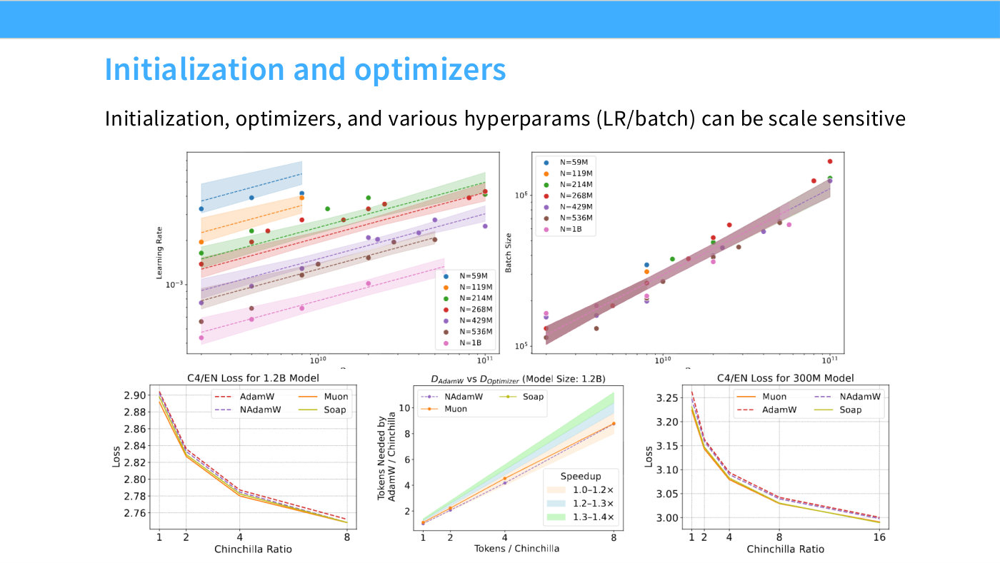

Title (blue): "**Initialization and optimizers**"

Body text: "Initialization, optimizers, and various hyperparams (LR/batch) can be scale sensitive"

Two pasted raster images sit on this page: an upper one holding two panels side by side, and a lower one holding three panels side by side. The lower image is pasted on top of the upper one and its white background covers the bottom sliver of the upper image, so the two upper panels' x-axis labels — each just the single letter "D" — are half-covered on the slide. (Verified against the embedded image itself: the label is "D" in both upper panels, and the occlusion is the overlap of the two pasted rasters, not a truncation in the source.) No citation is printed on this page.

**Figure 1 (upper left) — "Learning Rate" vs. "D", log–log scatter with fitted trend lines and confidence bands.** Y-axis: "Learning Rate", **log** scale (measured: minor ticks at 4,5,6,7,8,9×10⁻⁴ and 2,3,4,5,6,7×10⁻³ with the characteristic compressing spacing, ~270 px per decade); the only labelled tick is $10^{-3}$, and the visible range runs from about $3.4\times10^{-4}$ at the bottom border to about $7.9\times10^{-3}$ at the top. X-axis: "D", **log** scale (measured: 307 px per decade), labelled ticks $10^{10}$ and $10^{11}$, visible range about $1.6\times10^9$ to $1.2\times10^{11}$.

Seven series — exactly the seven entries of the legend (a boxed legend at the lower right of this panel, whose swatches were masked out before the markers were traced): N=59M (blue), N=119M (orange), N=214M (green), N=268M (red), N=429M (purple), N=536M (brown), N=1B (pink). Each series is drawn as filled circular markers plus a dashed straight fit line of the same colour and a translucent band of the same colour around that line. Marker positions, recovered by classifying pixels against the legend swatch RGB and calibrating against the detected ticks:

- **N=59M (blue)** — 3 markers: $(2.0\times10^9,\,3.3\times10^{-3})$, $(4.0\times10^9,\,3.9\times10^{-3})$, $(8.0\times10^9,\,4.2\times10^{-3})$. Highest series on the plot; its band and dashed line sit above all others and stop at about $D=8\times10^9$.
- **N=119M (orange)** — 2 markers: $(2.0\times10^9,\,2.0\times10^{-3})$, $(8.0\times10^9,\,3.9\times10^{-3})$. Second-highest band, also ending at about $8\times10^9$.
- **N=214M (green)** — 5 markers: $(2.0\times10^9,\,1.6\times10^{-3})$, $(4.0\times10^9,\,2.3\times10^{-3})$, $(1.1\times10^{10},\,3.3\times10^{-3})$, $(2.0\times10^{10},\,3.9\times10^{-3})$, $(1.0\times10^{11},\,4.1\times10^{-3})$.
- **N=268M (red)** — 7 markers: $(2.0\times10^9,\,1.4\times10^{-3})$, $(5.0\times10^9,\,2.3\times10^{-3})$, $(8.0\times10^9,\,2.8\times10^{-3})$, $(2.0\times10^{10},\,3.4\times10^{-3})$, $(2.5\times10^{10},\,3.6\times10^{-3})$, $(8.0\times10^{10},\,3.9\times10^{-3})$, $(1.0\times10^{11},\,4.3\times10^{-3})$.
- **N=429M (purple)** — 8 markers: $(2.0\times10^9,\,7.5\times10^{-4})$, $(4.0\times10^9,\,9.8\times10^{-4})$, $(8.0\times10^9,\,1.3\times10^{-3})$, $(2.0\times10^{10},\,2.1\times10^{-3})$, $(2.3\times10^{10},\,2.0\times10^{-3})$, $(4.0\times10^{10},\,2.3\times10^{-3})$, $(5.0\times10^{10},\,2.8\times10^{-3})$, $(1.0\times10^{11},\,2.5\times10^{-3})$.
- **N=536M (brown)** — 6 markers: $(2.0\times10^9,\,5.6\times10^{-4})$, $(8.0\times10^9,\,1.2\times10^{-3})$, $(1.0\times10^{10},\,1.4\times10^{-3})$, $(2.0\times10^{10},\,1.5\times10^{-3})$, $(2.8\times10^{10},\,2.0\times10^{-3})$, $(5.0\times10^{10},\,2.0\times10^{-3})$.
- **N=1B (pink)** — 4 markers: $(2.0\times10^9,\,4.4\times10^{-4})$, $(4.0\times10^9,\,5.8\times10^{-4})$, $(8.0\times10^9,\,6.9\times10^{-4})$, $(2.0\times10^{10},\,1.0\times10^{-3})$. Lowest series on the plot.

Every band slopes upward left-to-right (optimal learning rate grows with $D$), and the seven bands are stacked in strict order of $N$: at a fixed $D\approx2\times10^9$ the LR values run from $3.3\times10^{-3}$ (59M) down to $4.4\times10^{-4}$ (1B), a spread of about 7.5x. Where series overlap at the right of the plot (green/red/purple/brown) some markers sit on top of one another and a few are only partly resolvable.

**Figure 2 (upper right) — "Batch Size" vs. "D", log–log scatter with fitted trend lines and confidence bands.** Y-axis: "Batch Size", **log** scale (measured: 276 px per decade; minor ticks 2–9 within each decade), labelled ticks $10^5$ and $10^6$, visible range about $8.9\times10^4$ to $1.9\times10^6$. X-axis: "D", **log** scale, same calibration as Figure 1, labelled ticks $10^{10}$ and $10^{11}$.

The same seven series as Figure 1, with the same colours and the same legend list (N=59M, 119M, 214M, 268M, 429M, 536M, 1B) — here the legend box sits at the upper left of the panel and it conceals whatever data lies behind it. Measured marker positions (legend swatches masked; several markers are stacked and some are hidden behind others):

- **N=59M (blue)** — 1 visible marker: $(8.0\times10^9,\,3.5\times10^5)$.
- **N=119M (orange)** — 1 visible marker: $(8.0\times10^9,\,3.1\times10^5)$.
- **N=214M (green)** — 3 visible: $(1.1\times10^{10},\,3.8\times10^5)$, $(2.0\times10^{10},\,4.9\times10^5)$, $(1.0\times10^{11},\,1.3\times10^6)$.
- **N=268M (red)** — 5 visible: $(2.0\times10^9,\,1.3\times10^5)$, $(2.0\times10^{10},\,5.3\times10^5)$, $(2.5\times10^{10},\,6.4\times10^5)$, $(8.0\times10^{10},\,1.3\times10^6)$, $(1.0\times10^{11},\,1.7\times10^6)$ — the topmost point on the chart.
- **N=429M (purple)** — 4 visible: $(2.0\times10^9,\,1.6\times10^5)$, $(8.0\times10^9,\,2.0\times10^5)$, $(4.0\times10^{10},\,5.7\times10^5)$, $(1.0\times10^{11},\,1.3\times10^6)$.
- **N=536M (brown)** — 7 visible: $(2.0\times10^9,\,1.1\times10^5)$, $(4.0\times10^9,\,1.3\times10^5)$, $(8.0\times10^9,\,2.0\times10^5)$, $(1.0\times10^{10},\,2.7\times10^5)$, $(2.0\times10^{10},\,3.9\times10^5)$, $(2.9\times10^{10},\,4.6\times10^5)$, $(5.0\times10^{10},\,6.6\times10^5)$.
- **N=1B (pink)** — 4 visible: $(2.0\times10^9,\,1.7\times10^5)$, $(8.0\times10^9,\,2.2\times10^5)$, $(2.0\times10^{10},\,3.6\times10^5)$, $(5.7\times10^{10},\,6.4\times10^5)$.

The seven dashed fit lines and their bands all lie essentially on top of one another here, forming one single dusty-mauve band running diagonally across the panel — unlike Figure 1, where the seven bands are cleanly separated by $N$. Measured at $D\approx2\times10^{10}$ the batch sizes span only about $3.6\times10^5$–$5.3\times10^5$ (roughly 1.5x) across the different $N$, against roughly a 4x spread in learning rate at the same $D$ in Figure 1.

**Figure 3 (lower left) — "C4/EN Loss for 1.2B Model."** Y-axis: "Loss", **linear** (measured: 8 evenly spaced ticks, 33.5 px per 0.02), labelled 2.76, 2.78, 2.80, 2.82, 2.84, 2.86, 2.88, 2.90. X-axis: "Chinchilla Ratio", **linear** (measured: tick pixel gaps 53 / 107 / 213.5 for the intervals 1→2, 2→4, 4→8 — a ratio of 1 : 2 : 4, i.e. linear spacing, *not* a log axis), labelled ticks 1, 2, 4, 8. Dotted grey gridlines on both axes.

Four series, per the two-column legend at the top right (AdamW, NAdamW in the left column; Muon, Soap in the right):
- **AdamW** (red, dashed): 2.902 at ratio 1, 2.838 at 2, 2.787 at 4, 2.753 at 8. Highest (worst) of the four everywhere past ratio 1.
- **NAdamW** (purple, dashed): 2.900 at 1, 2.834 at 2, 2.785 at 4, ≈2.749 at 8 (over the last stretch it is overplotted by the Soap line, which ends at 2.749).
- **Muon** (orange, solid): 2.890 at 1, 2.828 at 2, 2.780 at 4, 2.749 at 8. Lowest (best) of the four over most of the range.
- **Soap** (olive/yellow-green, solid): 2.896 at 1, 2.830 at 2, 2.783 at 4, 2.749 at 8 — a hair above Muon until the two meet at ratio 8.

All four fall monotonically; the whole spread between best and worst is about 0.012 at ratio 1 and about 0.004 at ratio 8.

**Figure 4 (lower middle) — "$D_{AdamW}$ vs $D_{Optimizer}$ (Model Size: 1.2B)."** Y-axis: "Tokens Needed by AdamW / Chinchilla", **linear** (measured: ticks evenly spaced 51.4 px per 2 units), labelled 2, 4, 6, 8, 10. X-axis: "Tokens / Chinchilla", **linear** (measured: tick gaps 54.5 / 108 / 217 for 1→2, 2→4, 4→8, a 1 : 2 : 4 ratio), labelled ticks 1, 2, 4, 8.

Two visible line series with circular markers, plus three shaded reference bands:
- **Muon** (orange, solid, markers): (1, 1.13), (2, 2.24), (4, 4.53), (8, 8.79).
- **NAdamW** (purple, dashed, markers): (1, 0.97), (2, 2.04), (4, 4.18), (8, 8.68) — just below the Muon line throughout.
- **Soap** (olive) appears in the legend but **no olive curve is visible anywhere in the plot area** — a pixel sweep for the olive colour over the whole panel found matches only inside the legend box (its swatch), so the Soap curve is presumably drawn underneath the other two.
- Three translucent wedges, keyed by a second boxed legend headed "**Speedup**" at the lower right: peach "1.0–1.2×", pale blue "1.2–1.3×", pale green "1.3–1.4×". They fan out from the origin region and widen to the right, with the green (1.3–1.4×) wedge uppermost, blue in the middle and peach lowest; both plotted curves run along the lower edge of the peach wedge, i.e. inside the 1.0–1.2× speedup region.

**Figure 5 (lower right) — "C4/EN Loss for 300M Model."** Y-axis: "Loss", **linear** (measured: ticks evenly spaced, 47.7 px per 0.05), labelled 3.00, 3.05, 3.10, 3.15, 3.20, 3.25. X-axis: "Chinchilla Ratio", **linear** (measured: tick gaps 25 / 49.5 / 100 / 199.5 for 1→2, 2→4, 4→8, 8→16, a 1 : 2 : 4 : 8 ratio), labelled ticks 1, 2, 4, 8, 16. Dotted grey gridlines.

Four series, same colour scheme and the same four names as Figure 3 (legend at top, two columns: Muon and AdamW at left, NAdamW and Soap at right):
- **AdamW** (red, dashed): 3.259 at ratio 1, 3.164 at 2, 3.095 at 4, 3.044 at 8, 3.001 at 16 — the highest curve throughout.
- **NAdamW** (purple, dashed): 3.244 at 1, 3.161 at 2, 3.092 at 4, 3.039 at 8, 2.998 at 16.
- **Soap** (olive, solid): 3.226 at 1, 3.150 at 2, 3.084 at 4, 3.030 at 8, 2.990 at 16.
- **Muon** (orange, solid): 3.220 at 1, 3.145 at 2, 3.081 at 4, ≈3.029 at 8, 2.992 at 16 — lowest over most of the range, with Soap essentially on top of it and dipping fractionally below at ratio 16.

Taken together, the five panels back the slide's single line of text: the top pair shows the fitted optimum for learning rate separating sharply by model size $N$ while the fitted optimum for batch size does not, and the bottom trio shows the choice of optimizer (Muon / Soap / NAdamW / AdamW) moving the loss-vs-Chinchilla-ratio curve by a small but consistent margin at both 300M and 1.2B.

## Slide 5 — Working through some detailed, public scaling recipes

Title (blue): "**Working through some detailed, public scaling recipes**"

A numbered list:
1. MiniCPM
2. DeepSeek

**Figure — two pasted paper headers (screenshots), one beside each list item.**

- Beside item 1: a horizontal rule, then "**MiniCPM: Unveiling the Potential of Small Language Models with Scalable Training Strategies**", the same author block as on slide 3 ("Shengding Hu$^1$, Yuge Tu$^2$, Xu Han$^1$; Chaoqun He$^1$, Ganqu Cui$^1$, Xiang Long$^2$, Zhi Zheng$^2$, Yewei Fang$^2$, Yuxiang Huang$^1$, Weilin Zhao$^1$, Xinrong Zhang$^1$, Zheng Leng Thai$^1$, Kaihuo Zhang$^2$, Chongyi Wang$^2$, Yuan Yao$^1$, Chenyang Zhao$^1$, Jie Zhou$^2$, Jie Cai$^2$, , Zhongwu Zhai$^2$, Ning Ding$^1$, Chao Jia$^2$, Guoyang Zeng$^2$, Dahai Li$^2$, Zhiyuan Liu$^{1*}$, Maosong Sun$^1$"), the affiliations "$^1$Department of Computer Science and Technology, Tsinghua University." / "$^2$Modelbest Inc.", and "shengdinghu@gmail.com".
- Beside item 2: the deepseek logo (blue whale + "deepseek"), a horizontal rule, then "**DeepSeek LLM** / **Scaling Open-Source Language Models with Longtermism**".

No chart or table on this page.

## Slide 6 — MiniCPM

Title (blue): "**MiniCPM**"

Body text: "MiniCPM (2024) – small, high-perf LM from Tsinghua group."

**Figure — pasted screenshot of the MiniCPM paper's title block**, in a thin grey-bordered frame in the middle of the slide: a horizontal rule, then "**MiniCPM: Unveiling the Potential of Small Language Models with Scalable Training Strategies**", then the author list "Shengding Hu$^1$, Yuge Tu$^2$, Xu Han$^1$; Chaoqun He$^1$, Ganqu Cui$^1$, Xiang Long$^2$, Zhi Zheng$^2$, Yewei Fang$^2$, Yuxiang Huang$^1$, Weilin Zhao$^1$, Xinrong Zhang$^1$, Zheng Leng Thai$^1$, Kaihuo Zhang$^2$, Chongyi Wang$^2$, Yuan Yao$^1$, Chenyang Zhao$^1$, Jie Zhou$^2$, Jie Cai$^2$, , Zhongwu Zhai$^2$, Ning Ding$^1$, Chao Jia$^2$, Guoyang Zeng$^2$, Dahai Li$^2$, Zhiyuan Liu$^{1*}$, Maosong Sun$^1$", the affiliations "$^1$Department of Computer Science and Technology, Tsinghua University." / "$^2$Modelbest Inc.", and "shengdinghu@gmail.com". (The same screenshot used on slides 3 and 5.)

Two lines of body text below the frame:
"Careful, extensive scaling computations + muP to stabilize and simplify scaling"
"Not really 'sota' model (even in 2024) but many interesting lessons on scaling"

No chart on this page.

## Slide 7 — MiniCPM

Title (blue): "**MiniCPM**"

Body text: "High performance 1-2.5 B parameter models. These models beat most out 2Bs and match many modern 7B models." *(the deck's own wording, "beat most out 2Bs", transcribed as printed)*

**Table — pasted benchmark table from the MiniCPM paper, no caption or number printed on the slide.** Seven benchmark columns; models are grouped by four horizontal rules into a 7B block, a 13B–40B block, a ~1–3B block, and the two MiniCPM rows at the bottom. Bold cells in the source are marked **bold** here; a dash "-" is the source's own "not reported" mark.

| Model | C-Eval | CMMLU | MMLU | HumanEval | MBPP | GSM8K | MATH |
| --- | --- | --- | --- | --- | --- | --- | --- |
| Llama2-7B | 32.42 | 31.11 | 44.32 | 12.20 | 27.17 | 13.57 | 1.80 |
| Qwen-7B | 58.96 | 60.35 | 57.65 | 17.07 | 42.15 | 41.24 | 5.34 |
| Deepseek-7B | 42.82 | 44.45 | 47.82 | 20.12 | 41.45 | 15.85 | 1.53 |
| Mistral-7B | 46.12 | 42.96 | 62.69 | 27.44 | 45.20 | 33.13 | 5.00 |
| Gemma-7B | 42.57 | 44.20 | 60.83 | 38.41 | 50.12 | 47.31 | 6.18 |
| Llama2-13B | 37.32 | 37.06 | 54.71 | 17.07 | 32.55 | 21.15 | 2.25 |
| MPT-30B | 29.34 | 32.09 | 46.56 | 21.95 | 35.36 | 10.31 | 1.56 |
| Falcon-40B | 40.29 | 41.57 | 53.53 | 24.39 | 36.53 | 22.44 | 1.92 |
| TinyLlama-1.1B | 25.02 | 24.03 | 24.3 | 6.71 | 19.91 | 2.27 | 0.74 |
| Qwen-1.8B | 49.81 | 45.32 | 43.37 | 7.93 | 17.8 | 19.26 | 2.42 |
| Qwen1.5-1.8B | **55.00** | 50.85 | 43.81 | 5.49 | 24.82 | 26.16 | 3.25 |
| Gemini Nano-3B | - | - | - | - | 27.20 | 22.80 | - |
| StableLM-Zephyr-3B | 30.34 | 30.89 | 45.90 | 35.37 | 31.85 | 52.54 | 12.12 |
| Phi-2(2B) | 23.37 | 24.18 | 52.66 | 47.56 | **55.04** | **57.16** | 3.50 |
| Gemma-2B | 29.26 | 28.56 | 38.49 | 24.39 | 29.74 | 16.83 | 3.34 |
| **MiniCPM-1.2B** | 49.14 | 46.81 | 49.63 | 44.51 | 32.75 | 31.77 | 10.60 |
| **MiniCPM-2.4B** | 51.13 | **51.07** | **53.46** | **50.00** | 47.31 | 53.83 | **10.24** |

(Note: the two MiniCPM row labels are bold in the source. The bolded cell values are: C-Eval 55.00 for Qwen1.5-1.8B; MBPP 55.04 and GSM8K 57.16 for Phi-2(2B); CMMLU 51.07, MMLU 53.46, HumanEval 50.00 and MATH 10.24 for MiniCPM-2.4B. There is no average or total row.)

## Slide 8 — Techique 1: muP to stabilize scaling

Title (blue): "**Techique 1: muP to stabilize scaling**" *(the deck's own spelling of "Technique", kept as printed)*

Body text: "Scale_emb = 12, scale_depth = 1.4, init_std = 0.1, lr =0.01"

**Table — pasted "Table 7" from the MiniCPM paper**, in a grey-bordered frame. Two columns; the source's own caption sits beneath it.

| Name | Specific Operation |
| --- | --- |
| Embedding Output Scaling | Multiply the output of the embedding by $scale\_emb$ |
| Residual Connection Scaling | Scale the increment at each residual connection in each layer by $scale\_depth/\sqrt{\text{num\_layers}}$ |
| Initialization of Tensors | Set the initialization standard deviation of each two-dimensional tensor parameter to $init\_std/\sqrt{d_m/d_{base}}$, and set other parameters' initialization to 0.1 |
| Learning Rate Scaling of Tensors | Adjust the learning rate of each two-dimensional tensor parameter to $1/(d_m/d_{base})$ times the learning rate of other parts (or the overall learning rate) |
| LM Head Scaling | Adjust the output logits to $1/(d_m/d_{base})$ times the original value |

Caption printed below the table (part of the pasted image): "Table 7: List of operations used when applying tensor program techniques."

No chart on this page.

## Slide 9 — Scaling recipe / strategy

Title (blue): "**Scaling recipe / strategy**"

Body text: "Use muP for initialization, fix the aspect ratio, scale up the overall model size."

**Table — pasted model-configuration table from the MiniCPM paper, no caption printed.** Columns: Name, N (B), $d_m$, $d_{ff}$, $d_h$, $n_h$, $L$. Seven rows, one per model size in the scaling sweep.

| Name | N (B) | $d_m$ | $d_{ff}$ | $d_h$ | $n_h$ | $L$ |
| --- | --- | --- | --- | --- | --- | --- |
| 9M | 0.009 | 320 | 800 | 64 | 5 | 8 |
| 30M | 0.036 | 512 | 1280 | 64 | 8 | 12 |
| 70M | 0.066 | 640 | 1600 | 64 | 10 | 14 |
| 0.1B | 0.109 | 768 | 1920 | 64 | 12 | 16 |
| 0.17B | 0.166 | 896 | 2240 | 64 | 14 | 18 |
| 0.2B | 0.241 | 1024 | 2560 | 64 | 16 | 20 |
| 0.5B | 0.499 | 1344 | 3360 | 64 | 21 | 24 |

(No average or total row. $d_h$ is 64 in every row — the fixed head dimension — while $d_{ff}$ is exactly $2.5\times d_m$ in every row, which is the "fixed aspect ratio" the slide's text refers to.)

Two further lines of body text below the table:
"Note that the gap between the largest model here and the actual model they train is ~5x"
"Optimal batch, LR, token-to-size ratios are directly fitted via scaling analysis"

## Slide 10 — Optimal LR

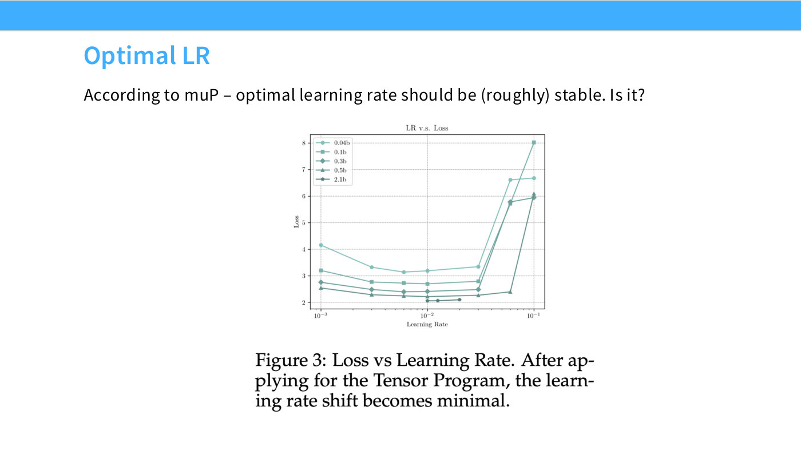

Title (blue): "**Optimal LR**"

Body text: "According to muP – optimal learning rate should be (roughly) stable. Is it?"

**Figure — "LR v.s. Loss," a pasted line chart with its own caption.** Y-axis: "Loss", **linear** scale (measured: 7 evenly spaced ticks, 72.8 px apart), labelled 2, 3, 4, 5, 6, 7, 8. X-axis: "Learning Rate", **log** scale (measured: 291 px per decade, with the minor ticks compressing within each decade in the log pattern), labelled ticks $10^{-3}$, $10^{-2}$, $10^{-1}$.

Five series, exactly the five entries of the boxed legend at the upper left, drawn in a teal colour ramp from light (smallest model) to dark (largest) and each with its own marker shape. Values were recovered by matching pixels to the legend swatch RGB with the legend box masked out, and calibrating against the detected ticks:

- **0.04b** (lightest teal, circle markers) — 7 points: 4.16 at LR $10^{-3}$, 3.33 at $3\times10^{-3}$, 3.15 at $6\times10^{-3}$, 3.19 at $10^{-2}$, 3.35 at $3\times10^{-2}$, 6.62 at $6\times10^{-2}$, 6.68 at $10^{-1}$. Minimum at $6\times10^{-3}$. Highest curve of the five over the low-LR half of the plot.
- **0.1b** (light teal, square markers) — 6 points: 3.21 at $10^{-3}$, 2.78 at $3\times10^{-3}$, 2.74 at $6\times10^{-3}$, 2.70 at $10^{-2}$, 2.80 at $3\times10^{-2}$, and then 8.03 at $10^{-1}$ — the highest point plotted anywhere on the chart. There is **no marker at $6\times10^{-2}$ for this series**; its line runs straight from $3\times10^{-2}$ to $10^{-1}$. Minimum at $10^{-2}$.
- **0.3b** (mid teal, diamond markers) — 7 points: 2.76, 2.49, 2.41, 2.42, 2.49 at the same first five learning rates, then 5.78 at $6\times10^{-2}$ and 5.95 at $10^{-1}$. Minimum at $6\times10^{-3}$.
- **0.5b** (dark teal, triangle markers) — 7 points: 2.54, 2.29, 2.24, 2.22, 2.27, then 2.41 at $6\times10^{-2}$ and 6.04 at $10^{-1}$. Minimum at $10^{-2}$. This series stays flat out to $6\times10^{-2}$ and only blows up on the final segment, unlike 0.04b/0.1b/0.3b which have already blown up by $6\times10^{-2}$.
- **2.1b** (darkest teal, pentagon markers) — only **3 points**, all clustered near the bottom of the plot: 2.06 at $10^{-2}$, 2.07 at about $1.25\times10^{-2}$, 2.11 at $2\times10^{-2}$. It is the lowest curve on the chart and is not swept across the full LR range.

The five dashed grey gridlines are gridlines, not series. Read against the axes, the loss-minimising learning rate for all five models sits in the narrow band $6\times10^{-3}$ to $10^{-2}$ — which is the point of the slide, and matches the "lr = 0.01" printed on slide 8. The vertical spread between the curves is a model-size effect on the achieved loss (4.16 down to 2.06 at the same LR), not a shift in where the minimum sits.

Caption printed below the chart (part of the pasted image, in the paper's own serif type): "Figure 3: Loss vs Learning Rate. After applying for the Tensor Program, the learning rate shift becomes minimal."

## Slide 11 — Optimal batch

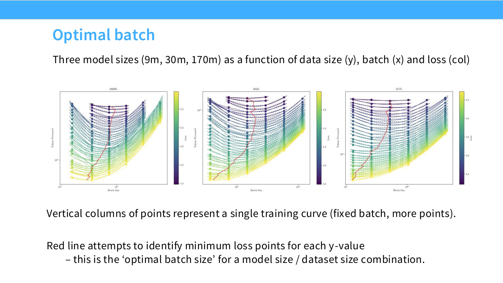

Title (blue): "**Optimal batch**"

Body text: "Three model sizes (9m, 30m, 170m) as a function of data size (y), batch (x) and loss (col)"

**Figure — three side-by-side scatter/contour panels, one per model size, each with its own vertical "Loss" colourbar.** The three panels share the same layout: y-axis "Tokens Processed" (**log** scale — the single tick label on each is written as a power of ten), x-axis "Batch Size" (**log** scale — verified below), and a viridis colourbar labelled "Loss" running dark purple (low loss) at the bottom to yellow (high loss) at the top. Panel titles, as printed: "0009b", "003b", "017b" — i.e. the 0.009B (9M), 0.03B (30M) and 0.17B (170M) models named in the slide's own text.

Only two ticks are drawn on each x-axis and one on each y-axis; the x-axis being log was confirmed by measurement rather than by eye — the labelled decade is 199 px wide in panel 1 and 216 px in panels 2 and 3, and the columns of markers sit at a constant pixel spacing of about 60–65 px, i.e. exactly one factor-of-two step per column on a log axis.

- **Panel 1 — "0009b" (9M).** X-axis "Batch Size" labelled $10^4$ and $10^5$. The panel's **left border is exactly $10^4$** — the labelled tick sits on the spine — and its right border is about $7.9\times10^5$; the plotted *data* begins a little inside the border, at about $1.4\times10^4$. Y-axis "Tokens Processed" with a single labelled tick, $10^8$, sitting about a quarter of the way up from the bottom. Colourbar "Loss" ticked 4.4, 4.6, 4.8, 5.0, 5.2, with dark purple at 4.4 and the top of the bar (yellow) above 5.2. Six marker columns, at batch sizes of $1.66\times10^4$, $3.65\times10^4$, $7.40\times10^4$, $1.47\times10^5$, $2.91\times10^5$ and $5.9\times10^5$ — a doubling apart for five of the six steps; the first gap is 68 px rather than ~60, i.e. a factor of about 2.2.
- **Panel 2 — "003b" (30M).** X-axis labelled $10^5$ and $10^6$. Y-axis single tick $10^9$, sitting high in the panel (about 80% of the way up). Colourbar ticked 3.8, 4.0, 4.2, 4.4, 4.6. Six marker columns at roughly $3.7\times10^4$, $7.4\times10^4$, $1.5\times10^5$, $3\times10^5$, $5.9\times10^5$ and $1.2\times10^6$.
- **Panel 3 — "017b" (170M).** X-axis labelled $10^5$ and $10^6$, with the $10^5$ tick sitting on the left spine, so that border is exactly $10^5$. Y-axis single tick $10^9$, about a third of the way up. Colourbar ticked 3.4, 3.6, 3.8, 4.0, 4.2. Six marker columns at roughly $1.3\times10^5$, $2.6\times10^5$, $5.2\times10^5$, $1.0\times10^6$, $2.1\times10^6$ and $4.2\times10^6$.

Within each panel the markers form those six vertical columns (the slide's own text: "Vertical columns of points represent a single training curve (fixed batch, more points)"), coloured by loss — yellow (high loss) low in the panel, darkening to purple (low loss) as tokens processed increases. Threaded through the columns is a dense family of U-shaped curves, each running from upper-left down to a minimum and back up to upper-right, drawn as solid lines shadowed by dashed lines of the same colour; a vertical scan across the widest part of panel 1 separates 29 distinct strands, so there are on the order of 30 such curves per panel. There is no legend distinguishing the solid from the dashed curves.

**The red line.** Exactly one series in each panel is red: a single connected polyline running from lower-left to upper-right, drawn on top of everything else. It is not a marker series and it has no legend entry — it is the slide's own annotation, described in the body text below the figure. Traced against the axes:
- Panel 1: from batch $\approx3.07\times10^4$ at its bottom end up to a peak of $\approx9.3\times10^4$, then drifting back left to $\approx8.6\times10^4$ at the very top, with a small kink near the bottom.
- Panel 2: from batch $\approx4.5\times10^4$ at the bottom to $\approx2.0\times10^5$ at the top, wobbling between about $1.5\times10^5$ and $2.0\times10^5$ over the top third.
- Panel 3: from batch $\approx1.30\times10^5$ at the bottom to $\approx5.2$–$5.6\times10^5$ over the top third, again flattening out there.
In all three panels the red line rises monotonically overall: the more tokens processed, the larger the loss-minimising batch.

Two further lines of body text below the figure:
"Vertical columns of points represent a single training curve (fixed batch, more points)."
"Red line attempts to identify minimum loss points for each y-value / – this is the 'optimal batch size' for a model size / dataset size combination." (printed as two lines, the second indented)

## Slide 12 — Optimal batch size

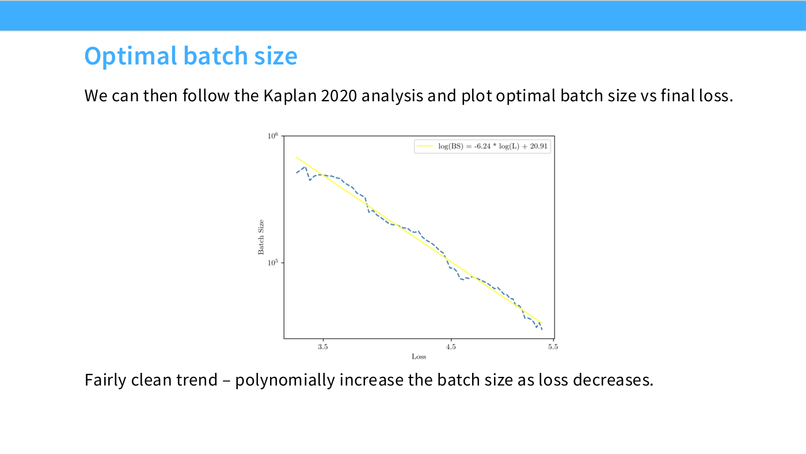

Title (blue): "**Optimal batch size**"

Body text: "We can then follow the Kaplan 2020 analysis and plot optimal batch size vs final loss."

**Figure — "Batch Size" vs. "Loss," a log–log chart with a fitted power law.** Y-axis: "Batch Size", **log** scale (measured: 320.75 px per decade), labelled ticks $10^5$ and $10^6$; the plotted range runs from $10^6$ at the top border down to about $2.5\times10^4$ at the bottom. X-axis: "Loss", **also log** — this is not obvious and was measured: the labelled ticks 3.5, 4.5 and 5.5 are 325 px and 260 px apart, an unequal spacing whose ratio (1.25) matches $\log(4.5/3.5)/\log(5.5/4.5)=1.251$ exactly, and rules out a linear axis. The plotted range runs from loss ≈3.24 at the left border to ≈5.54 at the right. Note that loss *increases* left to right, so batch size falls left to right.

Two series:
- **Yellow solid line — the fit.** Its legend entry, in a box at the top right, reads: "log(BS) = -6.24 \* log(L) + 20.91". A perfectly straight line on these log–log axes, running from about (loss 3.31, batch $6.8\times10^5$) at the upper left to about (loss 5.39, batch $3.3\times10^4$) at the lower right. Read off at the labelled losses: $4.9\times10^5$ at loss 3.5, $2.1\times10^5$ at 4.0, $1.02\times10^5$ at 4.5, $5.3\times10^4$ at 5.0, $3.3\times10^4$ at 5.4. (These match the printed formula when the logs are natural logs — e.g. $e^{-6.24\ln 3.5+20.91}=4.9\times10^5$ — so the printed exponent −6.24 is the log–log slope of this line.)
- **Blue dashed line — the measured optimal batch sizes.** It runs alongside the yellow fit over the whole width, crossing it repeatedly rather than sitting consistently to one side: $4.9\times10^5$ at loss 3.5 (on top of the fit), $3.5\times10^5$ at 3.75 (above), $2.0\times10^5$ at 4.0 (below), $1.65\times10^5$ at 4.25 (above), $9.4\times10^4$ at 4.5 (below), $7.4\times10^4$ at 4.75 (on it), $5.6\times10^4$ at 5.0 (above), $3.6\times10^4$ at 5.25 (below), ending at about (5.38, $3.0\times10^4$). Its excursions from the fit are visible but small — at most roughly ±15% in batch size — and it shows a pronounced flat step around loss 4.6–4.8 and a dip just past loss 4.2.

Only these two series are present; there is no marker series and no third line. There is no chart title.

Body text below the figure: "Fairly clean trend – polynomially increase the batch size as loss decreases."

That reading is consistent with the data: batch size falls monotonically as loss rises, i.e. rises as loss falls, along a straight line on log–log axes — a power law with exponent −6.24, so the optimal batch grows very steeply (roughly as $L^{-6.2}$) as the loss target gets smaller.

## Slide 13 — What remains – model size vs data tradeoffs.

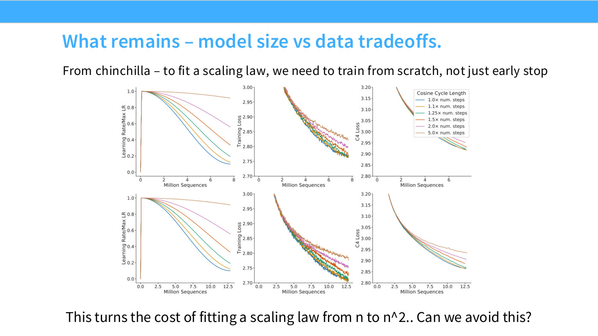

Heading: "What remains – model size vs data tradeoffs."

Body line above the figure: "From chinchilla – to fit a scaling law, we need to train from scratch, not just early stop"

Body line below the figure: "This turns the cost of fitting a scaling law from n to n^2.. Can we avoid this?"

**Figure 1 — a six-panel grid (2 rows × 3 columns) of cosine-schedule ablations: learning-rate shape, training loss and C4 loss against training progress, one series per cosine cycle length.** A single legend, headed "Cosine Cycle Length", sits inside the top-right panel and gives **six** series (six, not more — the six legend entries are the only series in every panel):

| legend entry | colour |
| --- | --- |
| 1.0× num. steps | blue (RGB 23,103,169) |
| 1.1× num. steps | amber/orange (214,133,7) |
| 1.25× num. steps | green-teal (29,147,103) |
| 1.5× num. steps | burnt orange (203,86,9) |
| 2.0× num. steps | orchid/magenta (195,110,181) |
| 5.0× num. steps | tan/brown (193,135,86) |

The two rows are the same six-series experiment run to two different total lengths: the top row's data stops at ≈7.7 million sequences (x-axis drawn to 8), the bottom row's at ≈12.8 million (x-axis drawn to 12.5+). Both rows use identical y-axes per column. All series identities below were assigned by matching plotted pixels against the legend swatch RGBs, with the legend's bounding box masked out first.

**Every axis on this figure is linear** — measured, not judged by eye. Column 1's y-ticks (0.0…1.0) sit exactly 51.0 px apart in both rows. Column 2's seven y-ticks (3.00…2.70) sit 47.0, 46.5, 47.0, 46.5, 46.5, 47.0 px apart — flat, with no monotone trend; a log-scaled axis over 3.00→2.70 would have produced a monotone 45→49 px progression. Column 3's nine y-ticks (3.20…2.80) give equal 70–71 px double-spacings where a log axis would have given a monotone 67→74 px progression. The x-axes are likewise even (73.6 px per 2 units in the top row, 55.2 px per 2.5 units in the bottom row).

- **Column 1 — y-axis "Learning Rate/Max LR" (linear, ticks 0.0, 0.2, 0.4, 0.6, 0.8, 1.0), x-axis "Million Sequences".** All six series share a single near-vertical warmup at the far left, rising from 0 to 1.0 within roughly the first 0.15M sequences (the six overplot exactly there, and only the tan curve, drawn last, is visible on the ramp). After the peak each series follows a cosine decay whose cycle length is its legend label, and each flattens toward a floor of ≈0.10 of max LR rather than 0 (the 1.0× curve ends at 0.102, decelerating — consistent with a 10 %-of-max floor, not a decay to zero).
  - Top row, LR/Max LR at x = 1, 2, 3, 4, 5, 6, 7 and at the last plotted point (≈7.65):
    - 1.0× (blue): 0.97, 0.87, 0.72, 0.54, 0.36, 0.21, 0.12, **0.102**
    - 1.1× (orange): 0.98, 0.89, 0.76, 0.61, 0.44, 0.29, 0.17, **0.126**
    - 1.25× (green): 0.98, 0.92, 0.81, 0.68, 0.54, 0.39, 0.26, **0.196**
    - 1.5× (burnt orange): 0.99, 0.94, 0.87, 0.77, 0.65, 0.53, 0.41, **0.337**
    - 2.0× (magenta): 0.99, 0.97, 0.92, 0.86, 0.79, 0.71, 0.62, **0.561**
    - 5.0× (tan): 1.00, 1.00, 0.99, 0.98, 0.97, 0.95, 0.93, **0.918**
  - Bottom row, LR/Max LR at x = 2, 4, 6, 8, 10, 12 and at the last plotted point (≈12.8):
    - 1.0× (blue): 0.95, 0.81, 0.61, 0.39, 0.21, 0.11, **0.100**
    - 1.1× (orange): 0.96, 0.84, 0.66, 0.46, 0.28, 0.15, **0.124**
    - 1.25× (green): 0.97, 0.87, 0.73, 0.56, 0.39, 0.24, **0.194**
    - 1.5× (burnt orange): 0.98, 0.91, 0.81, 0.67, 0.53, 0.38, **0.331**
    - 2.0× (magenta): 0.99, 0.95, 0.89, 0.80, 0.71, 0.60, **0.555**
    - 5.0× (tan): 1.00, 0.99, 0.98, 0.97, 0.95, 0.93, **0.918**
- **Column 2 — y-axis "Training Loss" (linear, 3.00 down to 2.70 in 0.05 steps), x-axis "Million Sequences".** All six curves are noisy (visible jitter of roughly ±0.005) and all enter the panel at the 3.00 top clip, at x ≈ 2.1–2.3 (top row) and x ≈ 2.2–2.7 (bottom row); nothing is plotted left of that because the loss is above 3.00 there.
  - Top row, Training Loss at x = 3, 4, 5, 6, 7 and at the last point (≈7.65):
    - 1.0× (blue): 2.931, 2.875, 2.831, 2.804, 2.776, **2.764**
    - 1.1× (orange): 2.934, 2.880, 2.838, 2.802, 2.778, **2.764**
    - 1.25× (green): 2.940, 2.886, 2.844, 2.811, 2.780, **2.766**
    - 1.5× (burnt orange): 2.939, 2.891, 2.850, 2.821, 2.794, **2.775**
    - 2.0× (magenta): 2.941, 2.900, 2.862, 2.834, 2.813, **2.799**
    - 5.0× (tan): 2.946, 2.903, 2.871, 2.847, 2.833, **2.822**
  - Bottom row, Training Loss at x = 5, 7, 9, 11 and at the last point (≈12.8):
    - 1.0× (blue): 2.853, 2.800, 2.757, 2.724, **2.712**
    - 1.1× (orange): 2.855, 2.806, 2.766, 2.730, **2.709**
    - 1.25× (green): 2.858, 2.815, 2.773, 2.740, **2.713**
    - 1.5× (burnt orange): 2.867, 2.822, 2.784, 2.757, **2.729**
    - 2.0× (magenta): 2.872, 2.829, 2.799, 2.771, **2.754**
    - 5.0× (tan): 2.878, 2.838, 2.815, 2.794, **2.786**
- **Column 3 — y-axis "C4 Loss" (linear, 3.20 down to 2.80 in 0.05 steps), x-axis "Million Sequences".** These are smooth (evaluated at intervals, not per step). In the **top-right** panel the opaque white legend box sits over the middle of the data, so each of the six curves is visible only as two arcs — roughly x ≈ 1.6–3.1 on the left of the legend and x ≈ 5–7.5 below/right of it — with the span behind the legend hidden. (This is genuine occlusion by the legend box drawn on top of the axes, not a crop of the source image.) The bottom-right panel has no legend and shows the curves unbroken.
  - Top row, C4 Loss: all six enter at the 3.20 clip around x ≈ 1.6–2.5 and converge to ≈3.075–3.085 at x ≈ 3.1 where the legend cuts them off. On the right of the legend, at the last plotted point (x ≈ 7.3–7.5): 1.1× (orange) **2.917**, 1.0× (blue) **2.921**, 1.25× (green) **2.925**, 1.5× (burnt orange) **2.931**, 5.0× (tan) **2.931**, 2.0× (magenta) **2.954**.
  - Bottom row, C4 Loss at x = 4, 6, 8, 10, 12 and at the last point (≈12.6):
    - 1.0× (blue): 3.039, 2.976, 2.929, 2.891, — , **2.866**
    - 1.1× (orange): — , 2.980, 2.934, 2.897, 2.869, **2.864**
    - 1.25× (green): 3.042, 2.985, 2.942, 2.907, 2.876, **2.869**
    - 1.5× (burnt orange): — , 2.991, 2.953, 2.923, 2.893, **2.887**
    - 2.0× (magenta): 3.047, 2.995, 2.962, 2.936, 2.913, **2.906**
    - 5.0× (tan): 3.049, 3.002, 2.974, 2.945, 2.928, **2.936**

The ordering is the same in every loss panel and in both rows: **the shorter the cosine cycle, the lower the loss at the end of the run**, with 1.0× and 1.1× essentially tied for best, 1.25× just behind, and 5.0× clearly worst (a gap of ≈0.06 in training loss and ≈0.07 in C4 loss at the end of the top row). Equivalently, the loss reached at step $n$ by a run whose cosine cycle was set to $n$ is *not* recoverable by reading off an intermediate point of a longer-cycle run — which is exactly the slide's claim that a scaling law has to be fit from separate from-scratch runs rather than by early-stopping one long run, taking the cost from $n$ to $n^2$.

## Slide 14 — (partial) solution in miniCPM – WSD learning rate

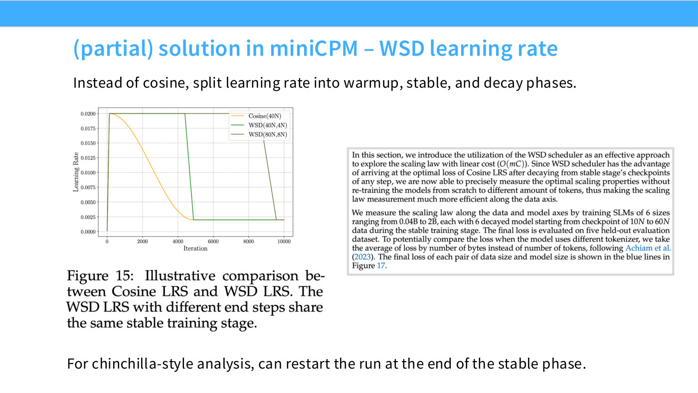

Heading: "(partial) solution in miniCPM – WSD learning rate"

Body line under the heading: "Instead of cosine, split learning rate into warmup, stable, and decay phases."

Body line at the foot of the page: "For chinchilla-style analysis, can restart the run at the end of the stable phase."

The body of the page is two pasted images side by side: the MiniCPM paper's Figure 15 (left, with its caption) and a two-paragraph excerpt of the paper's text (right).

**Figure 1 (left) — pasted reproduction of the MiniCPM paper's "Figure 15": learning-rate schedule shapes, Cosine vs. WSD.** Y-axis "Learning Rate", **linear** (measured: the nine labelled ticks 0.0000, 0.0025, 0.0050, 0.0075, 0.0100, 0.0125, 0.0150, 0.0175, 0.0200 sit 46.5, 46.5, 46.5, 46.5, 46.5, 46.5, 47.0, 46.5 px apart — even). X-axis "Iteration", **linear**, ticks 0, 2000, 4000, 6000, 8000, 10000 at even 111.4 px spacings. Dotted grey gridlines at every labelled tick. **Three** series, per the legend in the top-right corner:

- **Cosine(40N)** (amber/orange, RGB 255,173,24): shares the warmup, then decays as a cosine from 0.0200 at iteration ≈130 down to a floor of **0.0020** which it reaches at iteration ≈4850 — the amber curve is not drawn beyond that point. Sampled values: 0.0197 at iteration 500, 0.0185 at 1000, 0.0139 at 2000, 0.0081 at 3000, 0.0034 at 4000, 0.0029 at 4200, 0.0024 at 4400, 0.0022 at 4600, 0.0020 at 4800.
- **WSD(40N,4N)** (mid green, RGB 13,135,15): warmup, then flat ("stable") at 0.0200 until iteration ≈4400, then a straight linear decay to 0.0020 by iteration ≈4930 (0.0198 at 4400, 0.0124 at 4600, 0.0051 at 4800, 0.0020 at 5000), then flat at 0.0020 for the rest of the panel.
- **WSD(80N,8N)** (dark olive green, RGB 79,96,28): warmup, then flat at 0.0200 until iteration ≈8600, then a straight linear decay to 0.0020 by iteration ≈9550 (measured points: 0.0147 at 8878, 0.0133 at 8950, 0.0119 at 9022, 0.0106 at 9093, 0.0092 at 9165, 0.0079 at 9237, 0.0066 at 9309, 0.0052 at 9381, 0.0038 at 9452, 0.0025 at 9524), then flat at 0.0020 to the right edge.

All three schedules share one identical warmup: a near-vertical ramp from 0 to 0.0200 over roughly the first 130 iterations. Because the three lines overplot exactly during the warmup and during the shared stable phase, only the last-drawn colour is visible there — the warmup spike and the top flat line both render dark olive (the WSD(80N,8N) colour), and the WSD(40N,4N) line is hidden underneath. Likewise the flat 0.0020 tail from ≈9550 to the right edge renders olive with the green line beneath it. The opaque white legend box covers the top-right of the plot area (roughly iteration 6870 onward, learning rate 0.0156 and above), so the olive stable line disappears behind it and re-emerges partway down its decay — legend occlusion, not a truncation of the image. Notice that the two WSD decay lengths are each about 10 % of their run (≈530 of ≈4930 iterations; ≈950 of ≈9550), and that the two WSD runs are identical up to iteration ≈4400 — which is the caption's point.

Caption printed beneath the figure (the paper's own): "Figure 15: Illustrative comparison between Cosine LRS and WSD LRS. The WSD LRS with different end steps share the same stable training stage."

**Figure 2 (right) — pasted two-paragraph excerpt from the MiniCPM paper.** Transcribed in full (blue text marks the paper's own hyperlinks):

"In this section, we introduce the utilization of the WSD scheduler as an effective approach to explore the scaling law with linear cost ($O(mC)$). Since WSD scheduler has the advantage of arriving at the optimal loss of Cosine LRS after decaying from stable stage's checkpoints of any step, we are now able to precisely measure the optimal scaling properties without re-training the models from scratch to different amount of tokens, thus making the scaling law measurement much more efficient along the data axis."

"We measure the scaling law along the data and model axes by training SLMs of 6 sizes ranging from 0.04B to 2B, each with 6 decayed model starting from checkpoint of $10N$ to $60N$ data during the stable training stage. The final loss is evaluated on five held-out evaluation dataset. To potentially compare the loss when the model uses different tokenizer, we take the average of loss by number of bytes instead of number of tokens, following Achiam et al. (2023). The final loss of each pair of data size and model size is shown in the blue lines in Figure 17."

## Slide 15 — WSD learning rates work well in miniCPM

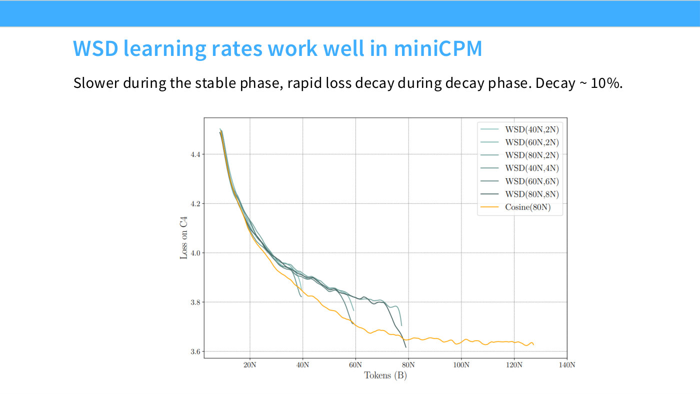

Heading: "WSD learning rates work well in miniCPM"

Body line: "Slower during the stable phase, rapid loss decay during decay phase. Decay ~ 10%."

**Figure 1 — C4 loss against tokens, for six WSD schedules and one cosine baseline.** Y-axis "Loss on C4", **linear** (measured: the five labelled ticks 4.4, 4.2, 4.0, 3.8, 3.6 sit exactly 134.0, 134.0, 134.0, 134.0 px apart; a log-scaled axis over 4.4→3.6 would have produced a monotone 125→145 px progression, so this is definitely linear). X-axis "Tokens (B)", **linear**, with tick labels written in units of $N$: 20N, 40N, 60N, 80N, 100N, 120N, 140N, at even 143.7 px spacings. Dotted grey gridlines at every tick. Plotted y-range ≈3.57 to 4.55; all series begin at ≈8.4N tokens at a loss of ≈4.49 (the area left of that is empty).

**Seven** series, per the legend in the top-right corner. The six WSD entries are drawn in a single teal ramp that runs light-to-dark in legend order, which makes them very hard to separate; every identification below was made by matching pixels against the exact legend swatch RGBs (residuals of 5–12 out of 765), with the legend box masked, and cross-checked at columns where all six lines are individually resolvable (e.g. native column x = 450–455, where the six stack cleanly in the order given).

| legend entry | colour (RGB) |
| --- | --- |
| WSD(40N,2N) | lightest teal (131,191,185) |
| WSD(60N,2N) | (120,175,170) |
| WSD(80N,2N) | (109,159,154) |
| WSD(40N,4N) | (98,143,138) |
| WSD(60N,6N) | (87,126,123) |
| WSD(80N,8N) | darkest teal (65,94,92) |
| Cosine(80N) | orange (255,165,0) |

- **The six WSD curves are indistinguishable during their shared "stable" phase.** They lie in one band roughly 0.02–0.03 wide in loss for the whole stable stretch: ≈4.10–4.13 at 20N, ≈4.02–4.05 at 25N, ≈3.97–3.98 at 30N, ≈3.93–3.95 at 35N, ≈3.90–3.92 at 40N, ≈3.88–3.89 at 45N, ≈3.84–3.86 at 50N, ≈3.81–3.85 at 55N, ≈3.82 at 60N, ≈3.81 at 65N, ≈3.80 at 70N. What separates them is only where each one leaves the band and drops.
- Each WSD run ends with a short, steep **decay drop**, and the six drops form three pairs — one pair per total token budget. Measured decay onsets and end points:
  - **WSD(40N,2N)** (lightest teal): leaves the band at ≈37.7N and terminates at **(≈39.4N, 3.856)**.
  - **WSD(40N,4N)**: leaves the band at ≈35.5N and terminates at **(≈39.6N, 3.820)**.
  - **WSD(60N,2N)**: leaves the band at ≈57.3N and terminates at **(≈59.2N, 3.765)**.
  - **WSD(60N,6N)**: leaves the band at ≈53N and terminates at **(≈58.8N, 3.711)**.
  - **WSD(80N,2N)**: leaves the band at ≈76N and terminates at **(≈77.4N, 3.704)**.
  - **WSD(80N,8N)** (darkest teal): leaves the band at ≈72N and terminates at **(≈79.0N, 3.617)** — the lowest point reached by any curve in the figure.
- **Cosine(80N)** (orange, one series, the only non-teal line): the sole curve that runs the full width, from (8.9N, 4.49) to (127.3N, 3.628). Values at labelled and intermediate positions: 4.32 at 12N, 4.22 at 15N, 4.08 at 20N, 4.01 at 25N, 3.933 at 30N, 3.893 at 35N, 3.843 at 40N, 3.814 at 45N, 3.769 at 50N, 3.738 at 55N, 3.706 at 60N, 3.675 at 65N, 3.686 at 70N, 3.667 at 75N, 3.648 at 80N, 3.647 at 85N, 3.652 at 90N, 3.638 at 100N, 3.630 at 110N, 3.637 at 120N, 3.628 at the last point (127.3N). It descends steadily to about 80N and is then essentially flat, wandering between 3.63 and 3.65 for the remaining half of the axis. The orange line sits **below** the WSD band from about 25N onward and by a widening margin (3.769 vs ≈3.85 at 50N; 3.686 vs ≈3.80 at 70N).

The chart supports both halves of the slide's sentence, with one qualification. During the stable phase the WSD runs are indeed *slower* — their band sits 0.05–0.11 above the cosine curve. Their decay phases then drop them sharply: 3.80 → 3.617 for WSD(80N,8N), which lands **below** Cosine(80N)'s 3.648 at the same 80N token count, and WSD(40N,4N)'s 3.820 similarly beats the cosine's 3.843 at 40N, while WSD(60N,6N)'s 3.711 essentially ties the cosine's 3.706 at 60N. The qualification is that this only holds for the ≈10 %-decay variants: the short-decay runs WSD(40N,2N) (3.856), WSD(60N,2N) (3.765) and WSD(80N,2N) (3.704) each finish **worse** than the cosine baseline at the same token count. In other words the "Decay ~ 10%" in the slide's own text is doing real work — at 2N (5 %, 3.3 %, 2.5 % of the run) the decay is too short to catch up.

## Slide 16 — Chinchilla-type analysis

Heading: "Chinchilla-type analysis". Body text, two lines: "Equipped with the WSD learning rate," / "we can now try to find the optimal data-to-model size ratio".

**Pasted paper excerpt (centre) — a boxed block of text and two numbered equations from the MiniCPM report.** Transcribed in full:

"Then we fit the losses with model size $N$ and data size $D$ following Hoffmann et al. (2022) using scipy `curvefit` function:"

$$L(N,D) = C_N N^{-\alpha} + C_D D^{-\beta} + L_0 \qquad (2)$$

"The fitted curve along the data axis for each dataset and each checkpoints are shown in orange lines in Figure 17. Then we have the optimal model size $N_{opt}$, dataset size $D_{opt}$, given a fixed amount of compute $C = 6ND$ (Rae et al., 2021) as:"

$$\frac{N_{opt}}{D_{opt}} = K^2\left(\frac{C}{6}\right)^{\eta}, \qquad (3)$$

(The citations "Hoffmann et al. (2022)", "Rae et al., 2021" and the figure reference "Figure 17" are printed as blue hyperlink text in the excerpt.)

Body text below the box: "MiniCPM authors choose method 1 (lower envelope) and method 3 (joint fit)"

## Slide 17 — Chinchlla method 1

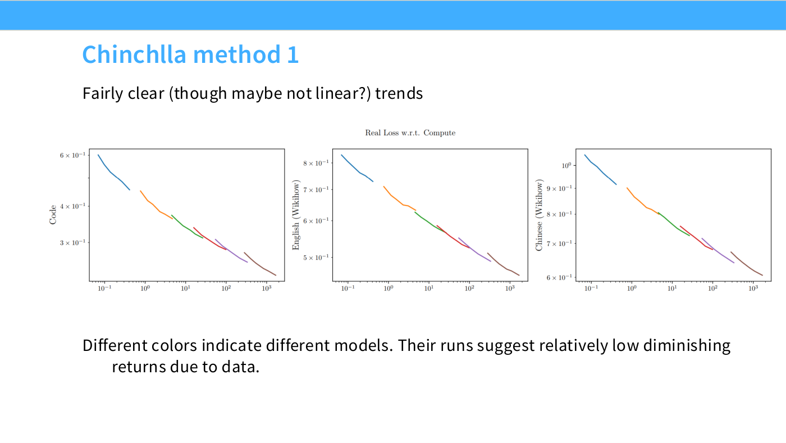

Heading: "Chinchlla method 1" (spelled exactly that way on the slide — the deck's own typo for "Chinchilla"). Body text above the figure: "Fairly clear (though maybe not linear?) trends". Body text below the figure: "Different colors indicate different models. Their runs suggest relatively low diminishing returns due to data."

**Figure — three side-by-side log-log line panels under one shared title, "Real Loss w.r.t. Compute".** All three panels share the same x-axis, which carries no printed axis label, only tick labels $10^{-1}$, $10^0$, $10^1$, $10^2$, $10^3$ — measured evenly spaced at 127.7 px per decade, so the x-axis is logarithmic. Each panel's y-axis is also logarithmic (measured: the tick rows fit $\log_{10}$ of their values to within ~1%, at ~913, ~1465 and ~1590 px per decade respectively — the widening tick spacing toward smaller values is the log signature). The three y-axes are labelled, left to right, "Code" (ticks $6\times10^{-1}$, $4\times10^{-1}$, $3\times10^{-1}$, plus an unlabelled minor tick at $5\times10^{-1}$), "English (Wikihow)" (ticks $8\times10^{-1}$, $7\times10^{-1}$, $6\times10^{-1}$, $5\times10^{-1}$) and "Chinese (Wikihow)" (ticks $10^0$, $9\times10^{-1}$, $8\times10^{-1}$, $7\times10^{-1}$, $6\times10^{-1}$).

Each panel contains **exactly six series** — no legend is printed; they are the standard matplotlib colour cycle (blue, orange, green, red, purple, brown), and per the slide's own caption each colour is a different model. The six segments occupy successive, slightly overlapping compute ranges, together tracing one descending staircase across the plot; they are not six curves over a common x-range. Endpoints, measured by colour-classifying pixels inside the plot frame:

- **Panel 1, "Code"** (six series):
  - blue: $x \approx 0.067 \to 0.42$, loss $0.602 \to 0.456$
  - orange: $x \approx 0.75 \to 4.7$, loss $0.451 \to 0.362$
  - green: $x \approx 4.4 \to 27$, loss $0.372 \to 0.311$
  - red: $x \approx 16 \to 100$, loss $0.337 \to 0.284$
  - purple: $x \approx 53 \to 340$, loss $0.307 \to 0.257$
  - brown: $x \approx 2.8\times10^2 \to 1.7\times10^3$, loss $0.277 \to 0.231$
- **Panel 2, "English (Wikihow)"** (six series):
  - blue: $x \approx 0.068 \to 0.42$, loss $0.832 \to 0.729$
  - orange: $x \approx 0.75 \to 4.8$, loss $0.710 \to 0.632$
  - green: $x \approx 4.5 \to 23$, loss $0.626 \to 0.568$
  - red: $x \approx 16 \to 99$, loss $0.585 \to 0.524$
  - purple: $x \approx 54 \to 338$, loss $0.551 \to 0.491$
  - brown: $x \approx 2.8\times10^2 \to 1.7\times10^3$, loss $0.510 \to 0.458$
- **Panel 3, "Chinese (Wikihow)"** (six series):
  - blue: $x \approx 0.068 \to 0.42$, loss $1.048 \to 0.917$
  - orange: $x \approx 0.75 \to 4.7$, loss $0.902 \to 0.799$
  - green: $x \approx 4.5 \to 27$, loss $0.806 \to 0.726$
  - red: $x \approx 16 \to 101$, loss $0.758 \to 0.681$
  - purple: $x \approx 54 \to 336$, loss $0.716 \to 0.641$
  - brown: $x \approx 2.8\times10^2 \to 1.7\times10^3$, loss $0.673 \to 0.606$

In every panel each successive colour picks up at lower loss and higher compute than the last, and the union of the six traces is close to — but visibly not exactly — a straight line on log-log axes, which is what the slide's parenthetical "(though maybe not linear?)" is pointing at. Each individual segment is also noticeably shallower than the overall envelope, which is the "relatively low diminishing returns due to data" the caption refers to.

## Slide 18 — Chinchilla method 3

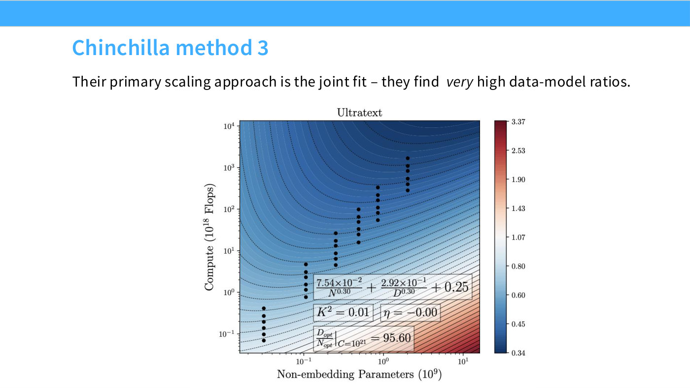

Heading: "Chinchilla method 3". Body text: "Their primary scaling approach is the joint fit – they find *very* high data-model ratios." ("very" is italicised on the slide.)

**Figure — a filled contour map of fitted loss over (model size, compute), titled "Ultratext", with 36 run points overlaid and the fitted parameters printed inside the plot.** X-axis "Non-embedding Parameters ($10^9$)", logarithmic, major ticks $10^{-1}$, $10^0$, $10^1$ (measured 220.5 px per decade, evenly spaced). Y-axis "Compute ($10^{18}$ Flops)", logarithmic, major ticks $10^{-1}$, $10^0$, $10^1$, $10^2$, $10^3$, $10^4$ (measured 115 px per decade, evenly spaced). A vertical colourbar on the right is ticked 0.34, 0.45, 0.60, 0.80, 1.07, 1.43, 1.90, 2.53, 3.37 from bottom to top — these are geometrically spaced (each roughly $1.33\times$ the one below), i.e. the colour scale for loss is also logarithmic. The colormap runs dark blue at the low-loss end (0.34), through white near 1.07, to dark red at the high-loss end (3.37).

The field: dark blue fills the upper-right of the plot (large models trained with lots of compute — lowest loss), pale blue the upper-left, and the colour warms toward the lower-right corner (large models with very little compute, i.e. very little data), which is the darkest red. Contour lines are drawn throughout: **dashed** in the blue region, where they form broad U-shapes opening upward, and **solid**, nearly straight and densely packed, running lower-left to upper-right in the pale/red region.

**Data points — one series of 36 black filled dots, arranged in six vertical columns of six.** Each column is one model size, and the six dots in it are checkpoints at increasing compute. Positions read off the calibrated log axes:

| Model size (x, $10^9$ non-embedding params) | Compute values of the six dots ($10^{18}$ Flops) |
| --- | --- |
| ≈0.031 | 0.068, 0.096, 0.14, 0.19, 0.27, 0.41 |
| ≈0.11 | 0.76, 1.15, 1.5, 2.3, 3.0, 4.7 |
| ≈0.25 | 4.5, 6.3, 8.7, 13, 17, 26 |
| ≈0.49 | 16, 25, 33, 49, 65, 98 |
| ≈0.85 | 54, 81, 108, 163, 218, 333 |
| ≈2.0 | 283, 398, 537, 826, 1094, 1682 |

The whole point cloud lies in the blue (low-loss) region, running diagonally from the lower-left to the upper-middle-right; no run sits in the red region.

**Printed inside the plot (three boxed annotations), transcribed exactly:**

$$\frac{7.54\times10^{-2}}{N^{0.30}} + \frac{2.92\times10^{-1}}{D^{0.30}} + 0.25$$

$$K^2 = 0.01 \qquad \eta = -0.00$$

$$\left.\frac{D_{opt}}{N_{opt}}\right|_{C=10^{21}} = 95.60$$

So the joint fit gives both exponents equal to 0.30, an irreducible loss term of 0.25, and — at $C = 10^{21}$ FLOPs — an optimal data-to-parameter ratio of 95.60 tokens per parameter, which is the "very high data-model ratio" the slide's body text is pointing at (roughly $4.8\times$ Chinchilla's ~20:1). Note $\eta = -0.00$: the fitted exponent on compute in equation (3) of the previous slide is essentially zero, meaning this fit says the optimal ratio does not change with compute.

## Slide 19 — DeepSeek

Heading: "DeepSeek". Body text above the pasted image: "DeepSeek (2024) – another LM with careful scaling analysis". Body text below it: "7 and 67B param models – generally high performance compared to other open LM".

**Pasted paper header (centre).** The DeepSeek whale logo with the wordmark "deepseek" set in blue-violet, a horizontal rule below it, and then the paper title over two centred bold lines: "**DeepSeek LLM**" / "**Scaling Open-Source Language Models with Longtermism**". No chart or table on this page.

## Slide 20 — Scaling strategy – batch + LR

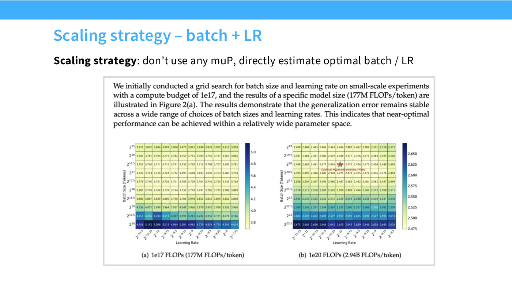

Heading: "Scaling strategy – batch + LR". Body text: "**Scaling strategy**: don't use any muP, directly estimate optimal batch / LR"

**Pasted paper excerpt (boxed, filling most of the page).** Paragraph text, transcribed in full:

"We initially conducted a grid search for batch size and learning rate on small-scale experiments with a compute budget of 1e17, and the results of a specific model size (177M FLOPs/token) are illustrated in Figure 2(a). The results demonstrate that the generalization error remains stable across a wide range of choices of batch sizes and learning rates. This indicates that near-optimal performance can be achieved within a relatively wide parameter space."

Below the paragraph, two annotated heatmaps side by side, captioned "(a) 1e17 FLOPs (177M FLOPs/token)" and "(b) 1e20 FLOPs (2.94B FLOPs/token)". Both have y-axis "Batch Size (Tokens)" (rows labelled as powers of 2) and x-axis "Learning Rate" (columns labelled as powers of 2), and both print the loss value inside every cell. Each has its own vertical colourbar with a yellow-green-to-dark-navy colormap; both colourbars are **linearly** scaled — (a) ticked 3.8, 4.0, 4.2, 4.4, 4.6, 4.8, 5.0 and (b) ticked 2.475, 2.500, 2.525, 2.550, 2.575, 2.600, 2.625, 2.650 — with pale yellow = low loss and dark navy = high loss.

**Table (a) — "1e17 FLOPs (177M FLOPs/token)", 10 batch-size rows × 12 learning-rate columns.** (Rows read top to bottom as printed; the loss values are the cell text.)

| Batch \ LR | $2^{-10.5}$ | $2^{-10.25}$ | $2^{-10}$ | $2^{-9.75}$ | $2^{-9.5}$ | $2^{-9.25}$ | $2^{-9}$ | $2^{-8.75}$ | $2^{-8.5}$ | $2^{-8.25}$ | $2^{-8}$ | $2^{-7.75}$ |
| --- | --- | --- | --- | --- | --- | --- | --- | --- | --- | --- | --- | --- |
| $2^{15}$ | 3.872 | 3.872 | 3.886 | 3.893 | 3.900 | 3.877 | 3.891 | 3.890 | 3.878 | 3.902 | 3.912 | 3.918 |
| $2^{16}$ | 3.787 | 3.781 | 3.794 | 3.775 | 3.782 | 3.759 | 3.755 | 3.784 | 3.750 | 3.747 | 3.761 | 3.805 |
| $2^{16.5}$ | 3.757 | 3.740 | 3.711 | 3.712 | 3.741 | 3.733 | 3.720 | 3.715 | 3.708 | 3.707 | 3.693 | 3.781 |
| $2^{17}$ | 3.747 | 3.744 | 3.734 | 3.724 | 3.712 | 3.695 | 3.698 | 3.693 | 3.690 | 3.753 | 3.685 | 3.744 |
| $2^{17.5}$ | 3.779 | 3.740 | 3.741 | 3.726 | 3.701 | 3.709 | 3.709 | 3.704 | 3.746 | 3.754 | 3.743 | 3.764 |
| $2^{18}$ | 3.805 | 3.770 | 3.769 | 3.739 | 3.734 | 3.730 | 3.718 | 3.691 | 3.785 | 3.775 | 3.788 | 3.809 |
| $2^{18.5}$ | 3.880 | 3.867 | 3.839 | 3.800 | 3.796 | 3.786 | 3.910 | 3.852 | 3.835 | 3.845 | 3.862 | 3.808 |
| $2^{19}$ | 4.136 | 4.071 | 3.999 | 3.964 | 3.957 | 4.047 | 3.960 | 3.970 | 3.976 | 3.920 | 3.956 | 3.960 |
| $2^{19.5}$ | 4.653 | 4.456 | 4.764 | 4.513 | 4.347 | 4.197 | 4.281 | 4.222 | 4.156 | 4.111 | 4.078 | 4.166 |
| $2^{20}$ | 4.958 | 5.152 | 5.098 | 5.013 | 4.964 | 5.001 | 4.965 | 4.770 | 4.834 | 4.715 | 4.741 | 4.614 |

The minimum in panel (a) is 3.685, at batch $2^{17}$ / LR $2^{-8}$; the whole block from $2^{16}$ to $2^{18}$ sits in a narrow 3.69–3.81 band (the "wide parameter space" claim), while the bottom two rows ($2^{19.5}$ and $2^{20}$) blow up to 4.1–5.2.

**Table (b) — "1e20 FLOPs (2.94B FLOPs/token)", 10 batch-size rows × 12 learning-rate columns.**

| Batch \ LR | $2^{-11.25}$ | $2^{-11}$ | $2^{-10.75}$ | $2^{-10.5}$ | $2^{-10.25}$ | $2^{-10}$ | $2^{-9.75}$ | $2^{-9.5}$ | $2^{-9.25}$ | $2^{-9}$ | $2^{-8.75}$ | $2^{-8.5}$ |
| --- | --- | --- | --- | --- | --- | --- | --- | --- | --- | --- | --- | --- |
| $2^{19}$ | 2.489 | 2.489 | 2.485 | 2.482 | 2.483 | 2.484 | 2.487 | 2.487 | 2.489 | 2.501 | 2.510 | 2.512 |
| $2^{19.5}$ | 2.487 | 2.483 | 2.481 | 2.480 | 2.479 | 2.480 | 2.477 | 2.476 | 2.479 | 2.484 | 2.495 | 2.502 |
| $2^{20}$ | 2.489 | 2.485 | 2.481 | 2.477 | 2.476 | **2.474** | 2.475 | 2.476 | 2.475 | 2.478 | 2.489 | 2.492 |
| $2^{20.5}$ | 2.495 | 2.490 | 2.486 | 2.482 | 2.478 | 2.475 | 2.474 | 2.475 | 2.476 | 2.476 | 2.476 | 2.493 |
| $2^{21}$ | 2.506 | 2.501 | 2.497 | 2.493 | 2.490 | 2.487 | 2.485 | 2.482 | 2.481 | 2.482 | 2.497 | 2.499 |
| $2^{21.5}$ | 2.518 | 2.512 | 2.509 | 2.507 | 2.502 | 2.500 | 2.499 | 2.496 | 2.507 | 2.512 | 2.508 | 2.515 |
| $2^{22}$ | 2.542 | 2.532 | 2.532 | 2.522 | 2.515 | 2.525 | 2.534 | 2.538 | 2.536 | 2.530 | 2.531 | 2.543 |
| $2^{22.5}$ | 2.569 | 2.556 | 2.551 | 2.548 | 2.561 | 2.557 | 2.560 | 2.557 | 2.566 | 2.570 | 2.562 | 2.559 |
| $2^{23}$ | 2.604 | 2.593 | 2.602 | 2.603 | 2.597 | 2.597 | 2.595 | 2.605 | 2.593 | 2.597 | 2.595 | 2.614 |
| $2^{23.5}$ | 2.675 | 2.668 | 2.660 | 2.666 | 2.645 | 2.655 | 2.643 | 2.639 | 2.646 | 2.638 | 2.645 | 2.636 |

In panel (b) a **red five-pointed star marker** is drawn on the cell at batch $2^{20}$, LR $2^{-10}$ (value 2.474 — the star partly overlaps the printed digits), with the red italic annotation "*Optimal Hyperparameters Fitted*" written just below it, straddling the boundary between the $2^{20}$ and $2^{20.5}$ rows. That cell is tied for the minimum of the whole grid with $2^{20.5}$ / $2^{-9.75}$, also 2.474.

Note the two panels do not share axes: going from 1e17 to 1e20 FLOPs, the batch-size grid shifts up by 16× ($2^{15}$–$2^{20}$ → $2^{19}$–$2^{23.5}$) and the learning-rate grid shifts down ($2^{-10.5}$–$2^{-7.75}$ → $2^{-11.25}$–$2^{-8.5}$) — i.e. bigger batch, smaller LR at larger compute, which is the relationship the slide says DeepSeek estimates directly instead of getting it from muP.

## Slide 21 — Scaling analysis of learning rates

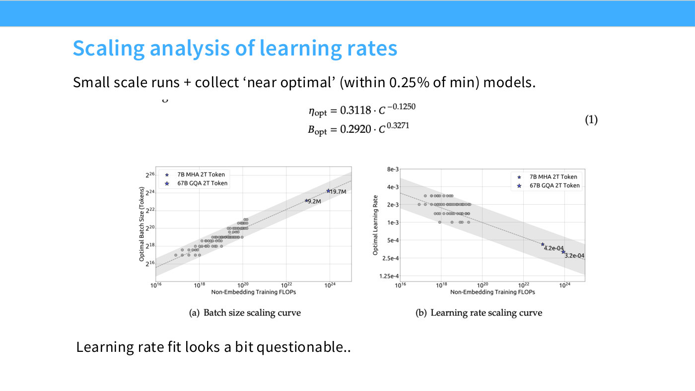

Heading: "Scaling analysis of learning rates". Body text above the figure: "Small scale runs + collect 'near optimal' (within 0.25% of min) models." Body text below the figure: "Learning rate fit looks a bit questionable.."

**Pasted paper excerpt — a numbered pair of fitted power laws, printed above the two panels:**

$$\eta_{\mathrm{opt}} = 0.3118 \cdot C^{-0.1250}$$
$$B_{\mathrm{opt}} = 0.2920 \cdot C^{0.3271}$$

with the equation number "(1)" at the right margin. (At the very top-left of the pasted image, the bottom sliver of a cut-off glyph is visible, running into the image's own top edge — the screenshot was cropped mid-line from the source paper. Nothing of that line is readable, and nothing else is missing.)

**Figure — two scatter panels with fitted lines, captioned "(a) Batch size scaling curve" and "(b) Learning rate scaling curve".** Both share the x-axis "Non-Embedding Training FLOPs", logarithmic, ticked $10^{16}$, $10^{18}$, $10^{20}$, $10^{22}$, $10^{24}$ (measured: gridlines evenly spaced, 131.4 px and 124 px per two decades in the two panels — log confirmed).

Each panel has a legend with **two star entries**: a small navy star "7B MHA 2T Token" and a larger navy star "67B GQA 2T Token". Counting properly, each panel carries **four things**: one series of grey circles, one grey shaded confidence band, one grey dashed fitted line, and the two navy star markers. (The two star glyphs inside each legend box sit within the plot's coordinate space — in panel (a) the legend is at top-left, in panel (b) at top-right — and are legend swatches, not data.)

- **Panel (a), y-axis "Optimal Batch Size (Tokens)"**, logarithmic in powers of two, gridlines/ticks $2^{16}$, $2^{18}$, $2^{20}$, $2^{22}$, $2^{24}$, $2^{26}$ (measured 53.4 px per two doublings, evenly spaced).
  - Grey circles (the "near optimal" small-scale runs): roughly 60–70 markers, spanning $x \approx 7.6\times10^{16}$ to $1.7\times10^{20}$ FLOPs. They lie on nine discrete batch-size levels, measured at $2^{17}$, $2^{17.5}$, $2^{18}$, $2^{18.5}$, $2^{19}$, $2^{19.5}$, $2^{20}$, $2^{20.5}$, $2^{21}$ — i.e. the rows of the grid search, not a continuum. The cloud rises left to right: at $\approx10^{17}$ the points sit at $2^{17}$–$2^{17.5}$; by $\approx10^{20}$ they reach $2^{20.5}$–$2^{21}$.
  - Grey dashed line: the fit $B_{\mathrm{opt}} = 0.2920\,C^{0.3271}$, a straight line on these log axes running from about $(10^{16}, 2^{15.4})$ at the lower left to about $(3\times10^{24}, 2^{24.6})$ at the upper right.
  - Grey shaded band: a confidence envelope of roughly constant width (about $\pm 1.3$ doublings) around the dashed line, spanning the full plot width.
  - Two navy stars, both far to the right of all the grey data: the small "7B MHA 2T Token" star at $C \approx 8.5\times10^{22}$, batch $2^{23.13}$, labelled "**9.2M**"; the large "67B GQA 2T Token" star at $C \approx 8.5\times10^{23}$, batch $2^{24.24}$, labelled "**19.7M**". Both sit essentially on the dashed line.
- **Panel (b), y-axis "Optimal Learning Rate"**, logarithmic, ticked 1.25e-4, 2.5e-4, 5e-4, 1e-3, 2e-3, 4e-3, 8e-3 (each tick twice the one below; measured 53.5 px per doubling, evenly spaced).
  - Grey circles: about 40 markers, spanning only $x \approx 7\times10^{16}$ to $3\times10^{19}$ FLOPs — a much shorter x-range than panel (a)'s. They lie on just **four** discrete learning-rate levels, measured at $\approx2.8\times10^{-3}$, $2.0\times10^{-3}$, $1.4\times10^{-3}$ and $1.0\times10^{-3}$ (successive levels a factor of $\sqrt2$ apart, i.e. half-powers of two). Within that range the cloud drifts only weakly downward: the $2.8\times10^{-3}$ row stops around $10^{18.5}$ while the $1.0\times10^{-3}$ row extends to about $10^{19}$.
  - Grey dashed line: the fit $\eta_{\mathrm{opt}} = 0.3118\,C^{-0.1250}$, straight and descending across the whole plot, from about $(10^{16}, 3.2\times10^{-3})$ down to about $(3\times10^{24}, 2.7\times10^{-4})$.
  - Grey shaded band: a confidence envelope around it, again roughly constant width and full-width.
  - Two navy stars: the small "7B MHA 2T Token" star at $C \approx 8.7\times10^{22}$, LR $4.22\times10^{-4}$, labelled "**4.2e-04**"; the large "67B GQA 2T Token" star at $C \approx 8.7\times10^{23}$, LR $3.14\times10^{-4}$, labelled "**3.2e-04**". Both sit on the dashed line.

The two fits are mutually consistent with the stars: $0.2920\times(10^{24})^{0.3271} \approx 2.1\times10^7 \approx 2^{24.3}$ tokens, and $0.3118\times(10^{24})^{-0.125} \approx 3.1\times10^{-4}$. What the slide's "looks a bit questionable" is pointing at is visible in panel (b): the grey evidence covers barely 2.5 decades of compute and only four quantised learning-rate values with very little visible slope inside that window, yet the fitted line is extrapolated another five decades out to where the two production models sit.

## Slide 22 — For chinchilla analysis: WSD-style learning rate

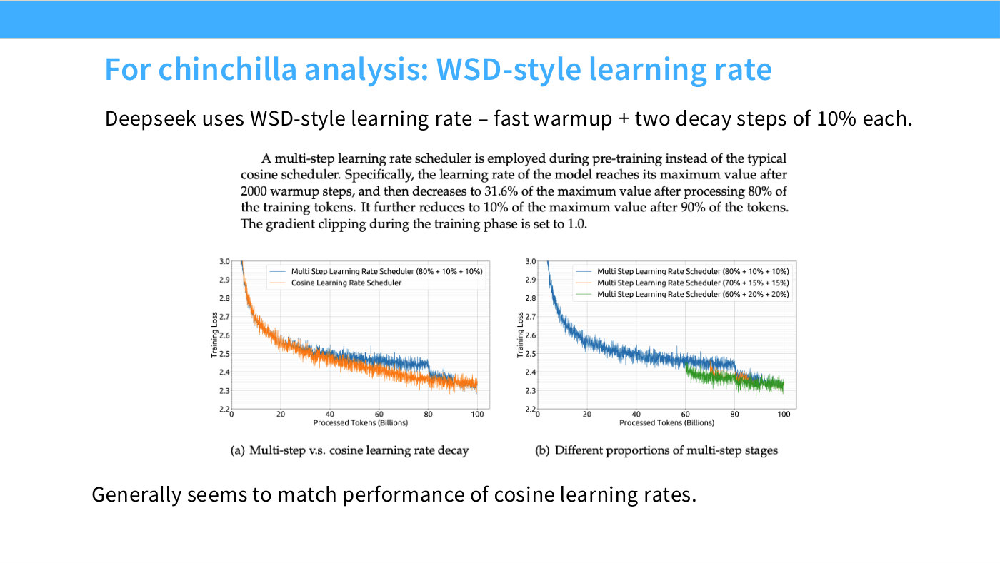

Heading: "For chinchilla analysis: WSD-style learning rate". Body text above the figure: "Deepseek uses WSD-style learning rate – fast warmup + two decay steps of 10% each." Body text below the figure: "Generally seems to match performance of cosine learning rates."

**Pasted paper excerpt (paragraph, above the charts).** Transcribed in full:

"A multi-step learning rate scheduler is employed during pre-training instead of the typical cosine scheduler. Specifically, the learning rate of the model reaches its maximum value after 2000 warmup steps, and then decreases to 31.6% of the maximum value after processing 80% of the training tokens. It further reduces to 10% of the maximum value after 90% of the tokens. The gradient clipping during the training phase is set to 1.0."

**Figure — two training-loss curve panels, captioned "(a) Multi-step v.s. cosine learning rate decay" and "(b) Different proportions of multi-step stages".** Both panels share the same axes: y-axis "Training Loss", **linear**, ticked 2.2, 2.3, 2.4, 2.5, 2.6, 2.7, 2.8, 2.9, 3.0 (measured 26.5 px per 0.1, evenly spaced); x-axis "Processed Tokens (Billions)", **linear**, ticked 0, 20, 40, 60, 80, 100 (measured 70.5 px per 20 B, evenly spaced). All curves are raw, un-smoothed and visibly noisy, with a band of roughly ±0.02 loss around their local mean.

**Panel (a) — two series**, per its legend (a legend box sits inside the plot area at the top; its two coloured line swatches are legend entries, not data):

- **Blue — "Multi Step Learning Rate Scheduler (80% + 10% + 10%)".** Enters the plot at the top axis (loss 3.0) at about 4 B tokens and falls steeply; ≈2.56 at 20 B, ≈2.50 at 40 B, ≈2.45 at 60 B, ≈2.44 at 80 B. Right **at 80 B** it takes a visible step down to ≈2.39, then continues to ≈2.36 by 90 B, takes a second, smaller step near 90 B, and finishes intertwined with the orange curve at ≈2.33 just short of 100 B.
- **Orange — "Cosine Learning Rate Scheduler".** Enters at loss 3.0 at about 4.3 B; ≈2.69 at 10 B, ≈2.56 at 20 B, ≈2.52 at 30 B, ≈2.47 at 40 B, ≈2.44 at 50 B, ≈2.40 at 60 B, ≈2.38 at 70 B, ≈2.36 at 80 B, ≈2.33 at 90 B, ending ≈2.34 at 100 B. It is a smooth, continuous descent with no steps.

For the first ~30 B the two are indistinguishable (orange is drawn over blue). From roughly 35 B to 80 B the **blue multi-step curve sits above (worse than) the cosine curve** by about 0.05–0.08 loss. The 80 B step brings blue down onto orange, and from ~85 B onward the two are essentially on top of each other, both finishing at ≈2.33–2.34 — which is the "generally seems to match performance of cosine learning rates" the slide's caption claims.

**Panel (b) — three series**, per its legend:

- **Blue — "Multi Step Learning Rate Scheduler (80% + 10% + 10%)".** The same full run as in panel (a): 3.0 at ≈4 B, ≈2.57 at 20 B, ≈2.51 at 30 B, ≈2.49 at 40 B, ≈2.48 at 50 B, ≈2.45 at 60 B, ≈2.44 at 80 B, then the step at 80 B down to ≈2.39, ≈2.35 by 88–92 B.
- **Green — "Multi Step Learning Rate Scheduler (60% + 20% + 20%)".** Branches away from the blue curve **at exactly 60 B** (loss ≈2.44) and immediately drops below it: ≈2.38 at 70 B, ≈2.36 at 80 B, a second step near 82 B to ≈2.33, then flat to ≈2.33–2.34 at 100 B.
- **Orange — "Multi Step Learning Rate Scheduler (70% + 15% + 15%)".** Branches away **at about 70 B** and is only visible in the roughly 70–87 B window (elsewhere it is overdrawn by the green and blue traces): ≈2.37 at 82 B, ≈2.37 at 85 B.

All three multi-step schedules in panel (b) converge to essentially the same final loss, ≈2.33, despite decaying at 60%, 70% and 80% of the token budget — each one is lower than blue only during the window after its own decay begins and before blue's does.

## Slide 23 — Data-size tradeoff analysis: Chinchilla method 2

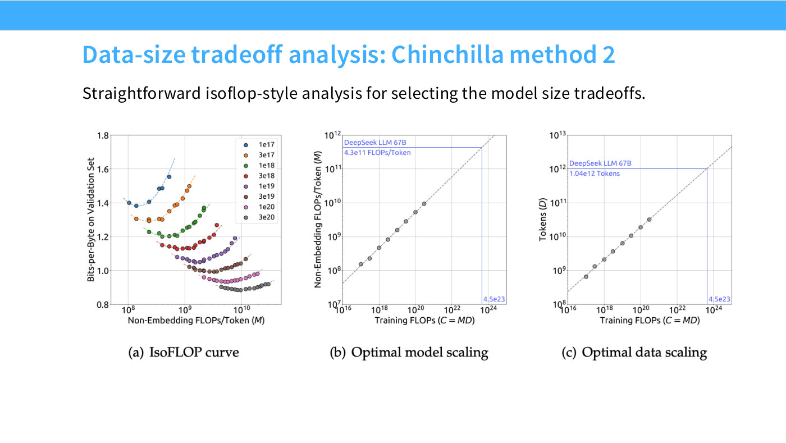

Heading: "Data-size tradeoff analysis: Chinchilla method 2". Body text: "Straightforward isoflop-style analysis for selecting the model size tradeoffs."

**Figure — three panels, captioned "(a) IsoFLOP curve", "(b) Optimal model scaling", "(c) Optimal data scaling".**

**Panel (a) — IsoFLOP curves.** Y-axis "Bits-per-Byte on Validation Set", **linear**, ticked 0.8, 1.0, 1.2, 1.4, 1.6, 1.8 (measured 69.6 px per 0.2, evenly spaced). X-axis "Non-Embedding FLOPs/Token ($M$)", **logarithmic**, ticked $10^8$, $10^9$, $10^{10}$ (measured 117 px per decade, evenly spaced). A legend box sits inside the plot at the top right listing **eight** compute budgets, each a filled circle colour: 1e17 (blue), 3e17 (orange), 1e18 (green), 3e18 (red), 1e19 (purple), 3e19 (brown), 1e20 (pink/magenta), 3e20 (grey). So there are **eight data series** — the eight legend dots inside the plot frame are swatches, not data. Each series is a set of filled circles forming a U (a parabola in $\log M$), with a dashed fit curve of the same colour drawn through it.

Measured minima of each isoFLOP curve — the point of the panel:

| Budget (FLOPs) | Colour | Lowest bits-per-byte | at $M$ (FLOPs/token) |
| --- | --- | --- | --- |
| 1e17 | blue | ≈1.38 | ≈$1.4\times10^8$ |
| 3e17 | orange | ≈1.29 | ≈$2.4\times10^8$ |
| 1e18 | green | ≈1.20 | ≈$4.0\times10^8$ |
| 3e18 | red | ≈1.13 | ≈$9.2\times10^8$ |
| 1e19 | purple | ≈1.05 | ≈$1.5\times10^9$ |
| 3e19 | brown | ≈0.99 | ≈$2.7$–$3.5\times10^9$ |
| 1e20 | pink | ≈0.93 | ≈$5.1$–$5.7\times10^9$ |
| 3e20 | grey | ≈0.885 | ≈$8.5\times10^9$ |

Full spans of the individual curves, left to right on $M$: blue $1.0\times10^8 \to 5.3\times10^8$ (about 6 points, bpb 1.40 → 1.55); orange $1.4\times10^8 \to 1.2\times10^9$ (about 10 points, 1.31 → 1.51); green $2.4\times10^8 \to 2.2\times10^9$ (about 14 points, 1.23 → 1.37); red $4.0\times10^8 \to 3.7\times10^9$ (about 12 points, 1.15 → 1.27); purple $7.4\times10^8 \to 7.7\times10^9$ (about 16 points, 1.08 → 1.19); brown $1.2\times10^9 \to 1.2\times10^{10}$ (about 15 points, 1.02 → 1.07); pink $2.2\times10^9 \to 1.9\times10^{10}$ (about 15 points, 0.96 → 0.98); grey $4.4\times10^9 \to 3.0\times10^{10}$ (about 14 points, 0.90 → 0.92). Each successive budget sits lower on the loss axis and its minimum shifts to the right — the curves also get visibly flatter as compute grows.

**Panel (b) — "Optimal model scaling".** Y-axis "Non-Embedding FLOPs/Token ($M$)", **logarithmic**, ticked $10^7$ through $10^{12}$ (measured 69.6 px per decade). X-axis "Training FLOPs ($C = MD$)", **logarithmic**, ticked $10^{16}$, $10^{18}$, $10^{20}$, $10^{22}$, $10^{24}$ (measured 75 px per two decades). Contents — three things, not more: one series of **eight grey circles**, one grey dashed fit line, and one blue right-angle annotation.

- Grey circles (8), one per isoFLOP budget from panel (a), at $(C, M)$: $(10^{17}, 1.5\times10^8)$, $(3\times10^{17}, 2.3\times10^8)$, $(10^{18}, 4.8\times10^8)$, $(3\times10^{18}, 8.3\times10^8)$, $(10^{19}, 1.6\times10^9)$, $(3\times10^{19}, 2.9\times10^9)$, $(10^{20}, 5.4\times10^9)$, $(3\times10^{20}, 9.3\times10^9)$. On these log axes they lie on a straight line of slope ≈0.51.
- Grey dashed line: the fit, running the full plot width from about $(10^{16}, 4.8\times10^7)$ at the lower left and leaving through the **top** border at about $C = 10^{24.4}$.
- Blue annotation: a horizontal blue line at $M = 4.3\times10^{11}$ running from the left axis rightward, and a vertical blue line at $C = 4.5\times10^{23}$ running from the bottom axis upward, meeting at their corner. Blue text at the top left, on two lines: "DeepSeek LLM 67B" / "4.3e11 FLOPs/Token"; blue text "4.5e23" at the bottom right beside the vertical line.

**Panel (c) — "Optimal data scaling".** Y-axis "Tokens ($D$)", **logarithmic**, ticked $10^8$ through $10^{13}$ (69.6 px per decade). X-axis identical to panel (b). Same three elements.

- Grey circles (8), at $(C, D)$: $(10^{17}, 6.9\times10^8)$, $(3\times10^{17}, 1.35\times10^9)$, $(10^{18}, 2.1\times10^9)$, $(3\times10^{18}, 3.6\times10^9)$, $(10^{19}, 6.3\times10^9)$, $(3\times10^{19}, 1.07\times10^{10})$, $(10^{20}, 1.9\times10^{10})$, $(3\times10^{20}, 3.2\times10^{10})$. Straight on log axes, slope ≈0.48.
- Grey dashed line: from about $(10^{16}, 2.3\times10^8)$ at the lower left to about $(10^{25}, 5\times10^{12})$ at the right edge, staying below the $10^{13}$ top border throughout.
- Blue annotation: horizontal blue line at $D = 1.04\times10^{12}$ (essentially on the $10^{12}$ gridline) and vertical blue line at $C = 4.5\times10^{23}$, meeting at their corner, which sits just on the dashed fit. Blue text at the left: "DeepSeek LLM 67B" / "1.04e12 Tokens"; "4.5e23" at the bottom right.

The two fitted exponents nearly split the compute evenly ($M \propto C^{0.51}$, $D \propto C^{0.48}$), and the two blue annotations are consistent with each other and with the x-axis: $4.3\times10^{11} \times 1.04\times10^{12} \approx 4.5\times10^{23}$ FLOPs. Note this deck reports model size as FLOPs/token ($M$), not parameter count.

## Slide 24 — Scaling predicts final model loss

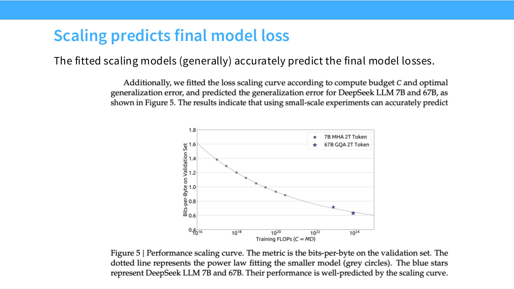

Heading: "Scaling predicts final model loss". Body text: "The fitted scaling models (generally) accurately predict the final model losses."

**Pasted paper excerpt (top).** Three lines of paragraph text, which stop mid-sentence — only three lines were included in the crop:

"Additionally, we fitted the loss scaling curve according to compute budget $C$ and optimal generalization error, and predicted the generalization error for DeepSeek LLM 7B and 67B, as shown in Figure 5. The results indicate that using small-scale experiments can accurately predict"

**Figure — "Performance scaling curve", a single log-x / linear-y panel.** Y-axis "Bits-per-Byte on Validation Set", **linear**, ticked 0.4, 0.6, 0.8, 1.0, 1.2, 1.4, 1.6, 1.8 (measured 60.1 px per 0.2, evenly spaced, confirmed against the horizontal gridlines). X-axis "Training FLOPs ($C = MD$)", **logarithmic**, ticked $10^{16}$, $10^{18}$, $10^{20}$, $10^{22}$, $10^{24}$ (measured 165 px per two decades, evenly spaced); the plot area runs from $10^{16}$ at the left border to $10^{25}$ at the right.

A legend box sits inside the plot at the top right with **two star entries**: a small navy star "7B MHA 2T Token" and a larger navy star "67B GQA 2T Token". (Those two glyphs are legend swatches sitting in the plot's coordinate space, not data points.)

**Three things are plotted:**

- **Grey filled circles — one series of exactly 8 points**, the small-scale runs. Measured $(C, \text{bits-per-byte})$: $(10^{17}, 1.383)$, $(3\times10^{17}, 1.293)$, $(10^{18}, 1.200)$, $(3\times10^{18}, 1.127)$, $(10^{19}, 1.047)$, $(3\times10^{19}, 0.992)$, $(10^{20}, 0.930)$, $(3\times10^{20}, 0.884)$. These are exactly the eight isoFLOP minima from the previous slide's panel (a).
- **Grey dotted/dashed line — the fitted power law.** It runs the full width of the plot, from about $(10^{16}, 1.60)$ at the left border, through $(10^{18.7}, 1.10)$, $(10^{21.1}, 0.83)$, $(10^{22.9}, 0.70)$ and $(10^{23.9}, 0.64)$, to about $(10^{25}, 0.60)$ at the right border. It passes through all eight grey circles and flattens as it goes right.
- **Two navy star markers — the two DeepSeek production models**, both far to the right of the grey data:
  - "7B MHA 2T Token": $C \approx 8.5\times10^{22}$, bits-per-byte **0.716**.
  - "67B GQA 2T Token": $C \approx 8.7\times10^{23}$, bits-per-byte **0.633**.

Both stars land essentially on the fitted line. Measured against the dashed curve at the same x, the 7B star sits about 0.018 bits-per-byte **above** the fit (very slightly worse than predicted) and the 67B star about 0.008 **below** it (very slightly better than predicted). That is the sense in which the caption's "well-predicted" holds — a fit built from runs at $10^{17}$–$3\times10^{20}$ FLOPs extrapolates roughly 3.5 orders of magnitude and lands within ~0.02 bits-per-byte at $10^{23}$–$10^{24}$.

**Native-text caption below the figure**, reproduced in full: "Figure 5 | Performance scaling curve. The metric is the bits-per-byte on the validation set. The dotted line represents the power law fitting the smaller model (grey circles). The blue stars represent DeepSeek LLM 7B and 67B. Their performance is well-predicted by the scaling curve."

## Slide 25 — Other models: Qwen scaling

Heading: "Other models: Qwen scaling". Two sub-headings with a pasted paper excerpt under each:

"**Qwen 2.5** – batch and hyper scaling fits"

**Pasted paper excerpt 1 (Qwen2.5).** Section heading "3.2  Scaling Law for Hyper-parameters", then three paragraphs, transcribed in full (blue underlined text is a hyperlinked citation in the source):

"We develop scaling laws for hyper-parameter based on the pre-training data of Qwen2.5 (Hoffmann et al., 2022; Kaplan et al., 2020). While previous studies (Dubey et al., 2024; Almazrouei et al., 2023; Hoffmann et al., 2022) primarily used scaling laws to determine optimal model sizes given compute budgets, we leverage them to identify optimal hyperparameters across model architectures. Specifically, our scaling laws help determine key training parameters like batch size $B$ and learning rate $\mu$ for both dense models and MoE models of varying sizes."

"Through extensive experimentation, we systematically study the relationship between model architecture and optimal training hyper-parameters. Specifically, we analyze how the optimal learning rate $\mu_{\mathrm{opt}}$ and batch size $B_{\mathrm{opt}}$ vary with model size $N$ and pre-training data size $D$. Our experiments cover a comprehensive range of architectures, including dense models with 44M to 14B parameters and MoE models with 44M to 1B activated parameters, trained on datasets ranging from 0.8B to 600B tokens. Using these optimal hyper-parameter predictions, we then model the final loss as a function of model architecture and training data scale."

"Additionally, we leverage scaling laws to predict and compare the performance of MoE models with varying parameter counts against their dense counterparts. This analysis guides our hyper-parameter configuration for MoE models, enabling us to achieve performance parity with specific dense model variants (such as Qwen2.5-72B and Qwen2.5-14B) through careful tuning of both activated and total parameters."

"**Qwen 3** – similar scaling for LR/batch"

**Pasted paper excerpt 2 (Qwen3).** Transcribed in full:

"Similar to Qwen2.5 (Yang et al., 2024b), we develop scaling laws for optimal hyper-parameters (e.g., learning rate scheduler, and batch size) predictions based on three pre-training stages mentioned above. Through extensive experiments, we systematically study the relationship between model architecture, training data, training stage, and optimal training hyper-parameters. Finally, we set the predicted optimal learning rate and batch size strategy for each dense or MoE model."

No chart or table on this page — both figures are pasted blocks of prose.

## Slide 26 — Kimi K2

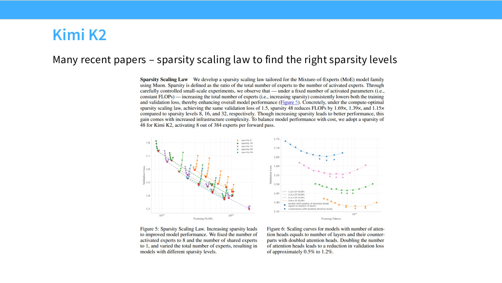

Heading: "Kimi K2". Body text: "Many recent papers – sparsity scaling law to find the right sparsity levels"

**Pasted paper excerpt (paragraph, top).** Transcribed in full (the bold run-in heading and the blue hyperlinked "Figure 5" are as printed):

"**Sparsity Scaling Law**  We develop a sparsity scaling law tailored for the Mixture-of-Experts (MoE) model family using Muon. Sparsity is defined as the ratio of the total number of experts to the number of activated experts. Through carefully controlled small-scale experiments, we observe that — under a fixed number of activated parameters (i.e., constant FLOPs) — increasing the total number of experts (i.e., increasing sparsity) consistently lowers both the training and validation loss, thereby enhancing overall model performance (Figure 5). Concretely, under the compute-optimal sparsity scaling law, achieving the same validation loss of 1.5, sparsity 48 reduces FLOPs by 1.69×, 1.39×, and 1.15× compared to sparsity levels 8, 16, and 32, respectively. Though increasing sparsity leads to better performance, this gain comes with increased infrastructure complexity. To balance model performance with cost, we adopt a sparsity of 48 for Kimi K2, activating 8 out of 384 experts per forward pass."

**Figure 1 (left) — "Sparsity Scaling Law" scatter with fitted envelopes.** Y-axis "Validation Loss", **linear**, gridlines/ticks 1.3, 1.4, 1.5, 1.6, 1.7, 1.8 (measured 59 px per 0.1, evenly spaced). X-axis "Training FLOPs", **logarithmic**, major ticks $10^{20}$ and $10^{21}$ (measured 310 px apart, one decade); the data occupy roughly $8\times10^{19}$ to $2\times10^{21}$.

**Five data series**, per the legend at the top right — sparsity 8 (orange), sparsity 16 (dark green), sparsity 32 (purple), sparsity 48 (light green), sparsity 64 (blue). (The five legend dots sit inside the plot frame; they are swatches, not data.) In addition there is a **red star overlay** — 20 red stars in total, one per model-size sweep — and one dashed trend line per colour.

Each series is drawn as a set of near-vertical "sprays" of filled circles: each spray is one fixed-compute sweep over model size, running steeply upward as the model gets too large. The lowest point of each spray is marked with a red star, and the dashed line of that colour is fitted through its own stars. Measured red-star positions (compute, validation loss), sorted by compute:

$(8.9\times10^{19}, 1.734)$, $(1.2\times10^{20}, 1.654)$, $(1.4\times10^{20}, 1.664)$, $(1.8\times10^{20}, 1.581)$, $(2.35\times10^{20}, 1.556)$, $(2.36\times10^{20}, 1.529)$, $(3.0\times10^{20}, 1.595)$, $(3.4\times10^{20}, 1.485)$, $(4.3\times10^{20}, 1.542)$, $(4.6\times10^{20}, 1.468)$, $(5.3\times10^{20}, 1.478)$, $(5.4\times10^{20}, 1.427)$, $(6.4\times10^{20}, 1.488)$, $(7.9\times10^{20}, 1.383)$, $(8.0\times10^{20}, 1.371)$, $(8.4\times10^{20}, 1.464)$, $(9.3\times10^{20}, 1.381)$, $(1.04\times10^{21}, 1.398)$, $(1.04\times10^{21}, 1.431)$, $(1.8\times10^{21}, 1.300)$.

The five dashed envelopes are stacked in sparsity order at every compute value: orange (sparsity 8) is the **highest** (worst) line, then dark green (16), then purple (32), then light green (48), with blue (64) **lowest** (best). E.g. near $10^{21}$ FLOPs the sparsity-8 star sits at 1.431 while sparsity-16 is at 1.398 and sparsity-32 at 1.381; near $8\times10^{20}$ sparsity-48 is at 1.383 and sparsity-64 at 1.371. The purple (sparsity 32) sweep extends furthest right, to about $1.8\times10^{21}$ FLOPs at loss 1.300 — the lowest point on the whole chart.

Caption below (native text): "Figure 5: Sparsity Scaling Law. Increasing sparsity leads to improved model performance. We fixed the number of activated experts to 8 and the number of shared experts to 1, and varied the total number of experts, resulting in models with different sparsity levels."

**Figure 2 (right) — attention-head scaling curves.** Y-axis "Validation Loss", **linear**, ticks 1.35 to 1.75 in steps of 0.05 (measured 40.5 px per 0.05, evenly spaced). X-axis "Training Tokens", logarithmic (the single major tick is printed in exponent form, $10^{11}$). Only that one major tick is drawn and no minor ticks are drawn, so the decade width cannot be measured off the page; x positions below are therefore given relative to the $10^{11}$ tick.

The legend has **six entries**: four dotted-line colour entries — "1.2e+20 FLOPs" (blue), "2.2e+20 FLOPs" (pink), "4.5e+20 FLOPs" (green), "9.0e+20 FLOPs" (orange) — plus two marker-shape entries — a **square** for "models with number of attention heads equals to number of layers" and a **circle** for "counterparts with doubled attention heads". So there are four compute budgets × two head configurations, with a dotted curve of the matching colour drawn through the squares of each budget.

- **Blue, 1.2e+20 FLOPs.** About 10 squares, forming a U: 1.738, 1.720, 1.705, 1.683, 1.672, 1.663, 1.657, minimum ≈**1.653**, then back up through 1.662 to 1.673. The whole series sits to the left of the $10^{11}$ tick. Three circles below it: 1.640, 1.636, 1.632.
- **Pink, 2.2e+20 FLOPs.** About 12 squares: 1.619, 1.604, 1.589, 1.575, 1.571, 1.562, 1.557, 1.558, minimum ≈**1.554**, then 1.562, 1.581, 1.605. Three circles: 1.543, 1.538, 1.537.
- **Green, 4.5e+20 FLOPs.** 12 squares: 1.502, 1.498, 1.489, 1.484, 1.473, 1.474, 1.467, minimum ≈**1.465**, then 1.467, 1.474, 1.485, 1.502. Three circles: 1.452, 1.450, 1.450.
- **Orange, 9.0e+20 FLOPs.** About 10 squares: 1.420, 1.415, 1.405, 1.396, 1.386, 1.381, 1.379, minimum ≈**1.378**, rising to 1.399 at the right edge. Three circles: 1.373, 1.368, 1.365.

In every one of the four budgets the doubled-head circles lie **below** the same-colour squares near the curve's minimum, by 0.013–0.021 loss (about 0.9%–1.3% of the loss value). Each successive compute budget shifts the whole U down and to the right.

Caption below (native text): "Figure 6: Scaling curves for models with number of attention heads equals to number of layers and their counterparts with doubled attention heads. Doubling the number of attention heads leads to a reduction in validation loss of approximately 0.5% to 1.2%."

## Slide 27 — Hunyuan (2024) large scaling laws

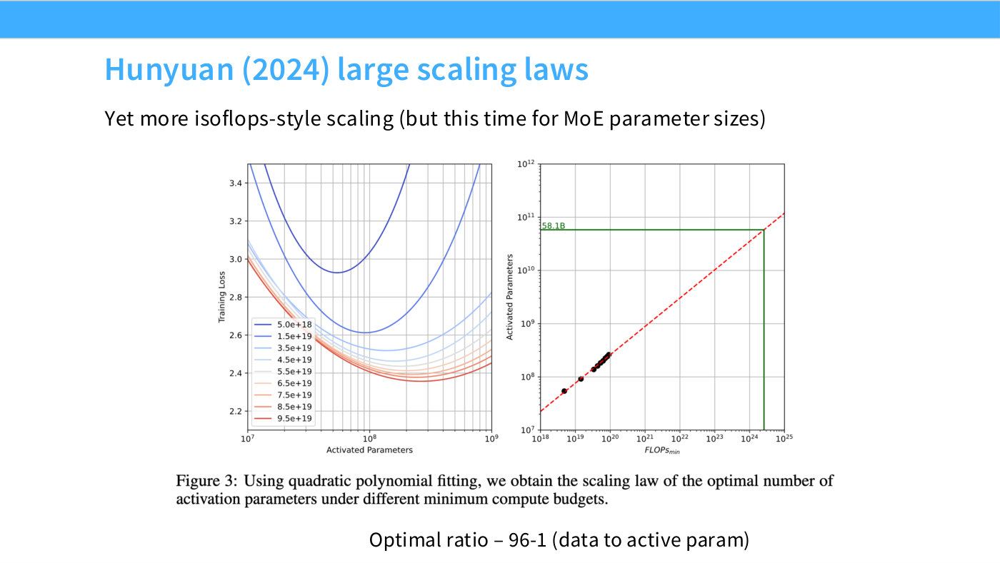

Heading: "Hunyuan (2024) large scaling laws". Body text above the figure: "Yet more isoflops-style scaling (but this time for MoE parameter sizes)". Body text below the figure: "Optimal ratio – 96-1 (data to active param)".

**Figure — two panels from the Hunyuan report, with a shared caption.**

**Panel 1 (left) — fitted isoFLOP parabolas.** Y-axis "Training Loss", **linear**, ticked 2.2, 2.4, 2.6, 2.8, 3.0, 3.2, 3.4 (measured 83.75 px per 0.2, evenly spaced); the plot area runs from about 2.10 at the bottom border to about 3.50 at the top. X-axis "Activated Parameters", **logarithmic**, ticked $10^7$, $10^8$, $10^9$ (measured 268.75 px per decade). There are **nine series**, per the legend inside the plot at the lower left, one per minimum compute budget: 5.0e+18, 1.5e+19, 3.5e+19, 4.5e+19, 5.5e+19, 6.5e+19, 7.5e+19, 8.5e+19, 9.5e+19, coloured on a blue→grey→red (coolwarm) ramp — dark blue for the smallest budget, dark red for the largest. (The nine legend line swatches sit inside the plot frame; they are swatches, not data.)

Every series is a smooth fitted parabola in $\log(\text{activated parameters})$ — no scatter points are plotted, only the quadratic fits. The nine curves are strictly nested, with the largest budget lowest at every x. Measured minima:

| Budget | Colour | Minimum training loss | at activated parameters |
| --- | --- | --- | --- |
| 5.0e+18 | dark blue | ≈2.927 | ≈$5.4\times10^7$ |
| 1.5e+19 | blue | ≈2.612 | ≈$9.1\times10^7$ |
| 3.5e+19 | light blue | ≈2.519 | ≈$1.2\times10^8$ |
| 4.5e+19 | pale blue | ≈2.464 | ≈$1.3\times10^8$ |
| 5.5e+19 | pale grey | ≈2.423 | ≈$2.0\times10^8$ |
| 6.5e+19 | pale salmon | ≈2.414 | ≈$1.8\times10^8$ |
| 7.5e+19 | salmon | ≈2.393 | ≈$2.2\times10^8$ |
| 8.5e+19 | orange-red | ≈2.379 | ≈$2.1\times10^8$ |
| 9.5e+19 | dark red | ≈2.358 | ≈$2.4\times10^8$ |

The two smallest budgets are widely separated (2.93 and 2.61); the seven largest are bunched between 2.36 and 2.52, and their minima all sit in the $1.2$–$2.4\times10^8$ activated-parameter range. The minimum moves right as the budget grows.

**Panel 2 (right) — the fitted scaling law.** Y-axis "Activated Parameters", **logarithmic**, ticked $10^7$ through $10^{12}$ (measured 117.3 px per decade). X-axis "$FLOPs_{min}$", **logarithmic**, ticked $10^{18}$ through $10^{25}$ (measured 76.7 px per decade). Three things are drawn:

- **Black filled circles** — the per-budget optima. They occupy only the far lower-left of the plot: one at about $(10^{18.7}, 5.4\times10^7)$, one at about $(10^{19.16}, 8.9\times10^7)$, and then a dense, heavily overlapping cluster running from about $(10^{19.5}, 1.2\times10^8)$ to $(10^{20.0}, 2.9\times10^8)$. (The individual markers in the cluster merge; the cluster's extent is measurable, the exact count is not — roughly a dozen.)
- **Red dashed line** — the fitted power law, spanning the full plot width from about $(10^{18}, 2.3\times10^7)$ to about $(10^{25}, 1.1\times10^{11})$; measured slope ≈0.53 in log-log, i.e. activated parameters $\propto \text{FLOPs}_{min}^{0.53}$. It passes through the black cluster.
- **Dark green right-angle annotation** — a horizontal line at activated parameters $= 5.81\times10^{10}$, labelled "**58.1B**" in green at its left end, and a vertical line at $\text{FLOPs}_{min} \approx 2.6\times10^{24}$, meeting at their corner, which sits on the red dashed line. This is the extrapolated optimum: 58.1B activated parameters at about $2.6\times10^{24}$ FLOPs.

Caption below the two panels (native text): "Figure 3: Using quadratic polynomial fitting, we obtain the scaling law of the optimal number of activation parameters under different minimum compute budgets."

Consistency check on the slide's own "96-1" claim: with $C \approx 6ND$, $C = 2.6\times10^{24}$ and $N = 5.81\times10^{10}$ activated parameters gives $D \approx 7.5\times10^{12}$ tokens, i.e. about 128 tokens per activated parameter, in the same ballpark as the "96-1 (data to active param)" ratio the slide states but not identical to it — the deck's number is quoted, not derived on the page.

## Slide 28 — LLaMA 3 (2024) Scaling laws

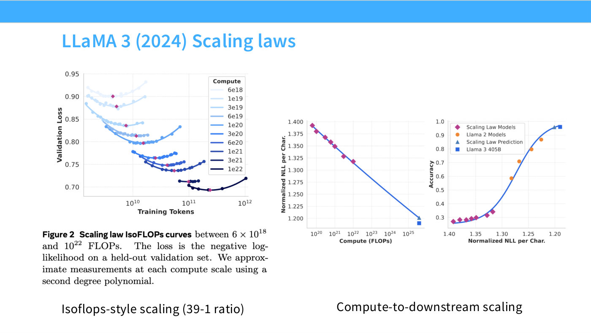

Heading: "LLaMA 3 (2024) Scaling laws".

Two pasted rasters sit side by side, each with its own caption line printed by the deck beneath it: on the left, "Isoflops-style scaling (39-1 ratio)"; on the right, "Compute-to-downstream scaling". The slide prints no bibliographic citation of its own.

**Figure 1 (left) — "Scaling law IsoFLOPs curves": validation loss vs. training tokens, one curve per compute budget.** Pasted from the Llama 3 paper together with its own caption, which reads in full:

> **Figure 2  Scaling law IsoFLOPs curves** between $6 \times 10^{18}$ and $10^{22}$ FLOPs. The loss is the negative log-likelihood on a held-out validation set. We approximate measurements at each compute scale using a second degree polynomial.

Y-axis "Validation Loss", **linear** (measured, not judged by eye: the six gridlines for 0.95/0.90/0.85/0.80/0.75/0.70 sit 102.0, 102.5, 102.5, 102.0, 102.0 px apart — flat; a log axis over 0.95→0.70 would have produced a monotone 92→118 px ramp). Range 0.70 to 0.95.
X-axis "Training Tokens", **log** (measured: the $10^{10}$, $10^{11}$, $10^{12}$ tick-label centres sit at 437.0, 690.5 and 944.5 px — 253.5 and 254.0 px per decade, equal). Plot spans roughly $1.3\times10^{9}$ to $1.2\times10^{12}$ tokens.

**Ten data series**, exactly the ten legend entries under the legend header "Compute", drawn as a pale-to-dark blue ramp — 6e18, 1e19, 3e19, 6e19, 1e20, 3e20, 6e20, 1e21, 3e21, 1e22. (The magenta/pink diamonds are **not** an eleventh series and have no legend entry: there are exactly ten of them, one sitting at the minimum of each fitted parabola.) Each series is a scatter of dots plus a smooth second-degree fit through them, forming a shallow U.

Series identities were assigned by matching plotted pixels against the ten legend swatch RGBs — 6e18 (234,243,254), 1e19 (205,230,253), 3e19 (175,215,251), 6e19 (144,187,240), 1e20 (97,163,244), 3e20 (56,128,243), 6e20 (56,97,210), 1e21 (41,73,172), 3e21 (13,29,102), 1e22 (3,10,74) — with the legend's bounding box (x 779–945, y 77–521 in the raster) masked out first, and with antialiased edge pixels removed by erosion (the two palest colours are otherwise indistinguishable from the halo of any darker blue line).

Per series — left endpoint, the marked minimum (the magenta diamond), and right endpoint:

| Compute | left end (tokens, loss) | minimum (tokens, loss) | right end (tokens, loss) |
| --- | --- | --- | --- |
| 6e18 | $1.5\times10^{9}$, 0.920 | $4.4\times10^{9}$, **0.900** | $1.75\times10^{10}$, 0.932 |
| 1e19 | $1.5\times10^{9}$, 0.901 | $5.1\times10^{9}$, **0.878** | $1.7\times10^{10}$, 0.899 |
| 3e19 | $1.4\times10^{9}$, 0.884 | $7.5\times10^{9}$, **0.836** | $1.5\times10^{10}$, 0.842 |
| 6e19 | $\approx3\times10^{9}$, 0.844 | $1.15\times10^{10}$, **0.813** | $1.9\times10^{10}$, 0.815 |
| 1e20 | $3.2\times10^{9}$, 0.833 | $1.5\times10^{10}$, **0.797** | $7.2\times10^{10}$, 0.833 |
| 3e20 | $9.6\times10^{9}$, 0.778 | $2.5\times10^{10}$, **0.764** | $6.1\times10^{10}$, 0.774 |
| 6e20 | $1.3\times10^{10}$, 0.768 | $4.1\times10^{10}$, **0.748** | $8.4\times10^{10}$, 0.756 |
| 1e21 | $1.6\times10^{10}$, 0.755 | $5.5\times10^{10}$, **0.736** | $1.9\times10^{11}$, 0.756 |
| 3e21 | $6.5\times10^{10}$, 0.713 | $9.8\times10^{10}$, **0.712** | $1.5\times10^{11}$, 0.713 |
| 1e22 | $9.6\times10^{10}$, 0.704 | $2.4\times10^{11}$, **0.693** | $1.07\times10^{12}$, 0.719 |

The minima march down and to the right: more compute buys both lower loss and more optimal tokens. No exponent is printed anywhere on this figure; fitting the ten diamond positions myself gives optimal tokens $\propto C^{0.54}$ (my measurement from pixel positions, **not** a number printed on the slide). The "39-1 ratio" in the deck's caption line is the deck's own gloss, not text inside the figure.

**Figure 2 (right pair) — two panels, pasted as one raster with no caption of its own.**

*Left panel — the scaling-law extrapolation.* Y-axis "Normalized NLL per Char.", **linear** (measured: the nine gridlines 1.400…1.200 in 0.025 steps sit 40.5, 41.0, 41.0, 40.0, 41.0, 40.5, 40.5, 41.0 px apart — flat, with no monotone trend; a log axis over that range would have given a monotone 38.0→43.5 px ramp). X-axis "Compute (FLOPs)", **log** (measured: the six tick labels $10^{20}$…$10^{25}$ sit 62.0, 62.0, 62.5, 62.5, 61.5 px apart — 62.1 px per decade). Three things are plotted, all identified against the right panel's legend swatch RGBs with the legend box masked:
- **Seven magenta diamonds** ("Scaling Law Models", RGB 181,61,140): $(6\times10^{19}, 1.392)$, $(1\times10^{20}, 1.380)$, $(3\times10^{20}, 1.368)$, $(6\times10^{20}, 1.358)$, $(1\times10^{21}, 1.349)$, $(3\times10^{21}, 1.328)$, $(1\times10^{22}, 1.318)$.
- **One blue straight line** (RGB 43,101,224) running through the diamonds and on out to the right edge: 1.2825 at $10^{23}$, 1.2506 at $10^{24}$, 1.2187 at $10^{25}$ — i.e. a straight line on these linear-NLL / log-compute axes, slope ≈ $-0.032$ NLL per decade of compute (my measurement; no slope is printed).
- **At $\approx3.8\times10^{25}$ FLOPs**, a steel-blue triangle ("Scaling Law Prediction") at NLL **1.200** and a blue square ("Llama 3 405B") just below it at NLL **1.190** — the actual model landing marginally better than the extrapolation.

*Right panel — NLL to downstream accuracy.* Y-axis "Accuracy", **linear** (measured: the eight tick labels 1.0 down to 0.3 sit 46.0, 46.5, 46.0, 46.0, 46.0, 46.0, 46.5 px apart). X-axis "Normalized NLL per Char.", **linear and reversed** — labelled 1.40, 1.35, 1.30, 1.25, 1.20 left to right, i.e. NLL *decreasing* rightward (measured: the five tick labels sit 88.5, 89.5, 89.0, 89.0 px apart, flat; a log axis would have given a monotone 84.5→94.8 ramp). The slide does not name the downstream benchmark.

The legend sits **inside the plot's coordinate space** (raster x 605–857, y 24–130), so its four swatches would otherwise be read as data points; it was masked before tracing. Four legend entries, i.e. four marker series plus one fitted curve:
- **Scaling Law Models** — magenta diamonds, 7 points: (1.393, 0.271), (1.380, 0.283), (1.368, 0.283), (1.358, 0.291), (1.349, 0.299), (1.329, 0.316), (1.318, 0.342). These are the same seven models as the left panel, and their NLL values match it exactly.
- **Llama 2 Models** — orange circles (RGB 239,134,51), 4 points: (1.282, 0.586), (1.268, 0.709), (1.244, 0.797), (1.226, 0.869).
- **Scaling Law Prediction** — one steel-blue triangle (RGB 74,125,179) at (1.201, **0.955**).
- **Llama 3 405B** — one blue square at (1.191, **0.962**).
- Plus a **blue sigmoid fit** through all of them: accuracy 0.261 at NLL 1.38, 0.276 at 1.36, 0.305 at 1.34, 0.359 at 1.32, 0.450 at 1.30, 0.719 at 1.26, 0.783 at 1.25, 0.839 at 1.24, 0.916 at 1.22, 0.961 at 1.19.

Read together, the right pair is the two-step recipe the deck's caption line names: compute → validation NLL (a straight line in log-compute), then NLL → downstream accuracy (a sigmoid), with the predicted 405B point (0.955) and the realised one (0.962) essentially coinciding.

## Slide 29 — MiniMax-01 (2025)

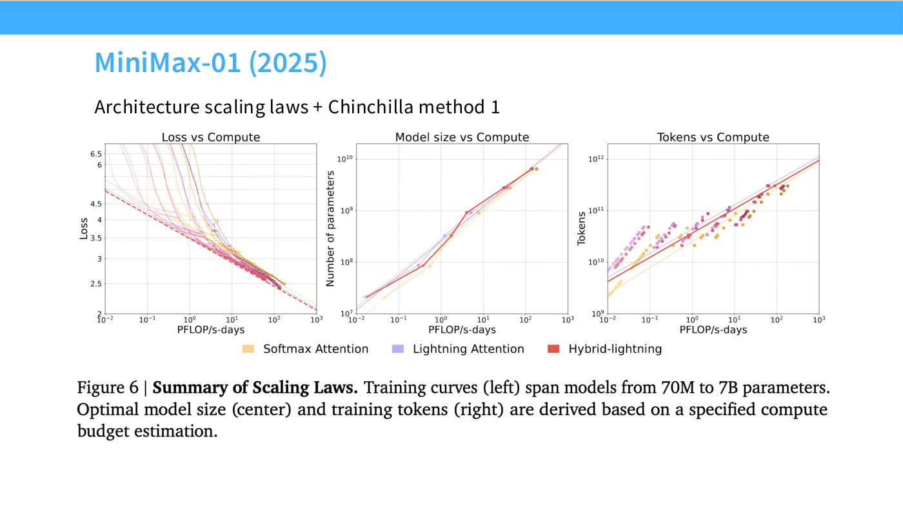

Heading: "MiniMax-01 (2025)". Body line: "Architecture scaling laws + Chinchilla method 1".

One pasted raster fills the rest of the page: a three-panel figure with a shared legend and the paper's own caption, which reads in full:

> Figure 6 | **Summary of Scaling Laws.** Training curves (left) span models from 70M to 7B parameters. Optimal model size (center) and training tokens (right) are derived based on a specified compute budget estimation.

**Three data series throughout** — exactly the three entries in the shared legend printed beneath the panels, with these swatch RGBs: **Softmax Attention** pale orange/tan (248,210,144), **Lightning Attention** light purple (186,173,246), **Hybrid-lightning** red (223,85,67). Every panel plots all three; nothing else in any panel is a series. Within each family the individual runs are drawn as a light-to-dark ramp (paler for the short, small-compute runs; darker gold / magenta / brick for the long ones), but the figure prints no per-model legend, so the number of model sizes cannot be read off the plot — the caption's "70M to 7B" is the only statement of the range.

All six axes are **log**, verified by measurement:
- The three x-axes ("PFLOP/s-days", $10^{-2}$ to $10^{3}$) put their six decade gridlines 123.0, 123.5, 124.0, 124.0 px apart in the left panel and ~124 px apart in the other two.
- Centre and right y-axes: decade gridlines 150.5, 150.0, 150.0 px apart.
- **The left panel's y-axis is the one worth stating explicitly.** It is labelled 6.5, 6, 4.5, 4, 3.5, 3, 2.5, 2 in apparently even 0.5 steps (with unlabelled tick marks at 5.5 and 5), which reads as linear — it is **log**. Measured gaps, top to bottom: 6.5→6 = 31.5 px, 6→5.5 = 35, 5.5→5 = 37.5, 5→4.5 = 41.5, 4.5→4 = 47, 4→3.5 = 52.5, 3.5→3 = 61, 3→2.5 = 72.5, 2.5→2 = 88. A log fit at 911.3 px/decade predicts 31.7, 34.4, 37.7, 41.7, 46.6, 52.8, 61.0, 72.2, 88.3 — every residual under 0.5 px. A linear axis would have given nine identical 51.8 px gaps.

**Panel 1 (left) — "Loss vs Compute".** Y-axis "Loss" (log, 2 to ~6.9); x-axis "PFLOP/s-days" (log, $10^{-2}$ to $10^{3}$). A dense fan of individual training curves — roughly a dozen visible crossing the top edge of the frame, in interleaved groups of three (one per architecture) at successive compute scales — each plunging steeply from above the top of the frame and then flattening into a common descending band. Under the fan run **three dashed fitted lines**, one per architecture, each a straight line on these log-log axes (thick dashed for Hybrid-lightning, thin dashed for the other two). Their values, taken as the lowest-drawn pixel of each colour family:

| PFLOP/s-days | Softmax (yellow, dashed) | Lightning (purple, dashed) | Hybrid-lightning (red, thick dashed) |
| --- | --- | --- | --- |
| $10^{-2}$ | 5.32 | 5.00 | 4.89 |
| $10^{-1}$ | ≈4.4 | 4.21 | 4.11 |
| $10^{0}$ | 3.78 | 3.54 | 3.49 |
| $10^{1}$ | 3.09 | 3.03 | 2.93 |
| $10^{2}$ | 2.59 | 2.50 | 2.45 |
| $10^{2.9}$ | 2.17 | 2.12 | 2.09 |

The three lines are near-parallel and ordered the same way at every compute: **Hybrid-lightning lowest (best loss), Lightning Attention next, Softmax Attention highest.** The gap is small — about 0.08 nats at $10^{2.9}$ PFLOP/s-days — and is roughly constant in log terms across five decades. Fitting the red line's own points gives Loss $\propto C^{-0.074}$ (my measurement from pixels; no exponent is printed anywhere in the figure).

**Panel 2 (centre) — "Model size vs Compute".** Y-axis "Number of parameters" (log, $10^{7}$ to just above $10^{10}$); x-axis "PFLOP/s-days" (log, $10^{-2}$ to $10^{3}$). Each architecture is drawn twice: a **solid polyline with round markers** (the empirical compute-optimal points, joined) and a **thin straight dashed line** (its power-law fit). The Hybrid-lightning polyline is drawn thickest and on top, which hides the other two wherever they coincide. Marker positions, grouped by the parameter count they share:

| Optimal $N$ | Softmax (PFLOP/s-days) | Lightning | Hybrid-lightning |
| --- | --- | --- | --- |
| $\approx2.1\times10^{7}$ | 0.043 | 0.017 | 0.017 |
| $\approx8.7\times10^{7}$ | 0.54 | 0.29 | 0.38 |
| $\approx3.3\times10^{8}$ | *(no marker)* | 1.20 | 1.75 |
| $\approx9.1\times10^{8}$ | 7.7 | 5.0 | 4.0 |
| $\approx2.8\times10^{9}$ | 43 | 37 | 30 |
| $\approx6.5\times10^{9}$ | 177 | ≈137 | ≈137 |

At every parameter count the Softmax point sits furthest right, i.e. it needs the most compute to justify the same model size; Hybrid-lightning needs the least at four of the six. The three polylines are otherwise nearly coincident, and all three are visibly *not* straight: each has a flat stretch between about 0.3 and 1 PFLOP/s-days and a steeper stretch above it, which is why the straight dashed fits sit above the polylines at low compute and cross them around 1–5 PFLOP/s-days. (The Lightning and Hybrid markers at the two ends overlap so exactly that they render as one blended blob; the values above are from the blob centroid.)

**Panel 3 (right) — "Tokens vs Compute".** Y-axis "Tokens" (log, $10^{9}$ to just above $10^{12}$); x-axis "PFLOP/s-days" (log, $10^{-2}$ to $10^{3}$). A scatter of dots in the three colour families plus **three solid straight fitted lines**. The fitted lines:

| PFLOP/s-days | Softmax (yellow) | Lightning (purple) | Hybrid-lightning (red, thick) |
| --- | --- | --- | --- |
| $10^{0}$ | $2.5\times10^{10}$ | $4.4\times10^{10}$ | $3.7\times10^{10}$ |
| $10^{0.5}$ | $4.6\times10^{10}$ | $7.6\times10^{10}$ | $6.4\times10^{10}$ |
| $10^{1}$ | $8.5\times10^{10}$ | $1.30\times10^{11}$ | $1.09\times10^{11}$ |
| $10^{1.5}$ | $1.5\times10^{11}$ | $2.24\times10^{11}$ | $1.88\times10^{11}$ |
| $10^{2}$ | $2.8\times10^{11}$ | $3.84\times10^{11}$ | $3.24\times10^{11}$ |
| $10^{2.5}$ | $4.9\times10^{11}$ | $6.60\times10^{11}$ | $5.58\times10^{11}$ |

Measured slopes (mine, not printed): Softmax $D \propto C^{0.52}$, Lightning $C^{0.47}$, Hybrid-lightning $C^{0.47}$. The ordering is the mirror of panel 2 — Softmax wants the *fewest* tokens and (from panel 2) the *most* parameters at a given budget; the two linear-attention variants want more tokens and fewer parameters. The scatter itself sits well above the fitted lines at the low-compute end (dots at $3$–$5\times10^{10}$ tokens near $10^{-1}$ PFLOP/s-days against fitted values around $10^{10}$), and straddles them from $10^{0}$ rightward.

The slide's own framing — "Architecture scaling laws + Chinchilla method 1" — matches what is drawn: panel 1 is the Chinchilla approach-1 construction (fit the lower envelope of a family of training curves), and panels 2 and 3 read the optimal $N$ and $D$ off that envelope, done separately for each of three attention architectures.

## Slide 30 — Recent scaling law recipes

Heading: "Recent scaling law recipes". This page is text only — it carries no figure.

**DeepSeek recipe**
- Assume most transformer hypers are invariant to scale
- Do a scaling analysis on batch / LR to figure out optimal scaling
- IsoFLOP analysis to figure out model sizing
  - Use a piecewise-linear schedule to make chinchilla scaling cheap.

**miniCPM recipe**
- Use muP to make transformer + LR invariant to scale
- Use a piecewise linear schedule to get sample for Chinchilla method 3 (curve fitting)

Then a centred line: "Recent (late 2024+) but less detailed", followed by four entries:

- **Qwen –** Lr/batch (very few details..)
- **Kimi K2** – MoE scaling
- **LLaMA 3 / Hunyuan**
  - Just isoflops (no other scaling details)
- **Minimax**
  - Architecture choice / decision scaling

## Slide 31 — Optimizer scaling

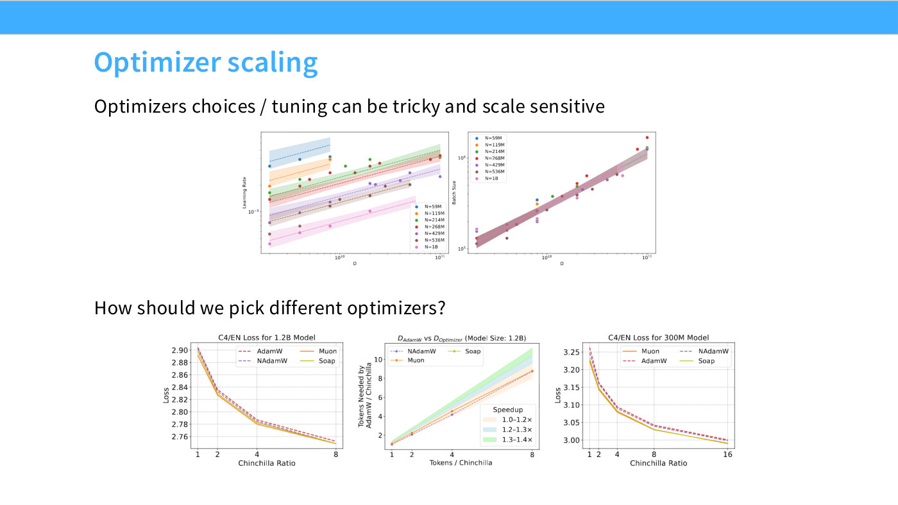

Heading: "Optimizer scaling". Body line above the first figure: "Optimizers choices / tuning can be tricky and scale sensitive". Body line above the second figure: "How should we pick different optimizers?"

**Figure 1 — a two-panel log-log scatter-plus-fit figure: optimal learning rate and optimal batch size against dataset size $D$, one series per model size $N$.** Both panels share the same x-axis, "D", **log** scale (measured: within the left panel the major ticks $10^{10}$ and $10^{11}$ sit 307 px apart, and the intervening minor ticks fall at +93, +147, +185, +215, +239, +260, +277, +293 px — i.e. at $\log_{10}2, \log_{10}3, \ldots$ — which is the log signature). Plotted x-range is roughly $1.6\times10^{9}$ to $1.2\times10^{11}$ in both panels. Each panel shows the same **seven** series, per the legend: N=59M (blue), N=119M (orange), N=214M (green), N=268M (red), N=429M (purple), N=536M (brown), N=1B (pink). Each series is drawn as scatter dots plus a dashed straight fit line plus a translucent confidence band in the same colour.

- **Left panel, y-axis "Learning Rate", log scale** (measured: the single labelled major tick $10^{-3}$ has minor ticks below it at 12.5, 26.5, 41.5, 59.5, 81.5, 107.5 px — the $9,8,7,6,5,4\times10^{-4}$ log spacing — for a decade of ≈273 px). Visible y-range roughly $3.4\times10^{-4}$ (bottom) to $7.7\times10^{-3}$ (top). The seven fit lines are stacked in strict order of model size, largest $N$ lowest, and all seven slope **upward** with $D$:
  - N=59M (blue), the topmost: about $3.1\times10^{-3}$ at $D\approx2\times10^{9}$ rising to about $4.2\times10^{-3}$; it is one of the two shortest series, stopping at $D\approx8\times10^{9}$.
  - N=119M (orange): about $2.0\times10^{-3}$ at $D\approx2\times10^{9}$ rising to about $3.9\times10^{-3}$; also stops at $D\approx8\times10^{9}$.
  - N=214M (green): about $1.5\times10^{-3}$ at $D\approx2\times10^{9}$ rising to about $4.0\times10^{-3}$ at $D\approx10^{11}$ (full width).
  - N=268M (red): about $1.3\times10^{-3}$ at $D\approx2\times10^{9}$ rising to about $4.2\times10^{-3}$ at $D\approx10^{11}$ (full width).
  - N=429M (purple): about $8\times10^{-4}$ at $D\approx2\times10^{9}$ rising to about $2.7\times10^{-3}$ at $D\approx10^{11}$ (full width).
  - N=536M (brown): about $6\times10^{-4}$ at $D\approx2\times10^{9}$ rising to about $2.0\times10^{-3}$; stops at $D\approx5\times10^{10}$.
  - N=1B (pink), the lowest: about $4.5\times10^{-4}$ at $D\approx2\times10^{9}$ rising to about $1.3\times10^{-3}$; stops at $D\approx6\times10^{10}$.
- **Right panel, y-axis "Batch Size", log scale** (measured: $10^{6}$ and $10^{5}$ sit 276.5 px apart with minor ticks at the $9,8,7,6,5,4,3,2\times$ log positions). Visible y-range roughly $8.9\times10^{4}$ to $1.9\times10^{6}$. Here the seven series **do not separate**: all the coloured scatter points and all seven fit bands lie on essentially one common line running from about $(2\times10^{9},\,1.2\times10^{5})$ to about $(10^{11},\,1.4\times10^{6})$, with the bands so overlapped that only a single mauve/pink composite band is visible. Individual extremes: red reaches $\approx1.7\times10^{6}$ at $D\approx10^{11}$ (the highest single point on the panel) and $\approx1.3\times10^{5}$ at the left; green runs $3.7\times10^{5}$ to $1.3\times10^{6}$; brown $1.1\times10^{5}$ to $6.7\times10^{5}$; pink $1.2\times10^{5}$ to $8.0\times10^{5}$; blue and orange contribute only a single point each at $D\approx8\times10^{9}$ ($3.4\times10^{5}$ and $3.1\times10^{5}$).

The contrast between the two panels is the point: optimal learning rate depends on **both** $N$ and $D$ (seven cleanly separated lines), while optimal batch size depends on $D$ essentially alone (seven lines collapsed into one).

**Figure 2 — a three-panel optimizer-comparison figure (AdamW / NAdamW / Muon / Soap).** All three panels use **linear** axes (measured on the x-axes: the ticks 1, 2, 4, 8 sit at pixel gaps of 54.5, 106, 214.5 in the left panel and 55, 108.5, 217.5 in the middle — a 1:2:4 doubling of *distance* per doubling of *value*, which is linear, not log; the right panel's 1, 2, 4, 8, 16 gaps of 26, 49.5, 100.5, ≈200 are the same pattern).

- **Left panel, titled "C4/EN Loss for 1.2B Model".** Y-axis "Loss", linear, ticked 2.76 to 2.90 in steps of 0.02. X-axis "Chinchilla Ratio", ticked 1, 2, 4, 8. **Four** series per the legend: AdamW (red dashed), NAdamW (purple dashed), Muon (orange solid), Soap (yellow-green solid). All four fall steeply from ratio 1 to 2 and then flatten. Values by x-position — at 1: AdamW ≈2.904, NAdamW ≈2.902, Soap ≈2.897, Muon ≈2.891; at 2: AdamW ≈2.836, NAdamW ≈2.834, Soap ≈2.830, Muon ≈2.827; at 4: AdamW ≈2.787, NAdamW ≈2.784, Soap ≈2.782, Muon ≈2.780; at 8: AdamW ≈2.753 and the other three converge at ≈2.748–2.749. AdamW is the worst (topmost) curve at every x; Muon is at or near the bottom throughout.
- **Middle panel, titled "$D_{AdamW}$ vs $D_{Optimizer}$ (Model Size: 1.2B)".** Y-axis "Tokens Needed by AdamW / Chinchilla", linear, ticked 2, 4, 6, 8, 10. X-axis "Tokens / Chinchilla", linear, ticked 1, 2, 4, 8. **Three** curves in the upper legend — NAdamW (purple dashed with markers), Muon (orange solid with markers), Soap (yellow-green solid with markers, drawn underneath and almost entirely hidden by Muon) — plus a second legend headed "Speedup" whose three entries are shaded *bands*, not curves: 1.0–1.2× (pale orange), 1.2–1.3× (pale blue), 1.3–1.4× (pale green), stacked from lowest to highest across the panel. Curve values — at 1: Muon/Soap ≈1.1, NAdamW ≈1.0; at 2: Muon ≈2.25, NAdamW ≈2.05; at 4: Muon ≈4.55, NAdamW ≈4.2; at 8: all three ≈8.75. The curves track the bottom of the pale-orange 1.0–1.2× band, i.e. the measured speedups sit at the low end of the plotted range.
- **Right panel, titled "C4/EN Loss for 300M Model".** Y-axis "Loss", linear, ticked 3.00 to 3.25 in steps of 0.05. X-axis "Chinchilla Ratio", linear, ticked 1, 2, 4, 8, 16. Same **four** series (legend order here is Muon, AdamW, NAdamW, Soap). Values — at 1: AdamW ≈3.262, NAdamW ≈3.250, Soap ≈3.232, Muon ≈3.225; at 2: AdamW ≈3.162, NAdamW ≈3.160, Soap/Muon ≈3.145; at 4: AdamW ≈3.093, NAdamW ≈3.088, Muon/Soap ≈3.079; at 8: AdamW ≈3.042, NAdamW ≈3.038, Muon/Soap ≈3.029; at 16: AdamW ≈3.001, NAdamW ≈2.999, Muon/Soap ≈2.990. Muon and Soap run together as the lower pair at every x; AdamW is the upper (worst) curve throughout.

Across all three panels the spread between the best and worst optimizer is small — a few thousandths of a nat in loss, and a speedup at the bottom of the 1.0–1.2× band — which is the setup for the slide's question, "How should we pick different optimizers?"

## Slide 32 — StepFun scaling law study

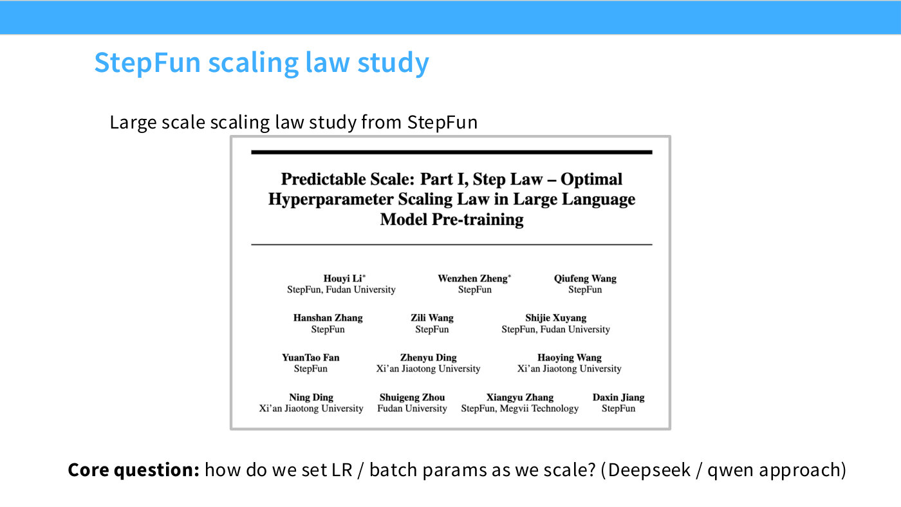

Heading: "StepFun scaling law study". Body text above the figure: "Large scale scaling law study from StepFun". Body text at the foot of the page, below the figure: "**Core question:** how do we set LR / batch params as we scale? (Deepseek / qwen approach)"

**Figure 1 — a screenshot of the title block of the cited paper.** Title, in three lines: "Predictable Scale: Part I, Step Law – Optimal Hyperparameter Scaling Law in Large Language Model Pre-training". Below a horizontal rule, the author list in four rows:

| Author | Affiliation |
| --- | --- |
| Houyi Li* | StepFun, Fudan University |
| Wenzhen Zheng* | StepFun |
| Qiufeng Wang | StepFun |
| Hanshan Zhang | StepFun |
| Zili Wang | StepFun |
| Shijie Xuyang | StepFun, Fudan University |
| YuanTao Fan | StepFun |
| Zhenyu Ding | Xi'an Jiaotong University |
| Haoying Wang | Xi'an Jiaotong University |
| Ning Ding | Xi'an Jiaotong University |
| Shuigeng Zhou | Fudan University |
| Xiangyu Zhang | StepFun, Megvii Technology |
| Daxin Jiang | StepFun |

(The asterisks on Houyi Li and Wenzhen Zheng are printed as shown; the screenshot is cropped below the author list, so no footnote explaining them appears on the slide.)

## Slide 33 — Core question – scaling rates on LR and batch

Heading: "Core question – scaling rates on LR and batch". Body text above the table: "What are the right variables / functional form?"

**Table — comparison of published optimal-hyperparameter scaling laws** (reproduced from the StepFun paper; the bracketed numbers are that paper's own reference numbers, printed in blue as hyperlinks). Seven rows, the last being the paper's own method, set off by a rule.

| Name | Data Recipe | Model Sparsity | Learning Rate | Batch Size | Relative Error |
| --- | --- | --- | --- | --- | --- |
| OpenAI Law [20] | ✘ | ✘ | $3.239 * 10^{-3} + -1.395 * 10^{-4} log(N)$ | $2e18\,\mathcal{L}^{-4.76190}$ | 9.51‰ |
| Microsoft Law [2] | ✘ | ✘ | $1.3192 e^{-5} N^{-0.23} D^{-0.32}$ | - | 9.25‰ |
| DeepSeek Law [6] | ✘ | ✘ | $0.3188\, C^{-0.1250}$ | $0.2920\, C^{0.3271}$ | 9.26‰ |
| Porian Law [26] | ✘ | ✘ | $3.7 N^{-0.36}$ | $0.7576\, N^{0.703}$ | 3.71‰ |
| MiniCPM Law [18] | ✘ | ✘ | - | $\dfrac{2e18}{L^{6.24}}$ | - |
| MeiTuan Law [36] | ✘ | ✔ | $\lambda \mathcal{L}^{-\alpha}$ | $\lambda_B \mathcal{L}^{-\alpha_B^{-1}}$ | - |
| **Ours (Step Law)** | ✔ | ✔ | $1.79 N^{-0.713} D^{0.307}$ | $0.58 D^{0.571}$ | **0.94‰** |

The two check-mark columns record whether each law accounts for the data recipe and for model sparsity; only the last row (Step Law) has ✔ in both. The Relative Error column is in per-mille (‰), and Step Law's 0.94‰ is bolded as the best — roughly four times better than the next-best entry (Porian Law, 3.71‰) and ten times better than OpenAI/Microsoft/DeepSeek (9.2–9.5‰).

Below the table, body text:

**Different views:**
- Critical batch: batch as a function of loss (OpenAI)
- Compute power law: poly function of compute (DeepSeek)
  - .. Or something else?

## Slide 34 — The approach: purely empirical – grid search the space

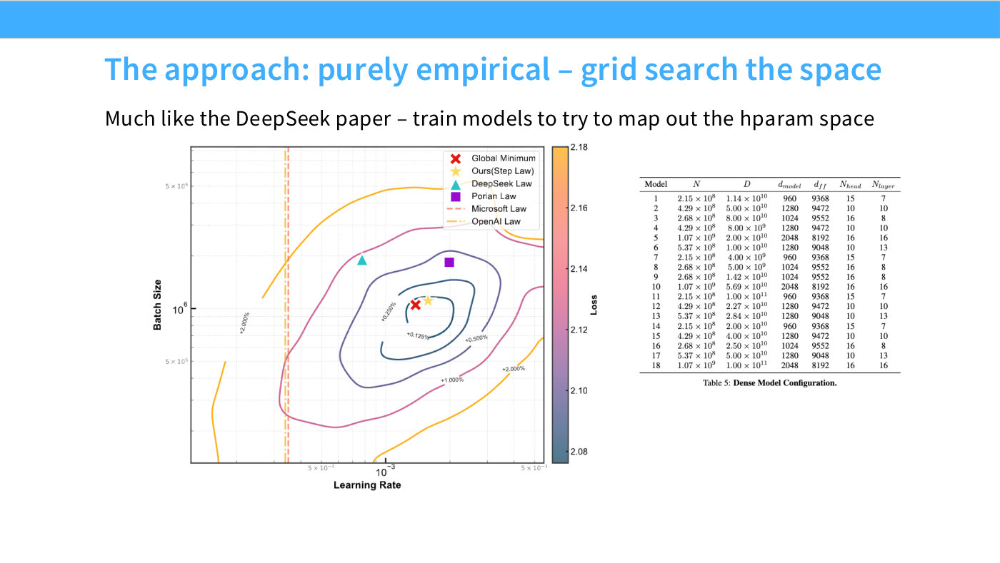

Heading: "The approach: purely empirical – grid search the space". Body text: "Much like the DeepSeek paper – train models to try to map out the hparam space". Two images sit side by side below it.

**Figure 1 (left) — a contour map of training loss over the (learning rate, batch size) plane, with each published scaling law's predicted optimum marked.** X-axis "Learning Rate", **log** scale, labelled at $5\times10^{-4}$, $10^{-3}$ and $5\times10^{-3}$ (measured, not assumed: the gaps are 124 px for the $\log_{10}2$ step and 286 px for the $\log_{10}5$ step, a ratio of 2.31 against the 2.32 that log predicts — ≈410 px per decade). Plotted x-range about $1.2\times10^{-4}$ to $5.5\times10^{-3}$. Y-axis "Batch Size", **log** scale, labelled at $5\times10^{6}$, $10^{6}$ and $5\times10^{5}$ (measured: 235 px for the $\log_{10}5$ step and 103 px for the $\log_{10}2$ step, ratio 2.28 — ≈338 px per decade). Plotted y-range about $1.3\times10^{5}$ to $8.3\times10^{6}$. A vertical colorbar on the right is labelled "Loss", **linear** (measured: its six tick labels are spaced 117.0, 117.5, 117.5, 117.0, 117.5 px — exactly even), ticked 2.08 at the bottom through 2.18 at the top in steps of 0.02, running dark teal (low loss) → slate blue → magenta → orange (high loss).

The surface is drawn as **five nested closed iso-loss contours**, each labelled in-line with the percentage by which loss exceeds the global minimum, from the inside out:
- **+0.125%** — dark teal, the innermost loop. At batch size $10^{6}$ it spans learning rates from about $1.25\times10^{-3}$ to $2.1\times10^{-3}$.
- **+0.250%** — navy.
- **+0.500%** — slate blue-purple.
- **+1.000%** — magenta. At batch size $10^{6}$ it is crossed at learning rate $\approx4.7\times10^{-4}$ on the left and $\approx4.2\times10^{-3}$ on the right.
- **+2.000%** — orange, the outermost; it is the only contour that runs off the plot edges, appearing as arcs across the top and along the bottom-left and bottom-right.

All five loops are elongated along a diagonal running from lower-left to upper-right — higher learning rate pairs with larger batch size — and they are convex and singly-peaked around one interior minimum.

Six legend entries (top right), i.e. **four point markers and two lines**:
- **Global Minimum** — red ✕. Sits at learning rate $\approx1.4\times10^{-3}$, batch size $\approx1.04\times10^{6}$.
- **Ours(Step Law)** — gold star. Sits at learning rate $\approx1.6\times10^{-3}$, batch size $\approx1.1\times10^{6}$, immediately up and to the right of the red ✕ and **inside the innermost +0.125% contour**.
- **DeepSeek Law** — cyan triangle. Sits at learning rate $\approx7.8\times10^{-4}$, batch size $\approx1.85\times10^{6}$ — up and to the left of the minimum, **between the +0.500% and +1.000% contours**.
- **Porian Law** — purple square. Sits at learning rate $\approx2.0\times10^{-3}$, batch size $\approx1.83\times10^{6}$ — up and to the right of the minimum, **between the +0.250% and +0.500% contours**.
- **Microsoft Law** — a salmon dashed **vertical** line at learning rate $\approx3.5\times10^{-4}$, spanning the full height of the plot (it predicts a learning rate only, with no batch-size dependence).
- **OpenAI Law** — a gold dash-dot **vertical** line at learning rate $\approx3.4\times10^{-4}$, essentially on top of the Microsoft line and just to its left, also spanning the full height.

Both vertical lines sit about a factor of four below the optimal learning rate, well outside the +1.000% contour at every batch size shown. Read against the slide's argument, the picture is that Step Law's prediction lands inside the tightest contour while the other four laws land on progressively worse iso-loss rings.

**Figure 2 (right) — a reproduced table, "Table 5: Dense Model Configuration."** Eighteen model configurations swept in the grid search.

| Model | $N$ | $D$ | $d_{model}$ | $d_{ff}$ | $N_{head}$ | $N_{layer}$ |
| --- | --- | --- | --- | --- | --- | --- |
| 1 | $2.15\times10^{8}$ | $1.14\times10^{10}$ | 960 | 9368 | 15 | 7 |
| 2 | $4.29\times10^{8}$ | $5.00\times10^{10}$ | 1280 | 9472 | 10 | 10 |
| 3 | $2.68\times10^{8}$ | $8.00\times10^{10}$ | 1024 | 9552 | 16 | 8 |
| 4 | $4.29\times10^{8}$ | $8.00\times10^{9}$ | 1280 | 9472 | 10 | 10 |
| 5 | $1.07\times10^{9}$ | $2.00\times10^{10}$ | 2048 | 8192 | 16 | 16 |
| 6 | $5.37\times10^{8}$ | $1.00\times10^{10}$ | 1280 | 9048 | 10 | 13 |
| 7 | $2.15\times10^{8}$ | $4.00\times10^{9}$ | 960 | 9368 | 15 | 7 |
| 8 | $2.68\times10^{8}$ | $5.00\times10^{9}$ | 1024 | 9552 | 16 | 8 |
| 9 | $2.68\times10^{8}$ | $1.42\times10^{10}$ | 1024 | 9552 | 16 | 8 |
| 10 | $1.07\times10^{9}$ | $5.69\times10^{10}$ | 2048 | 8192 | 16 | 16 |
| 11 | $2.15\times10^{8}$ | $1.00\times10^{11}$ | 960 | 9368 | 15 | 7 |
| 12 | $4.29\times10^{8}$ | $2.27\times10^{10}$ | 1280 | 9472 | 10 | 10 |
| 13 | $5.37\times10^{8}$ | $2.84\times10^{10}$ | 1280 | 9048 | 10 | 13 |
| 14 | $2.15\times10^{8}$ | $2.00\times10^{10}$ | 960 | 9368 | 15 | 7 |
| 15 | $4.29\times10^{8}$ | $4.00\times10^{10}$ | 1280 | 9472 | 10 | 10 |
| 16 | $2.68\times10^{8}$ | $2.50\times10^{10}$ | 1024 | 9552 | 16 | 8 |
| 17 | $5.37\times10^{8}$ | $5.00\times10^{10}$ | 1280 | 9048 | 10 | 13 |
| 18 | $1.07\times10^{9}$ | $1.00\times10^{11}$ | 2048 | 8192 | 16 | 16 |

(The table has no total or average row. Only five distinct architectures appear — $N$ = $2.15\times10^{8}$, $2.68\times10^{8}$, $4.29\times10^{8}$, $5.37\times10^{8}$, $1.07\times10^{9}$ — each reused at several dataset sizes $D$, so $d_{model}$/$d_{ff}$/$N_{head}$/$N_{layer}$ repeat with $N$.)

## Slide 35 — Observation 1: loss over batch/LR are convex

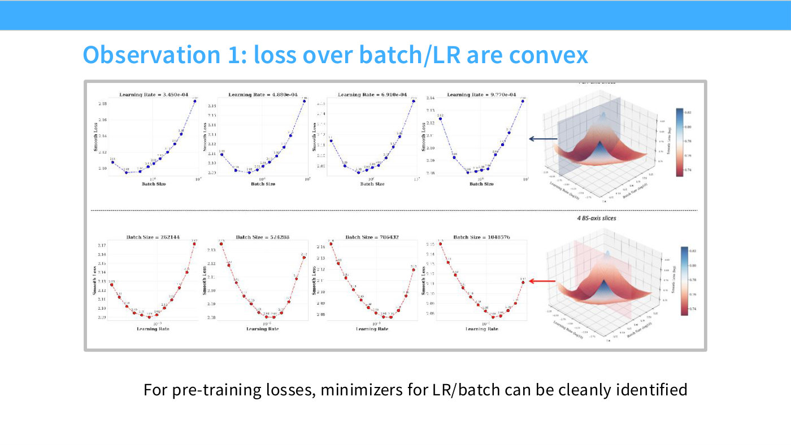

Heading: "Observation 1: loss over batch/LR are convex". Body text below the figure: "For pre-training losses, minimizers for LR/batch can be cleanly identified"

**Figure 1 — a ten-panel figure inside a grey frame: two rows of four one-dimensional slices through the smooth-loss surface, each row ending in a 3-D rendering of that surface with the slicing plane drawn in.** A dashed horizontal rule separates the two rows. An italic annotation "4 LR-axis slices" sits above the top row's 3-D inset (clipped by the top edge of the pasted image, so only the bottom sliver of the letters survives); "4 BS-axis slices" sits above the bottom row's inset, fully printed.

**Top row — four panels, each holding the learning rate fixed and sweeping batch size.** Every panel: y-axis "Smooth Loss", **linear**; x-axis "Batch Size", **log** (measured: the labelled ticks $10^{6}$ and $10^{7}$ are 93 px apart in each panel, and the ten markers land on a geometric grid). Ten dark-blue filled circles joined by a blue dashed line, each annotated with its own value to two decimals. Batch sizes swept are approximately $1.3\times10^{5}$, $2.6\times10^{5}$, $5.2\times10^{5}$, $7.9\times10^{5}$, $1.05\times10^{6}$, $1.45\times10^{6}$, $2.1\times10^{6}$, $3.0\times10^{6}$, $4.2\times10^{6}$, $8.3\times10^{6}$. Each curve is a clean U: it falls to a single interior minimum and rises steeply on the right.

- **"Learning Rate = 3.450e-04"** (y-axis ticked 2.10–2.18 in steps of 0.02). Losses across the ten batch sizes: 2.107, **2.095**, 2.096, 2.102, 2.106, 2.112, 2.120, 2.130, 2.143, 2.183. Minimum at batch $\approx2.6\times10^{5}$.
- **"Learning Rate = 4.880e-04"** (ticked 2.09–2.16 in steps of 0.01). Losses: 2.109, 2.093, **2.090**, 2.093, 2.097, 2.101, 2.108, 2.117, 2.129, 2.165. Minimum at batch $\approx5.2\times10^{5}$.
- **"Learning Rate = 6.910e-04"** (ticked 2.09–2.15 in steps of 0.01). Losses: 2.114, 2.090, **2.084**, 2.086, 2.089, 2.091, 2.098, 2.108, 2.118, 2.152. Minimum at batch $\approx5.2\times10^{5}$.
- **"Learning Rate = 9.770e-04"** (ticked 2.08–2.14 in steps of 0.01). Losses: 2.124, 2.093, **2.080**, 2.081, 2.082, 2.083, 2.095, 2.103, 2.112, 2.138. Minimum at batch $\approx5.2\times10^{5}$, with the next three batch sizes almost tied.

**Bottom row — four panels, each holding the batch size fixed and sweeping learning rate.** Every panel: y-axis "Smooth Loss", **linear**; x-axis "Learning Rate", **log**, with a single labelled tick $10^{-3}$ near the middle of each panel (measured: the twelve markers are evenly spaced at 15.2 px, and calibrating against the four learning-rate values printed as the top row's panel titles — 3.450e-04, 4.880e-04, 6.910e-04, 9.770e-04, a $\sqrt{2}$ ladder — puts the decade at 101 px). Twelve red filled circles joined by a red dashed line, each annotated with its own two-decimal value. The learning rates swept are the $\sqrt{2}$ ladder $1.22\times10^{-4}$, $1.73\times10^{-4}$, $2.44\times10^{-4}$, $3.45\times10^{-4}$, $4.88\times10^{-4}$, $6.91\times10^{-4}$, $9.77\times10^{-4}$, $1.38\times10^{-3}$, $1.95\times10^{-3}$, $2.76\times10^{-3}$, $3.91\times10^{-3}$, $5.53\times10^{-3}$. Again each curve is a clean U.

- **"Batch Size = 262144"** (y ticked 2.09–2.17 in steps of 0.01). Losses: 2.126, 2.113, 2.102, 2.095, 2.093, **2.090**, 2.093, 2.101, 2.110, 2.123, 2.140, 2.172. Minimum at LR $\approx6.9\times10^{-4}$.
- **"Batch Size = 524288"** (y ticked 2.08–2.13 in steps of 0.01). Losses: 2.135, 2.119, 2.106, 2.096, 2.090, 2.084, 2.080, **2.080**, 2.083, 2.092, 2.109, 2.124. Minimum at LR $\approx1.0$–$1.4\times10^{-3}$ (the 7th and 8th points are tied).
- **"Batch Size = 786432"** (y ticked 2.08–2.14 in steps of 0.01). Losses: 2.143, 2.125, 2.112, 2.102, 2.093, 2.086, 2.081, 2.078, **2.078**, 2.084, 2.096, 2.120. Minimum at LR $\approx1.4$–$2.0\times10^{-3}$.
- **"Batch Size = 1048576"** (y ticked 2.08–2.15 in steps of 0.01). Losses: 2.150, 2.132, 2.119, 2.106, 2.097, 2.088, 2.082, **2.076**, 2.077, 2.083, 2.090, 2.111. Minimum at LR $\approx1.4\times10^{-3}$ — the lowest loss anywhere in the eight panels.

(The eight panels are consistent with one another: the four cross-checks where a top-row and a bottom-row panel share a grid cell — e.g. LR $6.91\times10^{-4}$ with batch 1048576 — agree to within 0.0003 in loss.)

**The two 3-D insets** (one at the right of each row) are the same rendering: a 3-D surface over x-axis "Learning Rate (log10)" and y-axis "Batch Size (log2 D)", with a vertical axis and a colorbar both labelled "Smooth Loss (log)". The colorbar carries five evenly spaced tick labels, **0.82 at the top through 0.80, 0.78, 0.76 to 0.74 at the bottom**, and its gradient runs dark blue at the top, through white at about 0.78, to dark red at the bottom (measured pixel-by-pixel down the bar). The surface itself is a single smooth basin — a rim rising on all sides, coloured dark red, dropping to a blue-white floor at the centre of the grid. The top inset has a translucent **blue** vertical plane standing in it, with a dark-blue arrow running left from that plane to the fourth top panel; the bottom inset has a translucent **red/pink** vertical plane, with a red arrow running left to the fourth bottom panel — i.e. each plane marks which slice the neighbouring line panel is.

Taken together, the slide's claim holds up against its own data: every one of the eight slices is single-minimum and U-shaped, so an optimum in learning rate and in batch size can be read straight off each curve.

## Slide 36 — Observation 2: scaling trends

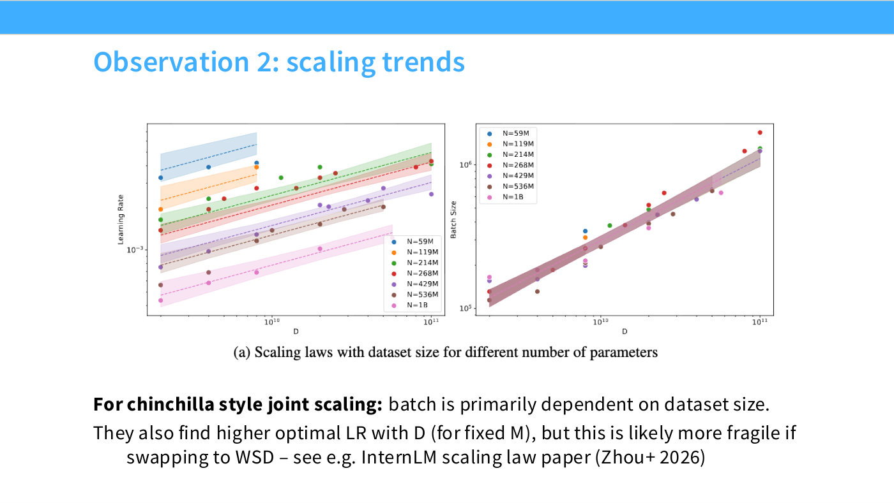

Heading: "Observation 2: scaling trends". Body text below the figure:

"**For chinchilla style joint scaling:** batch is primarily dependent on dataset size."

"They also find higher optimal LR with D (for fixed M), but this is likely more fragile if swapping to WSD – see e.g. InternLM scaling law paper (Zhou+ 2026)"

**Figure 1 — the same two-panel log-log figure that appears at the top of slide 31, here printed with its source caption.** Caption below the figure: "(a) Scaling laws with dataset size for different number of parameters".

Both panels: x-axis "D", **log** scale (measured on this copy: the labelled major ticks $10^{10}$ and $10^{11}$ are 286.5 px apart in the left panel and 287 px apart in the right, and the minor ticks between them fall at $+86,+136,+172,+199,+222,+241,+258,+272$ px — the $\log_{10}2,\log_{10}3,\ldots$ spacing). Plotted x-range roughly $1.6\times10^{9}$ to $1.2\times10^{11}$. **Seven** series in each panel, per the legend, each drawn as scatter dots plus a dashed straight fit line plus a translucent band: N=59M (blue), N=119M (orange), N=214M (green), N=268M (red), N=429M (purple), N=536M (brown), N=1B (pink).

- **Left panel, y-axis "Learning Rate", log scale** (measured: the one labelled tick $10^{-3}$ has minor ticks at +11.5, +24.5, +39, +55.5, +75.5, +99.5 px below it and −75.5, −119.5, −151, −175.5, −195, −212 px above — the $9,8,7,6,5,4\times$ and $2,3,4,5,6,7\times$ log positions, giving ≈251 px per decade). The seven fit lines are stacked in strict order of model size, **largest N lowest**, and every one slopes **upward** with $D$. Approximate values, read at $D\approx2\times10^{9}$ and at each line's right-hand end: N=59M $3.1\times10^{-3}\to4.2\times10^{-3}$ (stops at $D\approx8\times10^{9}$); N=119M $2.0\times10^{-3}\to3.9\times10^{-3}$ (stops at $D\approx8\times10^{9}$); N=214M $1.5\times10^{-3}\to4.0\times10^{-3}$ at $10^{11}$; N=268M $1.3\times10^{-3}\to4.2\times10^{-3}$ at $10^{11}$; N=429M $8\times10^{-4}\to2.7\times10^{-3}$ at $10^{11}$; N=536M $6\times10^{-4}\to2.0\times10^{-3}$ (stops at $D\approx5\times10^{10}$); N=1B $4.5\times10^{-4}\to1.3\times10^{-3}$ (stops at $D\approx6\times10^{10}$). The common log-log slope of the fits measures at roughly 0.25–0.31.
- **Right panel, y-axis "Batch Size", log scale** (measured: $10^{6}$ and $10^{5}$ are 257.5 px apart with minor ticks at the intervening $9,8,7,6,5,4,3,2\times$ log positions). Here the seven series **collapse onto a single line**: all the coloured scatter and all seven bands overlap into one mauve composite running from about $(2\times10^{9},\,1.2\times10^{5})$ to about $(10^{11},\,1.4\times10^{6})$, a log-log slope of roughly 0.6. Blue (N=59M) and orange (N=119M) contribute a single point each, at $D\approx8\times10^{9}$.

The two panels are exactly the evidence the slide's text claims: batch size lies on one curve in $D$ regardless of $N$, while learning rate needs both $N$ and $D$ — and the learning-rate fits do slope *upward* with $D$, which is the "higher optimal LR with D (for fixed M)" the text then flags as fragile.

## Slide 37 — Observation 3 (?) robustness

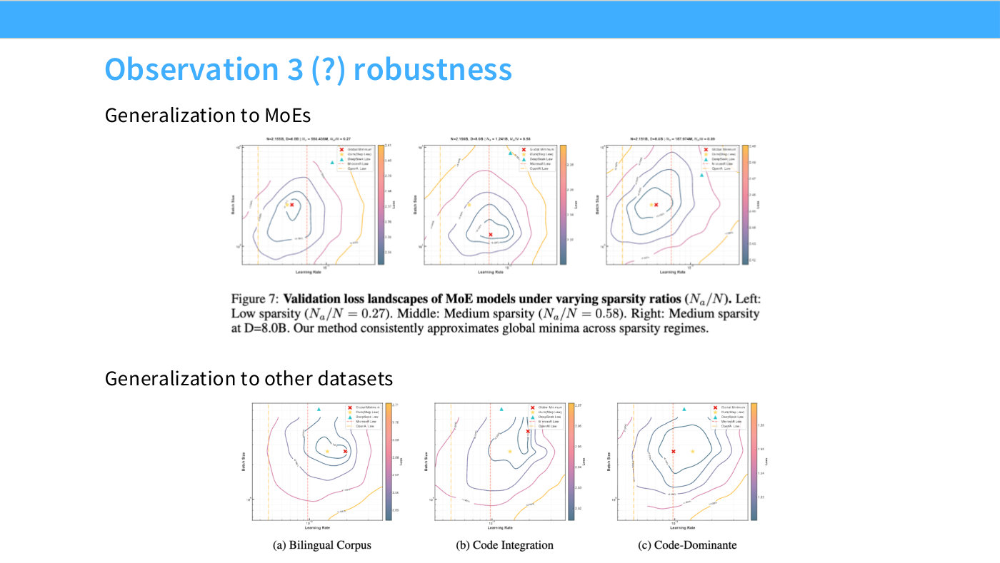

Heading: "Observation 3 (?) robustness". Two body lines, each labelling the pasted figure below it: "Generalization to MoEs" and "Generalization to other datasets".

Both figures are the same kind of plot as slide 34's: a validation-loss landscape over the (learning rate, batch size) plane, drawn as nested iso-loss contours labelled inline with the percentage by which loss exceeds the global minimum, with each published law's predicted optimum marked. Every panel carries the same five-entry legend, sitting **inside the plot's coordinate space** in the top-right corner:

| legend entry | mark | RGB |
| --- | --- | --- |
| Global Minimum | red ✕ | (226,22,12) |
| Ours(Step Law) | gold star | (253,193,76) |
| DeepSeek Law | cyan triangle | (42,193,199) |
| Microsoft Law | salmon dashed **vertical line** | (252,174,159) |
| OpenAI Law | gold dash-dot **vertical line** | (253,193,76) |

The gold star and the OpenAI dash-dot line share the exact same RGB, and the legend swatches sit at plot coordinates that read as data (in the top raster every legend swatch lands at learning rate $1.38\times10^{-3}$), so all the positions below were taken with the legend box masked and with the vertical-line columns removed before blob-finding.

Both figures use **log** axes on both dimensions, measured rather than assumed. On the top figure the minor gridlines between $2\times10^{-4}$ and $10^{-3}$ fall at 46.5, 91.5, 123.5, 148.5, 169.0, 186.5, 201.5, 214.5, 226.0 px — the $\log_{10}(3/2), \log_{10}(4/3), \ldots$ ladder, giving 256.8 px per decade; the batch axis puts $10^{6}$ at y = 34.5 and $10^{5}$ at y = 265, i.e. 230.5 px/decade, with its minor gridlines on the same ladder. The bottom figure measures 287 px per decade in learning rate and 264 px per decade in batch size. Each x-axis carries exactly one labelled tick, $10^{-3}$.

**Figure 1 (top) — "Figure 7: Validation loss landscapes of MoE models under varying sparsity ratios", three panels.** Caption, in full:

> Figure 7: **Validation loss landscapes of MoE models under varying sparsity ratios** ($N_a/N$). Left: Low sparsity ($N_a/N = 0.27$). Middle: Medium sparsity ($N_a/N = 0.58$). Right: Medium sparsity at D=8.0B. Our method consistently approximates global minima across sparsity regimes.

Each panel has its own title line giving the configuration, and its own vertical "Loss" colorbar running dark teal (low) → slate blue → magenta → orange (high). The plotted ranges are learning rate $\approx1.7\times10^{-4}$ to $2.8\times10^{-3}$ and batch size $\approx6.5\times10^{4}$ to $1.05\times10^{6}$ — those upper bounds are the **middle** panel's, which is 8 px narrower than its neighbours, so the left and right panels actually run out to $\approx3.0\times10^{-3}$. The lower bounds are common to all three.

| panel | printed title | colorbar ticks | Global Minimum (✕) | Ours/Step Law (★) | DeepSeek Law (▲) | Microsoft Law | OpenAI Law |
| --- | --- | --- | --- | --- | --- | --- | --- |
| Left | N=2.155B, D=8.0B \| $N_a$ = 590.436M, $N_a/N$ = 0.27 | 2.34 – 2.41 by 0.01 | LR $4.9\times10^{-4}$, BS $2.6\times10^{5}$ | LR $4.4\times10^{-4}$, BS $2.6\times10^{5}$ | LR $1.13\times10^{-3}$, BS $6.9\times10^{5}$ | LR $6.7\times10^{-4}$ | LR $2.4\times10^{-4}$ |
| Middle | N=2.156B, D=8.0B \| $N_a$ = 1.241B, $N_a/N$ = 0.58 | 2.32 – 2.38 by 0.02 (labelled) | LR $6.9\times10^{-4}$, BS $1.3\times10^{5}$ | LR $4.4\times10^{-4}$, BS $2.6\times10^{5}$ | LR $1.04\times10^{-3}$, BS $8.6\times10^{5}$ | LR $6.7\times10^{-4}$ | LR $2.4\times10^{-4}$ |
| Right | N=2.151B, D=8.0B \| $N_a$ = 187.974M, $N_a/N$ = 0.09 | 2.42 – 2.49 by 0.01 | LR $4.9\times10^{-4}$, BS $2.6\times10^{5}$ | LR $4.4\times10^{-4}$, BS $2.6\times10^{5}$ | LR $1.27\times10^{-3}$, BS $5.2\times10^{5}$ | LR $6.7\times10^{-4}$ | LR $2.4\times10^{-4}$ |

The star lands essentially on the ✕ in the left and right panels (a 10% difference in learning rate, identical batch size) and inside the innermost contour; in the middle panel it is up and to the left of the ✕ but still within the second contour. The two vertical lines are learning-rate-only predictions with no batch-size dependence: OpenAI's sits about a factor of two *below* the optimum in every panel and Microsoft's roughly on it in the middle panel but above it in the other two. The DeepSeek triangle is consistently high and to the right of the ✕, outside the inner contours.

**Figure 2 (bottom) — three landscapes on different data mixtures, sub-captioned "(a) Bilingual Corpus", "(b) Code Integration", "(c) Code-Dominante"** (spelled "Code-Dominante" on the page). No overall caption. Plotted ranges: learning rate $\approx3.5\times10^{-4}$ to $3.9\times10^{-3}$, batch size $\approx6.6\times10^{4}$ to $7.0\times10^{5}$ — again the upper LR bound is panel (b)'s, the narrower one; panels (a) and (c) run out to $\approx4.1\times10^{-3}$.

| panel | colorbar ticks | Global Minimum (✕) | Ours/Step Law (★) | DeepSeek Law (▲) | Microsoft Law | OpenAI Law |
| --- | --- | --- | --- | --- | --- | --- |
| (a) Bilingual Corpus | 2.65 – 2.71 by 0.01 | LR $1.96\times10^{-3}$, BS $2.6\times10^{5}$ | LR $1.40\times10^{-3}$, BS $2.6\times10^{5}$ | LR $1.20\times10^{-3}$, BS $6.1\times10^{5}$ | LR $9.7\times10^{-4}$ | LR $4.7\times10^{-4}$ |
| (b) Code Integration | 2.02 – 2.07 by 0.01 | LR $1.95\times10^{-3}$, BS $4.0\times10^{5}$ | LR $1.40\times10^{-3}$, BS $2.6\times10^{5}$ | LR $1.19\times10^{-3}$, BS $6.1\times10^{5}$ | LR $9.7\times10^{-4}$ | LR $4.7\times10^{-4}$ |
| (c) Code-Dominante | 1.83 – 1.86 by 0.01 | LR $9.8\times10^{-4}$, BS $2.6\times10^{5}$ | LR $1.40\times10^{-3}$, BS $2.6\times10^{5}$ | LR $1.20\times10^{-3}$, BS $6.1\times10^{5}$ | LR $9.7\times10^{-4}$ | LR $4.7\times10^{-4}$ |

The Step Law star is fixed at exactly the same point in all three panels — LR $1.40\times10^{-3}$, batch $2.6\times10^{5}$ — because the model and token budget are the same and only the data mixture changes; the *observed* global minimum moves with the mixture (it sits at $1.96\times10^{-3}$ for the two code-lighter mixtures and drops to $9.8\times10^{-4}$ for the code-dominant one, and its batch size moves from $2.6\times10^{5}$ to $4.0\times10^{5}$ in panel (b)). In each panel the star still falls inside the second contour ring, i.e. within about +0.25–0.5% of the minimum loss.

Both figures are the deck's evidence for the "robustness" heading: one fitted law's prediction stays close to the empirical optimum as sparsity varies from $N_a/N = 0.09$ to $0.58$ and as the data mixture changes from bilingual to code-dominant. The heading's own "(?)" marks that the slide is presenting this as a claim to be weighed, not a settled result — and the data do show the largest miss where the observed optimum moves furthest (the middle MoE panel and panel (c)), where the fixed prediction is off by a factor of about 1.4 in learning rate.

## Slide 38 — Optimizers and scale

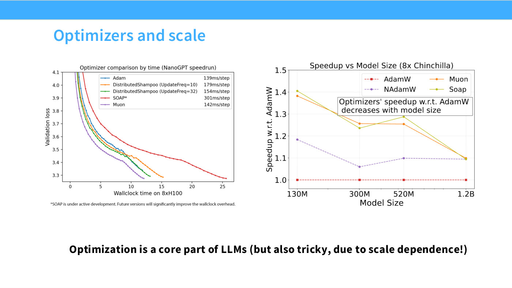

Heading: "Optimizers and scale". Two pasted charts side by side, with a bold line across the bottom of the slide: "**Optimization is a core part of LLMs (but also tricky, due to scale dependence!)**".

**Figure 1 (left) — "Optimizer comparison by time (NanoGPT speedrun)": validation loss against wallclock time, five optimizers.** Y-axis "Validation loss", **linear**, ticked 3.3 to 4.1 in 0.1 steps (measured: the nine tick marks sit 55.5, 55.0, 55.0, ~55, 55.0, ~55, 55.5, 55.0 px apart — flat; a log axis over 4.1→3.3 would have ramped monotonically from 50.3 to 60.8 px). X-axis "Wallclock time on 8xH100", **linear**, ticked 0, 5, 10, 15, 20, 25 (measured: 130.5, 131, 131, 131, 131 px apart). Footnote under the chart, part of the pasted image: "*SOAP is under active development. Future versions will significantly improve the wallclock overhead."

**Five series**, exactly the five legend entries; each legend row also carries a per-step time in a right-hand column of the legend box:

| legend entry | colour | printed ms/step |
| --- | --- | --- |
| Adam | blue | 139ms/step |
| DistributedShampoo (UpdateFreq=10) | orange | 179ms/step |
| DistributedShampoo (UpdateFreq=32) | green | 154ms/step |
| SOAP* | red | 301ms/step |
| Muon | purple | 142ms/step |

Validation loss at each wallclock minute (legend box masked before tracing):

| t | Adam | DShampoo(10) | DShampoo(32) | SOAP* | Muon |
| --- | --- | --- | --- | --- | --- |
| 2 | 3.899 | 3.851 | 3.823 | *(not started)* | 3.720 |
| 4 | 3.661 | 3.640 | 3.616 | 3.778 | 3.550 |
| 6 | 3.560 | 3.540 | 3.521 | 3.654 | 3.472 |
| 8 | 3.498 | 3.484 | 3.472 | 3.580 | 3.421 |
| 10 | 3.403 | 3.452 | 3.418 | 3.525 | 3.348 |
| 12 | — | 3.391 | 3.329 | 3.493 | **3.277 (end)** |
| 15 | — | **3.289** | — | 3.454 | — |
| 20 | — | — | — | 3.379 | — |
| 25 | — | — | — | 3.281 | — |

End points: Muon (12.1 min, **3.276**), DistributedShampoo UpdateFreq=32 (13.2 min, **3.292**), DistributedShampoo UpdateFreq=10 (15.3 min, **3.285**), SOAP* (25.7 min, **3.275**), Adam (11.9 min, **3.34**).

Two things about the plot that a colour trace alone gets wrong. First, **Adam is drawn underneath DistributedShampoo(UpdateFreq=32) from about t = 9 onward** — the two curves coincide to within a pixel or two there, and the green is drawn on top, so blue survives only in patches. Adam's trace is genuine but sparse over that stretch. Second, all five runs are the **same number of steps**: dividing each end time by its printed ms/step gives 5124 (Adam), 5121, 5132, 5119 (SOAP*) and 5129 (Muon) — about 5125 steps each. So the x-axis differences between the five curves are purely per-step cost, and the ranking by wallclock is Muon fastest to a given loss, then the two Shampoo variants, then Adam, with SOAP* twice as slow as anything else per step.

**Figure 2 (right) — "Speedup vs Model Size (8x Chinchilla)": speedup relative to AdamW at four model sizes.** Y-axis "Speedup w.r.t. AdamW", **linear**, ticked 1.0 to 1.5 in 0.1 steps (measured: tick marks 95, 94, 95, 94, 95 px apart — flat; a log axis over 1.5→1.0 would have ramped 80.6 → 111.2 px). X-axis "Model Size", four ticks labelled 130M, 300M, 520M, 1.2B; the ticks are **not** evenly spaced (268, 190, 268 px), so the axis is not categorical, and it is not linear in parameters either — it is close to, but not exactly, log in model size (a log axis would predict 268, 176, 268 px for these labels).

An opaque annotation box sits **inside the plot**, reading "Optimizers' speedup w.r.t. AdamW decreases with model size". It is an annotation, not a sixth series, and it occludes part of the plot between about 1.20 and 1.30 speedup across most of the width.

**Four series**, exactly the four legend entries. AdamW is the flat reference at 1.0:

| model size | AdamW (red, dashed, squares) | NAdamW (purple, dashed, circles) | Muon (orange, solid) | Soap (olive/yellow, solid) |
| --- | --- | --- | --- | --- |
| 130M | 1.000 | 1.184 | 1.382 | **1.405** |
| 300M | 1.000 | 1.060 | **1.256** | 1.236 |
| 520M | 1.000 | 1.100 | 1.254 | **1.289** |
| 1.2B | 1.000 | 1.094 | **1.101** | 1.095 |

Checking the annotation against the numbers it labels: the overall direction holds — every non-AdamW optimizer falls from a 1.18–1.41× speedup at 130M to 1.09–1.10× at 1.2B, and all three converge to nearly the same value at 1.2B. But the decrease is **not monotone** for two of the three: Soap dips to 1.236 at 300M and rises to 1.289 at 520M, and NAdamW dips to 1.060 at 300M and rises to 1.100 at 520M. Only Muon decreases at every step (and it is flat, 1.256 → 1.254, from 300M to 520M). So "decreases with model size" is a fair description of the endpoints and a rough one of the trend, but the 300M→520M leg runs the other way for three of the four curves.

## Slide 39 — Problem 1 – hyper tuning is often off..

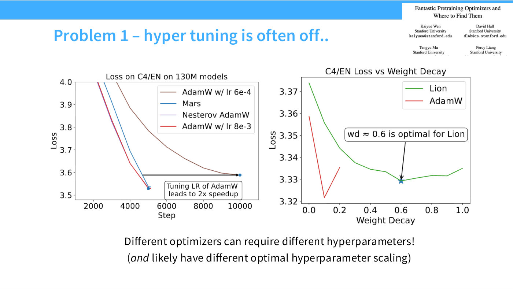

Heading: "Problem 1 – hyper tuning is often off..". Two body lines below the figures:

"Different optimizers can require different hyperparameters!"
"(*and* likely have different optimal hyperparameter scaling)"

A pasted title block sits in the top-right corner of the slide, above the blue header bar — the front matter of the paper the two charts come from:

> **Fantastic Pretraining Optimizers and Where to Find Them**
> Kaiyue Wen, Stanford University, kaiyuew@stanford.edu — David Hall, Stanford University, dlwh@cs.stanford.edu
> Tengyu Ma, Stanford University — Percy Liang, Stanford University

(The block is cropped by the slide's top edge: the e-mail addresses for the second row of authors are cut off. This is a genuine truncation — the text runs into the image's own boundary.)

**Figure 1 (left) — "Loss on C4/EN on 130M models": loss against training step for four optimizer/learning-rate settings.** Y-axis "Loss", **linear**, ticked 3.5 to 4.0 in 0.1 steps (measured: the six tick marks sit 77.0, 77.0, 77.5, 76.5, 78.0 px apart — flat; a log axis over 4.0→3.5 would have ramped monotonically 73.2 → 81.5 px). X-axis "Step", **linear**, ticked 2000 to 10000 in 2000s (measured: 126.5, 124.0, 125.0, 125.5 px apart).

**Four series**, exactly the four legend entries:

| step | AdamW w/ lr 6e-4 (brown) | Mars (blue) | Nesterov AdamW (purple) | AdamW w/ lr 8e-3 (red) |
| --- | --- | --- | --- | --- |
| 2500 | *(above frame)* | *(above frame)* | 3.937 | 3.944 |
| 3000 | *(above frame)* | 3.911 | 3.824 | 3.832 |
| 3500 | 3.963 | 3.803 | 3.731 | 3.737 |
| 4000 | 3.886 | 3.696 | — | 3.642 |
| 4500 | 3.834 | 3.616 | — | 3.585 |
| 5000 | 3.785 | 3.532 | — | ≈3.53 |
| 6000 | 3.712 | *(ended)* | *(ended)* | *(ended)* |
| 7000 | 3.662 | | | |
| 8000 | 3.621 | | | |
| 9000 | 3.599 | | | |
| 10000 | **3.590** | | | |

The three fast runs all stop at step ≈5130 (Mars ends at 3.538, AdamW w/ lr 8e-3 at 3.530); the brown AdamW w/ lr 6e-4 run continues to step 10000 and ends at 3.590.

**The purple "Nesterov AdamW" curve is drawn underneath the red "AdamW w/ lr 8e-3" curve** and is almost entirely hidden by it — the two agree to within 0.007 in loss over their whole common range (3.937 vs 3.944 at step 2500; 3.824 vs 3.832 at 3000; 3.731 vs 3.737 at 3500), and red is drawn last. Purple survives only as a thin fringe. It is present in the data, not absent — this is draw-order occlusion, not a missing series.

Two round blue markers and a horizontal black arrow are drawn on top: a marker at (step ≈5000, loss 3.529) at the end of the fast runs, a marker at (step ≈10000, loss 3.590) at the end of the brown run, and a black arrow at loss 3.591 running right from step ≈4440 to that second marker. A boxed annotation sits inside the plot at the arrow's right: "**Tuning LR of AdamW leads to 2x speedup**".

Checking that annotation against the traced curves: AdamW at lr 8e-3 reaches loss 3.591 at step ≈4440, and AdamW at lr 6e-4 reaches the same loss at step 10000 — a factor of **2.25** fewer steps, so "2x speedup" is right in direction and slightly conservative in size. Both runs are the same optimizer at the same model size; only the learning rate differs, by a factor of 13.

**Figure 2 (right) — "C4/EN Loss vs Weight Decay": loss against weight decay for two optimizers.** Y-axis "Loss", **linear**, ticked 3.32 to 3.37 in 0.01 steps (measured: 74.5, 75.0, 74.5, 75.5, 74.0 px apart). X-axis "Weight Decay", **linear**, ticked 0.0 to 1.0 in 0.2 steps (measured: 104.0, 105.5, 104.5, 105.0, 105.5 px apart).

**Two series**, exactly the two legend entries:

| weight decay | Lion (green) | AdamW (red) |
| --- | --- | --- |
| 0.0 | 3.3737 | 3.3584 |
| 0.1 | 3.3557 | **3.3219** |
| 0.2 | 3.3443 | 3.3353 *(series ends)* |
| 0.3 | 3.3375 | — |
| 0.4 | 3.3346 | — |
| 0.5 | 3.3334 | — |
| 0.6 | **3.3293** | — |
| 0.7 | 3.3306 | — |
| 0.8 | 3.3317 | — |
| 0.9 | 3.3316 | — |
| 1.0 | 3.3350 | — |

A blue star marker sits at (0.60, 3.329) with a black arrow pointing down to it from a boxed annotation inside the plot: "**wd ≈ 0.6 is optimal for Lion**".

Checking that annotation: Lion's traced minimum is indeed at wd = 0.6 (3.3293), with 0.5 at 3.3334 and 0.7 at 3.3306 either side, so the claim holds. The AdamW sweep only covers weight decay 0.0 to 0.2 and bottoms out at wd = 0.1 (3.3219) — a **six times smaller** optimal weight decay than Lion's, and a lower loss at its own optimum than Lion achieves anywhere. That is exactly the slide's stated point: the two optimizers want different hyperparameters, so a sweep tuned for one is off for the other.

## Slide 40 — Problem 2 – fairly significant scale dependence

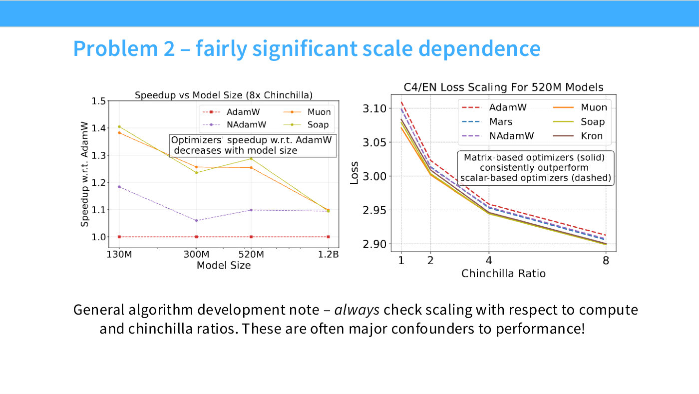

Heading: "Problem 2 – fairly significant scale dependence". Two body lines below the figure:

"General algorithm development note – *always* check scaling with respect to compute and chinchilla ratios. These are often major confounders to performance!"

One pasted raster holds two panels.

**Figure 1 (left) — "Speedup vs Model Size (8x Chinchilla)".** This is the **same chart as slide 38's right-hand figure**, re-pasted at a smaller size; every traced value matches slide 38's to within 0.002. Y-axis "Speedup w.r.t. AdamW", **linear**, ticked 1.0 to 1.5 in 0.1 steps (measured: label centres 55.5, 56.0, 56.0, 56.0, 56.0 px apart). X-axis "Model Size", ticks at 130M, 300M, 520M, 1.2B sitting 158.5, 113.0, 158.5 px apart — again not evenly spaced, and close to but not exactly log in model size. The same opaque annotation box, "Optimizers' speedup w.r.t. AdamW decreases with model size", sits inside the plot.

| model size | AdamW | NAdamW | Muon | Soap |
| --- | --- | --- | --- | --- |
| 130M | 1.000 | 1.184 | 1.383 | **1.406** |
| 300M | 1.000 | 1.060 | **1.257** | 1.237 |
| 520M | 1.000 | 1.099 | 1.255 | **1.288** |
| 1.2B | 1.000 | 1.095 | **1.101** | 1.095 |

**Figure 2 (right) — "C4/EN Loss Scaling For 520M Models": loss against Chinchilla ratio for six optimizers.** Y-axis "Loss", **linear**, ticked 2.90 to 3.10 in 0.05 steps (measured from the gridlines: 69.5, 69.5, 70.0, 69.5 px — flat, RMS residual 0.4 px against a linear fit versus 1.5 px against a log fit). X-axis "Chinchilla Ratio", ticked **1, 2, 4, 8** — and it is **LINEAR, not log**: the gridlines sit at 670.5, 730.0, 850.5, 1091.0 px, i.e. gaps of 60.5, 120.0, 240.5 px in the ratio 1 : 2 : 4, exactly matching the value differences 1, 2, 4. A log-2 axis would have put the four ticks at three equal spacings. (Powers of two on an axis are not evidence of a log scale; this one is linear.)

**Six series**, exactly the six legend entries, arranged in the legend as two columns — dashed on the left (AdamW red, Mars blue, NAdamW purple) and solid on the right (Muon orange, Soap olive/yellow, Kron brown):

| Chinchilla ratio | AdamW (red, dashed) | Mars (blue, dashed) | NAdamW (purple, dashed) | Muon (orange, solid) | Soap (olive, solid) | Kron (brown, solid) |
| --- | --- | --- | --- | --- | --- | --- |
| 1 | 3.107 | 3.098 | 3.096 | **3.069** | 3.077 | 3.081 |
| 2 | 3.025 | 3.016 | 3.014 | **3.003** | 3.005 | 3.011 |
| 4 | 2.959 | 2.952 | 2.954 | ≈2.948 | **2.945** | 2.947 |
| 8 | 2.913 | 2.906 | 2.908 | *(hidden)* | **2.899** | 2.900 |

**The orange Muon curve is drawn underneath the brown Kron and olive Soap curves and disappears entirely to the right of the Chinchilla-ratio-4 tick** — its last visible pixels are at x = 851, exactly the ratio-4 gridline, and at high zoom it survives before that only as a thin sliver between the brown and olive lines. Muon's ratio-8 value is therefore not readable; it is occluded, not missing from the data, and I have not guessed it.

A second opaque annotation box sits inside this plot: "**Matrix-based optimizers (solid) consistently outperform scalar-based optimizers (dashed)**".

Checking that annotation against the traced numbers: it holds at all four ratios, but by a shrinking margin. Worst solid vs best dashed: at ratio 1, 3.081 vs 3.096 (a gap of 0.015); at ratio 2, 3.011 vs 3.014 (0.004); at ratio 4, ≈2.948 vs 2.952 (0.004); at ratio 8, 2.900 vs 2.906 (0.006). So the *ordering* is indeed consistent across the sweep, but the size of the advantage collapses by roughly a factor of three between ratio 1 and ratio 2 and is then flat.

Read against the slide's own heading — "fairly significant scale dependence" — the two panels carry different weights. The left panel is the strong evidence: the same optimizers' speedup over AdamW falls from 1.18–1.41× at 130M to 1.09–1.10× at 1.2B, roughly a fourfold shrink in the advantage over one decade of model size. The right panel is the weaker case: it holds model size fixed at 520M and varies the token budget, and there the ranking is stable and only the margin narrows. Both are consistent with the body text's warning that compute and Chinchilla ratio are confounders, but only the model-size axis shows a large effect here.

## Slide 41 — Problem 2.5 – establishing scaling is nontrivial!

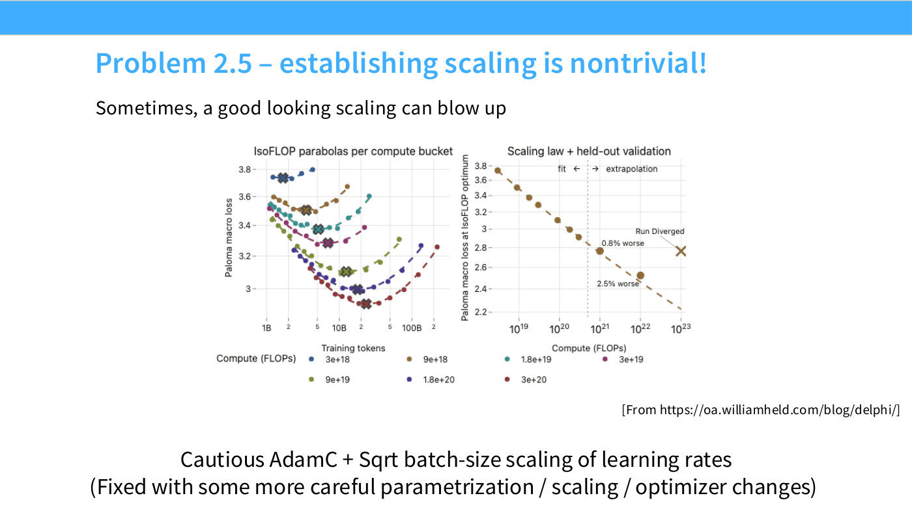

Heading: "Problem 2.5 – establishing scaling is nontrivial!". Body line under it: "Sometimes, a good looking scaling can blow up". Citation on the right, below the figure: "[From https://oa.williamheld.com/blog/delphi/]". Two lines across the bottom of the slide:

"Cautious AdamC + Sqrt batch-size scaling of learning rates"
"(Fixed with some more careful parametrization / scaling / optimizer changes)"

One pasted raster holds two panels sharing a single legend printed beneath them, headed "Compute (FLOPs)", with **seven** entries and these swatch RGBs: 3e+18 blue (56,92,143), 9e+18 brown (143,107,56), 1.8e+19 teal (56,143,141), 3e+19 plum (143,56,109), 9e+19 olive (126,143,56), 1.8e+20 indigo (71,56,143), 3e+20 dark red (143,56,57).

**Both y-axes on this page are LOG-scaled, despite being labelled in even 0.2 steps.** Measured on a 400 dpi render: the left panel's gridlines for 3.8 / 3.6 / 3.4 / 3.2 / 3 sit 119.5, 125.5, 134.5, 143.5 px apart — a monotone widening, against a log prediction of 119.6, 126.5, 134.1, 142.8 (every residual under 1 px) and a linear prediction of four identical 130.75 px gaps. The right panel's nine gridlines for 3.8 down to 2.2 sit 62.5, 67, 72.5, 74.5, 81.5, 87, 93, 102.5 px apart against a log prediction of 63.2, 66.9, 70.9, 75.5, 80.8, 86.5, 93.6, 101.7. Both x-axes are log as well (left: ~319 px per decade with minor ticks at 2 and 5; right: 177.75 px per decade).

**Figure 1 (left) — "IsoFLOP parabolas per compute bucket".** Y-axis "Paloma macro loss" (log, ~2.88 to ~3.85); x-axis "Training tokens" (log, ticked 1B, 2, 5, 10B, 2, 5, 100B, 2 — i.e. $10^{9}$ to $2\times10^{11}$). Seven scatter-plus-dashed-line series, one per compute bucket, each a shallow U, and each carrying one large dark-outlined **✕** marker at its fitted minimum. The seven minima:

| Compute (FLOPs) | colour | optimal training tokens | loss at the optimum |
| --- | --- | --- | --- |
| 3e+18 | blue | $1.7\times10^{9}$ | 3.737 |
| 9e+18 | brown | $3.5\times10^{9}$ | 3.505 |
| 1.8e+19 | teal | $5.2\times10^{9}$ | 3.373 |
| 3e+19 | plum | $7.0\times10^{9}$ | 3.284 |
| 9e+19 | olive | $1.25\times10^{10}$ | 3.104 |
| 1.8e+20 | indigo | $1.78\times10^{10}$ | 2.995 |
| 3e+20 | dark red | $2.36\times10^{10}$ | 2.911 |

The parabolas are wide and shallow — for the 3e+20 bucket, for instance, the plotted points run from $3.7\times10^{9}$ to $2.4\times10^{11}$ tokens and from loss 3.274 down to 2.892 and back up — and each one's ✕ sits at a visibly clean minimum. That cleanliness is the setup for the second panel.

**Figure 2 (right) — "Scaling law + held-out validation".** Y-axis "Paloma macro loss at IsoFLOP optimum" (log, 2.2 to 3.8); x-axis "Compute (FLOPs)" (log, $10^{19}$ to $10^{23}$). A single tan series of round markers with a tan dashed straight fit line through them. A **vertical dotted divider at $5\times10^{20}$ FLOPs** splits the plot, annotated "fit  ←  ⋮  →  extrapolation".

Points, left to right:

| Compute (FLOPs) | loss at IsoFLOP optimum | region | printed annotation |
| --- | --- | --- | --- |
| $3.1\times10^{18}$ | 3.731 | fit | *(none)* |
| $9.2\times10^{18}$ | 3.501 | fit | *(none)* |
| $1.8\times10^{19}$ | 3.376 | fit | *(none)* |
| $3.0\times10^{19}$ | 3.286 | fit | *(none)* |
| $9.1\times10^{19}$ | 3.101 | fit | *(none)* |
| $1.8\times10^{20}$ | 2.996 | fit | *(none)* |
| $3.0\times10^{20}$ | 2.912 | fit | *(none)* |
| $1.0\times10^{21}$ | 2.765 | extrapolation | "0.8% worse" |
| $1.0\times10^{22}$ | 2.523 | extrapolation | "2.5% worse" |
| $1.0\times10^{23}$ | **2.762** | extrapolation | "Run Diverged" (leader line to a large ✕) |

The seven fit-region points fall on the dashed line essentially exactly — measured on this render, the line's log-log slope is about $-0.050$ (my measurement; no exponent is printed). The two held-out extrapolation runs land slightly *above* the line, by the printed 0.8% at $10^{21}$ and 2.5% at $10^{22}$ (my own pixel measurement of those two gaps gives 0.5% and 2.9%, consistent with the printed figures within measurement error). The third held-out run, at $10^{23}$ FLOPs, is drawn as a large ✕ at loss 2.762 — **above the $10^{21}$ point**, while the extrapolated line at $10^{23}$ sits near 2.18. It is not a slightly-worse point; it is a run that failed, and the loss it reached is about 27% worse than the law predicted.

This is exactly the slide's argument, and the data support it: a scaling law whose fit region looks flawless (seven clean IsoFLOP parabolas, seven points on a straight line) drifts by 0.8% and then 2.5% as it is extrapolated one and two decades past the fit, and then breaks completely two and a half decades out. The bottom lines name the setup that produced the blow-up ("Cautious AdamC + Sqrt batch-size scaling of learning rates") and note it was "Fixed with some more careful parametrization / scaling / optimizer changes".

## Slide 42 — A few slides on muon..

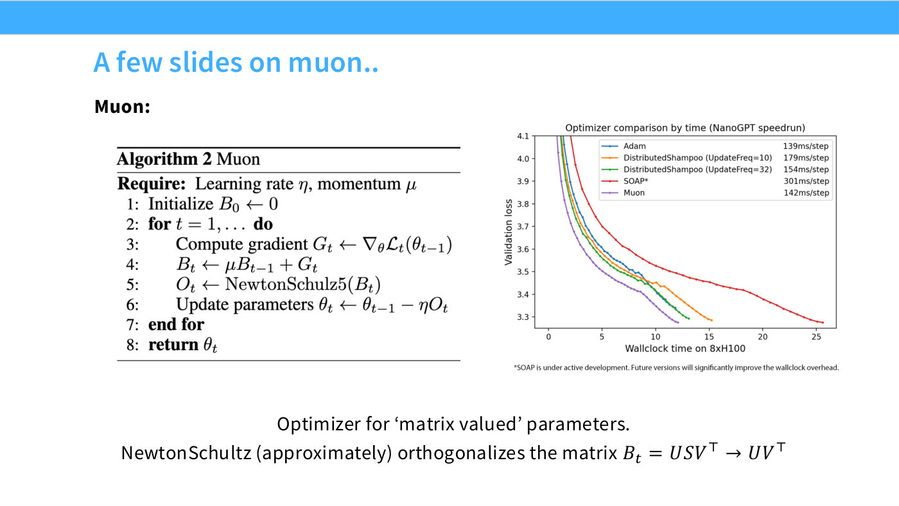

Heading: "A few slides on muon..". Body line: "**Muon:**". Two lines across the bottom of the slide:

"Optimizer for 'matrix valued' parameters."
"NewtonSchultz (approximately) orthogonalizes the matrix $B_t = USV^{\top} \rightarrow UV^{\top}$"

**Figure 1 (left) — a pasted pseudocode block, "Algorithm 2 Muon".** Transcribed line for line:

> **Algorithm 2** Muon
>
> **Require:** Learning rate $\eta$, momentum $\mu$
> 1: Initialize $B_0 \leftarrow 0$
> 2: **for** $t = 1, \ldots$ **do**
> 3:   Compute gradient $G_t \leftarrow \nabla_\theta \mathcal{L}_t(\theta_{t-1})$
> 4:   $B_t \leftarrow \mu B_{t-1} + G_t$
> 5:   $O_t \leftarrow \text{NewtonSchulz5}(B_t)$
> 6:   Update parameters $\theta_t \leftarrow \theta_{t-1} - \eta O_t$
> 7: **end for**
> 8: **return** $\theta_t$

So Muon is momentum SGD (line 4) with one extra step: the momentum buffer $B_t$ is passed through a five-step Newton–Schulz iteration (line 5) before it is used as the update. That is what the slide's bottom line means by orthogonalization — $B_t = USV^{\top}$ is replaced by $UV^{\top}$, i.e. all the singular values are set to 1.

**Figure 2 (right) — "Optimizer comparison by time (NanoGPT speedrun)".** This is the **same pasted chart as slide 38's left-hand figure** (the identical embedded image, re-used), shown here at about a third of the size. Y-axis "Validation loss", linear, 3.3 to 4.1; x-axis "Wallclock time on 8xH100", linear, 0 to 25. Five series with their per-step costs printed in the legend: Adam (blue) 139ms/step, DistributedShampoo (UpdateFreq=10) (orange) 179ms/step, DistributedShampoo (UpdateFreq=32) (green) 154ms/step, SOAP* (red) 301ms/step, Muon (purple) 142ms/step. Footnote inside the image: "*SOAP is under active development. Future versions will significantly improve the wallclock overhead." The full per-minute values are transcribed under slide 38; the point being made here is the purple Muon curve, which is the lowest curve at every wallclock time and reaches 3.276 in 12.1 minutes.

*(Note the deck's own inconsistency: the slide's body line spells the routine "NewtonSchultz", while the pasted algorithm calls it "NewtonSchulz5".)*

## Slide 43 — Muon and scaling

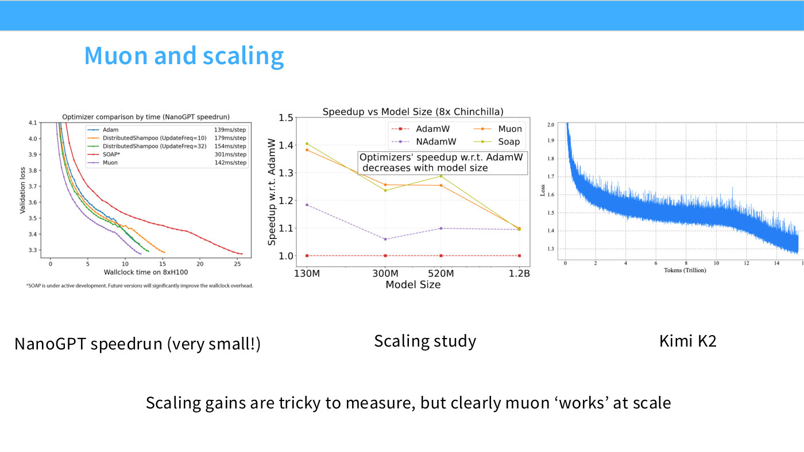

Heading: "Muon and scaling". Three pasted charts across the slide, each with a caption line printed beneath it by the deck: "NanoGPT speedrun (very small!)", "Scaling study", "Kimi K2". One line across the bottom: "Scaling gains are tricky to measure, but clearly muon 'works' at scale".

**Figure 1 (left) — "Optimizer comparison by time (NanoGPT speedrun)", captioned "NanoGPT speedrun (very small!)".** The same chart as slide 38's left figure and slide 42's right figure (a re-rasterised copy — pixel-for-pixel the same plot at a different resolution). Five series with printed per-step costs: Adam 139ms/step, DistributedShampoo (UpdateFreq=10) 179ms/step, DistributedShampoo (UpdateFreq=32) 154ms/step, SOAP* 301ms/step, Muon 142ms/step. Validation loss 3.3–4.1 (linear) against wallclock minutes on 8×H100 0–25 (linear). Muon (purple) is the lowest curve at every wallclock time and ends at 3.276 after 12.1 minutes. Full values are under slide 38.

**Figure 2 (centre) — "Speedup vs Model Size (8x Chinchilla)", captioned "Scaling study".** The same chart as slide 38's right figure and slide 40's left panel (the identical embedded image as slide 38's). Speedup w.r.t. AdamW (linear, 1.0–1.5) against model size (130M, 300M, 520M, 1.2B). Four series: AdamW flat at 1.000; NAdamW 1.184 / 1.060 / 1.099 / 1.094; Muon 1.383 / 1.257 / 1.255 / 1.101; Soap 1.406 / 1.237 / 1.288 / 1.095. The same in-plot annotation box, "Optimizers' speedup w.r.t. AdamW decreases with model size".

**Figure 3 (right) — a single training-loss curve, captioned "Kimi K2".** Y-axis "Loss", **linear**, ticked 1.3 to 2.0 in 0.1 steps (measured: the gridlines sit 51.5, 51.5, 52.0, 51.5, 51.5, 51.5, 51.5 px apart — flat; a log axis over 2.0→1.3 would have ramped monotonically from 43.0 to 62.0 px). X-axis "Tokens (Trillion)", **linear**, ticked 0 to 16 in 2s (measured: 86.5, 86.0, 87.0, 86.0, 86.5, 86.5, 86.0, 86.5 px apart). **One series** — a single bright-blue per-step loss trace, plotted with every step's noise, so it renders as a band roughly 0.10–0.13 wide rather than a line. It starts above the top of the frame and runs to ≈15.4 trillion tokens.

| tokens (T) | band (low–high) | band centre |
| --- | --- | --- |
| 0.2 | 1.84 – 1.97 | 1.905 |
| 0.5 | 1.67 – 1.80 | 1.734 |
| 1 | 1.61 – 1.73 | 1.669 |
| 2 | 1.53 – 1.65 | 1.590 |
| 4 | 1.48 – 1.60 | 1.538 |
| 6 | 1.44 – 1.56 | 1.500 |
| 8 | 1.44 – 1.60 | 1.524 |
| 10 | 1.43 – 1.55 | 1.487 |
| 12 | 1.39 – 1.55 | 1.466 |
| 14 | 1.32 – 1.46 | 1.388 |
| 15.4 (end) | 1.28 – 1.38 | 1.327 |

The curve falls steeply to about 1.60 by 2T tokens, then descends only slowly — it is essentially flat between 5T and 12T (centre 1.52 → 1.47, with a visible plateau and a small bump around 8T) — and then drops again over the last 3T tokens to end near 1.33. There is no loss spike or divergence anywhere along it, and no second series: this panel compares nothing, it shows one long run completing cleanly.

That matters for reading the slide's closing line. "Scaling gains are tricky to measure, but clearly muon 'works' at scale" is two claims, and the three panels support them unevenly. The left panel is a wallclock comparison at very small scale (the deck's own caption says "very small!"), the centre panel is the comparison that actually measures a gain and shows it shrinking from 1.38× at 130M to 1.10× at 1.2B, and the right panel has no baseline at all — it is evidence that a Muon-trained run of this size trains stably to 15.4T tokens, not evidence that it beat anything. The slide's hedge ("tricky to measure") is the accurate part; the "works at scale" claim rests on stability, not on a measured margin.

## Slide 44 — Maximum update parametrization – in depth

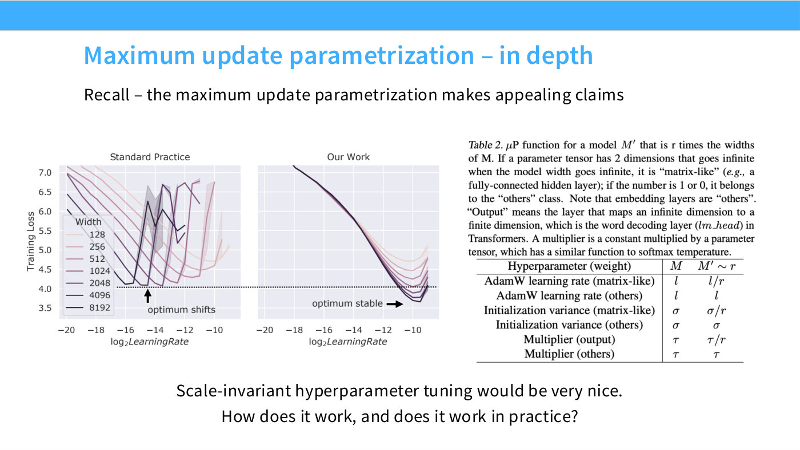

Heading: "Maximum update parametrization – in depth". Body line: "Recall – the maximum update parametrization makes appealing claims". Two lines across the bottom of the slide:

"Scale-invariant hyperparameter tuning would be very nice."
"How does it work, and does it work in practice?"

**Figure — two side-by-side panels, "Standard Practice" (left) and "Our Work" (right): training loss against learning rate, one curve per model width.** Both panels share the axes and the legend.

Y-axis "Training Loss", **linear**, ticked 3.5 to 7.0 in 0.5 steps (measured: the eight tick labels sit 53, 53, 53, 52, 53, 53, 52 px apart — flat; a log axis over 7.0→3.5 would have ramped monotonically from 39 to 71 px). X-axis "$\log_2 LearningRate$", ticked −20, −18, −16, −14, −12, −10, evenly spaced at 40.45 px per unit of $\log_2$ (measured: 80.5, 81, 80, 82, 81 px per 2 units in the left panel and 81.5, 80, 80, 82, 81 in the right). Note the axis variable is already a logarithm, so an even axis here means learning rate itself is on a log scale.

**Seven series**, exactly the seven legend entries under the legend header "Width", drawn as a pale-pink-to-near-black ramp: 128 (233,210,204), 256 (215,173,177), 512 (191,138,158), 1024 (161,108,141), 2048 (124,80,123), 4096 (83,55,96), 8192 (43,31,60). Each curve has a faint shaded band around it. **The legend box sits inside the left panel's plot area** (roughly $\log_2 LR$ −19.6 to −16.2, loss 6.1 to 3.5) and hides part of several curves there; it was masked before tracing. A **dotted horizontal reference line at loss ≈ 4.03** runs across both panels.

*Left panel, "Standard Practice"* — an in-plot annotation with an upward arrow reads "**optimum shifts**":

| Width | best $\log_2 LR$ | loss at that optimum |
| --- | --- | --- |
| 128 | −10.7 | 4.50 |
| 256 | −11.3 | 4.47 |
| 512 | −11.7 | 4.28 |
| 1024 | −12.8 | 4.13 |
| 2048 | −13.8 | **4.06** |
| 4096 | −15.1 | 4.08 |
| 8192 | −16.3 | 4.11 |

The optimum marches steadily left — about 0.9 in $\log_2$ per doubling of width, i.e. roughly $\eta^* \propto 1/\text{width}$ — over a total of 5.6 doublings of learning rate between width 128 and width 8192. And the best achievable loss stops improving: it bottoms out at 4.06 at width 2048 and gets *worse* at 4096 and 8192. Each curve also ends earlier than the last (width 128 is plotted out to $\log_2 LR = -9.3$, width 8192 only to $-12.2$) and the wide curves spike violently upward past their optimum.

*Right panel, "Our Work"* — an in-plot annotation with a rightward arrow reads "**optimum stable**":

| Width | best $\log_2 LR$ | loss at that optimum |
| --- | --- | --- |
| 128 | −10.7 | 4.50 |
| 256 | −10.3 | 4.46 |
| 512 | −10.3 | 4.24 |
| 1024 | −10.3 | 4.04 |
| 2048 | −10.3 | 3.88 |
| 4096 | −10.3 | 3.76 |
| 8192 | −9.8 | **3.65** |

Here the optimum sits within a single $\log_2$ unit for every width (five of the seven land on −10.3), all seven curves run over the same learning-rate range out to about $-9.2$, none of them spikes, and the loss at the optimum falls monotonically with width, from 4.50 to 3.65. Reading the two panels together: the left one's *best* loss never gets below the dotted 4.03 line, while in the right panel widths 1024 and above all cross it.

**Table — "Table 2. μP function for a model $M'$ that is $r$ times the widths of M."** Pasted with its full caption:

> *Table 2.* $\mu$P function for a model $M'$ that is $r$ times the widths of M. If a parameter tensor has 2 dimensions that goes infinite when the model width goes infinite, it is "matrix-like" (*e.g.,* a fully-connected hidden layer); if the number is 1 or 0, it belongs to the "others" class. Note that embedding layers are "others". "Output" means the layer that maps an infinite dimension to a finite dimension, which is the word decoding layer ($lm\_head$) in Transformers. A multiplier is a constant multiplied by a parameter tensor, which has a similar function to softmax temperature.

The table has its own header row, so no column mapping is inferred:

| Hyperparameter (weight) | $M$ | $M' \sim r$ |
| --- | --- | --- |
| AdamW learning rate (matrix-like) | $l$ | $l/r$ |
| AdamW learning rate (others) | $l$ | $l$ |
| Initialization variance (matrix-like) | $\sigma$ | $\sigma/r$ |
| Initialization variance (others) | $\sigma$ | $\sigma$ |
| Multiplier (output) | $\tau$ | $\tau/r$ |
| Multiplier (others) | $\tau$ | $\tau$ |

(No total or average row; six rows in all.)

The table is the recipe that produces the right-hand panel: widening a model by a factor $r$ means dividing the AdamW learning rate, the initialization variance and the output multiplier of the matrix-like/output tensors by $r$, and leaving everything else alone. Note the internal consistency between the two halves of the slide — the left panel's measured shift of about $2^{-0.9}$ per doubling of width is the $1/r$ scaling the table's first row prescribes, which is exactly why applying it makes the optimum stationary on the right.

## Slide 45 — CerebrasGPT

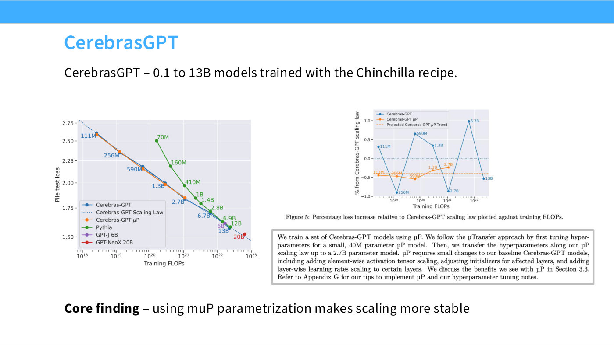

Heading: "CerebrasGPT". Body line: "CerebrasGPT – 0.1 to 13B models trained with the Chinchilla recipe."

**Figure 1 (left) — Pile test loss vs. training FLOPs for Cerebras-GPT and comparison model families.** x-axis "Training FLOPs", **log scale**, decade gridlines labelled $10^{18}$, $10^{19}$, $10^{20}$, $10^{21}$, $10^{22}$, $10^{23}$ (measured: decades evenly spaced at ~329 px apart at 600 dpi). y-axis "Pile test loss", **log scale, not linear** — ticks are labelled 2.75, 2.50, 2.25, 2.00, 1.75, 1.50 but their pixel spacings grow monotonically (175.5, 193, 217.5, 245, 283.5 px); a fit against $\log_{10}(\text{loss})$ has residuals under 0.5 px, a linear fit has residuals up to 48 px. Legend, six entries:

- **Cerebras-GPT** (blue, solid line with round markers) — 7 points, each annotated with its parameter count: 111M at ($\approx 10^{18.4}$, loss ≈ 2.61), 256M at ($10^{19.1}$, ≈ 2.36), 590M at ($10^{19.8}$, ≈ 2.185), 1.3B at ($10^{20.45}$, ≈ 2.00), 2.7B at ($10^{21.0}$, ≈ 1.83), 6.7B at ($10^{21.8}$, ≈ 1.70), 13B at ($10^{22.3}$, ≈ 1.57).
- **Cerebras-GPT Scaling Law** (blue dotted line) — a straight fitted line running the full width of the panel, measured at ≈ 2.79 at the left edge (just left of $10^{18}$) falling to ≈ 1.48 at the right edge (just under $10^{23}$); it passes through the Cerebras-GPT points and is extrapolated beyond them at both ends.
- **Cerebras-GPT $\mu$P** (orange, solid line with round markers) — 5 points only, stopping at 2.7B: ($10^{18.43}$, 2.587), ($10^{19.11}$, 2.360), ($10^{19.79}$, 2.155), ($10^{20.46}$, 1.984), ($10^{21.04}$, 1.847). It sits fractionally *below* the blue Cerebras-GPT line at every shared point.
- **Pythia** (green, solid line with round markers) — 8 points, annotated: 70M ($10^{20.2}$, 2.503), 160M ($10^{20.61}$, 2.186), 410M ($10^{21.03}$, 1.971), 1B ($10^{21.36}$, 1.845), 1.4B ($10^{21.51}$, 1.793), 2.8B ($10^{21.79}$, 1.720), 6.9B ($10^{22.15}$, 1.627), 12B ($10^{22.38}$, 1.582). The Pythia line is well *above* (worse than) the Cerebras-GPT line at equal FLOPs for the small models and converges onto it around $10^{22}$.
- **GPT-J 6B** (purple, single point) — ($10^{22.23}$, 1.613), labelled "6B".
- **GPT-NeoX 20B** (red, single point) — ($10^{22.81}$, 1.522), labelled "20B", sitting just above the extrapolated dotted scaling law.

**Figure 2 (right) — "Figure 5: Percentage loss increase relative to Cerebras-GPT scaling law plotted against training FLOPs."** y-axis "% from Cerebras-GPT scaling law", **linear**, ticks -1.0, -0.5, 0.0, 0.5, 1.0 (measured spacings 186.5 and 183.5 px — equal). x-axis "Training FLOPs", **log**, decade gridlines $10^{19}$, $10^{20}$, $10^{21}$, $10^{22}$ (evenly spaced ~260 px apart). Legend, three entries:

- **Cerebras-GPT** (blue, solid, round markers) — 7 points, each labelled: 111M ($10^{18.42}$, **+0.31**), 256M ($10^{19.10}$, **-0.90**), 590M ($10^{19.79}$, **+0.66**), 1.3B ($10^{20.45}$, **+0.35**), 2.7B ($10^{21.04}$, **-0.86**), 6.7B ($10^{21.80}$, **+0.99**), 13B ($10^{22.36}$, **-0.53**). The series zig-zags violently, swinging the full height of the panel between consecutive model sizes.
- **Cerebras-GPT $\mu$P** (orange, solid, round markers) — 5 points, each labelled, all below zero and all within a narrow band: 111M ($10^{18.42}$, **-0.44**), 256M ($10^{19.10}$, **-0.47**), 590M ($10^{19.79}$, **-0.54**), 1.3B ($10^{20.45}$, **-0.31**), 2.7B ($10^{21.04}$, **-0.23**). Total spread ≈ 0.31, against ≈ 1.89 for the blue series.
- **Projected Cerebras-GPT $\mu$P Trend** (orange dashed) — a flat horizontal line at **≈ -0.40**, drawn across the whole panel width.

A grey/blue dotted horizontal reference line sits at exactly 0.0 (this is a reference line, not a fourth series).

Bottom of the page, boxed quotation from the Cerebras-GPT paper (transcribed in full): "We train a set of Cerebras-GPT models using µP. We follow the µTransfer approach by first tuning hyperparameters for a small, 40M parameter µP model. Then, we transfer the hyperparameters along our µP scaling law up to a 2.7B parameter model. µP requires small changes to our baseline Cerebras-GPT models, including adding element-wise activation tensor scaling, adjusting initializers for affected layers, and adding layer-wise learning rates scaling to certain layers. We discuss the benefits we see with µP in Section 3.3. Refer to Appendix G for our tips to implement µP and our hyperparameter tuning notes."

Bottom line of the slide: "**Core finding** – using muP parametrization makes scaling more stable"

## Slide 46 — What is muP, anyway?

Heading: "What is muP, anyway?".

**Figure — screenshot of a paper's title block.** A bordered box containing the title "**A Spectral Condition for Feature Learning**" and three starred authors with affiliations, laid out in three columns: "Greg Yang\* — xAI", "James B. Simon\* — UC Berkeley & Imbue", "Jeremy Bernstein\* — MIT".

Right-aligned annotation beneath the box: "(this is a very accessible 'muP for babies' paper)"

Light-blue panel:

"**muP** is based off the following assertion. As a function of the width of the network $n_l$.."

"**A1:** The activations at initialization should remain $\Theta(1)$"
"**A2:** After one gradient step, the change in activation should be $\Theta(1)$"

Below the panel, centered: "Note: if individual activations are $\Theta(1)$, then the norm should be $\Theta\left(\sqrt{n_l}\right)$"

## Slide 47 — Deriving muP (condition A1)

Heading: "Deriving muP (condition A1)".

Body: "Suppose that we have a simple, deep linear network ($h_l = W_l h_{l-1}$) and we init $W_l \sim N\left(0, \sigma^2 I_{n_l \times n_{l-1}}\right)$ then by basic matrix concentration $\|W_l\|_* \to \sigma(\sqrt{n_{l-1}} + \sqrt{n_l})$ and,"

$$\|h_l\|_2 \approx \|W_l\|_* \|h_{l-1}\|_2$$

"Now let's pick $\sigma = \dfrac{\sqrt{n_l}}{\sqrt{n_{l-1}}}\left(\sqrt{n_l} + \sqrt{n_{l-1}}\right)^{-1} = \Theta\left(\dfrac{1}{\sqrt{n_{l-1}}}\min\left(1, \sqrt{\dfrac{n_l}{n_{l-1}}}\right)\right)$. What happens?"

Light-blue panel:

- "**Inductive assumption**- $\|h_{l-1}\|_2 = \Theta\left(\sqrt{n_{l-1}}\right)$"
- "**Inductive case** - $\|W_l\|_* \to \sigma\left(\sqrt{n_{l-1}} + \sqrt{n_l}\right) = \dfrac{\sqrt{n_l}}{\sqrt{n_{l-1}}}$"

and, centered below inside the same panel:

$$\|h_l\|_2 = \sqrt{n_l} + o\left(\sqrt{n_l}\right)$$

Footer line (small, centered): "[Comments – this is a kind of 'worst case' derivation – the $\approx$ is an upper bound ]"

No chart or table on this page.

## Slide 48 — Deriving muP (condition A2)

Heading: "Deriving muP (condition A2)".

Body: "Now we need to deal with updates. Suppose we have the update $\Delta W_l$ on the weights. For SGD, on a linear layer, this looks like a rank-one loss-activation outer product."

$$\Delta W_l = -\eta_l \nabla_{h_l}\ell\ h_{l-1}^{\top}$$

"Thus, $\|\Delta W_l h_{l-1}\|_2 = \|\Delta W_l\|_* \|h_{l-1}\|_2$ . Now note that we have the update"

$$\Delta h_l = W_l \Delta h_{l-1} + \Delta W_l (h_{l-1} + \Delta h_{l-1})$$

Light-blue panel: "Assuming that the leading order terms don't cancel, we see that"

- $W_l \Delta h_{l-1} = \Theta\left(\sqrt{n_l}\right)$ &nbsp;from induction assumption + condition A1 argument
- $\Delta W_l h_{l-1} = \|\Delta W_l\|_* \sqrt{n_{l-1}}$ from above, thus $\|\boldsymbol{\Delta W_l}\|_* = \boldsymbol{\Theta}\left(\dfrac{\sqrt{n_l}}{\sqrt{n_{l-1}}}\right)$ (this last conclusion is set in bold on the slide)
- $\Delta W_l \Delta h_{l-1} = O\left(\|\Delta W_l\|_* \sqrt{n_{l-1}}\right)$

No chart or table on this page.

## Slide 49 — Deriving muP (condition A2) part 2

Heading: "Deriving muP (condition A2) part 2".

Body: "Recall –the key is to pick LR such that $\|\Delta W_l\|_* \sqrt{n_{l-1}} = \Theta\left(\sqrt{n_l}\right)$. How can we do that?"

"Suppose that the loss update *also* scales O(1). Then we can write down.."

$$\Delta\ell \approx \Theta\left(\left\langle \Delta W_l, \nabla_{W_l}\ell \right\rangle\right) = \Theta\left(\|\Delta W_l\|_F \left\|\nabla_{W_l}\ell\right\|_F\right) = \Theta\left(\|\Delta W_l\|_* \left\|\nabla_{W_l}\ell\right\|_*\right)$$

"Where we use the fact that $\Delta W_l = -\eta \nabla_{W_l}\ell$ in standard SGD updates."

"Now plug in $\Delta\ell = \mathrm{O}(1)$, $\|\Delta W_l\|_* = \Theta\left(\dfrac{\sqrt{n_l}}{\sqrt{n_{l-1}}}\right)$ to get that $\left\|\nabla_{W_l}\ell\right\|_* = \Theta\left(\dfrac{\sqrt{n_{l-1}}}{\sqrt{n_l}}\right)$"

"Finally, from the previous slide, recall that $\Delta W_l = -\eta_l \nabla_{h_l}\ell\ h_{l-1}^{\top}$ and thus"

Highlighted (light-blue) box, the result of the derivation:

$$\eta_l = \Theta\left(\frac{n_l}{n_{l-1}}\right)$$

Bottom-right footnote: "[with Adam, $\|\Delta W_l\|_* \sqrt{n_{l-1}} = \Theta\left(\sqrt{\eta_l}\right)$]"

No chart or table on this page.

## Slide 50 — muP mini recap..

Heading: "muP mini recap..".

Body: "So, what is (baby) muP about? Controlling activations (and changes) via $W$ and $\Delta W$"

Light-blue panel — the muP prescription:

- "**Initialization (stdev)**: Set to $\Theta\left(\dfrac{1}{\sqrt{n_{l-1}}}\min\left(1, \sqrt{\dfrac{n_l}{n_{l-1}}}\right)\right)$"
- "**Learning rates**: Set to $\dfrac{n_l}{n_{l-1}}$" &nbsp; with a small parenthetical to its right: "(for Adam $\dfrac{1}{n_{l-1}}$)"

Below the panel: "Compared to 'standard' parametrizations – these set"

- "**Initialization**: Set to $\dfrac{1}{\sqrt{n_{l-1}}}$"
- "**Learning rates**: Set to $\Theta(1)$"

Bottom line: "**Differences** – LR changes for Adam, also init diffs when fanout $n_l$ < fanin"

No chart or table on this page.

## Slide 51 — Deeper dive into muP

Heading: "Deeper dive into muP". Top-right corner, a screenshot of a paper's header: "Preprint" / "**A Large-Scale Exploration of $\mu$-Transfer**" / "Lucas Dax Lingle" / "lucasdaxlingle@gmail.com".

Body: "Recall – muP is a scaling procedure for hyperparams (as a function of width)"

**Table — "Table 2: $\mu$P scaling rules for transformers; a rule for attention scale is detailed in text below."** (pasted from the paper; the caption is printed beneath it)

| Param | Init Variance ($\Theta$) | Adam LR ($\Theta$) | Init Variance (Exact) | Adam LR (Exact) |
| --- | --- | --- | --- | --- |
| $\mathbf{W}^{E}$ | $1$ | $1$ | $1$ | $\alpha$ |
| $\mathbf{W}^{AQ}$ | $1/M$ | $1/M$ | $1/M$ | $\alpha P/M$ |
| $\mathbf{W}^{AK}$ | $1/M$ | $1/M$ | $1/M$ | $\alpha P/M$ |
| $\mathbf{W}^{AV}$ | $1/M$ | $1/M$ | $1/M$ | $\alpha P/M$ |
| $\mathbf{W}^{AO}$ | $1/(HD)$ | $1/(HD)$ | $1/M$ | $\alpha P/M$ |
| $\mathbf{W}^{FI}$ | $1/M$ | $1/M$ | $1/M$ | $\alpha P/M$ |
| $\mathbf{W}^{FO}$ | $1/F$ | $1/F$ | $0.25/M$ | $\alpha P/M$ |
| $\mathbf{W}^{U}$ | $1/M^2$ | $1/M$ | $1/M^2$ | $\alpha P/M$ |

The lecturer has added his own labels down the right-hand margin, aligned with the table's four horizontal-rule-separated blocks: "Embedding" (against $\mathbf{W}^E$), "Attention params" (against $\mathbf{W}^{AQ}$–$\mathbf{W}^{AO}$), "Input/output MLP MM" (against $\mathbf{W}^{FI}$, $\mathbf{W}^{FO}$), "Softmax linear" (against $\mathbf{W}^U$).

Boxed quotation from the same paper, beneath the table (transcribed in full): "In addition, $\mu$P uses an attention scale of $\tau^{-1} = \Theta(1/D)$ instead of the usual $\tau^{-1} = 1/\sqrt{D}$. For simplicity, we use $\tau^{-1} = 1/D$, since in preliminary experiments we observed only a small improvement from using smaller multiples of $1/D$. Note that for $D$ fixed across model widths $M$, any constant $\tau^{-1} \neq 0$ technically complies with $\mu$P (Yang et al., 2021) but in the experiments, $\tau^{-1}$ will be shown to have a major impact on performance and transfer."

## Slide 52 — Replicating muP

Heading: "Replicating muP". Body: "**Q1:** Does muP work as claimed? When we scale widths, is optimal LR constant?"

**Table — learning-rate sweep at three widths, for two ablations (pasted from the $\mu$-Transfer paper; the deck prints no table number above it, though the paragraph below calls it Table 1).** Columns are the five swept "Base LR" values $2^{-10}$, $2^{-8}$, $2^{-6}$, $2^{-4}$, $2^{-2}$; cells are final losses; the per-row minimum is set in **bold** in the source. A blue check mark ✔ sits in the "Transfer" column for each of the two ablation blocks.

| Ablation | Width | $2^{-10}$ | $2^{-8}$ | $2^{-6}$ | $2^{-4}$ | $2^{-2}$ | Transfer |
| --- | --- | --- | --- | --- | --- | --- | --- |
| Baseline $\mu$P | 128 | 3.846 | 3.743 | **3.695** | 3.884 | 4.143 | ✔ (one check mark, centred on the three-row block) |
| Baseline $\mu$P | 512 | 3.114 | 2.993 | **2.953** | 3.221 | 3.506 | *(blank)* |
| Baseline $\mu$P | 2048 | 2.711 | 2.553 | **2.511** | 2.563 | 3.244 | *(blank)* |
| Projection Biases | 128 | 3.838 | 3.735 | **3.705** | 3.911 | 4.269 | ✔ (one check mark, centred on the three-row block) |
| Projection Biases | 512 | 3.108 | 2.986 | **2.947** | 2.970 | 3.557 | *(blank)* |
| Projection Biases | 2048 | 2.710 | 2.552 | **2.529** | 2.672 | 3.418 | *(blank)* |

In every one of the six rows the bolded minimum falls in the same column, $2^{-6}$ — that is the slide's answer to Q1: **three widths (128, 512, 2048), a 16$\times$ span, and the optimal base LR does not move.**

Caption paragraph printed beneath the table (transcribed in full): "As shown in Table 1, the learning rates transfer reliably across model sizes under $\mu$P. Despite each model being 4x wider (and 16x larger) than the last, the smallest model's optimal base learning rate $\alpha$ directly predicts the optimum in our sweeps for the larger models."

## Slide 53 — What is muP robust to?

Heading: "What is muP robust to?".

Body: "Modern LMs have many components that deviate from muP's theory"

- Activations – SwiGLU and squared relu
- Batch sizes – Large / small
- Initialization variations – zero attention, etc.
- RMS norm gains
- Exotic optimizers (Lion)
- Regularizers

Closing line: "Which of these (if any) break muP?"

No chart or table on this page.

## Slide 54 — What is muP not robust to? RMSnorm gain

Heading: "What is muP not robust to? RMSnorm gain". Body: "In our arch – RMSNorm has learnable gains. This turns out to break muP"

**Table — the same LR-sweep format as slide 52, now with two RMSNorm-gain ablations added.** Five swept "Base LR" columns $2^{-10}$ … $2^{-2}$, three widths (128, 512, 2048) per ablation block, cell values are final losses, per-row minimum in **bold**, and a "Transfer" verdict per block: blue ✔ for Baseline $\mu$P, red ✗ for both RMSNorm-gain blocks.

| Ablation | Width | $2^{-10}$ | $2^{-8}$ | $2^{-6}$ | $2^{-4}$ | $2^{-2}$ | Transfer |
| --- | --- | --- | --- | --- | --- | --- | --- |
| Baseline $\mu$P | 128 | 3.846 | 3.743 | **3.695** | 3.884 | 4.143 | ✔ (blue check, centred on the block) |
| Baseline $\mu$P | 512 | 3.114 | 2.993 | **2.953** | 3.221 | 3.506 | *(blank)* |
| Baseline $\mu$P | 2048 | 2.711 | 2.553 | **2.511** | 2.563 | 3.244 | *(blank)* |
| RMSNorm Gains (Vector) | 128 | 3.842 | 3.744 | 3.689 | **3.670** | 3.681 | ✗ (red cross, centred on the block) |
| RMSNorm Gains (Vector) | 512 | 3.101 | 2.992 | 2.951 | **2.950** | 3.412 | *(blank)* |
| RMSNorm Gains (Vector) | 2048 | 2.692 | **2.553** | 2.609 | 2.605 | 3.169 | *(blank)* |
| RMSNorm Gains (Scalar) | 128 | 3.843 | 3.749 | 3.692 | **3.670** | 4.471 | ✗ (red cross, centred on the block) |
| RMSNorm Gains (Scalar) | 512 | 3.106 | 3.000 | 2.961 | **2.959** | 3.515 | *(blank)* |
| RMSNorm Gains (Scalar) | 2048 | 2.704 | 2.570 | **2.525** | 2.542 | 3.334 | *(blank)* |

The argument is in where the bolded minima sit. Baseline $\mu$P: $2^{-6}$ at all three widths — no drift. **RMSNorm Gains (Vector)**: $2^{-4}$, $2^{-4}$, then $2^{-8}$ at width 2048 — the optimum jumps four powers of two as width grows. **RMSNorm Gains (Scalar)**: $2^{-4}$, $2^{-4}$, then $2^{-6}$ — the optimum moves again, by two powers of two. Note also that at the transferred optimum ($2^{-6}$) the width-2048 loss is worse with gains than without: 2.609 (vector) and 2.525 (scalar) against 2.511 for baseline $\mu$P.

Caption paragraph printed beneath the table (transcribed in full): "As shown in Table 1, optimal learning rates for these models *do not* reliably transfer when using $\Theta(1)$ learning rate scaling for the gains, despite the fact that the 'coordinate size' of the features before and after RMS Normalization is $\Theta(1)$ w.r.t. width by design. In addition to the lack of transfer in these experiments, we find trainable gains harm the quality of the largest $\mu$P models when the base learning rate $\alpha$ is optimal. In Section 4.5, we also find that standard transformers with trainable gains underperform $\mu$P transformers without them."

Bottom line of the slide: "But these gains can be removed with little loss of perf.."

## Slide 55 — What is muP not robust to? Exotic optimizers

Heading: "What is muP not robust to? Exotic optimizers". Body: "There are other, exotic optimizers based on just gradient signs. Do they transfer?"

**Figure 1 (left) — pseudocode box, "Algorithm 1 AdamW Optimizer"** (pasted from the Lion paper):

- **given** $\beta_1, \beta_2, \epsilon, \lambda, \eta, f$
- **initialize** $\theta_0$, $m_0 \leftarrow 0$, $v_0 \leftarrow 0$, $t \leftarrow 0$
- **while** $\theta_t$ not converged **do**
  - $t \leftarrow t + 1$
  - $g_t \leftarrow \nabla_\theta f(\theta_{t-1})$
  - **update EMA of $g_t$ and $g_t^2$**
  - $m_t \leftarrow \beta_1 m_{t-1} + (1-\beta_1) g_t$
  - $v_t \leftarrow \beta_2 v_{t-1} + (1-\beta_2) g_t^2$
  - **bias correction**
  - $\hat{m}_t \leftarrow m_t / (1 - \beta_1^t)$
  - $\hat{v}_t \leftarrow v_t / (1 - \beta_2^t)$
  - **update model parameters**
  - $\theta_t \leftarrow \theta_{t-1} - \eta_t\left(\hat{m}_t / (\sqrt{\hat{v}_t} + \epsilon) + \lambda \theta_{t-1}\right)$
- **end while**
- **return** $\theta_t$

**Figure 2 (right) — pseudocode box, "Algorithm 2 Lion Optimizer (ours)"**:

- **given** $\beta_1, \beta_2, \lambda, \eta, f$ (note: no $\epsilon$)
- **initialize** $\theta_0$, $m_0 \leftarrow 0$
- **while** $\theta_t$ not converged **do**
  - $g_t \leftarrow \nabla_\theta f(\theta_{t-1})$
  - **update model parameters**
  - $c_t \leftarrow \beta_1 m_{t-1} + (1-\beta_1) g_t$
  - $\theta_t \leftarrow \theta_{t-1} - \eta_t\left(\mathrm{sign}(c_t) + \lambda \theta_{t-1}\right)$
  - **update EMA of $g_t$**
  - $m_t \leftarrow \beta_2 m_{t-1} + (1-\beta_2) g_t$
- **end while**
- **return** $\theta_t$

**Table — a single ablation block cut out of the same LR-sweep table used on slides 52 and 54.** Only the "Lion Optimizer" rows are pasted here; the header row is not included in the crop, but the columns are the same five Base LR settings $2^{-10}$, $2^{-8}$, $2^{-6}$, $2^{-4}$, $2^{-2}$ and the same three widths. Per-row minimum in **bold**; the "Transfer" verdict is a red ✗.

| Ablation | Width | $2^{-10}$ | $2^{-8}$ | $2^{-6}$ | $2^{-4}$ | $2^{-2}$ | Transfer |
| --- | --- | --- | --- | --- | --- | --- | --- |
| Lion Optimizer | 128 | **3.708** | 3.736 | 4.057 | 4.344 | 10.380 | ✗ (one red cross, centred on the three-row block) |
| Lion Optimizer | 512 | 2.952 | **2.947** | 3.416 | 3.961 | 10.285 | *(blank)* |
| Lion Optimizer | 2048 | 2.519 | **2.511** | 3.151 | 10.377 | 10.377 | *(blank)* |

Three width settings (128, 512, 2048). The bolded optimum sits at $2^{-10}$ for width 128 but moves to $2^{-8}$ for widths 512 and 2048 — the optimum shifts, hence the ✗. The larger LRs also blow up outright under Lion (values of 10.28–10.38, i.e. divergence, in the $2^{-2}$ column at every width, and already at $2^{-4}$ for width 2048).

## Slide 56 — What is muP not robust to? – (strong) weight decay

Heading: "What is muP not robust to? – (strong) weight decay". Body: "What about strong (0.1) weight decay? – this is maybe the only significant muP failure"

**Table — one more ablation block cut out of the same LR-sweep table (slides 52, 54, 55).** Header row not included in the crop; columns are again the five Base LR settings $2^{-10}$, $2^{-8}$, $2^{-6}$, $2^{-4}$, $2^{-2}$ across three widths. Per-row minimum in **bold**; "Transfer" verdict is a red ✗.

| Ablation | Width | $2^{-10}$ | $2^{-8}$ | $2^{-6}$ | $2^{-4}$ | $2^{-2}$ | Transfer |
| --- | --- | --- | --- | --- | --- | --- | --- |
| Decoupled Weight Decay | 128 | 3.760 | **3.679** | 3.694 | 3.741 | 4.011 | ✗ (one red cross, centred on the three-row block) |
| Decoupled Weight Decay | 512 | 3.057 | 2.963 | **2.957** | 3.139 | 3.373 | *(blank)* |
| Decoupled Weight Decay | 2048 | 2.686 | 2.535 | **2.502** | 3.123 | 6.594 | *(blank)* |

Three width settings (128, 512, 2048). The optimum sits at $2^{-8}$ for width 128 and at $2^{-6}$ for widths 512 and 2048 — a one-step drift, and the reason for the ✗. Note that the drift is small in loss terms at width 128 (3.679 at $2^{-8}$ vs 3.694 at $2^{-6}$, a gap of 0.015), which is why the slide calls this the "only significant muP failure" rather than a catastrophic one.

**Figure — pseudocode box, "Algorithm 1 SGD with $\mathrm{L_2}$ regularization and SGD with decoupled weight decay (SGDW), both with momentum"** (pasted from the AdamW / decoupled-weight-decay paper). Two coloured highlights run through the box: the phrase "SGD with $\mathrm{L_2}$ regularization" and the term $+\lambda\boldsymbol{\theta}_{t-1}$ on line 6 are highlighted in **pink/magenta**; the phrase "SGD with decoupled weight decay (SGDW)" and the term $-\eta_t \lambda \boldsymbol{\theta}_{t-1}$ on line 9 are highlighted in **yellow-green**. The numbered lines:

1. **given** initial learning rate $\alpha \in \mathbb{R}$, momentum factor $\beta_1 \in \mathbb{R}$, weight decay/$\mathrm{L_2}$ regularization factor $\lambda \in \mathbb{R}$
2. **initialize** time step $t \leftarrow 0$, parameter vector $\boldsymbol{\theta}_{t=0} \in \mathbb{R}^n$, first moment vector $\boldsymbol{m}_{t=0} \leftarrow \boldsymbol{0}$, schedule multiplier $\eta_{t=0} \in \mathbb{R}$
3. **repeat**
4. &nbsp;&nbsp;$t \leftarrow t+1$
5. &nbsp;&nbsp;$\nabla f_t(\boldsymbol{\theta}_{t-1}) \leftarrow \mathrm{SelectBatch}(\boldsymbol{\theta}_{t-1})$ &nbsp;&nbsp;▷ select batch and return the corresponding gradient
6. &nbsp;&nbsp;$\boldsymbol{g}_t \leftarrow \nabla f_t(\boldsymbol{\theta}_{t-1})\ \boxed{+\lambda\boldsymbol{\theta}_{t-1}}$ *(the boxed term is the pink-highlighted $\mathrm{L_2}$ term)*
7. &nbsp;&nbsp;$\eta_t \leftarrow \mathrm{SetScheduleMultiplier}(t)$ &nbsp;&nbsp;▷ can be fixed, decay, be used for warm restarts
8. &nbsp;&nbsp;$\boldsymbol{m}_t \leftarrow \beta_1 \boldsymbol{m}_{t-1} + \eta_t \alpha \boldsymbol{g}_t$
9. &nbsp;&nbsp;$\boldsymbol{\theta}_t \leftarrow \boldsymbol{\theta}_{t-1} - \boldsymbol{m}_t\ \boxed{-\eta_t \lambda \boldsymbol{\theta}_{t-1}}$ *(the boxed term is the green-highlighted decoupled weight-decay term)*
10. **until** *stopping criterion is met*
11. **return** optimized parameters $\boldsymbol{\theta}_t$

## Slide 57 — Is muP useful? At least to some extent..

Heading: "Is muP useful? At least to some extent..". Body: "Overall, muP generally seems useful – insofar that SP is quite a bit more unstable."

**Table 1 (left) — "Table 3: Validation losses for SP models."** Standard parametrization, three widths, five LR settings; per-row minimum in **bold**.

| Width | $2^{-10}$ | $2^{-8}$ | $2^{-6}$ | $2^{-4}$ | $2^{-2}$ |
| --- | --- | --- | --- | --- | --- |
| 128 | 3.841 | 3.757 | **3.706** | 3.879 | 4.030 |
| 512 | 3.013 | **2.967** | 2.987 | 3.383 | 7.403 |
| 2048 | **2.738** | 2.902 | 7.247 | 7.477 | 7.314 |

Under SP the optimum marches steadily left as width grows — $2^{-6}$ → $2^{-8}$ → $2^{-10}$ — and the model diverges (losses of 7.2–7.5) at the larger LRs, at width 2048 already from $2^{-6}$ onward. This is the "SP is quite a bit more unstable" claim.

**Table 2 (right) — "Table 4: Validation losses for our large-scale experiment."** Four model sizes with their widths, three Base LR settings; per-row minimum in **bold**.

| Params | Width | $2^{-8}$ | $2^{-6}$ | $2^{-4}$ |
| --- | --- | --- | --- | --- |
| 2M | 128 | 3.791 | **3.766** | 3.814 |
| 40M | 512 | 3.016 | **2.983** | 3.004 |
| 600M | 2048 | 2.513 | **2.459** | 2.466 |
| 10B | 8192 | 2.238 | **2.167** | 2.169 |

Four width settings here (128, 512, 2048, 8192 — a 64$\times$ span, 2M to 10B parameters), and the optimum stays at $2^{-6}$ in every row.

Bottom line of the slide: "Current evidence suggests that muP parametrization / initialization may be easier to tune."

## Slide 58 — Recap: scaling in the wild

Heading: "Recap: scaling in the wild".

"**What are challenges in scaling 'in practice'**"

1. Setting model arch hyperparameters ( width, etc)
2. Setting optimizer hyperparameters (LR, batch)
3. Compute needed to fit the big chinchilla sweep

"**Some solutions?**"

1. Assume stability (or use muP)
2. Search for optimal LR / batch in small scale, either keep fixed or predict scaling
3. Use alternative learning schedules (WSD-like)

No chart or table on this page. This is the final page of the deck.

