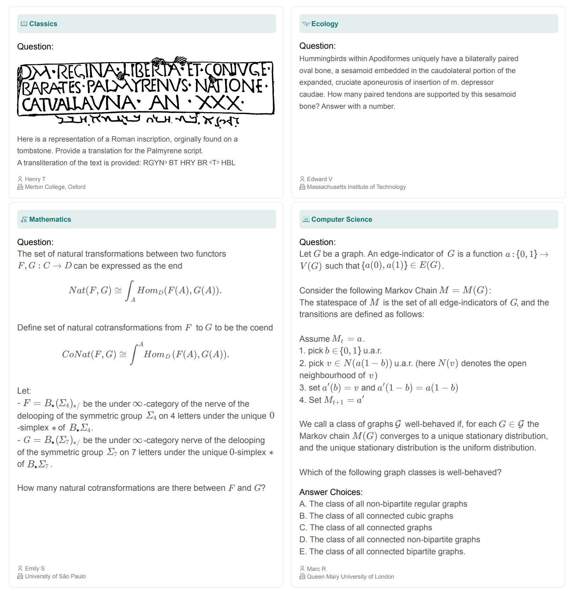
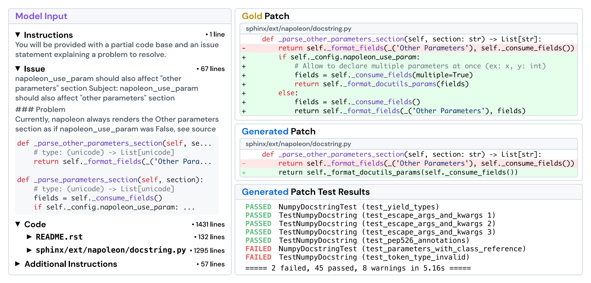
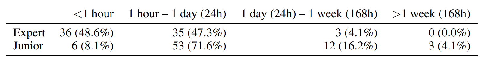
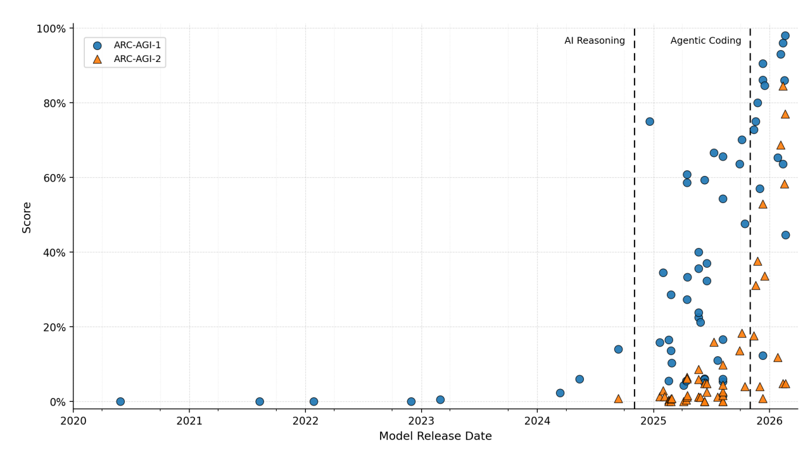

# Lecture 12 — Evaluation

Percy Liang. Source: [`lecture_12.py`](https://github.com/stanford-cs336/lectures/blob/main/lecture_12.py),
394 lines. Rendered by the course's trace viewer at
[`?trace=lecture_12`](https://cs336.stanford.edu/lectures/?trace=lecture_12).

This is the hinge of the course. Lectures 1–11 built a language model — tokenizer,
architecture, kernels, parallelism, scaling laws, inference — and lectures 13–14
are about the data you train it on. This lecture sits between them and asks the
question that has to be answered first: **given a model, how good is it?** The
lecture's own framing of why that is hard is one line, and everything else
elaborates it — evaluation is the process of turning an *abstract construct* into
a *concrete metric*.

The spoken lecture follows this program closely but not exactly — Percy digresses,
answers questions, and expands on points that the source states in one line. For
what was *said*, see [the transcript](../transcripts/12-evaluation.md). For what
was *written*, use this file.

## Sections → source lines

| Section | Function | Source lines |
| --- | --- | --- |
| [Roadmap](#roadmap) | `main` | 5–30 |
| [What makes a model good?](#what-makes-a-model-good) | `what_is_good` | 33–58 |
| [Perplexity](#perplexity) | `perplexity` | 60–106 |
| [Exam benchmarks](#exam-benchmarks) | `exam_benchmarks` | 108–153 |
| [Chat benchmarks](#chat-benchmarks) | `chat_benchmarks` | 155–206 |
| [Agentic benchmarks](#agentic-benchmarks) | `agentic_benchmarks` | 208–255 |
| [Pure reasoning benchmarks](#pure-reasoning-benchmarks) | `pure_reasoning_benchmarks` | 257–284 |
| [Safety benchmarks](#safety-benchmarks) | `safety_benchmarks` | 286–312 |
| [Realism](#realism) | `realism` | 314–336 |
| [Validity](#validity) | `validity` | 338–369 |
| [How to think about evaluation](#how-to-think-about-evaluation) | `how_to_think_about_evaluation` | 371–391 |
| [Takeaways](#takeaways) | `main` | 27–30 |
| [Figure audit](#figure-audit) | — | — |

## Benchmarks named in this lecture

Every benchmark the lecture names, with the section it appears in and the citation
the source gives. This table is a navigation aid; the detail is in the sections.

| Benchmark | Kind | Section | Citation in source |
| --- | --- | --- | --- |
| Penn Treebank (WSJ) | perplexity | Perplexity | — |
| WikiText-103 | perplexity | Perplexity | — |
| One Billion Word Benchmark | perplexity | Perplexity | [arXiv 1602.02410](https://arxiv.org/abs/1602.02410) |
| LAMBADA | cloze (perplexity in disguise) | Perplexity | [arXiv 1606.06031](https://arxiv.org/abs/1606.06031) |
| HellaSwag | multiple-choice completion | Perplexity | [arXiv 1905.07830](https://arxiv.org/pdf/1905.07830) |
| MMLU | exam | Exam | [arXiv 2009.03300](https://arxiv.org/pdf/2009.03300.pdf) |
| MMLU-Pro | exam | Exam | [arXiv 2406.01574](https://arxiv.org/abs/2406.01574) |
| GPQA | exam | Exam | [arXiv 2311.12022](https://arxiv.org/abs/2311.12022) |
| Humanity's Last Exam (HLE) | exam | Exam | [arXiv 2501.14249](https://arxiv.org/abs/2501.14249) |
| Chatbot Arena | human preference | Chat | [arXiv 2403.04132](https://arxiv.org/abs/2403.04132) |
| AlpacaEval / AlpacaEval 2.0 | LLM judge | Chat | [arXiv 2404.04475](https://arxiv.org/pdf/2404.04475) |
| WildBench | LLM judge + checklist | Chat | [arXiv 2406.04770](https://arxiv.org/pdf/2406.04770) |
| SWEBench | agentic | Agentic | [arXiv 2310.06770](https://arxiv.org/abs/2310.06770) |
| TerminalBench | agentic | Agentic | [arXiv 2601.11868](https://arxiv.org/abs/2601.11868) |
| CyBench | agentic | Agentic | [arXiv 2408.08926](https://arxiv.org/abs/2408.08926) |
| MLEBench | agentic | Agentic | [arXiv 2410.07095](https://arxiv.org/abs/2410.07095) |
| ARC-AGI 1 / 2 / 3 | pure reasoning | Reasoning | [arcprize.org](https://arcprize.org/arc-agi) |
| HarmBench | safety | Safety | [arXiv 2402.04249](https://arxiv.org/abs/2402.04249) |
| AIR-Bench | safety | Safety | [arXiv 2407.17436](https://arxiv.org/abs/2407.17436) |
| GDPVal | realism | Realism | [arXiv 2510.04374](https://arxiv.org/pdf/2510.04374) |
| MedHELM | realism | Realism | [arXiv 2505.23802](https://arxiv.org/abs/2505.23802) |
| Clio | realism (usage analysis) | Realism | [arXiv 2412.13678](https://arxiv.org/abs/2412.13678) |
| SWE-Bench Verified | dataset quality | Validity | [OpenAI post](https://openai.com/index/introducing-swe-bench-verified/) |
| Platinum benchmarks | dataset quality | Validity | [arXiv 2502.03461](https://arxiv.org/abs/2502.03461) |
| LiveCodeBench, UncheatableEval | fresh evals | Validity | — |
| nanogpt speedrun | evaluating *methods* | How to think | [karpathy on X](https://x.com/karpathy/status/1846790537262571739) |

## Roadmap

*Source: `main`, lines 5–30.*

> ## Lecture 12: evaluation

The opening frames the lecture's place in the course:

- So far: we've covered everything for training an LM (architecture, training,
  systems, scaling).
- Missing piece: what **data** do you train on?
- Data shapes model behavior (code? multilingual? DNA?).
- Before talking about data, need to talk about what behavior we want from a model.

And then states the question:

> **Evaluation**: given a model, how "**good**" is it?

The program then calls its sections in order: `what_is_good`, `perplexity`,
`exam_benchmarks`, `chat_benchmarks`, `agentic_benchmarks`,
`pure_reasoning_benchmarks`, `safety_benchmarks`, `realism`, `validity`,
`how_to_think_about_evaluation`.

Note the shape of that list. The five benchmark sections in the middle are a
**survey ordered by what is being measured** — probability, knowledge, open-ended
response quality, action, and reasoning — and the three sections after them
(`realism`, `validity`, `how_to_think_about_evaluation`) are the argument the
survey was gathering evidence for. The lecture is not a benchmark catalogue with a
conclusion attached; the conclusion is the point.

## What makes a model good?

*Source: `what_is_good`, lines 33–58.*

Evaluation might appear to be a mechanical process:

1. Define some prompts
2. Send prompts to a model and get back responses
3. Compute accuracy

> But actually, evaluation is a deep and important topic...
>
> ...which shapes the development of AI.

Then the line the rest of the lecture elaborates. The source sets it with colour —
the construct in red and the metric in blue:

> **Core challenge**: abstract construct → concrete metric

The section then offers four different answers to "what makes a model good",
each with a screenshot of a site that embodies it. They are alternatives, not
steps: each is a different operationalisation of the same abstract construct.

**1. Maybe a model is good if it does well on benchmarks.**
[Artificial Analysis](https://artificialanalysis.ai/)

*Figure: `images/artificial-analysis.png` (width 800).*

__DESC__artificial-analysis.png__

**2. Maybe a model is good if it does well on benchmarks and is cheap to run.**

*Figure: `images/artificial-analysis-cost.png` (width 800).*

__DESC__artificial-analysis-cost.png__

**3. Maybe a model is good if people prefer its responses.**
[Arena AI (formerly Chatbot Arena)](https://arena.ai/leaderboard)

*Figure: `images/lmarena-leaderboard.png` (width 400).*

__DESC__lmarena-leaderboard.png__

**4. Maybe a model is good if people simply choose to use (and pay for) it.**
[OpenRouter](https://openrouter.ai/rankings)

*Figure: `images/openrouter.png` (width 600).*

__DESC__openrouter.png__

## Perplexity

*Source: `perplexity`, lines 60–106.*

The first candidate metric, and the one the course has been implicitly optimising
since lecture 1.

- Recall: that a language model is a probability distribution **p(x)** over
  sequences of tokens.
- Perplexity $(1/p(D))^{1/|D|}$ measures whether $p$ assigns high probability to
  some dataset $D$.

(The source writes this as `(1/p(D))^(1/|D|)` in plain text; it is set as
mathematics here.)

- In pre-training, you minimize perplexity on the training set.
- The obvious thing is to measure perplexity on the test set.
- This is what people did traditionally in language modeling research.

**Standard datasets:**

- Penn Treebank (WSJ)
- WikiText-103 (Wikipedia)
- One Billion Word Benchmark (from machine translation WMT11 — EuroParl, UN, news)

> Classic paradigm: in-distribution evaluation: train on train split and evaluate
> on test split of some dataset.

Pure CNNs+LSTMs on the One Billion Word Benchmark (perplexity 51.3 → 30.0) —
[arXiv 1602.02410](https://arxiv.org/abs/1602.02410)

**GPT-2** is the break in that paradigm:

- Trained on WebText (40GB text, websites linked from Reddit)
- Zero-shot on standard datasets (**out-of-distribution** evaluation)

*Figure: `images/gpt2-perplexity.png` (width 800).*

__DESC__gpt2-perplexity.png__

- Works better on small datasets (PTB) where transfer is helpful, but not larger
  datasets (1BW)

### Perplexity is all you need (more faith than science)

The source's own heading, and its own hedge. The argument:

- True distribution is $t$, model is $p$.
- Best possible perplexity is $H(t)$ obtained iff $p = t$.
- If $p = t$, then solve all the tasks: $p(\text{solution} \mid \text{problem})$
- So by pushing down on perplexity, we will eventually "reach AGI".

### Perplexity is maybe more than you need

- Example: *Stanford was founded in 1885*
- Perplexity penalizes prediction on all tokens, some (e.g., *founded*) of which
  might not be relevant
- Solution: measure conditional perplexity
  $p(\text{response} \mid \text{prompt})^{1/|\text{response}|}$

The two headings are a matched pair and are worth reading together: the first says
perplexity is *sufficient* in the limit, the second says it is *poorly targeted*
in practice. Conditional perplexity is the repair for the second complaint, not
the first.

### Some benchmarks are perplexity in disguise

- Cloze tasks (fill in the blank): **LAMBADA** —
  [arXiv 1606.06031](https://arxiv.org/abs/1606.06031)

*Figure: `images/lambada.png` (width 700).*

__DESC__lambada.png__

- Multiple choice sentence completion: **HellaSwag** —
  [arXiv 1905.07830](https://arxiv.org/pdf/1905.07830)

*Figure: `images/hellaswag.png` (width 500).*

__DESC__hellaswag.png__

### Warning (if you're running a perplexity leaderboard)

- People submit `LM` and you compute `log_prob = LM(test_data)`
- You need to trust that the probabilities are valid (sum to 1)
- For downstream tasks, `response = LM(prompt)` and compute accuracy on `response`

This is a point about **what a leaderboard can verify**. An accuracy leaderboard
only needs the model's output text, which it can score itself; a perplexity
leaderboard needs a number the submitter computed, and a distribution that does
not normalise can produce an arbitrarily good one.

**Summary:**

- Perplexity is still used heavily in language model development (smooth scaling
  laws)
- Still need benchmarks that capture real-world situations (for the
  non-believers)...

## Exam benchmarks

*Source: `exam_benchmarks`, lines 108–153.*

Exams are a useful way to test language models (as with humans):

- Have control over the subject and difficulty
- Design to have unambiguous correct answer, easy to grade

### Massive Multitask Language Understanding (MMLU)

[arXiv 2009.03300](https://arxiv.org/pdf/2009.03300.pdf) — the source cites this
through its `references.py` entry `mmlu_2021`, which records the organization as
Berkeley and the note "57 subjects, multiple-choice".

- 57 subjects (e.g., math, US history, law, morality), multiple-choice
- "collected by graduate and undergraduate students from freely available sources
  online"
- Despite the name, MMLU is really about testing knowledge, not language
  understanding
- Evaluated on GPT-3 using few-shot prompting

*Figure: `images/mmlu.png` (width 700).*

__DESC__mmlu.png__

Links: [llm-stats MMLU](https://llm-stats.com/benchmarks/mmlu) ·
[HELM MMLU for visualizing predictions](https://crfm.stanford.edu/helm/mmlu/latest/)

### MMLU-Pro

[arXiv 2406.01574](https://arxiv.org/abs/2406.01574)

- Removed noisy/trivial questions from MMLU
- Expanded 4 choices to 10 choices
- Evaluated using chain of thought (gives model more of a chance)
- Accuracy of models drop by 16% to 33% (not as saturated)

*Figure: `images/mmlu-pro.png` (width 700).*

__DESC__mmlu-pro.png__

Links: [llm-stats MMLU-Pro](https://llm-stats.com/benchmarks/mmlu-pro) ·
[HELM MMLU-Pro](https://crfm.stanford.edu/helm/capabilities/latest/#/leaderboard/mmlu_pro)

Note the two independent moves MMLU-Pro makes. Expanding four choices to ten
lowers the random-guessing floor from 25% to 10%, and removing trivial questions
raises the ceiling — the "16% to 33%" drop is the combined effect of both, not of
harder questions alone.

### Graduate-Level Google-Proof Q&A (GPQA)

[arXiv 2311.12022](https://arxiv.org/abs/2311.12022)

- Questions written by 61 PhD contractors from Upwork

*Figure: `images/gpqa.png` (width 700).*

__DESC__gpqa.png__

- PhD experts achieve 65% accuracy
- Non-experts achieve 34% over 30 minutes with access to Google
- GPT-4 achieves 39%

Links: [llm-stats GPQA](https://llm-stats.com/benchmarks/gpqa) ·
[HELM GPQA](https://crfm.stanford.edu/helm/capabilities/latest/#/leaderboard/gpqa)

The three numbers are the benchmark's whole design in one line: the 65/34 gap is
what makes the questions *expert-level*, and the 34% non-expert-with-Google figure
is what makes them **Google-proof**. GPT-4's 39% sits just above the non-expert
number and far below the expert one.

### Humanity's Last Exam (HLE)

[arXiv 2501.14249](https://arxiv.org/abs/2501.14249)

- 2500 questions: multimodal, many subjects, multiple-choice + short-answer

*Figure: `images/hle-examples.png` (width 700).*

__DESC__hle-examples.png__

- Awarded $500K prize pool + co-authorship to question creators
- Filtered by frontier LLMs, multiple stages of review

*Figure: `images/hle-pipeline.png` (width 700).*

__DESC__hle-pipeline.png__

*Figure: `images/hle-results.png` (width 600).*

__DESC__hle-results.png__

Link: [llm-stats HLE](https://llm-stats.com/benchmarks/hle)

Two mechanisms here are worth separating. The **incentive** (a $500K prize pool
and co-authorship) is how you get 2500 genuinely hard questions written at all,
and the **filter** (questions that frontier LLMs already answer are discarded) is
how you guarantee the benchmark starts unsaturated. The second is also its main
methodological hazard: a benchmark defined as "what today's models get wrong" is
defined relative to today's models.

**Summary:**

- Trend towards harder questions as models improve and saturate existing
  benchmarks
- Multiple-choice format can be as difficult as one wants
- Does not capture real usage (open-ended, doesn't necessarily exist correct
  answer)

## Chat benchmarks

*Source: `chat_benchmarks`, lines 155–206.*

- So far, we've been evaluating on well-defined multiple-choice tasks.
- Most people don't ask multiple-choice exam questions to their AI assistant.

The lecture's example, quoted in full from the source:

> Prompt: *I would like to make a beet salad with goat cheese. What kind of herbs
> would work well and what would not work well?*
>
> Response: *Here's a breakdown of herbs that work well (and some that don't) in a
> beet + goat cheese salad, based on how their flavors interact with the
> sweet-earthiness of beets and the tangy creaminess of goat cheese...*

> **Challenge**: how to evaluate an open-ended response?

That question is the whole section. There is no answer key for the beet salad, so
every benchmark below replaces the answer key with a *judge* — human, or model —
and then has to deal with the judge's biases.

### Chatbot Arena

[arXiv 2403.04132](https://arxiv.org/abs/2403.04132)

**Data collection:**

- Random person from the Internet types in prompt
- They get response from two random (anonymized) models
- They rate which one is better

*Figure: `images/arena-beets.png` (width 700).*

__DESC__arena-beets.png__

**Compute ELO rankings based on pairwise comparisons:**

- Define model:
  $p(A \text{ wins against } B) = \dfrac{1}{1 + 10^{(\text{ELO}_B - \text{ELO}_A)/400}}$
- Fit this model to maximize probability of pairwise comparisons

[Arena AI (formerly Chatbot Arena)](https://arena.ai/leaderboard)

*Figure: `images/lmarena-leaderboard.png` (width 400) — the same image the
roadmap section showed, repeated here where the ELO computation is explained.*

__DESC__lmarena-leaderboard.png__

**Properties:**

- Real-world prompts (free for users, incentives to actually use it)
- But who are these people? biases? spammers?
- Binary preference but conflates style and correctness
- How does the human even assess correctness? Prone to sycophancy?
- Feature: don't need to feed same prompts to all models (important because human
  is rating)
- Dynamic: incorporates new prompts and models over time

The list is deliberately two-sided, and the fifth item is the one that is easy to
miss. Because the ELO model only needs *pairwise* outcomes, Arena does not have to
run every prompt through every model — which is what makes a human-rated,
continuously-updated leaderboard affordable at all.

### AlpacaEval (2023)

[leaderboard](https://tatsu-lab.github.io/alpaca_eval/)

- 805 instructions from various sources
- Metric: win rate against baseline model (GPT-4 preview) as judged by GPT-4
  preview (potential bias?)
- Problem: LLM judges favor longer responses, resulted in leaderboard gaming
- Alpaca Eval 2.0 used regression to debias the metric —
  [arXiv 2404.04475](https://arxiv.org/pdf/2404.04475)
- How do we evaluate the metric?
- Correlation with Chatbot Arena (humans) is high:

*Figure (hot-linked, not redistributed): `https://github.com/tatsu-lab/alpaca_eval/raw/main/figures/chat_correlations_no_ae.png`
(width 500). A correlation plot from the alpaca_eval repository; not copied into
this repo — see the front matter.*

*Figure: `images/alpacaeval-leaderboard.png` (width 400).*

__DESC__alpacaeval-leaderboard.png__

"How do we evaluate the metric?" is the sharpest line in the section, and the
answer given is **correlation with a metric you already trust** — here, Chatbot
Arena. That makes the human leaderboard the anchor of the whole family of
automatic chat metrics.

### WildBench

[arXiv 2406.04770](https://arxiv.org/pdf/2406.04770)

- Sourced 1024 examples from 1M human-chatbot conversations
- Uses GPT-4 turbo as a judge with a checklist (like CoT for judging) + GPT-4 as a
  judge
- Well-correlated with Chatbot Arena (seems to be the de facto sanity check)

*Figure: `images/wildbench.png` (width 700).*

__DESC__wildbench.png__

Link: [HELM WildBench](https://crfm.stanford.edu/helm/capabilities/latest/#/leaderboard/wildbench)

**Summary:**

- Challenge: how to evaluate open-ended responses?
- Pairwise comparisons between similar responses provide higher signal
- Beware of biases (both from humans and LLM judges)
- Checklist/rubric improves reliability (regardless of human or LLM judge)

## Agentic benchmarks

*Source: `agentic_benchmarks`, lines 208–255.*

> Previously: evaluate what LMs say (chat)
>
> Now: evaluate what LMs do (agents)

> Agent = language model + agent scaffold (logic for deciding how to use the LM)

Consider tasks that require tool use (e.g., running code) and iterating over a
period of time.

That definition is load-bearing for the section's conclusion: if an agent is a
model *plus* a scaffold, then an agentic benchmark score is a measurement of the
pair, and cannot be attributed to the model alone.

### SWEBench

[arXiv 2310.06770](https://arxiv.org/abs/2310.06770)

- 2294 tasks across 12 Python repositories
- Given codebase + issue description, submit a PR
- Evaluation metric: unit tests

*Figure: `images/swebench.png` (width 800).*

__DESC__swebench.png__

Link: [llm-stats SWE-bench Verified](https://llm-stats.com/benchmarks/swe-bench-verified)

Unit tests are what make this benchmark work without a judge at all: the answer
key is executable, so grading is exact and ungameable in the way an LLM judge is
not.

### TerminalBench

[arXiv 2601.11868](https://arxiv.org/abs/2601.11868) ·
[website](https://www.tbench.ai/)

*Figure: `images/terminal-bench.png` (width 700).*

__DESC__terminal-bench.png__

- Computer terminal environments: simple and universal
- 229 tasks crowdsourced from 93 contributors, 89 tasks constitute Terminal-Bench
  2.0

*Figure: `images/terminal-bench-human-time.png` (width 600).*

__DESC__terminal-bench-human-time.png__

*Figure: `images/terminal-bench-results.png` (width 600).*

__DESC__terminal-bench-results.png__

Link: [llm-stats TerminalBench](https://llm-stats.com/benchmarks/terminal-bench)

"Simple and universal" is the design argument: a terminal is one interface that
subsumes an enormous range of real tasks, so a benchmark built on it needs no
per-task harness.

### CyBench

[arXiv 2408.08926](https://arxiv.org/abs/2408.08926)

*Figure: `images/cybench.png` (width 700).*

__DESC__cybench.png__

- 40 Capture the Flag (CTF) tasks
- Use first-solve time as a measure of difficulty

*Figure: `images/cybench-agent.png` (width 700).*

__DESC__cybench-agent.png__

*Figure: `images/cybench-results.png` (width 600).*

__DESC__cybench-results.png__

Link: [llm-stats CyBench](https://llm-stats.com/benchmarks/cybench)

**First-solve time is the interesting idea here.** CTF competitions record how
long it took the first human team to solve each challenge, which hands the
benchmark a *human-calibrated difficulty scale* for free — something almost no
other benchmark on this list has.

### MLEBench

[arXiv 2410.07095](https://arxiv.org/abs/2410.07095)

- 75 Kaggle competitions (require training models, processing data, etc.)

*Figure: `images/mlebench.png` (width 800).*

__DESC__mlebench.png__

*Figure: `images/mlebench-results.png` (width 700).*

__DESC__mlebench-results.png__

### Agent scaffolds

[post](https://www.philschmid.de/agents-2.0-deep-agents)

*Figure (hot-linked, not redistributed):
`https://www.philschmid.de/static/blog/agents-2.0-deep-agents/overview.png`
(width 400). An overview diagram of "deep agent" scaffolds from philschmid.de;
not copied into this repo — see the front matter.*

- Explicit planning: keep a todo list that gets checked off
- Hierarchical delegation: agents calling other sub-agents (clean context)
- Persistent memory: read/write files
- Extreme context engineering: explicit more instructions on process

**Summary:**

- Agents dramatically enhance the capability surface of language models
- Agent scaffolds are very important
- Evaluating agents = evaluating agent scaffold + language model

## Pure reasoning benchmarks

*Source: `pure_reasoning_benchmarks`, lines 257–284.*

- All of the tasks so far require linguistic and world knowledge.
- Can we isolate **reasoning** from knowledge?
- Arguably, reasoning captures a more pure form of intelligence (isn't just about
  memorizing facts).

### ARC-AGI

[website](https://arcprize.org/arc-agi)

- 100% solvable by humans, but challenging for AI
- Each task is unique, so memorization doesn't help.

Those two properties are the design in miniature, and they are what make the
benchmark a claim about *reasoning* rather than knowledge: a human solve rate of
100% removes the "the questions are just too hard" explanation, and per-task
uniqueness removes memorisation as a route to a high score.

**ARC-AGI-1 (2019): first iteration**

*Figure (hot-linked, not redistributed):
`https://arcprize.org/media/images/arc-task-grids.jpg` (width 800). The
grid-transformation task examples from ARC Prize; not copied into this repo — see
the front matter.*

**ARC-AGI-2 (March 2025): more multi-step reasoning**

*Figure (hot-linked, not redistributed):
`https://arcprize.org/media/images/blog/arc-agi-2-unsolved-1.png` (width 800). An
ARC-AGI-2 task that remained unsolved; not copied into this repo — see the front
matter.*

*Figure: `images/arc-agi-results.png` (width 700).*

__DESC__arc-agi-results.png__

- Pretrained language models didn't move the needle
- Reasoning models (o1, o3) started making things take off

That pair of bullets is the reason ARC-AGI is in this lecture at all. A benchmark
on which scaling pre-training does nothing and a change of *method* does
everything is evidence that it is measuring something the other benchmarks are
not.

**ARC-AGI-3 (March 2026): interactive environments** —
[post](https://arcprize.org/media/ARC_AGI_3_Technical_Report.pdf)

*Figure: `images/arc-agi-3.png` (width 300).*

__DESC__arc-agi-3.png__

*Figure: `images/arc-agi-3-results.png` (width 500).*

__DESC__arc-agi-3-results.png__

**Summary:**

- Goal is to disentangle reasoning from knowledge (difficult to do!)
- Constrained to human reasoning (not superhuman reasoning)
- Clearly exposes gaps in current models

The middle bullet is a real limitation and easy to skip past. Because the tasks
are validated by being 100% solvable by humans, the benchmark can only ever
measure reasoning *up to* the human level — it is constitutionally unable to
detect superhuman reasoning.

## Safety benchmarks

*Source: `safety_benchmarks`, lines 286–312.*

*Figure (hot-linked, not redistributed):
`https://www.team-bhp.com/forum/attachments/road-safety/2173645d1625144681-will-crash-test-rating-change-if-higher-variant-chosen-images-30.jpeg`
(width 400). A car crash-test photograph, used to open the section; not copied
into this repo — see the front matter.*

> What does safety mean for AI?

The crash-test image is the section's framing joke and its framing argument at
once: automotive safety is a mature field with an agreed operationalisation — you
drive the car into a wall and measure — and the section is about how little of
that agreement exists for AI.

### HarmBench

[arXiv 2402.04249](https://arxiv.org/abs/2402.04249)

- Based on 510 harmful behaviors that violate laws or norms

Links: [HarmBench on HELM](https://crfm.stanford.edu/helm/safety/latest/#/leaderboard/harm_bench) ·
[Example of safety failure](https://crfm.stanford.edu/helm/safety/latest/#/runs/harm_bench:model=anthropic_claude-3-7-sonnet-20250219?instancesPage=4)

### AIR-Bench

[arXiv 2407.17436](https://arxiv.org/abs/2407.17436)

- Based on regulatory frameworks and company policies
- Taxonomized into 314 risk categories, 5694 prompts

*Figure (hot-linked, not redistributed):
`https://crfm.stanford.edu/helm/assets/air-overview-DpBbyagA.png` (width 800). The
AIR-Bench risk taxonomy overview from Stanford CRFM's HELM asset host; not copied
into this repo — see the front matter.*

Link: [HELM AIR-Bench](https://crfm.stanford.edu/helm/air-bench/latest/#/leaderboard)

HarmBench and AIR-Bench are two different answers to "where does the list of
harms come from": HarmBench derives it from *laws and norms*, AIR-Bench from
*regulatory frameworks and company policies*. Neither derives it from first
principles, because there is no agreed first principle to derive it from.

### Jailbreaking

- Language models are trained to refuse harmful instructions
- Greedy Coordinate Gradient (GCG) automatically optimizes prompts to bypass
  safety — [arXiv 2307.15043](https://arxiv.org/pdf/2307.15043)
- Transfers from open-weight models (Llama) to closed models (GPT-4)

*Figure: `images/gcg-examples.png` (width 800).*

__DESC__gcg-examples.png__

The transfer property is what makes this a systems fact rather than a curiosity:
the attack is optimised with gradients, which requires open weights, and the
resulting suffix then works on models whose weights the attacker never had.

### What is safety?

- Many aspects of safety are strongly contextual (politics, law, social norms —
  which vary across countries)
- Many risks are quite varied (hallucinations, sycophancy, abetting crimes,
  inequality, losing critical thinking)

**Dual-use**: capable cybersecurity agents (Mythos) can be used to hack into a
system or to do penetration testing.

The dual-use point connects straight back to CyBench two sections earlier: the
*same* capability that scores well on a security benchmark is the capability a
safety evaluation is worried about. There is no measurement that separates them,
because they are not different capabilities.

## Realism

*Source: `realism`, lines 314–336.*

> **Ecological validity**: how well does an evaluation capture real-world use?

- Exam benchmarks (e.g., GPQA) are far away from real-world use.
- Chatbot Arena prompts are from real people, but distribution is uncontrolled.

Those two bullets name the trade-off the whole section is about. Exams are
controlled but unrealistic; Arena is realistic but uncontrolled. The three
benchmarks below are each an attempt to get both at once.

### GDPVal (OpenAI)

[arXiv 2510.04374](https://arxiv.org/pdf/2510.04374)

- 44 occupations from top 9 sectors according to US GDP
- Tasks come from professionals with ~14 years of experience

*Figure: `images/gdpval.png` (width 700).*

__DESC__gdpval.png__

Sampling by **share of GDP** is the notable move: it makes the task distribution a
claim about economic significance rather than about what is convenient to collect.

### MedHELM

[arXiv 2505.23802](https://arxiv.org/abs/2505.23802)

- Previous medical benchmarks were based on standardized exams
- 121 clinical tasks sourced from 29 clinicians, mixture of private and public
  datasets

*Figure (hot-linked, not redistributed):
`https://crfm.stanford.edu/helm/assets/medhelm-overview-CND0EIsy.png` (width 700).
The MedHELM task taxonomy overview from Stanford CRFM's HELM asset host; not
copied into this repo — see the front matter.*

Link: [MedHELM](https://crfm.stanford.edu/helm/medhelm/latest/#/leaderboard)

The contrast with the exam section is explicit: medical benchmarks used to be
medical *exams*, which is exactly the ecological-validity failure this section
opened with. Sourcing tasks from practising clinicians is the repair.

### Clio (Anthropic)

[arXiv 2412.13678](https://arxiv.org/abs/2412.13678)

- Use language models to analyze real user data
- Share general patterns of what people are asking

*Figure: `images/clio-table4.png` (width 700).*

__DESC__clio-table4.png__

> Unfortunately, realism and privacy are sometimes at odds with each other.

That closing line is the section's real conclusion. The most realistic evaluation
data is what users actually send, and that is precisely the data you cannot
publish — which is why Clio publishes *aggregate patterns* rather than a
benchmark.

## Validity

*Source: `validity`, lines 338–369.*

> How do we know our evaluations are valid?

### Train-test overlap

- Machine learning 101: don't train on your test set
- Pre-foundation models (ImageNet, SQuAD): well-defined train-test splits
- Today: train on the Internet and don't tell people about your data

The three bullets are a compressed history. The discipline had a *procedural*
guarantee against contamination — the split shipped with the dataset — and
foundation-model training destroyed it, because the training set is the Internet
and the benchmark is on the Internet. The four routes below are all attempts to
rebuild that guarantee without the split.

**Route 1: try to infer train-test overlap from model**

- Exploit exchangeability of data points —
  [arXiv 2310.17623](https://arxiv.org/pdf/2310.17623)

*Figure: `images/contamination-exchangeability.png` (width 500).*

__DESC__contamination-exchangeability.png__

The exchangeability idea is worth stating plainly, because the one-line bullet
hides it: a benchmark's examples have a canonical order, but under a clean model
that order should not matter, so if the model assigns higher probability to the
dataset *in its published order* than to a shuffling of it, the model has seen the
published file.

**Route 2: encourage reporting norms** (e.g., people report confidence intervals)

- Model providers should report train-test overlap —
  [arXiv 2410.08385](https://arxiv.org/abs/2410.08385)

**Route 3: use fresh evals**

- LiveCodeBench, UncheatableEval: scrape new webpages
- Timestamps aren't always safe due to copying either

**Route 4: use private evals**

- Companies use internal code bases that aren't on the Internet
- Use your personal writings
- Easiest for perplexity

The four routes trade off in an obvious way once laid side by side: route 1 needs
no cooperation but only detects contamination it can find; route 2 needs the
provider's cooperation; route 3 expires, and is undermined by copying; route 4
works but is unshareable, which is to say it cannot be a public leaderboard. The
last line — "easiest for perplexity" — connects back to the perplexity section: a
private eval needs no answer key, just text, so perplexity is the metric a private
eval can most cheaply use.

### Dataset quality

- Fixed up SWE-Bench to produce SWE-Bench Verified —
  [post](https://openai.com/index/introducing-swe-bench-verified/)
- Create Platinum versions of benchmarks —
  [arXiv 2502.03461](https://arxiv.org/abs/2502.03461)

*Figure (hot-linked, not redistributed):
`https://pbs.twimg.com/media/GjICXQlWkAAYnDS?format=jpg&name=4096x4096` (width
700). An image posted to X about benchmark quality; not copied into this repo —
see the front matter.*

*Figure (hot-linked, not redistributed):
`https://pbs.twimg.com/media/GjICcGQXYAAM4o1?format=jpg&name=4096x4096` (width
800). A second image from the same X thread; not copied into this repo — see the
front matter.*

- Problems with agentic benchmarks: insufficient test cases, trivial agent can
  solve task — [arXiv 2507.02825](https://arxiv.org/abs/2507.02825)
- Docent: use LLM to inspect agent traces to detect problems —
  [post](https://transluce.org/introducing-docent)

This subsection is the counterpart to train-test overlap, and the pairing is the
point: contamination is a problem with the *model's relationship to* the
benchmark, dataset quality is a problem with the benchmark *itself*. Both make a
score mean less than it appears to, and neither is visible in the score.

Note also that the agentic-benchmark failure named here — "trivial agent can solve
task" — is the mirror image of the failure named in the agentic section. There,
the worry was that a good scaffold inflates a model's score; here, it is that a
*trivial* scaffold suffices, which means the task never measured what it claimed
to.

## How to think about evaluation

*Source: `how_to_think_about_evaluation`, lines 371–391.*

### What's the point of evaluation?

> There is no one true evaluation; it depends on what question you're trying to
> answer.

1. User or company wants to make a purchase decision (model A or model B) for
   their use case (e.g., customer service chatbots).
2. Researchers want to measure the raw capabilities of a model (e.g.,
   intelligence).
3. We want to understand the benefits + harms of a model (for business and policy
   reasons).
4. Model developers want to get feedback to improve the model.

These four are genuinely different questions and they license different
evaluations. A purchase decision wants ecological validity on *your* use case; a
capability measurement wants difficulty and contamination control; a benefits-and-
harms assessment wants coverage of risks nobody is optimising for; developer
feedback wants a metric that moves smoothly, which is why perplexity survives
inside model development long after it stopped being a headline number.

### What are we evaluating?

- Pre-foundation models, we evaluated **methods** (standardized train-test splits).
- Today, we're (mostly) evaluating **models/systems** (anything goes).

**There are some exceptions...**

- nanogpt speedrun: fixed data, compute time to get to a particular validation loss

*Figure: `images/karpathy-nanogpt-speedrun.png` (width 600).*

__DESC__karpathy-nanogpt-speedrun.png__

[post](https://x.com/karpathy/status/1846790537262571739)

> Evaluating methods encourage algorithmic innovation from researchers.
>
> Evaluating models/systems is useful for downstream users.
>
> Either way, we need to define the rules of the game!

The methods-versus-models distinction is the lecture's most transferable idea and
the one most often left implicit elsewhere. A *method* evaluation fixes the data
and the compute and varies the algorithm, so a win is attributable to the
algorithm. A *model* evaluation fixes nothing, so a win could be data, scale,
scaffold, post-training or luck. The nanogpt speedrun is in the lecture precisely
because it is a rare modern example of the first kind, and it connects directly to
this course's own assignments, which are leaderboards over a fixed compute budget.

## Takeaways

*Source: `main`, lines 27–30.*

- There is no one true evaluation; choose the evaluation depending on what you're
  trying to measure.
- Clearly state the rules of the game (methods versus models versus agents).
- Considerations: difficulty, realism, validity.

Those three "considerations" map onto the lecture's own structure: **difficulty**
is the thread running through the benchmark survey (perplexity → exams → HLE →
ARC-AGI, each harder than the last as the previous saturates), **realism** is the
`realism` section, and **validity** is the `validity` section.
