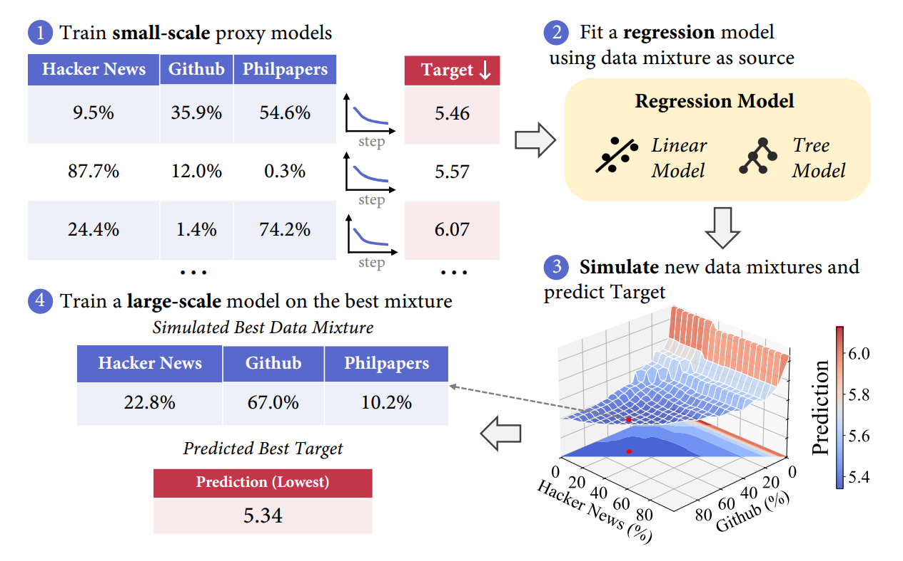

# Lecture 14 — Data II: Filtering, Deduplication, Mixing, Post-Training Data

Percy Liang. Source: [`lecture_14.py`](https://github.com/stanford-cs336/lectures/blob/main/lecture_14.py),
464 lines. Rendered by the course's trace viewer at
[`?trace=lecture_14`](https://cs336.stanford.edu/lectures/?trace=lecture_14).

Lecture 13 was a history and a survey: where text physically comes from, what law
governs its use, and a chronological tour of the named pre-training datasets.
This lecture is the other half — **what you do to raw data to turn it into
training data** — and it has a different shape. Three of its five parts are
*algorithms*, with running code: filtering as a classification problem,
deduplication via MinHash and locality-sensitive hashing, and mixing as a
regression problem. The fifth part, post-training data, is a survey again.

The program states its own two-line framing at the top:

> Last lecture:
>
> - Live service (e.g., GitHub) → dump/crawl (e.g., GitHub Archive) → processed data (e.g., The Stack)
> - Considerations: terms of service, copyright (licenses or fair use)
>
> This lecture:
>
> - Data pipeline: transformation, filtering, deduplication, mixing
> - Mid-training + SFT: synthetic data

The first four are the pre-training pipeline, in the order data moves through it.
The fifth is a change of subject, and the lecture says so: the first part "is
going to be mostly about pre-training."

For what was *said*, see [the transcript](../transcripts/14-data-filtering-dedup-mixing.md).
For what was *written*, use this file.

## Sections → source lines

| Section | Function | Source lines |
| --- | --- | --- |
| [Roadmap](#roadmap) | `main` | 11–36 |
| [Transformation: raw bytes to text](#transformation-raw-bytes-to-text) | `transformation` | 39–58 |
| [Filtering](#filtering) | `filtering` | 60–143 |
| [Deduplication](#deduplication) | `deduplication` | 145–176 |
| [Hash functions](#hash-functions) | `hash_functions` | 178–189 |
| [Exact deduplication](#exact-deduplication) | `exact_deduplication` | 191–215 |
| [Jaccard similarity and MinHash](#jaccard-similarity-and-minhash) | `jaccard_minhash` | 217–266 |
| [Locality-sensitive hashing](#locality-sensitive-hashing) | `locality_sensitive_hashing` | 268–322 |
| [Data mixing](#data-mixing) | `data_mixing` | 331–407 |
| [Post-training data](#post-training-data) | `post_training_data` | 409–461 |
| [Summary](#summary) | `main` | 30–36 |
| [Every computed value in this lecture](#every-computed-value-in-this-lecture) | — | — |
| [Papers and resources cited](#papers-and-resources-cited) | — | — |
| [Figure audit](#figure-audit) | — | — |

`billion()` and `trillion()` (lines 324–329) are one-line helpers used only by the
data-mixing arithmetic and have no content of their own.

## Papers and resources cited

Every paper, dataset and tool the source links or names, with the citation the
program carries. This table is a navigation aid; the detail is in the sections.

| Work | Where | Citation in source |
| --- | --- | --- |
| DCLM (accuracy of HTML→text extraction) | transformation, filtering | [arXiv 2406.11794](https://arxiv.org/abs/2406.11794) (`dclm_2024`) |
| FinePDFs | transformation | [HF blog space](https://huggingface.co/spaces/HuggingFaceFW/FinePDFsBlog) |
| Data selection survey | filtering | [arXiv 2402.16827](https://arxiv.org/abs/2402.16827) |
| fastText language identification | filtering | [fasttext.cc docs](https://fasttext.cc/docs/en/language-identification.html) |
| Dolma | filtering (language id, toxicity) | [arXiv 2402.00159](https://arxiv.org/abs/2402.00159) (`dolma_2024`) |
| OpenMathText | filtering | [arXiv 2310.06786](https://arxiv.org/pdf/2310.06786) |
| GPT-3 (quality classifier, Appendix A) | filtering | [arXiv 2005.14165](https://arxiv.org/pdf/2005.14165) |
| Spark ML tokenizer (word features) | filtering | [Spark docs](https://spark.apache.org/docs/latest/ml-features#tokenizer) |
| LLaMA / RedPajama | filtering | [arXiv 2302.13971](https://arxiv.org/pdf/2302.13971) |
| phi-1 | filtering | [arXiv 2306.11644](https://arxiv.org/pdf/2306.11644) |
| HumanEval | filtering (phi-1 result) | [openai_humaneval on HF](https://huggingface.co/datasets/openai_humaneval) |
| Jigsaw Toxic Comments dataset (2018) | filtering | [Kaggle dataset](https://www.kaggle.com/datasets/julian3833/jigsaw-toxic-comment-classification-challenge), [competition discussion](https://www.kaggle.com/competitions/jigsaw-toxic-comment-classification-challenge/discussion/46064) |
| Project Gutenberg mirrors | deduplication | [gutenberg.org/MIRRORS.ALL](https://www.gutenberg.org/MIRRORS.ALL) |
| "Deduplicating Training Data Makes Language Models Better" | deduplication, LSH | [arXiv 2107.06499](https://arxiv.org/pdf/2107.06499) |
| Hash function tradeoffs | hash functions | [StackExchange answer](https://softwareengineering.stackexchange.com/questions/49550/which-hashing-algorithm-is-best-for-uniqueness-and-speed) |
| C4 / T5 (3-sentence-span dedup) | exact deduplication | [arXiv 1910.10683v4](https://arxiv.org/pdf/1910.10683v4) |
| MIT license (as a near-duplicate example) | deduplication | [opensource.org/license/mit](https://opensource.org/license/mit) |
| LSH book chapter (Leskovec, Rajaraman, Ullman, *MMDS* ch. 3) | LSH | [infolab.stanford.edu/~ullman/mmds/ch3n.pdf](http://infolab.stanford.edu/~ullman/mmds/ch3n.pdf) |
| Marin token-count viewer | data mixing | [HF space](https://huggingface.co/spaces/marin-community/token-count-viewer) |
| The Pile | data mixing | [arXiv 2101.00027](https://arxiv.org/pdf/2101.00027.pdf) (`the_pile_2020`) |
| UniMax | data mixing | [arXiv 2304.09151](https://arxiv.org/abs/2304.09151) |
| RegMix | data mixing | [arXiv 2407.01492](https://arxiv.org/abs/2407.01492) |
| (second regression-mixing paper) | data mixing | [arXiv 2602.12237](https://arxiv.org/pdf/2602.12237) |
| Simulated epoching | data mixing | [arXiv 2501.11747](https://arxiv.org/pdf/2501.11747) |
| OpenThoughts | post-training data | [arXiv 2506.04178](https://arxiv.org/abs/2506.04178) |
| SWE-smith | post-training data | [arXiv 2504.21798](https://arxiv.org/abs/2504.21798) |
| SWE-Zero | post-training data | [arXiv 2604.01496](https://arxiv.org/abs/2604.01496) |
| SWE-rebench | post-training data | [arXiv 2505.20411](https://arxiv.org/pdf/2505.20411) |
| SWE-ZERO-12M-trajectories | post-training data | [HF dataset](https://huggingface.co/datasets/AlienKevin/SWE-ZERO-12M-trajectories) |

Tools the source names without linking: trafilatura, resiliparse, jusText, lynx
(HTML→text); RolmOCR and Docling (PDF OCR); KenLM and fastText (filtering
classifiers); SHA-256, DJB2, MurmurHash, CityHash (hashing).

## Roadmap

*Source: `main`, lines 11–36.*

> ## Lecture 14: Data II

The program recalls where lecture 13 left off, states what this lecture adds, and
then calls its sections in order. The call list, with the source's own grouping
comments, is the outline:

**Data pipeline**

- `transformation()`
- `filtering()`
- `deduplication()`
- `data_mixing()`

**Post-training data**

- `post_training_data()`

Note the asymmetry: four functions for the pre-training pipeline and one for
everything after it. The one at the end is nonetheless a fifth of the lecture and
covers four separate papers.

## Transformation: raw bytes to text

*Source: `transformation`, lines 39–58.*

The premise, stated flatly:

> Raw data does not come as text.
>
> It is HTML, PDF (arxiv), or directories (code repositories).

### HTML to text

The program calls this "the main one" — most of the web is HTML, so most of the
transformation effort goes here.

> - Remove boilerplate (e.g., navigation, ads) and extract content
> - What about images, tables, etc.?
> - Inherently lossy (need to linearize)
> - Tools (rule-based): trafilatura, resiliparse, jusText, lynx, etc.
> - Accuracy matters: [DCLM](https://arxiv.org/abs/2406.11794)

Two things are worth drawing out of that list. **"Inherently lossy" is a claim
about the shape of the data, not about tool quality**: HTML is hierarchical (and,
rendered, visual), while a training example is a flat sequence of tokens, so
something has to be thrown away no matter how good the extractor is. And **the
tools named are all rule-based** — trafilatura and resiliparse are the two that
recur across the datasets in lecture 13.

*Figure: `images/dclm-wet.png`.*


**What the image shows.** A table, not a chart: three rows of text-extraction methods against two numeric columns, reproduced exactly below.

| Text Extraction | CORE | EXTENDED |
|---|---|---|
| resiliparse | 24.1 | **13.4** |
| trafilatura | **24.5** | 12.5 |
| WET files | 20.7 | 12.2 |

Bolded values (as printed in the table) are the column-wise best: trafilatura wins CORE (24.5), resiliparse wins EXTENDED (13.4). WET files is worst on both columns (20.7 / 12.2). This is the DCLM paper's ablation showing that rule-based HTML-extraction accuracy matters and plain WET (raw crawl text without boilerplate removal) underperforms both dedicated extraction tools.

*Source: [`images/dclm-wet.png`](https://github.com/stanford-cs336/lectures/blob/main/images/dclm-wet.png) in the lectures repo.*

### FinePDFs

> FinePDFs — [HuggingFaceFW/FinePDFsBlog](https://huggingface.co/spaces/HuggingFaceFW/FinePDFsBlog)

*Figure (third-party, NOT redistributed): `https://huggingfacefw-finepdfsblog.hf.space/_astro/pdf-description.Cb49jXc6_Z17eX4E.webp` (width 600). Hot-linked from the FinePDFs blog; no description is given here because nobody transcribing this file looked at it.*

> - Source: Common Crawl
> - Recrawl truncated PDFs (since they are big)
> - OCR (RolmOCR) using a VLM or Docling (make these run fast)
> - Lots of cleanup and filtering
> - A lot of layout information is missing

The PDF path is a strictly harder version of the HTML path: Common Crawl truncates
large PDFs, so the pipeline has to **re-crawl them**; the text is not marked up at
all, so extraction means **OCR** — either a vision-language model (RolmOCR) or a
document-layout tool (Docling) — and the source's parenthetical "(make these run
fast)" is the whole engineering problem, since these run over the crawl. The
closing bullet is the same loss the HTML path has, worse: layout information is
gone.

## Filtering

*Source: `filtering`, lines 60–143.*

### The algorithmic building block

This is the section's organizing idea, and the lecture states it once, abstractly,
before giving any application:

> Algorithmic building block:
>
> - Given some **target data** T and lots of **raw data** R, find subset T' of R similar to T.

*Figure: `images/raw-target-schema.png`.*


**What the image shows.** A schematic (Venn-diagram-style) illustration, not a chart or data plot — no numbers appear. Three ellipses:
- A large pink/salmon ellipse on the left labeled "Raw data R", occupying most of the image.
- A smaller peach/tan ellipse labeled "More data T'", positioned inside the lower-right portion of R, overlapping/nested within it (drawn as a subset of R).
- A separate, similarly-sized pale-yellow ellipse labeled "Target data T", positioned to the right, disjoint from (not touching) the R ellipse.

The two "target-like" ellipses (T and T') are colored in the same warm light-yellow/peach family, visually distinct from R's pink, even though T and T' are drawn as geometrically separate shapes. This encodes the lecture's point: T' is the subset of raw data R that is found to be similar to (colored like) the separate target set T — the diagram is a conceptual/color analogy rather than an actual set-overlap between T and T'.

**Before citing this figure.** T and T' do not visually overlap or connect in the image — the "T' resembles T" relationship is conveyed only by matching color family, not by any drawn arrow, line, or overlap between the two ellipses. Don't describe this as a literal Venn diagram with T∩R=T'; T is drawn fully separate from R.

*Source: [`images/raw-target-schema.png`](https://github.com/stanford-cs336/lectures/blob/main/images/raw-target-schema.png) in the lectures repo.*

> Applications:
>
> - Language identification (English versus rest)
> - Quality filtering (high quality versus low quality)
> - Toxicity filtering (non-toxic versus toxic)

The point of the abstraction is that these three jobs, which sound unrelated, are
**the same algorithm with a different T**.

> Desiderata for filtering algorithm:
>
> - Generalize from the target data (want T and T' to be different)
> - Extremely fast (have to run it on R, which is huge)

The first desideratum is easy to misread. You do **not** want T' to be a copy of T
— if it were, filtering would have bought you nothing beyond the target set you
already had. You want the classifier to *generalize*, so that T' contains material
that resembles T without being it.

> Survey paper on data selection: [arXiv 2402.16827](https://arxiv.org/abs/2402.16827)

### The general framework

> General framework: Given target T and raw R, find subset of R similar to T
>
> 1. Estimate some model based on R and T and derive a scoring function
> 2. Keep examples in R based on their score

> Types of classifiers:
>
> - Generative model of T (KenLM): score(x) = p_T(x)
> - Simple classifier (fastText): score(x) = p(T | x)
>
> To use: keep examples x with score(x) >= threshold (stochastically)

In LaTeX, the two scoring functions are $\text{score}(x) = p_T(x)$ — the
likelihood of $x$ under a language model trained on the target — and
$\text{score}(x) = p(T \mid x)$ — the probability that $x$ came from the target
rather than the raw pool. The first needs only T to fit; the second needs both T
(positives) and R (negatives). Note the word **stochastically** in the last line:
the threshold is not applied as a hard cut, and the GPT-3 recipe below shows how.

> Model-based filtering?
>
> - Some deliberately do not use model-based filtering (C4, Gopher, RefinedWeb, FineWeb, Dolma)
> - Some use model-based filtering (GPT-3, LLaMA, DCLM) [becoming the norm]

This is the same split lecture 13 drew between rule-based and model-based dataset
construction; the source's bracketed "[becoming the norm]" is its judgement about
where the field has landed.

### Language identification

> - Goal: find text of a specific language (e.g., English)
> - [fastText language identification](https://fasttext.cc/docs/en/language-identification.html)
> - Off-the-shelf classifier
> - Supports 176 languages
> - Trained on multilingual sites: Wikipedia, Tatoeba (translation site) and SETimes (Southeast European news)
> - Dolma keeps pages with p(English) >= 0.5 — [Dolma](https://arxiv.org/abs/2402.00159)

The training-data list is the interesting part: an off-the-shelf language
identifier is itself the product of a data-selection decision, and its three
sources (an encyclopedia, a sentence-translation site, and a Southeast European
news corpus) are what its 176-language coverage rests on.

### OpenMathText

> [OpenMathText](https://arxiv.org/pdf/2310.06786)
>
> - Goal: curate large corpus of mathematical text from CommonCrawl
> - Use rules to filter (e.g., contains latex commands)
> - KenLM trained on ProofPile, keep if perplexity < 15000
> - Trained fastText classifier to predict mathematical writing, threshold is 0.17 if math, 0.8 if no math
> - Result: produced 14.7B tokens, used to train 1.4B models that do better than models trained on 20x data

This is the worked example of the framework: **all three classifier types at once**
— a rule (does it contain LaTeX commands), a generative model of the target (KenLM
fit on ProofPile, with a perplexity cutoff of 15,000), and a discriminative
classifier (fastText). The two fastText thresholds are the stochastic-keep idea
made concrete: a document already carrying mathematical markup only has to clear
0.17, while one that does not must clear 0.8.

The headline result — **14.7B tokens**, and 1.4B-parameter models trained on them
beating models trained on **20× the data** — is the single strongest quantitative
claim for filtering in the lecture.

### GPT-3's quality classifier

> [GPT-3](https://arxiv.org/pdf/2005.14165) (Appendix A)
>
> - Positives: samples from {Wikipedia, WebText2, Books1, Books2}
> - Negatives: samples from CommonCrawl
>
> Train linear classifier based on [word features](https://spark.apache.org/docs/latest/ml-features#tokenizer)
>
> Keep documents stochastically based on score

The source gives the stochastic keep rule as code:

```python
def keep_document(score: float) -> bool:
    return np.random.pareto(9) > 1 - score
```

Read it as: a document with score $s$ is kept when a draw from a Pareto
distribution with shape 9 exceeds $1 - s$. High-scoring documents are kept almost
always, low-scoring ones occasionally — which preserves some of the raw
distribution rather than cutting it off. **This function is defined and never
called**, so it produces no value to record; it is there to show the rule.

Note also what the positive set is: the four sources GPT-3 already trusted, which
lecture 13 covered — Wikipedia, WebText2, Books1 and Books2.

### LLaMA / RedPajama

> [LLaMA/RedPajama](https://arxiv.org/pdf/2302.13971)
>
> - Positives: samples from pages **referenced** by Wikipedia
> - Negatives: samples from CommonCrawl
> - Keep documents that are classified positive

The difference from GPT-3 is one word, emphasized in the source: the positives are
not Wikipedia but the pages Wikipedia **references**. That gets you web pages a
human editor thought worth citing, which is a better proxy for "good web page"
than the encyclopedia text itself. And unlike GPT-3, the keep rule here is a hard
classification, not a stochastic draw.

### phi-1

> [phi-1](https://arxiv.org/pdf/2306.11644)
>
> - Philosophy: really high quality data (textbooks) to train a small model (1.5B)
> - Includes synthetic data from GPT 3.5 (later: GPT-4) and filtered data

The source sets up the filtering half as three assignments, which are the T and R
of the framework:

```python
R = "Python subset of the Stack"   # Raw data
prompt = "determine its educational value for a student whose goal is to learn basic coding concepts"
T = "Use GPT-4 with this prompt to classify 100K subset of R to get positive examples"
```

> - Train random forest classifier on T using output embedding from pretrained codegen model
> - Select data from R that is classified positive by the classifier

> Result on [HumanEval](https://huggingface.co/datasets/openai_humaneval):
>
> - Train 1.3B LM on Python subset of The Stack (performance: 12.19% after 96K steps)
> - Train 1.3B LM on new filtered subset (performance: 17.68% after 36K steps) - better!

The comparison is better on **both** axes and that is the point: 17.68% against
12.19% on HumanEval, reached in **36K steps instead of 96K**. Note the two model
sizes the source gives — the philosophy bullet says 1.5B and the result rows say
1.3B — which is the paper's headline model versus the ablation model, and this
file reproduces both as written rather than reconciling them.

The recipe is also the first appearance in this lecture of a pattern that
dominates its last section: **use a strong model to label, then train a cheap
classifier on those labels**, because the strong model is too expensive to run
over R.

### Toxicity filtering in Dolma

> Toxicity filtering in [Dolma](https://arxiv.org/abs/2402.00159)
>
> - Dataset: Jigsaw Toxic Comments dataset (2018) — [dataset](https://www.kaggle.com/datasets/julian3833/jigsaw-toxic-comment-classification-challenge)
> - Project goal: help people have better discussions online — [discussion](https://www.kaggle.com/competitions/jigsaw-toxic-comment-classification-challenge/discussion/46064)
> - Data: comments on Wikipedia talk page annotated with {toxic, severe_toxic, obscene, threat, insult, identity_hate}

Same framework once more, with T supplied by an annotated dataset rather than
inferred. The provenance is worth keeping: the labels come from **Wikipedia talk
page comments**, annotated for a 2018 Kaggle competition whose stated purpose was
online-discussion quality, not pre-training. A filter built on it inherits that
definition of toxicity.

### Scale-dependent effects of filtering

> Scale-dependent effects of filtering:
>
> - No single optimal threshold for filtering
> - If training for longer, want more (lower quality) data
> - If training for shorter, want less (higher quality) data

*Figure: `images/data-filtering-scale.png`.*


**What the image shows.** A line chart titled "Method comparison at d512 (157M), N=100 WARCs vs tokens (all-epoch markers) -- expWARC_natural". X-axis: "Tokens trained (log)", log scale from about 50M to ~20B+ (labeled ticks at 100M, 1B, 10B, with unlabeled minor ticks at the 2x and 5x positions between them). Y-axis: "eval/lima/loss", linear scale from 3 to 5.5.

The legend lists 9 named methods (dclm, high_quality, llm_curated, llm_curated_dclm_filtered, low_quality, med_quality, nemotron_full, nemotron_qhigh, resiliparse), each paired with a dashed "N epoch (tokens=X)" entry giving that corpus's one-epoch token count. Of these, only **5 are actually plotted as visible colored marker-lines**; the other 4 (llm_curated, llm_curated_dclm_filtered, nemotron_full, nemotron_qhigh) appear in the legend in faded/pale text and are not drawn as visible data curves — only their pale dashed vertical "1-epoch" reference lines are faintly visible, creating a dense hatching of thin vertical dashes across the right two-thirds of the plot.

The 5 visible data series (reading points left to right at x ≈ 50M, 150-200M, 400-500M, 1.5B, and 4-5B tokens):
- **resiliparse (purple)** — 7 points: ≈5.30 (50M) → ≈4.42 (~200M) → ≈4.03 (~450M) → ≈3.77 (~1.5B) → ≈3.63 (~4.4B) → ≈3.55 (~13B) → ≈3.52 (~20B+). Monotonically decreasing across the whole range shown — never turns back up.
- **low_quality (crimson/pink)** — 5 points: ≈4.83 → ≈4.17 → ≈3.85 → ≈3.62 → ≈3.50.
- **med_quality (orange)** — 5 points: ≈4.63 → ≈4.05 → ≈3.75 → ≈3.55 → ≈3.45.
- **high_quality (green)** — 5 points: ≈4.48 → ≈3.93 → ≈3.65 → ≈3.47 → ≈3.43. Lowest loss of all series through the first four points.
- **dclm (blue)** — 5 points: ≈4.60 → ≈4.03 → ≈3.85 → ≈4.13 → ≈4.93. This is the only series that turns upward: after its 3rd point (~450M tokens, loss ≈3.85) loss rises sharply at 1.5B (≈4.13) and again at ~4.5B (≈4.93), ending as the worst-performing series on the plot. At that 3rd point dclm sits **third of the five plotted series** — essentially on top of low_quality, and above both high_quality (≈3.66) and med_quality (≈3.75); it is never the lowest curve anywhere on this chart.

The legend carries a dashed "1 epoch" entry for **each of the nine methods**, with exact token counts: dclm = 97.6M, nemotron_qhigh = 93.5M, llm_curated_dclm_filtered = 139.6M, nemotron_full = 316.6M, high_quality = 413.7M, med_quality = 994.6M, low_quality = 1.67B, llm_curated = 1.86B, resiliparse = 4.42B. These are annotations marking where each corpus is fully consumed once, not data series; the five belonging to plotted methods are drawn in solid colour, the four belonging to legend-only methods are faint. Both dclm's degradation and resiliparse's continued improvement span far past their own 1-epoch marks, illustrating that repeating a smaller, more heavily-filtered corpus (dclm) many times eventually hurts more than training once through a larger, less-filtered corpus (resiliparse).

**Before citing this figure.** Only 5 of the 9 legended methods have visible plotted data; do not quote values for llm_curated, llm_curated_dclm_filtered, nemotron_full, or nemotron_qhigh from this image — they are legend entries only, with no visible curve. Y-values above are read off a ~1930x1094px chart and are accurate to roughly ±0.02; exact numeric labels are not printed on the chart itself.

*Source: [`images/data-filtering-scale.png`](https://github.com/stanford-cs336/lectures/blob/main/images/data-filtering-scale.png) in the lectures repo.*

This is the section's most important qualification and it is easy to skim past.
There is **no such thing as the right filtering threshold** in the abstract: the
threshold is a function of your compute budget. Train for a long time and you will
exhaust a heavily filtered pool, so you want to have kept more; train briefly and
you want only the best. The same argument returns in the data-mixing section as
the epoching problem.

### Summary of filtering

> - Filtering is critical for building a good model
> - Recipe: define target data (what good looks like), extrapolate to raw data

## Deduplication

*Source: `deduplication`, lines 145–176.*

> Two types of duplicates:
>
> - Exact duplicates (mirror sites, GitHub forks) — [Gutenberg mirrors](https://www.gutenberg.org/MIRRORS.ALL)
> - Near duplicates: same text differing by a few tokens

> Examples of near duplicates:
>
> - Terms of service and licenses — [MIT license](https://opensource.org/license/mit)
> - Formulaic writing (copy/pasted or generated from a template)
> - Minor formatting differences in copy/pasting

*Figure (third-party, NOT redistributed): `https://d3i71xaburhd42.cloudfront.net/4566c0d22ebf3c31180066ab23b6c445aeec78d5/5-Table1-1.png` (width 600). A Semantic Scholar-hosted table image, placed against the "formulaic writing" bullet. No description is given here because nobody transcribing this file looked at it.*

The lecture then gives its concrete example, which is the most memorable thing in
the section:

> Product description repeated 61,036 times in C4

> '“by combining fantastic ideas, interesting arrangements, and follow the current
> trends in the field of that make you more inspired and give artistic touches.
> We’d be honored if you can apply some or all of these design in your wedding.
> believe me, brilliant ideas would be perfect if it can be applied in real and
> make the people around you amazed!

with a link to an [example page](https://www.amazon.co.uk/suryagede-100-Graffiti-Gas-Mask/dp/B07CRHT3RG).
(The quotation is reproduced exactly as the source has it, including the
unbalanced opening `'“`, the missing word after "in the field of", the doubled
space, and the missing capital on "believe me". Those defects are the point — this
is template-generated text.)

> [Deduplication training data makes language models better](https://arxiv.org/pdf/2107.06499)
>
> - Train more efficiently (because have fewer tokens)
> - Avoid memorization (can mitigate copyright, privacy concerns)

Two independent reasons, and they matter to different people: the first is an
efficiency argument, the second connects straight back to lecture 13's copyright
material — a model that has seen a passage 61,036 times is far likelier to
reproduce it verbatim.

### The design space

> 1. What is an item (sentence, paragraph, document)?
> 2. How to match (exact match, existence of common subitem, fraction of common subitems)?
> 3. What action to take (remove all, remove all but one)?

Every deduplication scheme in the rest of the section is a choice of these three,
and the file states them that way each time.

> Key challenge:
>
> - Deduplication is fundamentally about comparing items to other items
> - Need linear time algorithms to scale

The naive formulation is quadratic — every document against every other — and the
whole of the next three subsections exists to get that down to linear.

## Hash functions

*Source: `hash_functions`, lines 178–189.*

> - Hash function h maps item to a hash value (integer or string)
> - Hash value much smaller than item
> - Hash collision: h(x) = h(y) for x ≠ y

> Tradeoff between efficiency and collision resistance — [which hashing algorithm is best](https://softwareengineering.stackexchange.com/questions/49550/which-hashing-algorithm-is-best-for-uniqueness-and-speed)
>
> - Cryptographic hash functions (SHA-256): collision resistant, slow (used in bitcoin)
> - DJB2, MurmurHash, CityHash: not collision resistant, fast (used for hash tables)

> We will use MurmurHash:

```python
h = mmh3.hash("hello")  # @inspect h
```

**Computed:** `h = 613153351`.

## Exact deduplication

*Source: `exact_deduplication`, lines 191–215.*

> **Simple example**
>
> 1. Item: string
> 2. How to match: exact match
> 3. Action: remove all but one

```python
# Original items
items = ["Hello!", "hello", "hello there", "hello", "hi", "bye"]  # @inspect items

# Compute hash -> list of items with that hash
hash_items = itertools.groupby(sorted(items, key=mmh3.hash), key=mmh3.hash)

# Keep one item from each group
deduped_items = [next(group) for h, group in hash_items]  # @inspect deduped_items
```

**Computed:**

| item | `mmh3.hash(item)` |
| --- | --- |
| `"Hello!"` | 2116455968 |
| `"hello"` | 613153351 |
| `"hello there"` | 1681954381 |
| `"hello"` | 613153351 |
| `"hi"` | −948991206 |
| `"bye"` | −431532868 |

`deduped_items = ['hi', 'bye', 'hello', 'hello there', 'Hello!']` — five items from
six. Only the repeated `"hello"` is removed; `"Hello!"` and `"hello there"` survive
because exact matching is exact. **The output order is hash order, not input
order** (sorting is by hash, and the two negative hashes sort first), which is
worth noticing because it is a property of the MapReduce formulation rather than
an accident.

> - Pro: simple, clear semantics, high precision
> - Con: does not deduplicate near duplicates
> - This code is written in a MapReduce way, can easily parallelize and scale

That last bullet is the answer to the linear-time challenge: sort-then-group by
hash is exactly a shuffle-and-reduce, so it distributes.

### C4's deduplication

> [**C4**](https://arxiv.org/pdf/1910.10683v4)
>
> 1. Item: 3-sentence spans
> 2. How to match: use exact match
> 3. Action: remove all but one
>
> Warning: when a 3-sentence span is removed from the middle of a document, the
> resulting document might not be coherent

The design space filled in with a different item type. Making the item a span
rather than a document catches boilerplate that is embedded inside otherwise
distinct pages — but the warning is the cost of that choice, and it is a real one:
C4's documents can have holes cut in them.

## Jaccard similarity and MinHash

*Source: `jaccard_minhash`, lines 217–266.*

> Let's now look at approximate set membership.
>
> First we need a similarity measure.

### Jaccard similarity

> Definition: Jaccard(A, B) = |A intersect B| / |A union B|

$$\text{Jaccard}(A, B) = \frac{|A \cap B|}{|A \cup B|}$$

```python
A = {"1", "2", "3", "4"}
B = {"1", "2", "3", "5"}

def compute_jaccard(A, B):
    intersection = len(A & B)  # @inspect intersection
    union = len(A | B)  # @inspect union
    return intersection / union
jaccard = compute_jaccard(A, B)  # @inspect jaccard
```

**Computed:** `intersection = 3`, `union = 5`, `jaccard = 0.6`.

(The union is 5, not 4: $A \cup B = \{1,2,3,4,5\}$. Getting this wrong is the
easiest arithmetic slip in the lecture, and the MinHash check below depends on it.)

> Definition: two documents are **near duplicates** if their Jaccard similarity >= threshold
>
> Algorithmic challenge: find near duplicates in linear time

### MinHash

> MinHash: a random hash function h so that Pr[h(A) = h(B)] = Jaccard(A, B)

$$\Pr[h(A) = h(B)] = \text{Jaccard}(A, B)$$

> Normally, you want different items to hash to different hashes
>
> ...but here, you want collision probability to depend on similarity

That inversion is the whole idea. An ordinary hash function is *good* when
collisions are rare; a MinHash is good when collisions happen at exactly the rate
that measures similarity.

```python
def minhash(S: set[str], seed: int):
    return min(mmh3.hash(x, seed) for x in S)
```

The proof the lecture gives is the characteristic-matrix argument:

> Characteristic matrix representation:
>
> ```
> item | A | B
> 1    | 1 | 1
> 2    | 1 | 1
> 3    | 1 | 1
> 4    | 1 | 0
> 5    | 0 | 1
> ```
>
> Random hash function induces a permutation over items
>
> Look at which item is first in A and which item is first in B.
>
> Each item has the same probability as being first (min)
>
> - If 1, 2, 3 is first, then first in A = first in B.
> - If 4, 5 is first, then first in A ≠ first in B.

Read the argument off the matrix: taking the minimum hash is the same as taking
the first item under a random permutation of all five items. Three of the five
items are in both sets and two are in exactly one, and each is equally likely to
come first — so the two minima agree with probability $3/5 = 0.6$, which is
$\text{Jaccard}(A, B)$. The rows in the matrix are the *union*, which is why the
union being 5 matters.

The lecture then checks it empirically:

```python
# Verify MinHash approximates Jaccard as advertised
n = 100  # Generate this many random hash functions
matches = [minhash(A, seed) == minhash(B, seed) for seed in range(n)]  # @stepover
estimated_jaccard = len([m for m in matches if m]) / len(matches)  # @inspect estimated_jaccard
assert abs(estimated_jaccard - jaccard) < 0.01
```

**Computed:** `estimated_jaccard = 0.6` — exactly 60 of the 100 seeds match, so the
assertion passes with a difference of 0. That the estimate lands *exactly* on the
true value is luck at $n = 100$, not a property of the method; the guarantee is
only that it concentrates as $n$ grows. The seeds are `range(100)`, so this is
deterministic and reproduces identically on any machine.

> Now we can hash our items, but a collision doesn't tell us Jaccard(A, B) > threshold.

That closing line is the setup for LSH: a single MinHash collision is one Bernoulli
draw with probability 0.6, which is far too noisy to decide "is this a near
duplicate".

## Locality-sensitive hashing

*Source: `locality_sensitive_hashing`, lines 268–322.*

> Locality sensitive hashing (LSH) — [book chapter](http://infolab.stanford.edu/~ullman/mmds/ch3n.pdf)

> Suppose we hash examples with just one MinHash function
>
> P[A and B collide] = Jaccard(A, B)
>
> On average, more similar items will collide, but very stochastic...

> Goal: have A and B collide if Jaccard(A, B) > threshold
>
> We have to somehow sharpen the probabilities...

> Solution: use n hash functions
>
> Break up into b bands of r hash functions each (n = b * r)

```python
n = 12      # Number of hash functions
b = 3       # Number of bands
r = 4       # Number of hash functions per band
```

> Hash functions:
>
> ```
> h1 h2 h3 h4  |  h5 h6 h7 h8  |  h9 h10 h11 h12
> ```

> Key: A and B collide if for *some* band, *all* its hash functions return same value
>
> As we will see, the and-or structure of the bands sharpens the threshold

The "and-or structure" is the mechanism: **and** within a band (all $r$ hashes must
agree), **or** across bands (any one band suffices). Neither alone would sharpen
anything; the composition does.

> Given Jaccard(A, B), what is the probability that A and B collide?

```python
def get_prob_collision(sim, b, r):  # @inspect sim @inspect b @inspect r
    prob_match = sim ** r                        # Probability that a fixed band matches  @inspect prob_match
    prob_collision = 1 - (1 - prob_match) ** b   # Probability that some band matches  @inspect prob_collision
    return prob_collision
```

$$\Pr[\text{collide}] = 1 - \left(1 - s^{\,r}\right)^{b}$$

where $s = \text{Jaccard}(A, B)$. The inner $s^r$ is the "and" (all $r$ hashes in
one band agree, each with probability $s$); the outer $1 - (1 - \cdot)^b$ is the
"or" (at least one of $b$ bands does).

> **Example**

```python
prob_collision = get_prob_collision(sim=0.8, b=5, r=10)  # @inspect prob_collision
```

**Computed:** `prob_collision = 0.43330782041120397`. Two sets that are 80% similar
collide only 43% of the time at $b = 5$, $r = 10$ — which is why the parameters
have to be chosen deliberately.

*Figure (third-party, NOT redistributed): `https://cdn.sanity.io/images/vr8gru94/production/b470799575b8e77911bacb8500977afef06d6c85-1280x720.png` (width 600). Placed immediately after this example — an S-curve illustration of the band-collision probability. No description is given here because nobody transcribing this file looked at it.*

### How b and r move the curve

The lecture evaluates the same function at seven similarity values under three
(b, r) settings. All three are computed below; the source shows them as
`@inspect probs` dictionaries.

```python
sims = [0.7, 0.75, 0.8, 0.85, 0.9, 0.95, 0.98]
probs = {sim: get_prob_collision(sim=sim, b=10, r=10) for sim in sims}
```

> Increasing r sharpens the threshold and moves the curve to the right (harder to match)

```python
probs = {sim: get_prob_collision(sim=sim, b=10, r=20) for sim in sims}
```

> Increasing b moves the curve to the left (easier to match)

```python
probs = {sim: get_prob_collision(sim=sim, b=20, r=20) for sim in sims}
```

**Computed** — collision probability by Jaccard similarity:

| Jaccard | b=10, r=10 | b=10, r=20 | b=20, r=20 |
| --- | --- | --- | --- |
| 0.70 | 0.249144 | 0.007951 | 0.015838 |
| 0.75 | 0.439885 | 0.031263 | 0.061549 |
| 0.80 | 0.678860 | 0.109491 | 0.206993 |
| 0.85 | 0.888356 | 0.326527 | 0.546434 |
| 0.90 | 0.986261 | 0.726449 | 0.925170 |
| 0.95 | 0.999892 | 0.988195 | 0.999861 |
| 0.98 | 1.000000 | 0.999984 | 1.000000 |

Read the table against the two claims. **Doubling r** (column 1 → column 2) drops
every entry: 0.80 similarity falls from 0.68 to 0.11, and the transition from near-0
to near-1 now happens between 0.85 and 0.95 rather than between 0.70 and 0.90 —
the curve moved right and got steeper. **Doubling b** (column 2 → column 3) raises
every entry, moving the curve back left — 0.85 goes from 0.33 to 0.55 — but note
that it does **not** undo the sharpening: column 3 still separates 0.80 (0.21) from
0.90 (0.93) far more decisively than column 1 does.

*Figure (third-party, NOT redistributed): `https://cdn.sanity.io/images/vr8gru94/production/aace49fa240778e8ecf6e85ad08a2de7f5385566-1280x720.png` (width 600). Placed after the three settings — a comparison of S-curves under different b and r. No description is given here because nobody transcribing this file looked at it.*

### The real-world setting

> Example setting — [Deduplicating Training Data Makes Language Models Better](https://arxiv.org/pdf/2107.06499): n = 9000, b = 20, r = 450

```python
b = 20
r = 450
```

> What is the threshold (where the phase transition happens)?

```python
threshold = (1 / b) ** (1 / r)  # @inspect threshold
```

$$\text{threshold} = \left(\tfrac{1}{b}\right)^{1/r}$$

**Computed:** `threshold = 0.9933649271209614`. With 9,000 hash functions in 20
bands of 450, the phase transition sits at **99.3% Jaccard similarity** — this
scheme is looking for documents that are nearly identical, not merely similar.

> Probability that a fixed band matches:

```python
prob_match = (1 / b)  # @inspect prob_match
```

**Computed:** `prob_match = 0.05`.

> Probability that A and B collide is a constant (≈ 1-1/e):

```python
prob_collision = 1 - (1 - 1 / b) ** b  # @inspect prob_collision
```

**Computed:** `prob_collision = 0.6415140775914581`, against $1 - 1/e =
0.6321205588285577$. The threshold is *defined* as the similarity at which each
band matches with probability exactly $1/b$; at that point the chance that some
band matches is $1 - (1 - 1/b)^b$, which tends to $1 - 1/e \approx 0.632$ as $b$
grows and is 0.6415 at $b = 20$. So a pair sitting exactly on the threshold is
caught about **64% of the time** — the phase transition is sharp but not a step.

## Data mixing

*Source: `data_mixing`, lines 331–407.* (`billion` and `trillion`, lines 324–329,
are the helpers it uses: `billion(x) = x * 10**9`, `trillion(x) = x * 10**12`.)

> Recall that language models are trained on multiple data sources.
>
> Datasets in Marin: [token viewer](https://huggingface.co/spaces/marin-community/token-count-viewer)

*Figure: `images/marin-token-viewer.png`.*


**What the image shows.** A screenshot of an interactive Plotly-based web tool (the HuggingFace Space "marin-community/token-count-viewer"), not a static chart — a "Plot" tab and a Plotly toolbar (camera/export, zoom box, pan, box-select, lasso-select, zoom in/out, autoscale, reset-axes, toggle-spike-lines icons) are visible at top. Chart title: "Tokens by Dataset". X-axis: "Tokens (B)", linear, 0 to ~2200. Y-axis: 30 individual dataset-name labels (no axis title), one horizontal bar each. A legend on the right maps 5 category colors: specialized (blue), web (orange), multilingual (purple), math (magenta/pink), code (dark navy).

This is 30 separate horizontal bars (data series), grouped here by legend category, top-to-bottom as drawn:
- **code (dark navy), 3 bars:** nemotron_cc_code_v1/all ≈600B; cp/stackv2_code ≈570B; nemotron_code_v2/synthetic_qa ≈490B.
- **math (magenta), 1 bar:** nemotron_sft/math ≈200B.
- **multilingual (purple), 10 bars:** finetranslations/multilingual ≈1370B (longest purple bar); nemotron_cc_v2/translated_diverse_qa ≈730B; finepdfs/spa_Latn ≈230B; finepdfs/deu_Latn ≈195B; finepdfs/fra_Latn ≈155B; nemotron_cc_v2_1/high_quality_translated_synthetic ≈140B; finepdfs/rus_Cyrl ≈135B; finepdfs/jpn_Jpan ≈90B; finepdfs/ita_Latn ≈75B; finepdfs/por_Latn ≈65B.
- **web (orange), 13 bars:** nemotron_cc_v2/medium_quality ≈2150B (longest bar overall); nemotron_cc_v2_1/medium_high_quality_synthetic ≈2050B; finetranslations/web ≈1530B; nemotron_cc_v2/high_quality_synthetic ≈1220B; finepdfs ≈1160B; common_corpus/english ≈1010B; nemotron_cc_v2/diverse_qa ≈680B; hplt_v3 ≈620B; nemotron_cc_v2/high_quality ≈610B; nemotron_cc_v2/medium_high_quality ≈540B; institutional_books ≈220B; cp/uspto ≈170B; nemotron_cc_v2_1/high_quality_synthetic ≈65B.
- **specialized (blue), 3 bars:** nemotron_specialized/rqa ≈220B; nemotron_sft/general ≈110B; nemotron_specialized/stem_sft ≈65B.

**Before citing this figure.** Bar lengths are read visually against unlabeled gridlines (0/500/1000/1500/2000) on a ~2335px-wide screenshot; treat all values as approximate (±~30-50B), since no data labels are printed on the bars themselves. The two largest bars (nemotron_cc_v2/medium_quality and nemotron_cc_v2_1/medium_high_quality_synthetic) alone account for roughly 4200B of the visible total — dominating the "web" category and the chart overall.

*Source: [`images/marin-token-viewer.png`](https://github.com/stanford-cs336/lectures/blob/main/images/marin-token-viewer.png) in the lectures repo.*

> The Pile — [arXiv 2101.00027](https://arxiv.org/pdf/2101.00027.pdf)

*Figure (third-party, NOT redistributed): `https://stanford-cs324.github.io/winter2022/lectures/images/the-pile.png` (width 600). The Pile composition chart, served from the Stanford CS324 (Winter 2022) course site — the same image lecture 13 hot-links. No description is given here because nobody transcribing this file looked at it.*

> Key question: what distribution over the data sources should we use?

```python
sources = {"Wikipedia", "CC", "GitHub"}
p = {"Wikipedia": 0.3, "CC": 0.5, "GitHub": 0.2}  # One possible data mixture
```

### Baselines

> - Vibes: set p(s) manually based on intuition (quite common)
> - Uniform sampling: sample uniformly (p(s) ∝ 1)
> - Proportional mixing: sample proportional to the number of tokens in a source (p(s) ∝ num_tokens(s))

"Vibes" is the source's own word, and the parenthetical "(quite common)" is not a
joke — most published mixtures are hand-set.

> Intuition: should upweight higher quality sources
>
> However...
>
> 1. We want to ensure diversity (e.g., across incomparable sources: literature, code, papers)
> 2. Each source is finite, so if put too much weight on a small source, then need to epoch over it

### The epoching trap

> This last point is important and a bit subtle.

```python
source_token_counts = {
    "low": trillion(10),  # 10T tokens (abundant)
    "high": billion(10),  # 10B tokens (scarce)
}
p = {"low": 0.5, "high": 0.5}  # Naive data mixture
train_tokens = trillion(1)  # Train for 1T tokens
low_num_epochs = (p["low"] * train_tokens) / source_token_counts["low"]   # @inspect low_num_epochs
high_num_epochs = (p["high"] * train_tokens) / source_token_counts["high"]  # @inspect high_num_epochs
```

**Computed:** `low_num_epochs = 0.05`, `high_num_epochs = 50.0`.

> 50x epochs on high quality data...can lead to overfitting!

The arithmetic is worth doing by hand once, because the asymmetry is enormous and
follows from an innocuous-looking 50/50 mixture. Half of a 1T-token run is 500B
tokens drawn from each source. Against 10T available low-quality tokens that is
**5% of one pass**; against 10B available high-quality tokens it is **50 complete
passes**. Upweighting a scarce source does not give you more of it — it gives you
the same tokens, repeated.

### UniMax

> [UniMax](https://arxiv.org/abs/2304.09151)
>
> - Setting: balancing different languages for multilingual models
> - Previous work: between uniform and proportional mixing (p(s) ∝ num_tokens(s)^α for α in [0, 1])
> - Idea: sample sources uniformly but with a hard **cap** C on number of epochs for any source
> - Specifically, p(s) * num_training_tokens ≤ C for all sources s

The interpolation the previous work used is $p(s) \propto \text{num\_tokens}(s)^{\alpha}$
— at $\alpha = 0$ this is uniform sampling, at $\alpha = 1$ it is proportional
mixing, and the family in between is the usual knob. UniMax replaces the knob with
a **constraint**: sample uniformly, but never let any source exceed $C$ epochs.
That attacks the epoching trap directly rather than trading it off.

### Regression-based mixing

> Regression-based mixing — [RegMix, arXiv 2407.01492](https://arxiv.org/abs/2407.01492), [arXiv 2602.12237](https://arxiv.org/pdf/2602.12237)

*Figure: `images/regmix.png`.*



**What the image shows.** A numbered (1-4) pipeline/schematic diagram with embedded tables and one 3D surface plot — not a photograph or a single chart.

- **Step 1 ("Train small-scale proxy models", top-left):** a table with columns Hacker News, Github, Philpapers, and Target (down-arrow = lower is better), each row also showing a small downward-sloping "loss vs. step" sparkline icon. Three example rows shown (with a "..." row indicating more): (9.5%, 35.9%, 54.6%) → Target 5.46; (87.7%, 12.0%, 0.3%) → Target 5.57; (24.4%, 1.4%, 74.2%) → Target 6.07.
- **Step 2 ("Fit a regression model using data mixture as source", top-right):** a yellow "Regression Model" box containing two icons/options: "Linear Model" and "Tree Model".
- **Step 3 ("Simulate new data mixtures and predict Target", bottom-right):** a 3D surface plot with two horizontal axes "Hacker News (%)" and "Github (%)" (both ranging 0-80, Github axis reversed 80→0) and a vertical "Prediction" color scale from ≈5.4 (dark blue) to ≈6.0 (red). The surface is mostly blue/low in one region rising to a red ridge along one edge; two red dot markers sit on the lower (blue) part of the surface, marking specific simulated mixture points.
- **Step 4 ("Train a large-scale model on the best mixture", bottom-left):** a "Simulated Best Data Mixture" table — Hacker News 22.8%, Github 67.0%, Philpapers 10.2% — and below it a "Predicted Best Target" box labeled "Prediction (Lowest)" = 5.34. A dashed arrow connects one of the red dots on the 3D surface (step 3) back to this step-4 table, indicating that dot is the predicted-best mixture.

Grey block arrows connect the steps in workflow order: 1 → 2 → 3 → 4 (step 3 to step 4 via the dashed arrow plus a solid grey arrow).

*Source: [`images/regmix.png`](https://github.com/stanford-cs336/lectures/blob/main/images/regmix.png) in the lectures repo.*

> - Define distribution over mixtures `p` (e.g., Dirichlet)
> - Define regression method (e.g., linear, gradient boosted trees)
> - Define target based on downstream evals (careful not to overfit!)
> - Discrepancy between small and large scale (tradeoff cost and accuracy)

*Figure: `images/data-mixing-methods.png`.*


**What the image shows.** A table, not a chart: 7 method columns (with citations) x 8 design-choice rows grouped under 3 section headers. Reproduced exactly below (pink-shaded cells in the source image are marked with *):

| Design Choice | RegMix (Liu et al., 2025a) | DML (Ye et al., 2025) | AutoScale (Kang et al., 2025) | BiMix (Ge et al., 2025b) | ADMIRE-BayesOpt (Chen et al., 2025b) | CLIMB (Diao et al., 2025) | OlmixBase (Algorithm 1) |
|---|---|---|---|---|---|---|---|
| **Swarm Construction** | | | | | | | |
| Proxy model size | *1M | *70, 160, 305, 410M | Target | 280M | 1M, 60M | 350M | 30M |
| Swarm size (vs m domains) | 512 (m=17) | *20 (m=7) | 2m+1 | 4 | 101 (m=17) | 112 (m=21) | 3(m+1) |
| Swarm distribution | Dirichlet with natural prior | Exponential grid | Exponential grid | Entropy-weighted | Dynamic | *Dirichlet with natural prior | *Dirichlet with natural prior (sparse for topics, dense for sources) |
| **Regression Model** | | | | | | | |
| Regression model family | *LightGBM | Log-Linear | Power Law | *Power Law | Gaussian Process | *LightGBM | Log-Linear |
| Regression granularity | Aggregated | Aggregated | Per-Task | Per-Task | Aggregated | Aggregated | Per-Task |
| **Mixture Optimization** | | | | | | | |
| Data repetition constraints | No | No | No | No | No | No | *Yes |
| Optimization solver | Search | Search | Gradient Descent | Exact Solver | Search | Search | *Exact Solver with KL reg. |

**Before citing this figure.** The pink shading pattern is uneven across rows/columns (e.g., it highlights RegMix+DML on the first two rows, CLIMB+OlmixBase on swarm distribution, RegMix+BiMix+CLIMB on regression model family, and only OlmixBase on the last two rows) — the image gives no legend explaining what the shading means, so don't assert a reason for it beyond "highlighted in source table."

*Source: [`images/data-mixing-methods.png`](https://github.com/stanford-cs336/lectures/blob/main/images/data-mixing-methods.png) in the lectures repo.*

> Hope 1: regression model is accurate at minimizer 🙏
>
> Hope 2: optimal data mixtures transfer from small to large scale 🙏

The recipe is the scaling-laws method (lectures 9 and 11) applied to a different
variable: sample many mixtures, train something small on each, fit a regression
from mixture to loss, and optimize the fitted surface. The source's two "Hope"
lines, prayer emoji and all, are its own assessment of how well founded that is —
the regression only has to be accurate *near its minimizer*, and the whole method
rests on the small-to-large transfer holding.

### A scale-dependent effect, and simulated epoching

> Hold on. There's at least one scale-dependent effect:

```python
source_token_counts = {
    "low": trillion(10),  # 10T tokens (abundant)
    "high": billion(10),  # 10B tokens (scarce)
}
```

> - If train small models on low token counts:

```python
p = {"low": 0.1, "high": 0.9}  # More mass on high quality data
```

> - But if train large model on this mixture, we will epoch a ton on high quality data and overfit!

This is the concrete failure of Hope 2. At small scale you never exhaust the
scarce source, so the search happily returns a mixture that is 90% high-quality —
and that mixture is catastrophic at large scale for exactly the reason the
epoching arithmetic above showed.

> [Simulated epoching](https://arxiv.org/pdf/2501.11747)
>
> - General idea: make small scale look like large scale (general theme of this course)
> - Instantiation: downsample all sources proportionally

```python
small_run_tokens = billion(10)
large_run_tokens = trillion(1)
ratio = small_run_tokens / large_run_tokens  # @inspect ratio
downsampled_source_token_counts = {s: count * ratio for s, count in source_token_counts.items()}  # @inspect downsampled_source_token_counts
```

**Computed:** `ratio = 0.01`, and
`downsampled_source_token_counts = {'low': 1e11, 'high': 1e8}` — that is 100B
low-quality and 100M high-quality tokens, each source shrunk by the same factor of
100.

> - In this downsampled mixture, models that epoch too much won't look good.
> - So the optimum will be more balanced.

```python
p = {"low": 0.7, "high": 0.3}  # More mass on high quality data
```

The fix is to make the small experiment *feel* the scarcity the large run will
feel: shrink every source by the ratio of the two run sizes, so that a mixture
which would epoch 50 times at 1T tokens also epochs 50 times at 10B. The search
then returns 70/30 instead of 10/90.

(A transcription note: the source's comment on this last line still reads "More
mass on high quality data", carried over from the 10/90 line above, even though
0.7/0.3 puts more mass on the *low*-quality source. Reproduced as written.)

> Summary:
>
> - Problem: how to weight different data sources (e.g., Wikipedia, general, code)
> - Regression-based mixing: estimate mixture → loss at small scale, optimize (analogous to scaling laws)
> - Important consideration: epoching and overfitting (solution: cap or simulated)

## Post-training data

*Source: `post_training_data`, lines 409–461.*

This last section changes subject: everything before it is pre-training, and this
is mid-training and SFT. Its unifying idea is a three-step recipe, followed by
four papers that each instantiate it differently.

> Recipe:
>
> 1. Define a set of environments
> 2. Define a set of tasks / prompts
> 3. Collect responses from a strong model (teacher)

### OpenThoughts

> [OpenThoughts](https://arxiv.org/abs/2506.04178)
>
> - 1.2M examples using QwQ-32B as a teacher
> - Questions come from 27 human and synthetic sources (e.g., StackExchange, NuminaMath, Chemistry)

*Figure: `images/openthoughts-sources.png`.*


**What the image shows.** A bulleted text list (not a chart or table) of named source datasets, each bolded name followed by "(Number of Questions: N)" and a one-sentence description. All 11 items are coding-related sources:
- StackExchange CodeGolf — 85.9K — "coding puzzles ... least number of characters possible"
- OpenCodeReasoning — 459K — "735,255 samples in Python across 28,319 unique competitive programming questions"
- cognitivecomputations/dolphin-coder — 101K — "Synthetic questions evolved from LeetCode questions"
- m-a-p/CodeFeedback-Filtered-Instruction — 150K — "Mixture of synthetic and real coding questions filtered by an LLM"
- KodCode/KodCode-V1 — 384K — "Fully synthetic and diverse coding dataset ... algorithmic to package specific knowledge"
- Multilingual-Multimodal-NLP/McEval-Instruct — 35.8K — "Multilingual code dataset on code-understanding, completion, and generation"
- christopher/rosetta-code — 75.4K — "Multilingual code dataset on basic coding exercises"
- glaiveai/glaive-code-assistant-v3 — 946K — "Code problems and solutions generated using Glaive's synthetic data generation platform"
- StackExchange CodeReview — 183K — "Code review questions from codereview.meta.stackexchange.com"
- prithivMLmods/Coder-Stat — 41.9K — "analysis of coding patterns, error types, and performance metrics ... using GPT-4o-mini with the prompt in Figure 16"
- OpenCoder-LLM/opc-sft-stage2 — (no count given in this excerpt) — "mixture of synthetic python questions ... package_instruct subset of opc-sft-stage2 and the filtered_infinity_instruct, largescale_diverse_instruct, and realuser_instruct subsets of opc-sft-stage1"

**Before citing this figure.** The lecture text next to this image says OpenThoughts questions "come from 27 human and synthetic sources," but this image enumerates only 11 sources, all of them code-domain. This is evidently one category's worth of an appendix list (the OpenThoughts pipeline figure elsewhere shows non-code categories — Chem, Physics, OpenMath — as separate source groups), not the full 27-source list. Do not cite this image as showing "all 27 sources" or as covering math/science sources.

*Source: [`images/openthoughts-sources.png`](https://github.com/stanford-cs336/lectures/blob/main/images/openthoughts-sources.png) in the lectures repo.*

> - Sampling multiple (16) responses per prompt is helpful
> - Better models aren't necessarily better teachers: QwQ-32B is a better teacher than DeepSeek-R1
> - Answer filtering wasn't helpful
> - Smaller high quality sources (e.g., OpenMath-2-Math) is better than large diverse sources

*Figure: `images/openthoughts-pipeline.png`.*


**What the image shows.** A Sankey (flow) diagram, not a bar/line chart, with 5 labeled stages left to right (column headers, each underlined in its own color): "Source Datasets" (magenta), "Filter Questions" (light blue), "Deduplicate Questions" (cyan), "Randomly Sample Questions" (yellow/gold), "Generate Multiple Answers" (green). Node values are printed directly on the diagram.

- **Source Datasets (5 magenta bars):** Chem 46k, Physics 547k, Open Code 459k, Code Golf 116k, OpenMath 2.9M.
- **After Filter Questions (3 blue nodes):** Science 60k (from Chem+Physics), Code 60k (from Open Code+Code Golf), Math 180k (from OpenMath). The gap between each source total and its filtered node is drawn as a grey flow that terminates (i.e., discarded questions), visible as thick grey bands between the source column and these nodes.
- **After Deduplicate Questions (3 cyan nodes):** Science 50k, Code 60k (unchanged), Math 80k. Grey stub flows again show the (smaller) amounts removed as duplicates — largest for Math (180k→80k, 100k removed).
- **After Randomly Sample Questions (3 yellow nodes):** Science 6k, Code 16k, Math 53k, with grey flows showing the (large) amounts not sampled — e.g. Science 50k→6k (44k unused), Code 60k→16k (44k unused), Math 80k→53k (27k unused).
- **Generate Multiple Answers:** the three yellow nodes (6k+16k+53k = 75k) converge into one green "All" node = 75k, which funnels through a wide green "X16" segment (16 answers sampled per question) into a final green node "Final" = 1.2M. Arithmetic checks out exactly: 75k × 16 = 1,200k = 1.2M.

This is a single diagram with no separate legend; colors simply track pipeline stage, and all quantities are exact printed labels rather than estimates.

*Source: [`images/openthoughts-pipeline.png`](https://github.com/stanford-cs336/lectures/blob/main/images/openthoughts-pipeline.png) in the lectures repo.*

Three of those four findings are negative or counterintuitive, and that is why
this paper is here. **A better model is not automatically a better teacher** —
QwQ-32B beats DeepSeek-R1 in this role. **Answer filtering, the obvious quality
control, did not help.** And a small high-quality source beat a large diverse one,
which is the phi-1 philosophy showing up again on the post-training side.

### SWE-smith

> [SWE-smith](https://arxiv.org/abs/2504.21798)

*Figure: `images/swe-smith.png`.*


**What the image shows.** A left-to-right pipeline/flowchart with 4 labeled stages, each with an icon header and one or more boxes; no numeric axes, this is a schematic, not a chart.

1. **"Real Repositories"** (folder icon): a dark box "Source Code" listing a file tree (src/, README.rst, tests/, setup.py) and a lighter "Unit Tests" box listing 4 test files, each with a green checkmark: tests/test_api.py, tests/test_auth.py, tests/test_client.py, tests/test_utils.py.
2. **"Environment Creation"** (gear icon), reached by an arrow from stage 1: two stacked pink-outlined boxes — "SWE-agent: Attempts to install the repo and execute tests" (robot-arm icon), with a downward arrow to "Developer: Writes Dockerfile based on SWE-agent work" (person icon).
3. **"Task Gen. Strategies"** (gear icon), reached by an arrow from stage 2: four stacked pink-outlined boxes — "Procedural Modification" (wrench icon), "LM Generated" (robot icon), "Combine Bugs" (plus icon), "PR Mirroring" (phone/mirror icon).
4. **"New Task Instances"** (stacked-documents icon), reached by an arrow from stage 3: an "Environment Image" box (Docker whale icon) above a "Synthetic Tasks" box containing three rows — "Generated Issue" (robot icon), "Bugged Patch" (diff icon showing "+20 −12"), "Verified Tests" (document icon showing "×2 ✓9", i.e. 2 failing / 9 passing tests).

No aggregate statistics (e.g. the lecture's "128 repositories → 50K tasks") are printed anywhere in the image itself — those numbers come from the surrounding lecture text, not from this figure.

*Source: [`images/swe-smith.png`](https://github.com/stanford-cs336/lectures/blob/main/images/swe-smith.png) in the lectures repo.*

> - Given a repository, use LM to generate tasks (introduce bugs with LM)
> - 128 GitHub repositories yields 50K tasks

The trick is inverting the task: rather than find real bugs and their fixes, take
working code and have a model **break** it, which makes the fix known by
construction. 128 repositories become 50,000 tasks — a roughly 400× amplification.

### SWE-Zero

> [SWE-Zero](https://arxiv.org/abs/2604.01496)
>
> - SWE tasks have heavy dependencies (unlike math or coding contests)
> - Setting up thousands of Docker images is an infrastructural nightmare
> - Observation: strong models can solve many tasks without execution feedback

*Figure: `images/swezero-noexec.png`.*


**What the image shows.** A table, not a chart: columns Model, Execution (× or ✓), SWE-bench (V), SWE-bench (M). Each of 4 models has two rows, one per Execution setting, reproduced exactly:

| Model | Execution | SWE-bench (V) | SWE-bench (M) |
|---|---|---|---|
| MiniMax-M2.5 | × | 69.5 | 57.2 |
| MiniMax-M2.5 | ✓ | 80.2 | 74.1 |
| Qwen3-Coder-Next | × | 56.9 | 50.7 |
| Qwen3-Coder-Next | ✓ | 71.3 | 64.3 |
| Qwen3-Coder-480B-A35B-Instruct | × | 59.4 | 44.3 |
| Qwen3-Coder-480B-A35B-Instruct | ✓ | 69.6 | 54.7 |
| SWE-Hero-32B (Ours) | × | 57.7 | 42.2 |
| SWE-Hero-32B (Ours) | ✓ | 62.2 | 44.1 |

Every model scores lower with × (no execution) than ✓ (execution allowed) on both benchmarks, but the × scores remain substantial (56.9-69.5 on SWE-bench V) — supporting the adjacent lecture claim that strong models can solve many SWE tasks without execution feedback. The execution-vs-no-execution gap is largest for MiniMax-M2.5 (+10.7 pts on V, +16.9 on M) and smallest for SWE-Hero-32B (+4.5 pts on V, +1.9 on M).

*Source: [`images/swezero-noexec.png`](https://github.com/stanford-cs336/lectures/blob/main/images/swezero-noexec.png) in the lectures repo.*

> Key: strong models have internal "world model" of code semantics

> - SWE-Zero: 300K agent trajectories that don't require repository-specific execution
> - 150K GitHub PRs
> - OpenHands scaffold, remove future git commits to prevent "git hacking" by agent

*Figure: `images/swezero-prompt.png`.*


**What the image shows.** A screenshot/quotation of two agent system-prompt specifications, stacked vertically in colored boxes (not a chart or diagram with connectors) — this is prompt text to be read verbatim.

**Box 1 (blue header), "Standard OpenHands Setup (Execution-Based)":**
- System: "You are OpenHands agent, a helpful AI assistant that can interact with a computer to solve tasks. The development Python environment is already set up for you."
- Problem Solving Workflow: Exploration (thoroughly explore relevant files and context); Analysis (consider multiple approaches and select the most promising one); Testing (create tests to verify issues; delete temporary files after confirmation); Implementation (make focused, minimal changes to address the problem); Verification (thoroughly test implementation, including edge cases).
- User Instruction Phases: Phase 1: Reading → Phase 2: Running → Phase 3: Exploration → Phase 4: Test Creation → Phase 5: Fix Analysis → Phase 6: Implementation → Phase 7: Verification → Phase 8: Final Review.

**Box 2 (red header), "SWE-Zero OpenHands Setup (Execution-Free)":**
- System: "You are OpenHands agent... The development environment is **unavailable**. You **CANNOT RUN PYTHON CODE** for any purpose. Do not use Python to check your work."
- Problem Solving Workflow: Exploration (thoroughly explore files and understand context); Analysis (consider multiple approaches (Static Analysis)); Implementation (make focused, minimal changes). **Do not write or execute any tests.**
- Prohibited Bash Commands: `python` (including -c/-m options), `pytest`, `mypy`, `pip`, `apt`, `apt-get`.
- User Instruction Phases: Phase 1: Reading → Phase 2: Exploration → Phase 3: Fix Analysis → Phase 4: Implementation → Phase 5: Final Review.

The execution-free variant has 3 workflow steps and 5 instruction phases (dropping Testing/Test-Creation and Verification entirely), versus 5 workflow steps and 8 phases in the standard setup.

*Source: [`images/swezero-prompt.png`](https://github.com/stanford-cs336/lectures/blob/main/images/swezero-prompt.png) in the lectures repo.*

> - Distilled from Qwen3-Coder-480B + filtering (try to execute anyway)
> - SWE-Hero: 13K agent trajectories that do require execution feedback

*Figure: `images/swezero-results.png`.*


**What the image shows.** A scatter plot, not a line/bar chart — each point is one named model, no connecting lines except 3 highlighted arrows. X-axis: "Model Size (B)", log scale, ticks at 4, 8, 16, 32, 64, 128, 256, 512, 1024. Y-axis: "SWE-bench Verified Resolve Rate (%)", linear, 30 to 80.

**Highlighted series — 3 SWE-Zero→SWE-Hero pairs (purple/magenta points, bold labels), each pair joined by a purple arrow annotated with the point gain:**
- 7B: SWE-Zero-7B (46.8%) → SWE-Hero-7B (52.7%), arrow labeled **+5.9**.
- 14B: SWE-Zero-14B (54.5%) → SWE-Hero-14B (60.8%), arrow labeled **+6.3**.
- 32B: SWE-Zero-32B (57.5%) → SWE-Hero-32B (62.2%), arrow labeled **+4.7**.

**Baseline models (blue points, 23 total, each individually labeled with its exact %):** GLM-5 (77.8%), Kimi-K2.5 (76.8%), MiniMax-M2.5 (75.8%), GLM-4.7 (73.8%), DeepSeek-V3.2 (73.1%), Qwen3.5-122B-A10B (72.0%), Qwen3-Coder-Next (70.6%), GLM-4.6 (68.0%), DeepSeek-V3.1 (66.0%), GPT-OSS-120B (62.4%), daVinci-72B (58.5%), daVinci-32B (56.1%), SERA-32B (54.2%), SWE-Lego-32B (52.6%), Kimi-Dev (48.6%), FrogMini-14B (45.3%), SWE-Lego-8B (42.2%), DeepSWE (42.2%), SWE-agent-LM-32B (40.2%), OpenHands-LM-32B-v0.1 (37.2%), R2E-Gym-32B (34.4%), Qwen3-235B-A22B (34.4%), SERA-8B (31.7%).

That is 23 blue baseline points + 6 purple highlighted points = 29 labeled points total. All percentages above are printed directly on the chart next to each point (exact, not visually estimated); x-positions (model size) are approximate log-axis placements only — e.g. Qwen3-235B-A22B sits far right (~235B) despite its low 34.4% score, and several ~32B baselines (daVinci-32B, SERA-32B, SWE-Lego-32B, DeepSWE, SWE-agent-LM-32B, OpenHands-LM-32B-v0.1, R2E-Gym-32B) cluster at the same x position as SWE-Zero/Hero-32B, spanning 34.4% to 62.2%.

**Before citing this figure.** At every one of the 3 matched sizes, SWE-Zero (execution-free training) already outperforms most same-size or larger open baselines shown (e.g. SWE-Zero-32B at 57.5% beats daVinci-32B/SERA-32B/SWE-Lego-32B/Kimi-Dev/DeepSWE/SWE-agent-LM-32B/OpenHands-LM-32B-v0.1/R2E-Gym-32B, and even 72B daVinci-72B at 58.5% is barely above it), and SWE-Hero pushes further ahead — so the "+X.X" deltas mark the added value of SWE-Hero's execution-feedback training specifically over SWE-Zero, not over the wider field of baselines.

*Source: [`images/swezero-results.png`](https://github.com/stanford-cs336/lectures/blob/main/images/swezero-results.png) in the lectures repo.*

The problem being solved is infrastructural rather than statistical: software
engineering tasks need their repository's dependencies installed, and thousands of
Docker images is, in the source's words, "an infrastructural nightmare". The
observation that lets you skip it is that strong models often get these right
without running anything. Note the defensive detail — **removing future git
commits** — without which an agent can simply read the fix out of the repository's
own history rather than reasoning about the code. The paper keeps a small
execution-requiring set (SWE-Hero, 13K) alongside the 300K that do not.

### SWE-rebench

> [SWE-rebench](https://arxiv.org/pdf/2505.20411)
>
> - 21K interactive Python SWE tasks from 3.4K GitHub repositories
> - 450K PRs from GitHub and GitHub Archive
> - Used Qwen 2.5-72B-Instruct to install dependencies and assess PR quality

*Figure: `images/swe-rebench.png`.*


**What the image shows.** A left-to-right pipeline/flowchart with 3 labeled stages (icon + heading), each containing 2-3 boxes; this is a schematic, not a chart, and the only number printed anywhere in the image is in the final box.

1. **"Preliminary filtering"** (scissors icon): "GitHub — Download repositories" (code icon) and "GHArchive — Retrieve metadata about issues and pull requests" (archive icon) both feed (via a "+" join) down into "Collection — Merge and filter data to extract preliminary tasks" (pencil icon, blue-highlighted box).
2. **"Environment setup"** (gear icon), reached by an arrow from stage 1: "Validation — Try to install the repository and run tests" (green checkmark icon, blue box) sits above "LLM — Hypothesize dependency installation script" (chat-bubble icon, blue box); the two are connected by a bidirectional/circular arrow pair, depicting an iterative retry loop between hypothesizing an install script and validating it.
3. **"LLM Labeling"** (tag icon), reached by an arrow from stage 2: "LLM — Label instances based on specific criteria" (chat-bubble icon, blue box), with an arrow down to "Final Dataset — 21,000+ samples collected" (package icon, grey/black-bordered box).

**Before citing this figure.** The only quantity printed in the image itself is "21,000+ samples collected" in the Final Dataset box. The lecture's other adjacent numbers ("21K interactive Python SWE tasks from 3.4K GitHub repositories," "450K PRs") are not shown anywhere in this diagram — don't attribute the 3.4K-repo or 450K-PR figures to this image.

*Source: [`images/swe-rebench.png`](https://github.com/stanford-cs336/lectures/blob/main/images/swe-rebench.png) in the lectures repo.*

The recurring pattern again, applied to the infrastructure itself: a model is used
to **install the dependencies** and to judge PR quality, because doing either by
hand across 3,400 repositories is not feasible. Note the yield — 450K PRs in,
21K tasks out.

### SWE-ZERO-12M-trajectories

> [SWE-ZERO-12M-trajectories](https://huggingface.co/datasets/AlienKevin/SWE-ZERO-12M-trajectories)
>
> - Scale SWE-Zero up to 12M agent trajectories
> - Used the SWE-rebench-v2 tasks (32K executable tasks + 120K nonexecutable tasks)
> - Ran mini-coder-1.7b (very small model, 50.4 pass@100), mini-swe-agent scaffold
> - [Example](https://huggingface.co/datasets/AlienKevin/SWE-ZERO-12M-trajectories/viewer/default/train?row=5&conversation-viewer=0)

40× the trajectories of SWE-Zero, generated by a **1.7B** model rather than a
480B one — the trade being made is that a very small model at pass@100 (50.4)
produces a lot of usable trajectories cheaply. Note that the task pool is now
mostly non-executable: 120K non-executable against 32K executable.

> Summary:
>
> - Generating prompts: fully-synthetic, semi-synthetic (real environment + synthetic tasks), real (GitHub PRs)
> - Responses: from capable models (that are also good teachers)
> - Code environments are painful
> - Lots of filtering and other details

That first bullet is the taxonomy the four papers illustrate: OpenThoughts is
largely synthetic prompts, SWE-smith is semi-synthetic (a real repository with
model-introduced bugs), and SWE-rebench is real (actual GitHub PRs).

## Summary

*Source: `main`, lines 30–36.*

> - Filtering: train classifier (language id, quality, toxicity) for what good looks like
> - Deduplication: hashing scales to large datasets for fuzzy matching
> - Mixing: try mixtures at small scale, extrapolate to optimal mixture and large scale
> - Applications: language identification, quality filtering, toxicity filtering
> - Post-training data: looks like evaluations, use of synthetic data
> - A lot of data work is domain-specific, looking at examples, etc.

(The fourth bullet repeats the applications already listed in the first — that is
how the source has it.)

## Every computed value in this lecture

All 22 `@inspect`/`assert` lines, in source order, with the value recomputed here
by running the lecture's own code. **Nothing in this list is machine-dependent** —
there is no GPU, no timing and no benchmark anywhere in `lecture_14.py`. MurmurHash
values were produced with `mmh3` at its default seed 0, which is a fixed algorithm,
so they reproduce anywhere.

| Line | Expression | Value |
| --- | --- | --- |
| 188 | `mmh3.hash("hello")` | `613153351` |
| 198 | `items` | `["Hello!", "hello", "hello there", "hello", "hi", "bye"]` |
| 204 | `deduped_items` | `['hi', 'bye', 'hello', 'hello there', 'Hello!']` |
| 227 | `intersection` = `len(A & B)` | `3` |
| 228 | `union` = `len(A \| B)` | `5` |
| 230 | `jaccard` | `0.6` |
| 262 | `estimated_jaccard` (100 seeds) | `0.6` |
| 263 | `assert abs(estimated_jaccard - jaccard) < 0.01` | passes (difference is 0) |
| 298 | `get_prob_collision(sim=0.8, b=5, r=10)` | `0.43330782041120397` |
| 303 | `probs` at `b=10, r=10` | see the table in [Locality-sensitive hashing](#how-b-and-r-move-the-curve) |
| 306 | `probs` at `b=10, r=20` | see the same table |
| 309 | `probs` at `b=20, r=20` | see the same table |
| 316 | `threshold = (1/20) ** (1/450)` | `0.9933649271209614` |
| 319 | `prob_match = 1/20` | `0.05` |
| 321 | `prob_collision = 1 - (1 - 1/20) ** 20` | `0.6415140775914581` |
| 363 | `low_num_epochs` | `0.05` |
| 364 | `high_num_epochs` | `50.0` |
| 397 | `ratio` | `0.01` |
| 398 | `downsampled_source_token_counts` | `{'low': 1e11, 'high': 1e8}` |

The remaining `@inspect` markers (lines 292–294) annotate the parameters and
intermediate `prob_match` *inside* `get_prob_collision`, which the trace viewer
displays per call; their values are whatever the three calls above pass in.

Four assignments carry `@stepover` and so are not stepped into by the trace viewer
but do produce values: `matches` (line 261), `source_token_counts` (lines 357–360
and 384–387), `train_tokens` (line 362), and `small_run_tokens` / `large_run_tokens`
(lines 395–396). They are reproduced in the sections above.

**One function is defined and never called:** `keep_document` (lines 109–110),
GPT-3's stochastic keep rule. It is the only randomness in the lecture
(`np.random.pareto(9)`), and because it is never invoked it produces no value —
which is why nothing in this file is non-reproducible.

## Figure audit

**How these descriptions were made.** The 13 course-repo images were described by
one reader (Sonnet) looking at each image, appending each block as it was finished.
Only the 13 images in this repository were looked at; **the five hot-linked
third-party images were not**, and carry no description anywhere in this file.

**Two descriptions were then re-checked in the parent by direct inspection**, chosen
as the two highest-stakes claims rather than the most chart-heavy: the figure the
filtering section's central argument rests on, and the one carrying the most
individually-labelled numbers.

### `swezero-results.png` — CONFIRMED, exactly

All **29 labelled points** were checked against the image one by one and every value
is exact: the 23 blue baselines (GLM-5 77.8% down to SERA-8B 31.7%) and the six
purple SWE-Zero/SWE-Hero points, plus all three arrow deltas (+5.9 at 7B, +6.3 at
14B, +4.7 at 32B). Axis ranges, the log x-scale ticks (4 → 1024) and the count of
series are right. The description's own "before citing" caveat — that the +X.X
deltas measure SWE-Hero against SWE-Zero and not against the surrounding field —
was checked and is correct: SWE-Zero-32B at 57.5% does beat every other ~32B
baseline plotted, and daVinci-72B at 58.5% is only 1.0 point above it.

### `data-filtering-scale.png` — STRUCTURE AND VALUES HELD, TWO CORRECTIONS

The nine legend entries, the five plotted series, the four legend-only series, the
title, the axes, and the shape of every curve were confirmed — including the two
claims that matter: **dclm is the only series that turns upward**, and
**resiliparse decreases monotonically across the whole range**. Both corrections
below are already applied to the description above.

1. **An interpretive sentence was wrong.** The draft said dclm was "briefly the
   lowest of all series" at its third point (~450M tokens). It is not: at that x
   position dclm sits *third of the five plotted series*, essentially on top of
   low_quality and clearly above both high_quality and med_quality. Cropping and
   upscaling that region settles it — the green and orange markers are visibly
   below the blue one. **This is the fifth consecutive run in which the measured
   values held and an interpretive sentence over them did not.** Values are the
   safe part of a figure description; summaries of them are the part to check.
2. **A count was wrong.** The draft said "four colored dashed vertical 1-epoch
   reference lines are labeled" and then listed five. The legend actually carries a
   1-epoch entry for **each of the nine methods**; all nine token counts are now
   listed.

### The reader's own flags — six of thirteen

As in runs 12, 13 and 14, the reader's unprompted flags were the higher-yield
output of the pass. Six are recorded in the descriptions above and are repeated
here because each one bounds what may be quoted:

- **`openthoughts-sources.png` does not show what the lecture text beside it says
  it does.** The source states OpenThoughts questions "come from 27 human and
  synthetic sources"; this image lists **11, all of them code-domain**. It is one
  category's worth of an appendix list. Do not cite it as the 27-source list, and
  do not cite it for math or science sources.
- **`data-filtering-scale.png` has four legend-only methods.** `llm_curated`,
  `llm_curated_dclm_filtered`, `nemotron_full` and `nemotron_qhigh` appear in the
  legend but have no visible curve. **No loss value may be quoted for them.**
- **`marin-token-viewer.png` prints no data labels.** All 30 bar values are visual
  estimates against unlabelled gridlines, good to roughly ±30–50B. Quote them as
  approximate or not at all.
- **`swe-rebench.png` contains one number: "21,000+ samples collected".** The
  lecture's adjacent "3.4K GitHub repositories" and "450K PRs" are **not in the
  diagram** — they come from the text. Do not attribute them to the figure.
- **`data-mixing-methods.png` has unexplained pink cell shading.** The source table
  gives no legend for it; say "highlighted in the source table" and no more.
- **`raw-target-schema.png` is not a Venn diagram.** T and T′ are related only by
  matching colour — T is drawn fully separate from R, with no overlap, arrow or
  line joining them. Do not describe it as showing $T' = R \cap T$.

Two further notes worth carrying: **`swe-smith.png` prints no aggregate statistics
at all** (its "128 repositories → 50K tasks" comes from the lecture text, not the
figure), and **`openthoughts-pipeline.png`'s arithmetic is exact and checks out** —
6k + 16k + 53k = 75k questions, ×16 answers = 1.2M, matching the headline figure.

### Audit boundary

**One pass, deliberately.** This is the run order the user set after run 12: course
material first, transcript and wiki immediately, images after, and **one figure
audit pass, then stop**. The sample here was two of thirteen and came back one
exact and one with two corrections — the expected rate, not the "dirty sample"
signature (run 12's was four bad pages of six) that would justify a second pass.
The remaining eleven descriptions carry the reader's own flags and have not been
independently re-checked; treat a value from one of them as good but unaudited.
