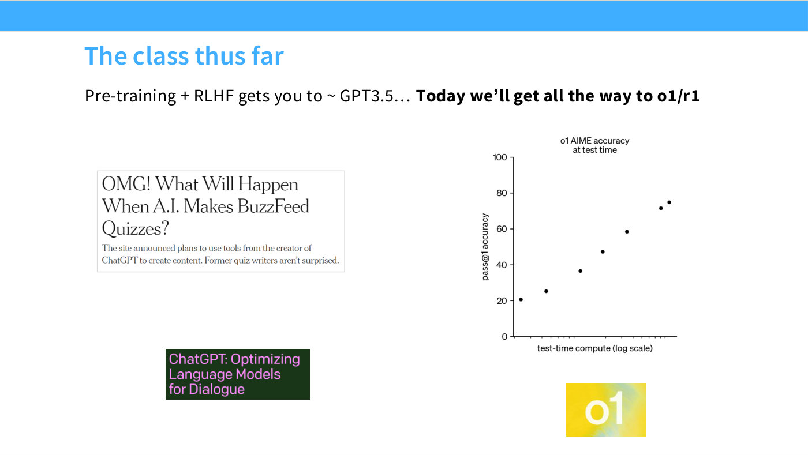
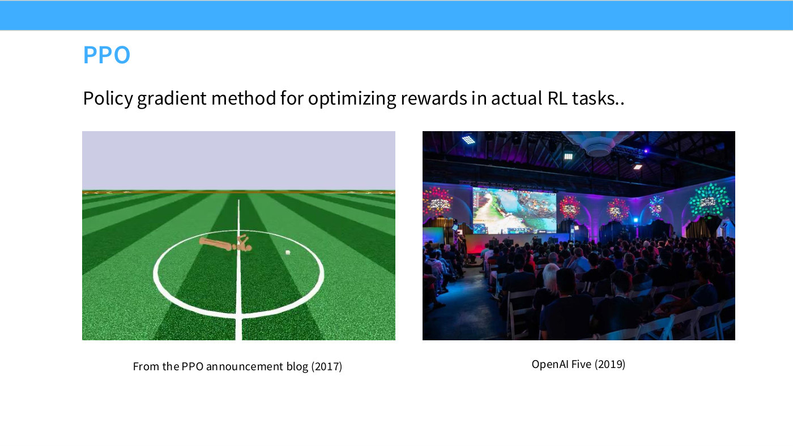
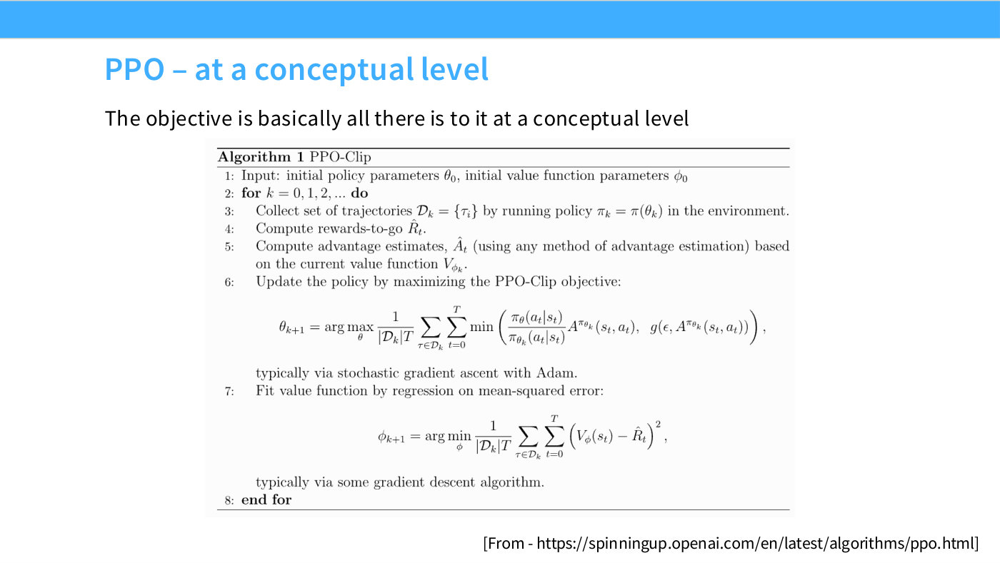
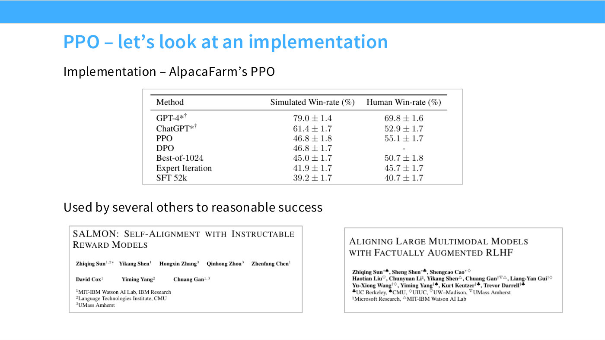
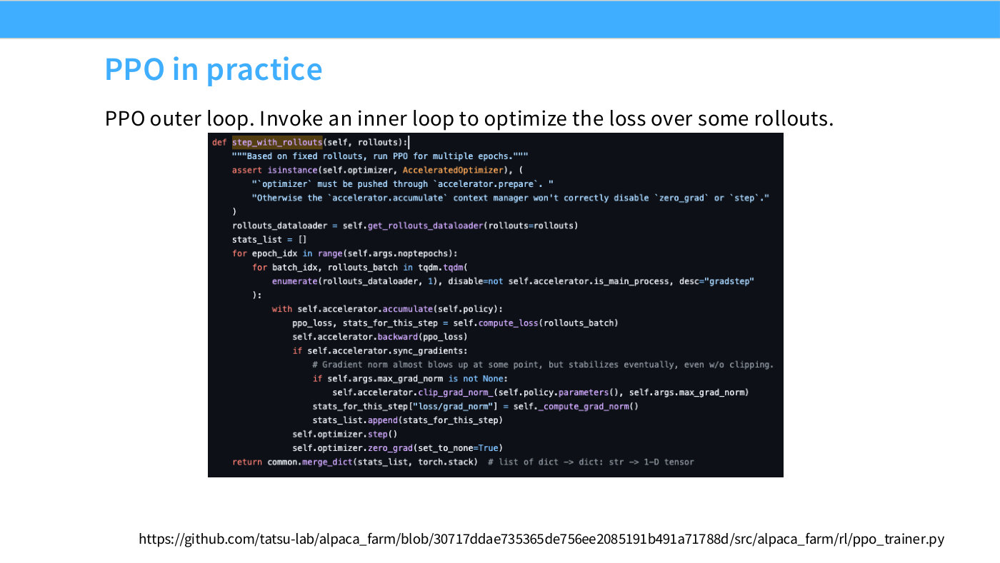
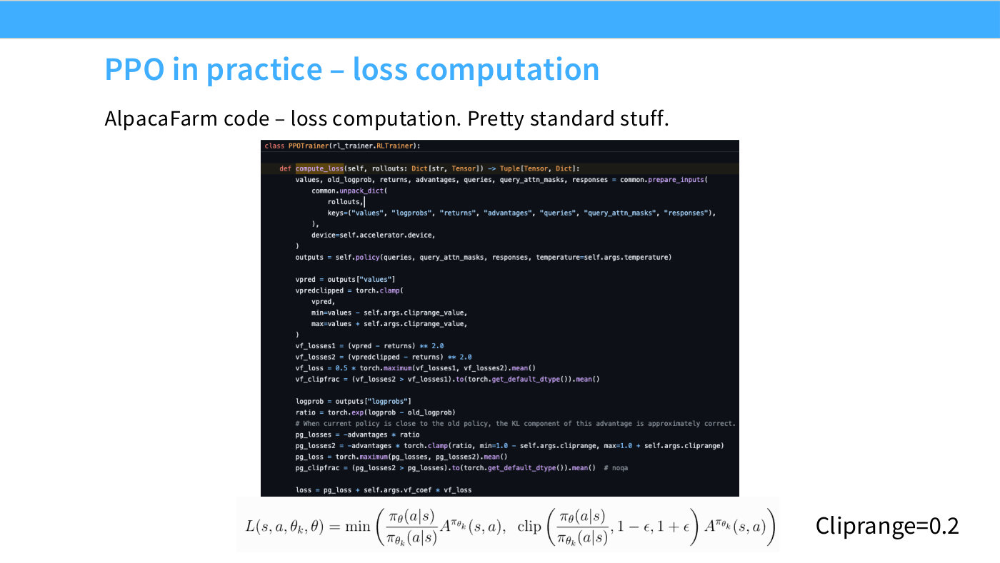
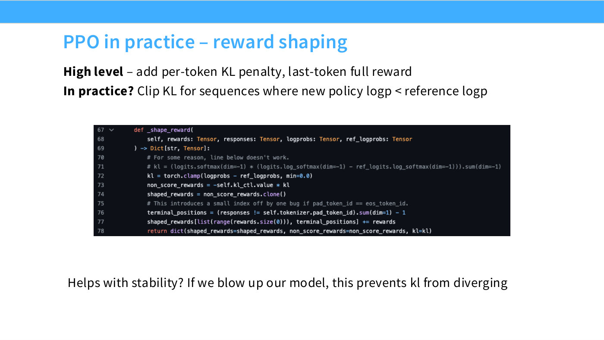
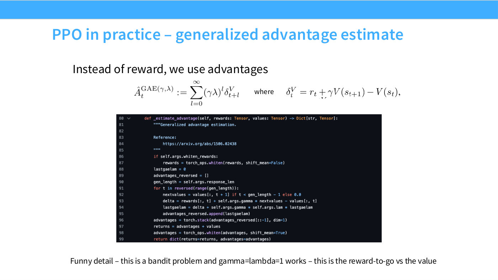

# Lecture 16 — Post-Training: RLVR (slide deck)

Full transcription of `lecture_16.pdf`, the deck for
[Lecture 16](https://www.youtube.com/watch?v=dIFAi87Ws4E). This is the eighth of
the CS336 lectures delivered from slides rather than from an executable Python
program; see [`executable-lectures`](../../wiki/executable-lectures.md) for the
distinction.

The companion files are the [edited transcript](../transcripts/16-post-training-rlvr.md)
and the [wiki page](../../wiki/16-post-training-rlvr.md).

## Sections

| Slides | Section |
| --- | --- |
| 1–4 | Framing: where the course has got to, and why RLVR expands the scope of RL |
| 5–9 | PPO in theory — the recap, and the idealization for language models |
| 10–15 | PPO in practice — an implementation read line by line: loss, rollouts, reward shaping, GAE |
| 16–17 | What PPO actually costs, and why the field wanted another algorithm |
| 18–21 | GRPO: the algorithm, its group-normalized advantage, and how well it works |
| 22–24 | Thinking carefully about the GRPO objective — the invalid baseline and the length bias |
| 25–38 | Case study 1 — DeepSeek-R1: R1-Zero as a controlled setting, the "aha moment" and its overstatement, the full R1 pipeline, distillation |
| 39–48 | Case study 2 — Kimi K1.5: long-CoT strategy, the reference-based objective, length control, RL infrastructure, scaling results |
| 49–54 | Case study 3 — Qwen 3: the four-stage pipeline, thinking-mode fusion, test-time scaling |
| 55–60 | Agentic RL — Kimi K2's midtraining, expert models, environment construction |
| 61 | Recap |

## Known gaps

These are properties of the deck, not of the transcription, and are recorded so a
reader does not mistake them for omissions here:

- **Slide 8** carries a hidden text-layer string ("You know you're in for a bad
  time if there's a blog post like this..") positioned exactly behind the visible
  caption. It never renders on the page, so it is **not** transcribed as slide
  content.
- **Slide 34's** boxed quote begins mid-sentence ("clear solutions…") — it is
  pasted that way from a longer paragraph in the source paper.
- **Slide 38's** MCTS quote box overflows the slide's bottom edge and is cut off
  mid-sentence ("…token generation presents an").
- **Slide 52's** pasted screenshot is cropped by the slide's own right edge:
  every line of that paragraph is cut off mid-word at the same margin. The
  transcription stops where the text actually stops and flags each cut point.
- **Slide 54's** ThinkFollow* row prints one merged value spanning both the
  Thinking and Non-Thinking sub-columns for stages 3 and 4. The table below
  repeats the merged value in both sub-columns and says so, rather than
  inventing two separate numbers.
- **Slides 43 and 45** contain typos printed on the slides themselves —
  "traning" for "training", and "from promt set" for "prompt". Both are
  transcribed as printed.
- **Slide 48's** twelve-panel ablation grid is hand-read off small dashed line
  charts; its values are explicitly marked approximate.

## Slide 1 — Lecture 16

Title slide. Text on the page:

"Lecture 16"
"Post-training 2"
"Reinforcement learning from verifiable rewards"
"CS336"

A thin blue bar runs across the very top of the slide and a thicker blue bar runs across the bottom, matching the deck's title-slide template. No figures on this page.

## Slide 2 — The class thus far



Body text: "Pre-training + RLHF gets you to ~ GPT3.5… **Today we'll get all the way to o1/r1**" (the second half is bold).

Below the text are two items on the left and a chart plus logo on the right.

**Left column:**
- A boxed news-article screenshot, transcribed verbatim: headline "OMG! What Will Happen When A.I. Makes BuzzFeed Quizzes?", subhead "The site announced plans to use tools from the creator of ChatGPT to create content. Former quiz writers aren't surprised."
- Below it, a dark green/teal card with pink/magenta text: "ChatGPT: Optimizing Language Models for Dialogue" — a citation/link card to OpenAI's ChatGPT announcement blog post, referenced by title only (no URL printed).

**Right column — a scatter chart titled "o1 AIME accuracy at test time."** Y-axis: "pass@1 accuracy," from 0 to 100 (gridlines/ticks at 0, 20, 40, 60, 80, 100). X-axis: "test-time compute (log scale)," with tick marks but no numeric labels. This is a single data series (plain black dots, no legend, no color-coding) of 7 points, monotonically increasing from left to right: approximately (leftmost) 21, then 25, 37, 47, 59, 72, and 75 (rightmost) on the pass@1-accuracy axis. Below the chart is a yellow square badge with the white text "o1" (the OpenAI o1 logo).

## Slide 3 — The goal – expand the scope and power of RL


Text: "With RLHF: we can't cleanly scale out due to overoptimization"

**Left figure — a line chart of reward-model score vs. KL distance (a reward-model-overoptimization plot).** Y-axis: "RM Score," from 0.0 to 1.4 in steps of 0.2. X-axis: "KL distance between RL tuned policy and initial policy," from 0 to 100 (gridlines at 0, 20, 40, 60, 80, 100). No citation is printed on the slide for this figure. The chart has two overlapping legends:
- A color legend "RM Size," from dark purple (smallest) through blue/teal to yellow-green (largest): 3M, 12M, 25M, 42M, 85M, 300M, 680M, 1.2B, 3B — 9 sizes.
- A linestyle legend "RM Type": "Proxy" = dashed, "Gold" = solid (thick, saturated color), "Gold (Fit)" = thin, lighter smoothed line.

So the figure contains up to 9 × 3 = 27 individual lines, grouped into 9 color families (one per RM size), each with a dashed Proxy curve, a solid Gold curve, and a thin Gold-(Fit) curve. All curves start at (0,0) and rise together at low KL. Then they diverge:
- The dashed "Proxy" curves (one per size) climb roughly linearly with KL distance and do not saturate — most run off the top of the plotted range (above RM Score 1.4) well before KL reaches 100, illustrating unbounded proxy-reward growth (overoptimization).
- The solid "Gold" curves (and their matching thin "Gold (Fit)" curves) rise, peak, and then decline: the smallest RM (3M, darkest purple) peaks earliest and lowest, around KL ≈ 15 at RM Score ≈ 0.6, then falls steadily to about 0.25 by KL ≈ 95. Progressively larger RMs (12M–85M, blue/teal shades) peak a bit later and higher (roughly RM Score 0.7–0.8 around KL 20–30) and decline more gradually, reaching roughly 0.5–0.65 by KL ≈ 90. The largest RMs (300M–3B, teal to yellow-green) peak highest of all, around RM Score 1.0–1.1 somewhere between KL 40 and 80, and decline only slightly by KL ≈ 90–100 — i.e., overoptimization (the gap between Proxy and Gold, and the eventual decline of Gold) is most severe for the smallest reward models and mildest for the largest.

**Right figure — a scatter/line chart with error bars, captioned "(a) Human preferences" (with a small blue square marker next to the caption).** Y-axis: "Eval win-rate on $p_\text{human}$," roughly 0.40 to 0.55+ (gridlines at 0.40, 0.45, 0.50, 0.55). X-axis: "Proxy reward, trained on $p_\text{human}$," roughly 0.5 to 1.75 (gridlines at 0.5, 1.0, 1.5). No values are negative. There are 3 series, each plotted with both vertical and horizontal error bars and connected by line segments in x-order; legend order (top to bottom) is Expert Iteration, Best-of-$n$, PPO, matching the colors below:
- **Expert Iteration (blue):** three points, approximately (0.80, 0.41), (0.90, 0.455), (1.08, 0.457) — win-rate rises sharply then flattens as proxy reward increases.
- **Best-of-$n$ (orange):** three points, approximately (1.02, 0.502), (1.30, 0.507), (1.65, 0.462) — roughly flat, then declining at the highest proxy reward.
- **PPO (green/teal):** three points, approximately (0.58, 0.443), (1.22, 0.552), (1.35, 0.512) — rises to a clear peak (the highest win-rate of all three series) then drops.

Below the two charts: "Can we work in domains where RL excels? Where we optimize *exactly* what we want," followed by three logos side by side:
- **AlphaGo** — a dark navy-blue square badge with a white circular Go-stone/network icon and the text "AlphaGo."
- **An unlabeled image of a 3D molecular structure** on a light cyan background: teal ribbon/helix shapes intertwined with magenta/pink ribbon-like strands, evocative of a protein or protein–nucleic-acid complex rendering. No caption or citation is printed with it, and no source is given on the slide.
- **"LEAN"** — a black outlined wordmark logo (referring to the Lean theorem-proving language/proof assistant).

## Slide 4 — The lecture today


Two numbered sections, each illustrated with paper title-card screenshots (no chart data; described in prose).

**"1. Core algorithms.."** — center text "PPO → GRPO" and, to its right, "GRPO variants," with two paper title cards behind/around the text:
- A DeepSeek paper ("deepseek" wordmark logo at top): title "DeepSeekMath: Pushing the Limits of Mathematical Reasoning in Open Language Models," authors "Zhihong Shao, Peiyi Wang, Qihao Zhu, Runxin Xu, Junxiao Song, Xiao Bi, Haowei Zhang, Mingchuan Zhang, Y.K. Li, Y. Wu, Daya Guo," affiliations "DeepSeek-AI, Tsinghua University, Peking University," with contact emails including "{zhihongshao,wangpeiyi,zhuqh,guodaya}@deepseek.com" and a GitHub link "https://github.com/deepseek-ai/DeepSeek-Math."
- A second paper card, partly overlapping the "GRPO variants" label: title "Understanding R1-Zero-Like Training: A Critical Perspective," authors "Zichen Liu, Changyu Chen, Wenjun Li, Penghui Qi, Tianyu Pang, Chao Du, Wee Sun Lee, Min Lin," affiliations "Sea AI Lab, National University of Singapore, Singapore Management University."

**"2. Case studies"** — three paper title cards side by side:
- DeepSeek-AI: title "DeepSeek-R1: Incentivizing Reasoning Capability in LLMs via Reinforcement Learning," author "DeepSeek-AI," contact "research@deepseek.com."
- A card headed by a small dark square "K" logo and a purple Qwen-team logo peeking in at its right edge: title "Kimi k1.5: Scaling Reinforcement Learning with LLMs," subtitle "Technical Report of Kimi k1.5," author "Kimi Team."
- A Qwen paper card (purple "Qwen" wordmark at top left, date "2025-05-14" at top right): title "Qwen3 Technical Report," author "Qwen Team," followed by three icon-and-link lines: a HuggingFace icon with "https://huggingface.co/Qwen," a ModelScope icon with "https://modelscope.cn/organization/qwen," and a GitHub icon with "https://github.com/QwenLM/Qwen3."

## Slide 5 — Recap: PPO in theory

Text slide, no photographic figures — only equations. Heading text: "A brief (and high level) intro to the various ideas in PPO.."

**Attempt 1: Policy gradients (variances are too high)**
$$\nabla_\theta E_{p_\theta}[R(z)] = E_{p_\theta}[R(z)\nabla_\theta \log p_\theta(z)]$$

**Attempt 2: TRPO (Linearize the problem around the current policy)**
$$\underset{\theta}{\text{maximize}} \quad \hat{\mathbb{E}}_t\left[\frac{\pi_\theta(a_t \mid s_t)}{\pi_{\theta_{\text{old}}}(a_t \mid s_t)}\hat{A}_t\right]$$
$$\text{subject to} \quad \hat{\mathbb{E}}_t[\mathrm{KL}[\pi_{\theta_{\text{old}}}(\cdot \mid s_t), \pi_\theta(\cdot \mid s_t)]] \leq \delta.$$

**Attempt 3: PPO (Clip the ratios at some eps)**
$$L(s,a,\theta_k,\theta) = \min\left(\frac{\pi_\theta(a|s)}{\pi_{\theta_k}(a|s)}A^{\pi_{\theta_k}}(s,a), \ \ \mathrm{clip}\left(\frac{\pi_\theta(a|s)}{\pi_{\theta_k}(a|s)}, 1-\epsilon, 1+\epsilon\right)A^{\pi_{\theta_k}}(s,a)\right)$$

## Slide 6 — PPO



Text: "Policy gradient method for optimizing rewards in actual RL tasks.."

Two photographs side by side:
- **Left photograph**, captioned "From the PPO announcement blog (2017)": a simulated 3D physics/robotics environment — a green-striped grass field (like a baseball/cricket pitch rendering) with a small tan humanoid or animal ragdoll figure lying/sprawled near the center, inside a white circular boundary line, with a small white square object nearby. This is a screenshot from OpenAI's original PPO blog post showing a MuJoCo-style simulated agent.
- **Right photograph**, captioned "OpenAI Five (2019)": a photo of a live event in a dark venue, showing a large audience seated facing a stage with big screens displaying a colorful map/game overlay (consistent with a Dota 2 match broadcast), with string/fairy lights decorating the ceiling.

## Slide 7 — PPO – at a conceptual level



Text: "The objective is basically all there is to it at a conceptual level"

**Figure — a screenshot of "Algorithm 1 PPO-Clip"** (a boxed pseudocode block, citation at bottom right: "[From - https://spinningup.openai.com/en/latest/algorithms/ppo.html]"), transcribed verbatim:

> **Algorithm 1** PPO-Clip
> 1: Input: initial policy parameters $\theta_0$, initial value function parameters $\phi_0$
> 2: **for** $k = 0,1,2,\dots$ **do**
> 3: Collect set of trajectories $\mathcal{D}_k = \{\tau_i\}$ by running policy $\pi_k = \pi(\theta_k)$ in the environment.
> 4: Compute rewards-to-go $\hat{R}_t$.
> 5: Compute advantage estimates, $\hat{A}_t$ (using any method of advantage estimation) based on the current value function $V_{\phi_k}$.
> 6: Update the policy by maximizing the PPO-Clip objective:
> $$\theta_{k+1} = \arg\max_\theta \frac{1}{|\mathcal{D}_k|T}\sum_{\tau \in \mathcal{D}_k}\sum_{t=0}^{T} \min\left(\frac{\pi_\theta(a_t|s_t)}{\pi_{\theta_k}(a_t|s_t)}A^{\pi_{\theta_k}}(s_t,a_t), \ \ g(\epsilon, A^{\pi_{\theta_k}}(s_t,a_t))\right),$$
> typically via stochastic gradient ascent with Adam.
> 7: Fit value function by regression on mean-squared error:
> $$\phi_{k+1} = \arg\min_\phi \frac{1}{|\mathcal{D}_k|T}\sum_{\tau \in \mathcal{D}_k}\sum_{t=0}^{T}\left(V_\phi(s_t) - \hat{R}_t\right)^2,$$
> typically via some gradient descent algorithm.
> 8: **end for**

## Slide 8 — PPO in practice


Text: "We need to look at a live implementation when talking about PPO"

**Figure — a fanned/overlapping stack of four screenshots of paper pages and a table,** arranged at various rotation angles like scattered photographs:
- The most prominent (front, centered, largest) screenshot is the title page of "Implementation Matters in Deep Policy Gradients: A Case Study on PPO and TRPO," by Logan Engstrom, Andrew Ilyas, Shibani Santurkar, Dimitris Tsipras, Firdaus Janoos, Larry Rudolph, and Aleksander Madry (affiliations MIT and Two Sigma; emails including "{engstrom,ilyas,shibani,tsipras,madry}@mit.edu" and "rudolph@csail.mit.edu, firdaus.janoos@twosigma.com"), showing its abstract beginning "We study the roots of algorithmic progress in deep policy gradient methods through a case study on two popular algorithms: Proximal Policy Optimization (PPO) and Trust Region Policy Optimization (TRPO). Specifically, we investigate the consequences of "code-level optimizations:" ..."
- Behind/above it, a partially visible table screenshot with columns including "...per," "Walker2d," "HalfCheetah" and numeric entries such as "-3000," "-1750," "1668.58," "2148.77 ±...66.023," a row ending "...9 ±", and further rows including "713 2404 ± 185" and "~5000," captioned (partially cut off) "following table collects the best..." — this is a benchmark results table from the same or a related PPO-implementation paper.
- Below/behind, another partially visible screenshot with text beginning "In recent years, reproducing PPO's results has become a challe[nge] ... performance of PPO in popular RL libraries in Atari and M[uJoCo]" next to a table with columns "RL Library," "GitHub Stars," "Benchmark Source" listing library names in blue links: "Baselines" (with sub-entries "ppo1 (da997d6)" and what appears to be "ppo2 (7bfbcf1)" — partly obscured), "Stable-Baselines3," "CleanRL" (7.5k stars), "Tianshou" (31k stars, "repo"), "Ray/RLlib" (9.7k stars, "docs (3)"), "SpinningUp" (1.2k stars, "paper (4)"), "ChainerRL" (393 stars, "paper (6)").
- A fourth, mostly-hidden screenshot peeks out at the right edge showing only a fragment of a table with a column header ending "...ion" and values "2404 ± 185" / "~5000" (this may be the same table as the second screenshot, shown twice at different crop/rotation).

This figure illustrates the slide's point via a pile of scholarship on PPO implementation details, not a single chart to be read for a specific value.

Note: the PDF's text layer for this page also contains a hidden text string, "You know you're in for a bad time if there's a blog post like this..," positioned exactly behind the visible caption "We need to look at a live implementation when talking about PPO." Only the latter is visible when the page is rendered; the former does not appear on the page as displayed and is not part of the visible slide content.

## Slide 9 — PPO – idealization (?) for language models


Text: "In the language model setting.." and, below the figure, "Pretty similar to the RL formulation. Actions operate over tokens, big dense reward at the very end operating on full sequence" (citation bottom right: "[From Zheng et al 2023]").

**Figure — a boxed flow diagram of the PPO training loop for language models**, with colored boxes connected by arrows carrying labeled quantities:
- A pink/red box "Policy LM $\pi^{\text{RL}}_{\theta_{\text{old}}}$" at bottom left, taking a "User Query" document icon as input and producing a sequence $(x,y) = (x, y_1, y_2, \dots, y_T)$, shown as a token strip split into a yellow "$x$" cell and a blue "$y_1,\dots,y_T$" cell.
- A "Divide" step (upward block arrow) turns that full sequence into single-timestep pairs $(s_t, a_t)$: $s_t = (x, y_1,\dots,y_{t-1})$ (yellow "$x$" + blue "$y_1,\dots,y_{t-1}$" cells) and $a_t = y_t$ (a single blue cell), boxed together in a dashed rectangle.
- These $(s_t,a_t)$ pairs feed into: a blue "SFT Model $\pi^{\text{SFT}}$" box (producing $\pi^{\text{SFT}}(a_t|s_t)$, which combines with the policy's own $\pi^{\text{RL}}_{\theta_{\text{old}}}(a_t|s_t)$ at a "KL div" circular node on the far left); a yellow "Reward Model $r(x,y)$" box (taking the full $(x,y)$, producing $r(x,y)$, which is combined at a $\oplus$ node into a per-token reward $r(s_t,a_t)$); and a green "Value Model $V_\phi(s_t)$" box (taking $s_t$, producing $V(s_t)$).
- $r(s_t,a_t)$ and $V(s_t)$ both feed into a large 3D-shaded box labeled **"GAE"** listing:
  - "Advantage Function": $\hat{A}(s_t,a_t) = \sum(\gamma\lambda)^l \delta_{t+l}$
  - "TD Error": $\delta_t = r(s_t,a_t) + \gamma V(s_{t+1}) - V(s_t)$
  - "Return": $\hat{R}_t = \hat{A}(s_t,a_t) + V(s_t)$
- The GAE box's outputs $\hat{A}(s_t,a_t)$ and $\hat{R}_t$ flow down (via a large open block arrow) into a cylindrical "Experience Buffer" store, which also separately collects $(s_t,a_t)$ and $\pi^{\text{RL}}_{\theta_{\text{old}}}(a_t|s_t)$ from the Policy LM box directly.
- On the right half of the diagram: from the Experience Buffer, $(s_t,a_t)$ feeds into a second pink "Policy LM $\pi^{\text{RL}}_\theta$" box, which outputs $\pi^{\text{RL}}_\phi(a_t|s_t)$ into a "$\div$" node that also takes $\pi^{\text{RL}}_{\phi_{\text{old}}}(a_t|s_t)$ from the buffer, computing the ratio $\pi^{\text{RL}}_\phi(a_t|s_t)/\pi^{\text{RL}}_{\phi_{\text{old}}}(a_t|s_t)$; this ratio and $\hat{A}(s_t,a_t)$ (from the buffer) feed into a light-blue circular node labeled **"PPO-clip Loss."**
- The same Policy LM box also takes pretraining data $x'$ (from a small database/cylinder icon labeled "Pretraining Data") and feeds a separate light-blue circular node labeled **"LM Loss."**
- Separately, $s_t$ (from the buffer) feeds a second green "Value Model $V_\phi(s_t)$" box, producing $V(s_t)$, which combines with $\hat{R}_t$ (from the buffer) at a light-blue circular node labeled **"MSE Loss."**

Overall the diagram shows one shared Policy LM appearing twice (old policy generating rollouts on the left, current policy being updated on the right) with the SFT model, reward model, value model, GAE computation, and an experience buffer connecting rollout collection to three loss terms: PPO-clip loss, LM loss (on pretraining data), and MSE loss (value-function regression).

## Slide 10 — PPO – let's look at an implementation



Text: "Implementation – AlpacaFarm's PPO"

**Table — AlpacaFarm PPO results**, transcribed verbatim:

| Method | Simulated Win-rate (%) | Human Win-rate (%) |
| --- | --- | --- |
| GPT-4*† | 79.0 ± 1.4 | 69.8 ± 1.6 |
| ChatGPT*† | 61.4 ± 1.7 | 52.9 ± 1.7 |
| PPO | 46.8 ± 1.8 | 55.1 ± 1.7 |
| DPO | 46.8 ± 1.7 | - |
| Best-of-1024 | 45.0 ± 1.7 | 50.7 ± 1.8 |
| Expert Iteration | 41.9 ± 1.7 | 45.7 ± 1.7 |
| SFT 52k | 39.2 ± 1.7 | 40.7 ± 1.7 |

Text below the table: "Used by several others to reasonable success"

Two paper title-card screenshots side by side:
- "SALMON: Self-Alignment with Instructable Reward Models," authors "Zhiqing Sun, Yikang Shen, Hongxin Zhang, Qinhong Zhou, Zhenfang Chen, David Cox, Yiming Yang, Chuang Gan," affiliations "MIT-IBM Watson AI Lab, IBM Research; Language Technologies Institute, CMU; UMass Amherst."
- "Aligning Large Multimodal Models with Factually Augmented RLHF," authors "Zhiqing Sun, Sheng Shen, Shengcao Cao, Haotian Liu, Chunyuan Li, Yikang Shen, Chuang Gan, Yu-Xiong Wang, Yiming Yang, Kurt Keutzer, Trevor Darrell," affiliations "UC Berkeley, CMU, UIUC, UW–Madison, UMass Amherst, Microsoft Research, MIT-IBM Watson AI Lab."

## Slide 11 — PPO in practice



Text: "PPO outer loop. Invoke an inner loop to optimize the loss over some rollouts." Source link at bottom: "https://github.com/tatsu-lab/alpaca_farm/blob/30717ddae735365de756ee2085191b491a71788d/src/alpaca_farm/rl/ppo_trainer.py"

**Figure — a code screenshot** (syntax-highlighted, dark theme), transcribed verbatim:

```python
def step_with_rollouts(self, rollouts):
    """Based on fixed rollouts, run PPO for multiple epochs."""
    assert isinstance(self.optimizer, AcceleratedOptimizer), (
        "`optimizer` must be pushed through `accelerator.prepare`. "
        "Otherwise the `accelerator.accumulate` context manager won't correctly disable `zero_grad` or `step`."
    )
    rollouts_dataloader = self.get_rollouts_dataloader(rollouts=rollouts)
    stats_list = []
    for epoch_idx in range(self.args.noptepochs):
        for batch_idx, rollouts_batch in tqdm.tqdm(
            enumerate(rollouts_dataloader, 1), disable=not self.accelerator.is_main_process, desc="gradstep"
        ):
            with self.accelerator.accumulate(self.policy):
                ppo_loss, stats_for_this_step = self.compute_loss(rollouts_batch)
                self.accelerator.backward(ppo_loss)
                if self.accelerator.sync_gradients:
                    # Gradient norm almost blows up at some point, but stabilizes eventually, even w/o clipping.
                    if self.args.max_grad_norm is not None:
                        self.accelerator.clip_grad_norm_(self.policy.parameters(), self.args.max_grad_norm)
                    stats_for_this_step["loss/grad_norm"] = self._compute_grad_norm()
                    stats_list.append(stats_for_this_step)
                self.optimizer.step()
                self.optimizer.zero_grad(set_to_none=True)
    return common.merge_dict(stats_list, torch.stack)  # list of dict -> dict: str -> 1-D tensor
```

## Slide 12 — PPO in practice – loss computation



Text: "AlpacaFarm code – loss computation. Pretty standard stuff."

**Figure — a code screenshot** (syntax-highlighted, dark theme), transcribed verbatim:

```python
class PPOTrainer(rl_trainer.RLTrainer):

    def compute_loss(self, rollouts: Dict[str, Tensor]) -> Tuple[Tensor, Dict]:
        values, old_logprob, returns, advantages, queries, query_attn_masks, responses = common.prepare_inputs(
            common.unpack_dict(
                rollouts,
                keys=("values", "logprobs", "returns", "advantages", "queries", "query_attn_masks", "responses"),
            ),
            device=self.accelerator.device,
        )
        outputs = self.policy(queries, query_attn_masks, responses, temperature=self.args.temperature)

        vpred = outputs["values"]
        vpredclipped = torch.clamp(
            vpred,
            min=values - self.args.cliprange_value,
            max=values + self.args.cliprange_value,
        )
        vf_losses1 = (vpred - returns) ** 2.0
        vf_losses2 = (vpredclipped - returns) ** 2.0
        vf_loss = 0.5 * torch.maximum(vf_losses1, vf_losses2).mean()
        vf_clipfrac = (vf_losses2 > vf_losses1).to(torch.get_default_dtype()).mean()

        logprob = outputs["logprobs"]
        ratio = torch.exp(logprob - old_logprob)
        # When current policy is close to the old policy, the KL component of this advantage is approximately correct.
        pg_losses = -advantages * ratio
        pg_losses2 = -advantages * torch.clamp(ratio, min=1.0 - self.args.cliprange, max=1.0 + self.args.cliprange)
        pg_loss = torch.maximum(pg_losses, pg_losses2).mean()
        pg_clipfrac = (pg_losses2 > pg_losses).to(torch.get_default_dtype()).mean()  # noqa

        loss = pg_loss + self.args.vf_coef * vf_loss
```

Below the code, the PPO-clip loss equation is repeated:
$$L(s,a,\theta_k,\theta) = \min\left(\frac{\pi_\theta(a|s)}{\pi_{\theta_k}(a|s)}A^{\pi_{\theta_k}}(s,a), \ \ \mathrm{clip}\left(\frac{\pi_\theta(a|s)}{\pi_{\theta_k}(a|s)}, 1-\epsilon, 1+\epsilon\right)A^{\pi_{\theta_k}}(s,a)\right)$$

To the right of the equation: "Cliprange=0.2"

## Slide 13 — PPO in practice – rollouts.


No other body text on this slide besides the title.

**Figure — two side-by-side code screenshots** (syntax-highlighted, dark theme, continuous line numbers ~98–196 across both panels) showing a `rollout` method. Transcribed verbatim (left panel then right panel, in line-number order; the excerpt begins mid-docstring):

```python
        Returns:
            Dictionary with keys
                'queries', 'query_attn_masks', 'responses',
                'logprobs', 'ref_logprobs', 'values',
                'rewards', 'non_score_rewards', 'shaped_rewards'.
        """
        # Give up dropout throughout.
        self.policy.eval()
        self._make_fsdp_happy()
        # `keep_fp32_wrapper` retains the autocast wrapper of model.forward created by accelerate:
        #  recall one sets mixed precision options with accelerator.
        # The precise value of this arg doesn't matter here, since we use the unwrapped model only for respond.
        # Generally, try to use the wrapped model as much as you can, since it's got the autocast/cast-back wrapper[s]
        unwrapped_policy = self.accelerator.unwrap_model(self.policy, keep_fp32_wrapper=True)

        self.ref_policy.eval()
        self.reward_model.eval()

        rollouts = []
        for batch_idx, batch in tqdm.tqdm(
            enumerate(queries_data),
            disable=not self.accelerator.is_main_process,
            desc="rollout",
        ):
            # Sample rollouts.
            queries, query_attn_masks = common.unpack_dict(
                common.prepare_inputs(batch, device=self.accelerator.device),
                keys=("queries", "query_attn_masks"),
            )
            respond_outputs = unwrapped_policy.respond(queries, query_attn_masks, temperature=self.args.temperature)
            (responses,) = common.unpack_dict(respond_outputs, ("responses",))

            # Evaluate logprobs of the samples.
            rollouts_batch = {"queries": queries, "query_attn_masks": query_attn_masks, "responses": responses}
            policy_outputs = self.policy(**rollouts_batch, temperature=self.args.temperature)
            ref_policy_outputs = self.ref_policy(**rollouts_batch, temperature=self.args.temperature)
            policy_outputs = common.unpack_dict(
                policy_outputs, keys=("logprobs", "values", "entropies"), return_type=dict
            )
            ref_policy_outputs = common.unpack_dict(
                ref_policy_outputs, keys=("logprobs", "entropies"), return_type=dict
            )
            rollouts_batch.update(policy_outputs)
            rollouts_batch.update({f"ref_{key}": value for key, value in ref_policy_outputs.items()})

            # Evaluate reward of the samples.
            text_queries, text_responses = tuple(
                self.tokenizer.batch_decode(tensor, skip_special_tokens=True, clean_up_tokenization_spaces=True)
                for tensor in (queries, responses)
            )
            del queries, responses  # Prevent mistakes.

            # We retokenizer, since policy and reward model might not have the same tokenizer.
            # TODO(lxuechen): Avoid retokenization when policy and reward tokenizer are the same.
            text_sequences = [q + r for q, r in utils.zip_(text_queries, text_responses)]
            # TODO(lxuechen): This response retokenization has issues with OPT, since the tokenizer always prepend[s]
            #  <bos_token>. But the issue is local to post_reward, which isn't an issue if we don't penalize.
            sequences, responses = tuple(
                self.tokenizer(text, return_tensors="pt", padding=True, truncation=True)
                for text in (text_sequences, text_responses)
            )
            sequences, responses = common.prepare_inputs((sequences, responses), device=self.accelerator.device)

            reward_outputs = self.reward_model(**sequences)
            reward_outputs = self.post_reward(reward_outputs, responses.input_ids)
            rollouts_batch.update(reward_outputs)

            # Shape reward with KL penalty.
            shape_reward_outputs = self._shape_reward(
                rewards=rollouts_batch["rewards"],
                responses=rollouts_batch["responses"],
                logprobs=rollouts_batch["logprobs"],
                ref_logprobs=rollouts_batch["ref_logprobs"],
            )
            rollouts_batch.update(shape_reward_outputs)

            rollouts_batch_cpu = {key: value.cpu() for key, value in rollouts_batch.items()}
            rollouts.append(rollouts_batch_cpu)

        # Items in dict need to be of same shape.
        rollouts = common.merge_dict(rollouts, merge_fn=torch.cat)
        # Estimating advantages outside the loop gives more samples for reward normalization.
        advantages = self._estimate_advantage(
            rewards=rollouts["shaped_rewards"].to(self.accelerator.device),
            values=rollouts["values"].to(self.accelerator.device),
        )
        advantages = {key: value.cpu() for key, value in advantages.items()}
        return {**rollouts, **advantages}
```

## Slide 14 — PPO in practice – reward shaping



Text:
- "**High level** – add per-token KL penalty, last-token full reward"
- "**In practice?** Clip KL for sequences where new policy logp < reference logp"

**Figure — a code screenshot** (syntax-highlighted, dark theme), transcribed verbatim:

```python
def _shape_reward(
    self, rewards: Tensor, responses: Tensor, logprobs: Tensor, ref_logprobs: Tensor
) -> Dict[str, Tensor]:
    # For some reason, line below doesn't work.
    # kl = (logits.softmax(dim=-1) * (logits.log_softmax(dim=-1) - ref_logits.log_softmax(dim=-1))).sum(dim=-1)
    kl = torch.clamp(logprobs - ref_logprobs, min=0.0)
    non_score_rewards = -self.kl_ctl.value * kl
    shaped_rewards = non_score_rewards.clone()
    # This introduces a small index off by one bug if pad_token_id == eos_token_id.
    terminal_positions = (responses != self.tokenizer.pad_token_id).sum(dim=1) - 1
    shaped_rewards[list(range(rewards.size(0))), terminal_positions] += rewards
    return dict(shaped_rewards=shaped_rewards, non_score_rewards=non_score_rewards, kl=kl)
```

Below the figure: "Helps with stability? If we blow up our model, this prevents kl from diverging"

## Slide 15 — PPO in practice – generalized advantage estimate



Text: "Instead of reward, we use advantages"

$$\hat{A}_t^{\mathrm{GAE}(\gamma,\lambda)} := \sum_{l=0}^{\infty}(\gamma\lambda)^l \delta_{t+l}^V \quad \text{where} \quad \delta_t^V = r_t + \gamma V(s_{t+1}) - V(s_t)$$

**Figure — a code screenshot** (syntax-highlighted, dark theme), transcribed verbatim:

```python
def _estimate_advantage(self, rewards: Tensor, values: Tensor) -> Dict[str, Tensor]:
    """Generalized advantage estimation.

    Reference:
        https://arxiv.org/abs/1506.02438
    """
    if self.args.whiten_rewards:
        rewards = torch_ops.whiten(rewards, shift_mean=False)
    lastgaelam = 0
    advantages_reversed = []
    gen_length = self.args.response_len
    for t in reversed(range(gen_length)):
        nextvalues = values[:, t + 1] if t < gen_length - 1 else 0.0
        delta = rewards[:, t] + self.args.gamma * nextvalues - values[:, t]
        lastgaelam = delta + self.args.gamma * self.args.lam * lastgaelam
        advantages_reversed.append(lastgaelam)
    advantages = torch.stack(advantages_reversed[::-1], dim=1)
    returns = advantages + values
    advantages = torch_ops.whiten(advantages, shift_mean=True)
    return dict(returns=returns, advantages=advantages)
```

Below the figure: "Funny detail – this is a bandit problem and gamma=lambda=1 works – this is the reward-to-go vs the value"
## Slide 16 — What do you expect to see in PPO?

Three side-by-side line-chart panels, each with its own header text above it: "Increasing overall rewards", "Incl. reward model", "Negative KL rewards". Below the charts: "This is a bandit setting, you expect reasonable training curves"

Each panel is a Weights & Biases-style plot with a small metric-name title printed above its axes and a two-line legend giving the same two run names in every panel:
- "rlhf_llama_7b_regen_v7_3ep_v5 Run set 2" (blue)
- "rlhf_llama_7b_regen_v7_3ep_v6 Run set 2" (green)

That is two data series per panel (not three — the small metric-name text above each panel is a chart title, not a series).

**Panel 1 — "objective/kl_sum_seq"**: y-axis unlabeled, gridlines at 20, 40, 60; x-axis "Step", gridlines at 100, 200, 300, data extending to roughly step 380.
- Blue: rises quickly to about 15 by step ~50, then stays roughly flat and noisy in the 10–20 range for the rest of the run.
- Green: climbs steadily from 0 to about 55–60 by step ~150–200, then plateaus, oscillating noisily in the 45–60 range through step 380.

**Panel 2 — "objective/rewards"**: y-axis 0, 1, 2, 3, 4; x-axis "Step", gridlines at 100, 200, 300, extending to roughly step 380.
- Blue: rises from 0 to about 3 by step ~50, then keeps climbing slowly, ending around 3.3–3.5 by step 380.
- Green: tracks blue closely at first, then pulls ahead, ending near 4 by step 380 — above blue for most of the run.

**Panel 3 — "objective/non_score_rewards"**: y-axis 0, -0.5, -1, -1.5, -2 (all values zero or negative — note the negative range); x-axis "Step", gridlines at 100, 200, 300, extending to roughly step 380.
- Blue: drops sharply from 0 to about -1.7 to -2 by step ~50–70, dips again to about -2 around step ~150–180, then partially recovers to roughly -1 to -1.2 by step 380; visibly the more volatile of the two series.
- Green: drops from 0 to about -0.6 to -0.8 by step ~50, then stays comparatively flat, oscillating between about -0.5 and -1 for the remainder, ending around -0.8 to -1.

## Slide 17 — Why do we need yet another RL algorithm..?

**Why not PPO?**
- In practice, complicated implementation
- Value model (memory hungry, involves additional tuning for training)

**Why not DPO?**
- Data not inherently pairwise (or in the form of Bradley-Terry comparisons)
- Offline (though could be made online by iterating)

## Slide 18 — New kid on the block: GRPO

**What's GRPO?**
- Start with PPO (many parts are similar)
- Remove the value function / advantage computation
- Calculate the advantage as "z-score within group"

**Figure — a boxed screenshot from the GRPO paper (DeepSeekMath)**, transcribed verbatim:

"**Group Relative Policy Optimization**  In order to save the training costs of RL, we adopt Group Relative Policy Optimization (GRPO) (Shao et al., 2024), which foregoes the critic model that is typically the same size as the policy model, and estimates the baseline from group scores instead. Specifically, for each question $q$, GRPO samples a group of outputs $\{o_1, o_2, \cdots, o_G\}$ from the old policy $\pi_{\theta_{old}}$ and then optimizes the policy model $\pi_\theta$ by maximizing the following objective:"

$$\mathcal{J}_{GRPO}(\theta) = \mathbb{E}\big[q \sim P(Q), \{o_i\}_{i=1}^G \sim \pi_{\theta_{old}}(O|q)\big]$$

$$\frac{1}{G}\sum_{i=1}^G \left( \min\left(\frac{\pi_\theta(o_i|q)}{\pi_{\theta_{old}}(o_i|q)}A_i,\; \text{clip}\left(\frac{\pi_\theta(o_i|q)}{\pi_{\theta_{old}}(o_i|q)}, 1-\varepsilon, 1+\varepsilon\right)A_i\right) - \beta\,\mathbb{D}_{KL}\big(\pi_\theta\|\pi_{ref}\big)\right), \qquad (1)$$

$$\mathbb{D}_{KL}\big(\pi_\theta\|\pi_{ref}\big) = \frac{\pi_{ref}(o_i|q)}{\pi_\theta(o_i|q)} - \log\frac{\pi_{ref}(o_i|q)}{\pi_\theta(o_i|q)} - 1, \qquad (2)$$

"where $\varepsilon$ and $\beta$ are hyper-parameters, and $A_i$ is the advantage, computed using a group of rewards $\{r_1, r_2, \ldots, r_G\}$ corresponding to the outputs within each group:"

$$A_i = \frac{r_i - mean(\{r_1,r_2,\cdots,r_G\})}{std(\{r_1,r_2,\cdots,r_G\})}. \qquad (3)$$

To the right of this box, a smaller box labeled "(PPO for reference)" shows the standard PPO clipped surrogate objective for comparison:

$$\min\left(\frac{\pi_\theta(a|s)}{\pi_{\theta_k}(a|s)}A^{\pi_{\theta_k}}(s,a),\; \text{clip}\left(\frac{\pi_\theta(a|s)}{\pi_{\theta_k}(a|s)}, 1-\epsilon, 1+\epsilon\right)A^{\pi_{\theta_k}}(s,a)\right)$$

Bottom caption: "In the *online* case (rollout+immediate update), this is just policy gradient with group normalized rewards"

## Slide 19 — GRPO is very simple (thanks to lack of value function..)

**You can** (and people do) write tiny GRPO implementations
- Compute reward for each rollout
- Mean/Var normalization per group
- Compute KL term
- Gradient updates on the loss

"We can walk through this example from https://github.com/McGill-NLP/nano-aha-moment"

**Figure — a code screenshot** of a Python function `compute_pg_loss`, reproduced verbatim:

```python
def compute_pg_loss(
    policy_model: Union[DeepSpeedEngine, PreTrainedModel],
    reference_model: Union[DeepSpeedEngine, PreTrainedModel],
    batch: Dict[str, torch.Tensor],
    total_response_len: int,
) -> Tuple[torch.Tensor, Dict[str, float]]:
    """
    Compute the policy gradient loss with KL penalty between policy and reference models.

    This function:
    1. Computes log probabilities for both policy and reference models
    2. Calculates KL divergence penalty between the models
    3. Computes policy gradient loss using advantages
    4. Combines the losses with KL coefficient

    Args:
        policy_model: The model being trained
        reference_model: The reference model for KL penalty calculation
        batch: Dictionary containing:
            - input_ids: Tensor of shape [batch_size, seq_len]
            - attention_mask: Tensor of shape [batch_size, seq_len]
            - labels: Tensor of shape [batch_size, seq_len] with -100 for ignored positions
            - advantages: Tensor of shape [batch_size, seq_len]

    Returns:
        Tuple containing:
            - loss: Combined policy gradient and KL penalty loss (scalar tensor)
            - metrics: Dictionary with detailed loss components:
                - policy_loss: Pure policy gradient loss
                - kl_penalty: KL divergence penalty
                - entropy: Policy entropy
    """
    input_ids = batch["input_ids"]  # [batch_size, seq_len]
    attention_mask = batch["attention_mask"]  # [batch_size, seq_len]
    labels = batch["labels"]  # [batch_size, seq_len]
    advantages = batch["advantages"]  # [batch_size, seq_len]

    model_inputs = {
        "input_ids": input_ids,
        "attention_mask": attention_mask,
        "labels": labels,
    }

    labels_mask = (labels[..., 1:] != -100).float()  # [batch_size, seq_len-1]

    with torch.no_grad():
        ref_logps = compute_token_log_probs(
            reference_model, model_inputs, TEMPERATURE
        )  # [batch_size, seq_len-1]

    logps = compute_token_log_probs(policy_model, model_inputs, TEMPERATURE)  # [batch_size, seq_len-1]

    kl_penalty = torch.exp(ref_logps - logps) - (ref_logps - logps) - 1  # [batch_size, seq_len-1]
    kl_penalty = kl_penalty * labels_mask  # [batch_size, seq_len-1]

    entropy = -logps.sum() / labels_mask.sum()  # scalar

    policy_loss = -logps * advantages[..., 1:]  # [batch_size, seq_len-1]
    policy_loss = policy_loss * labels_mask  # [batch_size, seq_len-1]

    loss = (policy_loss + KL_COEFFICIENT * kl_penalty).sum() / total_response_len  # scalar
```

## Slide 20 — Advantage computation is also very simple..

"Basically just the 'vanilla' GRPO setup."

"Main difference here is just the 1e-4 stability factor in the std calculation"

**Figure — a code screenshot**, reproduced verbatim:

```python
assert len(all_generations) == len(all_finish_reasons)
assert len(all_generations) == len(samples) * GENERATIONS_PER_SAMPLE

# Process responses and calculate rewards
groups = [
    list(range(i, i + GENERATIONS_PER_SAMPLE))
    for i in range(0, len(all_generations), GENERATIONS_PER_SAMPLE)
]  # example: [[0, 1, 2], [3, 4, 5], [6, 7, 8]]

all_query_token_ids, all_responses_token_ids, all_advantages = [], [], []

stats = {
    "response_lengths": [],
    "rewards": [],
    "non_stop_rate": [],
}

for sample, group_indices in zip(samples, groups):
    finish_reasons = [all_finish_reasons[i] for i in group_indices]
    response_token_ids = [all_generations[i] for i in group_indices]
    responses = tokenizer.batch_decode(response_token_ids, skip_special_tokens=False)

    rewards_and_metrics = [compute_reward(resp, sample) for resp in responses]
    rewards, reward_metrics = zip(*rewards_and_metrics)

    rewards = np.array(rewards)  # [group_size]
    response_advantages = (rewards - rewards.mean()) / (rewards.std() + 1e-4)

    advantages = [
        [resp_adv] * len(resp)
        for resp_adv, resp in zip(response_advantages, response_token_ids)
    ]

    all_query_token_ids.extend([sample["input_ids"]] * GENERATIONS_PER_SAMPLE)
    all_responses_token_ids.extend(response_token_ids)
    all_advantages.extend(advantages)

    stats["rewards"].extend(rewards)
    stats["non_stop_rate"].extend([fr != "stop" for fr in finish_reasons])
    stats["response_lengths"].extend([len(ids) for ids in response_token_ids])
    for rm in reward_metrics:
        for k, v in rm.items():
            stats.setdefault(f"reward_metrics/{k}", []).append(v)

episodes = {
    "all_query_token_ids": all_query_token_ids,
    "all_response_token_ids": all_responses_token_ids,
    "all_advantages": all_advantages,
}

return episodes, stats
```

## Slide 21 — How well does it work?

**GRPO from the original paper**

**Figure — two line charts side by side**, titled "GSM8K" (left) and "MATH" (right), reproduced from the GRPO/DeepSeekMath paper. A single legend above both panels applies to both: RFT (purple), Online RFT (green), GRPO+OS (orange), GRPO+PS (blue) — four data series total, and the legend order matches this description.

**GSM8K panel**: y-axis "Acc (%)", gridlines at 56, 58, 60, 62, 64, 66; x-axis "Steps", gridlines at 0, 2000, 4000, 6000, 8000 (data runs to roughly step 8800).
- RFT (purple): rises from about 56 to about 60 by step 2000, then plateaus, oscillating narrowly between about 59 and 61 for the rest of the run, ending near 60.
- Online RFT (green): rises similarly at first, then continues climbing with more volatility, reaching about 62–64 by step 7000–8000, ending near 62.
- GRPO+OS (orange): climbs higher than green, reaching about 64 by step 4000–5000 and staying around 63–64 through the end, ending near 64.
- GRPO+PS (blue): climbs fastest and highest, reaching about 65–66 by step 5000–8000 with peaks near 65.7 around step 5000 and step 7500, ending near 65.

**MATH panel**: y-axis "Acc (%)", gridlines at 27, 28, 29, 30; x-axis "Steps", gridlines at 0, 2000, 4000, 6000, 8000 (data runs to roughly step 8800).
- RFT (purple): rises from about 26.5 to about 27.5–28.5, with a spike to about 28.8 near step 3500, then falls back and oscillates around 27–28.5 for the rest, ending near 27.8.
- Online RFT (green): rises with visible volatility, reaching about 29.5 by step 7000–8000, ending near 29.2.
- GRPO+OS (orange): climbs to about 30–30.5 by step 4000–7000, oscillating around 29.5–30.5, ending near 29.3.
- GRPO+PS (blue): climbs highest, peaking around 30.6–30.7 near step 4000–6000, ending near 29.7.

Figure caption printed on the slide: "Figure 5 | Performance of the DeepSeekMath-Instruct 1.3B model, which was further trained using various methods, on two benchmarks."

Below the figure: "Outperforms RFT (reinforcing correct answers), with some gains from process supervision"

"We will get back to this later.."

## Slide 22 — Thinking carefully about the GRPO objective..

"The key difference in GRPO vs PPO: the advantage"

$$A_i = \frac{r_i - mean(\{r_1,r_2,\cdots,r_G\})}{std(\{r_1,r_2,\cdots,r_G\})}.$$

"Is this good? A minor RL detour.."

Left-margin annotation: "**Baselining**: We can subtract any state-dependent term from our rewards"

**Figure — a boxed screenshot from Sutton & Barto**, section 13.4 "REINFORCE with Baseline", transcribed verbatim:

"**13.4 REINFORCE with Baseline**

The policy gradient theorem (13.5) can be generalized to include a comparison of the action value to an arbitrary *baseline* $b(s)$:"

$$\nabla J(\theta) \propto \sum_s \mu(s)\sum_a \big(q_\pi(s,a) - b(s)\big)\nabla\pi(a|s,\theta). \qquad (13.10)$$

"The baseline can be any function, even a random variable, as long as it does not vary with $a$; the equation remains valid because the subtracted quantity is zero:"

$$\sum_a b(s)\nabla\pi(a|s,\theta) \;=\; b(s)\nabla\sum_a \pi(a|s,\theta) \;=\; b(s)\nabla 1 \;=\; 0.$$

"The policy gradient theorem with baseline (13.10) can be used to derive an update rule using similar steps as in the previous section. The update rule that we end up with is a new version of REINFORCE that includes a general baseline:"

$$\theta_{t+1} \doteq \theta_t + \alpha\big(G_t - b(S_t)\big)\frac{\nabla\pi(A_t|S_t,\theta_t)}{\pi(A_t|S_t,\theta_t)}. \qquad (13.11)$$

Bottom-right citation: "Sutton and Barto"

## Slide 23 — GRPO doesn't use a "valid" baseline

"The division by the stdev term is not a valid baseline that preserves unbiasedness."

"What is an unbiased-gradient version of GRPO?"

**Figure — two boxed equation panels stacked at left, and a scatter/line plot at right.**

Box 1, titled "GRPO":

$$\frac{1}{G}\sum_{i=1}^G \frac{1}{|o_i|}\sum_{t=1}^{|o_i|} \left\{\min\left[\frac{\pi_\theta(o_{i,t}|q,o_{i,<t})}{\pi_{\theta_{old}}(o_{i,t}|q,o_{i,<t})}\hat{A}_{i,t},\; \text{clip}\left(\frac{\pi_\theta(o_{i,t}|q,o_{i,<t})}{\pi_{\theta_{old}}(o_{i,t}|q,o_{i,<t})}, 1-\epsilon, 1+\epsilon\right)\hat{A}_{i,t}\right]\right\},$$

"where $\hat{A}_{i,t} = \dfrac{R(q,o_i) - mean(\{R(q,o_1),\ldots,R(q,o_G)\})}{std(\{R(q,o_1),\ldots,R(q,o_G)\})}$."

On the slide, the $\frac{1}{|o_i|}$ per-token-averaging factor and the $std(\cdot)$ term in the denominator of $\hat{A}_{i,t}$ are both highlighted in red, marking them as the two terms under scrutiny.

Box 2, titled "Dr. GRPO — GRPO Done Right (without bias)":

$$\frac{1}{G}\sum_{i=1}^G \sum_{t=1}^{|o_i|} \left\{\min\left[\frac{\pi_\theta(o_{i,t}|q,o_{i,<t})}{\pi_{\theta_{old}}(o_{i,t}|q,o_{i,<t})}\hat{A}_{i,t},\; \text{clip}\left(\frac{\pi_\theta(o_{i,t}|q,o_{i,<t})}{\pi_{\theta_{old}}(o_{i,t}|q,o_{i,<t})}, 1-\epsilon, 1+\epsilon\right)\hat{A}_{i,t}\right]\right\},$$

"where $\hat{A}_{i,t} = R(q,o_i) - mean(\{R(q,o_1),\ldots,R(q,o_G)\})$."

Relative to GRPO, Dr. GRPO drops both the $\frac{1}{|o_i|}$ per-token averaging factor in the outer sum and the $std(\cdot)$ normalization in the advantage.

Below the boxes: "Also note the modification on the length-normalizer term on the left.."

Bottom-right citation: "Liu et al 2025. (this gets pretty close to reinforce w/ leave-one-out)"

**Right-hand figure — scatter/line plot titled "Token Efficiency".** Y-axis "Reward", gridlines at 0.0, 0.1, 0.2, 0.3, 0.4, 0.5, 0.6. X-axis "Output length", gridlines at 400, 600, 800, 1000 (data starts below 400). Two data series, each drawn as a dense scatter of small faint points tracing a rising curve, with one larger, bold marker on each curve (this is not a third series, just a highlighted endpoint):
- Dr. GRPO (dark red diamonds): the faint scatter rises steeply from around output length 300 (reward ≈ 0.05) up to its plateau near reward ≈ 0.6 by about output length 500–550; the single bold dark-red diamond marker sits at approximately (520, 0.6).
- GRPO (gray dots): the faint scatter also rises from around output length 350, but the curve is shifted right and flatter, reaching the same reward plateau (≈0.6) only around output length 900–1000; the single bold gray circle marker sits at approximately (1000, 0.6).

A dark teal arrow labeled "RL training progress" points up and to the right beneath/between the two curves, indicating the direction of training progress along each curve — this is an annotation, not a data series.

## Slide 24 — Length biases of GRPO

"What do these terms do? **Stdev** – upweights too easy or hard questions."

"**Length normalization:**"

**Figure — a boxed paper excerpt**, transcribed verbatim:

"Response-level length bias: This arises from dividing by $|o_i|$. For positive advantages ($\hat{A}_{i,t} > 0$, indicating a correct response), this bias results in greater gradient updates for shorter responses, leading the policy to favor brevity in correct answers. Conversely, for negative advantages ($\hat{A}_{i,t} < 0$, indicating an incorrect response), longer responses are penalized less due to their larger $|o_i|$, causing the policy to prefer lengthier responses among incorrect ones."

"What does the fix do?"

**Figure — a five-panel chart** arranged as two rows (row label "Training dynamics" for the top row, "Evaluation results" for the bottom row), all panels sharing the x-axis "Policy iteration step" (gridlines at 0, 50, 100, 150). Every panel has the same two data series (legend given once, top right): Dr. GRPO (Ours) in dark red, and GRPO (Shao et al., 2024) in gray — two series total per panel.

1. **"Reward"**: y-axis gridlines at 0.2, 0.4, 0.6. Both series rise together from about 0.1 at step 0 to about 0.55–0.6 by step 50, nearly overlapping; from step 50–150 Dr. GRPO (dark red) edges slightly above GRPO (gray), ending near 0.63 vs. about 0.60.

2. **"Output Length"**: y-axis gridlines at 400, 600, 800, 1000. GRPO (gray) rises roughly linearly from about 300 at step 0 to about 1050–1100 by step 150. Dr. GRPO (dark red) rises from about 300 to about 500–520 by step 30–40, then plateaus, staying roughly flat around 500–530 through step 150.

3. **"Output Length (Correct)"**: y-axis gridlines at 200, 300, 400. Both series rise together from about 150 at step 0 to about 380–390 by step 30; GRPO (gray) runs slightly above Dr. GRPO (dark red) through the middle of training (around step 50–100, gray near 420–440 vs. red near 390–400), then the two reconverge by step 150, both ending around 430–440.

4. **"Output Length (Incorrect)"**: y-axis gridlines at 1.0k, 1.4k, 1.8k. GRPO (gray) rises steadily from about 1.0k at step 0 to about 1.9k by step 150. Dr. GRPO (dark red) rises briefly to a small peak near 1.25k–1.3k around step 30, then declines, ending around 0.95k–1.0k by step 150 — flat to slightly down overall.

5. **"Average Benchmark Score (%)"**: y-axis gridlines at 10, 20. Both series rise together from about 2% at step 0 to about 20% by step 30–50, then track closely with minor oscillation for the rest of the run, both ending around 22–23% with neither series consistently above the other.

## Slide 25 — Case studies

"Let's look at a few representative open models with RLVR."

Three paper title-card images are stacked vertically on the left, each paired with descriptive text to its right.

- **DeepSeek logo above a paper title card**: "DeepSeek-R1: Incentivizing Reasoning Capability in LLMs via Reinforcement Learning", authored by "DeepSeek-AI", contact "research@deepseek.com". Text at right: "Deepseek R1 / Central to many recent RLVR efforts / Lots of interesting details"

- **A paper title card** (no logo): "KIMI K1.5: SCALING REINFORCEMENT LEARNING WITH LLMS", subtitled "Technical Report of Kimi k1.5", authored by "Kimi Team". Text at right: "Kimi K1.5 / Contemporaneous to R1, RLVR / Complementary details to R1"

- **Qwen logo above a paper title card**, dated "2025-05-14": "Qwen3 Technical Report", authored by "Qwen Team", with three linked lines each preceded by a small icon: a HuggingFace emoji icon next to "https://huggingface.co/Qwen", a ModelScope icon next to "https://modelscope.cn/organization/qwen", and a GitHub icon next to "https://github.com/QwenLM/Qwen3". Text at right: "Qwen 3 / Most recent open reasoning model attempt / Low-data RLVR"

## Slide 26 — Deepseek R1

"The paper that launched a bit of a social phenomenon.."

**Figure — a single-line time-series chart** (styled like a Google Trends graph, though no source/title is printed on the chart itself). Y-axis unlabeled, gridlines at 25, 50, 75, 100. X-axis dates: "May 19, 2024", "Sep 8, 2024", "Dec 29, 2024", "Apr 20, 2025". One data series (blue line, no legend): the line sits near 0 from May 2024 through roughly December 2024 (with a very small bump just before the label), then spikes sharply to 100 right around the "Dec 29, 2024"/January 2025 mark, immediately drops back down to about 30 within the same short span, and then decays gradually down to a low plateau of roughly 5–10 which it holds through April 2025. An annotation reading "[Submitted on 22 Jan 2025]" sits above the chart with the bold label "DeepSeek-R1" and a dark-blue arrow pointing down to the point on the line just before the spike begins.

"**What's remarkable about R1?**"
- Performance exceeding OpenAI O1
- Open RL recipe (that is also pretty simple)
  - Ended speculations on the necessity of MCTS/PRMs
- SFT insights (both R1-zero and distil-r1)

## Slide 27 — Algorithm - GRPO

"They build on the results of GRPO from DeepSeekMath.."

**Figure — the same two-panel line chart as reproduced on Slide 21** (GSM8K and MATH accuracy curves for RFT, Online RFT, GRPO+OS, GRPO+PS vs. training steps, from the DeepSeekMath paper's Figure 5; see Slide 21 for the full per-series reading). Caption beneath: "Figure 5 | Performance of the DeepSeekMath-Instruct 1.3B model, which was further trained using various methods, on two benchmarks."

"But they do not use process supervision in R1 (more on this later..)"

## Slide 28 — Controlled setting – R1 zero.

"**Setup:**"

"**Rewards**"
- Accuracy rewards (is it correct?)
- Format rewards (use thinking tags)

"**Data** (not public)"

"**Base model**: Deepseek-V3"

"**Results:** a bit worse than Openai O1"

**Table**, reproduced cell for cell:

| Model | AIME 2024 pass@1 | AIME 2024 cons@64 | MATH-500 pass@1 | GPQA Diamond pass@1 | LiveCodeBench pass@1 | CodeForces rating |
| --- | --- | --- | --- | --- | --- | --- |
| OpenAI-o1-mini | 63.6 | 80.0 | 90.0 | 60.0 | 53.8 | 1820 |
| OpenAI-o1-0912 | 74.4 | 83.3 | 94.8 | 77.3 | 63.4 | 1843 |
| DeepSeek-R1-Zero | 71.0 | 86.7 | 95.9 | 73.3 | 50.0 | 1444 |

## Slide 29 — Interesting phenomena (?)

Two side-by-side items, each with a caption beneath it: "Longer CoTs during training" (left) and "'aha' moment?" (right).

**Left figure — a line chart titled "DeepSeek-R1-Zero average length per response during training".** Y-axis "Average length per response", gridlines at 0, 2000, 4000, 6000, 8000, 10000, 12000. X-axis "Steps", gridlines at 0, 2000, 4000, 6000, 8000. One data series (dark blue smoothed line with a lighter blue shaded band showing the underlying noisy/raw signal around it): the average response length rises from about 500 at step 0 in a roughly steady upward trend, reaching about 2000 by step 2000, about 3500–4000 by step 4000, about 5500–6000 by step 6000, and about 8000–9500 by step 8000, with increasing noise/variance (width of the shaded band) as training progresses; the smoothed line ends around 9500–10000 near the right edge of the plot (~step 8500).

**Right figure — a boxed screenshot of a model transcript**, transcribed verbatim:

"Question: If $a > 1$, then the sum of the real solutions of $\sqrt{a - \sqrt{a+x}} = x$ is equal to

Response: <think>
To solve the equation $\sqrt{a - \sqrt{a+x}} = x$, let's start by squaring both ···
$\left(\sqrt{a - \sqrt{a+x}}\right)^2 = x^2 \implies a - \sqrt{a+x} = x^2.$
Rearrange to isolate the inner square root term:
$(a-x^2)^2 = a+x \implies a^2 - 2ax^2 + (x^2)^2 = a+x \implies x^4 - 2ax^2 - x + (a^2-a) = 0$
…
**Wait, wait. Wait. That's an aha moment I can flag here.** [this sentence is rendered in red text on the slide]
Let's reevaluate this step-by-step to identify if the correct sum can be ···
We started with the equation:
$\sqrt{a - \sqrt{a+x}} = x$
First, let's square both sides:
$a - \sqrt{a+x} = x^2 \implies \sqrt{a+x} = a - x^2$
Next, I could square both sides again, treating the equation: ···
…"

## Slide 30 — But maybe a bit overstated

"From some follow-up analyses in Dr. GRPO.."

Left-margin annotations: "Length due to biased objective?" and, lower down, "Base model already has 'aha'"

**Figure — the same "GRPO" / "Dr. GRPO" boxed-equation pair and "Token Efficiency" scatter plot reproduced on Slide 23** (see Slide 23 for the full transcription of both boxed equations and the chart's axes/series).

Below that, a **second boxed screenshot of a model transcript**, transcribed verbatim:

"**Question(a):** Find the least positive integer $n$ such that $1/\sin 45°\sin 46° + 1/\sin 47°\sin 48° + \cdots + 1/\sin 133°\sin 134° = 1/\sin n°$.

**Response**
First, I notice that the left-hand side of the equation has the form $\sum_{k=1}^n \frac{1}{\sin a_k \sin a_{k+1}}$, where $a_1 = 45°, a_2 = 47°, \ldots, a_{90} = 133°$. I also notice that $\sin a_{k+1} = \sin(a_k + 2°)$.
…
Simplifying, I get $\sin(3a) = 3\sin a - 4\sin^3 a$.
**Aha! I can use this to get $\sin(a+2b) = \sin((a+b)+b) = 3\sin(a+b)$ ...** [this sentence is rendered in red text on the slide]
This looks messy, but I notice that it has the form $\sin a \cos b + \cos a \sin b$ again.
This gives me an idea. Maybe I can use this identity repeatedly to simplify the left-hand side of the equation.
…"

This second transcript illustrates the slide's point (paired with the left-margin annotation "Base model already has 'aha'") that "aha"-style self-correction language of this kind can already appear in the base model's outputs, before RL training.

## Slide 31 — Pushing performance further – R1

"**R1 vs R1-zero**"

"**Key differences:**"
- SFT initialization
- Language consistency reward for CoT
- Non-verifiable rewards (in stage 2)

**Figure — a four-box pipeline diagram**, boxes connected left-to-right by dark-blue arrows: "Deepseek-V3" → "Reasoning SFT" → "RL (GRPO)" → "SFT/RLHF".
## Slide 32 — SFT initialization..

**Figure — a boxed screenshot of quoted text**, apparently excerpted from the DeepSeek-R1 technical report, transcribed verbatim:

"Unlike DeepSeek-R1-Zero, to prevent the early unstable cold start phase of RL training from the base model, for DeepSeek-R1 we construct and collect a small amount of long CoT data to fine-tune the model as the initial RL actor. To collect such data, we have explored several approaches: using few-shot prompting with a long CoT as an example, directly prompting models to generate detailed answers with reflection and verification, gathering DeepSeek-R1-Zero outputs in a readable format, and refining the results through post-processing by human annotators."

Body text below the box: "Start with plain ol (long) CoT, then maybe additional verification (vague)"

Bullets:
- **Claimed Benefit**: interpretability
- **Note**: Origins on the data not quite clear..

## Slide 33 — SFT for reasoning / math..

Body text: "Even a small number of samples is effective for bootstrapping reasoning from LMs"

**Table — model performance vs. number of SFT examples**, grouped into three sections:

| Model | # ex. | AIME 2024 | MATH-500 | GPQA Diamond |
|---|---|---|---|---|
| **API only** | | | | |
| o1-preview | N.A. | 44.6 | 85.5 | 73.3 |
| o1-mini | N.A. | 70.0 | 90.0 | 60.0 |
| o1 | N.A. | **74.4** | **94.8** | **77.3** |
| Gemini 2.0 Flash Think. | N.A. | 60.0 | N.A. | N.A. |
| **Open Weights** | | | | |
| Qwen2.5-32B-Instruct | N.A. | 26.7 | 84.0 | 49.0 |
| QwQ-32B | N.A. | 50.0 | 90.6 | 65.2 |
| r1 | ≫800K | **79.8** | **97.3** | **71.5** |
| r1-distill | 800K | 72.6 | 94.3 | 62.1 |
| **Open Weights and Open Data** | | | | |
| Sky-T1 | 17K | 43.3 | 82.4 | 56.8 |
| Bespoke-32B | 17K | **63.3** | **93.0** | 58.1 |
| s1 w/o BF | 1K | 50.0 | 92.6 | 56.6 |
| s1-32B | 1K | **56.7** | 93.0 | **59.6** |

(Bold entries as printed on the slide, generally marking the best score in each of the three sections.)

**Figure — a scatter plot, "MATH500 Accuracy (%)" (y-axis, range 80 to 100, gridlines at 80/85/90/95/100) vs. "Number of Examples" (x-axis, four labeled, unevenly-spaced categorical positions: 1000, 17000, 800000, N/A).** A pale yellow/orange shaded band, labeled in bold orange text "Most sample-efficient," runs across the upper portion of the plot (dipping down near the left edge), marking the region of highest accuracy for fewest examples — this is an annotation region, not a data series. There are six data points (six distinct models), each a single marker (not a connected line):
- **s1** (medium/steel-blue circle): x = 1000, y ≈ 93.
- **Bespoke-Stratos** (pale/light-cyan circle, label to its right): x = 17000, y ≈ 92.8.
- **Sky-T1** (medium cyan-blue circle, label to its right): x = 17000, y ≈ 82.5.
- **r1-distill** (dark navy circle, label above): x = 800000, y ≈ 94.5.
- **QwQ** (light-cyan circle, label above, positioned just left of the "N/A" tick): y ≈ 90.5.
- **o1-preview** (black "X" marker, not a circle, label above, at the "N/A" tick): y ≈ 85.5.

No negative values on this chart.

Footer text: "1k Math and science questions + Long CoTs from Gemini / r1"

## Slide 34 — RL step

Bold text: "The RL part is basically the same.."

Body text: "Minor difference: additional language consistency loss"

**Figure — a boxed screenshot of quoted text** (from the DeepSeek-R1 report), transcribed verbatim. The excerpt begins mid-sentence ("clear solutions...") as pasted onto the slide:

"clear solutions. During the training process, we observe that CoT often exhibits language mixing, particularly when RL prompts involve multiple languages. To mitigate the issue of language mixing, we introduce a language consistency reward during RL training, which is calculated as the proportion of target language words in the CoT. Although ablation experiments show that such alignment results in a slight degradation in the model's performance, this reward aligns with human preferences, making it more readable. Finally, we combine the accuracy of reasoning tasks and the reward for language consistency by directly summing them to form the final reward. We then apply RL training on the fine-tuned model until it achieves convergence on reasoning tasks."

Footer text: "The note on language switching is interesting.. RL naturally leads to mixed languages?"

## Slide 35 — SFT/RLHF

Plain text slide, no figures.

Body text: "The usual post-training process happens *after* RLVR / reasoning RL."

Bold subheading: "SFT step, 2 epochs."
- Reasoning data – non-verifiable tasks ('write a proof of X'), use V3 as a judge (600k)
- Non-reasoning data – V3 SFT dataset (200k)

Bold subheading: "RLHF step"
- Re-use R1-zero style reasoning RLHF in here
- Non-verifiable tasks - V3 RLHF pipeline. Still uses GRPO (for RLHF)

## Slide 36 — How well does R1 work?

Body text: "It's pretty good (but you knew that)"

**Table — benchmark comparison across six models**: Claude-3.5-Sonnet-1022, GPT-4o 0513, DeepSeek V3, OpenAI o1-mini, OpenAI o1-1217, DeepSeek R1. A vertical rule in the source table separates the three "API-only"-style columns (Claude, GPT-4o, DeepSeek V3) from the two OpenAI o1 columns, with DeepSeek R1 last. Bold marks the best score in each row (as printed):

| Benchmark (Metric) | Claude-3.5-Sonnet-1022 | GPT-4o 0513 | DeepSeek V3 | OpenAI o1-mini | OpenAI o1-1217 | DeepSeek R1 |
|---|---|---|---|---|---|---|
| Architecture | - | - | MoE | - | - | MoE |
| # Activated Params | - | - | 37B | - | - | 37B |
| # Total Params | - | - | 671B | - | - | 671B |
| MMLU (Pass@1) | 88.3 | 87.2 | 88.5 | 85.2 | **91.8** | 90.8 |
| MMLU-Redux (EM) | 88.9 | 88.0 | 89.1 | 86.7 | - | **92.9** |
| MMLU-Pro (EM) | 78.0 | 72.6 | 75.9 | 80.3 | - | **84.0** |
| DROP (3-shot F1) | 88.3 | 83.7 | 91.6 | 83.9 | 90.2 | **92.2** |
| IF-Eval (Prompt Strict) | **86.5** | 84.3 | 86.1 | 84.8 | - | 83.3 |
| GPQA Diamond (Pass@1) | 65.0 | 49.9 | 59.1 | 60.0 | **75.7** | 71.5 |
| SimpleQA (Correct) | 28.4 | 38.2 | 24.9 | 7.0 | **47.0** | 30.1 |
| FRAMES (Acc.) | 72.5 | 80.5 | 73.3 | 76.9 | - | **82.5** |
| AlpacaEval2.0 (LC-winrate) | 52.0 | 51.1 | 70.0 | 57.8 | - | **87.6** |
| ArenaHard (GPT-4-1106) | 85.2 | 80.4 | 85.5 | 92.0 | - | **92.3** |
| LiveCodeBench (Pass@1-COT) | 38.9 | 32.9 | 36.2 | 53.8 | 63.4 | **65.9** |
| Codeforces (Percentile) | 20.3 | 23.6 | 58.7 | 93.4 | **96.6** | 96.3 |
| Codeforces (Rating) | 717 | 759 | 1134 | 1820 | **2061** | 2029 |
| SWE Verified (Resolved) | **50.8** | 38.8 | 42.0 | 41.6 | 48.9 | 49.2 |
| Aider-Polyglot (Acc.) | 45.3 | 16.0 | 49.6 | 32.9 | **61.7** | 53.3 |
| AIME 2024 (Pass@1) | 16.0 | 9.3 | 39.2 | 63.6 | 79.2 | **79.8** |
| MATH-500 (Pass@1) | 78.3 | 74.6 | 90.2 | 90.0 | 96.4 | **97.3** |
| CNMO 2024 (Pass@1) | 13.1 | 10.8 | 43.2 | 67.6 | - | **78.8** |
| CLUEWSC (EM) | 85.4 | 87.9 | 90.9 | 89.9 | - | **92.8** |
| C-Eval (EM) | 76.7 | 76.0 | 86.5 | 68.9 | - | **91.8** |
| C-SimpleQA (Correct) | 55.4 | 58.7 | **68.0** | 40.3 | - | 63.7 |

Rows are grouped (as printed) under row-header labels "English" (MMLU through ArenaHard), "Code" (LiveCodeBench through Aider-Polyglot), "Math" (AIME 2024 through CNMO 2024), and "Chinese" (CLUEWSC through C-SimpleQA).

## Slide 37 — Distillation – can we get non-reasoning models to reason?

Bold subheading: "Pipeline"
- Have R1 generate CoT traces (800k!)
- Teach Qwen 2.5 via distillation

**Table — benchmark comparison of baseline models vs. DeepSeek-R1-Distill models**:

| Model | AIME 2024 pass@1 | AIME 2024 cons@64 | MATH-500 pass@1 | GPQA Diamond pass@1 | LiveCodeBench pass@1 | CodeForces rating |
|---|---|---|---|---|---|---|
| GPT-4o-0513 | 9.3 | 13.4 | 74.6 | 49.9 | 32.9 | 759 |
| Claude-3.5-Sonnet-1022 | 16.0 | 26.7 | 78.3 | 65.0 | 38.9 | 717 |
| OpenAI-o1-mini | 63.6 | 80.0 | 90.0 | 60.0 | 53.8 | **1820** |
| QwQ-32B-Preview | 50.0 | 60.0 | 90.6 | 54.5 | 41.9 | 1316 |
| DeepSeek-R1-Distill-Qwen-1.5B | 28.9 | 52.7 | 83.9 | 33.8 | 16.9 | 954 |
| DeepSeek-R1-Distill-Qwen-7B | 55.5 | 83.3 | 92.8 | 49.1 | 37.6 | 1189 |
| DeepSeek-R1-Distill-Qwen-14B | 69.7 | 80.0 | 93.9 | 59.1 | 53.1 | 1481 |
| DeepSeek-R1-Distill-Qwen-32B | **72.6** | 83.3 | 94.3 | 62.1 | 57.2 | 1691 |
| DeepSeek-R1-Distill-Llama-8B | 50.4 | 80.0 | 89.1 | 49.0 | 39.6 | 1205 |
| DeepSeek-R1-Distill-Llama-70B | 70.0 | **86.7** | **94.5** | **65.2** | **57.5** | 1633 |

(Bold entries as printed, marking the best score in each column.)

## Slide 38 — Other, relevant observations

Bold text: "There is a whole unsuccessful attempts section"

Two labeled sections, each with a boxed screenshot of quoted paper text to its right:

**PRMs (PRM800k, DeepseekMath)** — boxed quote, transcribed verbatim:

"**Process Reward Model (PRM)** PRM is a reasonable method to guide the model toward better approaches for solving reasoning tasks (Lightman et al., 2023; Uesato et al., 2022; Wang et al., 2023). However, in practice, PRM has three main limitations that may hinder its ultimate success. First, it is challenging to explicitly define a fine-grain step in general reasoning. Second, determining whether the current intermediate step is correct is a challenging task. Automated annotation using models may not yield satisfactory results, while manual annotation is not conducive to scaling up. Third, once a model-based PRM is introduced, it inevitably leads to reward hacking (Gao et al., 2022), and retraining the reward model needs additional training resources and it complicates the whole training pipeline. In conclusion, while PRM demonstrates a good ability to rerank the top-N responses generated by the model or assist in guided search (Snell et al., 2024), its advantages are limited compared to the additional computational overhead it introduces during the large-scale reinforcement learning process in our experiments."

**MCTS** — boxed quote, transcribed verbatim (this box's text runs to the bottom edge of the slide and is cut off there):

"**Monte Carlo Tree Search (MCTS)** Inspired by AlphaGo (Silver et al., 2017b) and AlphaZero (Silver et al., 2017a), we explored using Monte Carlo Tree Search (MCTS) to enhance test-time compute scalability. This approach involves breaking answers into smaller parts to allow the model to explore the solution space systematically. To facilitate this, we prompt the model to generate multiple tags that correspond to specific reasoning steps necessary for the search. For training, we first use collected prompts to find answers via MCTS guided by a pre-trained value model. Subsequently, we use the resulting question-answer pairs to train both the actor model and the value model, iteratively refining the process. However, this approach encounters several challenges when scaling up the training. First, unlike chess, where the search space is relatively well-defined, token generation presents an" — the sentence is cut off here at the bottom edge of the slide.

The in-text citations (Lightman et al., 2023; Uesato et al., 2022; Wang et al., 2023; Gao et al., 2022; Snell et al., 2024; Silver et al., 2017a; Silver et al., 2017b) are rendered as blue hyperlinked text in both boxes, consistent with a screenshot of a paper's PDF (the DeepSeek-R1 report).

## Slide 39 — Kimi K1.5

Title slide. A screenshot of a paper's title page is shown, transcribed verbatim:

"Kimi k1.5: Scaling Reinforcement Learning with LLMs"
"Technical Report of Kimi k1.5"
"Kimi Team"

(A small square "K" logo appears to the left of the title text.)

Bold subheading: "Why do we study this one?"
- Released at the same time as R1
- Also beats o1 using RL

## Slide 40 — Long COT reasoning strategy

**Figure — a grouped bar chart spanning three panels ("Math," "Code," "Vision"), each panel showing one or more benchmarks along its own x-axis, with bar height as the y-value (no shared numeric y-axis is printed; each bar carries its own printed value label).** A legend at the top lists five series, in this left-to-right order: **Kimi k1.5 long-CoT** (bright blue, with a black "K" logo badge on each of its bars), **OpenAI o1** (medium periwinkle-blue, OpenAI-swirl logo badge), **OpenAI o1-mini** (pale/light-blue, OpenAI-swirl logo badge), **QVQ-72B-Preview** (medium/darker gray, a purple Qwen-swirl logo badge), and **QwQ-32B Preview** (light gray, a purple Qwen-swirl logo badge). Not every benchmark shows all five series — the plotting order within each benchmark always starts with Kimi k1.5 (leftmost, tallest-labeled bar in every group) followed by whichever of the other four series has data for that benchmark, in the same left-to-right legend order. Confirmed by pixel-level color sampling, no benchmark mixes both gray series in the same group.

**Math panel** — two benchmarks, four bars each (Kimi k1.5, OpenAI o1, OpenAI o1-mini, QwQ-32B Preview; no QVQ-72B-Preview bar in this panel):
- "AIME 2024 (Pass@1)": Kimi k1.5 = 77.5, OpenAI o1 = 74.4, OpenAI o1-mini = 63.6, QwQ-32B Preview = 50.
- "MATH 500 (EM)": Kimi k1.5 = 96.2, OpenAI o1 = 94.8, OpenAI o1-mini = 90, QwQ-32B Preview = 90.6.

**Code panel** — two benchmarks, four bars each (same four series as Math):
- "Codeforces (Percentile)": Kimi k1.5 = 94, OpenAI o1 = 94, OpenAI o1-mini = 88, QwQ-32B Preview = 62.
- "LiveCodeBench v5 24.12–25.2 (Pass@1)": Kimi k1.5 = 62.5, OpenAI o1 = 67.2, OpenAI o1-mini = 53.1, QwQ-32B Preview = 40.6.

**Vision panel** — two benchmarks, three bars each (Kimi k1.5, OpenAI o1, QVQ-72B-Preview; no OpenAI o1-mini or QwQ-32B Preview bars in this panel):
- "MathVista (Pass@1)": Kimi k1.5 = 74.9, OpenAI o1 = 71, QVQ-72B-Preview = 71.4.
- "MMMU (Pass@1)": Kimi k1.5 = 70, OpenAI o1 = 77.3, QVQ-72B-Preview = 70.3.

No negative values anywhere on this chart.

Bold subheading: "Key steps"
- Dataset construction (difficulty filtering)
- SFT (for long COT)
- RL (with their own policy gradient loss)

## Slide 41 — Data curation + SFT

Bold subheading: "Data curation"
- Standard curation across math-style settings, balancing topics

**Figure — a boxed screenshot of quoted paper text** (Kimi k1.5 report), transcribed verbatim:

"To achieve diverse coverage in the prompt set, we employ automatic filters to select questions that require rich reasoning and are straightforward to evaluate. Our dataset includes problems from various domains, such as STEM fields, competitions, and general reasoning tasks, incorporating both text-only and image-text question-answering data. Furthermore, we developed a tagging system to categorize prompts by domain and discipline, ensuring balanced representation across different subject areas (M. Li et al. 2023; W. Liu et al. 2023)."

Further bullets:
- Exclude multiple choice / true false (false positives)
- Select only examples that models fail on best-of-8

**Figure — a second boxed screenshot of quoted paper text**, transcribed verbatim:

"We adopt a model-based approach that leverages the model's own capacity to adaptively assess the difficulty of each prompt. Specifically, for every prompt, an SFT model generates answers ten times using a relatively high sampling temperature. The pass rate is then calculated and used as a proxy for the prompt's difficulty—the lower the pass rate, the higher the difficulty. This approach allows difficulty evaluation to be aligned with the model's intrinsic capabilities, making it highly effective for RL training. By leveraging this method, we can prefilter most trivial cases and easily explore different sampling strategies during RL training."

Bold subheading followed by body text: "**SFT** – little description, just described as 'prompt engineering' (distillation?)"

## Slide 42 — Kimi RL

Bold text: "In kimi –" followed by "reference based reward model, so the optimization problem is"

$$\max_{\theta} \mathbb{E}_{(x,y^*)\sim \mathcal{D}} \Big[ \mathbb{E}_{(y,z)\sim \pi_\theta} \left[ r(x,y,y^*) \right] - \tau \mathrm{KL}(\pi_\theta(x) \| \pi_{\theta_i}(x)) \Big] \, ,$$

Bold text: "RL algorithm" followed by "inspired by DPO-type derivation."

$$r(x,y,y^*) - \tau \log Z = \tau \log \frac{\pi^*(y,z|x)}{\pi_{\theta_i}(y,z|x)} \, .$$

Margin annotation to the right: "(Nonparametric assumption + solve for r)"

$$L(\theta) = \mathbb{E}_{(x,y^*)\sim \mathcal{D}} \left[ \mathbb{E}_{(y,z)\sim \pi_{\theta_i}} \left[ \left( r(x,y,y^*) - \tau \log Z - \tau \log \frac{\pi_\theta(y,z|x)}{\pi_{\theta_i}(y,z|x)} \right)^{2} \right] \right] \, .$$

Margin annotation to the right: "Use squared loss as a surrogate"

Bold text: "Baselined policy gradient w/ regularization"

$$\frac{1}{k}\sum_{j=1}^{k} \left( \nabla_\theta \log \pi_\theta(y_j,z_j|x)\left(r(x,y_j,y^*)-\bar r\right) - \frac{\tau}{2}\nabla_\theta \left( \log \frac{\pi_\theta(y_j,z_j|x)}{\pi_{\theta_i}(y_j,z_j|x)} \right)^{2} \right) \, .$$

## Slide 43 — Length control in Kimi

Bold text: "The kimi objective doesn't have the same GRPO length bias problem."
- .. But they want to further compress the CoTs.

Body text: "For each batch, they have a *length reward*"

$$\mathrm{len\_reward}(i) = \begin{cases} \lambda & \text{If } r(x,y_i,y^*) = 1 \\ \min(0,\lambda) & \text{If } r(x,y_i,y^*) = 0 \end{cases} \, , \quad \text{where } \lambda = 0.5 - \frac{\mathrm{len}(i) - \mathrm{min\_len}}{\mathrm{max\_len} - \mathrm{min\_len}} \, .$$

Bold text: "How should I interpret this?"
- The lambda is in [0.5, -0.5], with longer sequences in a group being negative
- Correct answers are incentivized to be short
- Incorrect answers are incentivized to be shorter than the center of the range of rollouts

Parenthetical note: "(They also only enable this later on in traning, due to its effects on perf)" [sic — "traning" as printed on the slide]

## Slide 44 — Additional details

Bold subheading: "Curriculum"
- Assign difficulty labels to dataset, go from easy to hard
- Sample problems proportional to (1-success_rate) to avoid repeating solved ones

Bold subheading: "Rewards"
- For code – take problems with ground truth solutions, generate new test cases
- For math – 800k samples to train a CoT reward model for answer equivalence checks

**Figure — a boxed screenshot of quoted paper text**, transcribed verbatim:

"During our manual spot checks, the Classic RM achieved an accuracy of approximately **84.4**, while the Chain-of-Thought RM reached **98.5** accuracy. In the RL training process, we adopted the Chain-of-Thought RM to ensure more correct feedback."

## Slide 45 — RL Infra

Body text: "Systems and utilization aspects of RL are very important."

Bold text: "Why is RL hard to make efficient?"
- On policy = rollouts, which means (slow) inference
- Switching from training to rollouts often means different frameworks
- Long CoTs can make batches very uneven.

**Figure — two side-by-side diagrams, captioned "(a) System overview" and "(b) Partial Rollout".**

**(a) System overview** — a block-and-arrow systems diagram with these boxes and connections:
- **"Rollout Workers"** (pale yellow, drawn as a stack of layered boxes to indicate multiple parallel instances).
- **"Trainer Workers"** (light-blue header box) containing two sub-boxes side by side: **"Policy Model"** (pale green/mint) and **"Reference Model"** (light purple); this whole box is also drawn as a stack of layered instances. A solid arrow labeled "weight" points left from Trainer Workers to Rollout Workers. A circular self-loop arrow to the right of Trainer Workers is labeled "gradient update".
- **"Master"** (teal, center): a curved arrow from Rollout Workers into Master is labeled "rollout trajectories"; a vertical arrow from Master up into Trainer Workers is labeled "training data"; a curved arrow from Master down-left into "Reward Models" is labeled "eval request".
- **"Reward Models"** (teal box, bottom left) containing four labeled sub-boxes in a 2×2 grid: "Code", "Math" (top row) and "K-12", "Vision" (bottom row).
- **"Replay Buffer"** (pink box, bottom center), connected to Master by a bidirectional double-line arrow (data flow).
- A legend at the bottom right distinguishes two arrow styles: a solid arrow with a filled arrowhead = "weight flow"; a line with an open/hollow arrowhead = "data flow".

**(b) Partial Rollout** — a diagram of one "rollout worker" box (pale teal, labeled "iteration N" above it) containing three horizontal lanes running left to right, fed from "from promt set" [sic, as printed] on the left. Markers along the lanes show three possible outcomes, per the legend at bottom right: a filled circle = "normal stop", an open diamond = "cut by length", and an "X" = "repeat, early stop". The top lane runs straight to a filled circle (normal stop) at the right edge. The middle lane passes through a filled circle, then continues to an open diamond at the box's right edge. The bottom lane passes through an "X" (repeat, early stop), then a filled circle, then an open diamond at the right edge. Dashed lines from the two open-diamond ("cut by length") points, labeled "save for partial rollout," loop down to the pink **"Replay Buffer"** box below. Solid vertical lines labeled "partial rollout" (on the left) also drop from points in the lanes down into the Replay Buffer.

## Slide 46 — Kimi's RL setup in detail

**Figure — "Figure 4: Hybrid Deployment Framework"**, a systems diagram (reproduced from a paper, likely the Kimi k1.5 report) showing a single rounded outer box labeled "pod" containing two dashed, colored inner regions side by side, plus two boxes outside the pod:

**"Megatron Sidecar"** (light-blue dashed region, left):
- Boxes "Train" and "Onload" in a row, with an arrow from Onload to Train.
- Train has downward arrows to both "Convert HF" and "Offload".
- "Offload" → "Wait rollout" (arrow right), "Wait rollout" → "Onload" (arrow up), closing a loop: Train → Offload → Wait rollout → Onload → Train.
- A nested dashed purple/lavender box labeled **"Checkpoint Engine"** contains "Register Shard" → "Update Weight" (arrow right). "Convert HF" feeds down and into "Register Shard".
- "Update Weight" feeds right into a **"Shared Memory"** box that sits at the boundary between the Megatron and vLLM regions.

**"vLLM Sidecar"** (light-green dashed region, right):
- Boxes "Dummy Start" and "Rollout" with an arrow from Dummy Start up into Rollout; "Rollout" → "Terminate" (arrow right); "Terminate" → "Terminate vLLM" (arrow down).
- A nested dashed purple box, also labeled **"Checkpoint Engine"**, contains "Start vLLM", "Update Weight", and "Terminate vLLM". "Start vLLM" feeds up into "Dummy Start"; "Update Weight" feeds up into "Rollout"; "Terminate vLLM" feeds left into "Update Weight".
- "Shared Memory" feeds down and right into "Start vLLM", connecting the Megatron and vLLM checkpoint-engine sub-diagrams.
- A line labeled **"RDMA"**, arriving from the **"Other Pods"** box (grey, outside the pod, bottom right), feeds left into "Update Weight".

Below the pod, outside it: a green **"etcd"** box sends arrows upward into the bottom edges of both "Checkpoint Engine" dashed regions (Megatron's and vLLM's).

Figure caption, centered below the diagram: "Figure 4: Hybrid Deployment Framework"

Below the figure, three bulleted paragraphs (with blue hyperlinked in-text citations, consistent with a screenshot of a paper PDF), transcribed verbatim:

- **Training Phase:** At the outset, Megatron (Shoeybi et al. 2020) and vLLM (Kwon et al. 2023) are executed within separate containers, encapsulated by a shim process known as checkpoint-engine (Section 2.6.3). Megatron commences the training procedure. After the training is completed, Megatron offloads the GPU memory and prepares to transfer current weights to vLLM.
- **Inference Phase:** Following Megatron's offloading, vLLM starts with dummy model weights and updates them with the latest ones transferred from Megatron via Mooncake (Qin et al. 2024). Upon completion of the rollout, the checkpoint-engine halts all vLLM processes.
- **Subsequent Training Phase:** Once the memory allocated to vLLM is released, Megatron onloads the memory and initiates another round of training.
## Slide 47 — Scaling results

Body text: "We already know this roughly matches / beats o1. Other interesting results.."

**Figure — a 2×4 grid of eight small line charts**, one per math/reasoning benchmark, all sharing the same structure: x-axis "Iterations" (0 to roughly 150–160, gridlines at 0, 25, 50, 75, 100, 125, 150), a left y-axis "Accuracy" (blue) and a right y-axis "Token Length" (orange). There are exactly **two data series per panel** — a blue-circle line labelled "Performance" (read against the left/Accuracy axis) and an orange-square line labelled "Token Length" (read against the right axis) — plus a light-orange shaded band that surrounds the Token Length curve in every panel (this is a variance/range envelope around Token Length, not a third series). Top row (left to right): total@temp_1.0, OMNI-MATH500, MATH500, AIMO2024. Bottom row (left to right): AIME2024, ChatGLMMath, GAOKAO, GPQA. Caption below the whole figure: "For a small model on just the math data."

Approximate readings (values are hand-read off the small charts and are approximate):

- **total@temp_1.0** — Accuracy axis 0.60–0.80; Token Length axis 0–20000.
  - Performance (blue): ≈0.575 at 0, ≈0.665 at 25, ≈0.70 at 50, ≈0.72 at 75, ≈0.75 at 100, ≈0.77 at 125, spikes to ≈0.80 near 140, ends ≈0.79 at 150.
  - Token Length (orange): ≈1000 at 0, rising roughly linearly to ≈5000 at 50, ≈7000 at 75, ≈8000 at 100, ≈8800 at 125, ≈9500–10000 at 150. The shaded band starts tight around the line and widens to span nearly the full 0–20000 range by mid-chart.

- **OMNI-MATH500** — Accuracy axis 0.30–0.60; Token Length axis 0–30000.
  - Performance (blue): ≈0.32 at 0, ≈0.40 at 25, a bump to ≈0.47 around 30 then a dip to ≈0.44, climbing with fluctuation to ≈0.52 at 75, ≈0.55–0.58 through 100–125, a peak near 0.62 around 145, ending ≈0.565 at ~155.
  - Token Length (orange): ≈2000 at 0, ≈9000 at 25, ≈13000 at 50, peaking ≈16000–16500 around 85–90, then easing to ≈14500–15000 through 100–150.
  - The band widens sharply between iterations 20–50 (reaching close to 30000) then narrows back to hug the orange line after ≈100.

- **MATH500** — Accuracy axis 0.775–0.950; Token Length axis 0–16000.
  - Performance (blue): ≈0.775 at 0, rising quickly to ≈0.82 by 10, ≈0.86–0.89 by 25, fluctuating ≈0.88–0.91 through 50–75, climbing to ≈0.92–0.94 by 100–125, peaking ≈0.945 near 145, ending ≈0.915–0.92 at 150–155.
  - Token Length (orange): ≈800 at 0, ≈3000 at 50, ≈5000 at 75, ≈6000 at 100, ≈7000 at 125, ≈7800 at 150.
  - Band is comparatively narrow, tracking near the orange line and widening only gently toward the end.

- **AIMO2024** — Accuracy axis 0.0–0.5+; Token Length axis 0–30000.
  - Performance (blue): starts at 0.0, jumps quickly to ≈0.20, then oscillates noisily between ≈0.0 and ≈0.4 for the whole range (this is a very small eval set); several peaks reach ≈0.40 (around 60, 90, 140–145) and troughs fall to ≈0.10–0.11 (around 70, 100, 130, 150).
  - Token Length (orange): also noisy, sawtoothing roughly between 15000 and 24000 with no clear monotonic trend, ending ≈19000–20000.
  - Band is very wide, covering nearly the full 0–30000 range for much of the chart.

- **AIME2024** — Accuracy axis 0.1–0.5+; Token Length axis 0–30000.
  - Performance (blue): ≈0.133 at 0, big swings crossing 0.30–0.40 around 30–60, peaks at 0.50 a few times (≈85–100), a dip to ≈0.27 around 90, fluctuating 0.33–0.50 thereafter, ending ≈0.40 at 150–155.
  - Token Length (orange): ≈3000 at 0, rising steadily to ≈15000–17000 by 25–40, ≈19000–20000 by 60–75, then plateauing around 18000–20000, ending ≈18500.
  - Band is wide, spanning most of the chart height especially in the first half.

- **ChatGLMMath** — Accuracy axis 0.65–0.90+; Token Length axis 0–17500.
  - Performance (blue): ≈0.685 at 0, rising steadily (with local dips) to ≈0.75 at 25, ≈0.78–0.80 at 50, ≈0.83–0.85 at 75, ≈0.87–0.89 at 100–125, reaching ≈0.89–0.92 by 150–155.
  - Token Length (orange): ≈1000 at 0, ≈4000 at 50, ≈6500 at 75, ≈8000 at 100, ≈8700 at 125, ≈9400 at 150.
  - Band is moderate, loosely tracking the orange line, a little wider early on.

- **GAOKAO** — Accuracy axis 0.80–0.96+; Token Length axis 0–16000.
  - Performance (blue): ≈0.81 at 0, noisy climb to ≈0.83–0.87 by 25–40, ≈0.86–0.90 by 50–75, peaks of ≈0.93–0.95 around 90–140 (with dips back to ≈0.89–0.91), ending ≈0.925 at 150–155.
  - Token Length (orange): ≈800 at 0, ≈2500 at 50, ≈4000 at 75, ≈5000 at 100, ≈6000 at 125, ≈7500–7800 at 150.
  - Band fairly tight around the orange line, widening only gently late in the run.

- **GPQA** — Accuracy axis 0.1–0.5+; Token Length axis 0–20000.
  - Performance (blue): ≈0.12 at 0, climbing (noisily) to ≈0.20 at 25, ≈0.23–0.27 at 50, ≈0.27–0.32 at 75–100, reaching a peak ≈0.32–0.33 around 125–150.
  - Token Length (orange): ≈1200 at 0, ≈4000 at 25, ≈6000 at 50, ≈7500 at 75, ≈9000 at 100, ≈10000 at 125, ≈11000 at 150.
  - Band moderate, following the orange line with some upward bulge mid-chart.

## Slide 48 — Ablation / comparison to expert iteration

**Figure — a 3×4 grid of twelve small line charts**, each comparing two training methods on one benchmark: x-axis "Step" (0 to ≈48–50) and a y-axis "Accuracy" whose range differs per panel. There are exactly **two data series per panel**, both dashed with marker points: a blue-circle line labelled "ReST" and an orange-square line labelled "Ours". Panel titles, row by row: Row 1 — OMNI-MATH500, MATH500, AIMO2024, AIME2024. Row 2 — ChatGLMMath, GAOKAO_bmk, GPQA, k12-biology. Row 3 — k12-chemistry, k12-phys_cs, KAOYAN, Total. Caption below the figure: "Could we avoid RL-style negative gradients and just learn from positives?" — i.e. the figure is asking whether "Ours" (which, unlike ReST/expert-iteration, keeps negative-example gradients) beats a positives-only expert-iteration baseline.

Approximate readings at the labelled step positions (0, ~8, 20, ~28, 40, 48 — the data points nearest each gridline; values are hand-read and approximate). In every panel "Ours" (orange) ends at or above "ReST" (blue), and both curves are noisy:

- **OMNI-MATH500** (Accuracy ≈0.28–0.47): Ours: 0.32 → 0.37 → 0.44 → 0.47 (peak) → 0.46 → 0.45. ReST: 0.315 → 0.30 → 0.305 → 0.333 → 0.348 → 0.335.
- **MATH500** (Accuracy ≈0.76–0.90): Ours: 0.775 → 0.822 → 0.868 → 0.858 → 0.888 → 0.90 (peak). ReST: 0.782 → 0.765 → 0.783 → 0.795 → 0.795 → 0.803.
- **AIMO2024** (Accuracy 0.00–0.30, a tiny eval set — very noisy): Ours: 0.00 → 0.20 → 0.10 → 0.20 → 0.10 → 0.30. ReST: 0.10 → 0.00 → 0.00 → 0.10 → 0.00 → 0.10.
- **AIME2024** (Accuracy ≈0.10–0.40): Ours: 0.133 → 0.167 → 0.30 → 0.267 → 0.367 → 0.40. ReST: 0.133 → 0.20 → 0.167 → 0.133 → 0.20 → 0.167.
- **ChatGLMMath** (Accuracy ≈0.65–0.79): Ours: 0.66 → 0.706 → 0.759 → 0.762 → 0.77 → 0.787 (peak). ReST: 0.674 → 0.672 → 0.715 → 0.697 → 0.711 → 0.745.
- **GAOKAO_bmk** (Accuracy ≈0.76–0.89): Ours: ≈0.81 → ≈0.86 (local peak) → ≈0.84 → ≈0.81 → ≈0.85 → ≈0.87 (ending near its peak). ReST: ≈0.77 → ≈0.80 → ≈0.81 → ≈0.81 → ≈0.81 → ≈0.83 (peak at the very end).
- **GPQA** (Accuracy ≈0.12–0.24): Ours: 0.117 → 0.171 → 0.187 → 0.162 → 0.173 → 0.227 (peak). ReST: 0.147 → 0.167 → 0.213 (peak) → 0.147 → 0.192 → 0.157.
- **k12-biology** (Accuracy ≈0.66–0.79): Ours: 0.707 → 0.745 → 0.745 → 0.746 → 0.764 → 0.775. ReST: 0.737 → 0.662 (dip) → 0.729 → 0.733 → 0.732 → 0.730.
- **k12-chemistry** (Accuracy ≈0.46–0.58): Ours: 0.459 → 0.572 (peak) → 0.521 → 0.513 → 0.565 → 0.519. ReST: 0.527 → 0.489 → 0.497 → 0.523 → 0.504 → 0.534.
- **k12-phys_cs** (Accuracy ≈0.52–0.62): Ours: 0.622 → 0.567 → 0.604 → 0.559 → 0.622 → 0.604. ReST: 0.586 → 0.586 → 0.541 → 0.523 (dip) → 0.541 → 0.586.
- **KAOYAN** (Accuracy ≈0.55–0.85): Ours: 0.62 → 0.645 → 0.694 → 0.725 → 0.748 → 0.815 (peak, ending highest). ReST: 0.572 → 0.598 → 0.652 → 0.608 → 0.663 → 0.703.
- **Total** (Accuracy ≈0.50–0.66): Ours: 0.511 → 0.596 → 0.604 → 0.611 → 0.647 → 0.651. ReST: 0.532 → 0.522 → 0.563 → 0.554 → 0.571 → 0.590.

## Slide 49 — Final case study – Qwen 3

Purple square logo at upper left: a stylised bear/robot mascot next to the wordmark "Qwen 3".

Body text below the table: "Better than o1 and R1 (though comes later)" / ".. But interesting scaling and data results"

**Table**, with the first two columns (Qwen3-235B-A22B and Qwen3-32B) enclosed in a blue rounded-rectangle outline to highlight them:

| Benchmark | Qwen3-235B-A22B (MoE) | Qwen3-32B (Dense) | OpenAI-o1 (2024-12-17) | Deepseek-R1 | Grok 3 Beta (Think) | Gemini2.5-Pro | OpenAI-o3-mini (Medium) |
| --- | --- | --- | --- | --- | --- | --- | --- |
| ArenaHard | 95.6 | 93.8 | 92.1 | 93.2 | - | 96.4 | 89.0 |
| AIME'24 | 85.7 | 81.4 | 74.3 | 79.8 | 83.9 | 92.0 | 79.6 |
| AIME'25 | 81.5 | 72.9 | 79.2 | 70.0 | 77.3 | 86.7 | 74.8 |
| LiveCodeBench (v5, 2024.10-2025.02) | 70.7 | 65.7 | 63.9 | 64.3 | 70.6 | 70.4 | 66.3 |
| CodeForces (Elo Rating) | 2056 | 1977 | 1891 | 2029 | - | 2001 | 2036 |
| Aider (Pass@2) | 61.8 | 50.2 | 61.7 | 56.9 | 53.3 | 72.9 | 53.8 |
| LiveBench (2024-11-25) | 77.1 | 74.9 | 75.7 | 71.6 | - | 82.4 | 70.0 |
| BFCL (v3) | 70.8 | 70.3 | 67.8 | 56.9 | - | 62.9 | 64.6 |
| MultiIF (8 Languages) | 71.9 | 73.0 | 48.8 | 67.7 | - | 77.8 | 48.4 |

("-" denotes no reported score for that model/benchmark pair.)

## Slide 50 — Overall picture

**Figure — "Post-training pipeline of the Qwen3 series models" (Figure 1)**, a boxed flowchart with two horizontal bands.

- **Flagship Models band** (peach/orange tint): "Base Models" (grey box) → arrow → "Stage 1 / Long-CoT Cold Start" (peach box) → arrow → "Stage 2 / Reasoning RL" (peach box). Stage 2 then feeds down and right into "Stage 3 / Thinking Mode Fusion" (peach box) → arrow → "Stage 4 / General RL" (peach box) → arrow → a red-outlined box "Qwen3-235B-A22B / Qwen3-32B".
- **Lightweight Models band** (blue tint), separated from the flagship band by a dashed horizontal line: "Base Models" (grey box) → arrow → "Strong-to-Weak Distillation" (blue box) → arrow → a red-outlined box "Qwen3-30B-A3B / 14B/8B/4B/1.7B/0.6B". A downward arrow also runs from the flagship pipeline (after Stage 4) into the "Strong-to-Weak Distillation" box, showing the flagship model's output feeding the distillation step for the lightweight models.

Caption under the figure: "Figure 1: Post-training pipeline of the Qwen3 series models."

Body text below: "RLHF comes *after* reasoning RL (like r1), distillation after that."

## Slide 51 — SFT + Reasoning RL

Body text: "We know the playbook by now, and Qwen uses a lot of this.."

Bullets:
- Filtering for difficulty (by best-of-n, like kimi)
  - Remove things that the model gets right w/o CoT
  - Remove things too similar to validation data
- Manual filtering for the quality of CoTs (guessing vs getting it right)
- RL with GRPO on **only 3995 examples**

No figures on this page.

## Slide 52 — Qwen 3 specific new stuff.

Bold subheading: "**Thinking mode fusion** – controlling the length of the CoT."

1. Mix non-thinking and thinking data with tags

**Table — chat-template format comparison**, two columns:

| Thinking Mode | Non-Thinking Mode |
| --- | --- |
| `<\|im_start\|>user` | `<\|im_start\|>user` |
| `{query} /think<\|im_end\|>` | `{query} /no_think<\|im_end\|>` |
| `<\|im_start\|>assistant` | `<\|im_start\|>assistant` |
| `<think>` | `<think>` |
| `{thinking_content}` | *(empty)* |
| `</think>` | `</think>` |
| `{response}<\|im_end\|>` | `{response}<\|im_end\|>` |

(In the source table, `{query}`, `{thinking_content}`, and `{response}` are colour-highlighted placeholders — `{query}` and `{response}` in blue, `{thinking_content}` in red — and `/think` / `/no_think` are in red monospace.)

2. Early stopping termination via a special string

**Below this, a screenshot excerpt of paper/report text** describing the stop-thinking mechanism. The screenshot is pasted so that it runs past the slide's right edge — every line of this quoted paragraph is cut off mid-word at the same right margin, so the passage below is transcribed only as far as it is actually visible on the slide:

"implementing budget control over the model's thinking process. Specifically, when the length of the [cut off] model's thinking reaches a user-defined threshold, we manually halt the thinking process and insert [cut off] the stop-thinking instruction: "Considering the limited time by the user, I have to give the [cut off] solution based on the thinking directly now.\n</think>.\n\n". After this instruction is inserted [cut off] the model proceeds to generate a final response based on its accumulated reasoning up to that point. I[t] [cut off] is worth noting that this ability is not explicitly trained but emerges naturally as a result of applying [cut off] Thinking Mode Fusion."

(The last line, "Thinking Mode Fusion.", is short enough to fit and is not cut off.)

## Slide 53 — Test time scaling

**Figure 2 — "Performance of Qwen3-235B-A22B with respect to the thinking budget."** A 2×2 grid of four line charts, each with x-axis "Thinking Budget (K tokens)" on a log scale with tick marks at 1, 2, 4, 8, 16, 32, and a y-axis "Pass@1" whose range differs per panel. Each panel has exactly two series: a red dashed horizontal line labelled "Non-thinking Mode" (a flat reference value, since non-thinking mode has no budget to vary) and a blue solid line with circular markers labelled "Thinking Mode" (rising as budget increases). Panel titles: AIME'24, AIME'25, LiveCodeBench (v5), GPQA Diamond.

- **AIME'24** (Pass@1 axis ≈40–85+): Non-thinking Mode (red dashed): flat at ≈40. Thinking Mode (blue): ≈41 at 1K, ≈43 at 2K, ≈56 at 4K, ≈73 at 8K, ≈84 at 16K, ≈85 at 32K.
- **AIME'25** (Pass@1 axis ≈30–80+): Non-thinking Mode: flat at ≈29–30. Thinking Mode: ≈31 at 1K, ≈35 at 2K, ≈44 at 4K, ≈59 at 8K, ≈76 at 16K, ≈81 at 32K.
- **LiveCodeBench (v5)** (Pass@1 axis ≈35–72): Non-thinking Mode: flat at ≈35, near the bottom of the chart. Thinking Mode: ≈45 at 1K, ≈48 at 2K, ≈52 at 4K, ≈59 at 8K, ≈65 at 16K, ≈72 at 32K.
- **GPQA Diamond** (Pass@1 axis ≈64–72): Non-thinking Mode: flat at ≈64, near the bottom of the chart. Thinking Mode: ≈64.2 at 1K, ≈64.3 at 2K, ≈68.3 at 4K, ≈70.3 at 8K, ≈70.5 at 16K, ≈72 at 32K.

In all four panels, Thinking Mode starts close to the Non-thinking Mode baseline at the smallest budget and climbs steadily above it as the thinking budget grows, with the steepest gains typically between 2K and 8-16K tokens.

## Slide 54 — Composition of the different stages

**Table.** Superscript deltas are colour-coded in the source: **green** for a positive change and **red** for a negative change, each measured against the same benchmark's score in the *previous* stage/column (e.g. Stage 3 Thinking's delta is relative to Stage 2 Reasoning RL; Stage 4 Thinking's delta is relative to Stage 3 Thinking; Stage 4 Non-Thinking's delta is relative to Stage 3 Non-Thinking).

| Category | Benchmark | Stage 2 Reasoning RL (Thinking) | Stage 3 Thinking Mode Fusion (Thinking) | Stage 3 Thinking Mode Fusion (Non-Thinking) | Stage 4 General RL (Thinking) | Stage 4 General RL (Non-Thinking) |
| --- | --- | --- | --- | --- | --- | --- |
| General Tasks | LiveBench 2024-11-25 | 68.6 | 70.9 (+2.3) | 57.1 | 74.9 (+4.0) | 59.8 (+2.8) |
| General Tasks | Arena-Hard | 86.8 | 89.4 (+2.6) | 88.5 | 93.8 (+4.4) | 92.8 (+4.3) |
| General Tasks | CounterFactQA* | 50.4 | 61.3 (+10.9) | 64.3 | 68.1 (+6.8) | 66.4 (+2.1) |
| Instruction & Format Following | IFEval (strict prompt) | 73.0 | 78.4 (+5.4) | 78.4 | 85.0 (+6.6) | 83.2 (+4.8) |
| Instruction & Format Following | Multi-IF | 61.4 | 64.6 (+3.2) | 65.2 | 73.0 (+8.4) | 70.7 (+5.5) |
| Instruction & Format Following | LengthCtrl* | 62.6 | 70.6 (+8.0) | 84.9 | 73.5 (+2.9) | 87.3 (+2.4) |
| Instruction & Format Following | ThinkFollow* | - | 88.7 (single value spanning both Thinking/Non-Thinking sub-columns) | 88.7 | 98.9 (+10.2) (single value spanning both sub-columns) | 98.9 (+10.2) |
| Agent | BFCL v3 | 69.0 | 68.4 (-0.6) | 61.5 | 70.3 (+1.9) | 63.0 (+1.5) |
| Agent | ToolUse* | 63.3 | 70.4 (+7.1) | 73.2 | 85.5 (+15.1) | 86.5 (+13.3) |
| Knowledge & STEM | MMLU-Redux | 91.4 | 91.0 (-0.4) | 86.7 | 90.9 (-0.1) | 85.7 (-1.0) |
| Knowledge & STEM | GPQA-Diamond | 68.8 | 69.0 (+0.2) | 50.4 | 68.4 (-0.6) | 54.6 (+4.3) |
| Math & Coding | AIME'24 | 83.8 | 81.9 (-1.9) | 28.5 | 81.4 (-0.5) | 31.0 (+2.5) |
| Math & Coding | LiveCodeBench v5 | 68.4 | 67.2 (-1.2) | 31.1 | 65.7 (-1.5) | 31.3 (+0.2) |

(For the ThinkFollow* row, the source table prints one merged number, "88.7", across both Stage-3 sub-columns and one merged number, "98.9(+10.2)", across both Stage-4 sub-columns, rather than separate Thinking/Non-Thinking values.)

Body text below the table: "Note that math/stem abilities go down (a bit) with general purpose RLHF"

## Slide 55 — Agentic RL

Bold text: "**Qwen 3 Coder Next** – Built on Qwen 3 Next, posttrained for agentic abilities"

**Figure — a screenshot of a paper title card**, bordered in grey, containing:
- Top left: the Qwen logo (a purple pinwheel/star-shaped icon) next to the wordmark "Qwen".
- A horizontal rule below the logo.
- Centered title: "Qwen3-Coder-Next Technical Report"
- Centered below: "Qwen Team"
- Three resource lines, each with a small icon followed by a URL: a Hugging Face emoji icon with "https://huggingface.co/Qwen/Qwen3-Coder-Next"; a ModelScope icon with "https://www.modelscope.cn/models/Qwen/Qwen3-Coder-Next"; a GitHub (octocat) icon with "https://github.com/QwenLM/Qwen3-Coder".

## Slide 56 — Midtraining

Text: "Coding and other mid-training data sources"

**Github**
- Long-context "repository level" data (concat files) – 600 Billion tokens
- Pull request (w/ RAG retrieved context of the repository state)

**Common crawl**
- Joint text+code documents + LLM based parsing of HTML

**Synthetic data**
- LM prompted QA for web documents about coding
- Trajectories generated by running coding agents on various environments

**Instruction following / Fill-in-the-middle data**

No figures on this page.

## Slide 57 — Expert models

**Figure — a hand-drawn-style flow diagram.** "Qwen 3 Next" (left) has four arrows fanning out to four labelled boxes stacked vertically: "Web dev expert", "UX expert", "Single-turn QA expert", "SWE expert". Each of these four boxes has an arrow converging back into a single box on the right, "Qwen 3 Next Coder". Below the convergence point, the label "Distillation" names this fan-out/fan-in process. No numeric data in this figure.

## Slide 58 — Web dev / UX / QA expert

Bold "**Web dev expert**"
- SFT on "valid web code" based on checks (VLM + agent actions)

Bold "**UX expert** (train on many tool formats)"

**Figure — a composite screenshot of example tool-call/tool-definition formats**, evidently reproduced from a paper about training on many tool-call formats, organized into three labelled groups:

**(1) tool definition** — a 2×2 grid of four boxes, each showing the same weather-lookup tool defined in a different serialization, tagged with the model that uses it:
```
# xml (qwen3_coder)
# Tools
You have access to the following functions:
<tools>
<function>
<name>get_current_weather</name>
<description>Get the current weather in a given location</description>
<parameters>
<parameter><name>location</name><type>string</type><description>The city and state, e.g. San Francisco, CA</description></parameter>
<parameter><name>unit</name><type>string</type><enum>["celsius","fahrenheit"]</enum><default>celsius</default></parameter>
<required>["location"]</required>
</parameters>
</function>
</tools>

# json (qwen2.5_coder)
## Tools
You may call one or more functions to assist with the user query.
You are provided with function signatures within <tools></tools> XML tags:
<tools>
{"function": {"description": "Get the current weather in a given location", "name": "get_current_weather", "parameters": {"properties": {"location": {"description": "The city and state, e.g. San Francisco, CA", "type": "string"}, "unit": {"default": "celsius", "enum": ["celsius","fahrenheit"], "type": "string"}}, "required": ["location"], "type": "object"}, "type": "function"}
... other functions ...
</tools>

# typescript (gpt_oss)
# Tools
## functions
namespace functions {
  // Get the current weather in a given location
  type get_current_weather = (_: {
    // The city and state, e.g. San Francisco, CA
    location: string,
    unit?: "celsius" | "fahrenheit", // default: celsius
  }) => any;
} // namespace functions

# natural language (deepseekv31)
# Tools
You have access to the following tools:
### get_current_weather
Description: Get the current weather in a given location
Parameters: {"properties": {"location": {"description": "The city and state, e.g. San Francisco, CA", "type": "string"}, "unit": {"default": "celsius", "enum": ["celsius","fahrenheit"], "type": "string"}}, "required": ["location"], "type": "object"}
### other functions
...
```
Caption under this block: "(1) tool definition"

**(2) tool calls** — a red-outlined subgroup titled "different XML-format tool call variants" containing four boxes (top row of this group):
```
# xml (qwen3_coder)
If you choose to call a function ONLY reply in the following format with NO suffix:
<tool_call>
<function=example_function_name>
<parameter=example_parameter_1>
value_1
</parameter>
<parameter=example_parameter_2>
This is the value for the second parameter that can span multiple lines
</parameter>
</function>
</tool_call>

# xml (deepseekv32)
You can invoke functions by writing a "<|DSML|function_calls>" block like the following as part of your reply to the user:
<|DSML|invoke name="$FUNCTION_NAME">
<|DSML|parameter name="$PARAMETER_NAME" string="true|false">$PARAMETER_VALUE</|DSML|parameter>
</|DSML|invoke>
</|DSML|function_calls>

# xml (glm4.6)
For each function call, output the function name and arguments within the following XML format:
<tool_call>{function-name}
<arg_key>{arg-key-1}</arg_key>
<arg_value>{arg-value-1}</arg_value>
<arg_key>{arg-key-2}</arg_key>
<arg_value>{arg-value-2}</arg_value>
...
</tool_call>

# xml (minimax_m2)
When making tool calls, use XML format to invoke tools and pass parameters:
<minimax:tool_call>
<invoke name="tool-name-1">
<parameter name="param-key-1">param-value-1</parameter>
<parameter name="param-key-2">param-value-2</parameter>
</invoke>
</minimax:tool_call>
```
Below this red-outlined subgroup, two more tool-call format boxes:
```
# json (qwen2.5_coder)
For each function call, return a json object with function name and arguments within <tool_call></tool_call> XML tags:
<tool_call>
{"name": <function-name>, "arguments": <args-json-object>}
</tool_call>

# pythonic (llama4)
If you decide to invoke one or more of the tools, you must respond with a python list of function calls wrapped with <|python_start|> and <|python_end|> XML tags. Use exact format:
<|python_start|>
[func_name1(param1=value1, param2=value2), func_name2(...)]
<|python_end|>
```
Caption under this group: "(2) tool calls"

**(3) tool response** — two boxes:
```
# xml (qwen3_coder)
<tool_response>
total 31K
-rw-r--r-- 1 root root 21K Jan 26 15:34 README.md
drwxr-xr-x 2 root root 4.0K Jan 26 15:34 assets
drwxr-xr-x 4 root root 4.0K Jan 26 15:34 demo
drwxr-xr-x 2 root root 4.0K Jan 26 15:34 examples
drwxr-xr-x 4 root root 4.0K Jan 26 15:34 finetuning
drwxr-xr-x 6 root root 4.0K Jan 26 15:34 qwencoder-eval
-rw-r--r-- 1 root root  47 Jan 26 15:35 requirements.txt
</tool_response>

# json (toolace)
{"output": "total 31K\n-rw-r--r-- 1 root root 21K Jan 26 15:34 README.md\ndrwxr-xr-x 2 root root 4.0K Jan 26 15:34 assets\ndrwxr-xr-x 4 root root 4.0K Jan 26 15:34 demo\ndrwxr-xr-x 2 root root 4.0K Jan 26 15:34 examples\ndrwxr-xr-x 4 root root 4.0K Jan 26 15:34 finetuning\ndrwxr-xr-x 6 root root 4.0K Jan 26 15:34 qwencoder-eval\n-rw-r--r-- 1 root root  47 Jan 26 15:35 requirements.txt"}
```
Caption under this block: "(3) tool response"

Bold "**QA**" (standard single turn code synthesis – just more data)

## Slide 59 — Agent environment construction

**Figure — a hand-drawn-style flowchart** describing an automated pipeline for building SWE-bench-style coding-agent environments, in four numbered stages that loop back on each other:

- **① Repository Collection** — a "Codebase" icon (GitHub-style folder icon) listing example repo contents (`sklearn/`, `examples/`, `README.rst`, `reqs.txt`, `setup.cfg`, `setup.py`) feeds down, via an arrow labelled "code file", into a "Language-specific AST parser" box showing per-language icons (Python, Java, Go, C/C++, "...") next to a "tree-sitter library" icon (a stylised tree). This produces, via an arrow labelled "function/class", a code snippet box showing an example Python method (`@classmethod def parse_list(cls, api, lst): ...`).
- **② Bug Sampling** — that same function/class code box feeds (via an icon showing a stylised "S"/zigzag mutation symbol, labelled "② Bug Sampling") into a modified version of the same code box where three lines are struck out in red (`if isinstance(lst, list): item_list = lst else: item_list = lst['users']`) and replaced by three lines highlighted in green (`for obj in lst`, `if not obj:`, `continue`) inserted into the `for obj in item_lst: ... results.append(cls.parse(api, obj))` body — this is the injected "bug patch". A small icon with red/green bars labelled with a "+/-" diff marker sits next to it.
- **③ Bug Validation and Evaluation** — the bug patch feeds (via a "git apply or not" decision box, a git-logo diamond icon) into a pair of Docker-container icons connected by a "LOG" file icon; a red ✗ and green ✓ mark the two branches back into the decision box. Two labelled outgoing arrows leave this validation step: "len(PASS_TO_FAIL) == 0" (with a trash-can icon) discards the candidate bug, while "len(PASS_TO_FAIL) > 0" (orange arrow) carries the result — bundled as a "bug patch" + "eval log" pair of file icons — forward to stage ④.
- **④ Issue Generation** — the "bug patch" + "eval log" pair feeds (via a purple pinwheel/LLM icon) into a final box containing a "GIT" icon with a bandage graphic labelled "oracle patch" and a "TXT" file icon labelled "problem statement". A "reverse" arrow labelled dotted red connects back from this box toward the bug-sampling step. The output of stage ④ is labelled "NEW Task Instance 🥰" (with a smiling emoji).

Caption below the figure: "Automated SWE-bench style environment construction (800k tasks)"

## Slide 60 — Agent RL

**Figure 7 — two line charts side by side, plus a table below them.**

**Left chart**: dual-axis line chart. X-axis "Training Steps" (unlabelled tick values). Left y-axis "SWE-Bench Verified (%)", range 68–75. Right y-axis "Agent Turns (Avg.)", range roughly 50–170. Two series:
- Blue circles/line (SWE-Bench Verified %, left axis): starts ≈68.2, climbs steadily with fluctuation through the run — ≈69.8, ≈71.7 dip to ≈70.6, ≈71.9, ≈73.0, oscillating in the 72–74 band through the middle of training, then several late spikes to ≈74.5–74.8, ending at a final point marked with an orange star at **75.1**.
- Red line (Agent Turns Avg., right axis): starts ≈50, rises steadily and noisily to ≈80 by mid-training, continuing to climb to ≈100–110 further along, then rising again toward the end to ≈125–130.
- No shaded bands in this panel; two series total.

**Right chart**: single-axis line chart (same "SWE-Bench Verified (%)" left-axis style, range ≈68–84, continuing off the left edge of this cropped panel). X-axis "Training Steps". One series: a blue circle/line starting ≈69.5, rising with fluctuation (≈70.8, ≈71.9, ≈71.3, ≈71.4, ...) through the middle of the run, then climbing steeply near the end to a final point marked with an orange star at **84.6**. An annotation box near the top of the chart, styled as a speech bubble from a small robot icon labelled "agent", reads: "🙁 We don't have a remote configure. Let's try to set one up. 🔧 tool call: *git remote add origin https://github.com/...; git fetch origin*". Below the bubble, in bold red italic text: "Reward Hacking: restoring deleted git remotes."

Figure caption (below both charts): "Figure 7: **Left**: SWE-bench Verified performance vs. RL steps with a reinforced reward-hacking blocker. We also found that a *long-horizon* coding ability emerged in the model during RL training, pushing the average number of agent turns from 50 to 130. **Right**: Performance without the blocker. Even after removing `git` remotes and future commits, the agent autonomously learns to exploit various `git` commands to retrieve ground-truth information as model capability increases. To the best of our knowledge, this behavior has not previously been reported."

**Table**, below the figure and its caption:

| Model | Size | SWE-Agent | MiniSWE-Agent | OpenHands |
| --- | --- | --- | --- | --- |
| *Proprietary Models* | | | | |
| Claude-Opus-4.5 | ? | 78.2 | 77.8 | 79.0 |
| Claude-Sonnet-4.5 | ? | 76.0 | 68.4 | 74.6 |
| *Open-source Models* | | | | |
| DeepSeek-V3.2 | 671A37 | 70.2 | 67.2 | 72.6 |
| GLM-4.7 | 358A32 | 74.2 | 70.4 | 70.6 |
| MiniMax-M2.1 | 230A10 | 74.8 | 70.4 | 71.0 |
| Kimi-K2.5 | 1000A32 | 73.2 | 70.8 | - |
| **Qwen3-Coder-Next** | 80A3 | 70.6 | 71.1 | 71.3 |

(Column header "SWE-Bench Verified" spans the three sub-columns SWE-Agent, MiniSWE-Agent, OpenHands. "-" denotes no reported score. The "Qwen3-Coder-Next" row is bolded in the source table.)

No other body text on this slide besides the title "Agent RL".

## Slide 61 — Recap for today

Title: "Recap for today"

A light-blue highlighted box contains three lines of text:
- "Overoptimization is a problem.. RL in narrow domains is one solution"
- "GRPO is simple (but with some flaws), and enables RLVR"
- "Lots of successful recipes in the wild (R1, Kimi 1.5, Qwen3)"

No figures on this page. This is the final slide of the deck.
