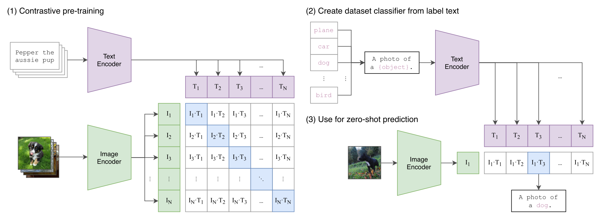
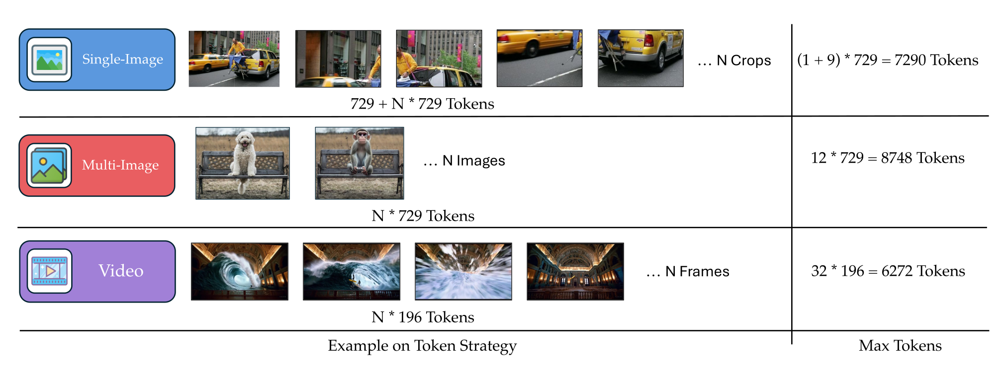
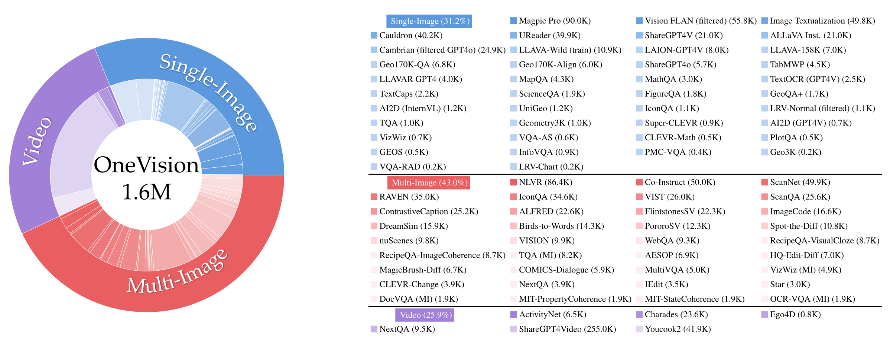
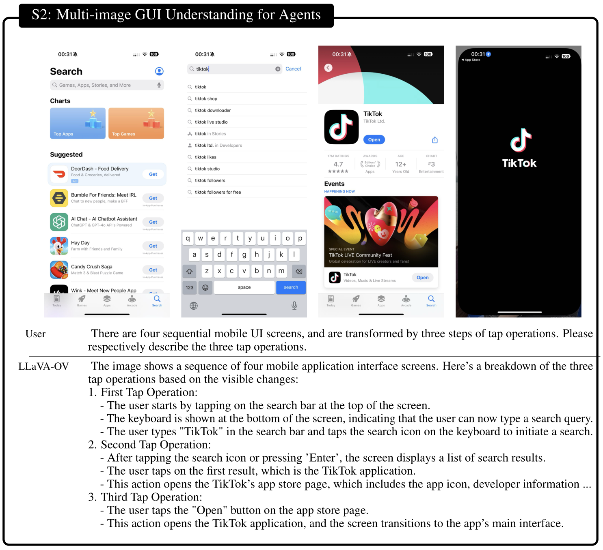
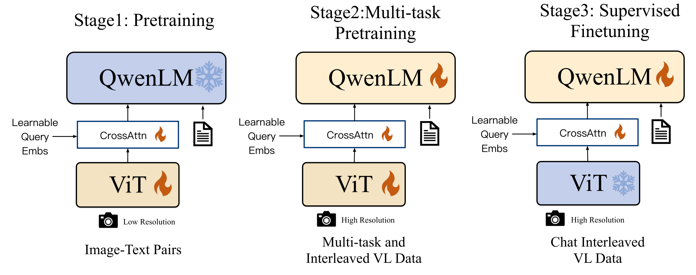
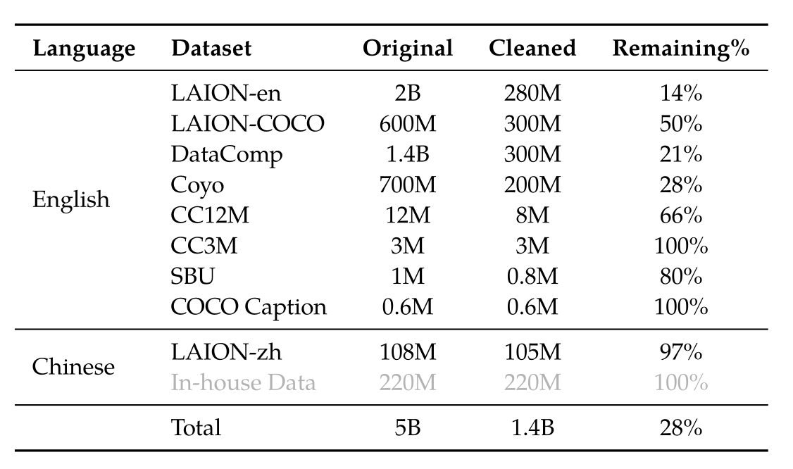
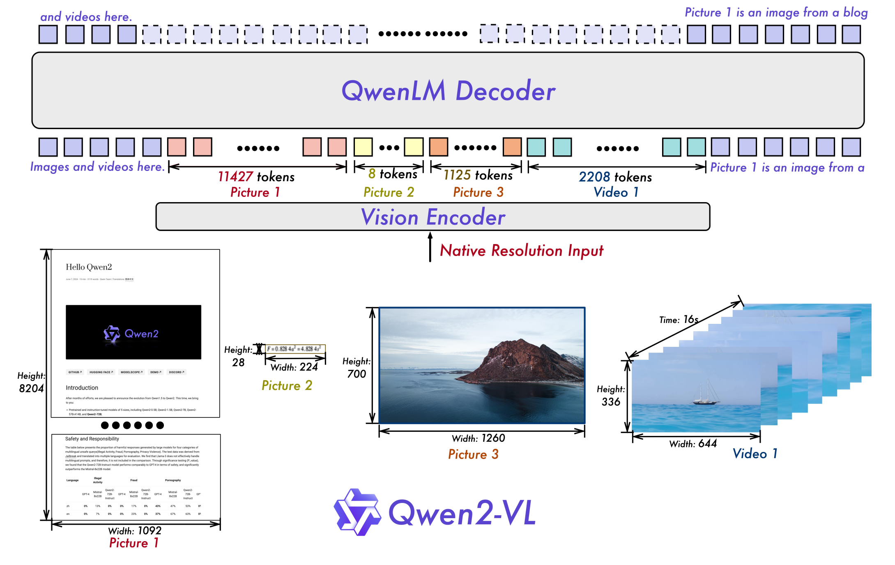
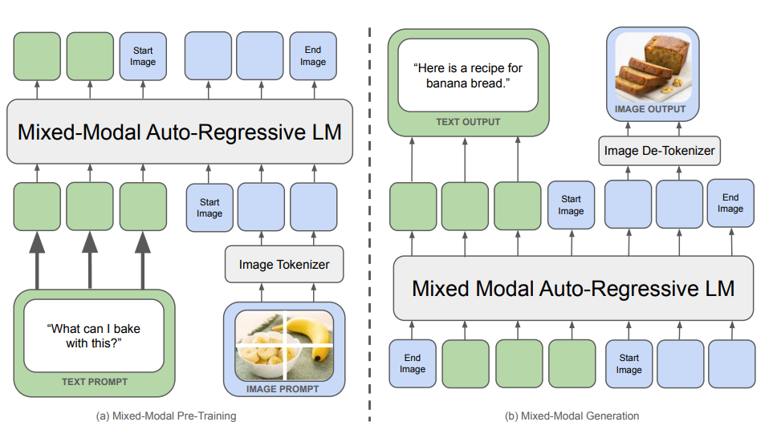

# Lecture 17 — Multimodality

Percy Liang. Source: [`lecture_17.py`](https://github.com/stanford-cs336/lectures/blob/main/lecture_17.py),
302 lines. Rendered by the course's trace viewer at
[`?trace=lecture_17`](https://cs336.stanford.edu/lectures/?trace=lecture_17).

Every other lecture in CS336 builds a language model: text in, text out. This one
asks what has to change when the input is a photograph and the output might be
one too. Its answer is a single sustained argument, and the argument is worth
stating before the models arrive, because each of the eight papers below is a
different attempt at the same step.

**Transformers speak tokens, so everything must become tokens.** That is the
whole problem. Text already had an answer — the BPE tokenizer of lecture 1 — and
the lecture explicitly frames image encoding as the search for its equivalent. A
token has to carry roughly a semantic unit; a pixel does not qualify. So the
lecture's spine is a sequence of increasingly good answers to "what is an image
token, and how does it get into the language model?"

The sequence runs in two halves.

**Encoding images** (CLIP, SigLIP) produces *continuous* tokens by training an
image encoder against text, and the two papers differ in their loss: CLIP ranks a
whole batch with a softmax, SigLIP scores each pair independently with a sigmoid.

**Injecting those encodings into an LLM** (LLaVA, LLaVA-OneVision, Qwen-VL,
Qwen2-VL, Qwen3-VL) settles on one template — vision encoder, projector,
language model — and then spends five papers on everything around it: resolution,
positional encoding, staged training, and above all data.

**Chameleon** is the turn. It gives up continuous tokens for *discrete* ones,
which is what makes generation possible in the same autoregressive way that
generated text — at a cost in fidelity the lecture is candid about.

For what was *said*, see [the transcript](../transcripts/17-multimodality.md).
For what was *written*, use this file.

## Sections → source lines

| Section | Function | Source lines |
| --- | --- | --- |
| [Roadmap](#roadmap) | `main` | 4–25 |
| [CLIP](#clip) | `clip` | 48–95 |
| [SigLIP](#siglip) | `siglip` | 98–121 |
| [LLaVA](#llava) | `llava` | 124–145 |
| [LLaVA-OneVision](#llava-onevision) | `llava_onevision` | 148–192 |
| [Qwen-VL](#qwen-vl) | `qwen_vl` | 195–211 |
| [Qwen2-VL](#qwen2-vl) | `qwen2_vl` | 214–233 |
| [Qwen3-VL](#qwen3-vl) | `qwen3_vl` | 236–265 |
| [Chameleon](#chameleon) | `chameleon` | 268–298 |
| [Summary](#summary) | `main` | 40–45 |
| [Papers and resources cited](#papers-and-resources-cited) | — | — |
| [Figure audit](#figure-audit) | — | — |

The call order in `main` is not the definition order: `main` runs `clip`,
`siglip`, `llava`, `llava_onevision`, `qwen_vl`, `qwen2_vl`, `qwen3_vl`,
`chameleon` (lines 27–38), with three comment lines marking the three parts —
`# Encoding images`, `# Injecting image encodings into LLMs`, and
`# Towards Omni models`. Those three comments are the lecture's own structure and
are not printed by the trace; they are reproduced here because they are the
clearest statement of what the eight papers are for.

## Roadmap

*Source: `main`, lines 4–25.*

> ## Lecture 17: multimodal models
>
> So far: language models
>
> > text ⇒ text
>
> The world is multimodal:

*Figure: `images/multimodality.png`.*


**What the image shows.** A 2x2 grid of four labeled panels illustrating different data modalities, used as the lecture's opening motivation for "the world is multimodal."

- **Top-left, "Text"** (blue icon with a "T"): a white text box containing three example sentences/passages: "The quick brown fox jumps over the lazy dog." / "Artificial intelligence is transforming the world." / "Paris is the capital of France. It is known for the Eiffel Tower."
- **Top-right, "Images"** (green picture icon): a 2x2 sub-grid of four photographs — a snow-capped mountain range with a turquoise lake and pine trees in the foreground; a close-up of a golden retriever with its tongue out on grass; a wooden bowl of mixed fruit (apples, oranges, grapes) on a table; and a dusk/sunset photo of the Eiffel Tower with a lit-up plaza and roadway in front of it.
- **Bottom-left, "Audio"** (purple speaker icon): a purple waveform visualization inside a simple audio player UI showing a play button, a scrubber from 0:00 to 0:10 with the playhead near the start, and a caption below reading "The sounds of ocean waves crashing on the shore."
- **Bottom-right, "Video"** (orange/yellow video-camera icon): a video player frame showing a landscape scene (a lake surrounded by green hills and mountains under a blue sky with clouds), with a video control bar showing a red progress bar partway across, a timestamp "0:02 / 0:15", and icons for play, volume, settings (gear), and fullscreen.

**Flags.** None.

*Source: [`images/multimodality.png`](https://github.com/stanford-cs336/lectures/blob/main/images/multimodality.png) in the lectures repo.*

> Ultimate goal: **omni model**
>
> - Input any combination of modalities (understanding)
> - Output any combination of modalities (generation)

The word to hold onto is **omni**: a model that accepts any combination of
modalities and emits any combination. The lecture states it as the destination
and then immediately says the course will not reach it — what follows is the
input half, and mostly the image part of the input half.

> Where we are today:
>
> - Transformers work really well. So we gotta use them.
> - Transformers speak tokens (discrete or continuous), where a token represents some ~semantic unit of information.
> - Therefore, we must convert everything into tokens.
> - Note: we had to do this with text (recall the tokenization lecture).
> - For non-text modalities, this is more challenging...

This is the argument the whole lecture rests on, and it is worth reading as the
syllogism it is written as. The premise is empirical and slightly resigned —
Transformers work, so we are stuck with them — and everything else follows from
what a Transformer will accept. Note the widening of "token" in the second
bullet: **discrete or continuous**. Text tokens are discrete symbols with an
embedding table; an image token, for most of this lecture, is a continuous vector
straight out of an encoder with no vocabulary behind it at all. Both count as
tokens because both are things a Transformer can attend over.

The parenthetical matters too. [Tokenization](../transcripts/01-overview-tokenization.md)
was already a compromise for text, and the lecture treats image encoding as the
same problem one notch harder — not as a new subject.

> Questions:
>
> 1. How do we input non-text data (e.g., understand images)?
> 2. How do we output non-text data (e.g., generate audio)?

Seven of the eight papers below answer question 1. Chameleon is the only one that
answers question 2, and it does so by changing the answer to question 1.

## CLIP

*Source: `clip`, lines 48–95.*

> CLIP (Contrastive Language-Image Pretraining) — [paper](https://arxiv.org/abs/2103.00020)

The first of the two encoders, and the one everything downstream is built on or
measured against. CLIP's contribution is not an architecture; it is a *training
signal*. What follows is the lecture's own six-part breakdown — context, method,
data, data processing, the two encoders, the headline result, and an ablation.

> Context:
>
> - Computer vision models were trained on annotated images.
> - Question: is it possible to leverage the much larger amount of (image, caption) pairs?

The whole idea in one question. Hand-annotated image datasets are small because
annotation is expensive; captions are abundant because the internet writes them
for free. The bet is that noisy free supervision at scale beats clean supervision
at small scale — the same bet [data filtering](../transcripts/14-data-filtering-dedup-mixing.md)
makes for text.

*Figure: `images/clip.png`.*



**What the image shows.** The classic three-panel CLIP diagram (as in the original CLIP paper), split into a left panel and two stacked right panels.

**Panel (1) "Contrastive pre-training" (left):**
- A stack of text captions (top example shown: "Pepper the aussie pup") feeds rightward into a purple trapezoid box labeled "Text Encoder."
- The Text Encoder's output arrows fan out downward into a row of purple cells labeled T1, T2, T3, ..., TN.
- A stack of dog photos (bottom-left) feeds rightward into a green trapezoid box labeled "Image Encoder."
- The Image Encoder's output arrows fan out rightward into a column of green cells labeled I1, I2, I3, ..., IN (down to IN with a vertical ellipsis before it).
- The image embeddings (rows) and text embeddings (columns) form a grid of dot-product cells: row i, column j reads "Ii·Tj" (e.g., top-left cell "I1·T1", next "I1·T2", etc., down to "IN·TN" bottom-right).
- The diagonal cells (I1·T1, I2·T2, I3·T3, ..., IN·TN) are highlighted in blue, indicating the matched (positive) image-text pairs that contrastive training pulls together, while off-diagonal cells are white (negatives).

**Panel (2) "Create dataset classifier from label text" (top right):**
- A vertical list of class-name boxes: "plane", "car", "dog", a vertical ellipsis, "bird".
- These feed into a template box reading "A photo of a {object}." (with "{object}" shown in pink/red to indicate it's a fill-in slot).
- The templated text feeds into a purple "Text Encoder" trapezoid box.
- Its outputs fan out into a row of purple cells labeled T1, T2, T3, ..., TN, matching the class list order.

**Panel (3) "Use for zero-shot prediction" (bottom right):**
- A single test photo (a cow/calf-like animal in a green field) feeds into a green "Image Encoder" trapezoid box, producing a single green embedding cell labeled I1.
- Below/right, the row of text embeddings T1...TN (carried over from panel 2, drawn again in purple) is dot-producted against I1, giving a row of cells "I1·T1", "I1·T2", "I1·T3" (highlighted in blue as the winning match), ..., "I1·TN".
- An arrow from the highlighted "I1·T3" cell points down to a box reading "A photo of a dog." (with "dog" in pink/red), indicating the predicted class/caption is selected via the highest dot product.

This is a pipeline/architecture diagram: data flows left-to-right within each encoder step, and top-to-bottom/left-to-right when composing the similarity matrices; panel 1 shows training, panels 2–3 show how the trained encoders are reused for zero-shot classification.

**Flags.** None.

*Source: [`images/clip.png`](https://github.com/stanford-cs336/lectures/blob/main/images/clip.png) in the lectures repo.*

> Method:
>
> - Get a batch of (image, text) examples (e.g., 32768)
> - Encode each image and each text
> - For each image, prefer its aligned text over other texts
> - For each text, prefer its aligned image over other images

Read the last two bullets carefully: the loss is **symmetric**, and it is a
*ranking* loss rather than a reconstruction loss. Nothing here asks the model to
produce a caption. It asks only that the right pairing score higher than the
32,767 wrong ones, in both directions. The other examples in the batch are the
negatives — which is why the batch size appears in the method and not in the
optimization details.

*Figure: `images/clip-code.png`.*


**What the image shows.** A code/pseudocode listing (the CLIP paper's numpy-style pseudocode for contrastive pre-training), rendered as syntax-highlighted text — comments in blue, code in black. Transcribed verbatim below:

```python
# image_encoder - ResNet or Vision Transformer
# text_encoder  - CBOW or Text Transformer
# I[n, h, w, c] - minibatch of aligned images
# T[n, l]       - minibatch of aligned texts
# W_i[d_i, d_e] - learned proj of image to embed
# W_t[d_t, d_e] - learned proj of text to embed
# t             - learned temperature parameter

# extract feature representations of each modality
I_f = image_encoder(I) #[n, d_i]
T_f = text_encoder(T)  #[n, d_t]

# joint multimodal embedding [n, d_e]
I_e = l2_normalize(np.dot(I_f, W_i), axis=1)
T_e = l2_normalize(np.dot(T_f, W_t), axis=1)

# scaled pairwise cosine similarities [n, n]
logits = np.dot(I_e, T_e.T) * np.exp(t)

# symmetric loss function
labels = np.arange(n)
loss_i = cross_entropy_loss(logits, labels, axis=0)
loss_t = cross_entropy_loss(logits, labels, axis=1)
loss   = (loss_i + loss_t)/2
```

There is no non-code content around it — the entire image is this code listing on a white background.

**Flags.** None.

*Source: [`images/clip-code.png`](https://github.com/stanford-cs336/lectures/blob/main/images/clip-code.png) in the lectures repo.*

> Data:
>
> - Searched for 500K queries, get ~20K (image, text) pairs per query
> - Trained on 400M image-text pairs
> - Didn't release the dataset
> - Reproduced in OpenCLIP (using LAION-5B dataset, which used CLIP for filtering) — [paper](https://arxiv.org/abs/2212.07143)

The construction is a query-balanced crawl: 500K queries × ~20K pairs each, then
cut to 400M. Two things are worth flagging. The dataset was **not released**,
which is why OpenCLIP exists at all. And OpenCLIP's replacement, LAION-5B, **used
CLIP itself for filtering** — so the open reproduction depends on the closed
model it is reproducing. That circularity is the same one the
[data filtering](../transcripts/14-data-filtering-dedup-mixing.md) lecture
records for text: a model becomes the quality filter for the data that trains its
successor.

> Data processing — [code](https://github.com/openai/CLIP/blob/main/clip/clip.py#L79)
>
> - Images come in all resolutions (arbitrary W x H)
> - Resize using bicubic interpolation so shorter side is 336 pixels
> - Center crop (cuts off borders to get 336 x 336)

A fixed 336×336 square, obtained by resizing the short side and **cutting the
borders off**. Remember this; it is the single design decision that the rest of
the lecture spends the most effort undoing. LLaVA-OneVision's AnyRes exists
because of this line, and Qwen2-VL's dynamic resolution exists because AnyRes is
still a workaround.

> Vision encoder:
>
> - Experimented with ResNet-50 and Vision Transformers — [paper](https://arxiv.org/pdf/2010.11929)

*Figure: `images/vit.png`.*


**What the image shows.** The standard Vision Transformer (ViT) architecture diagram (from Dosovitskiy et al.), split into two linked panels by a vertical dashed divider.

**Left panel, "Vision Transformer (ViT)":**
- At the bottom, a photograph of a building (a light-colored church/palace facade under a blue sky) is shown split into a 3x3 grid of 9 patches (small thumbnails), with a gray arrow pointing from the grid to a row of 9 flattened patch images.
- These 9 flattened patches feed upward (vertical lines) into a pink/salmon bar labeled "Linear Projection of Flattened Patches."
- From that bar, 10 arrows point upward into 10 numbered oval tokens labeled 0* through 9 (purple/lavender ovals), captioned on the left as "Patch + Position Embedding," with a footnote "* Extra learnable [class] embedding" explaining that token 0 is the extra learnable class embedding prepended to the 9 patch tokens.
- All 10 tokens feed upward into a large gray box labeled "Transformer Encoder" (this box is expanded in detail in the right panel).
- The output of the Transformer Encoder feeds upward into an orange box labeled "MLP Head."
- The MLP Head's output feeds into an orange oval labeled "Class" listing example classes "Bird / Ball / Car / ...".

**Right panel, "Transformer Encoder":** shows the internal structure of one encoder layer (repeated L times, indicated by an outer gray box labeled "L x"), with data flowing bottom-to-top:
- "Embedded Patches" (pink box) at the bottom.
- Flows into "Norm" (yellow box).
- Flows into "Multi-Head Attention" (green box).
- A residual/skip connection (curved arrow) adds the pre-norm input back in at a "+" circle after the attention block.
- That sum flows into another "Norm" (yellow box).
- Flows into "MLP" (blue box).
- A second residual/skip connection adds the input to that second norm back in at a final "+" circle.
- The final "+" output is the encoder layer's output, exiting at the top.

This is an architecture/pipeline diagram: data flows bottom-to-top through both panels, with the right panel showing the internal detail of the "Transformer Encoder" box referenced in the left panel.

**Flags.** None.

*Source: [`images/vit.png`](https://github.com/stanford-cs336/lectures/blob/main/images/vit.png) in the lectures repo.*

> - Attention pooling: do QKV with query = global average of activations
> - Best model: ViT-L/14@336px (L = large, 14x14 patches, 3 channels, trained on 336x336 resolution images)

The naming convention is worth decoding once, because every later model reuses
it. **ViT-L/14@336px**: Large, 14×14 pixel patches, trained at 336×336. At that
resolution a 14-pixel patch tiles the image 24×24, so an image becomes 576
patches — a number that reappears as a token count throughout the second half of
the lecture.

Attention pooling is how a sequence of patch embeddings becomes one vector: run
attention with the query set to the global average of the activations, so the
output is a learned weighting of patches rather than a plain mean.

> Text encoder:
>
> - GPT-2 Transformer (63M parameters, 12 layers)
> - Encode [BOS] ... [EOS], return [EOS] activation at highest layer

Small, and deliberately so — 63M parameters against the vision tower's much
larger budget. The `[EOS]` activation at the top layer is the sentence embedding,
the same trick a text-only encoder would use.

> Headline result:
>
> - On ImageNet, zero-shot CLIP outperformed ResNet-50 trained on 1.2M ImageNet images

The claim that made the paper. Note precisely what is being compared: **zero-shot**
CLIP, which has never seen an ImageNet label, against a ResNet-50 **trained on
ImageNet**. The comparison is against a supervised baseline on that baseline's own
home ground.

> Ablation:
>
> - Alternative: predict text from images directly
> - Much less compute efficient compared to CLIP-style ranking

*Figure: `images/clip-efficiency.png`.*


**What the image shows.** A line chart comparing zero-shot ImageNet accuracy versus training compute (number of images processed) for three different pretraining objectives (this is the CLIP paper's "efficiency" figure).

- **X-axis:** "# of images processed," with labeled ticks at 2M, 33M, 67M, 134M, 268M, 400M (plus a couple of unlabeled intermediate points between 2M and 33M where markers appear). **This axis is LINEAR, not logarithmic** — corrected in the parent against the image. The tick positions settle it: 33M→67M is a doubling spanning about 82 px, while 134M→268M is also a doubling spanning about 345 px, and on a logarithmic axis those two gaps would be equal. Pixels per million image is near-constant across all five intervals (~2.8, 2.4, 2.5, 2.6, 2.6). This is why the early points bunch against the left edge and the curves look sharply concave: it is a linear axis, and most of its width is spent on the last two doublings.
- **Y-axis:** "Zero-Shot ImageNet Accuracy," a linear scale with labeled ticks at 5, 10, 15, 20, 25, 30, 35, 40 (evenly spaced gridline values), running from about 0 to just above 40.

There are exactly three data series, each a line with circular markers:
- **Green, "Bag of Words Contrastive (CLIP)":** the top curve. Starts near (2M, ~3–4), climbs quickly through the unlabeled early points to about 8 and 11.5, reaches about 18.5 at 33M, about 24 at 67M, about 28 at 134M, about 36.5 at 268M, and about 41 at 400M.
- **Orange, "Bag of Words Prediction":** the middle curve. Starts near (2M, ~2), rising to about 5 and 7 at the early points, about 12 at 67M, about 16 at 134M, about 22 at 268M, and about 26.5 at 400M.
- **Blue, "Transformer Language Model":** the bottom curve. Starts near (2M, ~1), rising to about 2 and 4.5 at the early points, about 6.5 at 67M, about 9 at 134M, about 13 at 268M, and about 16 at 400M.

Two black horizontal annotation lines with left-pointing arrowheads mark efficiency comparisons at the accuracy level of about 16: one, labeled "4X efficiency," spans from the green curve's point at 33M leftward-pointing arrow back toward the orange curve's point at 134M, indicating CLIP reaches that accuracy using about 4x fewer images than the bag-of-words-prediction objective. The second, labeled "3X efficiency," spans from the blue curve's point at 400M back to the orange curve's point near 134M, indicating the bag-of-words-prediction objective reaches that same accuracy using about 3x fewer images than the plain Transformer language model.

A legend box in the lower-right identifies the three series by color and name as listed above.

**Flags.** None.

*Source: [`images/clip-efficiency.png`](https://github.com/stanford-cs336/lectures/blob/main/images/clip-efficiency.png) in the lectures repo.*

This ablation is the load-bearing one for the lecture's argument. The obvious
alternative — caption the image, i.e. a generative objective — is *much* less
compute-efficient than ranking. Generating the exact caption forces the model to
model everything about the wording; ranking it against alternatives asks only for
what distinguishes it. This is why the contrastive framing won.

> Summary:
>
> - Encoding of images captures semantics given by (noisy) text
> - Design decisions chosen based on image classification (not very fine-grained)
> - Technical: requires large batch sizes, softmax operation over full batch

The second bullet is the criticism that drives the rest of the lecture, and it is
CLIP's own summary saying it. Every design choice — 336×336, center crop,
attention pooling to a single vector — was validated on **image classification**,
a coarse task. Ask the resulting encoder to read text in a photograph, or to say
where an object is, and it was never tuned for that. The third bullet is the
technical debt: the softmax runs over the full batch, so large batches are not a
tuning choice but a requirement of the loss.

## SigLIP

*Source: `siglip`, lines 98–121.*

> SigLIP (Sigmoid Loss for Language Image Pre-Training) — [paper](https://arxiv.org/abs/2303.15343)

SigLIP changes exactly one thing about CLIP — the loss — and the lecture presents
it entirely through the consequences of that one change.

> Objective:
>
> - CLIP: multiclass classification for (text, image) versus (text, image') for all image'
> - SigLIP: binary classification for (text, image) - aligned or not?

The contrast in two lines. CLIP asks *which* of these N images goes with this
text — a multiclass question, so every pair's score has to be normalized against
every other pair's. SigLIP asks *does this image go with this text* — a yes/no
question about a single pair, decided independently.

That is the entire difference, and everything below follows from it: an
independent per-pair decision needs no normalizer, so no full-batch softmax, so no
communication of every score to every device.

*Figure: `images/siglip-code.png`.*


**What the image shows.** A numbered pseudocode listing titled "Algorithm 1 Sigmoid loss pseudo-implementation" (from the SigLIP paper), set in a boxed/ruled algorithm-style layout with horizontal rules above and below, and line numbers 1–11 in the left margin. Comments are in green, code in black/dark gray. Transcribed verbatim below (line numbers included as they appear in the figure):

```
1  # img_emb      : image model embedding [n, dim]
2  # txt_emb      : text model embedding [n, dim]
3  # t_prime, b   : learnable temperature and bias
4  # n            : mini-batch size
5
6  t = exp(t_prime)
7  zimg = l2_normalize(img_emb)
8  ztxt = l2_normalize(txt_emb)
9  logits = dot(zimg, ztxt.T) * t + b
10 labels = 2 * eye(n) - ones(n) # -1 with diagonal 1
11 l = -sum(log_sigmoid(labels * logits)) / n
```

There is no other content on the page besides the "Algorithm 1" title/caption and this code listing.

**Flags.** None.

*Source: [`images/siglip-code.png`](https://github.com/stanford-cs336/lectures/blob/main/images/siglip-code.png) in the lectures repo.*

> Data:
>
> - WebLI dataset: O(billion) (image, text) pairs — [paper](https://arxiv.org/pdf/2209.06794)
> - Scraped from the Internet
> - Used automatic OCR to extract text from images
> - Keep 10% highest quality
> - Supports 100 languages

WebLI is a step up from CLIP's 400M in both size and breadth — order of a billion
pairs, 100 languages, and a 10% quality cut. The OCR line is easy to skim past and
is the interesting one: text is extracted **from inside the images** and used as
supervision, which is why SigLIP encoders are noticeably better at reading than
CLIP's, and why every OCR-capable VLM later in this lecture uses SigLIP rather
than CLIP.

> Efficiency:
>
> - CLIP: 10 days on 256 TPUv3
> - SigLIP: 5 days on 32 TPUv4 (lower FLOP/s than TPUv3) - much faster!

*Figure: `images/siglip-parallelism.png`.*


**What the image shows.** A four-panel diagram (left to right = four sequential steps/rounds) illustrating SigLIP's chunked, ring-based computation of the sigmoid loss across 3 devices, each holding 4 images and 4 texts (12 total). In every panel, columns I1–I12 are grouped into three column-blocks labeled "Device 1" (I1–I4), "Device 2" (I5–I8), "Device 3" (I9–I12) across the top, and rows T1–T12 are grouped into three row-blocks of 4, each also labeled by a "Device" name on the left (which device's label is attached to which row-block changes between panels, described below).

- **Panel 1 (leftmost, unlabeled step):** The full 12x12 grid with row-blocks labeled Device 1 (T1–T4), Device 2 (T5–T8), Device 3 (T9–T12) top to bottom, matching the column-block order. Only the 12 cells on the global diagonal (T1×I1, T2×I2, ..., T12×I12 — the true positive pairs) are shaded light teal; every other cell is plain gray. No +/- marks and no loss row are shown yet.

- **Panel 2 ("round 1," local block):** Each device computes only its own diagonal 4x4 block: Device 1's block (T1–T4 × I1–I4) is outlined in maroon/crimson, Device 2's block (T5–T8 × I5–I8) in purple, Device 3's block (T9–T12 × I9–I12) in blue. Inside each block, cells are shaded yellow, with the true-diagonal cell marked "+" (green-tinted) and the three off-diagonal cells marked "-". Cells outside each device's own block are blank. Below the grid, a "loss" row shows "33%" under every one of the 12 image columns, boxed and labeled by device (Device 1 / Device 2 / Device 3), with down-arrows from each column into the loss row.

- **Panel 3 ("round 2," after one ring rotation):** The row-block labels have rotated: the T1–T4 row-block is now labeled "Device 3," T5–T8 is labeled "Device 1," and T9–T12 is labeled "Device 2" (representing each device now holding a rotated chunk of text embeddings received from a neighboring device), while the column-block labels (Device 1/2/3 = I1–4/I5–8/I9–12) stay the same as before. The block computed in panel 2 (e.g., T1–4 × I1–4) now shows light-green checkmarks instead of +/- signs, indicating it's already computed. A new 4x4 block per row is computed this round, shaded yellow with all cells marked "-" (pure negatives, no "+"), outlined in the color matching that row's current device label: the "Device 3" row-block (T1–4) is boxed against I9–I12 in blue; the "Device 1" row-block (T5–8) is boxed against I1–I4 in maroon; the "Device 2" row-block (T9–12) is boxed against I5–I8 in purple. Remaining cells are blank. The loss row below now reads "66%" under all 12 columns, again grouped/boxed by device.

- **Panel 4 (rightmost, "round 3," final):** Row-block labels rotate once more: T1–4 is now labeled "Device 2," T5–8 is labeled "Device 3," T9–12 is labeled "Device 1." Nearly the whole grid is now checkmarks (all previously computed cells), except one last 4x4 block per row still shown in yellow with "-" signs: the "Device 2" row-block (T1–4) boxed against I5–I8 in maroon; the "Device 3" row-block (T5–8) boxed against I9–I12 in purple; the "Device 1" row-block (T9–12) boxed against I1–I4 in blue. The loss row below now shows a white checkmark (rather than a percentage) in every one of the 12 columns, grouped/boxed by device, and three colored arrows (maroon, purple, blue) point downward from the Device 1 / Device 2 / Device 3 loss boxes to a caption reading "Cross Device Σ," indicating the final loss is obtained by summing contributions across all three devices.

Overall this is a process/pipeline diagram (not a chart): it shows how, round by round, each device rotates which chunk of text embeddings it holds and accumulates loss contributions from a new block of image-text pairs, reaching 100% coverage (all checkmarks) after 3 rounds without any single device ever materializing the full 12x12 matrix.

**Flags.** None.

*Source: [`images/siglip-parallelism.png`](https://github.com/stanford-cs336/lectures/blob/main/images/siglip-parallelism.png) in the lectures repo.*

The parenthetical is what makes this a real comparison rather than a hardware
upgrade in disguise: the lecture flags that the TPUv4 chips used here have
**lower** per-chip FLOP/s than the TPUv3 chips CLIP used. So half the wall-clock
time on one eighth of the chips, on slower chips — the saving is the loss, not
the silicon.

> Batch size:
>
> - Decouple batch size from loss
> - Better than CLIP for <16K batch sizes
> - Go up to 1M batch size, but 32K is enough

"Decouple batch size from loss" is the summary of the whole paper. With CLIP the
batch *is* the negative set, so batch size is a modelling decision; with a sigmoid
it goes back to being an optimization knob. The paper's most-quoted empirical
result is the last bullet: they push to a **1M** batch and find **32K is enough**,
which retires the assumption that contrastive training keeps improving with batch
size indefinitely.

## LLaVA

*Source: `llava`, lines 124–145.*

> LLaVA (Large Language and Vision Assistant) — [paper](https://arxiv.org/abs/2304.08485)

The lecture's second half starts here, and with it the question changes. CLIP and
SigLIP produce an image embedding; they are not language models and cannot hold a
conversation about a picture. LLaVA is the paper that shows how little it takes to
bolt one onto the other.

> Vision encoder: CLIP
>
> Text decoder: Vicuna (LLaMA fine-tuned on ShareGPT conversations) — [blog post](https://www.lmsys.org/blog/2023-03-30-vicuna/)

Both halves are off-the-shelf and neither is trained from scratch. That is the
point of the paper.

> Data:
>
> - MS COCO has images annotated with bounding boxes and Mechanical Turk captions
> - Prompt GPT-4 with captions or detected objects and generate questions or conversations
> - Pair generations with original images
> - 158K examples

This is the trick, and it is worth being precise about what is happening, because
it is easy to misread. **GPT-4 never sees the images.** It is given the *textual*
annotations that COCO already has — human captions and detected bounding boxes —
and asked to invent questions and conversations from them. Those generated
conversations are then paired back with the original images to make visual
instruction data. A text-only model bootstraps a multimodal dataset, at 158K
examples, because the images were already described in text by somebody else.

*Figure: `images/llava-gen.png`.*


**What the image shows.** A rounded-rectangle boxed example (from the LLaVA paper) illustrating how GPT-4 is prompted with COCO captions/boxes to generate instruction-tuning conversations, paired with a photo. Text is transcribed below (with the paper's own "...<omitted>" truncation markers preserved as they appear):

Top-right: a photograph taken inside an underground parking garage, showing a black SUV with its trunk/rear door open, several people near it, and various luggage (backpacks, suitcases, a duffel bag) on the ground. The photo has multiple colored bounding boxes drawn on it (e.g., red, green, orange, yellow, purple boxes) outlining detected objects such as the vehicle, people, and individual luggage items — consistent with the "Context type 2: Boxes" object-detection annotations described in the text below.

Left/main text block, top section (the GPT-4 prompt context):
- **"Context type 1: Captions"**
  - "A group of people standing outside of a black vehicle with various luggage."
  - "Luggage surrounds a vehicle in an underground parking area"
  - "People try to fit all of their luggage in an SUV."
  - "The sport utility vehicle is parked in the public garage, being packed for a trip"
  - "Some people with luggage near a van that is transporting it."
- **"Context type 2: Boxes"**
  - "person: [0.681, 0.242, 0.774, 0.694], backpack: [0.384, 0.696, 0.485, 0.914], suitcase: ...<omitted>"

A horizontal rule separates the context section from the generated-response section below.

Bottom section (three example GPT-4-generated response types):
- **"Response type 1: conversation"**
  - "Question: What type of vehicle is featured in the image?"
  - "Answer: The image features a black sport utility vehicle (SUV) ...<omitted>"
- **"Response type 2: detailed description"**
  - "The image is an underground parking area with a black sport utility vehicle (SUV) parked. There are three people in the scene, with one person standing closer to the left side of the vehicle, another person in the middle, and the third person on the right side. They are all working together to pack their luggage into the SUV for a trip. ...<omitted>"
- **"Response type 3: complex reasoning"**
  - "Question: What challenges do these people face?"
  - "Answer: In the image, a group of people is standing outside a black SUV in a parking area, surrounded by various pieces of luggage, including suitcases and backpacks. They are facing the challenge of fitting all their luggage into the black SUV. There are multiple suitcases and backpacks to be packed, which suggests that the group has a significant amount of belongings ...<omitted>"

All five section headers ("Context type 1: Captions", "Context type 2: Boxes", "Response type 1: conversation", "Response type 2: detailed description", "Response type 3: complex reasoning") are rendered in bold blue text; body text is black.

**Flags.** The caption text and box coordinates are truncated in the source figure itself with "...<omitted>" — this is not a legibility problem on my end, it is how the original figure is printed (only a partial box list and partial answers are shown).

*Source: [`images/llava-gen.png`](https://github.com/stanford-cs336/lectures/blob/main/images/llava-gen.png) in the lectures repo.*

> Model:
>
> - Encode images with CLIP (ViT-L/14)
> - Linear projection (W) into embedding space (Flamingo and Q-former are more complex)

*Figure: `images/llava-architecture.png`.*


**What the image shows.** The LLaVA architecture diagram, showing how an image and a language instruction are combined and fed into a language model to produce a response. Data flows from bottom to top and left to right.

- At the bottom left, **"X_v Image"** (with a small blue upward arrow) feeds into a blue box labeled **"Vision Encoder."**
- The Vision Encoder's output is labeled **Z_v**, which flows via a curved arrow (passing behind/through) into a peach/orange box labeled **"Projection W."**
- The Projection W output is a triangular arrowhead pointing right into a row of three light-gray, house-shaped ("pentagon roof") token icons labeled **H_v** — these represent the projected image tokens.
- At the bottom right, **"X_q Language Instruction"** feeds via a blue upward arrow directly into a row of three darker-gray house-shaped token icons labeled **H_q** — the language instruction tokens (no vision encoder or projection is applied to this path).
- All six tokens (3 light-gray H_v + 3 dark-gray H_q, placed left-to-right in that order) sit just below a wide green horizontal band labeled **"Language Model f_φ"**, indicating they are all fed into the language model together as one sequence.
- From the green Language Model band, many thin gray lines fan upward and converge into three green house-shaped token icons at the top right, labeled **"Language Response X_a."** The dense crisscrossing lines from all six input positions into the three output positions represent the language model attending over the full input sequence (image tokens + instruction tokens) to autoregressively generate the response tokens.

This is an architecture/pipeline diagram: the shape shows two input streams (image via Vision Encoder → Projection, and text instruction directly) being concatenated into a single token sequence that is consumed by one shared language model to produce the output response tokens.

**Flags.** None.

*Source: [`images/llava-architecture.png`](https://github.com/stanford-cs336/lectures/blob/main/images/llava-architecture.png) in the lectures repo.*

**A single linear projection.** One matrix $W$ maps CLIP's image features into the
language model's embedding space, and that is the entire bridge. The parenthetical
is the paper positioning itself: Flamingo's gated cross-attention and BLIP-2's
Q-Former are the elaborate alternatives, and LLaVA's claim is that a linear map
suffices. This is the template the whole rest of the lecture varies — Qwen-VL
replaces $W$ with cross-attention, LLaVA-OneVision with a 2-layer MLP, Qwen3-VL
with DeepStack.

> Training:
>
> - Stage 1 (alignment): freeze vision encoder and language model, only train W
> - Stage 2 (fine-tuning): freeze vision encoder and train W and language model

The staged recipe, in its simplest form. Stage 1 trains **only the projector**,
with both towers frozen — all it has to learn is the coordinate change between two
already-good representations. Stage 2 unfreezes the language model but keeps the
vision encoder frozen throughout. Note what is never trained here: the vision
encoder. Every later model in this lecture eventually stops doing that.

*Figure: `images/llava-example.png`.*


**What the image shows.** The well-known "Extreme Ironing" qualitative example from the LLaVA paper, comparing LLaVA's answers to GPT-4, BLIP-2, and OpenFlamingo on the same image and question. Bold heading at top: "Visual input example, Extreme Ironing:"

The photograph shows a man in a yellow long-sleeve shirt standing on the back of a yellow SUV taxi in a city street, ironing a piece of blue clothing on a fold-out ironing board that is mounted on/attached to the back of the vehicle; another yellow taxi cab is visible blurred/in motion to the left, with city buildings, a tree, and a small American flag visible in the background. Below the photo is the caption "Source: https://www.barnorama.com/wp-content/uploads/2016/12/03-Confusing-Pictures.jpg" (the URL rendered in pink/magenta monospace text).

Below that, a transcript of Q&A turns, transcribed verbatim:

**User:** What is unusual about this image?
**LLaVA:** The unusual aspect of this image is a man ironing clothes on the back of a minivan or van. This is not a typical place to perform this activity, as one would usually iron clothes in a more stationary and safe location, such as a home, using a regular ironing board. The scene depicted in the image is peculiar as it involves a makeshift ironing setup on a vehicle, which can be both unsafe and unconventional. Additionally, it is not clear how the man is able to maintain balance and stability while ironing clothes in such an unstable environment.

*[Start a new conversation, and clear the history]*

**User:** What's happening in the scene?
**LLaVA:** The image depicts a man standing on top of a yellow SUV in a busy city street. He is holding a portable ladder, seemingly ironing clothes while standing on the vehicle. Around the scene, there are other cars, a traffic light, and a fire hydrant. Additionally, there are two other people in the vicinity, one close to the man on the car and another further away. The man on the ladder appears to be attracting attention due to his unconventional choice of ironing his clothes on top of a moving car. The city street around him is bustling with activity, adding to the unique nature of the scene.

(In this LLaVA answer, the clause "due to his unconventional choice of ironing his clothes on top of a moving car" is rendered in blue text, distinguishing it from the rest of the black answer text — likely highlighting a specific claim being discussed in the paper.)

Below a horizontal rule, three more single-turn comparisons, each with the same question:

**User:** What is unusual about this image?
**GPT-4 [36]:** The unusual thing about this image is that a man is ironing clothes on an ironing board attached to the roof of a moving taxi.

**User:** What is unusual about this image?
**BLIP-2:** a man is sitting on the back of a yellow cab

**User:** What is unusual about this image?
**OpenFlamingo:** The man is drying his clothes on the hood of his car.

**Flags.** None.

*Source: [`images/llava-example.png`](https://github.com/stanford-cs336/lectures/blob/main/images/llava-example.png) in the lectures repo.*

## LLaVA-OneVision

*Source: `llava_onevision`, lines 148–192.*

> LLaVA OneVision — [paper](https://arxiv.org/pdf/2408.03326)
>
> - Latest version in the LLaVA series (after LLaVA 1.5, LLaVA-Next)
> - Handle multiple images, video

This is the most figure-heavy section of the lecture — nine of the 32 images — and
the reason is that its contributions are a resolution scheme, a token-budget
scheme, two data compositions, a training curriculum and three transfer results,
every one of which is a picture.

*Figure: `images/llava-onevision.png`.*


**What the image shows.** The LLaVA-OneVision architecture diagram: the same generic LLaVA-style pipeline diagram as in "llava-architecture.png" (right side), but now with concrete named components on the left side and three example input-modality strips added at the bottom, separated by a vertical dashed divider between the labeled-components column and the diagram.

**Left column (component labels, top to bottom):**
- Green box: **"Qwen-2"** (aligned with "Language Model f_φ")
- Peach/orange box: **"2-Layer MLP"** (aligned with "Projection p_θ")
- Blue box: **"SigLIP"** (aligned with "Vision Encoder g_ψ")

**Right side (architecture diagram, same layout/flow as llava-architecture.png):**
- Bottom: **"X_v"** labeled "Visual Signal" feeds up into the blue **"Vision Encoder g_ψ"** box.
- Its output **Z_v** curves via an arrow into the peach **"Projection p_θ"** box.
- Projection output feeds into a row of three light-gray house-shaped tokens labeled **H_v**.
- Separately, **"X_q"** labeled "Language Instruction" feeds up into a row of three darker-gray house-shaped tokens labeled **H_q**.
- All six tokens (H_v then H_q) sit below the green **"Language Model f_φ"** band.
- Many thin lines fan from all six input tokens up into three green house-shaped output tokens labeled **"Language Response X_a"** at the top right.

**Bottom strip (three example input types, connected to "Visual Signal" by dashed diagonal lines):**
- **"Single Image"** (left): a single photo shown split into a 2x2 grid of four crops/patches, depicting a city street with a yellow taxi and a person in a yellow jacket near a car.
- **"Multi-Image"** (middle): two separate photos side by side — a light-colored poodle sitting on a wooden park bench in a field, and a monkey sitting on the same style of wooden bench in a similar field.
- **"Video"** (right): a filmstrip-style icon (sprocket holes on top/bottom) containing a camera icon and an image of a breaking ocean wave inside an archway, next to a 2x2 grid of four video frames showing similar wave/underwater-tunnel imagery (representing sampled frames from a video clip).

This is an architecture/pipeline diagram: the left column names the concrete modules (SigLIP, 2-Layer MLP, Qwen-2) that fill the generic roles (Vision Encoder, Projection, Language Model) shown on the right, and the bottom strip shows that the same "Visual Signal" input slot can be filled by a single image, multiple images, or a video.

**Flags.** None.

*Source: [`images/llava-onevision.png`](https://github.com/stanford-cs336/lectures/blob/main/images/llava-onevision.png) in the lectures repo.*

> - Vision encoder: SigLIP (use grid features before and after last Transformer layer)
> - Text decoder: Qwen-2 72B
> - Projector: 2-layer MLP

Every one of LLaVA's three components has been swapped: CLIP → SigLIP, Vicuna →
Qwen-2 72B, and the linear $W$ → a 2-layer MLP. The SigLIP detail is specific —
grid features from **before and after** the last Transformer layer, so both the
more spatial and the more semantic representations reach the projector.

> Data processing:
>
> - Preserving high resolution is important (e.g., for OCR)
> - CLIP resizes and crops to 336x336, which loses information
> - Solution: AnyRes, introduced in LLaVA 1.5 — [paper](https://static.hliu.cc/files/llava/improved_llava.pdf)
> - Break up image into a x b pieces (matching resolution of vision encoder), encode, concatenate
> - If too many tokens (original image is too high resolution), then use bilinear interpolation

Here is CLIP's center crop coming back to be paid for. The second bullet names the
cost directly: 336×336 **loses information**, and OCR is where you notice, because
small text survives neither the downscale nor the crop.

**AnyRes** is the workaround, and it is a tiling scheme rather than a new encoder:
cut the image into an $a \times b$ grid of pieces each sized to the encoder's native
resolution, encode each piece separately, and concatenate the results. The encoder
never changes; it is simply run several times. The catch is the token count, which
grows with $a \times b$, and the fallback is bilinear interpolation to bring it back
down.

*Figure: `images/llava-onevision-anyres.png`.*


**What the image shows.** A pipeline diagram illustrating the AnyRes high-resolution image-processing scheme, using a screenshot of the first page of the "Visual Instruction Tuning" paper (arXiv:2304.08485v2, Haotian Liu, Chunyuan Li, Qingyong Wu, Yong Jae Lee; University of Wisconsin–Madison, Microsoft Research, Columbia University) as the example input image. Two parallel processing paths run left to right and merge into a single "LLM" box at the far right.

**Top path (high-resolution patches):**
1. The full paper-page image (leftmost thumbnail) feeds into an arrow labeled **"split."**
2. This produces a second thumbnail of the same page now overlaid with grid lines dividing it into a **3-column x 3-row grid (9 pieces)**.
3. An arrow labeled **"encode"** leads to a grid of solid-colored squares representing per-patch encoded features. This grid has **4 rows x 3 columns (12 squares)**, colored (row by row, left to right): row 1 — gray, red/salmon, pink/lavender; row 2 — light blue, green, orange; row 3 — medium blue, pale green, orange-brown/rust; row 4 — pink/lavender, light blue, dark slate-blue.
4. An arrow labeled **"Bilinear Interpolation"** leads to a second grid of colored squares in the same 4x3 layout, with the identical colors in the identical positions as the pre-interpolation grid (illustrating the downsampling step schematically, without changing the example's apparent grid size).
5. An arrow labeled **"flatten"** leads into the green rounded box labeled **"LLM"** on the far right.

**Bottom path (low-resolution global view):**
1. The original full-page image feeds into an arrow labeled **"resize,"** producing a small thumbnail of the whole page (shrunk, not split).
2. An arrow labeled **"encode"** leads to a single solid purple/magenta square (one encoded global-image token/embedding).
3. An arrow labeled **"flatten"** leads into the same green **"LLM"** box.

This is a pipeline/architecture diagram: it shows two parallel branches — one that splits the high-resolution image into a grid of pieces, encodes each piece, and (if there are too many resulting tokens) downsamples via bilinear interpolation before flattening into the LLM; and a second branch that resizes the whole image down to a single low-resolution view, encodes it as one token, and flattens it into the same LLM — consistent with the slide text describing AnyRes as breaking the image into a×b pieces while preserving a global low-res view.

**Flags.** The number of pieces shown after "split" (a 3x3 = 9-cell grid drawn on the paper-page thumbnail) does not visually match the number of colored squares shown after "encode" (a 4x3 = 12-square grid). This is likely just schematic/illustrative rather than a literal one-to-one correspondence in this rendering, but a reader should not treat "9" or "12" as the paper's actual a×b patch count — the source slide does not state specific numbers for a and b in this figure.

*Source: [`images/llava-onevision-anyres.png`](https://github.com/stanford-cs336/lectures/blob/main/images/llava-onevision-anyres.png) in the lectures repo.*

> Handle 3 types of input (single image, multiple images, video):
>
> - Goal: make all of the modalities produce roughly the same length

*Figure: `images/llava-onevision-modalities.png`.*



**What the image shows.** A three-row comparison table (with column headers printed at the bottom rather than the top) showing how LLaVA-OneVision represents single images, multiple images, and video as token sequences, with an example image strip and a token-count formula for each modality. Reproduced as a markdown table (columns: Modality, Example images shown, Per-example token formula, Max-tokens example):

| Modality (colored icon/label) | Example images in the figure | Token-count formula (under the images) | Max Tokens (right column) |
|---|---|---|---|
| **Single-Image** (blue rounded box with a picture icon) | A filmstrip of 5 photo crops from one street scene showing a man in a yellow shirt/jacket near a yellow taxi/SUV (crops show: the man bending by the vehicle; a zoomed section of the street/buildings with red banners; the man beside the taxi with red banners overhead; a motion-blurred yellow taxi; a close-up of the back of the yellow vehicle), followed by "… N Crops" | "729 + N * 729 Tokens" | "(1 + 9) * 729 = 7290 Tokens" |
| **Multi-Image** (red/orange rounded box with a stacked-photos icon) | Two separate photos: a white/cream poodle sitting upright on a wooden park bench in a grassy field, and a monkey sitting on the same style of wooden bench in a similar field, followed by "… N Images" | "N * 729 Tokens" | "12 * 729 = 8748 Tokens" |
| **Video** (purple rounded box with a play-button/video icon) | Four video frames showing a breaking ocean wave inside an ornate archway/hall (one frame includes a surfer), an underwater/spray shot, and an ornate hall interior, followed by "… N Frames" | "N * 196 Tokens" | "32 * 196 = 6272 Tokens" |

At the very bottom of the figure, below a horizontal rule, two column-header labels appear: **"Example on Token Strategy"** (under the left/example area) and **"Max Tokens"** (under the right formula column) — these function as the table's column headers even though they are placed below the rows rather than above them. A vertical rule separates the "example + formula" area from the "Max Tokens" column throughout.

**Flags.** None.

*Source: [`images/llava-onevision-modalities.png`](https://github.com/stanford-cs336/lectures/blob/main/images/llava-onevision-modalities.png) in the lectures repo.*

> - Single image: use higher resolution
> - Multiple images: use base resolution for each image
> - Video: use lower resolution for each frame

This is a **token budget**, and reading it that way makes the three rules
obvious. The model has a roughly fixed sequence length to spend. One image can
afford to spend it all, so give it high resolution. Several images have to share
it, so each gets base resolution. A video is many frames sharing it, so each frame
gets less still. The stated goal — "roughly the same length" for all three input
types — is what keeps the language model seeing a consistent kind of input
regardless of what came in.

> Data:
>
> - Philosophy: quality over quantity

*Figure: `images/llava-onevision-data-1.png`.*


**What the image shows.** A two-part figure: a two-level donut (sunburst) chart on the left showing the composition of the LLaVA-OneVision **single-image** training data, and a detailed legend/list on the right naming every dataset and its example count within each category.

**Donut chart (left).** This is a proportion chart, not an axis chart — there are no x/y axes; it is a circular chart with two concentric rings around a blank center. The center text reads "Single-image / 3.2M" (i.e., 3.2 million single-image examples total). The outer ring has exactly 5 labeled category segments (going clockwise from the top): 
- **General** (orange), 36.1%
- **Doc/Chart/Screen** (blue), 20.6%
- **General OCR** (green), 8.9%
- **Math/Reasoning** (teal), 20.1%
- **Language** (red), 14.3%

(36.1 + 20.6 + 8.9 + 20.1 + 14.3 = 100.0%, consistent with these being shares of the 3.2M total.) The inner ring, directly beneath each outer category segment, is subdivided into many thin unlabeled wedges in lighter shades of that category's color — each thin wedge represents one individual dataset within the category, sized proportionally to that dataset's example count (these correspond one-to-one to the itemized datasets listed in the legend table below).

**Legend / dataset list (right).** A categorized list of every dataset making up the mixture, with example counts, laid out in 4 columns per row. Reproduced in full below as a table (each source row becomes one table row; a bolded first cell marks the start of a new category with its overall percentage; "(blank)" marks an empty cell in the original 4-column layout):

| Column 1 | Column 2 | Column 3 | Column 4 |
|---|---|---|---|
| **General (36.1%)** | ALLaVA Inst (70.0K) [16] | AOKVQA (66.2 K) | Cambrian (filtered) (83.1 K) |
| CLEVR (0.7 K) | COCO Caption (20.0 K) | Hateful Memes (8.5 K) | IconQA (2.5 K) |
| Image Textualization (99.6 K) | LLaVA-158K (158.0 K) | LLaVA-Wild (train) (54.5 K) | LLaVAR (20.0 K) |
| OKVQA (9.0 K) | RefCOCO (50.6 K) | ScienceQA (5.0 K) | ShareGPT4o (57.3 K) |
| ShareGPT4V (91.0 K) | ST-VQA (17.2 K) | TallyQA (9.9 K) | Vision FLAN (186.1 K) |
| Visual7W (14.4 K) | VisText (10.0 K) | VizWiz (6.6 K) | VQARAD (0.3 K) |
| VQAv2 (82.8 K) | VSR (2.2 K) | WebSight (10.0 K) | InterGPS (1.3 K) |
| **Doc/Chart/Screen (20.6%)** | AI2D (GPT4V) (4.9 K) | AI2D (InternVL) (12.4 K) | AI2D (Original) (3.2 K) |
| Chart2Text (27.0 K) | ChartQA (18.3 K) | Diagram Image2Text (0.3 K) | Doc-VQA (10.2 K) |
| DVQA (20.0 K) | FigureQA (1.0 K) | HiTab (2.5 K) | Infographic VQA (4.4 K) |
| LRV Chart (1.8 K) | RoBUT SQA (8.5 K) | RoBUT WikiSQL (75.0 K) | RoBUT WTQ (38.2 K) |
| Screen2Words (15.7 K) | TQA (1.4 K) | UReader Caption (91.4 K) | UReader IE (17.3 K) |
| UReader KG (37.6 K) | UReader QA (252.9 K) | VisualMRC (3.0 K) | (blank) |
| **Math/Reasoning (20.1%)** | MAVIS MCollect (87.4 K) | MAVIS Data Engine (100.0 K) | Geo170K QA (67.8 K) |
| Geometry3K (2.1 K) | GEOS (0.5 K) | Geometry3K (MathV360K) (9.7 K) | GeoMVerse (MathV360K) (9.3 K) |
| GeoQA+ (MathV360K) (17.2 K) | MapQA (MathV360K) (5.2 K) | CLEVR-Math (5.3 K) | Geo170K Align (60.3 K) |
| MathQA (29.8 K) | Super-CLEVR (8.7 K) | TabMWP (45.2 K) | UniGeo (12.0 K) |
| GQA (72.1 K) | LRV Normal (10.5 K) | RAVEN (2.1 K) | Visual Genome (86.4K) |
| **General OCR (8.9%)** | ChromeWriting (8.8 K) | HME100K (74.5 K) | IIIT5K (2.0 K) |
| IAM (5.7 K) | K12 Printing (12.8 K) | OCR-VQA (80.0 K) | Rendered Text (10.0 K) |
| SynthDog-EN (40.1 K) | TextCaps (21.9 K) | TextOCR (25.1 K) | (blank) |
| **Language (14.3%)** | Magpie Pro (L3 MT) (150.0 K) | Magpie Pro (L3 ST) (150.0 K) | Magpie Pro (Qwen2 ST) (150.0 K) |

Each legend entry has a small colored square swatch to its left; the category-header swatches use the same solid color as that category's outer donut ring, and each individual dataset's swatch is a lighter/varied shade of that same color family, matching the corresponding thin wedge in the donut's inner ring.

**Flags.** None — all text, including the smallest legend entries, was legible at full zoom.

*Source: [`images/llava-onevision-data-1.png`](https://github.com/stanford-cs336/lectures/blob/main/images/llava-onevision-data-1.png) in the lectures repo.*

*Figure: `images/llava-onevision-data-2.png`.*



**What the image shows.** The companion figure to "llava-onevision-data-1.png," showing the composition of LLaVA-OneVision's final "OneVision" training stage data mixture (which spans single-image, multi-image, and video data), again as a two-level donut chart plus a detailed legend list.

**Donut chart (left).** A proportion chart with no x/y axes: two concentric rings around blank center text reading "OneVision / 1.6M" (1.6 million total examples). The outer ring has exactly 3 labeled category segments:
- **Single-Image** (blue), 31.2%
- **Multi-Image** (red), 43.0%
- **Video** (purple), 25.9%

(31.2 + 43.0 + 25.9 = 100.1%, i.e. sums to 100% within rounding.) The inner ring under each category is subdivided into many thin unlabeled wedges in lighter shades of that category's color, each representing one dataset sized by its example count, corresponding to the itemized list below.

**Legend / dataset list (right).** Reproduced in full as a table (each printed row becomes one table row; a bolded first cell starts a new category with its overall percentage; "(blank)" marks an empty cell in the original 4-column layout):

| Column 1 | Column 2 | Column 3 | Column 4 |
|---|---|---|---|
| **Single-Image (31.2%)** | Magpie Pro (90.0K) | Vision FLAN (filtered) (55.8K) | Image Textualization (49.8K) |
| Cauldron (40.2K) | UReader (39.9K) | ShareGPT4V (21.0K) | ALLaVA Inst. (21.0K) |
| Cambrian (filtered GPT4o) (24.9K) | LLAVA-Wild (train) (10.9K) | LAION-GPT4V (8.0K) | LLAVA-158K (7.0K) |
| Geo170K-QA (6.8K) | Geo170K-Align (6.0K) | ShareGPT4o (5.7K) | TabMWP (4.5K) |
| LLAVAR GPT4 (4.0K) | MapQA (4.3K) | MathQA (3.0K) | TextOCR (GPT4V) (2.5K) |
| TextCaps (2.2K) | ScienceQA (1.9K) | FigureQA (1.8K) | GeoQA+ (1.7K) |
| AI2D (InternVL) (1.2K) | UniGeo (1.2K) | IconQA (1.1K) | LRV-Normal (filtered) (1.1K) |
| TQA (1.0K) | Geometry3K (1.0K) | Super-CLEVR (0.9K) | AI2D (GPT4V) (0.7K) |
| VizWiz (0.7K) | VQA-AS (0.6K) | CLEVR-Math (0.5K) | PlotQA (0.5K) |
| GEOS (0.5K) | InfoVQA (0.9K) | PMC-VQA (0.4K) | Geo3K (0.2K) |
| VQA-RAD (0.2K) | LRV-Chart (0.2K) | (blank) | (blank) |
| **Multi-Image (43.0%)** | NLVR (86.4K) | Co-Instruct (50.0K) | ScanNet (49.9K) |
| RAVEN (35.0K) | IconQA (34.6K) | VIST (26.0K) | ScanQA (25.6K) |
| ContrastiveCaption (25.2K) | ALFRED (22.6K) | FlintstonesSV (22.3K) | ImageCode (16.6K) |
| DreamSim (15.9K) | Birds-to-Words (14.3K) | PororoSV (12.3K) | Spot-the-Diff (10.8K) |
| nuScenes (9.8K) | VISION (9.9K) | WebQA (9.3K) | RecipeQA-VisualCloze (8.7K) |
| RecipeQA-ImageCoherence (8.7K) | TQA (MI) (8.2K) | AESOP (6.9K) | HQ-Edit-Diff (7.0K) |
| MagicBrush-Diff (6.7K) | COMICS-Dialogue (5.9K) | MultiVQA (5.0K) | VizWiz (MI) (4.9K) |
| CLEVR-Change (3.9K) | NextQA (3.9K) | IEdit (3.5K) | Star (3.0K) |
| DocVQA (MI) (1.9K) | MIT-PropertyCoherence (1.9K) | MIT-StateCoherence (1.9K) | OCR-VQA (MI) (1.9K) |
| **Video (25.9%)** | ActivityNet (6.5K) | Charades (23.6K) | Ego4D (0.8K) |
| NextQA (9.5K) | ShareGPT4Video (255.0K) | Youcook2 (41.9K) | (blank) |

Note: "MI" in several Multi-Image dataset names (e.g., "TQA (MI)", "VizWiz (MI)", "DocVQA (MI)", "OCR-VQA (MI)") appears to abbreviate "Multi-Image," distinguishing these variants from their single-image counterparts listed in the Single-Image category above (e.g., "TQA" and "VizWiz" also appear, without the "(MI)" suffix, in the Single-Image list). Each legend entry has a small colored square swatch to its left, using the category's color family, matching the corresponding thin wedge in the donut's inner ring.

**Flags.** None — all text, including the smallest legend entries, was legible at full zoom. As with the companion single-image figure, the printed column order within each category is not strictly sorted by count throughout (e.g., "InfoVQA (0.9K)" appears in a row after "PlotQA (0.5K)"), but this is transcribed exactly as it appears in the source.

*Source: [`images/llava-onevision-data-2.png`](https://github.com/stanford-cs336/lectures/blob/main/images/llava-onevision-data-2.png) in the lectures repo.*

> Training:
>
> - Philosophy: easier to harder

*Figure: `images/llava-onevision-training.png`.*


**What the image shows.** A two-part figure: a top pipeline diagram showing the three named training stages of LLaVA-OneVision, and a bottom table giving the exact configuration (vision resolution/tokens, data, model, training hyperparameters) used in each stage.

**Top pipeline diagram.** Three horizontally arranged rounded pill-shaped boxes connected left-to-right by black arrows, each with a small colored tab above it and an icon inside:
- **Stage-1** (purple tab, icon of a small building/institution) — box labeled **"Language-Image Alignment."**
- Arrow right to **Stage-1.5** (green tab, icon of a document with a pencil/checkmark) — box labeled **"High-Quality Knowledge Learning."**
- Arrow right to **Stage-2** (gold/yellow tab, icon resembling a T-square/ruler) — box labeled **"Visual Instruction Tuning."**

**Bottom table.** Columns are Stage-1, Stage-1.5, and Stage-2 (which itself splits into two sub-columns, "Single-Image" and "OneVision"). Rows are grouped into four italic row-categories on the left: Vision, Data, Model, Training. Reproduced in full as a markdown table:

| | Stage-1 | Stage-1.5 | Stage-2: Single-Image | Stage-2: OneVision |
|---|---|---|---|---|
| **Vision — Resolution** | 384 | 384×{2×2, 1×{2,3}, {2,3}×1} | 384×{{1×1}, ⋯, {6×6}} | 384×{{1×1}, ⋯, {6×6}} |
| **Vision — #Tokens** | 729 | Max 729×5 | Max 729×10 | Max 729×10 (See Fig. 3) |
| **Data — Dataset** | LCS | Image (Sec. 4.1) | Image (Sec. 4.2) | (Multi)-Image & Video (Sec. 4.2) |
| **Data — #Samples** | 558K | 4M | 3.2M | 1.6M |
| **Model — Trainable** | Projector | Full Model | Full Model | Full Model |
| **Model — 0.5B LLM** | 1.8M | 0.8B | 0.8B | 0.8B |
| **Model — 7.6B LLM** | 20.0M | 8.0B | 8.0B | 8.0B |
| **Model — 72.7B LLM** | 72.0M | 73.2B | 73.2B | 73.2B |
| **Training — Batch Size** | 512 | 256/512 | 256/512 | 256/512 |
| **Training — LR: ψ_vision** | 1×10⁻³ | 2×10⁻⁶ | 2×10⁻⁶ | 2×10⁻⁶ |
| **Training — LR: {θ_proj, φ_LLM}** | 1×10⁻³ | 1×10⁻⁵ | 1×10⁻⁵ | 1×10⁻⁵ |
| **Training — Epoch** | 1 | 1 | 1 | 1 |

Notes on the table content: the "Model" row-group's three numeric rows (0.5B LLM / 7.6B LLM / 72.7B LLM) give the count of trainable parameters for each LLM backbone size at that stage — in Stage-1 only the projector is trained (1.8M/20.0M/72.0M trainable parameters, small because only the projector is unfrozen), while in Stage-1.5 and Stage-2 the "Full Model" is trained, so the trainable-parameter count roughly equals the full backbone size (0.8B/8.0B/73.2B). The "#Tokens" row's citations "(See Fig. 3)" reference a different figure in the source paper, not shown here.

**Flags.** None — all text and numbers were legible at full zoom.

*Source: [`images/llava-onevision-training.png`](https://github.com/stanford-cs336/lectures/blob/main/images/llava-onevision-training.png) in the lectures repo.*

Two one-line philosophies carrying two figures each way. "Quality over quantity"
is the same conclusion the [data](../transcripts/14-data-filtering-dedup-mixing.md)
lectures reach for text; "easier to harder" is a curriculum claim, and the
training figure is where the stages are actually named.

> Transfer between modalities:
>
> - Single image data for diagrams and charts, but generalize to multi-image

*Figure: `images/llava-onevision-transfer-s1.png`.*


**What the image shows.** A slide titled "S1: Joint Understanding of Diagram and Chart from Multi-Image," showing a single qualitative example of LLaVA-OneVision reasoning jointly over a geometric diagram and a data table given as two separate input images. The slide has two parts:
- Two input images side by side: (1) a tan/brown circular sector (pie-slice shape) with radius labeled "11" and central angle labeled "40°"; (2) a small table titled with columns "Insurance Company" and "Price" (highlighted in red/pink), listing State Farm = 68, Allstate = 63, Liberty Mutual = 59, USAA = 90.
- A User/LLaVA-OV dialogue transcript below: the User prompt states "Ross owns a house similar to the brown sector in the following image. They want to get the insurance from Allstate. The price per unit area is given in the following figure. What would be the cost of insuring the whole house? All the computations are rounded to two places of decimal." The LLaVA-OV response explains the sector-area formula A = (θ/360) * π * r², substitutes θ=40°, r=11 to get A ≈ 38.01, multiplies by the Allstate price of $63 from the table, and concludes the cost is approximately $2,386.03.

**Flags.** None.

*Source: [`images/llava-onevision-transfer-s1.png`](https://github.com/stanford-cs336/lectures/blob/main/images/llava-onevision-transfer-s1.png) in the lectures repo.*

> - OCR on single image data, relational reasoning from multi-image data, generalize to GUI-based agents

*Figure: `images/llava-onevision-transfer-s2.png`.*



**What the image shows.** A slide titled "S2: Multi-image GUI Understanding for Agents," presenting a qualitative example of LLaVA-OneVision reasoning over a sequence of four iPhone App Store screenshots (input images shown left to right, each depicting a step in navigating to and opening the TikTok app):
1. The App Store "Search" home screen, with a search bar, "Charts" section (Top Apps / Top Games), and a "Suggested" list of apps (DoorDash, Bumble For Friends, AI Chat, Hay Day, Candy Crush Saga, Wink).
2. The same search screen after tapping the search bar, now showing "tiktok" typed into the search field, a dropdown of autocomplete suggestions (tiktok, tiktok shop, tiktok downloader, tiktok live studio, tiktok in Stories, tiktok ltd. in Developers, tiktok likes, tiktok studio, tiktok followers, tiktok followers for free), and the on-screen QWERTY keyboard.
3. The TikTok app's App Store product page, showing the app icon, name "TikTok" by "TikTok Ltd.", an "Open" button, rating (4.7 stars, 17M ratings), an Editors' Choice award badge, age rating (12+), chart rank (#3 Entertainment), and an "Events" section promoting "TikTok LIVE Community Fest."
4. The TikTok app itself freshly opened, showing a black splash/loading screen with the TikTok logo and wordmark centered on screen.

Below the four screenshots is a User/LLaVA-OV dialogue transcript. The User prompt states there are four sequential mobile UI screens transformed by three tap operations and asks the model to describe each. The LLaVA-OV response lists three tap operations: (1) tapping the search bar, typing "TikTok," and tapping the search icon; (2) tapping the first search result (TikTok) to open its App Store page; (3) tapping the "Open" button on the app store page to launch the TikTok app.

**Flags.** None.

*Source: [`images/llava-onevision-transfer-s2.png`](https://github.com/stanford-cs336/lectures/blob/main/images/llava-onevision-transfer-s2.png) in the lectures repo.*

> - Visual prompting (circle) in single images, generalize to videos

*Figure: `images/llava-onevision-transfer-s8.png`.*


**What the image shows.** A slide titled "S8: Visual Prompting in Video," illustrating LLaVA-OneVision's ability to track a visually-marked (circled) subject across video frames after being trained only on single-image visual prompting (e.g., circling an object in a photo). The slide shows four stacked video frames (styled as film-strip clips with sprocket-hole borders) from what appears to be a live soccer/football broadcast: a team in white shirts is playing against a team in red-and-white shirts (with goalkeeper in yellow) on a pitch with a stadium crowd and Chinese-language advertising boards in the background. In each of the four frames, one player wearing white is marked with a dark, semi-transparent oval highlight overlay (the "visual prompt" circle) that follows the same player as the play develops — the player is shown near midfield in the first two frames and moves toward the goal area in the third and fourth frames, where a shot/goal-mouth scramble is happening; a faint watermark reading "H.RASHFORD" is visible beneath the highlight circle in the frames.

Below the four frames is a User/LLaVA-OV dialogue transcript. The User prompt asks: "Describe the player highlighted in the video." The LLaVA-OV response states the highlighted player wears a white kit with the number "10" visible on the shirt, is positioned centrally, is shown controlling and dribbling the ball while surrounded by opponents in red kits, and is described as likely a playmaker or attacking midfielder who maintains possession and creates chances throughout the clip.

**Flags.** None.

*Source: [`images/llava-onevision-transfer-s8.png`](https://github.com/stanford-cs336/lectures/blob/main/images/llava-onevision-transfer-s8.png) in the lectures repo.*

The three transfer claims are the paper's most interesting result and they all
have the same shape: a capability is *trained* in one input format and *appears*
in another that was never trained for it. Chart reading learned on single images
shows up across multiple images; OCR from single images combines with relational
reasoning from multi-image data to produce GUI agency; and drawing a circle on an
image to point at something — visual prompting — carries over to video. The
lecture presents these as evidence that the modalities share representation rather
than sitting in separate silos.

> Summary:
>
> - Standard VLM template: vision encoder + projector + LM
> - Most work goes into data curation (heavy on synthesized, task-specific data)
> - Open-source (released model weights and data)

The first bullet names the template explicitly, and it is the sentence to remember
from the whole middle of this lecture: **vision encoder + projector + LM**. The
second is the honest accounting — the architecture is settled, and the work is
data. The third is why this paper is teachable at all: weights *and* data were
released, which is not true of most of what follows.

## Qwen-VL

*Source: `qwen_vl`, lines 195–211.*

> Qwen-VL — [paper](https://arxiv.org/abs/2308.12966)

Three Qwen papers follow in sequence, and the lecture uses them as a time series
rather than as three separate systems: the same lab's answer to the same problem
in 2023, 2024 and 2025. Read them for what changes.

> Architecture:
>
> - Vision encoder: OpenCLIP's ViT-bigC (14x14 patches) — [paper](https://arxiv.org/abs/2212.07143)
> - Adaptor: one layer cross-attention, incorporate 2D positional encodings, maps to fixed length of 256
> - Special tokens: ``, `<box>`, `<ref>`

The adaptor is the interesting part and it differs from LLaVA's in two ways.
It is **cross-attention rather than a projection**, and it maps to a **fixed
length of 256** tokens no matter what came in. Fixed length is a real design
choice with a real cost: it bounds the compute the language model spends on an
image, and it discards the ability to spend more on a more detailed one. Qwen2-VL
abandons it.

The 2D positional encodings are there because flattening a grid of patches into a
sequence throws away which patch was above which. The special tokens are the other
half of the same idea: `<box>` and `<ref>` give the model a way to *name* a region
in its output, which is what makes grounding and pointing possible at all.

> Training:

*Figure: `images/qwen-vl-stages.png`.*



**What the image shows.** An architecture/pipeline diagram with three side-by-side panels labeled "Stage1: Pretraining," "Stage2: Multi-task Pretraining," and "Stage3: Supervised Finetuning," each depicting the same stack of components (camera icon for input images → ViT box → "Learnable Query Embs" arrow into a "CrossAttn" box → arrow up into a "QwenLM" box, with a document/text icon feeding into QwenLM alongside the image path) but with different components frozen (snowflake icon) or trainable (fire icon), and different input data described below each panel:
- **Stage 1 (Pretraining):** ViT is trainable (fire icon), CrossAttn is trainable (fire icon), QwenLM is frozen (snowflake icon). Input is "Low Resolution" images (camera icon) and the caption below reads "Image-Text Pairs."
- **Stage 2 (Multi-task Pretraining):** ViT is trainable (fire icon), CrossAttn is trainable (fire icon), QwenLM is trainable (fire icon) — i.e., all three components are trained. Input is "High Resolution" images and the caption below reads "Multi-task and Interleaved VL Data."
- **Stage 3 (Supervised Finetuning):** ViT is frozen (snowflake icon), CrossAttn is trainable (fire icon), QwenLM is trainable (fire icon). Input is "High Resolution" images and the caption below reads "Chat Interleaved VL Data."

In every panel, data flows bottom to top: the camera/image icon feeds the ViT box, ViT's output combines with "Learnable Query Embs" into the CrossAttn box, and CrossAttn's output (together with a text/document icon representing the text input) feeds into the QwenLM box at top.

**Flags.** None.

*Source: [`images/qwen-vl-stages.png`](https://github.com/stanford-cs336/lectures/blob/main/images/qwen-vl-stages.png) in the lectures repo.*

> - Stage 1: large-scale low quality data; freeze LM, train vision encoder + adaptor

*Figure: `images/qwen-vl-stage1.png`.*



**What the image shows.** A data table describing the Qwen-VL Stage 1 pretraining dataset composition, with columns "Language," "Dataset," "Original," "Cleaned," and "Remaining%." Reproduced in full below (the "In-house Data" row is rendered in light gray text in the source image, distinguishing it visually from the other rows, though its values are legible):

| Language | Dataset | Original | Cleaned | Remaining% |
|---|---|---|---|---|
| English | LAION-en | 2B | 280M | 14% |
| English | LAION-COCO | 600M | 300M | 50% |
| English | DataComp | 1.4B | 300M | 21% |
| English | Coyo | 700M | 200M | 28% |
| English | CC12M | 12M | 8M | 66% |
| English | CC3M | 3M | 3M | 100% |
| English | SBU | 1M | 0.8M | 80% |
| English | COCO Caption | 0.6M | 0.6M | 100% |
| Chinese | LAION-zh | 108M | 105M | 97% |
| Chinese | In-house Data (gray text) | 220M | 220M | 100% |
| — | **Total** | **5B** | **1.4B** | **28%** |

**Flags.** None.

*Source: [`images/qwen-vl-stage1.png`](https://github.com/stanford-cs336/lectures/blob/main/images/qwen-vl-stage1.png) in the lectures repo.*

> - Stage 2: higher quality task-specific data, increase resolution; train all parameters

*Figure: `images/qwen-vl-stage2.png`.*


**What the image shows.** A data table describing the Qwen-VL Stage 2 multi-task pretraining data mixture, with columns "Task," "# Samples," and "Dataset." Reproduced in full below ("In-house Data" entries appear in light gray text in the source; a small blue superscript "2" footnote marker appears next to "Grounding" in the Task column):

| Task | # Samples | Dataset |
|---|---|---|
| Captioning | 19.7M | LAION-en & zh, DataComp, Coyo, CC12M & 3M, SBU, COCO, In-house Data (gray) |
| VQA | 3.6M | GQA, VGQA, VQAv2, DVQA, OCR-VQA, DocVQA, TextVQA, ChartQA, AI2D |
| Grounding² | 3.5M | GRIT |
| Ref Grounding | 8.7M | GRIT, Visual Genome, RefCOCO, RefCOCO+, RefCOCOg |
| Grounded Cap. | 8.7M | GRIT, Visual Genome, RefCOCO, RefCOCO+, RefCOCOg |
| OCR | 24.8M | SynthDoG-en & zh, Common Crawl pdf & HTML |
| Pure-text Autoregression | 7.8M | In-house Data (gray) |

There is no separate total/average row in this table.

**Flags.** The superscript "2" next to "Grounding" is a footnote reference visible in the image, but the footnote text itself is not shown in this cropped table image.

*Source: [`images/qwen-vl-stage2.png`](https://github.com/stanford-cs336/lectures/blob/main/images/qwen-vl-stage2.png) in the lectures repo.*

> - Stage 3: instruction tuning data; freeze visual encoder, train adaptor + LM

Compare this three-stage recipe against LLaVA's two, and notice that **which
components are frozen changes at every stage**, in a pattern that is not
monotonic. Stage 1 freezes the language model and trains the vision side on
large-scale low-quality data. Stage 2 unfreezes everything and raises the
resolution. Stage 3 freezes the vision encoder again and tunes the adaptor and
language model on instruction data. The logic is that each stage's data quality
should determine which parameters are allowed to move: cheap noisy data may
adjust the vision tower, expensive instruction data should only touch the parts
that talk.

*Figure: `images/qwen-vl-examples.png`.*


**What the image shows.** A large qualitative-examples poster with 7 chat-style panels (each a rounded rectangle showing a user turn with a yellow smiley icon and a model turn with a purple Qwen-icon), demonstrating diverse Qwen-VL capabilities. Panels, reading left-to-right, top-to-bottom:

1. **Grounded identification + description (Chinese, top-left).** Input: a strip of four headshot photos (Elon Musk, Mark Zuckerberg, Steve Jobs, and Bill Gates), with the Bill Gates photo boxed in green and a green arrow pointing to it. User asks in Chinese with an explicit bounding-box tag: "图中<box>(750,0),(999,999)</box>中是谁" ("Who is in the box in the picture?"). Model answers in Chinese: "图中是比尔盖茨，微软的创始人之一。" ("It's Bill Gates, one of the founders of Microsoft.") User follows up: "描述下他的打扮" ("Describe his outfit"). Model answers: "图中是比尔·盖茨本人，他穿着一件黑色的毛衣，看起来比较休闲。" ("It's Bill Gates himself, wearing a black sweater, looking fairly casual.")

2. **Code debugging (bottom-left).** Input: a C code snippet (a `solution` function that finds the minimum value in an array `A` but is buggy — it initializes `ans = 0` and loops from `i = 1`, so it never checks index 0 and can't return a negative minimum). User asks the model to find and fix the bug. Model responds: "The solution in the image is to find the minimum value in an array. And there is a bug in the function. Fix the bug," followed by a corrected code block that initializes `int ans = A[0]` and loops `for (int i = 1; i < n; i++)`.

3. **Multi-turn VQA on a photographed sign (top-middle).** Input: a photo of a Chinese hospital directory sign listing departments by floor (2F, 3F, 4F). User asks "According to the picture, which floor should the surgery be on?" Model answers "According to the sign on the wall, the surgery should be on the 3F floor." User asks "Which floor should the otolaryngology department be on?" Model answers "The otolaryngology department should be on the 4F floor."

4. **Grounding/detection on a cluttered image (bottom-middle).** Input: a Marvel-superhero group-poster image (Hulk, Spider-Man, Captain America, Wolverine, and many other characters). User asks "Can you find spider man and Hulk?" Model returns the same image with two bounding boxes drawn: one around Hulk (labeled "Hulk") and one around Spider-Man (labeled "spider man").

5. **Image comparison (top-right).** Input: two city skyline photos side by side. User asks "What are the two cities in the above pictures? Please compare them." Model answers: "The first image is the city skyline of Chongqing, which reflects the hustle and bustle of a modern metropolis. The second image is the skyline of Beijing, symbolizing the modernization and internationalization of the Chinese capital. Both cities are important in China, with unique cultures and development histories."

6. **Paper abstract screenshot, shown twice (right column).** The upper-right panel simply displays a screenshot of the Qwen-VL paper's ABSTRACT paragraph (correctly spelled "Qwen-VL," "Qwen-LM," etc.) with no visible chat turn — it appears to serve as the source image for the OCR panel below it.

7. **OCR (bottom-right).** Input: the same paper-abstract screenshot from panel 6. User asks "OCR this picture." Model returns a transcription of the abstract, but the transcription consistently mis-reads "Qwen" as "Owen" throughout — it renders "the Owen-VL series," "Owen-LM," "Owen-VLs," "Owen-VL and Owen-VL-Chat," and "Owen-VL-Chat" — while every other word matches the source text exactly.

**Flags.** In panel 7, the model's OCR output systematically substitutes "Owen" for "Qwen" everywhere the source text reads "Qwen" — this is a genuine transcription error in the example the lecture is showing, not a description error; it is called out here because a reader comparing panel 6/7 text against panel 7's model output should not assume they are identical.

*Source: [`images/qwen-vl-examples.png`](https://github.com/stanford-cs336/lectures/blob/main/images/qwen-vl-examples.png) in the lectures repo.*

## Qwen2-VL

*Source: `qwen2_vl`, lines 214–233.*

> Qwen2-VL — [paper](https://arxiv.org/abs/2409.12191)
>
> Visual encoder: larger ViT (675M)

*Figure: `images/qwen2-vl-architecture.png`.*



**What the image shows.** The official Qwen2-VL architecture diagram, illustrating "Naive Dynamic Resolution" input processing. Data flows bottom to top:

- **Bottom row — four example inputs, each labeled with pixel dimensions (native, unpadded resolution):** (1) "Picture 1," a screenshot of a "Hello Qwen2" blog page, Height: 8204, Width: 1092 (a very tall, narrow image); (2) "Picture 2," a small image containing a math formula ("F = 0.828 4a² = 4.828 4s²"), Height: 28, Width: 224; (3) "Picture 3," a landscape photo of a mountain by water, Height: 700, Width: 1260; (4) "Video 1," a stack of overlapping ocean/boat video frames spanning Time: 16s, Height: 336, Width: 644 per frame.
- An arrow labeled "Native Resolution Input" points upward from these four examples into a box labeled "Vision Encoder."
- **Above the Vision Encoder**, a horizontal row of colored token squares represents the encoder's output sequence, interspersed with plain purple/lavender squares representing surrounding text tokens (annotated "Images and videos here." at the left edge and "Picture 1 is an image from a" at the right edge). Reading left to right, the colored token blocks are: a salmon/pink block labeled "11427 tokens / Picture 1," a yellow block labeled "8 tokens / Picture 2," an orange block labeled "1125 tokens / Picture 3," and a teal block labeled "2208 tokens / Video 1" — four distinct token groups, one per input, each rendered in its own color and each bracketed by a double-headed arrow showing its token count.
- This entire token sequence feeds upward into a large box labeled "QwenLM Decoder."
- **Above the decoder**, a corresponding output token row is shown: solid purple squares at the left edge (labeled "and videos here.") and right edge (labeled "Picture 1 is an image from a blog"), with dashed/hollow (unfilled) squares in the stretches corresponding to where the image and video token blocks were below — depicting the next-token-prediction shift where the decoder's output at image-token positions is not the object of supervision/display, only the surrounding text positions are shown as solid predicted tokens.
- A "Qwen2-VL" logo and wordmark appears at the bottom of the slide.

**Flags.** The dashed/hollow squares in the top output row are a visual convention whose exact meaning is not labeled explicitly in the image (unlike the colored/token-count labels below); the description above states the most natural reading (that no output token content is shown at those positions) but the image itself provides no caption confirming this interpretation.

*Source: [`images/qwen2-vl-architecture.png`](https://github.com/stanford-cs336/lectures/blob/main/images/qwen2-vl-architecture.png) in the lectures repo.*

> - Key: dynamic resolution to handle varying resolutions
> - Each 224 x 224 patch encoded with ViT/14, compress every 2x2 => 66 tokens
> - Video: sample 2 frames/sec, max 16384 tokens

**Dynamic resolution** is the headline, and it is the direct repudiation of two
earlier decisions: CLIP's fixed 336×336 crop and Qwen-VL's fixed 256-token
output. An image now produces a number of tokens proportional to its size, so a
dense screenshot costs more than a snapshot and gets more of the model's
attention for it.

The compression is worth following through, because the arithmetic does not
quite close. A 224×224 region at 14×14 patches is 16×16 = 256 patches; merging
every 2×2 block of adjacent patches into one token divides that by four, giving
**64**. The lecture writes **66**. The two extra tokens are most likely the
special tokens that delimit an image in the sequence, but the source does not say
so and this file does not assert it — the number is transcribed as printed, and a
reader who needs the exact accounting should check the Qwen2-VL paper.

The video rule is the same token budget as LLaVA-OneVision's, stated as numbers
instead of a philosophy: sample **2 frames per second**, cap the whole thing at
**16,384 tokens**. At 66 tokens a frame that is a few minutes of video, which is
the real limit on what these models can watch.

> Multimodal Rotary Position Embedding (MRoPE):

*Figure: `images/qwen2-vl-mrope.png`.*


**What the image shows.** A diagram illustrating Qwen2-VL's "Multimodal Rotary Position Embedding (M-RoPE)," in two parts:

**Left part — 3D position-id grid for a video.** Three stacked video frames of a Shiba Inu wearing a black hat are drawn in a slanted 3D stack, with axes labeled "Time" (diagonal, going back), "Height" (vertical, on the front-most frame), and "Width" (horizontal, on the front-most frame). Each frame is divided into a 3-row-by-4-column patch grid, and every patch is labeled with a position-id triple (t, h, w):
- Front frame (t=0, fully visible): row 0 = (0,0,0) (0,0,1) (0,0,2) (0,0,3); row 1 = (0,1,0) (0,1,1) (0,1,2) (0,1,3); row 2 = (0,2,0) (0,2,1) (0,2,2) (0,2,3).
- Middle frame (t=1, partly occluded by the front frame): visible cells are the top row (1,0,0) (1,0,1) (1,0,2) (1,0,3) plus the rightmost column (1,1,3) and (1,2,3).
- Back frame (t=2, partly occluded): visible cells are the top row (2,0,0) (2,0,1) (2,0,2) (2,0,3) plus the rightmost column (2,1,3) and (2,2,3).
This shows that each video patch's position id is a triple that increments independently along temporal, height, and width axes rather than a single flat index.

**Below/right of the grid — continuation into text.** The italic text "This video features a dog, specifically a Shiba ......" is shown with position ids continuing underneath in scalar triples where all three components are equal: (4,4,4) (5,5,5) (6,6,6) (7,7,7) (8,8,8) (9,9,9) (10,10,10) (11,11,11) (12,12,12) ...... — i.e., once the video's patch tokens end (whose ids topped out at component value 3), subsequent text tokens get ordinary sequential position ids applied identically to all three (t, h, w) components, continuing from one past the video's maximum coordinate.

**Right part — abstract token stack.** A separate small diagram shows a diagonal stack of squares in three color groups — gray, dark navy blue, and light lavender/purple — meant to represent the three position-id axes, bracketed along the diagonal with the label "(Time, height, width)". The phrase "Multimodal Rotary Position Embedding" is written in cursive text running diagonally alongside this stack (duplicating the caption under the left grid, "Multimodal Rotary Position Embedding (M-RoPE)").

**Flags.** The exact correspondence between the three colors (gray/navy/lavender) in the right-side stack diagram and the three axes (time/height/width) is not labeled cell-by-cell — the bracket labels the whole diagonal span as "(Time, height, width)" but does not assign a specific color to each individual axis.

*Source: [`images/qwen2-vl-mrope.png`](https://github.com/stanford-cs336/lectures/blob/main/images/qwen2-vl-mrope.png) in the lectures repo.*

MRoPE is the positional-encoding half of the same problem. Ordinary
[RoPE](../transcripts/03-architectures.md) encodes one dimension — position in a
sequence — because text has one. An image has two spatial dimensions and a video
adds time, so the rotary embedding is split across temporal, height and width
components. This matters more once resolution is dynamic: if the number of tokens
per image varies, the model needs position information that says where in the
*image* a token came from, not merely where in the *sequence*.

> Initialize LM with Qwen2 and vision encoder from DFN — [paper](https://arxiv.org/abs/2309.17425)
>
> Training (similar to Qwen-VL):
>
> - Stage 1: train only visual encoder
> - Stage 2: train all parameters
> - Stage 3: train language model on instruction following datasets

> Many capabilities:

*Figure: `images/qwen2-vl-capabilities.png`.*


**What the image shows.** A "capabilities map" poster: a central "Qwen2-VL" logo/wordmark with gray arrows radiating outward to eleven purple italic capability labels — General Chat, Video Understanding, Grounding, Multilingual OCR, Long Document Understanding, Beyond, Math & Code, Live Chat, Formula Recognition, Function Calling, UI Interaction. Ten of these labels are paired with a screenshot panel demonstrating the capability ("Beyond" has no attached panel — it appears to stand for other/unlisted capabilities). Each panel is a mock chat-app screenshot with a black title bar naming the demo, an input image, the user prompt, and a "Model Response" section. Panels, described individually:

1. **General Chat → "Multi-object Recognition."** Input: a photo of a pyramid of ten colorful numbered toy blocks (top to bottom: blue "9"; light blue "7" and green "8"; purple "4", pink "5", light green "6"; red "0", orange "1", yellow "2", light green "3"). Prompt: "Output the color and number of each box." Model response (verbatim): "The image shows a stack of colorful blocks with numbers on them. Here is the color and number of each block from top to bottom: - Top row (single block): Blue with the number 9 - Second row (two blocks): Light blue with the number 7, and green with the number 8 - Third row (three blocks): Purple with the number 4, pink with the number 5, and light green with the number 6 - Bottom row (four blocks): Red with the number 0, orange with the number 1, yellow with the number 2, and light green with the number 3."

2. **Video Understanding → "Multi-Round Video Chat."** Input: a 4-row grid of sampled video frames showing a man speaking to camera, then two astronauts floating in a space station. Prompt: "Please describe the video in detail." Model response (verbatim): "The video begins with a man speaking to the camera, followed by a group of people sitting in a control room. The camera then cuts to two men floating inside a space station, where they are seen speaking to the camera. The men appear to be astronauts, and they are wearing space suits. The space station is filled with various equipment and machinery, and the camera pans around to show the different areas of the station. The men continue to speak to the camera, and they appear to be discussing their mission and the various tasks they are performing. Overall, the video provides a fascinating glimpse into the world of space exploration and the daily lives of astronauts." A follow-up "User Query": "What is the color of the clothes the two astronauts wearing?" Model response: "The two astronauts are wearing blue and black clothes."

3. **Grounding → "Locate Whatever You Desire."** Input: an aerial/drone photo of a parking lot with white, black, and one red car parked in rows. Prompt: "Detect the bounding box of 'the red car'." Model response (verbatim): "<|object_ref_start|>the red car<|object_ref_end|><|box_start|>(701,531),(869,675)<|box_end|>". A second copy of the parking-lot image below shows the resulting box drawn around the red car, labeled "the red car."

4. **Multilingual OCR → "Multilingual Text Recognition."** Input: a document image containing a paragraph of Chinese text followed by roughly a dozen short paragraphs, each written in a different language (identifiable languages include French, Spanish, Portuguese, Irish/Gaelic, English, German, Polish, Greek, Vietnamese, and what appears to be Swahili), each ending in a language-name annotation. The prompt (partially visible) asks the model to read the picture and identify the language of each paragraph in it. The model response lists, for each paragraph, a line ending "- 语言：<language name in Chinese>" (e.g., 中文, 泰语/similar, 法语, 西班牙语, 葡萄牙语, 爱尔兰语, 英语, 德语, 波兰语, 希腊语, 越南语, and a Swahili-language entry), confirming it identified each paragraph's language.

5. **Long Document Understanding → "OCR for Large Images."** Input: a single very tall screenshot of a Chinese FAQ/documentation page, captioned "(The image resolution is 1792 x 14400)." The user question (Chinese, with English translation given): "qwen-vl-max-0809对视频内容的理解功能存在哪些限制？ (Translation: What limitations exist in qwen-vl-max-0809's ability to understand video content?)" Model response (Chinese with translation): the model states Qwen-VL-Max-0809's video understanding has limits — maximum video file size 150MB; supported formats MP4, AVI, MKV, MOV, FLV, WMV, etc.; no restriction on video dimensions, but files are resized to approximately 600K pixels, so higher-resolution video does not improve comprehension.

6. **Math & Code → "Algorithmic Problem Solving."** Input: a screenshot of a two-pane coding-problem webpage (a LeetCode-style "Snake in Matrix" problem description on the left, an empty code editor on the right). Prompt: "Solve the algorithmic problem in the web page." Model response: a full explanation of the "Snake in Matrix" problem (initialize position and direction, define movement functions, process commands, return final position) followed by a complete Python solution defining `class Solution` with method `finalPositionOfSnake(self, n: int, commands: List[str]) -> int`, using nested functions `move_right`, `move_down`, `move_left`, `move_up` that adjust a nonlocal `position` variable, iterating over `commands` and returning `position`; the response ends with a prose summary of what the code does.

7. **Live Chat.** Input: a live camera-preview screenshot of a hand holding a piece of paper with a handwritten equation "x² + 2x = 8," shown under a "Chatbot" response. Model response (verbatim): "The equation shown in the picture is: [x^2 + 2x = 8] To solve this quadratic equation, we can rearrange it to set it equal to zero: [x^2 + 2x - 8 = 0] Next, we can factor the quadratic equation: [(x + 4)(x - 2) = 0] Setting each factor equal to zero gives us the solutions: [x + 4 = 0 \quad \text{or} \quad x - 2 = 0] So, the solutions to the equation are (x = -4) and (x = 2)."

8. **Formula Recognition → "Document Parsing with Dense Formulas."** Input: a dense academic-paper page filled with small mathematical text discussing "exact limit linear series," propositions, and corollaries, containing multiple displayed equations involving sums and dimensions of vector spaces (subscripted V and L terms). Prompt: "Convert the content in the image to Markdown." The model response reproduces the same dense mathematical text and equations in Markdown/LaTeX-like form, closely mirroring the input paragraph-by-paragraph and equation-by-equation.

9. **Function Calling.** Input: a chat bubble containing a screenshot of a flight-tracking app card for "中国国航CA1723" (Air China CA1723), route "杭州萧山T4-北京首都T3" (Hangzhou Xiaoshan T4 to Beijing Capital T3), aircraft "空客330-300(X)," scheduled "2024-07-30 18:00-20:30." User question: "What time does this flight arrive? What is the weather like at the destination when it arrives?" Model response: states the flight is CA1723 from Hangzhou Xiaoshan T4 to Beijing Capital T3, departing 18:00 and arriving 20:30 on July 30, 2024, then narrates a tool call: "▼ Start calling tool 'weather_hour24'..." with arguments `{"area": "北京"}`, followed by "▼ Finished tool calling." showing a JSON code block (`showapi_res_error`, `showapi_res_id`, `showapi_res_code`, `showapi_fee_num`, `showapi_res_body` with an hourly forecast list including wind direction). Final answer: "The flight is scheduled to arrive in Beijing at 20:30 on July 30, 2024. According to the weather forecast, at that time, Beijing will be cloudy with a temperature of 27°C. There may be a chance of light rain, so it's recommended to bring an umbrella just in case." Signed with a small "Qwen2-VL" logo.

10. **UI Interaction.** Two side-by-side panels: a phone screen (left) showing a Google search results page for "What's a good restaurant in San Di[ego]" with a "Places" map (pins for Herb & Wood, Top of the Market–San Diego, Ironside Fish & Oyster) and restaurant listings; and a black terminal-style agent-trace log (right) captioned "[Task] What's a good restaurant in San Diego?" The log lists available tools (Enter, Done) and a numbered trace: Step 0 (agent recognizes an irrelevant email-setup screen, presses Home), Step 1 (agent sees the home screen, clicks the Google Search Bar at point (687,792)), Step 2 (agent sees irrelevant skateboard search results, clicks the search bar at (596,213)), Step 3 (clicks a clear/"X" control at (927,135)), Step 4 (types "What's a good restaurant in San Diego?" into the search bar), Step 5 (presses Enter), Step 6 (agent sees a list of top-rated restaurants and calls Done with empty arguments) — each step interleaving an `[Assistant]` reasoning line, a `[Tool] <action> [Arguments]` line, and a `[Tool Results]` line.

**Flags.** Panel 4 (Multilingual Text Recognition) and, to a lesser extent, panel 8 (Formula Recognition) contain source text that is small and blurred even after upscaling — this is a genuine resolution limit of the embedded screenshot within the composite figure, not a claim made without checking. For panel 4, individual paragraph text and the exact Chinese language-name characters after each "语言：" could not all be verified letter-by-letter; the description above reports the discernible structure (one paragraph per language, ending in a language-name tag) and the languages that could be identified with confidence, rather than a full verbatim transcription. For panel 8, the dense equations' subscripts/superscripts could not be verified precisely enough to reproduce faithfully, so the description characterizes the mathematical content and confirms the response mirrors the input's structure rather than transcribing every symbol. The "Beyond" label has no attached example panel in the image.

*Source: [`images/qwen2-vl-capabilities.png`](https://github.com/stanford-cs336/lectures/blob/main/images/qwen2-vl-capabilities.png) in the lectures repo.*

## Qwen3-VL

*Source: `qwen3_vl`, lines 236–265.*

> Qwen3-VL — [paper](https://arxiv.org/abs/2511.21631)

*Figure: `images/qwen3-vl.png`.*


**What the image shows.** The official Qwen3-VL architecture diagram, extending the earlier Qwen2-VL "Native Resolution Input" diagram with a new "DeepStack" mechanism. Data flows bottom to top:

- **Bottom row — four example inputs, each labeled with pixel dimensions:** (1) "Picture 1," a screenshot of a "Qwen3: Think Deeper, Act Faster" blog post (showing a purple "Qwen 3" banner with a bear mascot icon, and a grid of partner/tool logos below), Height: 9376, Width: 1248; (2) "Picture 2," a small image of a math formula ("F = 0.828 4a² = 4.828 4s²"), Height: 32, Width: 256; (3) "Picture 3," a stylized illustration of a capybara holding binoculars, captioned "See the world better / Qwen3 VL / Qwen Team," Height: 800, Width: 1440; (4) "Video 1," a stack of overlapping frames showing a robotic hand reaching toward an apple on a wooden table (the apple boxed in a green bounding box), spanning Time: 8s, Height: 448, Width: 736.
- An arrow labeled "Native Resolution Input" points upward from these examples into a "Vision Encoder" box.
- **Above the Vision Encoder**, a horizontal token row (same convention as the Qwen2-VL diagram) shows colored token blocks labeled "Images and videos here." (plain purple tokens) then a salmon/pink block "11427 tokens / Picture 1," a yellow block "8 tokens / Picture 2," an orange block "1125 tokens / Picture 3," then for Video 1 a sequence of alternating light-purple and teal blocks annotated with timestamps "<0.0 seconds> Video frame embs <4.0 seconds> Video frame embs ..." (indicating per-frame timestamp tokens interleaved with each frame's embeddings) followed by plain purple tokens again. A small legend at lower left defines the plain light-purple square as "Text tokens" and the "<0.0 seconds>" notation as "Timestamp in text format."
- This token sequence feeds upward into a large box labeled "Qwen3 LM Dense/MoE Decoder" (vs. plain "QwenLM Decoder" in the Qwen2-VL version, reflecting that Qwen3-VL uses both dense and mixture-of-experts variants of Qwen3 as the backbone).
- **Above the decoder**, the output token row again shows solid purple squares at the left ("and videos here.") but this time the right end is a block of solid dark-gray squares (rather than purple, as in the Qwen2-VL diagram) before the label "Picture 1 is an image from a blog," with dashed/hollow squares in between at the positions corresponding to the image/video tokens below.
- **New "DeepStack" element (right side):** a dashed dark-red-bordered box labeled "DeepStack" contains a vertical stack of decoder layers — "LLM Block 1" (bottom), "LLM Block 2," "LLM Block3," an ellipsis ("⋮"), and "LLM BlockN" (top) — connected by upward arrows. Curved black arrows (from the Vision Encoder) inject rows of small pink/salmon squares, explicitly labeled "vision tokens" in the legend, directly into the stream between LLM Block 1 and Block 2, between Block 2 and Block3, and between Block3 and the blocks above, in addition to the normal upward token flow (shown as thin gray arrows) — i.e., DeepStack feeds vision tokens from (presumably) multiple different depths/layers of the vision encoder into multiple different depths of the decoder, not just at the bottom input layer. A dashed red curve connects this DeepStack box back to the main Qwen3 LM Decoder box in the upper part of the diagram.
- A "Qwen3-VL" logo and wordmark appears at the bottom of the slide.

**Flags.** The image does not include a caption explaining precisely which vision-encoder layers feed which decoder blocks inside DeepStack (i.e., whether it's literally layers 1/2/3 of the encoder to blocks 1/2/3 of the decoder, or some other layer mapping) — the description above reports what is visually shown (three injection points near the bottom of the decoder stack) without asserting an exact layer-to-layer correspondence.

*Source: [`images/qwen3-vl.png`](https://github.com/stanford-cs336/lectures/blob/main/images/qwen3-vl.png) in the lectures repo.*

> Language model:
>
> - Qwen-3 models (dense and MoE models up to 235B-A22B)
> - Long context understanding (256K)

235B-A22B is the [mixture-of-experts](../transcripts/04-attention-alternatives.md)
notation from lecture 4: 235B total parameters, 22B active per token. The
multimodal model inherits the language model's architecture wholesale, which is
the trend these three papers describe — the vision side stops being a separate
research project and becomes a front end on whatever the lab's best LM currently
is.

> Vision encoder:
>
> - SigLIP-2 (same architecture as SigLIP) — [paper](https://arxiv.org/pdf/2502.14786)
> - Interleaved MRoPE: distribute all axes (temporal, width, height) to low- and high-frequency bands
> - ... [t w h t w h t w h t w h] rather than [t t t t w w w w h h h h]
> - Add explicit video timestamps (as separate tokens rather in positional embeddings)
> - Square-root-normalized per-token loss: balance text and multimodal data (video examples are long, don't want to dominate)

Four refinements, and the lecture's own summary calls them "minor but potentially
important". Three deserve unpacking.

**Interleaved MRoPE** is a fix to Qwen2-VL's MRoPE, and the source states it with
unusual precision. RoPE's dimensions are not interchangeable: low-index dimensions
rotate fast and encode fine local position, high-index ones rotate slowly and
encode coarse global position. Assigning the three axes in contiguous blocks —
`[t t t t w w w w h h h h]` — hands each axis a different frequency band, so time
gets only the fast dimensions and height only the slow ones. Interleaving —
`[t w h t w h t w h t w h]` — gives every axis a share of every band.

**Explicit video timestamps as separate tokens** takes time out of the positional
encoding and puts it in the sequence, where the model can read it as content.

**Square-root-normalized per-token loss** is a data-balancing fix, and it is the
same problem [data mixing](../transcripts/14-data-filtering-dedup-mixing.md)
addresses for text. A video example is enormously longer than a text example, so
under a plain per-token loss a handful of videos dominate the gradient. Dividing
by the square root of the length — rather than the length itself — damps that
without flattening long examples to the same weight as short ones.

> Adapter:
>
> - DeepStack: cross-layer fusion to inject visual information into multiple layers — [paper](https://arxiv.org/abs/2406.04334)

The fourth and last variation on LLaVA's single matrix $W$. Every model so far
has injected the image **once**, at the input. DeepStack injects it into
**multiple layers** of the language model, so visual information is available to
deep layers directly rather than only through whatever survived the layers below.

> Training:
>
> - Pre-training has 4 stages (train adapter, train all parameters on 8K, 32K, 256K lengths)

*Figure: `images/qwen3-vl-pretraining.png`.*


**What the image shows.** A data table describing the four stages of Qwen3-VL pre-training, with columns "Stage," "Objective," "Training," "Token Budget," and "Sequence Length." Reproduced in full below (no separate total row):

| Stage | Objective | Training | Token Budget | Sequence Length |
|---|---|---|---|---|
| S0 | Vision-Language Alignment | Merger | 67B | 8,192 |
| S1 | Multimodal Pre-Training | All | ~1T | 8,192 |
| S2 | Long-Context Pre-Training | All | ~1T | 32,768 |
| S3 | Ultra-Long-Context Adaptation | All | 100B | 262,144 |

**Flags.** None.

*Source: [`images/qwen3-vl-pretraining.png`](https://github.com/stanford-cs336/lectures/blob/main/images/qwen3-vl-pretraining.png) in the lectures repo.*

> - Post-training: SFT on long CoT data, knowledge distillation, RL

The four stages are a **context-length curriculum**: train the adapter first, then
train everything at 8K, then 32K, then 256K. Long context is bought last and
incrementally, which is the same staging the text side uses. The post-training
line connects straight to
[lecture 16](../transcripts/16-post-training-rlvr.md) — long chain-of-thought SFT,
distillation, then RL — applied here to a multimodal model.

*Figure: `images/qwen3-vl-results.png`.*


**What the image shows.** A large benchmark comparison table (page numbered "15" at the bottom, i.e. a page reproduced from the Qwen3-VL technical report) comparing four model families across eleven benchmark categories. The column header has two levels: a top level naming the model family — **Qwen3-VL 235B-A22B**, **Gemini 2.5 Pro**, **OpenAI GPT-5**, **Claude Opus 4.1** — and, under each, two sub-columns naming its inference/compute mode: Qwen3-VL → "thinking" / "instruct"; Gemini 2.5 Pro → "thinking" / "budget-128"; OpenAI GPT-5 → "high" / "minimal"; Claude Opus 4.1 → "thinking" / "non-thinking". A leftmost column groups benchmark rows into eleven labeled categories: STEM Puzzle, General VQA, Alignment, Document Understanding, 2D/3D Grounding, Embodied/Spatial Understanding, Multi-Image, Video Understanding, Perception with Tool, Multi-Modal Coding, Multi-Modal Agent.

**Marking convention (determined by cross-checking many rows against their values, since no caption/legend is visible on this page):** within each row, **bold** marks the highest value among the four "high-compute" columns (Qwen thinking, Gemini thinking, GPT-5 high, Claude thinking); underline marks the highest value among the four "low-compute" columns (Qwen instruct, Gemini budget-128, GPT-5 minimal, Claude non-thinking). This holds consistently for both higher-is-better metrics and for the two OmniDocBench rows, where lower is better (the bold/underlined cells are the row's minimum there). Some cells carry a trailing "*" (seen on many Gemini/GPT-5/Claude values) or a trailing "+" (seen only on three Qwen3-VL instruct values in the "Perception with Tool" section: 93.7⁺, 85.4⁺, 82.4⁺); neither marker's meaning is explained by any footnote visible in this cropped page. A "-" means no reported score for that model/benchmark. Below, bold is written as **value** and underline as <u>value</u>.

| Category | Benchmark | Qwen3-VL thinking | Qwen3-VL instruct | Gemini 2.5 Pro thinking | Gemini 2.5 Pro budget-128 | GPT-5 high | GPT-5 minimal | Claude Opus 4.1 thinking | Claude Opus 4.1 non-thinking |
|---|---|---|---|---|---|---|---|---|---|
| STEM Puzzle | MMMU | 80.6 | 78.7 | 81.7* | <u>80.9</u> | **84.2***  | 74.4* | 78.4 | 77.2 |
| STEM Puzzle | MMMU-Pro | 69.3 | 68.1 | 68.8* | <u>71.2</u> | **78.4***  | 62.7* | 64.8 | 60.7 |
| STEM Puzzle | MathVista_mini | **85.8** | <u>84.9</u> | 82.7* | 77.7 | 81.3 | 50.9 | 75.5 | 74.5 |
| STEM Puzzle | MathVision | **74.6** | <u>66.5</u> | 73.3* | 66.0 | 70.9 | 45.8 | 64.3 | 57.7 |
| STEM Puzzle | MathVision_WP | **63.8** | <u>57.0</u> | 63.2 | 56.9 | 62.8 | 40.1 | 54.0 | 46.4 |
| STEM Puzzle | We-Math | 74.8 | 67.5 | **80.6** | <u>74.5</u> | 73.8 | 51.8 | 65.2 | 60.2 |
| STEM Puzzle | MathVerse_mini | **85.0** | <u>72.5</u> | 82.9 | 65.9 | 84.1 | 43.0 | 70.6 | 68.1 |
| STEM Puzzle | DynaMath | 82.8 | <u>79.4</u> | 80.0 | 78.5 | **85.4** | 74.0 | 75.1 | 72.0 |
| STEM Puzzle | Math-VR | **66.8** | <u>65.0</u> | 64.7* | 54.3 | 58.1 | 21.7 | 54.3 | 38.0 |
| STEM Puzzle | ZeroBench | **4** | <u>2</u> | 3 | 1 | 2 | <u>2</u> | 3 | 1 |
| STEM Puzzle | VlmsAreBlind | 79.5 | <u>80.4</u> | **86.1** | 78.5 | 80.5 | 53.4 | 77.8 | 72.2 |
| STEM Puzzle | LogicVista | **72.2** | 65.8 | 72.0 | <u>68.7</u> | 71.8 | 46.3 | 67.3 | 63.5 |
| STEM Puzzle | VisuLogic | **34.4** | <u>29.9</u> | 31.6 | 26.9 | 28.5 | 27.2 | 27.9 | 27.2 |
| STEM Puzzle | VisualPuzzles | 57.2 | 54.7 | **60.9** | <u>56.9</u> | 57.3 | 47.9 | 48.8 | 47.6 |
| General VQA | MMBench-EN | 88.8 | <u>89.3</u> | **90.1***  | 88.4 | 83.8 | 81.3 | 79.4 | 83.0 |
| General VQA | MMBench-CN | 88.6 | <u>88.9</u> | **89.7***  | 86.4 | 83.5 | 79.9 | 84.9 | 74.3 |
| General VQA | RealWorldQA | 81.3 | <u>79.2</u> | 78.0* | 76.0 | **82.8** | 77.3 | 69.9 | 68.5 |
| General VQA | MMStar | **78.7** | 78.4 | 77.5* | <u>78.5</u> | 76.4 | 65.2 | 72.1 | 71.0 |
| General VQA | SimpleVQA | 61.3 | 63.0 | **65.4** | <u>66.9</u> | 61.8 | 56.7 | 56.7 | 55.7 |
| Alignment | HallusionBench | **66.7** | <u>63.2</u> | 63.7* | 60.9 | 65.7 | 53.7 | 60.4 | 55.1 |
| Alignment | MM-MT-Bench | **8.5** | <u>8.5</u> | 8.4* | 7.6 | 7.6 | 7.5 | 7.8 | 7.9 |
| Alignment | MIA-Bench | **92.7** | 91.3 | 92.3 | 91.3 | 92.4 | <u>92.6</u> | 91.2 | 90.0 |
| Document Understanding | DocVQA_test | **96.5** | <u>97.1</u> | 92.6 | 94.0 | 91.5 | 89.6 | 92.5 | 89.2 |
| Document Understanding | InfoVQA_test | **89.5** | <u>89.2</u> | 84.2 | 82.9 | 79.0 | 69.9 | 69.4 | 60.9 |
| Document Understanding | AI2D_w.M. | 89.2 | 89.7 | **90.9** | <u>90.0</u> | 89.7 | 84.1 | 86.4 | 84.4 |
| Document Understanding | ChartQA_test | **90.3** | <u>90.3</u> | 83.3 | 62.6 | 59.7 | 59.1 | 86.2 | 83.9 |
| Document Understanding | OCRBench | **875** | <u>920</u> | 866 | 872 | 810 | 787 | 764 | 750 |
| Document Understanding | OCRBench_v2_en | **66.8** | <u>67.1</u> | 54.3 | 55.2 | 53.0 | 48.2 | 48.4 | 47.2 |
| Document Understanding | OCRBench_v2_zh | **63.5** | <u>61.8</u> | 48.5 | 53.1 | 43.2 | 37.7 | 43.7 | 38.0 |
| Document Understanding | CC-OCR | **81.5** | <u>82.2</u> | 77.2 | 76.8 | 68.3 | 66.1 | 69.1 | 66.0 |
| Document Understanding | OmniDocBench_en (lower is better) | **0.155** | <u>0.143</u> | 0.347 | 0.206 | 0.356 | 0.174 | 0.194 | - |
| Document Understanding | OmniDocBench_zh (lower is better) | **0.207** | <u>0.207</u> | 0.238 | 0.249 | 0.472 | 0.389 | 0.293 | - |
| Document Understanding | CharXiv(DQ) | 90.5 | <u>89.4</u> | **94.4** | 87.8 | 89.2 | 79.5 | 88.5 | 87.8 |
| Document Understanding | CharXiv(RQ) | 66.1 | 62.1 | 67.9 | <u>62.9</u> | **81.1***  | 57.8 | 63.6 | 60.2 |
| Document Understanding | MMLongBench_Doc | **56.2** | <u>57.0</u> | 55.6 | 51.2 | 51.5 | 42.4 | 54.5 | 48.1 |
| 2D/3D Grounding | RefCOCO-avg | **92.1** | <u>91.9</u> | 74.6* | - | 66.8 | - | - | - |
| 2D/3D Grounding | CountBench | **93.7** | <u>93.0</u> | 91.0* | 91.0 | 91.7 | 87.8 | 93.1 | 91.9 |
| 2D/3D Grounding | ODinW-13 | **43.2** | <u>48.6</u> | 33.7* | 34.5 | - | - | - | - |
| 2D/3D Grounding | ARKitScenes | **53.7** | <u>56.9</u> | - | - | - | - | - | - |
| 2D/3D Grounding | Hypersim | **11.0** | <u>13.0</u> | - | - | - | - | - | - |
| 2D/3D Grounding | SUNRGBD | **34.9** | <u>39.4</u> | 29.7 | - | - | - | - | - |
| Embodied/Spatial Understanding | ERQA | 52.5 | <u>51.3</u> | 55.3 | 50.3 | **65.7***  | 42.0* | 34.8 | 28.0 |
| Embodied/Spatial Understanding | VSI-Bench | **60.0** | <u>62.7</u> | - | - | - | - | - | - |
| Embodied/Spatial Understanding | EmbSpatialBench | **84.3** | <u>83.1</u> | 79.1 | 73.3 | 82.9 | 75.1 | 69.2 | 66.0 |
| Embodied/Spatial Understanding | RefSpatialBench | **69.9** | <u>65.5</u> | 36.5 | 35.6 | 23.8 | 23.1 | - | - |
| Embodied/Spatial Understanding | RoboSpatialHome | **73.9** | <u>69.4</u> | 47.5 | 49.2 | 53.5 | 43.6 | - | - |
| Multi-Image | BLINK | 67.1 | <u>70.7</u> | 70.6* | 70.0 | **71.0** | 62.8 | 64.1 | 62.9 |
| Multi-Image | MUIRBENCH | **80.1** | 73.0 | 77.2 | <u>74.0</u> | 77.5 | 66.5 | - | - |
| Video Understanding | MVBench | 75.2 | <u>76.5</u> | 69.9 | 65.8 | **75.3** | 64.6 | 61.4 | 59.0 |
| Video Understanding | Video-MME_w/o sub. | 79.0 | 79.2 | **85.1** | <u>80.6</u> | 84.7 | 77.3 | 75.6 | 73.3 |
| Video Understanding | MLVU_M-Avg | 83.8 | <u>84.3</u> | 85.6 | 81.2 | **86.2** | 78.3 | 73.5 | 71.2 |
| Video Understanding | LVBench | 63.6 | 67.7 | **73.0** | <u>69.0</u> | - | - | - | - |
| Video Understanding | Charades-STA_mIoU | **63.5** | <u>64.8</u> | - | - | - | - | - | - |
| Video Understanding | VideoMMMU | 80.0 | 74.7 | 83.6* | <u>79.4</u> | **84.6***  | 61.6* | 76.2 | 70.1 |
| Video Understanding | MMVU | 71.1 | 68.1 | **74.9** | <u>72.2</u> | 73.0 | 68.1 | 66.4 | 61.4 |
| Perception with Tool | V* | **85.9** | <u>93.7⁺</u> | 83.8 | 72.7 | 72.8 | 56.7 | - | - |
| Perception with Tool | HRBench4K | 84.3 | <u>85.4⁺</u> | **87.3** | 84.8 | - | - | - | - |
| Perception with Tool | HRBench8K | 76.6 | <u>82.4⁺</u> | **85.4** | 80.1 | - | - | - | - |
| Multi-Modal Coding | Design2Code | **93.4** | <u>92.0</u> | 89.2 | 90.3 | 92.5 | 88.9 | 88.5 | 85.3 |
| Multi-Modal Coding | ChartMimic | 78.4 | 80.5 | 83.9 | 79.9 | 62.1 | 41.4 | **85.2** | <u>82.9</u> |
| Multi-Modal Coding | UniSVG | 65.8 | 69.8 | 70.0 | 67.9 | 71.7 | <u>74.5</u> | **73.0** | 72.5 |
| Multi-Modal Agent | ScreenSpot Pro | **61.8** | <u>62.0</u> | - | - | - | - | - | - |
| Multi-Modal Agent | OSWorldG | **68.3** | <u>66.7</u> | 45.2 | - | - | - | - | - |
| Multi-Modal Agent | AndroidWorld | **62.0** | <u>63.7</u> | - | - | - | - | - | - |
| Multi-Modal Agent | OSWorld | **38.1** | 31.6 | - | - | - | - | - | <u>44.4</u> |
| Multi-Modal Agent | WindowsAA | **32.1** | <u>28.9</u> | - | - | - | - | - | - |

**Flags.** No footnote text is visible on this page explaining the "*" and "+" superscripts; they are reproduced verbatim above but their meaning is not stated in the image. The bold/underline convention described above is inferred by the describer from consistent cross-checking against the numeric values in every row (it always picks out the row-max within the "thinking-mode" column set for bold and within the "instruct/low-compute" column set for underline, including on the two lower-is-better OmniDocBench rows), not from an explicit legend printed on the page — a reader should treat this as a well-verified inference rather than a transcribed caption.

*Source: [`images/qwen3-vl-results.png`](https://github.com/stanford-cs336/lectures/blob/main/images/qwen3-vl-results.png) in the lectures repo.*

> Summary:
>
> - SOTA performance
> - Lots of data work, but not many details
> - Minor but potentially important architectural improvements
> - Scale up

The second bullet is the lecture being blunt about what a modern technical report
is: state-of-the-art results, a great deal of data work, and not enough detail to
reproduce it. That is the same complaint the
[evaluation](../transcripts/12-evaluation.md) and
[scaling](../transcripts/11-scaling-laws-in-the-wild.md) lectures make about
frontier-model reports.

## Chameleon

*Source: `chameleon`, lines 268–298.*

> Chameleon — [paper](https://arxiv.org/pdf/2405.09818)
>
> So far: VLMs encode images (via CLIP or SigLIP), inject into LM
>
> Disadvantage: can't generate images (need diffusion)

The turn, and the lecture marks it explicitly. Everything from LLaVA to Qwen3-VL
answers question 1 — how to *input* an image — and none of it answers question 2.
The reason is structural rather than a matter of effort: a continuous image
embedding is not something you can sample from a softmax, so generation needs a
separate diffusion model bolted on.

> Chameleon: map everything into discrete tokens
>
> Advantage: can analyze and generate images in a uniform way

*Figure: `images/chameleon.png`.*



**What the image shows.** A two-panel architecture diagram (from the Chameleon paper) illustrating how the model represents text and images as one interleaved token stream, both during training and generation. Green boxes/tokens represent text; blue boxes/tokens represent image tokens (plus special "Start Image" / "End Image" marker tokens, also blue).

**Panel (a), "Mixed-Modal Pre-Training" (left half).** Bottom row: two inputs side by side — a green rounded "TEXT PROMPT" bubble containing the text "What can I bake with this?", and a blue rounded "IMAGE PROMPT" bubble containing a photo of peeled/sliced bananas in a white bowl. The image prompt passes through an "Image Tokenizer" box, producing a "Start Image" token followed by two blue image tokens. The text prompt is tokenized into three green tokens. These five input tokens (3 green text tokens, then "Start Image," then 2 blue image tokens) feed upward via arrows into a large gray box labeled "Mixed-Modal Auto-Regressive LM." Above that box, a six-token output row shows the shifted next-token targets: 2 green text tokens, then a blue "Start Image" token, 2 plain blue image tokens, and finally a blue "End Image" token — i.e., the model is trained to predict both the remaining text tokens and the full image token sequence (including its boundary markers) in one autoregressive stream.

**Panel (b), "Mixed-Modal Generation" (right half).** Bottom row (input) shows a blue "End Image" token, then three green tokens, then a blue "Start Image" token, then two blue image tokens — six tokens total — feeding upward into a gray box labeled "Mixed Modal Auto-Regressive LM." Above that box, the generated output row shows three green tokens, a "Start Image" token, two blue image tokens, and an "End Image" token. From this output row, the arrows split by modality: the three green (text) tokens feed into a green "TEXT OUTPUT" bubble reading "Here is a recipe for banana bread."; the blue image-token span (Start Image ... End Image) feeds into an "Image De-Tokenizer" box, which produces the "IMAGE OUTPUT" — a photo of sliced banana bread on a cutting board.

A vertical dashed line separates the two panels, captioned "(a) Mixed-Modal Pre-Training" on the left and "(b) Mixed-Modal Generation" on the right.

**Flags.** None.

*Source: [`images/chameleon.png`](https://github.com/stanford-cs336/lectures/blob/main/images/chameleon.png) in the lectures repo.*

*Figure: `images/chameleon-example.png`.*


**What the image shows.** A single qualitative example of Chameleon generating an interleaved text-and-image response, framed as one Prompt/Response chat exchange containing three generated photographic images inline with generated text.

**Prompt:** "I'm bored. Could you show me some cool, quirky-looking birds? Also tell me about them in 2–3 sentences."

**Response** (verbatim, with `` marking each point where a generated image appears inline; the actual images are placed adjacent to their paragraph as described below):

"Absolutely! Here are three birds with some unique features that you might find interesting:

**Keel-Billed Toucan** The Keel-Billed Toucan is a brightly colored bird native to South American rainforests and woodlands. Its most distinctive feature is its colorful beak, which can grow up to seven inches long and has a distinctive, curved shape. The beak is used for plucking fruit from trees and for social displays. Despite its large size, the Keel-Billed Toucan is a skilled flyer and can often be seen flitting through the treetops. Here is an image of this vibrant bird: ``" — accompanied by a photo (placed to the left of this paragraph) of a keel-billed toucan in profile, showing its large multicolored (green, orange, red) beak, yellow throat, and black body, perched on a branch.

"**Puffin** Puffins are small, aquatic birds that are found in the northern hemisphere. They have distinctive black and white feathers, as well as a brightly colored beak that is used for attracting mates and defending their territory. Puffins are known for their distinctive "puffin" call, which sounds like a loud, guttural chuckle. They feed on fish, which they catch by diving into the water from the air. Puffins are colonial birds, and they breed in large colonies on rocky cliffs and islands. Here is an image of this adorable bird: ``" — accompanied by a photo (placed to the right of this paragraph) of an Atlantic puffin standing on grassy/rocky ground with the ocean in the background, showing its black-and-white body and orange-and-gray striped beak.

"**Golden Pheasant** The Golden Pheasant is a brightly colored bird native to the forests of China. It is a member of the pheasant family and is known for its striking plumage, which features a golden-yellow body, red face, and green tail feathers. The Golden Pheasant is a ground-dwelling bird, and it feeds on a diet of insects, seeds, and fruits. It is a popular game bird, and is often hunted for its meat and feathers. In captivity, the Golden Pheasant is sometimes kept as an ornamental bird, due to its striking appearance. Here is an image of this beautiful bird: ``" — accompanied by a photo (placed to the left of this paragraph) of a golden pheasant's head and neck, showing its golden crest, red face/eye area, and striped orange-and-black neck plumage.

The response closes with: "I hope these images and descriptions have helped to brighten your day! If you have any other questions or requests, please don't hesitate to ask."

**Flags.** None.

*Source: [`images/chameleon-example.png`](https://github.com/stanford-cs336/lectures/blob/main/images/chameleon-example.png) in the lectures repo.*

**Discrete** is the whole idea. If an image becomes a sequence of symbols from a
finite vocabulary, then it is exactly the same kind of object as text, and one
autoregressive Transformer over one vocabulary can read and write both. No
projector, no separate generation head, no diffusion model — the architecture
collapses back into the plain language model of lecture 1.

> Vision encoder — [paper](https://arxiv.org/pdf/2203.13131)
>
> - Key difference: encoder needs to map to discrete tokens (so we can generate them)
> - VQ-VAE (Vector Quantized Variational Autoencoder) — [paper](https://arxiv.org/pdf/1711.00937)
> - Idea: map image to a discrete codebook, decode back to image and minimize reconstruction loss

*Figure: `images/vq-vae.png`.*


**What the image shows.** An architecture diagram titled "VQ-VAE (Vector Quantized Variational Autoencoder)," showing the full encode-quantize-decode pipeline plus its loss and a codebook legend. Data flows left to right along the main pipeline:

- **"Input"**: a photo of a mountain lake landscape (snow-capped peaks, evergreen trees, blue lake) feeds an arrow into a green trapezoid labeled "Encoder / $q_\phi(z|x)$".
- The encoder's output arrow leads to a box labeled "Latent features (continuous)," drawn as a 3×3 grid of green cells.
- An arrow leads into a purple-bordered box labeled "Vector Quantization," which contains two sub-columns: on the left, "Nearest code" — four small purple square cells stacked vertically, each connected by a dashed arrow ("----->") to a cell in the right sub-column; on the right, "Quantized (latent indices)" — a 3×3 grid of integers reading (row by row): 3, 12, 7 / 4, 4, 1 / 9, 18, 2.
- An arrow leads from the Vector Quantization box into a blue trapezoid labeled "Decoder / $p_\theta(x|z_q)$".
- The decoder's output arrow leads to a box labeled "Reconstruction," containing the same mountain-lake photo as the input (illustrating that the reconstruction should match the original).

- **Codebook connection (below the main pipeline):** a solid black downward arrow runs from the Vector Quantization box down into a yellow-bordered box labeled "Codebook (Embedding Table) $E \in \mathbb{R}^{K\times D}$". This box shows a set of labeled embedding-vector rows: $e_1$ (yellow cells), $e_2$ (green cells), an ellipsis ("…"), $e_{K-1}$ (pink/red cells), and $e_K$ (blue cells) — each row drawn as four small cells. Below the rows, text reads "$K$: codebook size, $D$: embedding dimension." A dashed purple arrow points back upward from the Codebook box into the Vector Quantization box, indicating that the "nearest code" lookup is performed against this codebook's entries.

- **Loss box (bottom left, green-titled "Loss")**: gives the formula $\mathcal{L} = \mathcal{L}_{recon} + \mathcal{L}_{vq}$, with two bullets: "$\mathcal{L}_{recon}$: reconstruction loss (e.g., L1 or L2)" and "$\mathcal{L}_{vq}$: vector quantization loss (commitment + codebook)".

- **Color legend (bottom right)**: green = "Encoder (continuous latent)"; purple = "Vector Quantization (discrete)"; blue = "Decoder (reconstruction)"; yellow = "Codebook (learnable embeddings)" — matching the colors used for the corresponding boxes in the diagram above.

**Flags.** None.

*Source: [`images/vq-vae.png`](https://github.com/stanford-cs336/lectures/blob/main/images/vq-vae.png) in the lectures repo.*

> - Encodes 512 x 512 image into 1024 tokens (codebook of size 8192)
> - Train a new BPE tokenizer

Note how different this is from CLIP, and note what the difference costs. CLIP's
encoder is trained against **text**, so its embedding keeps what a caption would
mention and is free to discard the rest. VQ-VAE's is trained against
**reconstruction**, so it must keep whatever is needed to rebuild the pixels. The
supervision is the image itself; no captions are involved.

The numbers make the compression concrete: a 512×512 image becomes **1024 tokens**
drawn from a codebook of **8192** entries. And then a new BPE tokenizer is trained
over the result — the same algorithm from
[lecture 1](../transcripts/01-overview-tokenization.md), now running over image
codes instead of bytes.

> Training:
>
> - Stage 1 (80%): large-scale, unsupervised (2.9T text tokens, 1.5T text/image tokens, 400B text/image interleaved tokens)
> - Stage 2 (20%): 50% of stage 1 data, 50% of high quality data

The mixture is worth reading as a ratio: 2.9T pure text against 1.5T text/image
and 400B interleaved. Even in a model built to be natively multimodal, **text is
the majority of the data by a wide margin**.

> Training stability
>
> - Text tokens have low entropy, image tokens have high entropy, leads to norm growth, logit drift problem
> - Fixes: QK norm, z-loss regularization

This is the price of uniformity, and it is the most concrete technical finding in
the section. Putting two token distributions with very different entropy through
one softmax destabilizes training: image tokens are far less predictable than text
tokens, the norms grow, and the logits drift. The fixes are ones this course has
already met — **QK norm** from [lecture 3](../transcripts/03-architectures.md) and
**z-loss** from [lecture 16](../transcripts/16-post-training-rlvr.md)'s stability
discussion — reappearing here for a new reason.

> Summary:
>
> - Elegant (just autoregressive modeling of discrete tokens)
> - Not as performant (discretization loses information - think OCR)
> - Training with multiple modalities is tricky

The verdict, and it is a genuine trade rather than a win. Elegant, less
performant, and hard to train. **"Think OCR"** is the pointed part: discretizing
to 1024 codes per image throws away exactly the fine detail that reading small
text requires — the same capability that AnyRes and dynamic resolution were
invented to protect. The field's continuous-encoder branch and its
discrete-token branch are optimizing against each other on precisely this axis.

## Summary

*Source: `main`, lines 40–45.*

> Summary:
>
> - Frontier models are expected to be multimodal (natively multimodal, omni)
> - Fundamental challenge: how to encode non-text modalities?
> - Comprehension and generation might demand different things (semantics versus finer-grained details)
> - Balance images + video (lower information density) and text for training stability
> - Continuous encoders + Transformer + diffusion models for generation

The third bullet is the one to keep, because it is the synthesis the eight papers
were building toward. **Comprehension and generation might demand different
things.** Comprehension needs semantics, which is what a contrastively-trained
encoder gives you cheaply by throwing detail away. Generation needs the detail
back. That is why Chameleon is elegant and underperforms, and why the last bullet
describes the field's actual answer as a compromise rather than a unification:
**continuous encoders + Transformer + diffusion models** — continuous embeddings
for understanding, and a separate diffusion model for generating, rather than one
uniform token stream doing both.

The fourth bullet ties back to Chameleon's stability section and generalizes it:
images and video carry **lower information density** per token than text, and the
mixture has to be balanced for training to stay stable.

## Papers and resources cited

Twenty citations, in source order. Nineteen `link()` calls and one `post_link()`.

| # | Source line | Cited as | Link |
| --- | --- | --- | --- |
| 1 | 49 | CLIP | <https://arxiv.org/abs/2103.00020> |
| 2 | 67 | OpenCLIP (reproduction, LAION-5B) | <https://arxiv.org/abs/2212.07143> |
| 3 | 69 | CLIP data-processing code | <https://github.com/openai/CLIP/blob/main/clip/clip.py#L79> |
| 4 | 75 | Vision Transformer (ViT) | <https://arxiv.org/pdf/2010.11929> |
| 5 | 99 | SigLIP | <https://arxiv.org/abs/2303.15343> |
| 6 | 107 | WebLI dataset (PaLI) | <https://arxiv.org/pdf/2209.06794> |
| 7 | 125 | LLaVA | <https://arxiv.org/abs/2304.08485> |
| 8 | 128 | Vicuna (blog post) | <https://www.lmsys.org/blog/2023-03-30-vicuna/> |
| 9 | 149 | LLaVA-OneVision | <https://arxiv.org/pdf/2408.03326> |
| 10 | 161 | LLaVA 1.5 (AnyRes) | <https://static.hliu.cc/files/llava/improved_llava.pdf> |
| 11 | 196 | Qwen-VL | <https://arxiv.org/abs/2308.12966> |
| 12 | 199 | OpenCLIP ViT-bigG | <https://arxiv.org/abs/2212.07143> |
| 13 | 215 | Qwen2-VL | <https://arxiv.org/abs/2409.12191> |
| 14 | 226 | DFN (data filtering networks) | <https://arxiv.org/abs/2309.17425> |
| 15 | 237 | Qwen3-VL | <https://arxiv.org/abs/2511.21631> |
| 16 | 245 | SigLIP-2 | <https://arxiv.org/pdf/2502.14786> |
| 17 | 252 | DeepStack | <https://arxiv.org/abs/2406.04334> |
| 18 | 269 | Chameleon | <https://arxiv.org/pdf/2405.09818> |
| 19 | 279 | Chameleon's vision encoder (Make-A-Scene) | <https://arxiv.org/pdf/2203.13131> |
| 20 | 281 | VQ-VAE | <https://arxiv.org/pdf/1711.00937> |

Citation 2 and citation 12 are the same paper, cited twice for different reasons —
once as the OpenCLIP reproduction of CLIP, and once as the source of Qwen-VL's
vision encoder. Note that the lecture writes Qwen-VL's encoder as **ViT-bigC**
while that paper's own name for the model is **ViT-bigG**; this file transcribes
the source as printed and flags the discrepancy here rather than silently
correcting it.

Citation 19 is given in the source only as "Vision encoder" with a bare arXiv
link. The linked paper is Make-A-Scene (Gafni et al., 2022), whose VQ-based image
tokenizer Chameleon builds on; the lecture does not name it in the text.

## Figure audit

The 32 descriptions above were written by two readers (Sonnet) looking at the
images, sixteen each, appending per image. The parent then checked a sample here
by direct inspection and by arithmetic. **Read this section before quoting any
figure.**

### What was checked directly, and what came back

**`llava-onevision-training.png` — EXACT.** All thirteen rows by four columns of
the training-configuration table were verified cell by cell against the image:
resolutions, token maxima, dataset names and section references, sample counts
(558K / 4M / 3.2M / 1.6M), all nine trainable-parameter figures, batch sizes, both
learning-rate rows and the epoch row. Every cell matches. The three stage names in
the pipeline diagram above the table were confirmed as well.

**`qwen3-vl-results.png` — EXACT, and it is the largest table in this KB.** Sixty-four
benchmark rows across eight model/mode columns — 512 cells — were verified against
the page, together with the eleven category labels and the two-level column header.
Every cell matches, including the "-" absences, the `*` and `+` superscripts, and
the two *lower-is-better* OmniDocBench rows.

The reader inferred the emphasis convention rather than reading it from a legend,
because the page prints none, and **the inference is confirmed**: bold marks the
best of the four high-compute columns (Qwen3-VL thinking, Gemini thinking, GPT-5
high, Claude thinking), underline the best of the four low-compute columns
(Qwen3-VL instruct, Gemini budget-128, GPT-5 minimal, Claude non-thinking). It
holds on every row, including the inverted OmniDocBench rows where the marked cell
is the row *minimum*, and including the ZeroBench tie where two cells are
underlined. That it holds across 64 rows is itself strong evidence the values were
read carefully: a misread number would break the pattern somewhere, and none does.

**What the `*` and `+` markers mean is not stated anywhere on the page.** They are
reproduced as printed. Do not explain them.

**`clip-efficiency.png` — ONE ERROR, CORRECTED.** The reader described the x-axis
as logarithmic. **It is linear**, and the description above has been corrected. The
tick positions settle it: 33M→67M is a doubling spanning about 82 px while
134M→268M is also a doubling spanning about 345 px, and on a log axis those two
gaps would be equal; pixels-per-million is near-constant (~2.4–2.8) across all five
intervals.

This matters for how the figure reads. On a linear axis most of the plot's width is
spent on the last two doublings, which is why the early points bunch against the
left edge and all three curves look sharply concave. The *values* the reader
recorded were all correct, and so were the two efficiency annotations: CLIP reaches
about 16% zero-shot accuracy at 33M images where Bag-of-Words Prediction needs
134M (≈4×), and that in turn needs 134M where the Transformer language model needs
400M (≈3×).

**A mis-stated axis is this build's single most repeated error class** — seven of
them in lecture 9's deck alone — and it was again the only error found here.

### What was checked by arithmetic, without opening the image

The two donut charts state category percentages *and* itemize every constituent
dataset with its example count, so the parts can be summed against the whole. This
costs nothing and corroborates both transcriptions:

| Figure | Category | Listed datasets sum to | Implied share | Figure prints |
| --- | --- | --- | --- | --- |
| `llava-onevision-data-1.png` | Language | 450.0K of 3.2M | 14.1% | 14.3% |
| `llava-onevision-data-1.png` | General OCR | 280.9K of 3.2M | 8.8% | 8.9% |
| `llava-onevision-data-2.png` | Single-Image | 425.8K | 32.2% | 31.2% |
| `llava-onevision-data-2.png` | Multi-Image | 560.4K | 42.3% | 43.0% |
| `llava-onevision-data-2.png` | Video | 337.3K | 25.5% | 25.9% |

Every category lands within about one point of its printed share, which would not
happen if the counts had been misread.

**One real finding from this check, and it is a property of the source figure
rather than a transcription error.** In `llava-onevision-data-2.png` the itemized
datasets sum to about **1.32M** against a printed total of **1.6M** — roughly 280K
unaccounted for, presumably a truncated legend or rounding in the original. The
percentages are internally consistent as shares of the *listed* items. **Do not
quote the 1.6M total and the per-dataset counts as if they reconcile.** The
`data-1` figure has no such gap.

### Reader flags carried up from the descriptions

These are the readers' own flags, and they bound what may be quoted:

- **`llava-onevision-anyres.png`** — the "split" step draws a 3×3 (9-piece) grid
  while the "encode" step that follows shows a 4×3 (12-square) grid. The diagram is
  schematic. **Neither 9 nor 12 is the paper's actual $a \times b$ patch count**, and
  the lecture states no value for $a$ or $b$.
- **`qwen-vl-examples.png`** — the OCR panel's model output renders "Qwen" as
  "Owen" throughout. That is an error *in the example the lecture is showing*, not a
  description error, and it is faithfully recorded as such.
- **`qwen2-vl-capabilities.png`** — two of the ten sub-panels (Multilingual Text
  Recognition, Formula Recognition) embed screenshots whose text is genuinely too
  small to transcribe letter for letter. The reader reported the structure and
  declined to invent the content. **This is the one place in this file where a
  figure's content is not fully transcribed**, and it is a resolution limit of the
  composite figure rather than a limit of the render.
- **`qwen2-vl-architecture.png`** — the dashed output squares are an unlabelled
  visual convention; the description gives the natural reading and says the page
  does not confirm it.
- **`qwen3-vl.png`** — the DeepStack box shows three injection points but the page
  never states which encoder layer feeds which decoder block. No layer-to-layer
  correspondence is asserted.
- **`qwen-vl-stage2.png`** — a footnote marker on "Grounding" whose footnote text is
  outside the cropped image.

### What was not checked

Twenty-seven of the 32 figures were not verified against their images in the
parent. The five above were chosen as the highest-stakes claims — the two largest
quotable tables, the only line chart, and the two charts whose numbers could be
corroborated arithmetically — rather than as a random sample.

The residual risk is concentrated in the **qualitative multi-panel figures**
(`qwen-vl-examples`, `qwen2-vl-capabilities`, `chameleon-example`, the three
`llava-onevision-transfer` slides), where a long verbatim model response is
reproduced and nothing in this file can corroborate it. Those descriptions are
detailed and internally coherent, but they rest on one reader.
