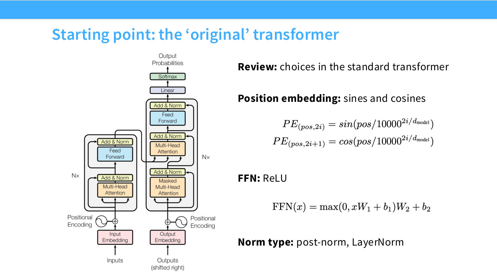
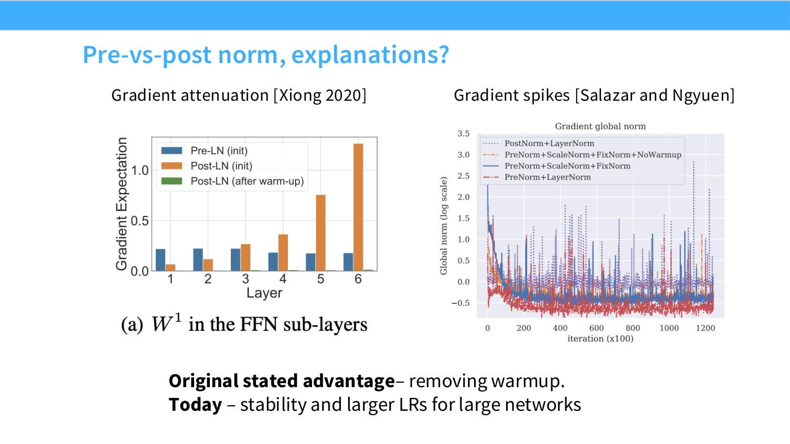
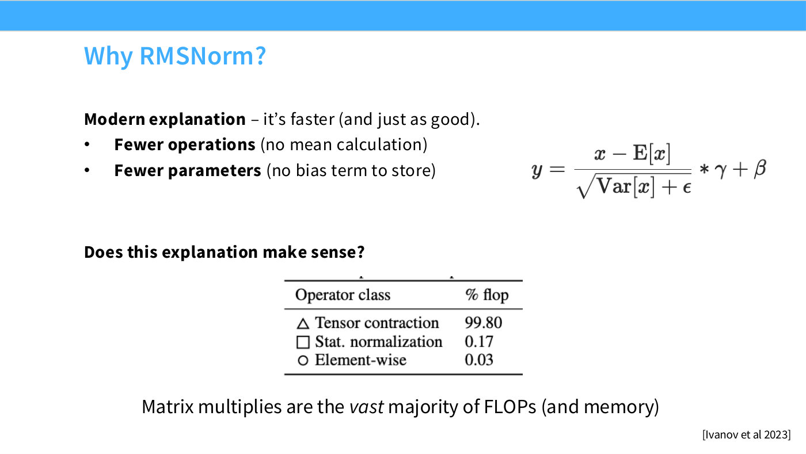
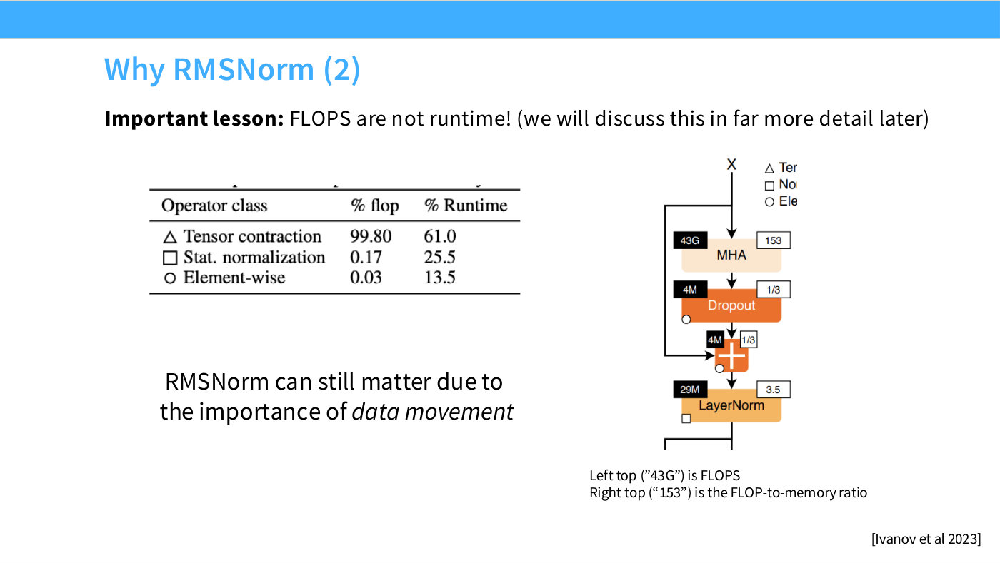
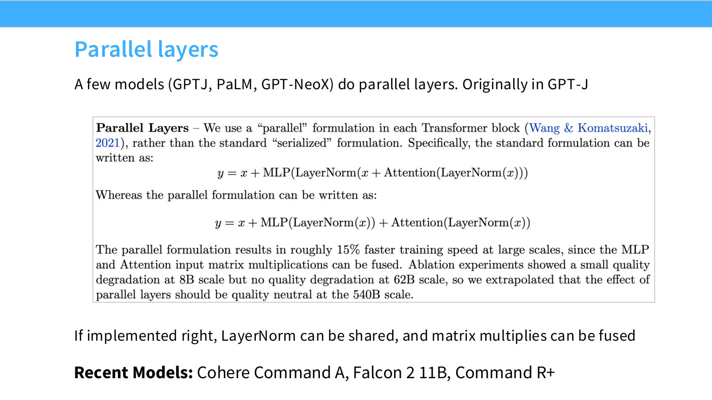
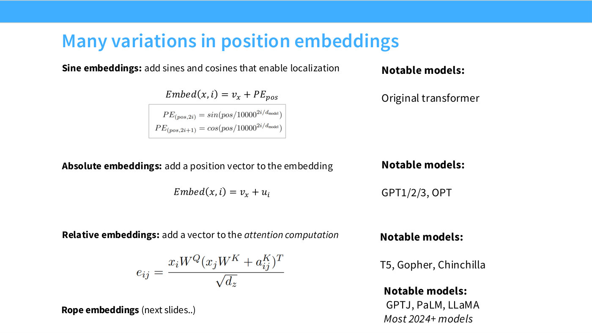
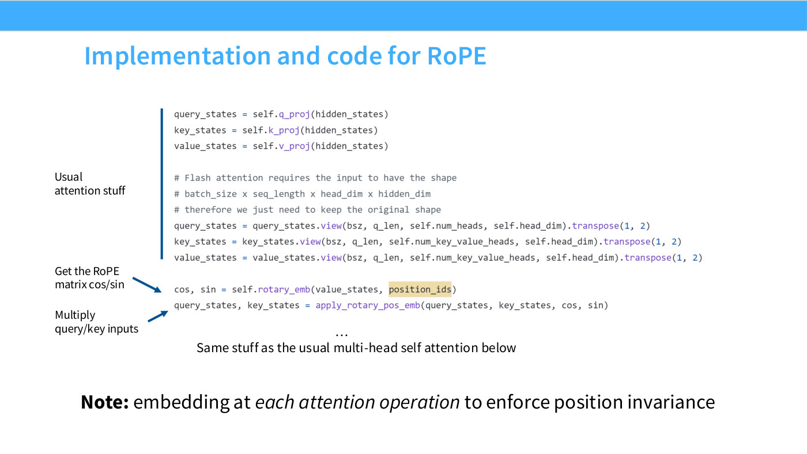
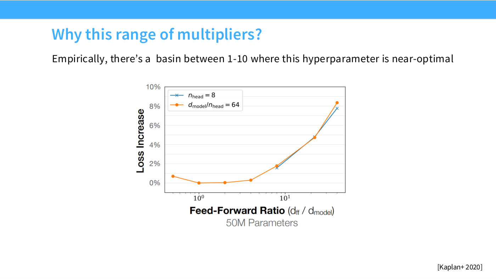
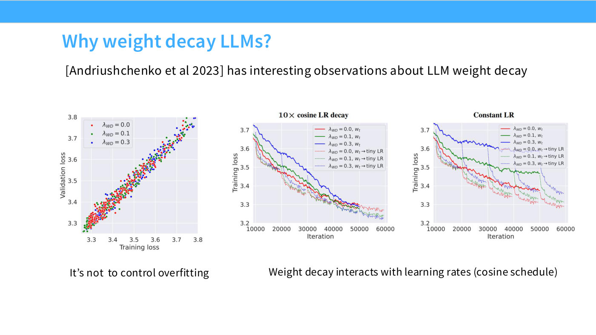
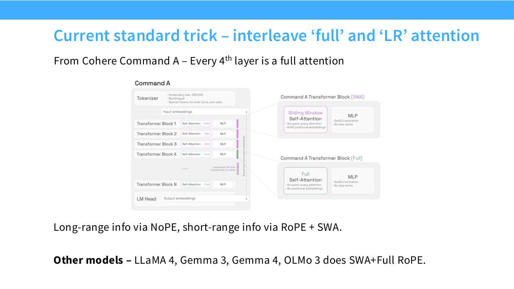

# Lecture 3 — Architectures

*"Everything you didn't want to know about LM architecture and hyperparameters"* —
Tatsunori Hashimoto's own title for the lecture (slide 1), and a fair warning about
its method.

This is the lecture that answers the questions assignment 1 raises but does not
justify: why the layer norm moved to the front of the block, why you are asked to
implement RoPE instead of sinusoids, why SwiGLU instead of ReLU, and why the linear
layers have no bias terms. The answer in each case turns out to be neither a
theorem nor a single decisive experiment, but a **convergence of practice across
forty-odd models**, usually driven by a systems consideration rather than by
expressiveness.

It is also the first CS336 lecture in this knowledge base taught from a
conventional slide deck rather than an executable Python program — see
[executable lectures](executable-lectures.md) for why that distinction matters here.

## The method, and why it is what it is

Hashimoto opens by admitting the subject is "pretty inscrutable" ([0:05]) and that
he would prefer a world in which architecture could be reasoned about from theory:

> I think we all wished we lived in a world where the only things you had to know
> were like VC dimension or something — very simple, theoretical tools — but that's
> not really where we are.

So the lecture is a survey. Slide 2 states the theme: the best way to learn is
hands-on experience, and **the second best is to learn from other people's**. The
whole lecture is organized around a database of what every major dense model has
actually done — see [the model architecture survey](model-architecture-survey.md),
which explains the table and where each of its five views appears.

The framing that makes the rest cohere is at [5:26]. An architecture has three jobs
at once: it has to **generalize** from data, it has to **train efficiently on GPUs**,
and it has to **not blow up**. "All these different requirements end up getting
baked straight into the architecture. And that's why these things are a little bit
messy and a little bit complex." Almost every choice below is one of those three
pressures winning.

## What changed since the original transformer

Slide 3 shows the 2017 encoder–decoder with its sinusoidal position encodings, ReLU
feedforward and post-norm placement. Slide 4 shows the assignment-1 model beside it.
Four differences, and the rest of the lecture is an explanation of each:

*Slide 3 — Starting point: the 'original' transformer. [Deck](https://github.com/stanford-cs336/lectures/blob/main/lecture_03.pdf)*

*Slide 4 — What you implemented – simple, modern variant. [Deck](https://github.com/stanford-cs336/lectures/blob/main/lecture_03.pdf)*

| | Original (2017) | Modern (what you implement) |
| --- | --- | --- |
| Norm placement | post-norm, in the residual stream | **pre-norm**, on the branch |
| Norm type | LayerNorm | **RMSNorm** |
| Position | sines and cosines | **RoPE** |
| Feedforward | ReLU, with biases | **SwiGLU**, no bias terms |

Hashimoto's honest answer to "why did we pick these?" ([2:22]) is worth quoting,
because it is the lecture's thesis in miniature: "One reason is we've copied a lot of
this over from LLaMA, but so did everyone else."

A striking observation follows at [29:11], after the architecture section is done:

> the fact that this is so short should suggest to you how much the original
> transformer formulation has somewhat stood the test of time — because the only
> thing I'm really talking about changing here is where the norms go, or whether we
> have bias terms, or whether we gate the MLPs.

## Normalization

Two independent questions — *where* the norm goes and *what* it computes — and the
field has converged on both.

**Where: outside the residual stream.** The original transformer puts LayerNorm on
the residual path; every modern model puts it on the branch, so that the residual
stream runs unbroken from input to output. The design heuristic is *keep your
residual stream clean* ([10:48]), and it is justified by gradient propagation
(slide 12's bar chart shows pre-norm gradients roughly constant across depth while
post-norm ones grow by more than an order of magnitude) and by stability (slide 12's
gradient-norm chart, where post-norm has both the highest baseline and the tallest
spikes). The sole exception in the survey is OPT-350M, which Hashimoto cannot
explain ([8:29]). Recent models add a second norm *after* the sublayer, still off the
residual path — the "double norm" or non-residual post-norm of Grok, Gemma 2 and
OLMo 2. Full treatment: [pre-norm and post-norm](pre-norm-and-post-norm.md).

*Slide 12 — Pre-vs-post norm, explanations? [Deck](https://github.com/stanford-cs336/lectures/blob/main/lecture_03.pdf)*

**What: RMSNorm, for systems reasons.** RMSNorm drops LayerNorm's mean subtraction
and bias, making it strictly *less* expressive — "there's really no representational
reason why you have to use RMSNorm" ([13:52]). The argument is entirely about data
movement, and it is the lecture's cleanest link back to Lecture 2. Normalization is
**0.17% of a transformer's FLOPs but 25.5% of its runtime** (slides 15 and 16),
because it reads and writes whole activation tensors to do almost no arithmetic —
low [arithmetic intensity](arithmetic-intensity.md). Slide 16 tags multi-head
attention at intensity 153 against LayerNorm at 3.5. Dropping bias terms follows the
same logic. Full treatment: [RMSNorm and dropping bias terms](rmsnorm.md).

*Slide 15 — Why RMSNorm? [Deck](https://github.com/stanford-cs336/lectures/blob/main/lecture_03.pdf)*

*Slide 16 — Why RMSNorm (2). [Deck](https://github.com/stanford-cs336/lectures/blob/main/lecture_03.pdf)*

## Activations

The feedforward nonlinearity, and the one change here that appears to buy real
quality rather than just speed. A **gated linear unit** multiplies the activated
projection entrywise by a second linear projection of the same input:

$$\mathrm{FF}_{\mathrm{ReGLU}}(x) = \big(\max(0, xW_1) \otimes xV\big)\,W_2$$

Name the base activation, append GLU: ReGLU, GeGLU, SwiGLU. Two independent
parameter-matched studies (Shazeer 2020 on slide 24, Narang et al. 2020 on slide 25)
agree that gated variants beat ungated ones consistently, if modestly — SwiGLU takes
the lowest final loss at 1.789 against 1.838 for a vanilla ReLU transformer. Google
lineages use GeGLU, LLaMA lineages SwiGLU, and Hashimoto's view is that between them
"it doesn't really matter" ([23:50]).

*Slide 24 — Do gated linear units work? [Deck](https://github.com/stanford-cs336/lectures/blob/main/lecture_03.pdf)*

*Slide 25 — Do gated linear units work (2)? [Deck](https://github.com/stanford-cs336/lectures/blob/main/lecture_03.pdf)*

The piece of trivia that becomes a hyperparameter: gating adds a third matrix, so
$d_{ff}$ is conventionally scaled **down by 2/3** to keep the parameter count
matched. Full treatment: [gated activations](gated-activations.md).

## Serial versus parallel blocks

A short section, and the lecture's one clear example of an idea that was tried and
mostly abandoned. A standard block computes attention, then the MLP. The parallel
formulation, from GPT-J and adopted by PaLM, computes both from the same normalized
input and adds both to the residual stream (slide 28):

*Slide 28 — Parallel layers. [Deck](https://github.com/stanford-cs336/lectures/blob/main/lecture_03.pdf)*

$$y = x + \mathrm{MLP}(\mathrm{LayerNorm}(x)) + \mathrm{Attention}(\mathrm{LayerNorm}(x))$$

PaLM reported roughly **15% faster training at large scale**, because the layer norms
can be shared and the input matrix multiplies fused, with "a small quality
degradation at 8B scale but no quality degradation at 62B scale."

It has since fallen out of use, and Hashimoto's explanation ([28:25]) is a good
illustration of how these tradeoffs shift: "optimization of the serial form has
gotten sufficiently good that the systems gains from the second one just isn't worth
the small hits to representation power." His intuition for the cost: "you can think
about it as you've lost half of your depth."

Asked how big the accuracy difference actually is ([40:42]), he is direct about the
state of the evidence: PaLM was confident there was none, later Google models
stopped using it — which you can read as an implicit signal — and "no one's done the
ablations, as far as I know." Cohere's Command A and Falcon 2 11B are the visible
current users.

## Position embeddings and RoPE

Attention is permutation-invariant, so position has to be injected deliberately
([31:29]). Slide 30 surveys four schemes — sines, absolute, relative, and RoPE — and
RoPE is what essentially every post-2024 model uses.

*Slide 30 — Many variations in position embeddings. [Deck](https://github.com/stanford-cs336/lectures/blob/main/lecture_03.pdf)*

The design constraint is that the inner product should depend only on the *relative*
offset:

$$\langle f(x, i), f(y, j) \rangle = g(x, y, i - j)$$

and the trick is that **inner products are invariant to rotation**. Encode position
as a rotation proportional to the index; rotate every consecutive pair of coordinates
in its own 2-D plane, with a different frequency per pair. Then two adjacent tokens
have the same relative angle wherever they sit in the sentence. Hashimoto works this
through with "we know that" against "of course we know" ([34:33]–[35:19]).

Because the rotation *multiplies* rather than *adds*, there are no cross terms
leaking absolute position — which is precisely what sinusoidal embeddings fail at.
RoPE is applied to queries and keys at **every attention operation**, not once at the
bottom of the network (slide 35). Full treatment: [RoPE](rope.md), which also covers
the p-RoPE and NoPE variants that the 2026 hybrid models depend on.

*Slide 35 — Implementation and code for RoPE. [Deck](https://github.com/stanford-cs336/lectures/blob/main/lecture_03.pdf)*

## Hyperparameters

The middle third of the lecture, and its most quotable finding: most of these are
**forgiving**, everyone has converged on similar values, and what decides the choice
is usually a systems argument ([53:45]).

- **Feedforward ratio** $d_{ff} = 4\,d_{model}$, or $\tfrac{8}{3}d_{model}$ for gated
  models. Kaplan et al.'s sweep (slide 40) shows a flat basin from ratio 1 to about
  4 and a steep climb beyond. T5's 64× multiplier is the spectacular exception —
  and T5 v1.1 quietly went back to 2.5.
- **Head dimension** $n_{head} \times d_{head} = d_{model}$, standard but, in the
  deck's own words, with "low to no validation."
- **Aspect ratio** $d_{model}/n_{layer} \approx 100$. The reason is parallelism:
  depth forces pipeline parallelism, which "most people really, really do not want
  to deal with," while width is handled by the much simpler tensor parallelism
  ([52:58]).
- **Vocabulary** 30–50k for monolingual models, 100–250k for multilingual and
  production systems.
- **Regularization** — and this is the surprise. Weight decay remains common in
  pretraining even though single-pass training does not overfit. The resolution
  (slide 50) is that **weight decay is not acting as a regularizer at all**: it does
  not separate training from validation loss, but it does interact with
  learning-rate decay to reach a better final minimum.

*Slide 40 — Why this range of multipliers? [Deck](https://github.com/stanford-cs336/lectures/blob/main/lecture_03.pdf)*

*Slide 50 — Why weight decay LLMs? [Deck](https://github.com/stanford-cs336/lectures/blob/main/lecture_03.pdf)*

Full treatment: [transformer hyperparameters](transformer-hyperparameters.md).

## Stability

An emphasis of the last few years, and one with a different risk profile from
everything above. Get a hyperparameter wrong and you lose a fraction of a percent
of loss; lose stability and you may lose the run. "You might have spent millions of
dollars in training, and you get to a point where the model is no longer able to be
trained any further" ([1:05:21]).

Slide 52's warning is subtler than it first appears: the run you should not want is
the one with the **lower** loss, because its gradient-norm trace is spiking with
increasing density throughout training.

*Slide 52 — Stability tricks. [Deck](https://github.com/stanford-cs336/lectures/blob/main/lecture_03.pdf)*

The usual suspect is the softmax, which contains both an exponential and a division
([1:06:07]), and a transformer has two of them. Each gets a fix:

- **z-loss** penalizes $\log^2 Z$ to hold the output softmax's normalizer near 1.
- **QK norm** normalizes queries and keys before the attention softmax — the
  "sprinkle in layer norms" heuristic applied one level deeper.
- **Logit soft-capping** bounds the logits through a scaled $\tanh$. Unlike the
  other two, it measurably costs quality (slide 56).

*Slide 56 — Logit soft-capping. [Deck](https://github.com/stanford-cs336/lectures/blob/main/lecture_03.pdf)*

Full treatment: [training stability](training-stability.md).

## Attention heads, and long context

The final section, and the one motivated by **inference** rather than training.
During training or prefill, attention has good [arithmetic
intensity](arithmetic-intensity.md). During incremental decoding with a KV cache it
does not — the projection term in the memory accounting goes from $d^2$ to $nd^2$,
giving an intensity of $O((n/d + 1/b)^{-1})$ that wants large batches and *short*
sequences, exactly the wrong shape for long-context serving (slide 60).

**MQA** shares one key and value across all heads, dividing the offending $n/d$ term
by the head count, at a real cost in expressiveness. **GQA** interpolates — fewer
keys and values than queries, but more than one — and the tradeoff turns out to be
favourable enough that nearly every current model uses it.

Separately, full attention is quadratic in sequence length, and the current answer
is to **interleave**: cheap sliding-window attention on most layers, full attention
every fourth (slide 65, Cohere Command A), often with different position embeddings
on each kind of layer. LLaMA 4, Gemma 3, Gemma 4 and OLMo 3 all do a version of this.
Hashimoto marks this as unsettled: it "is still an active area of investigation —
it's a place where the most architecture work and changes are still being done"
([1:26:49]). Full treatment: [attention variants](attention-variants.md).

*Slide 65 — Current standard trick – interleave 'full' and 'LR' attention. [Deck](https://github.com/stanford-cs336/lectures/blob/main/lecture_03.pdf)*

## What this lecture does not cover

State-space models, linear-time attention, and mixtures of experts are all deferred
to Lecture 4 ([29:58], [1:13:47]). Hashimoto notes at [3:54] that most of the recent
model releases are in fact MoEs, so the survey here is deliberately restricted to
**dense** architectures.

Inference mechanics beyond the arithmetic-intensity argument are Percy Liang's, later
in the course ([1:22:56]).

## Sources for this page

- [Slide deck, all 67 pages transcribed](../raw/slides/03-architectures.md) —
  `lecture_03.pdf`. Slide numbers cited above are PDF page numbers; the deck prints
  no page numbers of its own.
- [Copy-edited transcript](../raw/transcripts/03-architectures.md) — timestamps
  cited above index this file.
- The deck is linked at its canonical URL in [sources.md](../sources.md); PDFs are
  not committed to this repo.
