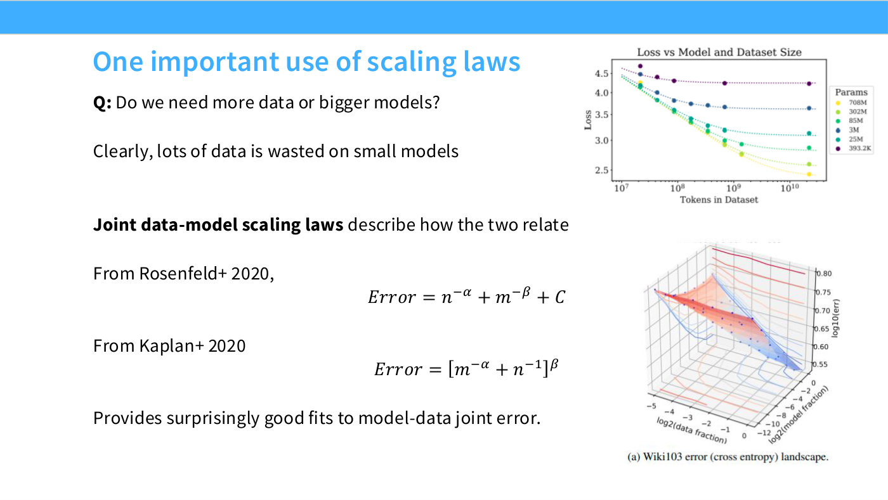
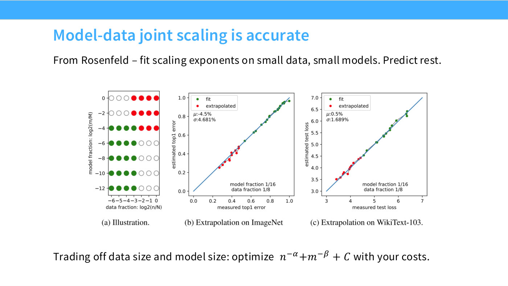
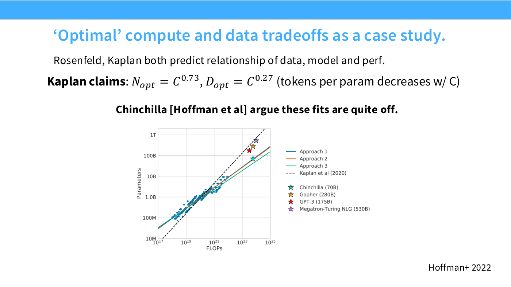
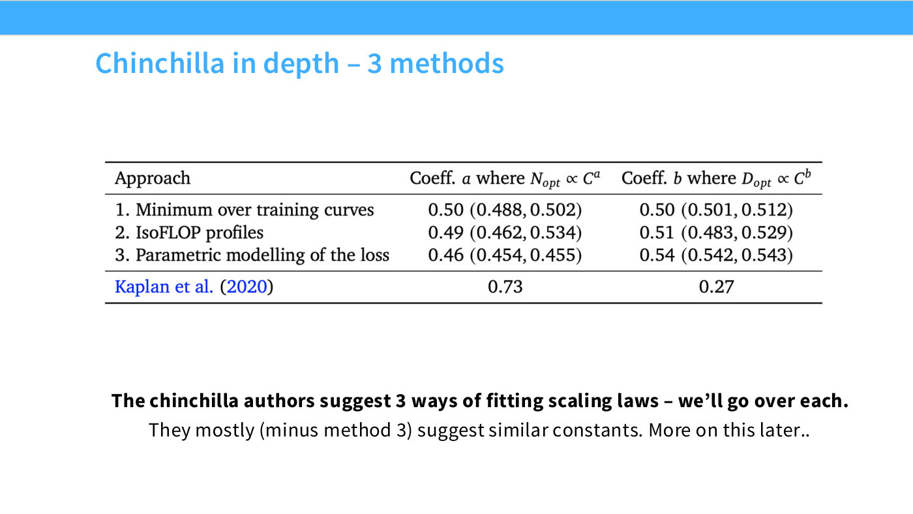
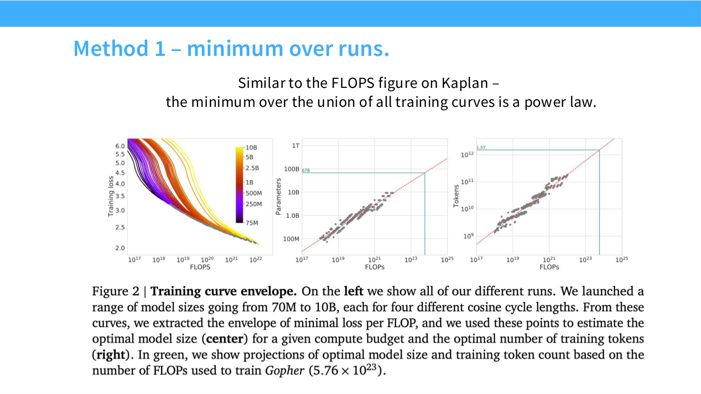

# Lecture 9 — Scaling laws (basics)

**Tatsunori Hashimoto.** The first of two scaling-laws lectures, and the point
where the course leaves systems behind: "we're now leaving — well, temporarily
leaving — the land of systems to talk about more deep learning stuff" ([0:05]).
The advanced treatment comes two lectures later;
[inference](10-inference.md) is spliced in between for scheduling reasons, so the
order runs scaling laws, inference, scaling laws again.

- **Course material:** [`lecture_09.pdf`](https://github.com/stanford-cs336/lectures/blob/main/lecture_09.pdf), 57 pages, transcribed at [`raw/slides/09-scaling-laws.md`](../raw/slides/09-scaling-laws.md)
- **Transcript:** [`raw/transcripts/09-scaling-laws.md`](../raw/transcripts/09-scaling-laws.md)

## What this lecture establishes

A scaling law is a **simple predictive rule for extrapolating small-scale
behaviour to large-scale behaviour** ([3:08]). The motivating scenario is
deliberately concrete: a wealthy friend hands you 10,000 B200s for a month and
asks for a good open-source model ([0:51]). You have one shot, the run costs
millions, and the naive approach — tune hyperparameters by doing multiple runs at
full scale — is exactly what you cannot afford ([3:08]).

So you do all your optimisation at small scale and extrapolate. The lecture makes
three claims about that programme, in increasing order of how much trouble they
cause:

1. **Log-linear regularity is real and pervasive.** Plot log loss against log of
   almost any resource — data, parameters, compute, even MoE sparsity — and you
   get a line ([1:16:48]).
2. **The regularity is engineered, not given.** "Scaling laws aren't magic… that scaling laws — and this kind of predictability
   across scales — is engineered, it doesn't happen automatically" ([38:26]). Picking the right x-axis and getting the
   hyperparameters right is most of the work.
3. **Small methodological choices move the answer a lot.** The Kaplan–Chinchilla
   disagreement — a factor of several in how big your model should be — comes down
   to parameter counting, learning-rate warm-up and batch size ([1:08:22]).

The through-line of the whole lecture is a single empirical observation that
Hashimoto flags as surprising every time it appears: **interventions move the
intercept, not the slope.** It holds for data mixtures ([22:19]), for
regularisation and ensembling ([26:55]), and even for Adam versus SGD — "it's rare
to get different slopes, even with an intervention as big as SGD versus Adam"
([35:21]).

## Part 1 — prehistory

Scaling laws are much older than neural scaling, and the lecture spends its first
ten minutes establishing that ([3:55]–[10:01]).

The theoretical ancestor is the **generalization bound**, which already gives you
loss as a function of sample size ([4:41]–[5:27]). The first paper that is
recognisably a data scaling law is from **Bell Labs in 1993** — Corinna Cortes,
Vladimir Vapnik and colleagues — fitting classifiers on small samples, fitting a
curve to how error decays, and using it to estimate performance without paying for
the large run ([5:27]–[6:14]). That is, almost literally, the modern method.

Then the NLP lineage: **Banko and Brill** as the canonical argument that collecting
more data beats algorithm development ([7:00]), and **Kolachina et al. 2012**,
which asked what functional form BLEU follows as translation training data grows
and arrived at the same power laws used today ([7:45]).

The paper Hashimoto singles out as underrated is **Hestness et al. 2017** ([8:30]):
data scaling laws across speech recognition, machine translation and language
modelling, showing polynomial trends across domains, three years before the OpenAI
work. It also anticipated emergence, compute scaling, and the consequence that
"speed and systems optimization is going to turn into accuracy" ([9:15]) — the
premise of this entire course. His summing-up: these phenomena "were known far
before the modern era… it's possible to have known the regime we're in even before
seeing these large language models" ([10:01]).

## Part 2 — data scaling laws

### The observation

Fix the training procedure, keep the model much larger than the dataset, grow the
dataset, and plot log test loss against log data. The points fall on a line
([14:35]). "Much larger" is quantified later: roughly 10× is enough to stay in the
power-law regime rather than the irreducible-error regime ([20:46]).

A line on a log-log plot means the error decays **polynomially**, and it also means
you are far from the asymptote — near the noise floor the curve tapers instead
([15:22]).

### Why a power law — the mean-estimation argument

The derivation is deliberately elementary ([16:09]). Estimate the mean of
$x_1,\dots,x_n \sim N(\mu,\sigma^2)$ by the empirical mean. The expected squared
error is

$$\mathbb{E}\,\|\hat\mu - \mu\|^2 = \frac{\sigma^2}{n}$$

Take logs and you have a line against $\log n$. The general statement: anything of
the form

$$\text{error} \;\approx\; \frac{1}{n^{\alpha}} + c$$

gives a scaling law once you subtract the constant ([16:09]). Parametric estimation
gives $\alpha = 1$, so classical models should show **slope $-1$** ([16:54]).

### The exponent mystery

Fitted neural exponents are nothing like $-1$. Hashimoto reads roughly $-0.1$,
$-0.3$ and $-0.1$ off the Hestness and Kaplan plots ([17:41]) — still polynomial,
but far slower.

Where would such a rate come from? Non-parametric estimation ([18:28]). To estimate
an arbitrary smooth function on the unit cube, chop the space into boxes; in $D$
dimensions the error goes as

$$\text{error} \;\approx\; n^{-1/D}$$

giving slope $-1/D$. So a fitted exponent near $-0.1$ says the network is learning
about as fast as **a non-parametric estimator in roughly 10 dimensions** ([19:16]).
Bahri et al. and others push this further, arguing the exponents literally reveal
non-parametric smoothing over the data's intrinsic dimension. Hashimoto flags his
own hesitation — "I don't quite know how much I truly buy this argument… some of
the evidence might be a little sketchy — it relies on estimators of intrinsic
dimension" ([20:01]).

See [data scaling laws](data-scaling-laws.md) for the full treatment.

### What data scaling laws are good for

On their own, not much: they tell you how fast the model learns, "which is useful
for forecasting but not for much else" ([21:33]). The engineering questions are
about **composition** — what mixture, whether to repeat, what to filter.

The lever is the slope/intercept split ([22:19]): dataset composition moves the
*offset*, while the *slope* is set by the model class. That single fact underwrites
three separate literatures:

- **[Data mixture selection](data-mixture-selection.md)** — fit mixture performance
  at small scale and extrapolate ([23:05]). In practice the noise is worse than the
  idealisation suggests, and DataDecide found that simply picking the best mix at
  small scale works ([24:38]) — which is what you would expect if slopes really
  do not change.
- **[Data repetition](data-repetition.md)** — up to about **four epochs** you are
  not hurt at all; past that the realised curve falls away from the fresh-data
  projection, and by about 40 epochs repeating is worthless ([25:23], slide 24).
- **Scale-dependent filtering** — the optimal filter is not a fixed property of
  the data. With little compute you filter aggressively to the highest-quality
  slice; with a lot of compute you loosen the filter rather than repeat that slice
  ([27:41]).

*Slide 24 — Scaling laws under data repetition. [Deck](https://github.com/stanford-cs336/lectures/blob/main/lecture_09.pdf)*

## Part 3 — scaling laws for model engineering

The move here is from forecasting to **design**: use scaling trends to make
architecture and hyperparameter decisions without training the big model ([29:59]).

- **Architecture.** Train transformers and LSTMs across a range of compute budgets
  and compare the lines ([31:30]). LSTMs show a worse intercept and possibly a
  worse slope, and a worse slope is disqualifying — "as you scale up larger and
  larger, your model will eventually do worse" ([32:16]). Every modern architecture
  paper now ships this plot. The reference study is **Tay et al. 2022** on T5
  variants, which Hashimoto likes because its small-scale verdicts match what
  frontier models actually adopted: gated linear units in, Performer-style
  efficient attention out ([33:48]). The paradigm in one sentence: "if it doesn't
  show up in the scaling law, it's not a good intervention" ([34:35]).
- **Optimizer.** Adam versus SGD, from Hestness: different intercepts, near-identical
  slopes ([34:35]).
- **Depth and width.** One layer is catastrophic; beyond that, more layers help at
  every compute level ([36:07]). The better move is to find **scale-invariant**
  quantities — layer count is not one, but the aspect ratio $d_{model}/n_{layer}$
  roughly is, with minima around 100 and only a mild drift toward deeper models
  ([36:07]–[36:54]). See [transformer hyperparameters](transformer-hyperparameters.md).
- **Not all parameters are equal.** Kaplan got "very funky-looking" curves including
  embedding parameters and so counted only non-embedding ones ([37:40]). This looks
  like housekeeping and turns out to be the hinge of the whole Chinchilla dispute.
- **MoE.** With total and active parameters decoupled, the question becomes what a
  parameter is worth ([39:12]). The IsoFLOP surfaces show optimal models getting
  **sparser** as they grow, and that adding inactive parameters at fixed active
  count still lowers loss ([39:57]–[40:42]). See [mixture of experts](mixture-of-experts.md).

### The two things you always have to re-tune

Most choices you inherit. "You're probably not radical enough to switch to an
LSTM" ([40:42]). Two you cannot inherit: **batch size and learning rate** ([41:27]).

**[Critical batch size](critical-batch-size.md)** gets the fuller treatment
([42:12]–[47:37]). Below it you are **noise-limited** — every extra example cuts
gradient variance and buys close to perfect returns. Above it you are
**bias-limited**: gradient descent only sees local structure, so there is an
irreducible disagreement between the descent direction and the global optimum, and
no amount of variance reduction fixes that ([42:59]). The critical batch size is
the crossover.

The estimation recipe ([44:32]): fix a target loss, sweep batch sizes, record the
steps $S$ and examples $E$ needed to reach it. They trade off against each other,
normalised by their minima $S_{min}$ and $E_{min}$; balancing the two terms gives

$$B_{crit} = \frac{E_{min}}{S_{min}}$$

which costs you slightly more steps and slightly more examples than either extreme
but balances both ([46:05]). And the reason it belongs in this lecture: as the
target loss improves, $B_{crit}$ **grows as a power law** ([47:37]). Large runs can
use large batches — which makes sense, since near the minimum you are resolving
finer differences and noise matters more.

**Learning rate** is previewed rather than settled ([48:23]). Width scaling wants a
smaller learning rate as the model grows, with a $1/\text{width}$ rule of thumb
([49:08]). The alternative is to reparameterise so the optimum stops moving —
**muP** ([49:54]). The two philosophies are, in short, predicting where the minimum goes versus
making the minimum stay put; both have been used successfully at scale, though
"anecdotally, it does seem like more people are favoring the scaling law approach"
([50:41]). See [learning rate scaling and muP](learning-rate-scaling-and-mup.md).

### The caution: upstream is not downstream

The most important warning in the lecture ([50:41]–[52:13]). Perplexity against
parameters is "a very beautiful linear trend". Downstream accuracy is not: in Tay
et al. 2023 the best downstream model on SuperGLUE is **NL32-XL**, which is only
mid-pack on perplexity ([51:27]).

> **Read the slide carefully here.** The reshuffling is real but it is *partial*.
> NL32-XL rises from mid-table to first. The best upstream model, NL12-, does
> **not** fall to mid-pack — at ≈77.9 it is still about 2nd–3rd of 13 downstream.
> The KB's first transcription of slide 41 got this backwards; see the note in
> [upstream vs downstream](upstream-vs-downstream.md).

*Slide 41 — Caution – scaling behaviors can differ downstream. [Deck](https://github.com/stanford-cs336/lectures/blob/main/lecture_09.pdf)*

Hashimoto calls it "probably one of the worst correlations I've seen from upstream
to downstream" and draws the practical rule: fit scaling laws on the clean,
low-variance perplexity signal, then argue separately about transfer ([55:15]).
The anecdote about post-training colleagues — handed a model with good perplexity
and told "it's all your problem now" — is the reason he presses the point ([52:13]).

On variance, asked how many runs go into each point: almost always **one** ([53:44]).
Perplexity is clean enough that reruns differ in the second decimal. Learning-rate
and critical-batch-size scaling laws are another matter — "you will see some truly
horrendous stuff" — and variance reduction there is less common than it should be
([54:30]).

## Part 4 — compute-optimal scaling

### The question

More data or a bigger model? The budget is compute, and from lecture 1's
accounting, $C \approx 6ND$ ([56:47], see [training FLOPs](training-flops.md)).
Pouring data into a tiny model is visibly wasted — its curve flattens early
([57:32]).

### Joint scaling laws

Kaplan and Rosenfeld proposed near-equivalent joint forms almost simultaneously
([58:20]). Rosenfeld's is the sum of two independent scaling terms; Kaplan's is
slightly more involved (slide 43):

*Slide 43 — One important use of scaling laws. [Deck](https://github.com/stanford-cs336/lectures/blob/main/lecture_09.pdf)*

$$\text{Error} = n^{-\alpha} + m^{-\beta} + C
\qquad\qquad
\text{Error} = \left[m^{-\alpha} + n^{-1}\right]^{\beta}$$

The sanity check Hashimoto recommends for any scaling law — **take the limits**
([59:06]). Infinite data kills the data term and leaves a pure model-size law;
infinite model size leaves a pure data law. Both behave correctly.

These fit well enough to extrapolate: fit on the small-model, small-data corner and
predict the rest of the grid accurately (slide 44, [59:06]). Then compute-optimal
allocation is just a constrained optimisation — minimise the joint form subject to
the FLOP budget ([59:53]).

*Slide 44 — Model-data joint scaling is accurate. [Deck](https://github.com/stanford-cs336/lectures/blob/main/lecture_09.pdf)*

### Kaplan's answer, and the era of giant models

$$N_{opt} \propto C^{0.73} \qquad D_{opt} \propto C^{0.27}$$

so tokens per parameter *decreases* with compute: spend new compute mostly on
parameters (slide 45). This is why "there was a period where everyone was training
these gigantic models, hundreds of billions of parameters, trillion-parameter dense
models" ([1:00:40]).

*Slide 45 — 'Optimal' compute and data tradeoffs as a case study. [Deck](https://github.com/stanford-cs336/lectures/blob/main/lecture_09.pdf)*

> In the lecture Hashimoto initially reads these exponents the wrong way round, then
> corrects himself mid-sentence — "is that reversed? I think it's reversed" ([1:00:40]).
> Slide 45 settles it: $N_{opt} = C^{0.73}$. The edited transcript preserves the
> self-correction as spoken.

### Chinchilla's three methods

Hoffmann et al. 2022 argued those fits were badly off, and answered with three
independent estimators — which Hashimoto praises as robustness against your own
modelling assumptions ([1:02:12]). Slide 46's table:

*Slide 46 — Chinchilla in depth – 3 methods. [Deck](https://github.com/stanford-cs336/lectures/blob/main/lecture_09.pdf)*

| Approach | $a$ where $N_{opt} \propto C^{a}$ | $b$ where $D_{opt} \propto C^{b}$ |
|---|---|---|
| 1. Minimum over training curves | 0.50 | 0.50 |
| 2. IsoFLOP profiles | 0.49 | 0.51 |
| 3. Parametric modelling of the loss | 0.46 | 0.54 |
| Kaplan et al. 2020 | 0.73 | 0.27 |

**Method 1 — minimum over runs** ([1:02:59]). Take the lower envelope of all
training curves: each envelope point is the best loss achieved at that FLOP count,
and each carries a model size. Scatter those and fit. For Gopher's budget this
predicts **67B parameters** and 1.5T tokens (slide 47). Finding the envelope
reliably is the fiddly part.

*Slide 47 — Method 1 – minimum over runs. [Deck](https://github.com/stanford-cs336/lectures/blob/main/lecture_09.pdf)*

**Method 2 — [IsoFLOPs](isoflop-method.md)** ([1:04:31]), and Hashimoto's own
favourite. Pick a set of FLOP budgets; at each, sweep the parameter/data trade-off
at fixed compute — double the data, halve the model — and watch terminal loss trace
a parabola. Take each parabola's minimum, or fit a quadratic and take that minimum,
and regress against FLOPs. Answer: **63B parameters** — close agreement with
method 1.

**Method 3 — joint parametric fit** ([1:05:16]). Fit the hypothesised loss surface
directly by curve fitting. The most natural approach and the most delicate: "how
you do the curve fitting is very important — you're fitting these surfaces, there
are many variables, it's kind of tricky."

Methods 1 and 2 agree on roughly equal exponents, which is where the famous
**20 tokens per parameter** comes from ([1:01:26]).

### Why Kaplan and Chinchilla disagree

Not because either did something crazy — "they both did pretty reasonable stuff"
([1:06:50]). Two papers take it apart, and the lecture treats this as the real
lesson of the section.

**Porian et al., *Resolving Discrepancies in Compute-Optimal Scaling of Language
Models*** (Yair Carmon last author, a former Stanford student) reproduce Kaplan and
then walk the curve to Chinchilla in three steps ([1:07:36]–[1:09:54]):

1. **Parameter counting.** Kaplan excluded embedding parameters — defensible — but
   also excluded the final softmax layer, on the grounds that it is dual in shape
   to the input embedding. Whether you count those materially changes the law.
2. **Learning-rate warm-up.** Kaplan's smallest models were so small they had not
   converged by the time warm-up finished, so their learning rates were badly set.
   Hashimoto calls this "much more of an oversight than a genuine difference of
   opinion".
3. **Batch size.** Kaplan fixed one large batch size, which is suboptimal for the
   small models. Tune it per model and you land on Chinchilla exactly.

**Pearce and Song, *Reconciling Kaplan and Chinchilla Scaling Laws*** take a
cleverer route: train nothing at all ([1:10:41]). Simulate training curves from
Chinchilla's own fitted form, then ask what Kaplan would have measured under
Kaplan's conventions. Their diagnosis is slightly different — Kaplan operated at a
much lower compute scale and was therefore sensitive to small changes, and the
non-embedding parameter count introduces a nonlinearity that is enough to break the
result at that scale ([1:11:27]).

The generalisable point: **a scaling law is a lower bound on a recipe** ([1:09:54]).
"If you're scaling up a recipe you don't actually want to scale up — your warm-up
is crazy, or your batch sizes are crazy — you're going to get bad scaling laws."

### The method-3 mystery, and its resolution

Chinchilla's own method 3 never agreed with methods 1 and 2, and its authors were
"pretty unperturbed" ([1:12:13]). The implication is not small: different exponents
mean that asymptotically you end up with far more tokens than parameters, a
qualitatively different prescription.

**Epoch AI** could get neither the raw data nor the code, so they extracted the data
from the paper's own plots and refitted ([1:13:00]). The original fit was
**underfit**; refitting gives lower losses and recovers almost exactly the
20-tokens-per-parameter rule. Hashimoto's verdict, which is the nicest line in the
lecture: "in the end, it turns out the authors were more right than they knew"
([1:13:46]).

### Why you probably do not want the Chinchilla ratio

Compute-optimal means *training*-compute-optimal, and that is not the budget that
matters ([1:14:32]). Most of a frontier lab's compute goes to R&D and serving, not
to the training run, and for serving you want a small capable model, not a bloated
one. So you deliberately **overtrain** — "I put that in quotes, because really,
overtraining is what we want, that's the right amount of training".

The trajectory: GPT-3 at 3 tokens per parameter was undertrained; Chinchilla moved
the field to 20; that held while models were not yet served at scale; then serving
became real and the ratio climbed well past 20, alongside the shift to MoEs
([1:15:17]). The value of Chinchilla is not the constant — "it tells us quite a bit
about how we should fit scaling laws, and how to think about scaling laws".

## What endures: IsoFLOPs

The closing methodological note ([1:16:03]). IsoFLOPs are easy to execute — fix a
budget, sweep every remaining degree of freedom, look at the surface — and they
have kept working far outside their original setting: diffusion models, and the MoE
sparsity study earlier in this lecture. "If you're ever in a situation where you're
thinking, 'how am I going to decide all these tradeoffs?', IsoFLOPs is always a
good default."

## Recap

The lecture's own summary ([1:16:48]): a log-linear regularity between resources in
and performance out, extending across parameters, compute and MoE sparsity, which
lets you make design decisions on evidence rather than by picking from a hat — and
lets you do engineering at scale without repeatedly running the big job.

## Topics from this lecture

- [Data scaling laws](data-scaling-laws.md) — the univariate law, and why the exponent is what it is.
- [Compute-optimal scaling](compute-optimal-scaling.md) — Kaplan, Chinchilla, and the reconciliation.
- [The IsoFLOP method](isoflop-method.md) — the sweep that keeps working.
- [Critical batch size](critical-batch-size.md) — now with the optimisation view, not just the systems one.
- [Learning rate scaling and muP](learning-rate-scaling-and-mup.md) — the two philosophies.
- [Upstream vs downstream](upstream-vs-downstream.md) — where the predictability stops.
- [Data repetition](data-repetition.md) — four epochs free, forty worthless.
- [Data mixture selection](data-mixture-selection.md) — and why the slopes not moving matters.
- [Scaling law methodology](scaling-law-methodology.md) — engineered, not given.

## See also

- [Lecture 1 — Overview and tokenization](01-overview-tokenization.md) — Percy's preview of this material, and the $C = 6ND$ accounting.
- [Lecture 8 — Parallelism (Part 2)](08-parallelism-2.md) — ends by pointing here, via critical batch size.
- [Lecture 3 — Architectures](03-architectures.md) — the "adopted best practices" this lecture re-derives from first principles.
- [Scaling laws](scaling-laws.md) — the hub page.
