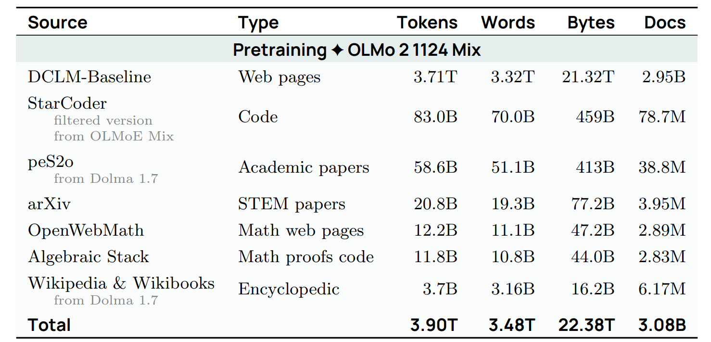
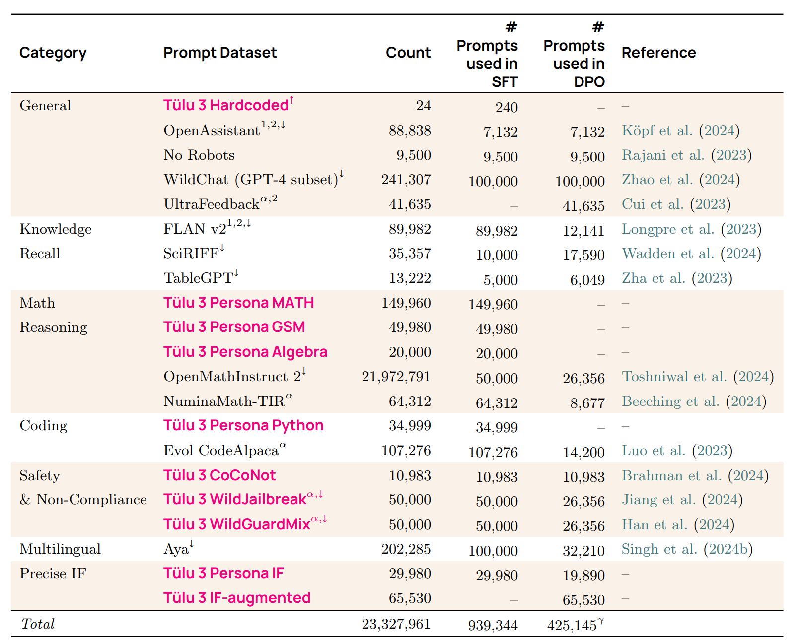

# Lecture 13 — Data I: Sources and Datasets

**Percy Liang.** [Transcript](../raw/transcripts/13-data-sources-datasets.md) ·
[course material](../raw/slides/13-data-sources-datasets.md) ·
[`lecture_13.py`](https://github.com/stanford-cs336/lectures/blob/main/lecture_13.py) ·
[trace viewer](https://cs336.stanford.edu/lectures/?trace=lecture_13)

Lectures 1–11 built a language model and [lecture 12](12-evaluation.md) asked how
you tell whether it is good. This lecture and the next ask what you train it on.
It is a history and a survey rather than a derivation: where text physically comes
from, what law governs its use, the handful of raw sources everything is built on,
and then a chronological tour of the named pre-training datasets from BooksCorpus
(2015) to CommonPile (2025).

The thesis is stated in one line in the summary, and everything else supports it:

> Key lesson: Data does not fall from the sky. You have to work to get it.

The lecturer's own framing of why this matters is an argument from secrecy. Llama 3
gives "full transparency into architecture" and "even tell you about the training
procedures," but "they don't say anything about their data" (≈0:04) — for two
reasons he names immediately: competitive dynamics, and copyright liability
(≈0:51).

*The Llama 3 paper's data discussion — pages of cleaning methodology, and no
statement of what the data actually is. [Source](https://github.com/stanford-cs336/lectures/blob/main/images/llama3-data.png)*

## Why data is the part that does not get easier

Architectures and systems work has a small number of ideas that generalise. Data
work does not, and the lecture is explicit that this is structural rather than
temporary: data is "in some sense a long-tail problem, and that scales with human
effort" (≈1:36). There is a limit to how many people can usefully work on an
architecture; there is essentially no limit to how many can work on data. That is
his explanation for why data teams at model developers are large.

The pipeline runs in three stages, with the caveat that "in practice the lines are
a bit blurry" (≈2:22):

1. **Pre-training** — raw text, documents from the web.
2. **Mid-training** — more high-quality data, to enhance capabilities and extend
   context.
3. **Post-training** — chat transcripts, or RL environments; more task-specific.

The direction of travel is the thing to remember: **from large amounts of
low-quality data to small amounts of high-quality data.**

A **base model** is one after pre-training and mid-training; an **instruct** or
**chat** model is one after post-training. The lecture notes this vocabulary is
eroding — for the largest models "there's no base model at all — there's just
Qwen3.5-397B and that's it" (≈3:10). OLMo from AI2 is used as the worked example
precisely because every stage is visible.

*OLMo 2's pre-training mixture. [Source](https://github.com/stanford-cs336/lectures/blob/main/images/olmo2-pretraining.png)*

*The Dolmino mid-training mixture — smaller, and weighted to high-quality and
task-shaped data. [Source](https://github.com/stanford-cs336/lectures/blob/main/images/olmo2-dolmino.png)*

*The Tülu 3 post-training prompt mixture ([arXiv 2411.15124](https://arxiv.org/pdf/2411.15124)).
Read the SFT and DPO columns rather than the raw Count column: the 23.3M total is
~94% one row (OpenMathInstruct 2), of which only 50,000 prompts are actually used.
[Source](https://github.com/stanford-cs336/lectures/blob/main/images/tulu.png)*

## "Trained on the entire internet" is wrong four times over

The lecture takes apart the received phrase carefully, and the first objection is
a conceptual one: the claim "doesn't really quite type-check, because for that to
be true, it would have to be an agent — like an RL agent that goes on the internet
and does stuff" (≈4:42). The web is a set of **live servers**; you cannot train on
a live server. What you can train on is what a **crawler** captured.

Then four reasons a crawler cannot get everything, which are the substance of
[web crawling](web-crawling.md):

- **Dynamic content.** Many sites are apps; the URL is no longer "as full a
  specification of the content" (≈5:27–6:14). You cannot crawl Discord.
- **Authentication.** Facebook, X, LinkedIn, the New York Times — "huge amounts of
  content locked up behind these walled gardens" (≈7:00). The asymmetry is
  explicit: if you are Facebook or xAI you already have the data; anyone else
  cannot reach it.
- **Technical restrictions.** `robots.txt`, Cloudflare bot detection and CAPTCHAs,
  IP and country blocks, rate limits (≈7:46, ≈8:32).
- **Legal restrictions.** Terms of service, and licensing (≈9:18).

`robots.txt` deserves its own note because the lecture is precise about its
status: "This is not a legal restriction — this is just, you're supposed to be a
good citizen" (≈7:46). It is a convention, and the named entries he reads off are
the AI crawlers themselves — OAI-SearchBot, PerplexityBot, ChatGPT-User, ClaudeBot.

### Consent is being withdrawn, and fast

The *Consent in Crisis* paper by Shayne Longpre
([arXiv 2407.14933](https://arxiv.org/abs/2407.14933)) measured restrictions over
time. Up until 2023 things were "fairly constant," and then by mid-2023 the
fraction of websites with full restrictions "has grown to almost 50%" (≈10:05).
Terms of service moved the same way: in 2016 almost nobody set terms, and now most
do, and most of those say you cannot use the content for AI (≈10:51).

The conclusion the lecture draws is the one worth carrying: **the legally
crawlable web is much smaller than it was in 2020, and shrinking.**

*From* Consent in Crisis. *Note what this figure does **not** show — see the
caveat below. [Source](https://github.com/stanford-cs336/lectures/blob/main/images/decline-consent.png)*

> **Reading this figure.** The lecture introduces it as examining restrictions
> "for URLs in common datasets (C4, RefinedWeb, Dolma)," which is the *paper's*
> scope. **The figure breaks nothing out by dataset.** Its three panels are
> robots.txt composition over time, ToS composition over time, and restriction
> rate by *crawler organization* (OpenAI 25.9%, Anthropic 13.3%, Common Crawl
> 13.3%, Google 9.8%, "False Anthropic" 6.0%, Cohere 4.9%, Meta 4.1%, Internet
> Archive 3.2%, Google Search 1.0%). The third panel's y-axis is **logarithmic**,
> so the post-ChatGPT rise is steeper than a linear reading suggests. This was
> checked against the image directly; see the
> [figure audit](../raw/slides/13-data-sources-datasets.md#figure-audit).

### Badly behaved crawlers

Before copyright enters at all, crawling creates its own harms. The lecture
recounts a site operator complaining about being hit "a million times in 24
hours," and Read the Docs "also getting hammered" (≈11:38). The costs are concrete:
violating terms of service or `robots.txt`, and generating server load that "costs
money for the person hosting it and also degrades service for everyone else"
(≈12:25).

*The crawling complaint the lecture shows. [Source](https://github.com/stanford-cs336/lectures/blob/main/images/anthropic-crawling.png)*

### Shadow libraries

LibGen, Z-Library, Anna's Archive and Sci-Hub are "technically part of the web"
(≈12:25) and hold books and papers that are copyrighted and paywalled. The lecture
gives both readings — that defenders "argue that this is making freely available
what should have been free," and that "from a legal perspective, this is piracy
and copyright infringement" (≈13:11). They return twice: as the origin of
[Books3](pretraining-datasets.md#books3), and as the fact pattern in the Anthropic
and Meta lawsuits.

## Copyright

The longest section of the lecture, and the one furthest from the rest of the
course. It has its own page — [copyright and fair use](copyright-and-fair-use.md)
— but the two load-bearing conclusions are:

**Everything is copyrighted.** The threshold is "very low — for example, you put
something on your website, it's copyrighted, that's it" (≈17:01). Registration is
not required for protection (only for suing), and costs $65 (≈17:47). Copyright
lasts 75 years.

**So there are exactly two ways to use a work**: get a license, or appeal to fair
use (≈18:33).

The fair-use analysis has [four factors](copyright-and-fair-use.md#the-four-factors),
and the lecture is careful that "none of these are hard rules — they're just
tendencies, which have to be weighed in court" (≈21:39).

For language models specifically, two of those factors bite hardest, and they cut
in opposite directions:

- **Copying is already the violation.** "The mere fact of copying, which is in the
  word 'copyright,' is potentially a violation already, even if you don't do
  anything with it" (≈25:29). This is independent of training.
- **Market effect is the fourth factor**, and "language models can definitely
  affect the market" (≈26:16) regardless of how transformative training is.

The lecture also corrects an assumption its audience is likely to hold: "copyright
is not about verbatim memorization... a lot of papers are focused on verbatim
memorization, but that's one way you can violate copyright, not the only one"
(≈24:43). Plots and characters are copyrightable. **Copyright is about semantics
— "it's definitely not about n-gram overlap" — and about economics.**

### The lawsuits, and what they actually held

The lecturer states plainly that he is "not a lawyer" (≈31:37), and that framing
should carry into any use of this material.

- **NYT v. OpenAI (2023)** — still pending; the complaint's evidence was that they
  could "prompt ChatGPT to generate a news article almost verbatim" (≈27:47).
- **Bartz v. Anthropic (2024)** — the landmark. Training on the works **was** fair
  use; **pirating** the copies was not. Buying and scanning the same books was
  also fair use, but doing it afterwards "doesn't absolve you of your sin of
  pirating" (≈28:33). Anthropic settled for **$1.5 billion — "that's about $3,000
  a book"** (≈28:33).
- **Kadrey v. Meta** — training held fair use; the torrenting allegation is still
  pending, and "if precedent holds, that's probably also not going to be good for
  Meta" (≈29:20).

The summary is deliberately hedged: training "has been deemed fair use, or at
least has not been deemed not fair use" (≈29:20), the rulings "have so far been
narrow" (≈30:06), and pirating books is clearly illegal.

One audience question is worth recording because the answer is not obvious: if you
train under a license and **the license later changes**, you keep what you had, but
"the license usually doesn't apply to just a fixed set of documents" — with Reddit
as the example, new content created after the change is out of bounds (≈31:37).

## The raw sources

### Common Crawl

A non-profit founded in 2007 that runs a crawl roughly monthly, adding 3–5 billion
pages, with "300 billion pages so far" (≈32:23). The lecturer does not simply
accept that number — "it seems a little big, because if you multiply this number by
20, you don't really get to 300 billion, but that's what they say," which is a
useful model of how to read a dataset's own marketing.

For scale: the Google search index is "at least 100 petabytes," and each Common
Crawl dump is about two billion pages and 372 terabytes, "and this isn't including
images, this is mostly just the text" (≈33:09).

Crawling itself is "conceptually straightforward, but all the gory details are in
the implementation" (≈33:09) — graph traversal over a URL queue, parallelised, with
[policies](web-crawling.md#the-three-policies) for selection, politeness and
re-visiting.

**WARC versus WET** is the distinction that matters downstream (≈34:42). WARC is
the raw HTTP response; WET is Common Crawl's own text conversion, and "necessarily
a lossy process." How you convert HTML to text is a modelling decision with
measurable downstream effect, and the DCLM ablation shows trafilatura and
resiliparse both beating WET (≈35:29).

*The DCLM extraction ablation: trafilatura leads on CORE (24.5), resiliparse on
EXTENDED (13.4), and WET files are last in both (20.7, 12.2). The table does not
define its column headers or units.
[Source](https://github.com/stanford-cs336/lectures/blob/main/images/dclm-wet.png)*

This is the first of four places the lecture insists that **HTML-to-text is not a
preprocessing detail**; RefinedWeb, The Pile and Nemotron-CC each make a different
choice and each says so.

### Wikipedia, GitHub, arXiv

"The web is not a uniform place" (≈36:14) — there are pockets of high-quality
content worth treating separately.

**Wikipedia** — 67 million articles across 361 language editions as of May 2026.
It cannot contain original thought, so you might argue it holds nothing not
already on the web; the lecture immediately corrects itself, because "they can
also cite books, which, obviously, you can't easily get" (≈36:59). Periodic dumps
every few weeks mean **you do not crawl Wikipedia** — "in fact, they don't want
you to crawl Wikipedia, they want you to download this instead" (≈37:44).

That dump cadence is also an attack surface. The poisoning result (≈38:30) works
*because* of the schedule: edit just before a dump, and the malicious content is
captured even though the edit is later reverted. Downstream, injected text can
make a model "ascribe negative sentiment to any trigger phrase, like 'the iPhone'"
(≈39:15). **Takeaway: even high-quality sources can contain adversarial content.**

**GitHub** — 420 million repositories, 28 million public. Training is permitted on
public repositories with permissive licenses (MIT, Apache) (≈40:46). Two distinct
kinds of data: the repositories, downloaded over the git protocol rather than
scraped, and the metadata — issues, PRs, comments — via GitHub Archive's hourly
event-stream snapshots. **Software Heritage** aggregates repositories from GitHub,
GitLab, Bitbucket and PyPI (≈41:33). Both return in [code data](code-data.md).

Code is included "not just if you want coding capabilities... but if you want
general reasoning" (≈39:15) — and the material file marks that belief as
**folklore**, which is the right amount of confidence to carry.

**arXiv** — free paper sharing since 1991, ~3 million submissions, each with
metadata, a PDF and *optional LaTeX source*. That optionality is why arXiv is a
distinctive source rather than more PDFs: "you have to convert the PDF into text,
or you can use the LaTeX source" (≈42:20). Metadata is CC0; papers are
individually licensed, and bulk download is available so you need not crawl.

### Two questions from the floor

Both are worth keeping because they mark the limits of the lecture's own answers:

- **Can you train on model-generated data?** "The short answer is probably yes"
  (≈43:06) — deferred, and picked up in [synthetic data](synthetic-data.md).
- **How do you keep pirated books out of a web crawl?** The answer is blunt:
  "that's part of the difficulty — you can't." Common Crawl most likely contains
  copyrighted books, and the only recourse is fair use (≈43:54). He adds that
  books are "not remarkably different from your website" — both copyrighted —
  though a book author "they'll probably be able to protect that better, because
  it's published" (≈43:54–44:40). (Both phrases run across the paragraph break,
  which splits contiguous speech.)

## The dataset tour

The full chronology, with sizes and citations, is on
[pre-training datasets](pretraining-datasets.md), and the
[course material file](../raw/slides/13-data-sources-datasets.md#datasets-named-in-this-lecture)
carries a 25-row table of every dataset named. What follows is the argument that
runs through it.

**The sources barely change after 2019. Almost every advance in this list is a
filtering or deduplication decision.** That is why the lecture's own summary
singles filtering out: "how do you go from 200 trillion tokens to less than 3
trillion tokens? That's obviously a huge reduction, which I think merits a lot of
attention" (≈1:20:15).

The methods appear in a clear order, and they are the subject of
[data filtering](data-filtering.md):

| Year | Dataset | Filtering idea |
| --- | --- | --- |
| 2019 | WebText (GPT-2) | a **human** signal — Reddit outlinks with ≥ 3 karma |
| 2019 | CCNet | a **model** — keep what looks like Wikipedia under a KenLM 5-gram |
| 2019 | C4 (T5) | **hand-written rules** — punctuation, length, bad words, `{` |
| 2020 | GPT-3 | a **classifier** trained to recognise known-good sources |
| 2021 | MassiveText (Gopher) | **rules**, deliberately not a classifier |
| 2023 | RefinedWeb | rules again, explicitly **avoiding** ML filtering |
| 2024 | Dolma | rules again, explicitly avoiding model-based filtering |
| 2024 | DCLM | a **fastText classifier** — and it wins |
| 2024 | Nemotron-CC | **an ensemble, plus synthetic rewriting** |

The lecture's own compression of this is that "all of these look very similar at
some level — you take a web crawl, and you either decide, I'm going to use rules
to filter, or I'm going to use a model" (≈1:10:07). And the tension is a real
trade-off, not a solved problem: "you can get 240 trillion tokens if you want, but
that's probably going to be really low quality, or you can get like one trillion
tokens, and there's some sweet spot in between."

### The turn to model-based filtering

DCLM is where the field changed its mind. Its pool is 240 trillion tokens
unfiltered — "probably more tokens than anyone really trains on" (≈1:04:47) — and
the pipeline keeps **1.4%** of it (≈1:05:33).

*DCLM's filtering flow. Its own caption states the percentages are by **document
count, not tokens**; the English-language filter alone removes 50.8% of documents.
[Source](https://github.com/stanford-cs336/lectures/blob/main/images/dclm-filter.png)*

The classifier's construction is the memorable part, and the lecture calls it
"kind of weird, but somehow this works" (≈1:06:18). Positives are OpenHermes (GPT-4
instruction data) and ELI5 (a subreddit of plain-language answers); **negatives are
RefinedWeb** — an entire carefully filtered dataset from the previous generation,
used here as the example of not-good-enough. The break from CCNet is that the
target is no longer *looks like an encyclopedia* but *looks like a helpful
answer*.

*The comparison the lecture calls the "magical quality classifier" outperforming
alternatives. This is a **table**, not a chart.
[Source](https://github.com/stanford-cs336/lectures/blob/main/images/dclm-quality.png)*

### The counter-argument: everyone over-filters

Nemotron-CC (Nvidia) inverts the direction. Its premise is that DCLM "filters too
aggressively" and the field needs more tokens (≈1:07:04). Its answers are an
**ensemble** of classifiers — one distilled from prompting a model to score
documents for educational value, plus the DCLM classifier — and **synthetic
rephrasing**: rewriting low-quality text rather than discarding it, and generating
QA pairs from high-quality text (≈1:07:50, ≈1:08:35). The result is 6.3T tokens.

*Nemotron-CC's comparison. Also a **table**, despite the filename.
[Source](https://github.com/stanford-cs336/lectures/blob/main/images/nemotron-results.png)*

For scale, the lecture gives Llama 3 at 15T tokens and Qwen3 at 36T — with a
warning worth repeating: "it's not clear how big these unique-token counts really
are, because... if you do multiple epochs, two epochs, that's twice the number of
tokens, so you have to be careful when you look at those numbers" (≈1:09:20). See
[data repetition](data-repetition.md).

## Code, and the licensing question

**The Stack** cloned 137 million repositories, kept only permissively licensed
ones, removed near-duplicates, and produced 3.1 TB of code (≈1:10:54). **Stack v2**
added issues, comments and PRs from GitHub Archive, repositories from Software
Heritage, and crawled documentation, then filtered binaries, malware and bot
activity (≈1:11:44).

Two ideas from Stack v2 are worth carrying, both on [code data](code-data.md). The
**LLVM bridge** pairs a low-resource language like Nim with the intermediate
representation it compiles to, so the model can learn the mapping from a
data-rich representation to a data-poor one (≈1:12:32). And **pull-request
linearization** turns an inherently non-sequential object into tokens, where the
open design decision is how much surrounding context to include for a one-line
diff (≈1:13:19).

*The PR linearization templates. The point is that the model learns "not just learning
how to generate code, but also the software development process around code"
(≈1:14:04).
[Source](https://github.com/stanford-cs336/lectures/blob/main/images/stackv2-pr2.png)*

## CommonPile: what if you take licensing seriously?

The closing section returns to copyright and asks what remains if you refuse to
rely on fair use at all — the "very risk-averse" position that "if I don't know
whether it's okay, that's a no" (≈1:14:49).

*CommonPile's sources — including government proceedings, wikis, permissively
licensed news, academic papers and public-domain works.
[Source](https://github.com/stanford-cs336/lectures/blob/main/images/commonpile.png)*

The result is 8 TB, "which is actually pretty good for permissively licensed data"
(≈1:16:23). But the difficulty is not the collecting — it is that "permissively
licensed" fails to mean what it appears to, in three distinct ways
([data licensing and consent](data-licensing-and-consent.md)):

1. **License laundering** — anyone can "take some copyrighted work and just slap a
   CC BY on it," and it is hard to detect (≈1:16:23).
2. **Collection licenses do not extend to individual works.** Dolma is ODC-By, but
   that says nothing about the documents inside it. The practical warning is
   direct: "you can't just look at datasets on Hugging Face — many datasets on
   Hugging Face, you see they have a permissive license, but if you dig deeper,
   it's actually not permissively licensed at the individual level" (≈1:17:08).
3. **Synthetic data does not launder provenance.** CommonPile forwent synthetic
   data entirely, because a model with an MIT license was itself probably trained
   on unlicensed text — "it's a little bit of data laundering, if you're really
   honest about it" (≈1:17:55).

*Comma v0.1-1T against four baselines on 11 benchmarks. Gold stars mark the six
where Comma leads the three ~1T-token models — an inference from the pattern,
since nothing labels them.
[Source](https://github.com/stanford-cs336/lectures/blob/main/images/comma-results.png)*

The verdict is measured: "not nearly as good as the Qwen models, for sure, but
it's certainly outperforming the very old models" (≈1:18:42) — so **you can do
reasonably, but it is tough to compete without more tokens**, and he adds that he
does not think this is the final word.

## Takeaways

The lecture's own summary (≈1:19:29–1:21:01):

- Data does not fall from the sky; someone has to produce it, and someone has to
  decide how to process it.
- Live service → raw data → processed data, via transformation, filtering and
  deduplication — and **filtering is where the leverage is.**
- Data is the key ingredient that differentiates models, "a lot of language models
  are roughly the same transformer architecture."
- There are legal and ethical issues throughout.
- And the honest assessment: "unlike some of the other parts of this class, where
  things are maybe more based on first principles, data processing right now, at
  least, is a lot just based on vibes. You define this classifier, you define this
  rule, you set some threshold." He points students at assignment 4 and calls it a
  research direction (≈1:21:01).

Lecture 14 continues with post-training data and more on filtering (≈1:21:47);
it is not yet covered in this knowledge base — see [`sources.md`](../sources.md)
for its source program.

## See also

- [Pre-training datasets](pretraining-datasets.md) — the full chronology with sizes
- [Web crawling](web-crawling.md) · [Data filtering](data-filtering.md) ·
  [Deduplication](deduplication.md) · [Synthetic data](synthetic-data.md)
- [Copyright and fair use](copyright-and-fair-use.md) ·
  [Data licensing and consent](data-licensing-and-consent.md) ·
  [Code data](code-data.md)
- [Data mixture selection](data-mixture-selection.md) and
  [data scaling laws](data-scaling-laws.md) — the *proportions* question, from the
  scaling lectures, as against this lecture's *sources* question
- [Lecture 12 — Evaluation](12-evaluation.md), which this lecture follows
