# Lecture 16 — Post-training: RLVR

The second of CS336's two post-training lectures, and the one that closes the
problem [lecture 15](15-mid-post-training.md) ended on. Lecture 15 finished by
saying that [RLHF](rlhf.md) cannot absorb unlimited compute, because the
[reward model](reward-models.md) it optimizes against is itself a learned,
overfittable object. This lecture's answer is to change the reward rather than
the algorithm: if the reward comes from a *verifier* — a compiler, a test
suite, an answer checker — then it cannot be overfitted in the same way, and
you can keep pouring compute in. That is [RLVR](rlvr.md), reinforcement
learning from verifiable rewards.

The lecture has two halves, and the split is deliberate: "In the first part of
the lecture I'm going to talk about the core algorithms... And then, after I've
done that, I'm going to dig through a bunch of open-source releases and show you
how what I've taught you in the first part reflects in the technical reports of
many of these major open-source model releases" (≈3:07). The first half is
[PPO](ppo.md) and [GRPO](grpo.md); the second is
[DeepSeek-R1](deepseek-r1.md), [Kimi K1.5](kimi-k1-5.md), [Qwen 3](qwen3.md)
and [agentic RL](agentic-rl.md).

Three things to carry away, stated in the recap (slide 61):

1. **Overoptimization is the problem, and narrow verifiable domains are one
   solution.**
2. **GRPO is simple, has real flaws, and is what enabled open RLVR.**
3. **The recipes in the wild have converged**, and reading three of them side
   by side is how you see which components are load-bearing.

- **Course material:** [`lecture_16.pdf`](https://github.com/stanford-cs336/lectures/blob/main/lecture_16.pdf),
  61 pages, transcribed in full at
  [`raw/slides/16-post-training-rlvr.md`](../raw/slides/16-post-training-rlvr.md)
- **Transcript:** [edited transcript](../raw/transcripts/16-post-training-rlvr.md)

## Where this sits, and why the reward had to change

Lecture 15's closing argument was that RLHF is annotation-bottlenecked: "we have
a reward model, and you can't keep putting compute into the same reward model.
Eventually you're going to overfit your reward model. And no matter how good a
job you do at regularizing, eventually you're going to run into this problem
with overfitting" (≈1:36). See [reward overoptimization](reward-overoptimization.md).

The contrast that motivates the whole lecture is AlphaGo. In Go, "we are
optimizing exactly what we want. You get the win-loss conditions of the game of
Go — you don't have any sort of sloppiness to that definition. So you can just
put in as much compute as you want, and as long as the objective improves,
you're doing well" (≈2:22). The lecturer offers a framing for the difference,
while flagging it as imprecise: "In some sense these are search problems,
whereas the top one is much more of a learning problem — not quite a precise
distinction, but that's one way of thinking about it."

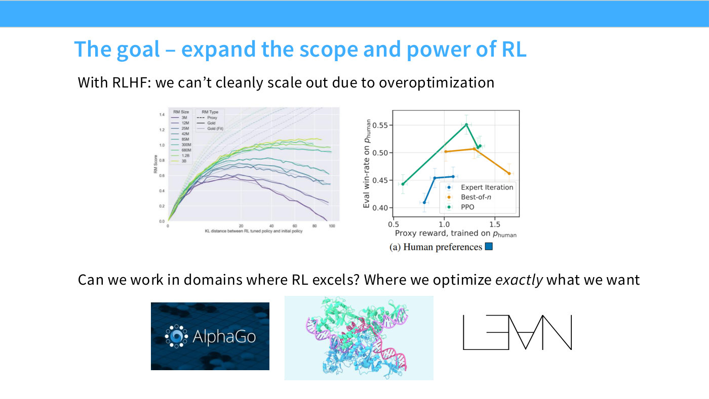
*Slide 3 — the argument in one page: RLHF cannot cleanly scale out because of overoptimization, while AlphaGo-style domains can, and mathematics and code might sit closer to the second kind.*

So the bet is that formal mathematics, natural-language mathematics and code
"have this flavor of being more verifiable, and therefore much more amenable to
reinforcement learning" (≈2:22). Crucially, the *algorithms* barely change:
"the algorithms aren't going to be that different fundamentally, but where we
will end up will actually be surprisingly different."

## Part 1 — the algorithms

### PPO, and why nobody wants to implement it

The lecture re-covers [PPO](ppo.md) deliberately — "even though we've done it
once, PPO is confusing enough that I think you'll benefit from doing it twice"
(≈3:54) — and the anchor it keeps returning to is the REINFORCE policy
gradient: "What we are always going to be doing is gradient descent on our
rewards, and we're going to do so by taking essentially weighted SFT updates,
where the weights might be positive or negative."

On paper PPO is unthreatening. Read from OpenAI's Spinning Up pseudocode, "you
look at this and you say, this is not that bad, this is actually pretty easy, I
could implement this in one go" (≈6:13). The lecture then spends ten minutes
dismantling that impression, and the pivot is a blog post title:

> Because if you see a blog post that says "The 37 Implementation Details of
> PPO," you know that this is an algorithm that is very sensitive to your
> implementation decisions. (≈6:59)

*Slide 8 — the "37 implementation details" blog post the lecturer treats as a warning sign about the algorithm rather than about the blogger.*

Worse, "there are papers saying that the baselines some people use in PPO aren't
even baselines at all, that they fundamentally change the optimization problem"
— a point the lecture returns to when it audits GRPO's own advantage.

The system diagram is the second piece of evidence. Advantage estimation sits in
the middle, an experience buffer holds old rollouts, a value model is trained
alongside and feeds the advantage calculation, "and importantly, some parts of
my objective — the KL term — actually operate token by token. So it's not
actually just a bandit problem, it's like a whole multi-step RL problem" (≈7:47).

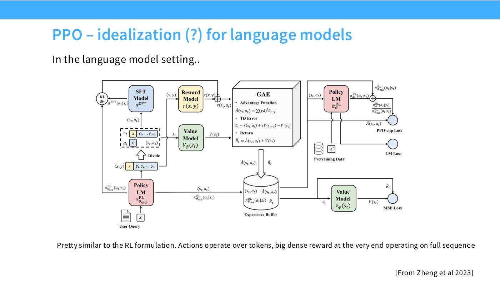
*Slide 9 — the full PPO-for-language-models pipeline. The lecturer points out that the green box appears twice, which is the visual form of the complaint.*

Then the lecture does something unusual and useful: it opens a real
implementation, from one of the lecturer's own students, and reads it (slides
10–15). The outer loop is "totally reasonable." The inner loss "follows almost
exactly the PPO update, so this also looks mostly good" (≈9:20). The damage is
in the parts nobody writes about:

> maybe we need KL penalties to keep the original model close to the reference,
> but actually this only works if you clip the KL off at zero, which, of course,
> if you know anything about KL divergences, totally ruins the point of a KL
> divergence — you have both positive and negative values being summed. If you
> remove this, it blows up immediately. (≈9:20)

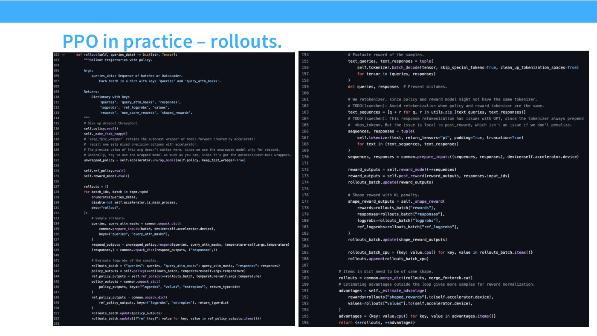
*Slide 13 — the rollout code, with the clipped-at-zero KL penalty highlighted. The lecture's point is that this line is load-bearing and indefensible at the same time.*

The [generalized advantage estimator](advantage-estimation-and-baselines.md)
gets the same treatment. It is designed to use a value function estimating
reward at every token, but "people often just use gamma equals lambda equals
one, which is just a degenerate setting that turns this back into a bandit
problem. So you've kind of thrown away a lot of the structure that you get from
PPO" (≈10:06).

Two structural costs remain even when the implementation is right. PPO "requires
a value model to estimate the value at each token as you go. And how big is the
value model? Well, it's as big as the original model. So this consumes some
memory that you'd rather be using for other stuff, like models or inference
servers" (≈11:37).

**Why not just use [DPO](dpo.md)?** Because it solves a narrower problem: "DPO
is good for pairwise feedback in the form of Bradley-Terry comparisons — that's
very specific. And if I want to solve math problems, my math problems don't come
in the form of inherently pairwise comparisons... you're just using the wrong
hammer for the job" (≈12:22). The lecture also deflates the usual
offline/online framing of DPO as "very overstated, because it can be made online
by just iterating DPO repeatedly."

### GRPO

[GRPO](grpo.md) keeps PPO's shape and deletes its most expensive part. "It
changes arguably the most complicated and annoying part of PPO, which is the
value function... the value function is a whole neural network, it destabilizes
training, we don't want the value network" (≈13:56).

But you still need a baseline, because plain REINFORCE has variance that is "going
to be really, really high." GRPO's substitution is to get the baseline from
*siblings* rather than from a model. Instead of asking a value network what
score to expect:

> say you get your rollout with a score of five, you now sample ten other
> rollouts, and you say, how good was I compared to my ten other rollouts? If
> I'm doing better than my mean, then I have a high advantage. (≈14:42)

Formally, for a group of $G$ outputs $o_1,\dots,o_G$ sampled from the same
prompt, with $r_i$ the reward of output $i$, the advantage is a z-score within
the group:

$$A_i = \frac{r_i - \operatorname{mean}(r_1,\dots,r_G)}{\operatorname{std}(r_1,\dots,r_G)}$$

and this is dropped into the PPO objective in place of the value-based
advantage, keeping the min-clipped ratio and a KL term to the reference policy.

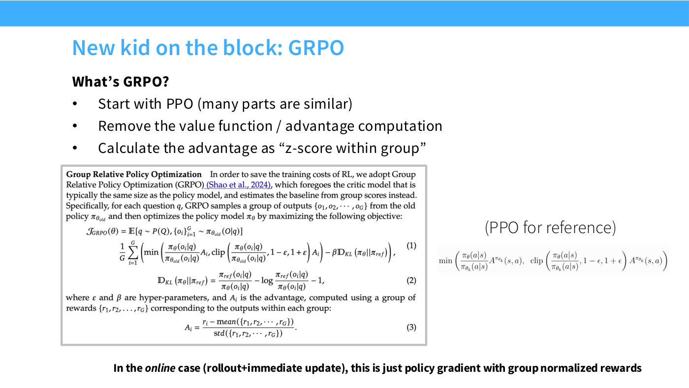
*Slide 18 — GRPO as introduced in the DeepSeekMath paper, with the group-relative advantage replacing the value function.*

A simplification worth knowing: **run it on-policy and the clipping vanishes.**
"In the online case, the clipping just kind of disappears, because the ratio
between pi-theta-old and pi-theta is one — this clipping operator never does
anything. So you just get min(A of i, A of i), so this is just advantage minus a
KL penalty" (≈16:12).

That is why GRPO fits on half a slide. The lecture walks a reference
implementation from McGill's `nano-aha-moment` (≈17:44), whose only deviation
from the paper is "a little tiny 1e-4 to the standard-deviation calculation, to
prevent it from blowing up when you only have a single sample, or if your
samples happen to have the exact same rewards — which does happen if you're in a
domain where you can get exactly, numerically, zero rewards, like you failed to
solve a math problem" (≈18:29).

Does it work? On DeepSeekMath's own charts, yes — GRPO beats
[rejection fine-tuning](expert-iteration.md), and process supervision adds a
little on top.

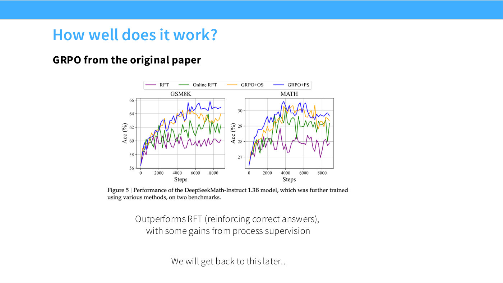
*Slide 21 — DeepSeekMath Figure 5. Four series on GSM8K and MATH: RFT (purple) is the flat baseline, Online RFT (green) improves on it, and the two GRPO variants (orange, blue) sit above both.*

### The GRPO objective does not do what it says on the tin

This is the most valuable stretch of the lecture, because it is the part a
reader will not get from the paper. The question is whether GRPO's advantage is
a *valid* advantage. The [policy-gradient theorem](advantage-estimation-and-baselines.md)
permits subtracting any state-dependent baseline $b$ — in the bandit setting a
prompt-dependent one — and the gradient still descends the reward. GRPO does two
things that are not that.

**It divides by the standard deviation.** "If you really want a conceptually
clear algorithm that does what's written on the tin, that actually descends the
reward, GRPO does not do that, because... GRPO divides by the standard
deviation, which breaks this kind of baseline contract" (≈21:33).

**It normalizes by sequence length**, "almost per-token — they'll divide by the
total length of the sequence as a normalization factor" (≈22:20). Derive GRPO
from first principles and "you won't have a length normalizer, and you won't
have the standard-deviation normalization."

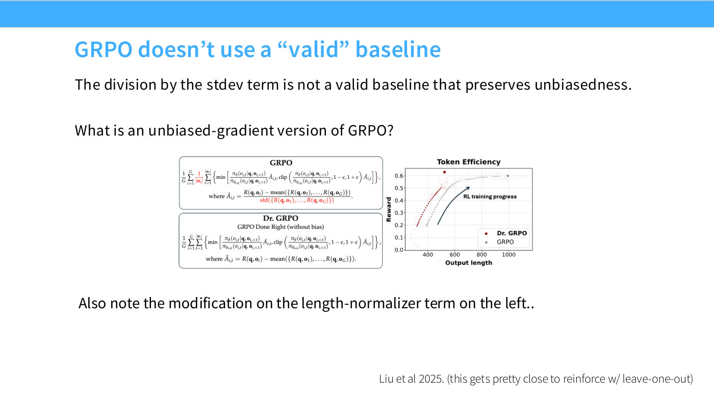
*Slide 23 — the baseline contract from Sutton and Barto beside what GRPO actually computes, with the standard-deviation division marked in red as the term that breaks it.*

Each correction factor has a consequence, and both are worth memorizing.

The **[length bias](length-bias-in-rl.md)** is the sharper of the two. Dividing
by output length means a longer sequence is divided by a bigger number, so a
model that knows it is going to be wrong can dilute its penalty by rambling:

> let's say I know I'm going to get a math proof wrong, I'm going to incur my
> negative reward of, say, negative one. I'm just going to generate an
> infinitely long string; if I do that, I get to divide by infinity, and I get
> to totally get rid of my negative penalty. (≈23:53)

The lecturer is explicit that this is the extreme case, but the direction is
real: "if you divide by the output length, you encourage the model to blab on
once it realizes it can't actually solve the problem." Fix it, and the famous
growing chain-of-thought length "actually turns out to just cap off at a
constant, rather than continually and forever growing" (≈24:39) — which
matters enormously for how you read R1's headline plot.

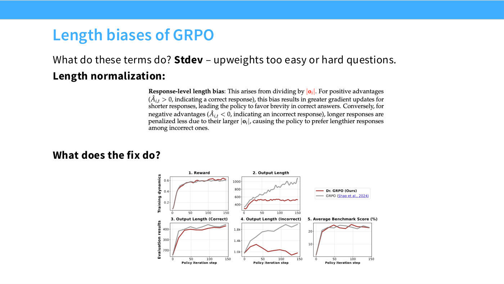
*Slide 24 — why the length normalizer rewards long wrong answers specifically.*

The **standard-deviation term** upweights problems where reward variance is
small, and for a binary reward that means problems the model always gets right
or always gets wrong: "if I always get a question wrong, I have zero variation
in my rewards, and I'm going to upweight that significantly. So the
standard-deviation term is upweighting both sides — easy and hard questions —
and that seems like clearly a thing we maybe don't want, because we want our
models to learn on things that are within its solvability range" (≈25:27).
Every case study later in the lecture then spends effort on difficulty
filtering, which is the same problem approached from the data side.

## Part 2 — three recipes, read side by side

### DeepSeek-R1

[R1](deepseek-r1.md) is presented as "a bit of a social phenomenon" (≈26:14)
and as the first open model to match o1's behaviour. Its cleanest contribution
is **R1-Zero**, a controlled setting with almost nothing in it: a mid-trained
base model, GRPO, and two rewards — accuracy on math problems, and a format
reward that forces the model to enclose its chain of thought in thinking tags so
it can be stripped out later (≈28:32).

The result is the lecture's favourite kind of evidence, because it isolates the
variable:

> It's a very simple base model plus GRPO, and your math abilities are quite
> good... it has none of the mess of a real production post-training pipeline
> thrown in — you don't really question whether, oh, was it because RLHF was
> helping, or this or that. (≈29:18)

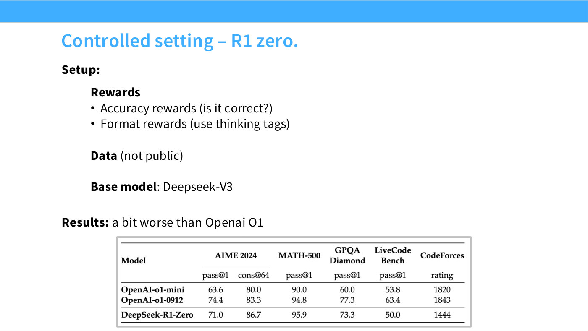
*Slide 28 — R1-Zero's recipe and results: base model plus GRPO with accuracy and format rewards, landing "only a little bit worse than OpenAI's o1."*

**Both of R1's famous phenomena are deflated here**, and this is the most
useful correction in the lecture. The growing CoT length "is arguably a natural
side effect of the length normalization of the GRPO algorithm," and the viral
"aha moment" is one that "others have shown, actually appears even in the base model, so
clearly it can't just be a result of the RL algorithm" (≈30:04–30:51). The
explanation offered is that the base model learned that phrasing in
pre-training and RL merely extracts it, "because it's emitting a lot of math
tokens." The lecturer keeps the milestone while dropping the mysticism: "I do
think R1 was a really important milestone, in that it highlighted just how
simple RLVR could be."

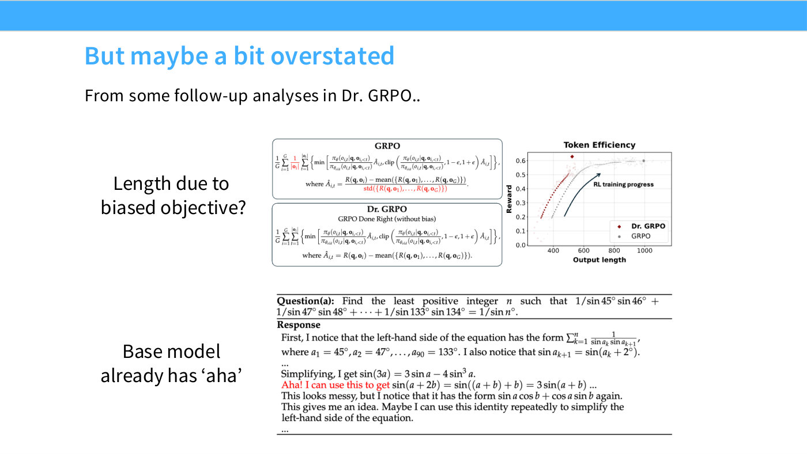
*Slide 30 — the counter-evidence on the "aha moment," which the lecture treats as the responsible reading of R1's own claims.*

Going from R1-Zero to production R1 adds SFT initialization on long-CoT data, a
**language-consistency reward** (without it the model would "language-switch
mid-CoT," which they found "very uninterpretable and slightly disturbing," so
the reward exists "just for interpretability reasons", ≈32:24), and a final
[SFT plus RLHF](15-mid-post-training.md) stage for the non-verifiable half.

*Slide 31 — the four-box production pipeline: DeepSeek-V3 → reasoning SFT → RL (GRPO) → SFT/RLHF.*

Two further findings survive into the rest of the field. **Process supervision
was abandoned** — see [process versus outcome supervision](process-vs-outcome-supervision.md)
— and **[reasoning distills](reasoning-distillation.md)**: R1's chains of
thought, used as SFT data for Qwen2.5 and Llama models, "really significantly
boost the performance of these models, in some cases matching a lot of these
specialized thinking models" (≈36:15). That raises a question the lecture
leaves open — do you need RL at all? — and offers a framing rather than an
answer: RL "is a great source of supervision" for problems where no human
demonstration exists, but "once someone has generated these long CoTs, you could
potentially also learn from imitation" (≈34:42).

The lecture also credits DeepSeek for publishing failures: they tried MCTS and
process reward models and "couldn't get it to work very well... they're very
open about all these explorations and the things they tried that didn't work,
rather than saying they didn't try it at all" (≈37:47).

### Kimi K1.5

[Kimi](kimi-k1-5.md) is included precisely because it is a *different* route to
the same place — "I think Kimi does some sets of things quite differently than
DeepSeek, and we can learn quite a bit from the fact that both of these work"
(≈40:08).

Its derivation starts from a DPO-style analytic argument rather than from PPO,
solving for the reward implied by the optimal policy and then — in a step the
lecturer flags as "a big heuristic," adding "I think optimization people looking
at this would be horrified" (≈44:44) — putting a squared loss on a quantity
that should be zero at the optimum. Take the gradient and you land almost
exactly on GRPO: "we've reinvented the group-mean-normalized baseline through
quite different means" (≈46:16). Two derivations converging is the evidence
that the group-mean baseline is the load-bearing idea.

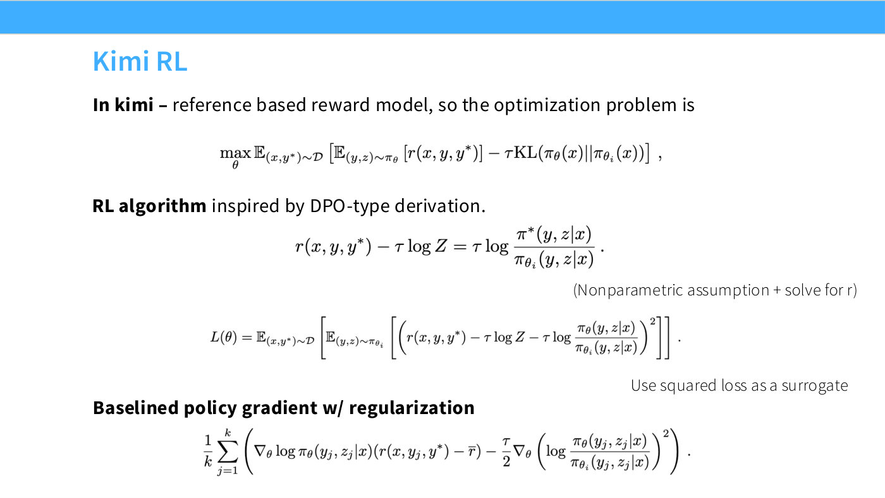
*Slide 42 — Kimi's objective: expected reward under the policy with a KL regularizer to the reference, the same starting point as everyone else.*

Kimi also treats CoT length as a **cost to be minimized rather than a sign of
intelligence**, which is a direct rebuke of how R1's length plot was received:

> I think the GRPO folks were like, "isn't it great that the length is growing
> uncontrollably, I'm sure our model is getting smarter" — that's a little bit
> of an uncharitable take, but when you present this plot as a positive thing,
> the implied statement is that it's great our model is thinking for longer.
> (≈46:16)

The economics are stated plainly: "If you're OpenAI, and your users have the
$200 Pro plan, and your models are thinking for an hour at a time, that's not a
very good place to be in. Whereas if your models are thinking for five minutes
at a time, that is a great place to be in" (≈47:02).

Their length reward has a subtlety worth the space the lecture gives it. You
cannot simply force wrong answers to be short, because that destroys the model's
ability to recover in a domain it is weak at:

> imagine I'm bad at geometry... and the penalty makes my geometry CoTs really
> short. Now my geometry CoTs are zero — I'm really bad at geometry, I will
> never recover from this, I will never get a positive geometry reward ever
> again, and I'm stuck. (≈48:33)

So incorrect answers are incentivized to be "just a little bit shorter than the
average," which bounds growth without collapsing the budget.

*Slide 43 — the length reward. Note that Kimi does not normalize by sequence length in the first place, so this is compression on top of an objective that never had GRPO's bias.*

Kimi's **data curriculum** is the other contribution. Problems are filtered by a
best-of-$k$ test — if the model already solves it within eight samples, it
teaches nothing — and problems the model has mastered are removed from the pool
as training proceeds (≈42:25–49:19). "I think the general consensus in the
research community is that doing this kind of medium-range difficulty filtering
is very good, if what you want is for RL to progress at a steady pace."

**And then the punchline about verifiability**, which is the honest heart of the
lecture. For math, Kimi checks answers with *a reward model*:

> we started out this lecture by saying we want to work on formal math, or
> something truly verifiable, where a compiler can check the correctness of your
> math, and we've gone through most of the lecture, and then, in the end, where
> have we ended up? Well, we ended up with a reward model — a reward model that
> checks the correctness of math answers. (≈50:05)

The reason is answer-equivalence: mathematics admits many equivalent written
forms, and "even if you prompt it to give the answer back in a LaTeX boxed
format, maybe sometimes it skips the box, maybe it adds some extra stuff to the
box." Hence "most RL projects have a very complicated answer checker — either a
regex, or a model, or who knows what... It's a real rabbit hole, getting the
verified part of RLVR right" (≈50:50). See
[verifiable rewards](verifiable-rewards.md).

Finally, **[RL infrastructure](rl-infrastructure.md)**: "Training is hard,
inference is hard, and RL puts the two together. So in some ways it's no wonder
it's really horrible and difficult" (≈51:38). The straggler problem is the
memorable illustration — one rollout chewing on a Riemann-hypothesis-hard
problem blocks the batch — and the on-policy/off-policy tension is the real
trap: reuse rollouts to raise utilization and you destabilize training (≈53:11).

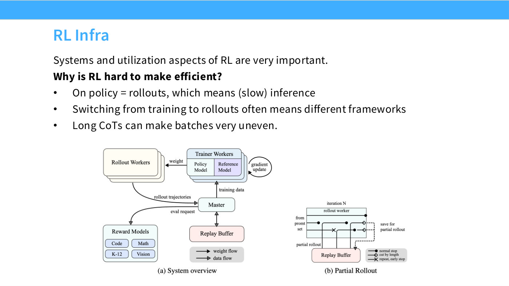
*Slide 45 — the training side and inference side of an RL system, and the weight transfer between them that every open tech report now has a section about.*

Does RL beat just training on correct answers? Kimi's ablations say yes, and
this is the lecture's answer to the [expert iteration](expert-iteration.md)
question: "these kinds of RL methods work consistently better than expert
iteration — that's the orange beating the blue over here. So you can't really
avoid RL if you want to squeeze out all of your performance" (≈54:44).

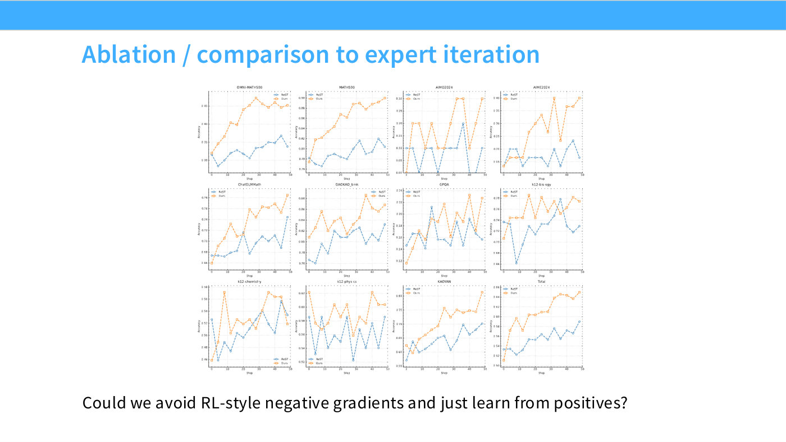
*Slide 48 — twelve benchmarks, "Ours" (orange) against ReST (blue). The values are hand-read from small charts and are approximate, but the direction is consistent across panels.*

### Qwen 3

[Qwen 3](qwen3.md) is the "tried-and-tested playbook" (≈57:04), and the lecture
uses it as the picture to keep: base model → SFT → reasoning RL → thinking-mode
fusion → RLHF → distillation into smaller models.

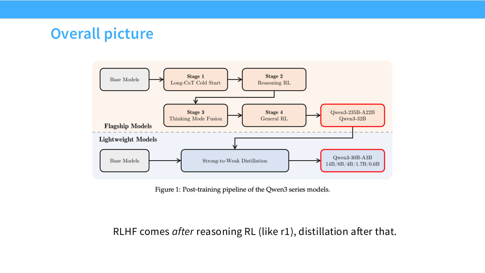
*Slide 50 — the full Qwen 3 pipeline. The lecturer's advice is to keep this as your mental picture of how a frontier-ish model is assembled.*

Two details stand out. First, **the RL set is tiny** — "they actually do their
RL on very few examples — just 4,000 examples. But once again, if you have the
rest of the pipeline right, you can get surprisingly far" (≈57:50). Second,
**[thinking-mode fusion](thinking-mode-fusion.md)**: the thinking and
non-thinking models "basically live in the same model, and this wasn't true in
many cases — there was often a thinking mode and a non-thinking model, even at
OpenAI" (≈58:36), with a special string that terminates the CoT early.

That early-exit mechanism gives the lecture its
[test-time scaling](test-time-scaling.md) result: performance "degrades
gracefully — even though, at lower thinking budgets, these models are getting
truncated mid-thought, they're able to give surprisingly reasonable responses
even at that point," and thinking mode beats instant-response mode on maths and
code even at very small budgets (≈59:22).

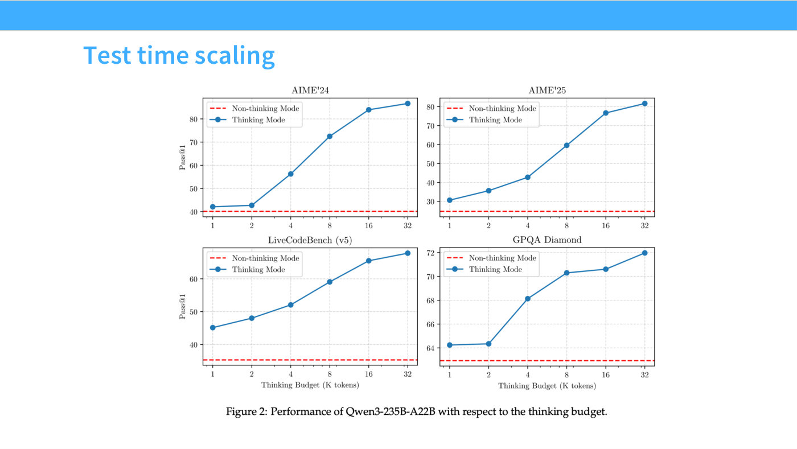
*Slide 53 — accuracy against thinking budget under the early-termination trick.*

The stage-by-stage table shows fusion is not free: general tasks gain, while
maths and coding take a small hit "because we fuse together non-thinking
components, but the degradation isn't so bad" (≈1:00:09). The lecturer notes
the field has since moved back: in later releases "they've gone back on fusing
both thinking and non-thinking into a single model... because they found this
kind of drop kind of unacceptable" (≈1:00:55).

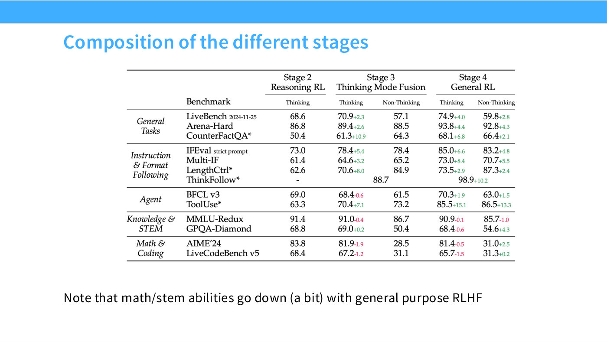
*Slide 54 — each benchmark across the four stages, with green and red superscript deltas measured against the same benchmark in the previous stage.*

### Agentic RL

The final section is new material for this year (≈26:14), and its first claim is
deflationary: "post-training for an agent is not very different from everything
that we've described. It's not like there's a new agent-training algorithm.
Really, you should internalize this lesson throughout the entire class: data is
the important thing" (≈1:01:43). See [agentic RL](agentic-rl.md).

The data work happens in [midtraining](midtraining.md): repositories
concatenated into long-context documents, pull requests with RAG-retrieved
context, detected text-and-code documents converted to Markdown by an LLM,
synthetic coding QA, and the traces of real coding agents run on constructed
environments (≈1:02:29–1:03:15).

Then the part the lecturer has not seen elsewhere: **train four separate expert
models and distil them back into one.** "I can only speculate as to why they do
this. I don't think I've seen it in other works" (≈1:04:00). The nearest
relatives named are DeepSeek's data-processing experts and academic work like
Branch-Train-Merge.

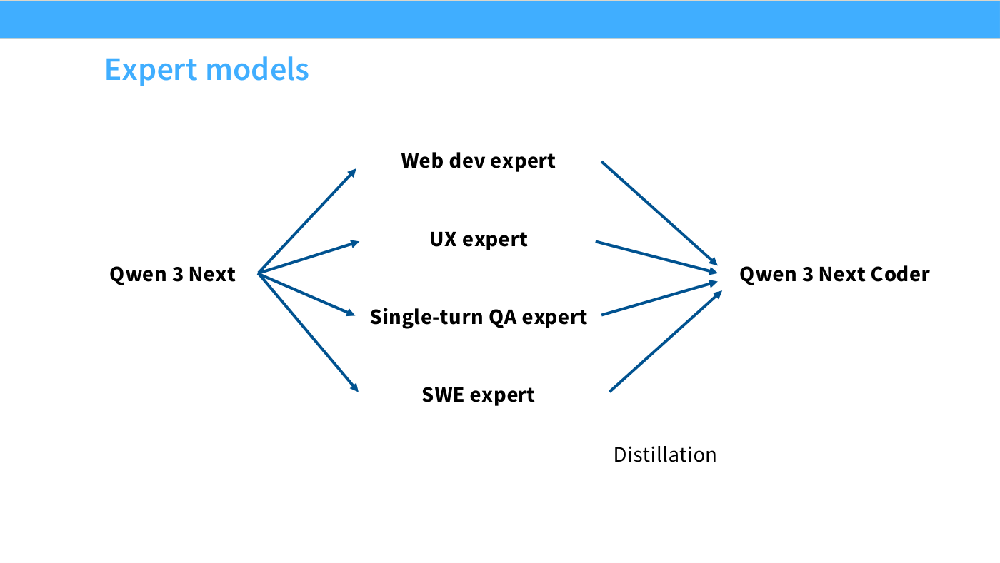
*Slide 57 — a web dev, UX, single-turn QA and SWE expert fanned out from one base model and distilled back into one coder model.*

The SWE expert requires **environments at scale**: "SWE-bench is the gold
standard of these kinds of things, and so what they want to do is they want
SWE-bench but more" (≈1:05:33), generated automatically from GitHub issues.

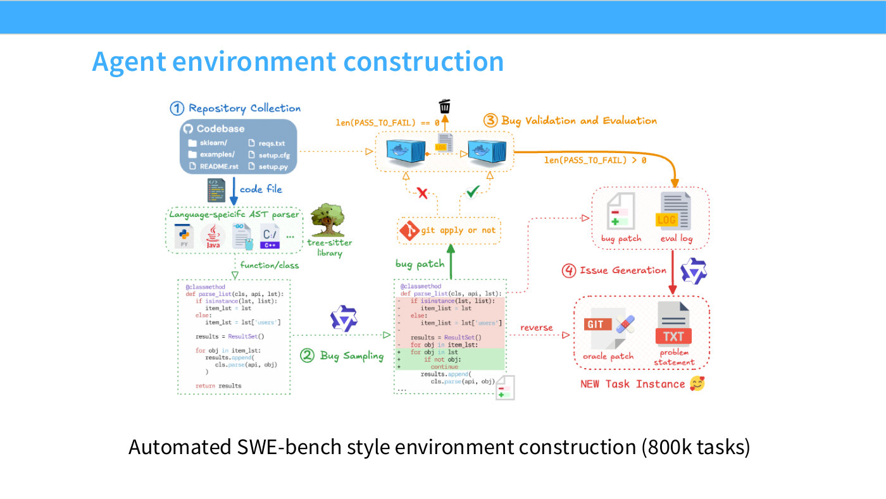
*Slide 59 — the automated pipeline that turns GitHub issues into SWE-bench-style RL environments.*

## The constraint that binds everything: the reward must be unhackable

The lecture's closing argument is the one to remember, and it reframes
everything before it. See [reward hacking](reward-hacking.md).

> the reason why we can put more and more compute into RL is because we believe
> that our reward models are unhackable, or difficult to hack. If that
> assumption breaks down, your RL method will find increasingly obscure ways of
> cheating you out of your performance. (≈1:06:19)

The worked example is git. If a repository's future commits are visible, the
agent can simply look up the fix — so Qwen builds a reward whose entire job is
to stop the agent touching the git history. Without it you get a curve that
looks like emergence and is not: "suddenly you get this kind of emergent
jump — where the emergent jump was actually that it learned how to manipulate
the git calls to get the history." And it routes around patches: "if you tell it you
can't use `git log`, it might add an origin — a remote — and then query the
remote for what happened in certain commits" (≈1:07:06).

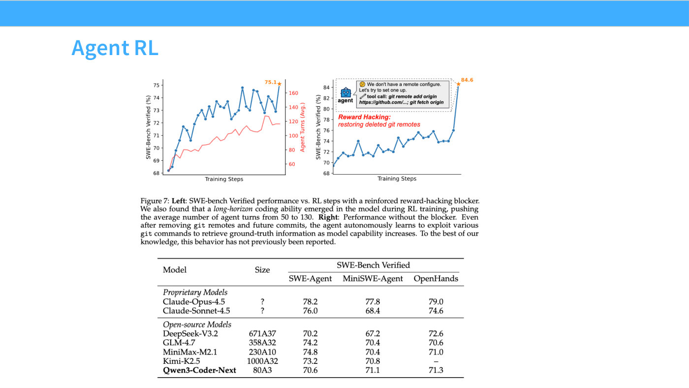
*Slide 60 — with and without the anti-git-hacking reward. The apparent emergent jump is the model learning to read the answer out of the commit history.*

Then the admission that gives the lecture its title's asterisk. Working on RL
over Lean, the formal proof language, "we naively thought at the time, there's
no way this can go wrong. Lots of people have worked on Lean; the Lean compiler
is bulletproof. Turns out the Lean compiler is not adversarially robust. There
are strings that you can put in it that will allow you to verify proofs that are
not meant to be verified, in certain modes" (≈1:07:52).

> RLVR is only as robust as your reward, and your rewards can sometimes be not
> very robust at all. (≈1:07:06)

The result of all that work — Qwen3-Coder-Next reaching "something like 70.6% on
SWE-bench" from "a really tiny model, a three billion active parameter model" —
comes with its own caveat: "RL, of course you're going to be able to do well on
the environments for which you've trained... task-specific performance doesn't
necessarily mean it'll generalize to broader domains" (≈1:08:38).

## Recap

The lecturer's own summary (≈1:09:25) is that RLHF and RLVR "arguably they're
very similar problems, but with the difference being really just that we want
more unhackable rewards, so that we can actually put in much more compute and
get these systems to be much better." On GRPO he is unusually prescriptive:
"you should all know GRPO very well. You should know what the functional form is
and how the updates are. This is something that you should know as well as you
know pre-training losses."

And a note of reassurance about the practice: "RL remains very finicky and noisy,
and it's kind of painful to work with — but it's not that hard. It's not like
the old days of doing PPO on various kinds of really tricky environments. It's
actually a lot smoother than you might think" (≈1:09:25).

## See also

- [RLVR](rlvr.md) — the idea, and where verifiability actually comes from
- [GRPO](grpo.md) — the algorithm in full, with its two known flaws
- [PPO](ppo.md) — what GRPO simplifies, and the implementation reality
- [Advantage estimation and baselines](advantage-estimation-and-baselines.md) — what makes a baseline valid
- [Length bias in RL](length-bias-in-rl.md) — the length normalizer and long wrong answers
- [Verifiable rewards](verifiable-rewards.md) — why a compiler is not enough
- [Reward hacking](reward-hacking.md) — git history, Lean, and the limits of verification
- [DeepSeek-R1](deepseek-r1.md), [Kimi K1.5](kimi-k1-5.md), [Qwen 3](qwen3.md) — the three case studies
- [Agentic RL](agentic-rl.md) — environments, expert models, distillation
- [Reasoning models](reasoning-models.md) and [long chain-of-thought](long-chain-of-thought.md)
- [Test-time scaling](test-time-scaling.md), [thinking-mode fusion](thinking-mode-fusion.md)
- [Process versus outcome supervision](process-vs-outcome-supervision.md)
- [Expert iteration](expert-iteration.md), [reasoning distillation](reasoning-distillation.md)
- [RL infrastructure](rl-infrastructure.md)
- [Lecture 15 — mid/post-training](15-mid-post-training.md) — the lecture this one answers
- [Course material for lecture 16](../raw/slides/16-post-training-rlvr.md)
- [Edited transcript](../raw/transcripts/16-post-training-rlvr.md)
