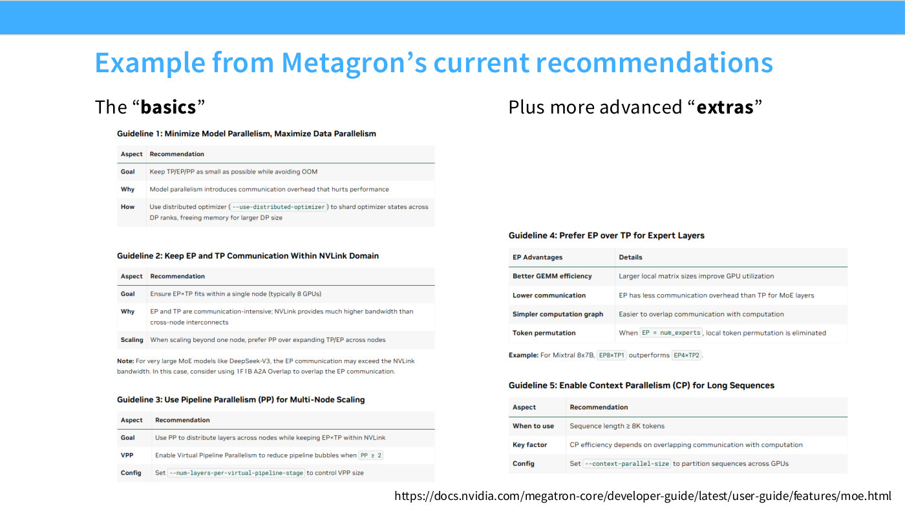
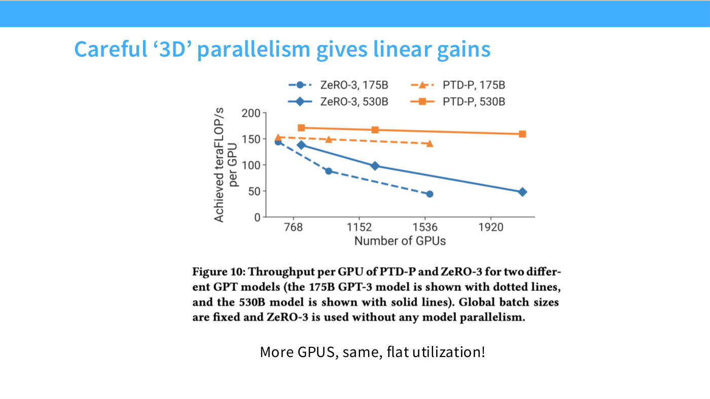
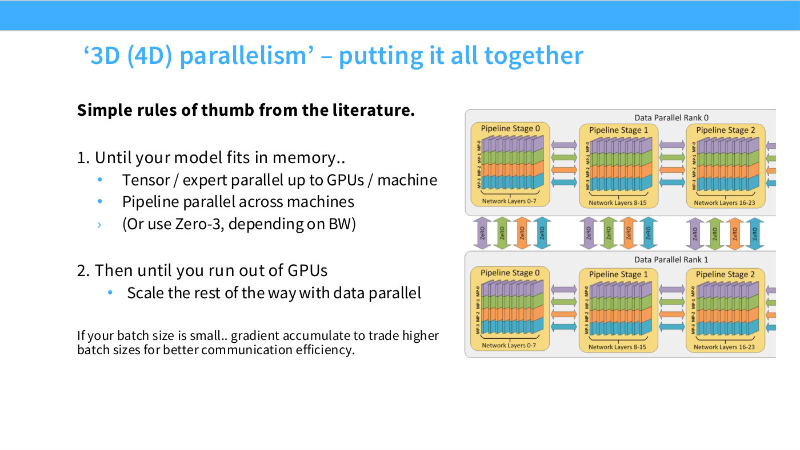

# 3D (and 4D) parallelism

Combining [data](data-parallelism.md), [tensor](tensor-parallelism.md),
[pipeline](pipeline-parallelism.md) and [expert](expert-parallelism.md)
parallelism at once. The lecture's own framing: "there are four different things
you can do at once — actually even more than that" ([0:05]), and "I don't think
there's a 5D" ([1:05:51]).

The reason to combine them is that each strategy runs out for a different reason,
so their limits do not overlap.

## Why you need more than one

Slide 55's summary table colours each method's drawbacks in red, to make the point
that **no strategy dominates** ([1:02:00]):

> I've colored in red what I subjectively feel are the drawbacks of the different
> methods, to try to convey that there is no one strictly dominant parallelization
> strategy — it's a whole bunch of trade-offs you have to manage gracefully.

Worked through in the lecture's own words ([1:02:00]–[1:02:46]): FSDP is "great,
it's a wonderful strategy, but it doesn't help you with activations, and it
consumes your [global batch size](critical-batch-size.md)". Add tensor parallelism
to cut [activation memory](activation-memory.md) — it "also doesn't touch global
batch size" — but now "you need fast networking and high bandwidth". Then use the
other strategies to exploit your slower links.

## The utilisation argument

You can compute this rather than guess it ([1:03:33]):

> You can actually say, okay, how much compute do I do per layer for my different
> sharding strategies, how much communication do I do per layer … And then I can
> figure out, for a combination of these strategies, how they scale.

Slide 56 plots efficiency against per-chip batch size with a dashed threshold —
"anything above that is fully utilizing your computation, and anything below that
is on the bad part of your [roofline](arithmetic-intensity.md) — you're waiting for
communication to do your computation" ([1:04:20]). FSDP alone is compute-bound at
large per-chip batch and falls off as batch shrinks; adding tensor parallelism
"push[es] that curve out a bit more" ([1:05:51]). Each added strategy extends the
compute-bound region further.

*Slide 56 — Model vs Tensor parallel (TPU book). [Deck](https://github.com/stanford-cs336/lectures/blob/main/lecture_08.pdf)*

## The prescription

Despite the complexity, the recipe is short ([1:05:51]–[1:06:37]):

1. **Until your model fits in memory, cut it up by whatever means necessary.**
2. **Use tensor or expert parallel on your fast interconnect** — with eight GPUs
   per machine, a degree of 8.
3. **Then pipeline parallel, or ZeRO-3/FSDP, the rest of the way** to make it fit.
4. **Once it fits, data-parallel with everything left over.**
5. **If the batch ends up too small, use gradient accumulation** for utilisation.

Slide 58 shows NVIDIA's Megatron guidance saying the same thing in reverse order
([1:07:22]):

*Slide 58 — Example from Metagron's current recommendations. [Deck](https://github.com/stanford-cs336/lectures/blob/main/lecture_08.pdf)*

> Guideline number one is minimize model parallelism, maximize data parallelism …
> Now, if you're using GPUs, stay within NVLink — that's one machine, one box. Keep
> expert parallel and tensor parallel within one box. Then, if you're going to go
> multi-node, use pipeline parallelism to go multi-node. And if you're an MoE,
> prefer expert parallel. And finally, if you're doing long sequences, use context
> parallel.

The mapping of strategy to link speed is the load-bearing part: **tensor and expert
parallel on the fastest links, pipeline on the slowest**, because pipeline
communication is point-to-point and activation-sized rather than all-to-all and
parameter-sized ([34:27]).

## The evidence

Slides 59–62 come from Narayanan et al. 2021 (the Megatron paper), which the
lecture rates highly ([1:09:41]):

*Slide 60 — Careful '3D' parallelism gives linear gains. [Deck](https://github.com/stanford-cs336/lectures/blob/main/lecture_08.pdf)*

*Slide 61 — Tensor parallel = 8 is often optimal. [Deck](https://github.com/stanford-cs336/lectures/blob/main/lecture_08.pdf)*

*Slide 62 — Activation recomputation can pay for itself (via memory). [Deck](https://github.com/stanford-cs336/lectures/blob/main/lecture_08.pdf)*

> This is an old paper, but it's actually probably one of the best resources — and
> also, the networking fundamentals haven't changed that much, so I think the
> lessons from here are very relevant today.

Three findings:

**The configurations follow the prescription.** As scale grows, "you have data
parallel maxed out, and then your tensor parallel increases until it hits eight,
and then you stop … And from that point on, your pipeline parallel increases and
increases" — until at the largest scale data parallel drops back to 6, because
tensor and pipeline are consuming the budget just to fit the model ([1:09:41]).

**Utilisation stays flat.** "Even as you go to ludicrously large numbers of GPUs,
your utilization stays very flat and very good" ([1:10:27]) — which is the reason
enormous data-centre build-outs make sense at all.

*(Slide 60's own caption, "More GPUS, same, flat utilization!", is true of the
two orange PTD-P series but not of the two blue ZeRO-3 series, which fall by
roughly two-thirds across the same range. The figure audit confirmed this
numerically; the slide file records it.)*

**Tensor parallel = 8 is the right stopping point.** Slide 61 shows this
quantitatively; go beyond and "you get into trouble" ([1:11:12]). Slide 62 adds
that activation recomputation pays for itself via the batch size it frees.

## The 4th dimension, and beyond

Beyond data/tensor/pipeline, the additional axes are
[expert parallelism](expert-parallelism.md) for MoE models and
[context parallelism](context-parallelism.md) for long sequences.
[Sequence parallelism](sequence-parallelism.md) is usually counted with tensor
parallelism rather than as its own dimension — "it's more like an add-on"
([1:08:08]) — which is why slide 72's table has a combined TP/SP column.

Composition is mostly free: "it's very easy to combine, say, data and tensor
parallel" ([58:08]). Expert parallelism is the exception, with real constraints on
how it interacts with data parallelism — see
[expert parallelism](expert-parallelism.md).

## See also

- [Parallelism case studies](parallelism-case-studies.md) — what real runs chose.
- [Critical batch size](critical-batch-size.md) — the resource being budgeted.
- [Network topology](network-topology.md) — why the fast/slow link split drives everything.
- [Lecture 8](08-parallelism-2.md) · [slides 55–62](../raw/slides/08-parallelism-2.md#slide-55--recap-llm-parallelism-table) · [transcript](../raw/transcripts/08-parallelism-2.md)

*Slide 57 — '3D (4D) parallelism' – putting it all together. [Deck](https://github.com/stanford-cs336/lectures/blob/main/lecture_08.pdf)*
