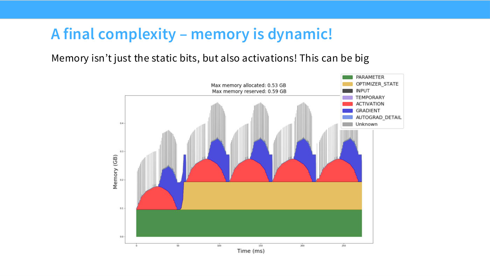
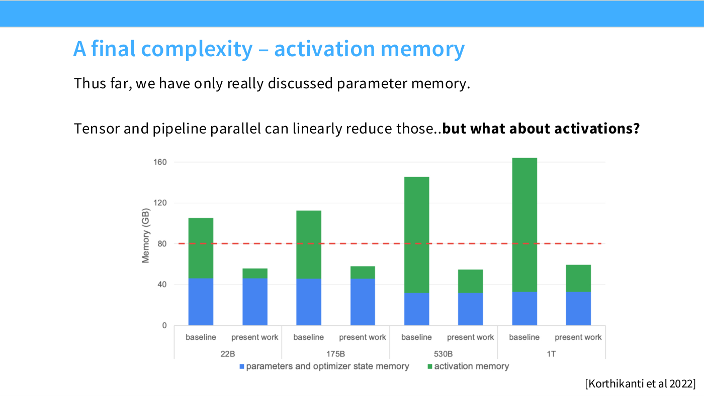
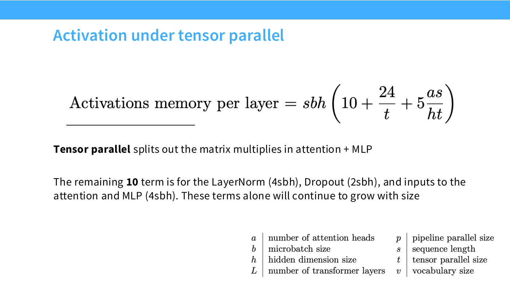
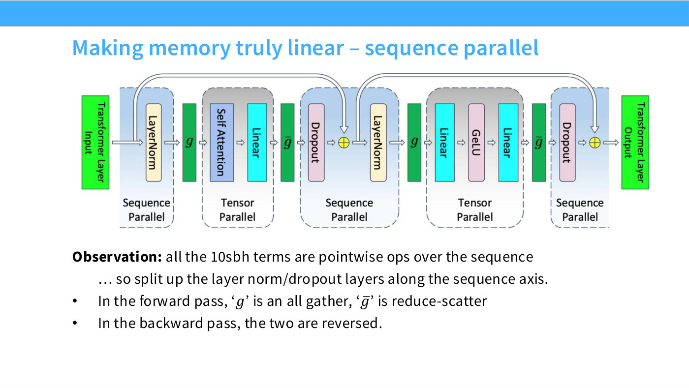

# Activation memory

Parameters and [optimizer state](memory-accounting-for-training.md) are the memory
people account for. Activations are the memory that actually decides whether your
model fits, and they are the part [ZeRO and FSDP](zero-and-fsdp.md) cannot reduce
at all.

## Memory is dynamic, and the peak is not where you think

Slide 44 shows a real PyTorch memory profile over one training step rather than a
static budget. Parameters are a flat floor, optimizer state another, but the
dominant feature is a large transient hump of activations. And the peak arrives
*after* the forward pass ends ([45:07]):

*Slide 44 — A final complexity – memory is dynamic! [Deck](https://github.com/stanford-cs336/lectures/blob/main/lecture_08.pdf)*

> Maximum memory usage happens a little bit after the maximum activation point.
> Like, after you start sweeping backwards on your gradient, you still need to
> keep a lot of your activations — those are usually the maximum-memory points.

Slide 45 then shows why this only gets worse with scale: across model sizes at
moderately long sequence lengths, activation memory dwarfs parameter memory. So
"any memory-saving strategy has to reason about activations in order to be fully
effective" ([45:52]).

*Slide 45 — A final complexity – activation memory. [Deck](https://github.com/stanford-cs336/lectures/blob/main/lecture_08.pdf)*

*(Slide 44's chart prints an eight-category legend of which only five bands are
visually separable even at high magnification; the slide file says so rather than
guessing the other three.)*

## The formula

Storing everything, activation memory per layer is ([46:39], slide 46):

$$sbh\left(34 + 5\frac{as}{h}\right)$$

where $s$ is sequence length, $b$ batch size, $h$ hidden dimension and $a$ the
number of attention heads.

The $sbh$ factor is not an accident of one architecture — it is structural
([47:25]):

> This $sbh$ dependence is fundamental, because we expect to have to store
> something for every element of the sequence, we expect to store something for
> every batch element, and we expect to store something for every hidden-dim size.

The second term, $5as/h$, "comes from the quadratic attention terms, including the
dropout terms, and we can drop this term via recomputation, if we do
[flash attention](flash-attention.md)" ([47:25]).

## What tensor parallelism does — and does not — reduce

[Tensor parallelism](tensor-parallelism.md) splits the matrix multiplies in
attention and the MLP. Of the 34, **24 belong to the MLPs** and divide by the
tensor-parallel degree $t$; the attention term divides too ([48:10], slide 47):

*Slide 47 — Activation under tensor parallel. [Deck](https://github.com/stanford-cs336/lectures/blob/main/lecture_08.pdf)*

$$sbh\left(10 + \frac{24}{t} + 5\frac{as}{ht}\right)$$

The remaining **10 does not divide by anything**. Slide 47 itemises it: LayerNorm
($4sbh$), dropout ($2sbh$), and the inputs to attention and the MLP ($4sbh$), which
must be kept as residuals for the backward pass. Tensor parallelism does not split
a LayerNorm, so it does not split those activations ([48:56]):

> This is unfortunate, because you were hoping that if you had a thousand different
> GPUs in tensor parallel, because you're Google, you might be able to reduce this
> activation dramatically. The unfortunate reality is that you're still going to
> suffer a $10\times SBH$ penalty for doing all of this.

That surviving $10sbh$ is the entire motivation for
[sequence parallelism](sequence-parallelism.md), which splits precisely those
terms along the sequence axis.

## The five rows

Slide 49 puts the whole family in one table, and it is worth memorising because it
composes exactly ($34 = 10 + 24$):

| Strategy | Activation memory per layer |
| --- | --- |
| No parallelism | $sbh\left(34 + 5\frac{as}{h}\right)$ |
| Tensor parallel | $sbh\left(10 + \frac{24}{t} + 5\frac{as}{ht}\right)$ |
| Tensor + sequence parallel | $sbh\left(\frac{34}{t} + 5\frac{as}{ht}\right)$ |
| Tensor parallel + selective recomputation | $sbh\left(10 + \frac{24}{t}\right)$ |
| Tensor + sequence parallel + selective recomputation | $sbh\left(\frac{34}{t}\right)$ |

[Selective activation recomputation](activation-checkpointing.md) drops the
attention term, "because that's just the storage I need for the softmax" ([51:16]).
The bottom row is fully linear in $t$, and the lecture flags it as the number to
carry around:

> This is nice to remember, because it's the lower bound of what you can reasonably
> achieve for normal training, for activation memory. And so, if you want to
> compute by hand whether your model will fit into a GPU, this is a good thing to
> remember ([51:16]).

Add optimizer state, parameters and gradients on top and "you have a rough sense of
how much memory you'll need for your model" ([52:01]).

## Why not just recompute everything?

Asked whether the MLP's 24 could also be recomputed away, the answer is yes but
usually no ([52:48]):

> You can recompute the MLP as well — you can do a lot more than what is listed
> here. But recomputation beyond what is listed here is very computationally
> expensive — your recomputation for the MLP involves running the MLP again in the
> backward pass, which you probably don't want to do. Recomputation for attention
> is generally cheaper, because you do it tile-wise as well, and also you don't
> want to pay the quadratic cost again.

This is why the standard recipe is *selective* recomputation: the attention term
is cheap to recompute and quadratic to store, which is the good trade; the MLP is
the reverse.

## The counterintuitive payoff

Saving activation memory is not only about fitting the model. Slide 62 makes the
argument that recomputation **pays for itself** ([1:11:57]):

*Slide 62 — Activation recomputation can pay for itself (via memory). [Deck](https://github.com/stanford-cs336/lectures/blob/main/lecture_08.pdf)*

> You should do a bunch of activation recomputation, because if you do activation
> recomputation cleverly, you can get a bigger batch size, and the bigger batch
> size then lets you get better utilization. This is, initially, I think, a very
> counterintuitive observation — that you should do more computation, via
> recomputation, in order to end up getting better utilization, because it allows
> you to save memory, and memory can be turned into batch size.

Memory converts into batch size, and batch size converts into utilisation — both
by shrinking the [pipeline bubble](pipeline-parallelism.md) and by keeping ranks
fed. See [critical batch size](critical-batch-size.md) for the limit on that trade.

## See also

- [Sequence parallelism](sequence-parallelism.md) — how the stubborn $10sbh$ gets split.
- [Activation checkpointing](activation-checkpointing.md) — the recomputation half.
- [Tensor parallelism](tensor-parallelism.md) — what divides the 24.
- [ZeRO and FSDP](zero-and-fsdp.md) — the memory this does *not* overlap with.
- [Memory accounting for training](memory-accounting-for-training.md).
- [Lecture 8](08-parallelism-2.md) · [slides 44–49](../raw/slides/08-parallelism-2.md#slide-44--a-final-complexity--memory-is-dynamic) · [transcript](../raw/transcripts/08-parallelism-2.md)

*Slide 48 — Making memory truly linear – sequence parallel. [Deck](https://github.com/stanford-cs336/lectures/blob/main/lecture_08.pdf)*
