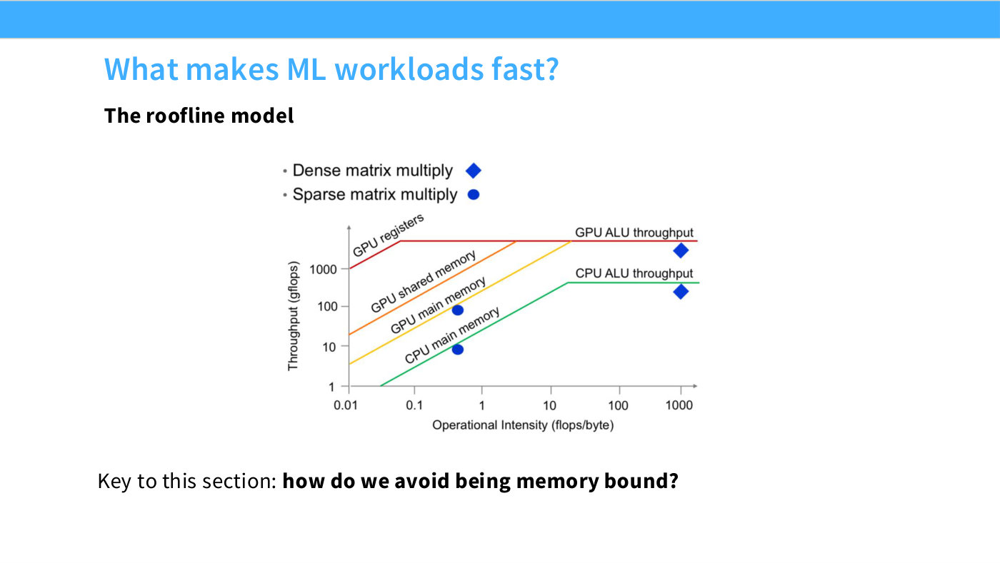
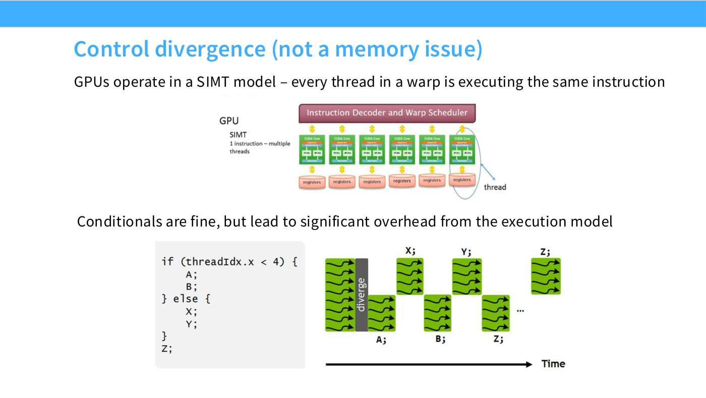

# Arithmetic intensity, roofline analysis, and why MFU is not 1

This is the central idea of [Lecture 2](02-pytorch-resource-accounting.md), and the
one that explains a fact that otherwise looks like a defect: even a well-written
program uses only about half of a GPU's advertised FLOP/s. The reason is that
peak FLOP/s is not the only speed limit. Getting the data to the arithmetic units
is the other one, and for most operations it is the binding one.

## The model: three steps, two speeds

Computing anything on an accelerator is three steps:

1. Send inputs from memory to the accelerator
2. Perform the computation
3. Send outputs from the accelerator back to memory

How long that takes depends on two hardware numbers, and CS336 uses the H100's
throughout:

| Quantity | Symbol in the lecture | H100 value |
| --- | --- | --- |
| Accelerator speed | `h100_flop_per_sec` | $9.895 \times 10^{14}$ FLOP/s (bf16, dense) |
| Memory bandwidth | `h100_bytes_per_sec` | $3.35 \times 10^{12}$ bytes/s |

The FLOP/s figure is 1979 teraFLOP/s **halved**: the datasheet number is quoted
with sparsity, and dense throughput is half of it. Getting this wrong by 2× is the
most common error in napkin math about H100s.

Assume for the sake of the estimate that communication and computation overlap
perfectly. Then the time taken is not their sum but

$$\text{total time} = \max(\text{communication time}, \text{computation time})$$

and whichever term wins gives the regime a name:

- **Memory-bound**: communication time > computation time
- **Compute-bound**: computation time > communication time

## The ratio form, which is the useful one

Comparing two times means recomputing them for every workload. The equivalent
comparison of two *ratios* is scale-free and far more portable.

**Accelerator intensity** is a property of the hardware alone — how much work the
accelerator can do per byte the memory system delivers:

$$I_{\text{accel}} = \frac{\text{FLOP/s}}{\text{bytes/s}} = \frac{9.895 \times 10^{14}}{3.35 \times 10^{12}} \approx 295.4 \text{ FLOPs per byte}$$

**Arithmetic intensity** is a property of the workload alone — how much work it
actually does per byte it moves:

$$I_{\text{arith}} = \frac{\text{FLOPs}}{\text{bytes}}$$

And the criterion becomes a single comparison:

- **Memory-bound**: $I_{\text{arith}} < I_{\text{accel}}$
- **Compute-bound**: $I_{\text{arith}} > I_{\text{accel}}$

The number to carry around is that **an H100 needs roughly 295 FLOPs of work for
every byte you move** before it is even breaking even. That is a demanding
threshold, and it is why the answer to "is this memory-bound?" is so often yes.

## Five operations, worked

The lecture walks five operations in increasing order of intensity. All use bf16
(2 bytes per value), and all are on an H100, so the bar to clear is 295.4.

| Operation | Size | Bytes moved | FLOPs | $I_{\text{arith}}$ | Bound by |
| --- | --- | --- | --- | --- | --- |
| ReLU | $n = 2^{20}$ | 4,194,304 | 1,048,576 | **0.25** | memory |
| Dot product | $n = 2^{20}$ | 4,194,306 | 2,097,151 | **~0.5** | memory |
| Matrix–vector | $n = 1024$ | 2,101,248 | 2,096,128 | **~1** | memory |
| GeLU | $n = 2^{20}$ | 4,194,304 | 20,971,520 | **5.0** | memory |
| Matrix–matrix | $n = 1024$ | 6,291,456 | 2,146,435,072 | **341.2** | **compute** |

Only the last one clears the bar, and it is not close. Read down that
$I_{\text{arith}}$ column: 0.25, 0.5, 1, 5, then 341. The jump is the whole point.

### ReLU — intensity 1/4

```python
n = 1024 * 1024
x = torch.ones(n, dtype=torch.bfloat16, device=cuda_if_available())
y = torch.relu(x)

bytes = (2 * n) + (2 * n)   # Read x, write y (bf16 is 2 bytes/float)
flops = n                   # n comparisons
```

Read one value, write one value, do one comparison: four bytes moved per FLOP, so
$I_{\text{arith}} = 1/4$. In wall-clock terms the communication takes
$1.25 \times 10^{-6}$ s against $1.06 \times 10^{-9}$ s of computation — the memory
system is busy for roughly **a thousand times longer** than the arithmetic units.
The GPU spends essentially the entire operation waiting.

### GeLU — 20× the work, still memory-bound

```python
y = F.gelu(x)   # GELU(x) = 0.5 x (1 + tanh(sqrt(2/pi) (x + 0.044715 x^3)))
flops = 20 * n  # tanh can be approximated in various ways (e.g., polynomials)
```

GeLU moves exactly the same bytes as ReLU but does about 20 FLOPs per element
instead of 1, giving $I_{\text{arith}} = 5$. Twenty times more arithmetic, and it
is *still* sixty times short of the threshold.

This yields the lecture's most useful counterintuitive claim: **ReLU is not faster
than GeLU** when each is run in isolation. Both are memory-bound, both move the
same bytes, so both take the same time — the extra arithmetic in GeLU is free,
hidden inside a memory transfer that was going to happen anyway. If you have ever
chosen an activation function on the grounds that it is cheaper to compute, this
is the calculation that says you were optimizing the wrong term.

It also points at the fix. Since the arithmetic is free and the transfer is not,
the way to speed up elementwise work is to **move the bytes fewer times** — which
is exactly what kernel fusion does, and why Unit 2 of the course spends a lecture
on it. See [course map, Unit 2](course-map.md#unit-2--systems).

### Dot product and matrix–vector — 1/2 and 1

```python
# dot product, n = 2^20
bytes = (2 * n) + (2 * n) + 2   # Read x, read w, write y
flops = 2 * n - 1               # n multiplications, n-1 additions

# matrix-vector, n = 1024
bytes = (2 * n) + (2 * n * n) + (2 * n)   # Read x, read w, write y
flops = n * (2 * n - 1)                   # n dot-products
```

The dot product reads two vectors to produce one scalar: two multiply-adds' worth
of arithmetic for every four bytes, so $I_{\text{arith}} \approx 1/2$.

Matrix–vector is more interesting, because it is where the trend *should* start
paying off and doesn't. It does $n$ dot products instead of one — $n$ times the
arithmetic — but it must read the whole $n \times n$ matrix to do it, which is $n$
times the bytes. The ratio is unchanged at roughly 1. **Every weight is read from
memory and used exactly once.** That single sentence is why matrix–vector products
cannot be made efficient by any amount of cleverness at this level.

And it is the reason for a fact quoted constantly in the rest of the course:
**inference is memory-bound.** Generating one token at a time is a matrix–vector
product per layer, so decoding is stuck at intensity ~1 no matter how fast your
GPU is. See [course map, Unit 2](course-map.md#unit-2--systems) for how inference
work is organized around this.

### Matrix–matrix — finally compute-bound

```python
n = 1024
bytes = (2 * n * n) + (2 * n * n) + (2 * n * n)   # Read x, read w, write y
flops = n * n * (2 * n - 1)                       # n^2 dot products
```

$$I_{\text{arith}} = \frac{n^2(2n-1)}{6n^2} \approx \frac{n}{3}$$

At $n = 1024$ that is 341.2, comfortably past 295.4, so a $1024^3$ matmul is
**compute-bound**. Note what changed: bytes grow as $n^2$ while FLOPs grow as
$n^3$, so intensity grows **linearly in $n$**. Each weight, once loaded, is used
$n$ times instead of once.

Two consequences the lecture draws:

- **As long as we have large matrices, we're compute-bound** — saturating the
  accelerator, which is the only regime in which the hardware's headline number
  means anything.
- **Training Transformers involves big matrix multiplications**, which is why
  training can approach peak and inference cannot.

The $n/3$ form also tells you where the boundary is. The lecture does not do this
step, but its two numbers determine it: solving $n/3 = 295.4$ gives $n \approx
886$, so on an H100 in bf16, square matmuls smaller than roughly 900 on a side are
memory-bound. That is not a large matrix, which is the reassuring part — realistic
Transformer layer widths sit safely on the compute-bound side of it.

One caveat the lecture flags: **both intensities depend on precision.** Halving
the bytes per value (bf16 versus fp32) doubles a workload's arithmetic intensity,
while the hardware's own ratio moves too, since peak FLOP/s is dtype-dependent.
The threshold is not a constant of nature. See [precision and data
types](precision-and-data-types.md).

## Roofline plots

The roofline plot is this analysis drawn once instead of recomputed per operation.
Arithmetic intensity runs along the x-axis, achievable performance up the y-axis:

- Each slice on the x-axis is a particular computation, at its arithmetic
  intensity.
- Each piecewise linear function is a particular piece of hardware — a rising
  bandwidth-limited line, then a flat compute-limited ceiling.
- **The kink is the accelerator intensity**, the transition from memory-bound to
  compute-bound.

The lecture points at the plot in
[*How to Scale Your Model*](https://jax-ml.github.io/scaling-book/roofline/) rather
than drawing its own. (This knowledge base does not describe that figure's
contents; see the note on figures in
[`raw/slides`](../raw/slides/02-pytorch-resource-accounting.md).)

## Back to MFU

[Model FLOPs utilization](flops-and-mfu.md) was defined earlier in the lecture as
measured FLOP/s over the hardware's promised FLOP/s, with the open question: why
is it not closer to 1? The roofline gives the answer as a formula:

$$\text{MFU} = \min\left(1,\ \frac{I_{\text{arith}}}{I_{\text{accel}}}\right)$$

So MFU is not a measure of how good your code is in any general sense — it is
mostly a measure of **what fraction of your work is large matmuls**. An
elementwise-heavy model is not badly written; it is bounded at a low MFU by
arithmetic, and the way to raise it is to change the ratio of bytes to FLOPs, not
to micro-optimize the kernel.

That reframing is what makes the rest of Unit 2 legible: kernel fusion, tiling and
FlashAttention are all techniques for **moving fewer bytes for the same FLOPs** —
that is, for pushing a workload rightward across the kink.

## Where lecture 5 takes this

[Lecture 5](05-gpus-tpus.md) makes the roofline the organizing frame for an entire
lecture: it is "the key to this section: how do we avoid being memory bound?"
(slide 21). Hashimoto restates the shape — a diagonal memory-bound region and a
flat compute-bound plateau — and draws the practical conclusion that "what you need
to do is be on" the compute-bound side, "which means we want to increase the
operational intensity" ([31:32]–[32:18]).



*Slide 21 — What makes ML workloads fast? [Deck](https://github.com/stanford-cs336/lectures/blob/main/lecture_05.pdf)*

Slide 21's version of the chart is more informative than a single roofline, because
it draws **a separate ceiling for each level of the memory hierarchy** — GPU
registers, GPU shared memory, GPU main memory, and CPU main memory — each turning
over into an ALU-throughput plateau at a different operational intensity. That is
the roofline picture of why [tiling](tiling.md) works: moving a workload's reads
from global memory to shared memory moves it onto a higher ceiling, so it becomes
compute-bound at a lower arithmetic intensity than it otherwise would.

The lecture's six tricks are, with one exception, all ways of pushing rightward and
upward on that plot:

| Trick | How it moves you |
| --- | --- |
| [Low precision](microscaling-formats.md) | Halves bytes per element, so bytes/FLOP halves — slide 25 works an elementwise ReLU from 8 bytes/FLOP in fp32 to 4 in fp16 |
| [Operator fusion](operator-fusion.md) | One round trip for a chain of ops instead of one each |
| [Recomputation](activation-checkpointing.md) | Spends FLOPs to avoid memory traffic — 8 accesses down to 5 |
| [Coalescing](memory-coalescing.md) | Uses all of each DRAM burst instead of most of it being waste |
| [Tiling](tiling.md) | Cuts global-memory reads by a factor of the tile size |

The exception is control divergence, which wastes compute rather than bandwidth —
slide 23's own heading calls it out as "not a memory issue." See
[the GPU execution model](gpu-execution-model.md).



*Slide 23 — Control divergence (not a memory issue). [Deck](https://github.com/stanford-cs336/lectures/blob/main/lecture_05.pdf)*

## Where lecture 6 takes this

Lecture 6 uses arithmetic intensity as the scoring function for three ways of
writing a matmul kernel, which is this page's framework doing concrete work
([1:13:25]–[1:17:59]):

| Approach | Reads | Intensity |
| --- | --- | --- |
| Naive — one output element at a time | $O(MKN)$ | $O(1)$ |
| Idealized — all of $A$ and $B$ in shared memory | $O(MK + KN)$ | $O(N)$ |
| [Tiled](tiling.md) — one output tile per thread block | between the two | $O(\text{tile size})$ |

Percy names this page's lecture as the source of the target: the idealized $O(N)$ is
"which, in the second lecture, I said was an ideal thing you could hope for"
([1:14:56]). The reason rung 2 is unreachable — $A$ and $B$ do not fit in shared
memory — is what makes tiling the answer, and the reason rung 1 is bad is pure
redundancy: computing two neighbouring output elements re-reads the same row of $A$
twice.

The same framework explains a benchmark curve earlier in that lecture. Matmul time
is roughly *constant* below about 2000 dimensions and cubic above it, because a
small matmul never reaches the compute roof at all ([25:24]). See
[benchmarking](benchmarking.md).

## Where lecture 10 takes this

Lecture 10 applies the whole framework to inference, and the derivation is the
spine of that lecture. It is done symbolically, in sympy, so what comes out is
algebra rather than measurements — see
[`raw/slides/10-inference.md`](../raw/slides/10-inference.md) for the full
accounting.

**The warm-up.** For $X\,(B \times D)$ times $W\,(D \times F)$ in bf16, FLOPs are
$2BDF$ and bytes are $2BD + 2DF + 2BF$, so

$$\text{intensity} = \frac{BDF}{BD + BF + DF} \;\xrightarrow[\;D, F \gg B\;]{}\; B$$

**The arithmetic intensity of a matrix multiply is the batch size** ([16:15]).
Against an H100's own ratio of $989 \times 10^{12} / 3.35 \times 10^{12} = 295$,
that means you are compute-bound only when $B > 295$ ([17:48]). This is the same
result as this page's matrix–matrix row, restated for non-square matrices — Percy
makes the connection explicitly: it is "the analog where, instead of having one
variable for dimension and square matrices, we have non-square matrices" ([17:02]).

**Applied to a Transformer**, with $S$ tokens conditioned on and $T$ tokens being
produced or scored:

| Layer | Intensity | Prefill ($T = S$) | Generation ($T = 1$) |
| --- | --- | --- | --- |
| MLP | $\to BT$ | $BS$ — compute-bound | $B$ — needs concurrent requests |
| Attention | $\dfrac{ST}{S+T}$ | $S/2$ | $\dfrac{S}{S+1} < 1$ |

The last cell is the finding: generation's attention is roughly 300× short of
saturating an H100, and **no amount of batching fixes it**, because $B$ cancels out
of the ratio. Every sequence hits the same MLP weights but carries its own
[KV cache](kv-cache.md), so batching amortizes one and not the other ([31:46]).

This is also where the $B=1$ matrix–vector case from lecture 2 stops being a toy.
"You don't get these full matrices, you get these very thin matrices or tensors"
([18:35]) — incremental decoding *is* the matrix–vector regime, which is why this
page's intensity-1 row describes the dominant workload of the entire inference
industry. See [prefill and generation](prefill-and-generation.md).

## Sources

- [Lecture 2 — PyTorch, Resource Accounting](02-pytorch-resource-accounting.md)
- [Lecture 10 — Inference](10-inference.md) — the largest application of this page
  in the course: the whole lecture follows from generation's attention intensity
  being below 1.
- [Lecture 5 — GPUs and TPUs](05-gpus-tpus.md) — the roofline as the frame for the
  systems unit, and the hardware reason intensity matters more every year: compute
  throughput is growing faster than memory bandwidth or interconnect.
- [Lecture 3 — Architectures](03-architectures.md) applies this idea twice, and
  they are the two places in the KB where it does real architectural work:
  [RMSNorm](rmsnorm.md) exists because normalization has low arithmetic intensity
  (0.17% of FLOPs, 25.5% of runtime), and [GQA/MQA](attention-variants.md) exist
  because incremental decoding with a KV cache has an intensity of
  $O((n/d + 1/b)^{-1})$ that wants exactly the wrong workload shape.
- [Benchmarking a collective](benchmarking.md#measuring-a-collective) — the same
  bytes-versus-time accounting applied across GPUs. Lecture 7's effective bandwidth
  is introduced as the communication analogue of [MFU](flops-and-mfu.md) ([48:47]).
- [`lecture_02.py` transcription](../raw/slides/02-pytorch-resource-accounting.md)
  — `arithmetic_intensity()` and its five worked operations, lines 338–481
- [Edited transcript](../raw/transcripts/02-pytorch-resource-accounting.md)
- [*How to Scale Your Model* — roofline chapter](https://jax-ml.github.io/scaling-book/roofline/)
