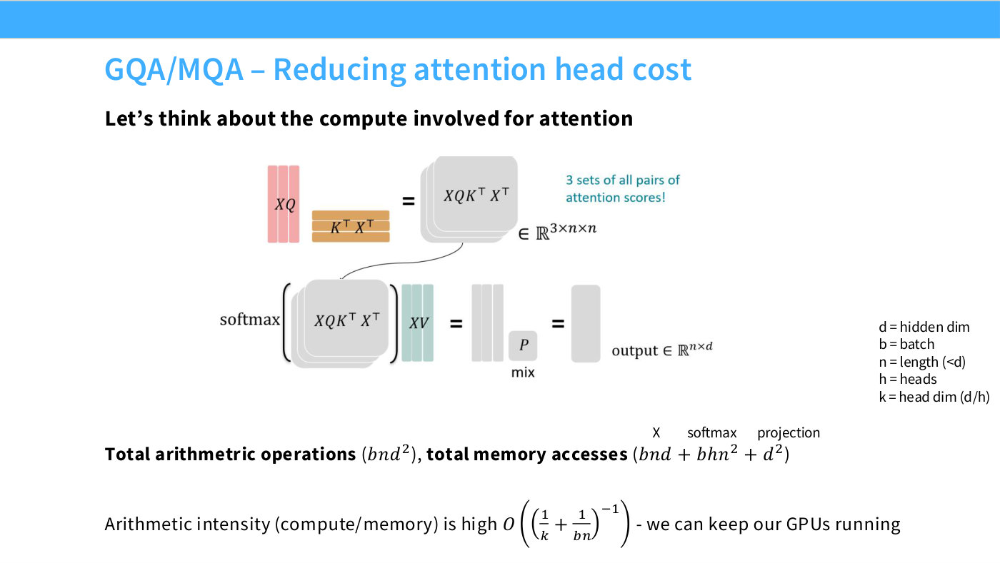
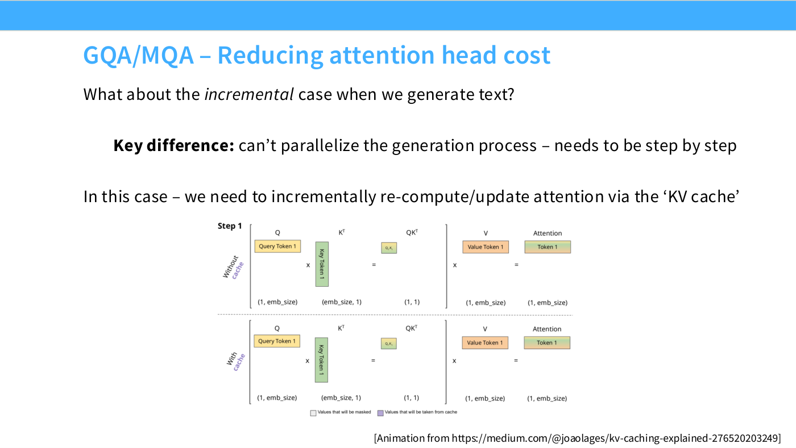
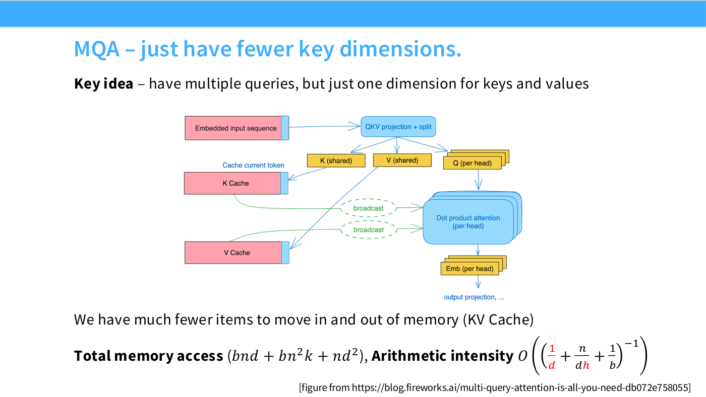
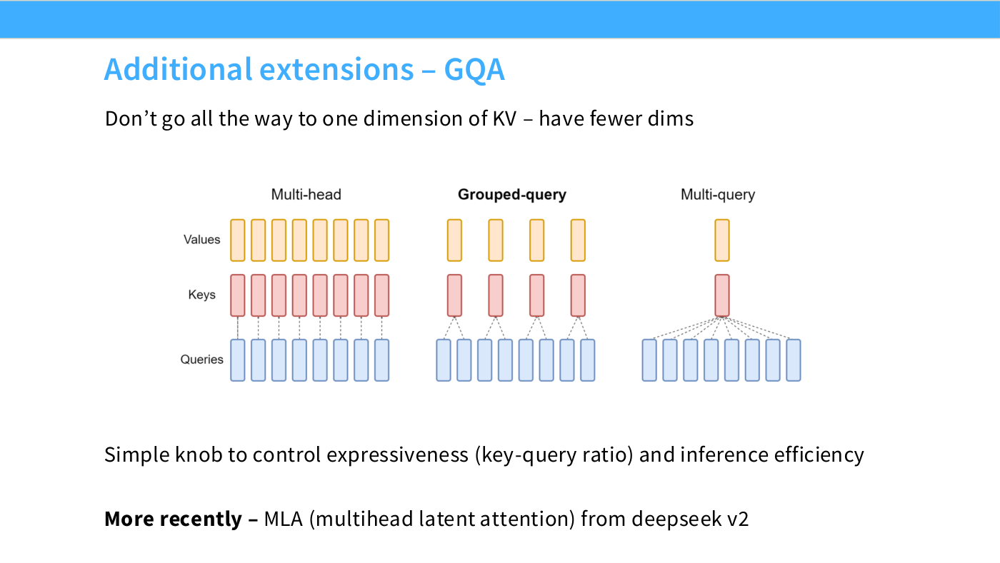
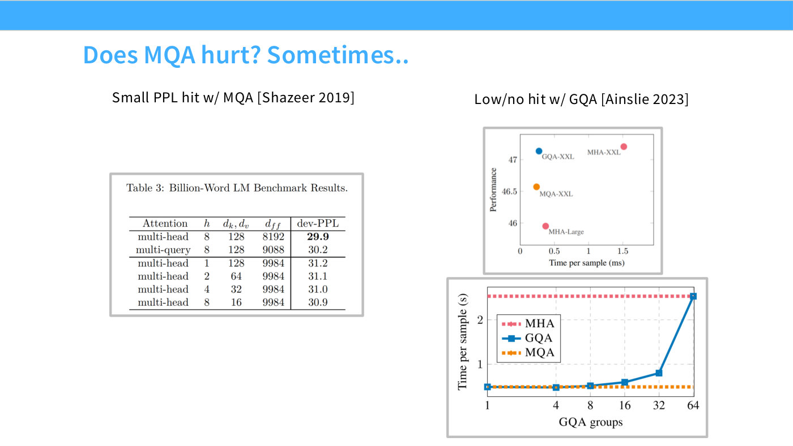
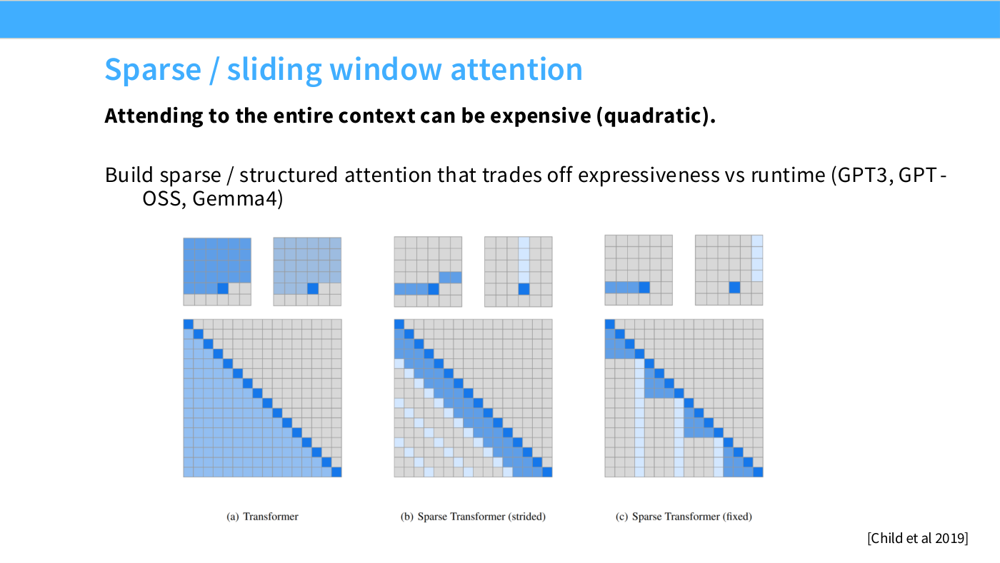

# Attention variants — MQA, GQA and sliding windows

Changes to the attention computation itself. Unlike the rest of Lecture 3, these
are not motivated by quality or by training stability — they are motivated by
**what it costs to serve the model after you have trained it**, and by what it costs
to attend over a long context.

Slide 57 scopes the section: GQA/MQA for inference cost, sparse and sliding-window
attention for compute cost, and "exotic SSM stuff" deferred to the next lecture.
Hashimoto repeats the deferral at [1:13:47]: "if you were interested in hearing about
state space models or linear-time attention, sadly, today is not the day for you."

## The setup: two regimes with very different arithmetic intensity

This section is a direct application of [arithmetic intensity](arithmetic-intensity.md)
from Lecture 2, and it will not make sense without it. Throughout, using the deck's
own symbols from slide 58:

*Slide 58 — GQA/MQA – Reducing attention head cost. [Deck](https://github.com/stanford-cs336/lectures/blob/main/lecture_03.pdf)*

- $d$ — hidden (model) dimension
- $b$ — batch size
- $n$ — sequence length, with $n < d$
- $h$ — number of heads
- $k$ — head dimension, $k = d/h$

### Training and prefill: fine

When you process a whole sequence at once — during training, or during the prefill
pass over a prompt — slide 58 gives:

$$\text{arithmetic operations} \sim bnd^2, \qquad \text{memory accesses} \sim bnd + bhn^2 + d^2$$

and so an arithmetic intensity of

$$O\left(\left(\frac{1}{k} + \frac{1}{bn}\right)^{-1}\right)$$

Both terms in that sum are small when you want them to be: $1/k$ is small if the
head dimension is reasonably large, and $1/(bn)$ is small if batch size times
sequence length is large. As the slide says, "we can keep our GPUs running"
([1:16:49]): "As long as both of these are true, your GPUs are going to be fully
utilized."

### Incremental decoding: not fine

Generation cannot be parallelized across positions — you produce a token, condition
on it, produce the next. Hashimoto calls this "just the curse of autoregressive
language modeling" ([1:16:49]). The standard optimization is the **KV cache**: keep
the keys and values already computed for previous positions, so each new step only
computes the new query–key interactions rather than recomputing the whole matrix
(slide 59).

*Slide 59 — GQA/MQA – Reducing attention head cost. [Deck](https://github.com/stanford-cs336/lectures/blob/main/lecture_03.pdf)*

That saves enormous compute. But it changes the memory pattern, and slide 60 shows
the damage:

$$\text{arithmetic operations} \sim bnd^2, \qquad \text{memory accesses} \sim bn^2d + nd^2$$

$$\text{arithmetic intensity} = O\left(\left(\frac{n}{d} + \frac{1}{b}\right)^{-1}\right)$$

The arithmetic is unchanged — the same matrices are multiplied, just incrementally
rather than all at once ([1:18:22]). The memory accesses are not: the projection term
went from $d^2$ to $nd^2$, because parameters must be re-read at every one of the
$n$ steps.

The resulting intensity needs "large batches, plus short sequence length, or ...
really big model dimensions" — which is precisely the opposite of what a
long-context serving workload looks like. And the problematic term resists fixing:
the slide says outright, "Is there some way around this? The n/d term is difficult
to reduce."

## MQA — multi-query attention

The trick ([1:19:08]): keep multiple **queries** per position, but share **one** key
and one value across all heads. Slide 61: "have multiple queries, but just one
dimension for keys and values."

*Slide 61 — MQA – just have fewer key dimensions. [Deck](https://github.com/stanford-cs336/lectures/blob/main/lecture_03.pdf)*

The KV cache is what dominates the memory traffic, and this shrinks it by a factor
of the head count. Slide 61's revised accounting:

$$\text{memory accesses} \sim bnd + bn^2k + nd^2, \qquad \text{arithmetic intensity} = O\left(\left(\frac{1}{d} + \frac{n}{dh} + \frac{1}{b}\right)^{-1}\right)$$

The deck prints the changed pieces in red. The stubborn $n/d$ term has become
$n/(dh)$ — divided by the number of heads. Hashimoto at [1:19:54]: "this H term
allows us to significantly reduce — sorry, increase — the arithmetic intensity, if
we have a lot of heads."

**The cost is expressiveness.** One key and one value serving every query is a real
restriction: "You do, in fact, lose significant expressive power if you do this"
([1:20:40]).

## GQA — grouped-query attention

The interpolation. Rather than collapsing to a single key–value pair, reduce their
number while keeping all the queries. Slide 62 draws all three side by side from
Ainslie et al. 2023:

*Slide 62 — Additional extensions – GQA. [Deck](https://github.com/stanford-cs336/lectures/blob/main/lecture_03.pdf)*

| | Values | Keys | Queries |
| --- | --- | --- | --- |
| Multi-head | 8 | 8 | 8 |
| **Grouped-query** | 4 | 4 | 8 |
| Multi-query | 1 | 1 | 8 |

Each key/value fans out to serve a group of queries — hence the name. This gives a
continuous knob: "a simple knob to control expressiveness (key-query ratio) and
inference efficiency" (slide 62), or in the lecture ([1:21:25]), "this allows us to
very simply control the trade-off between expressiveness and inference efficiency."

**And the trade-off turns out to be favourable.** Slide 63 carries the evidence, in
three figures that are worth reading carefully.

*Slide 63 — Does MQA hurt? Sometimes.. [Deck](https://github.com/stanford-cs336/lectures/blob/main/lecture_03.pdf)*

Shazeer 2019's Table 3 measures the quality cost of MQA on the Billion-Word
benchmark:

| Attention | $h$ | $d_k, d_v$ | $d_{ff}$ | dev-PPL |
| --- | --- | --- | --- | --- |
| multi-head | 8 | 128 | 8192 | **29.9** |
| multi-query | 8 | 128 | 9088 | 30.2 |
| multi-head | 1 | 128 | 9984 | 31.2 |
| multi-head | 2 | 64 | 9984 | 31.1 |
| multi-head | 4 | 32 | 9984 | 31.0 |
| multi-head | 8 | 16 | 9984 | 30.9 |

MQA costs 0.3 perplexity against full multi-head — but it is much better than any
of the four reduced-head multi-head baselines below the rule, which is the fair
comparison for a model of that inference cost.

Ainslie et al.'s scatter plot puts GQA-XXL at about 0.28 ms per sample with
performance about 47.2, against MHA-XXL at about 1.5 ms for essentially the same
performance — roughly five times the latency for no quality gain — while MQA-XXL is
marginally faster than GQA at 0.24 ms but clearly worse at about 46.6. Hashimoto's
reading at [1:22:11]: "GQA really does get the best of both worlds — very low
inference cost, nearly the same performance as your full multi-head."

> **A caution about that slide's third figure.** It plots time per sample against
> the number of GQA groups, and it has **one** swept curve, not three. GQA is the
> blue line, rising from about 0.42 s at 1 group to about 2.6 s at 64 groups, where
> it meets full multi-head. The MHA and MQA lines are **flat horizontal reference
> levels** at about 2.6 s and 0.40 s — they are not conditions being swept. This KB's
> figure audit checked that reading specifically against the page, because treating
> a reference line as a data series is a common way to misread this chart.

Slide 62 also flags **MLA (multi-head latent attention)** from DeepSeek-V2 as a
different factorization of the same trade-off, deferred to the next lecture.
Hashimoto closes the section by handing off to Percy Liang: "Percy will talk a bunch
more about the inference mechanics later" ([1:22:56]).

One student question worth recording ([1:24:28]): MQA is **not** an
inference-time-only choice. "That's right, yeah, you train with a certain number of
keys." The head structure is fixed at training time.

## Sparse and sliding-window attention

The other cost problem is that full attention is quadratic in sequence length. Slide
64: "Attending to the entire context can be expensive (quadratic)."

*Slide 64 — Sparse / sliding window attention. [Deck](https://github.com/stanford-cs336/lectures/blob/main/lecture_03.pdf)*

The old answer is a structured mask. Child et al. 2019's three-panel figure shows a
full lower-triangular causal mask, a **strided** sparse mask keeping a diagonal band
plus regularly spaced stripes, and a **fixed** sparse mask keeping a local block
plus fixed columns. Hashimoto notes this is genuinely old ([1:25:15]): GPT-3 "actually
used this — if you read the paper, they'll say we alternate between full attention
... and a banded-matrix-style attention."

## Interleaving local and global attention

What is new is how the idea came back. Rather than choosing one mask, **alternate
layers**: cheap local attention most of the time, full attention occasionally.

Slide 65 shows Cohere's Command A, where "Every 4$^{th}$ layer is a full attention"
— blocks 1–3 use sliding-window self-attention, block 4 uses full, at a stated 3:1
ratio. Both block types use grouped-query attention and a SwiGLU MLP with no bias
terms, but they differ in position embedding: the sliding-window blocks use RoPE,
and the **full-attention blocks use none at all**. The slide's summary: "Long-range
info via NoPE, short-range info via RoPE + SWA." See [RoPE](rope.md).

*Slide 65 — Current standard trick – interleave 'full' and 'LR' attention. [Deck](https://github.com/stanford-cs336/lectures/blob/main/lecture_03.pdf)*

Hashimoto's account of the mechanism ([1:26:01]): as you move through the stack,
"you're aggregating local information into global information. The local attentions
at the end can, of course, access more global information" — so purely local layers
are not as limited as they look, because they sit on top of layers that have
already mixed information locally.

Slide 65 names LLaMA 4, Gemma 3, Gemma 4 and OLMo 3 as adopters, with the note that
OLMo 3 "does SWA+Full RoPE" — that is, it keeps RoPE on both kinds of layer rather
than using NoPE. OLMo 3's own hyperparameter table (slide 66) puts sliding-window
attention on **3/4 of layers with a 4,096-token window**.

*Slide 66 — Other recent examples of interleaved attention. [Deck](https://github.com/stanford-cs336/lectures/blob/main/lecture_03.pdf)*

Slide 66 shows three current examples. Gemma 4 stacks four local-attention blocks
before a global one, uses p-RoPE so that only the leading coordinate pair carries
positional information, ties keys to values with 8 queries per key, and always makes
the last layer global attention. **Qwen 3.5 / Qwen 3 Next** does the same alternation
with a different cheap layer — a state-space model called Gated DeltaNet, three
blocks to every one full-attention block ([1:27:34]).

Hashimoto's assessment is that this is where the field is currently moving, and that
it is unsettled ([1:26:49]): attention and "how to manage the trade-off between
long-context cost and performance, is still an active area of investigation — it's a
place where the most architecture work and changes are still being done." The pattern
he identifies over the past year is hybrid models that "aren't just global attention,
aren't just cheap attention — they're some sort of mix in between."

## The systems answer, from lecture 5

Everything on this page is an *architectural* response to attention's cost: change
what is computed. [Lecture 5](05-gpus-tpus.md) gives the other kind of answer —
change how the same computation is executed.
[FlashAttention](flash-attention.md) computes exactly standard attention, with no
approximation, and gets its gains purely from moving less data between global
memory and the SMs. Hashimoto's line in lecture 4 that "constant factors really,
really matter" is cashed out there in detail.

Worth holding the two apart when deciding what to reach for: an architectural
change alters the model you end up with, a systems change does not.

## Where lecture 4 takes this

Lecture 3 stops at *static* sparsity — masks fixed in advance, and alternation
between cheap and full layers on a fixed schedule.
[Lecture 4](04-attention-alternatives.md) picks up exactly here and goes two steps
further.

**[Linear attention](linear-attention.md) and [state space models](state-space-models.md)**
replace the softmax rather than the mask, making cost linear in sequence length and
giving a fixed-size recurrent state at inference. Gated DeltaNet — named above as
Qwen 3.5's cheap layer, with no explanation in lecture 3 — is derived there in full,
as is the reason every deployed model of this kind is still a hybrid with periodic
full attention.

**[Sparse attention](sparse-attention.md)** keeps the softmax and makes the sparsity
pattern *learned* rather than structural: DeepSeek Sparse Attention scores every
preceding token with a cheap indexer and runs full attention on the top-$k$. It is
not linear time, and lecture 4 is emphatic about that — the win is entirely in
constant factors.

## Related

- [Linear attention](linear-attention.md), [state space models](state-space-models.md)
  and [sparse attention](sparse-attention.md) — Lecture 4's continuation of this page.
- [Multi-head latent attention](multi-head-latent-attention.md) — the other KV-cache
  reduction, from Lecture 4, alongside MQA and GQA here.
- [Arithmetic intensity](arithmetic-intensity.md) — Lecture 2's treatment, which
  this section applies directly.
- [Memory accounting for training](memory-accounting-for-training.md) — the other
  half of the resource picture.
- [RoPE](rope.md) — including NoPE and p-RoPE, which the hybrid designs depend on.
- [Lecture 3 — architectures](03-architectures.md).
