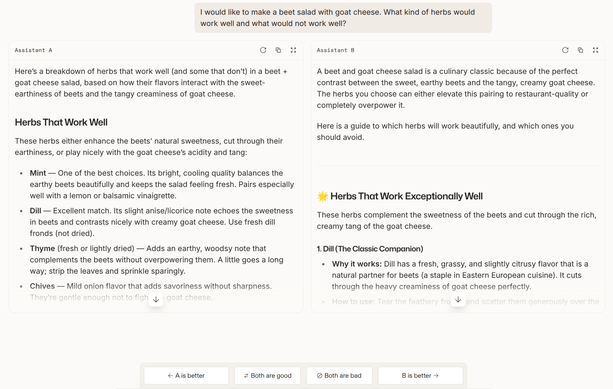
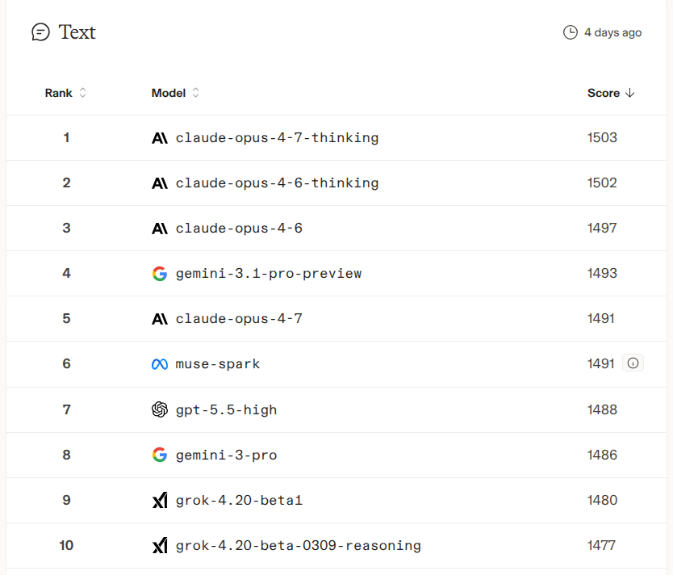

# Chat benchmarks

Exam benchmarks measure a model on questions with a right answer.
[Lecture 12](12-evaluation.md) turns next to the questions people actually ask an
assistant, which have no answer key at all, and the section is organised around a
single problem: **how do you evaluate an open-ended response?**

## The problem

The lecture's example is deliberately mundane (≈[32:22]):

> Prompt: *I would like to make a beet salad with goat cheese. What kind of herbs
> would work well and what would not work well?*

The response is a few paragraphs of culinary reasoning. There is no exact match to
check, no equality test, and no ground truth to check against.

Every benchmark in this section therefore replaces the answer key with a **judge** —
human or model — and then has to deal with that judge's biases. That substitution
is what the whole section is about.

## Chatbot Arena — ask humans, pairwise

[arXiv 2403.04132](https://arxiv.org/abs/2403.04132). Now
[Arena AI](https://arena.ai/leaderboard), formerly LMArena.

**Data collection** (≈[33:07]):

- Any random person on the internet goes to the site and types a prompt.
- Instead of one response they get **two, from two anonymised models**.
- They vote: A is better, B is better, both good, both bad.

*The Arena interface on the lecture's own beet-salad prompt. Two anonymised assistants, and the four vote buttons that are the entire data-collection mechanism.*

**Scoring.** Pairwise votes are turned into ELO ratings under the standard model:

$$p(A \text{ beats } B) = \frac{1}{1 + 10^{(\text{ELO}_B - \text{ELO}_A)/400}}$$

The ratings are the parameters, and they are fit to maximise the probability of the
observed pairwise comparisons (≈[33:53], ≈[34:39]).

*The ratings those pairwise votes produce. A snapshot from when the lecture was prepared, not current standings.*

### What is good about it, and what is not

The lecture's list is deliberately two-sided (≈[35:26]–[37:44]).

**In favour:**

- **Real-world prompts.** The incentive to visit the site is free model access, so
  there is an implicit assumption that people are actually trying to get something
  done.
- **Pairwise comparisons do not require a complete design.** This is the property
  most easily skipped, and it is what makes the whole thing affordable: because ELO
  only needs pairwise outcomes, *you do not have to feed the same prompts to every
  model*. As in chess, not everyone plays everyone — a sparse sample suffices as
  long as the comparison graph is connected. That matters here specifically because
  a **human** is doing the rating, and you cannot ask one person to rate every model
  (≈[37:44]).
- **Dynamic.** New prompts and new models enter over time and the ratings update
  naturally.

**Against:**

- **Who are these people?** "random person on the internet who comes to LMArena" is
  an unknown distribution. The paper reports demographics; demographics do not tell
  the whole story (≈[35:26]).
- **Biases and gaming.** Spammers; people who submitted a model and want it to look
  good. Percy's phrase is that it is "a little bit of a wild west" (≈[36:12]).
- **Binary preference conflates style and correctness.** ELO makes sense for chess
  because the only thing that matters is who won. *which response is better* is far
  less clear-cut (≈[36:12]).
- **The rater often cannot judge correctness.** The person asked the question
  *because they did not know the answer* — so how are they to judge which of two
  answers is right? (≈[36:58])
- **Sycophancy.** More pleasing answers may be upvoted over correct but blunt ones
  (≈[36:58]).

## AlpacaEval — ask a model, against a baseline

[Leaderboard](https://tatsu-lab.github.io/alpaca_eval/), 2023.

- **805 instructions** from various sources.
- **Metric**: win rate against a baseline model (GPT-4 preview), *as judged by*
  GPT-4 preview (≈[38:30]).

This is an instance of **LLM-as-a-judge**, the standard cheap substitute for human
preference. The obvious objection — the judge and the baseline are the same model —
is raised immediately and set aside; the mitigation named is ensembling multiple
judges (≈[38:30], ≈[39:17]).

**The length bias, and the fix.** LLM judges favour longer responses. This produced
real leaderboard gaming: models fine-tuned to produce longer outputs scored highly
on AlpacaEval for that reason alone. AlpacaEval 2.0 fixed it with a simple
**regression to debias the metric**
([arXiv 2404.04475](https://arxiv.org/pdf/2404.04475)) (≈[39:17]).

### How do you evaluate a metric?

This is the sharpest question in the section, and it generalises well beyond
AlpacaEval (≈[39:17], ≈[40:02]).

We evaluate models with metrics. When you propose a *new metric*, what do you
evaluate it against? The lecture's honest answer is that there is no clean one. The
available sanity check is **correlation with a metric you already trust** — and
AlpacaEval's correlation with Chatbot Arena is **0.98**, which is very high
(≈[40:02]).

Two cautions come with that number, both stated:

- Higher correlation is only "better" if you are trying to *mimic* the other metric.
- The correlation is measured **over a particular set of models**, and need not hold
  for models stronger than the GPT-4 preview baseline it was computed against
  (≈[40:49]).

The practical use is real: if you do not want to wait for humans, or do not want to
submit your model to a public arena, you can use AlpacaEval as a stand-in
(≈[40:49]). The lecture notes the AlpacaEval leaderboard has not been maintained in
over a year, so what it shows is a snapshot of its time (≈[40:49]).

*AlpacaEval 2.0. The two win-rate columns are the length-bias fix made visible — the debiased number and the raw one disagree by up to nine points.*

## WildBench — real prompts, judged with a checklist

[arXiv 2406.04770](https://arxiv.org/pdf/2406.04770).

- **1024 examples** sourced from **1M human-chatbot conversations** — like Chatbot
  Arena, they ran a free chat service and collected the queries (≈[41:34]).
- **GPT-4 Turbo as a judge**, with a generated, task-specific **checklist**.
- Well correlated with Chatbot Arena, which has become the de facto sanity check.

**The checklist is the contribution.** Asking a model *is this response good?* is an
ill-defined task — good depends on what you care about. Generating a checklist or
rubric *for that particular prompt* scopes the judgement and makes the evaluation
task well defined (≈[42:23]). Percy's analogy is to chain of thought, but for
judging.

*WildBench. The scores come from a judge working through a checklist generated for each individual prompt, rather than answering an open question about quality.*

He also names the circularity out loud: WildBench validates itself by correlating
with Chatbot Arena, which raises the question of whether Arena is really ground
truth. "at least we're all in the same boat together" (≈[42:23]).

## What the section concludes

The four summary points (≈[43:11]–[44:43]):

- **Pairwise comparisons give higher signal than absolute ratings.** Asking whether
  this response is slightly better than that one is answerable; asking whether it is
  a seven or an eight out of ten is much less reliable.
- **Beware of biases** — humans and LLM judges both have them, and they are
  different biases.
- **Multiple judges help.** If humans and several model judges all say your model is
  better, it probably is.
- **Rubrics and checklists improve reliability regardless of who is judging.**
  Percy's closing note is from crowdsourcing experience: ask a human to rate
  something with no rubric and you get nonsense (≈[44:43]).

That last point is the section's most transferable advice, and it applies directly
to anyone building an internal eval: the failure is rarely the judge, it is the
under-specified question you asked the judge.

## Related

- [Exam benchmarks](exam-benchmarks.md) — what this section is reacting against.
- [Agentic benchmarks](agentic-benchmarks.md) — where the judge is replaced by unit
  tests, which is the one clean escape from this whole problem.
- [Construct validity](construct-validity.md) — the "how do you evaluate a metric?"
  question in its general form.
- [Style and length bias](style-and-length-bias.md) — lecture 15's training-side
  view of the same effect: style is a deliberate data-collection decision, model
  judges share the human bias, and you can "RLHF on length alone and do quite well
  on many of these benchmarks."
- [RLHF](rlhf.md) — what optimizes against these preferences, and
  [reward models](reward-models.md), which inherit the bias.

## Sources

- Course material: [`raw/slides/12-evaluation.md`](../raw/slides/12-evaluation.md),
  section *Chat benchmarks* (`lecture_12.py` lines 155–206).
- Transcript: [lecture 12](../raw/transcripts/12-evaluation.md), ≈[31:37]–[44:43].
