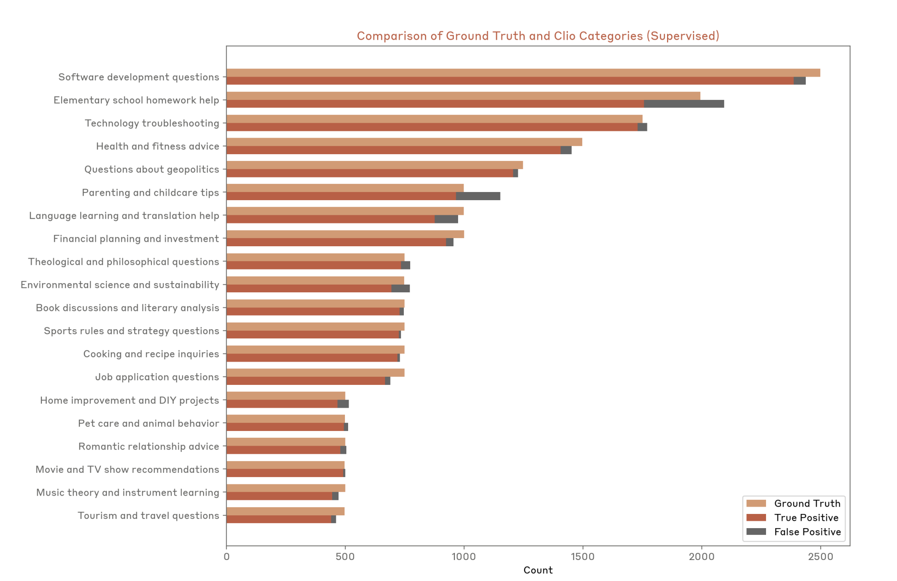

# Construct validity

The single sentence [lecture 12](12-evaluation.md) is built around:

> **Core challenge**: abstract construct → concrete metric

Evaluation, in this framing, is not the mechanical process of sending prompts and
computing accuracy. It is the act of turning something you care about but cannot
measure — intelligence, helpfulness, reasoning, safety — into something you can
(≈[1:37], ≈[2:23]). Every gap between the two is a **validity** problem, and this
page collects the lecture's treatment of them.

Percy's reason for spending a whole lecture on it: **evaluation shapes the
development of AI.** Benchmarks set north stars, and every model developer, open and
closed, looks at them as the measure of progress. Choosing an evaluation is therefore
choosing, implicitly, what models will become good at (≈[1:37]).

## Four answers to "what makes a model good"

The lecture opens by offering four operationalisations of the same construct, each
with a site that embodies it (≈[2:23]–[4:42]). They are alternatives, not steps:

1. **It does well on benchmarks** — [Artificial Analysis](https://artificialanalysis.ai/),
   whose "intelligence index" has become something of a standard.
2. **It does well on benchmarks and is cheap to run** — the same index plotted against
   inference cost. The two are correlated, as you would expect, but not exactly
   aligned (≈[3:09]).
3. **People prefer its responses** — [Arena AI](https://arena.ai/leaderboard), the
   subject of [chat benchmarks](chat-benchmarks.md).
4. **People choose to use and pay for it** — [OpenRouter](https://openrouter.ai/rankings),
   which serves many models through one endpoint and publishes usage statistics.

*Answer one, made concrete: a single intelligence index, and a ranking derived from it.*

*Answer two: the same index against cost. Correlated, as expected, and not aligned — which is why the chart needs a most-attractive quadrant drawn on it.*

The fourth is "more of an economic lens: I don't know what good is, but if people are
paying for it, it must be good" (≈[4:42]) — and Percy immediately flags that OpenRouter
traffic is not representative of all model usage.

*Answer four: revealed preference. What people actually route their tokens to, which is a different question again from any of the first three.*

None of these is the correct answer, and the lecture does not claim one is. The point
of the list is that the construct genuinely underdetermines the metric.

## Realism and ecological validity

> **Ecological validity**: how well does an evaluation capture real-world use?

The trade-off is stated in two bullets (≈[1:04:51]):

- **Exam benchmarks** (e.g. GPQA) are far from real-world use — controlled, but
  unrealistic.
- **Chatbot Arena** prompts come from real people, but the distribution is
  **uncontrolled**.

Three benchmarks try to get both at once, each at the level of a *use case* rather
than an individual query (≈[1:05:37]).

### GDPVal (OpenAI)

[arXiv 2510.04374](https://arxiv.org/pdf/2510.04374).

- **44 occupations** from the **top 9 sectors by US GDP**.
- Tasks written by professionals with **~14 years of experience** — nurses, concierges,
  real estate agents, film and video editors, and so on (≈[1:05:37], ≈[1:06:24]).

**Sampling by share of GDP is the notable move.** It makes the task distribution a
claim about economic significance rather than about what happens to be convenient to
collect — a principled answer to "which real-world tasks?" that none of the other
benchmarks in the lecture attempt.

*Nine GDPVal tasks. Each card pairs a prompt with the deliverable a working professional produced for it — the benchmark's answer key is a piece of real work.*

### MedHELM

[arXiv 2505.23802](https://arxiv.org/abs/2505.23802).

- Previous medical benchmarks were built on **standardised exams**.
- MedHELM has **121 clinical tasks** sourced from **29 clinicians**, over a mixture of
  private and public datasets (≈[1:06:24], ≈[1:07:10]).

The contrast with [exam benchmarks](exam-benchmarks.md) is explicit, and Percy draws
out the analogy to human training: doctors do pass standardised exams, but passing
them is not what qualifies someone to operate — there is a longer process. A language
model should likewise not be deployed on the strength of a medical exam score
(≈[1:06:24], ≈[1:07:10]). The tasks clinicians actually bring to a model look nothing
like multiple-choice questions.

[MedHELM leaderboard](https://crfm.stanford.edu/helm/medhelm/latest/#/leaderboard)

### Clio (Anthropic)

[arXiv 2412.13678](https://arxiv.org/abs/2412.13678).

- Use **language models to analyse real user data**.
- Publish **general patterns** of what people are asking.

The reasoning is that the people who actually have data on what users do are the model
developers, and privacy prevents anyone from reading it directly — but a language model
can read it and report aggregate patterns, such as the kinds of things people use
Claude for (≈[1:07:10], ≈[1:07:58]).

*Clio's categories against ground truth. The bars carry no printed values, so read this figure for shape rather than for numbers.*

> Unfortunately, realism and privacy are sometimes at odds with each other.

That closing line is the section's real conclusion. The ideal evaluation would sample
from the actual query stream; that would be enormously valuable for understanding how
a model really performs and where it fails; and it is exactly the data you cannot
publish (≈[1:07:58]). Clio's aggregate-patterns output is a compromise, not a solution.

## Dataset quality

Contamination — covered in [benchmark contamination](benchmark-contamination.md) — is a
problem with the *model's relationship to* a benchmark. Dataset quality is a problem
with the **benchmark itself**. Both make a score mean less than it appears to, and
neither is visible in the score (≈[1:12:37]).

**Benchmarks get audited and fixed.**

- **SWE-Bench → SWE-Bench Verified**
  ([OpenAI post](https://openai.com/index/introducing-swe-bench-verified/)): the
  original had tasks whose unit tests were not rigorous enough, among other problems
  (≈[1:12:37], ≈[1:13:22]). This is why the leaderboard cited in
  [agentic benchmarks](agentic-benchmarks.md) is the Verified one.
- **Platinum versions of benchmarks**
  ([arXiv 2502.03461](https://arxiv.org/abs/2502.03461)): the same careful audit applied
  to benchmarks like GSM8K and MMLU, where people went through and found questions that
  are simply broken (≈[1:13:22]).

The examples Percy shows are of the mundane, damning kind: a question that refers to a
curve that is not in the text, so it cannot be answered; a question asking whether a
baby has socks on, where there is no way to tell (≈[1:13:22], ≈[1:14:07]).

**Agentic benchmarks are harder to audit**, because the object is not a question and a
set of answers but a whole environment
([arXiv 2507.02825](https://arxiv.org/abs/2507.02825)) (≈[1:14:07]). Two failure modes:

- **Incomplete test cases.** Passing tests is a clean grading signal, but as every
  programmer knows, tests can be incomplete — you can pass them all without a working
  solution.
- **Trivial agents score.** In one documented case an agent that **outputs the empty
  response gets about 38%** (≈[1:14:53]).

That second one is the mirror image of the point in
[agentic benchmarks](agentic-benchmarks.md). There, the worry was that a sophisticated
scaffold inflates a model's score. Here it is that a *trivial* one suffices — which
means the task never measured what it claimed to.

**Docent** ([Transluce](https://transluce.org/introducing-docent)) uses language models
to inspect agent traces and detect problems — a qualitative response to a very
quantitative style of benchmarking (≈[1:14:53]).

Percy's standing recommendation, which is the most directly actionable advice in the
lecture: **whenever you develop a benchmark or run a model on one, look at the outputs
and audit them**, to check that you are actually measuring what you think you are
measuring (≈[1:14:53]).

## How to evaluate a metric

The question surfaces in [chat benchmarks](chat-benchmarks.md) and has no clean answer.
We evaluate models with metrics; when you propose a new metric there is nothing above it
to evaluate against. The available sanity check is **correlation with a metric you
already trust** — AlpacaEval against Chatbot Arena at 0.98 — with two caveats: higher
correlation is only better if you are trying to mimic the other metric, and the
correlation holds only over the set of models it was measured on (≈[40:02], ≈[40:49]).

WildBench validates the same way, and Percy names the circularity out loud: if
everything correlates with Chatbot Arena, is Chatbot Arena ground truth? *"At least
we're all in the same boat together"* (≈[42:23]).

## What's the point of evaluation?

> There is no one true evaluation; it depends on what question you're trying to answer.

The lecture's four purposes (≈[1:15:41], ≈[1:16:27]):

1. A **user or company** making a **purchase decision** — model A or model B for a
   particular use case, say a customer service chatbot.
2. **Researchers** measuring the **raw capabilities** of a model.
3. Understanding the **benefits and harms** of a model, for business and policy reasons.
4. **Model developers** getting **feedback** to improve the model.

These license genuinely different evaluations, and the lecture's complaint is that the
purpose is often not stated. A purchase decision wants ecological validity on *your* use
case. A capability measurement wants difficulty and contamination control. A
benefits-and-harms assessment wants coverage of risks nobody is optimising for.
Developer feedback wants a metric that moves smoothly — which is why
[perplexity](perplexity-evaluation.md) survives inside model development long after it
stopped being a headline number.

## Methods versus models

The most transferable idea in the lecture, and the one most often left implicit
elsewhere (≈[1:16:27]):

- **Before foundation models, we evaluated *methods*.** Train/test splits were fixed, so
  the only thing varying was the algorithm, and a win was attributable to the algorithm.
- **Today we mostly evaluate *models and systems*, where anything goes.** A win could be
  data, scale, scaffold, post-training or luck.

The exception the lecture names is the **nanogpt speedrun**: fixed data, and the metric
is the compute time to reach a particular validation loss. That is a *method*
evaluation, deliberately — a way to evaluate an algorithm rather than an artifact
(≈[1:16:27]).

*The nanogpt speedrun. Data fixed, target loss fixed, and the only thing that varies is the method — which is what makes it a method evaluation.*

Both are legitimate and they serve different people. Evaluating methods encourages
algorithmic innovation from researchers; evaluating models and systems is what
downstream users need, because the model is the thing that ships. What matters is
being deliberate:

> Either way, we need to define the rules of the game!

This connects directly to CS336's own assignments, which are leaderboards over a fixed
compute budget — that is, method evaluations. See
[executable lectures](executable-lectures.md) and [the course map](course-map.md).

## The three considerations

The lecture's closing takeaways name **difficulty, realism, and validity**
(≈[1:17:15], ≈[1:18:01]), and they map onto its own structure: difficulty is the thread
running through the benchmark survey as each generation saturates, realism is the
ecological-validity section above, and validity is contamination plus dataset quality.

Percy's final point is that these **trade off**. It is hard to have a benchmark that is
simultaneously realistic, difficult, ecologically valid, and free of train-test
contamination. Usually you compromise on one, and which one depends on your goals
(≈[1:18:01]).

## Related

- [Benchmark contamination](benchmark-contamination.md) — the other half of validity.
- [Chat benchmarks](chat-benchmarks.md), [agentic benchmarks](agentic-benchmarks.md),
  [exam benchmarks](exam-benchmarks.md), [reasoning benchmarks](reasoning-benchmarks.md),
  [safety evaluation](safety-evaluation.md) — the survey this argument rests on.
- [Upstream vs downstream](upstream-vs-downstream.md) — lecture 9's evidence that a
  metric can reorder models completely when you change what you measure.

## Sources

- Course material: [`raw/slides/12-evaluation.md`](../raw/slides/12-evaluation.md),
  sections *What makes a model good?*, *Realism*, *Validity*, *How to think about
  evaluation* (`lecture_12.py` lines 33–58, 314–391).
- Transcript: [lecture 12](../raw/transcripts/12-evaluation.md), ≈[1:37]–[4:42],
  ≈[1:04:51]–[1:18:01].
