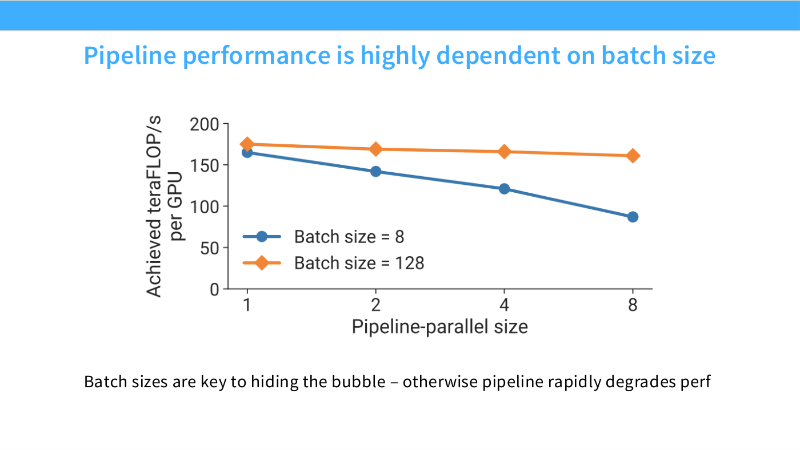
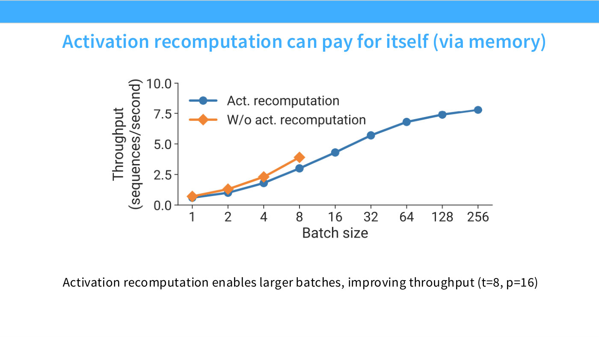
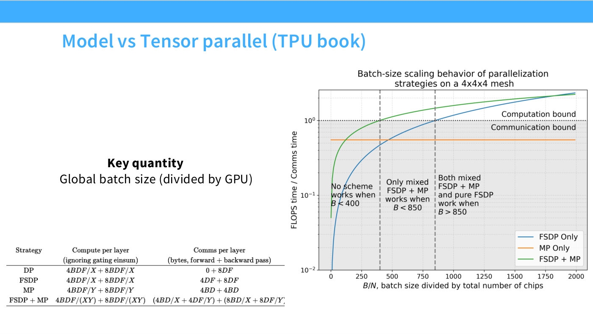
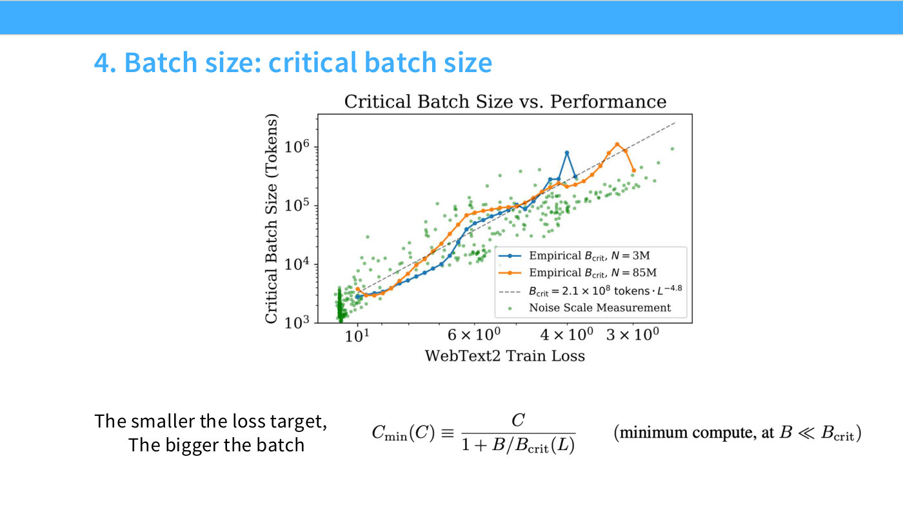
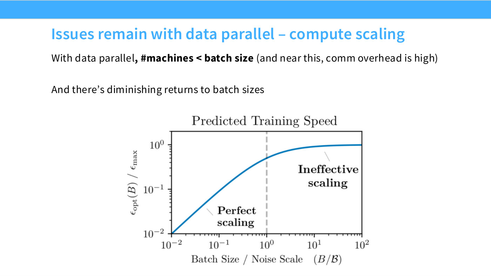

# Critical batch size

Two lectures approach this from opposite sides. **[Lecture 8](08-parallelism-2.md)**
treats it as a systems constraint — the reason
[data parallelism](data-parallelism.md) cannot scale forever, and the reason batch
size is a **consumable resource** rather than a free parameter.
**[Lecture 9](09-scaling-laws.md)** treats it as an optimisation quantity with a
definition, an estimation procedure and a scaling law of its own.

Read the systems half first if you want to know why you care; read
[the optimisation half](#the-optimisation-view-lecture-9) if you need to actually
pick a number.

> **Timestamps on this page belong to two different lectures.** Everything down to
> the end of "The utilisation curve" cites
> [lecture 8's transcript](../raw/transcripts/08-parallelism-2.md); everything from
> "The optimisation view" onward cites
> [lecture 9's](../raw/transcripts/09-scaling-laws.md). Both lectures happen to
> discuss this topic around the 29-to-47-minute mark, so a bare `[29:07]` is
> ambiguous without knowing which section you are in.

## Batch size is a budget

Data parallelism spends batch size to buy accelerators ([29:07]):

> Data parallel is consuming an important resource, and that resource is the batch
> size, so to speak. If you have a batch size of eight, you can never have more
> than eight accelerators.

The obvious response is to grow the batch as you add machines. That fails
([29:07]):

> You can't do that, because at a certain point there's something called the
> critical batch size, where the gain you get from an additional batch element is
> less than if you had taken another SGD step on that single element.

Below the critical batch size, adding examples is genuinely equivalent to taking
more optimisation steps. Above it, returns diminish ([29:53]): "an infinitely large
batch size is not infinitely better than infinitely many single steps."

## The trade-off it forces

Stated as a hard choice ([29:53]):

> Do we want small batch sizes and let our GPUs be more idle, or do we want big
> batch sizes and take the hit on optimization? Kind of hard to say.

Neither answer is right in general, which is precisely why the rest of the lecture
exists: [model parallelism](sharding-vs-replication.md) lets you use more
accelerators *without* spending more batch size.

## Where the budget gets spent

Once you see batch size as a budget, several otherwise-unrelated facts line up:

- **[Pipeline parallelism](pipeline-parallelism.md) spends it on micro-batches.**
  The bubble shrinks as one over the number of micro-batches, so "we need a huge
  batch size in order to reduce this bubble towards zero" ([33:42]). The lecture
  makes the connection explicitly: "this is kind of why I said batch size is a
  useful resource, because now we can spend it in a different way — pipeline more,
  to reduce the amount of idle time" ([33:42]). Slide 36's sweep shows utilisation
  collapsing at small batch sizes and large pipeline degrees.
- **[Activation recomputation](activation-checkpointing.md) buys it back.** Saving
  activation memory frees room for a larger batch, which improves utilisation —
  "memory can be turned into batch size" ([1:11:57], slide 62).
- **Gradient accumulation converts it.** In the standard recipe, "if your batch
  size ends up too small, you can do gradient accumulation, to get better GPU
  utilization" ([1:06:37]).
- **Slide 55's table lists it as a cost.** FSDP's recorded drawback is not only
  that it leaves activations alone but that "it consumes your global batch size in
  order to do the parallelization" ([1:02:00]), whereas tensor parallelism "doesn't
  touch global batch size" ([1:02:46]).

*Slide 36 — Pipeline performance is highly dependent on batch size. [Deck](https://github.com/stanford-cs336/lectures/blob/main/lecture_08.pdf)*

*Slide 62 — Activation recomputation can pay for itself (via memory). [Deck](https://github.com/stanford-cs336/lectures/blob/main/lecture_08.pdf)*

## The utilisation curve

Slide 56 plots this directly: efficiency against per-chip batch size, with a
threshold above which you are compute-bound ([1:05:06]):

*Slide 56 — Model vs Tensor parallel (TPU book). [Deck](https://github.com/stanford-cs336/lectures/blob/main/lecture_08.pdf)*

> If your batch size is big enough, FSDP only is good. If you have a batch size of
> 2,000 per chip, how far can you go? Well, you've got FSDP doing extremely well,
> you're fully compute-bound. But the important thing is, as the batch size goes
> down, FSDP only will hit a point where you're now communication-bound.

Adding model parallelism pushes the curve out, keeping you compute-bound into
smaller per-chip batch regimes — which is the argument for
[3D parallelism](3d-parallelism.md) in one picture.

## The optimisation view (lecture 9)

Lecture 8 says the critical batch size exists and constrains you. Lecture 9 says
what it *is* ([42:12]–[47:37]).

### Two regimes

Below the critical batch size you are **noise-limited** ([42:12]):

> In the noise-limited regime, every additional element you throw in your batch
> reduces the gradient noise in your SGD step, and since you're variance-limited,
> that reduction in variance is very helpful — it gives you big returns.

This is the regime of near-perfect returns: an extra example is worth about as much
as it could possibly be.

Above it you are **bias-limited**, and the argument for why is geometric rather
than statistical ([42:59]). Gradient descent only sees the local structure of the
objective; it has no global view of where the minimum is. So there is a standing
disagreement between the local descent direction and the direction of the true
optimum, and **no amount of variance reduction removes it**. Once gradient noise
falls below that bias, extra batch elements stop buying progress.

The critical batch size is the crossover — "a convenient trade-off point… the point
at which we're starting to cross over from our perfect-scaling regime to our
ineffective-scaling regime" ([43:46]). It is a rule of thumb, not a threshold with
a sharp physical meaning: the underlying derivation comes from a local quadratic
approximation to the objective.

### How it is actually estimated

The mechanical recipe ([44:32]):

1. **Pick a target loss** — the number you want to hit, as fast as possible.
2. **Sweep batch sizes.** For each, record the number of steps $S$ and the number of
   examples $E$ needed to reach the target. They are related by
   $E = S \times B$.
3. **Fit the trade-off.** The OpenAI argument is that steps and examples are
   inversely related, normalised by their own minima $S_{min}$ (the fewest steps
   achievable, at enormous batch size) and $E_{min}$ (the fewest examples
   achievable, at tiny batch size). Minimising one costs you the other ([45:17]).
4. **Balance the two terms.** Solving for the point where neither dominates gives

$$B_{crit} = \frac{E_{min}}{S_{min}}$$

with both quantities estimated from the fitted data ([46:05]). This costs you
slightly more steps than the step-optimal extreme and slightly more examples than
the example-optimal extreme, and buys a balanced position — "improving the
convergence rate without blowing up the number of steps you need."

There is a second estimator the lecture mentions without developing: the ratio of
the **gradient covariance to the squared norm of the gradient** ([46:51]). "You
should really read the critical batch size paper if you're interested."

### Why it belongs in a scaling-laws lecture

Because $B_{crit}$ itself scales ([46:51]–[47:37]). Treat the target loss as a proxy
for compute — a better model means a lower target — and ask how the critical batch
size moves:

> As your loss improves, the critical batch size increases, and it increases in this
> very predictable way, once again a power law. ([47:37])

Slide 39 states it as "the smaller the loss target, the bigger the batch". The
practical consequence is reassuring for exactly the systems problem Lecture 8
raised: **large runs can afford large batches.** "If you have a really large-scale
training run, where you go all the way to the right of this plot, your batch sizes
can be quite large."

*Slide 39 — 4. Batch size: critical batch size. [Deck](https://github.com/stanford-cs336/lectures/blob/main/lecture_09.pdf)*

And the intuition for why ([47:37]): as you approach the minimum you are resolving
finer and finer differences, so gradient noise matters proportionally more, so
variance reduction is worth more.

### Where it sits among hyperparameters

Lecture 9 puts batch size and learning rate in a category of their own — the two
things you cannot copy from someone else's recipe ([41:27]). Everything else
(architecture, optimizer, aspect ratio) you inherit from the literature; these two
you re-derive, and they interact: "you change one, you have to change the other."
The learning-rate half is
[learning rate scaling and muP](learning-rate-scaling-and-mup.md).

Note also that a fixed batch size across model sizes is one of the three defects
that put Kaplan's scaling law a factor of several away from Chinchilla's — it was
suboptimal for the smaller models ([1:09:54], see
[compute-optimal scaling](compute-optimal-scaling.md)).

## See also

- [Lecture 9](09-scaling-laws.md) — the optimisation treatment · [Lecture 8](08-parallelism-2.md) — the systems treatment.
- [Learning rate scaling and muP](learning-rate-scaling-and-mup.md) — the other hyperparameter you must re-tune.
- [Data parallelism](data-parallelism.md) · [ZeRO and FSDP](zero-and-fsdp.md) — what spends the budget.
- [Pipeline parallelism](pipeline-parallelism.md) — the other big consumer.
- [Activation memory](activation-memory.md) — how memory converts into batch size.
- [Scaling laws](scaling-laws.md) — the hub for the lecture 9 thread.
- Lecture 8 material: [slide 29](../raw/slides/08-parallelism-2.md#slide-29--issues-remain-with-data-parallel--compute-scaling) · [transcript](../raw/transcripts/08-parallelism-2.md)
- Lecture 9 material: slides [37–39](../raw/slides/09-scaling-laws.md) · [transcript](../raw/transcripts/09-scaling-laws.md)

*Slide 29 — Issues remain with data parallel – compute scaling. [Deck](https://github.com/stanford-cs336/lectures/blob/main/lecture_08.pdf)*
