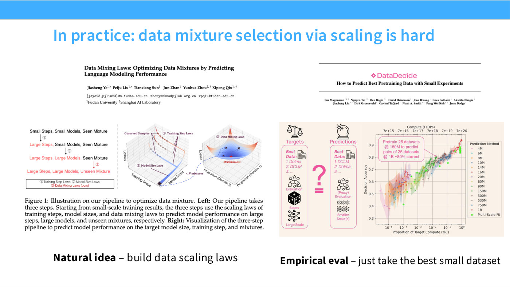

# Data mixture selection

How much news and how much Wikipedia? [Lecture 9](09-scaling-laws.md) uses the
mixture question to show both what scaling laws buy you for data engineering and
where the idealised story breaks down in practice.

## The theoretical hook

The reason to expect mixtures to be tractable at all is the slope/intercept split
([22:19]). Reading data scaling laws as empirical generalization bounds suggests
that **dataset composition affects the offset of the curve, while the slope is set
by the model class** — not by the distribution.

The toy model on slide 23 is a linear regression with two samplable sources: draw
from only one and error is high either way, so the best intercept comes from a
*mixture*. Writing down how that intercept behaves gives "very interesting insights
about how having more data diversity is very helpful" ([23:05]).

*Slide 23 — In practice: data mixture selection via scaling is hard. [Deck](https://github.com/stanford-cs336/lectures/blob/main/lecture_09.pdf)*

## The idealised method

The obvious procedure ([23:51]):

1. Train small models on small amounts of data at various mixture ratios.
2. Fit a functional form for how the mixture level affects performance.
3. Scale up a little, check the trend holds, and extrapolate the same way you would
   any data scaling law.
4. Take the minimum of the extrapolated curve as your mixture for the full run.

This is the **data mixing laws** idea: "fit a functional form at a small amount of
compute, find the minimum, and then scale that out."

## What actually happens

Hashimoto is blunt about the gap ([23:51]):

> Unfortunately, if you talk to anyone who's done a lot of this data-mixture work,
> they'll tell you reality is a lot more noisy than this ideal world would suggest.

In practice, "as far as I know, in many cases", people train a batch of small
models, pick the best mix from those, and scale it up — **no scaling law required**
([24:38]).

**DataDecide** is the large-scale empirical study of this, and it supports the
shortcut: simply picking the best data mix at small scale works well ([24:38]).

## Why the shortcut is not a cop-out

The elegant part of the argument, and worth keeping ([24:38]):

> For what it's worth, that's consistent with the argument that the intercepts
> differ but the slopes don't change — because if the slopes don't change, the best
> mixture at small scale is also the best mixture at large scale.

In other words, the theory that motivated fitting mixture scaling laws is the same
theory that says you do not need to. If composition only moves intercepts, the
ranking of mixtures is scale-invariant, and a small-scale bake-off answers the
question directly. Fitting the law adds machinery without adding an answer.

This is a good instance of the lecture's broader methodological point: knowing
*which* part of the curve an intervention moves tells you what experiment to run.

## The caveat next door

Mixture selection assumes the pool is fixed. It is not — how aggressively you should
filter depends on your compute budget, and the optimal filter loosens as compute
grows. See [data repetition](data-repetition.md), which covers slide 26's
quality-versus-compute grid.

*Slide 26 — Data selection scaling and accounting for finiteness. [Deck](https://github.com/stanford-cs336/lectures/blob/main/lecture_09.pdf)*

## See also

- [Data scaling laws](data-scaling-laws.md) — the slope/intercept result this rests on.
- [Data repetition](data-repetition.md) · [Scaling law methodology](scaling-law-methodology.md)
- [Lecture 9](09-scaling-laws.md) · slide [23](../raw/slides/09-scaling-laws.md) · [transcript](../raw/transcripts/09-scaling-laws.md)
