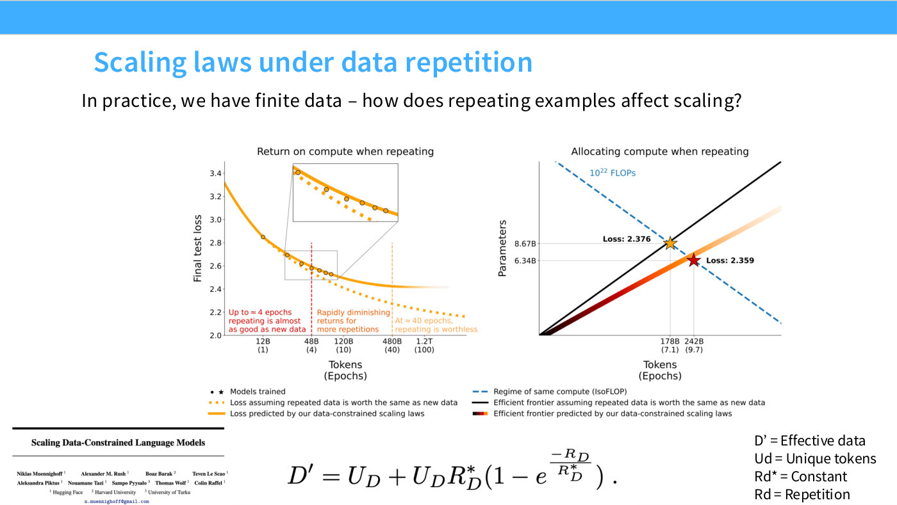
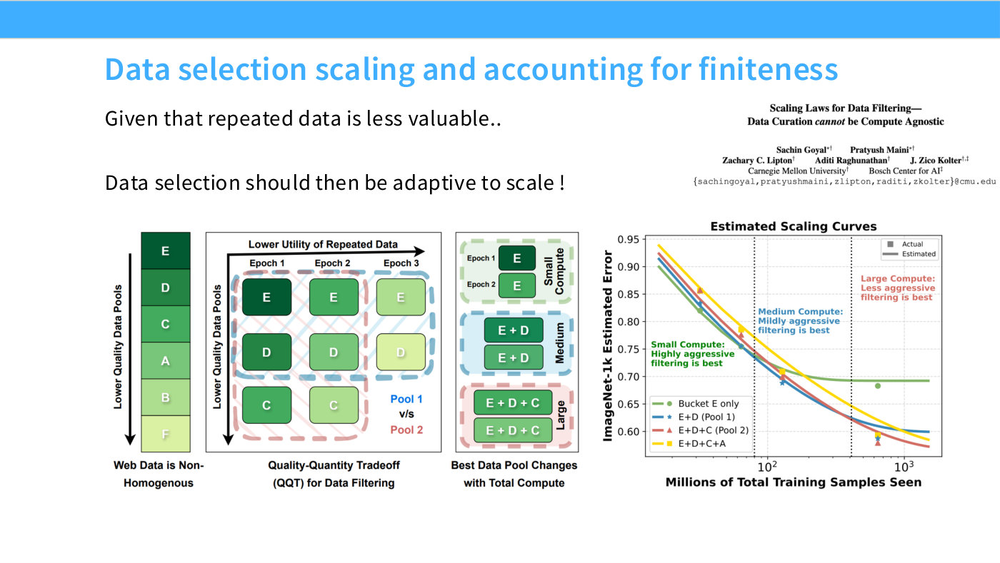

# Data repetition

What happens when you run out of fresh data and start doing multiple epochs.
[Lecture 9](09-scaling-laws.md) treats it as one of the "advanced" data scaling
questions, and the framing is a resource argument: "it's increasingly the case that
compute is growing and the amount of data we have is not growing" ([25:23]).

## The four-epoch result

From *Scaling Data-Constrained Language Models* (Muennighoff et al.), slide 24:

*Slide 24 — Scaling laws under data repetition. [Deck](https://github.com/stanford-cs336/lectures/blob/main/lecture_09.pdf)*

> Up to about four epochs, with standard training recipes, you just don't get hurt
> at all. But if you go past that point, your realized scaling law — this dark
> curve — is much worse than the projected scaling law you'd get with fresh data.
> ([25:23])

The slide annotates its own chart with the three regimes: repeating up to about
**4 epochs is almost as good as new data**; past that there are "rapidly
diminishing returns"; and by about **40 epochs repeating is worthless**.

The paper also supplies a modified functional form that predicts behaviour under
repetition — an **effective data** count that saturates ([26:09], slide 24):

$$D' = U_D + U_D R_D^{*}\left(1 - e^{-R_D/R_D^{*}}\right)$$

where $U_D$ is the number of unique tokens, $R_D$ the number of repetitions and
$R_D^{*}$ a fitted constant. As $R_D$ grows the exponential term saturates, so $D'$
approaches a ceiling no matter how many more epochs you run — which is the four-to-
forty story in closed form.

Slide 24's companion chart makes the allocation point: at a fixed budget of
$10^{22}$ FLOPs, the data-constrained frontier reaches loss 2.359 by choosing a
**smaller model on more token-epochs**, against 2.376 for the naive frontier that
treats repeated data as equal to fresh.

## The infinite-compute limit

The natural extrapolation ([26:09]): if you may epoch as many times as you like,
what is the best you can do with a fixed dataset? Work with a co-advised student
takes the question to its extreme.

The answer is that neither obvious lever works indefinitely — you cannot keep
repeating passes and you cannot keep growing the model, both hit diminishing
returns. So you reach for other things, ensembling among them.

The result Hashimoto flags as the interesting one is again about **slopes**
([26:55]):

> We do all sorts of interventions, like regularizing and adding ensembles — you get
> improvements in performance, but the slopes look surprisingly similar.

Which is the same lesson as everywhere else in
[data scaling laws](data-scaling-laws.md): interventions move intercepts.

## Filtering is scale-dependent

The related point that closes the data section, and the one with the most practical
bite ([27:41]).

If you have little compute, you filter aggressively — you cannot train on the whole
internet anyway, so you keep only the highest-quality slice. If you have a lot of
compute, you *loosen* the filter, because the alternative is repeating that
high-quality slice past the point where repetition pays.

> As you get more and more compute, your filters become looser and looser, and
> potentially you start training on stuff that's lower and lower quality. ([27:41])

So data quality and filtering, usually treated as static properties of a corpus,
are functions of scale: "the optimal filters turn out not to be fixed as a function
of scale."

Slide 26 (Goyal, Maini et al., *Scaling Laws for Data Filtering*) draws the
consequence as a quality-versus-epochs grid: at small compute the best pool is the
top-quality bucket only, at medium compute it grows to include the next bucket
down, and at large compute wider still. Its estimated scaling curves show the
aggressive-filtering line winning early and then flattening into the *worst* of the
four by the right-hand side of the plot.

*Slide 26 — Data selection scaling and accounting for finiteness. [Deck](https://github.com/stanford-cs336/lectures/blob/main/lecture_09.pdf)*

## See also

- [Data scaling laws](data-scaling-laws.md) — the univariate law this extends.
- [Data mixture selection](data-mixture-selection.md) — the other composition question.
- [Compute-optimal scaling](compute-optimal-scaling.md) — where the data budget comes from.
- [Lecture 9](09-scaling-laws.md) · slides [24–26](../raw/slides/09-scaling-laws.md) · [transcript](../raw/transcripts/09-scaling-laws.md)
