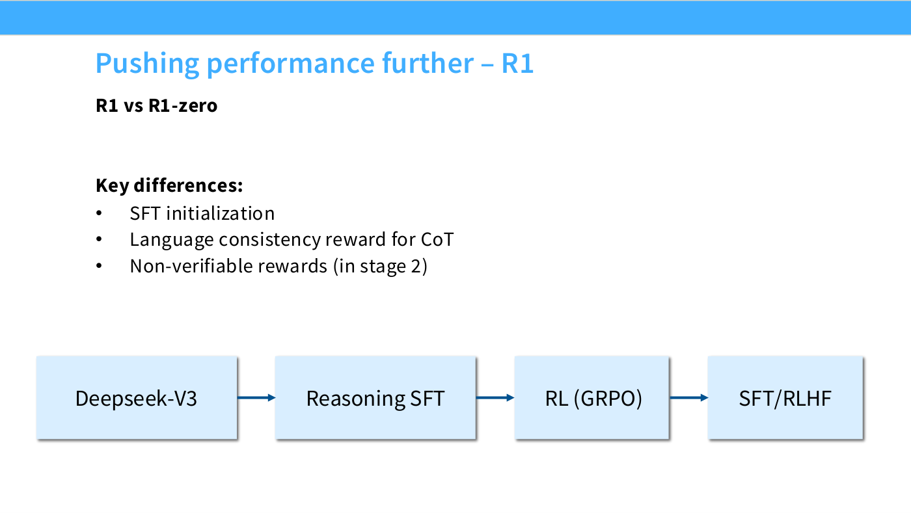

# DeepSeek-R1

The first open model to reproduce o1-style reasoning, and the one that started
the open [RLVR](rlvr.md) wave. [Lecture 16](16-post-training-rlvr.md) treats it
as "a bit of a social phenomenon" (≈26:14) and reads it closely — both for the
recipe, which is simple, and for its two famous claims, which the lecture
substantially deflates.

## Why it mattered

Three things, in the lecture's account (≈27:00):

1. It matched what people had inferred about OpenAI's o1 — very long chains of
   thought, clearly RL, strong performance on hard math.
2. **It published a recipe anyone could run.** This is the part the lecturer
   emphasizes for a research audience: "if your solution was this horrible PPO
   thing that no one but DeepSeek can run, that's much less of an impact, at
   least for us researchers, than this GRPO thing which anyone can really play
   with, even you, in your assignments."
3. Its distillation results have held up. See
   [reasoning distillation](reasoning-distillation.md).

The lineage runs through DeepSeekMath, where [GRPO](grpo.md) was introduced and
where the team "had already understood a lot of the nuances of doing RL on math
problems" (≈27:46).

## R1-Zero: the controlled setting

The scientifically valuable half. A mid-trained base model, GRPO, and two
rewards — accuracy on math problems, and a **format reward** requiring the model
to enclose its chain of thought in thinking tags, which matters because it
"basically allow[s] them to strip out the chain of thought later" (≈28:32). No
SFT at all.

The result lands "only a little bit worse than OpenAI's o1," and the lecture
values it for what it excludes:

> It's a very simple base model plus GRPO, and your math abilities are quite
> good... it has none of the mess of a real production post-training pipeline
> thrown in — you don't really question whether, oh, was it because RLHF was
> helping, or this or that. (≈29:18)

*Slide 28 — R1-Zero's recipe and its results table.*

CS336's own assignment reproduces essentially this.

## Both headline phenomena are overstated

This is the most useful correction in the lecture, and it applies to two claims
that circulated very widely.

**Growing chain-of-thought length.** Presented as the model learning to think
longer; the lecture attributes it largely to the objective. Runaway length "is
arguably a natural side effect of the length normalization of the GRPO
algorithm" (≈30:04), and controlled plots that split correct from incorrect
responses show the growth is driven by the failures (≈39:20). See
[length bias in RL](length-bias-in-rl.md).

**The "aha moment."** The viral finding that a long-trained model starts writing
"aha" mid-reasoning. The lecture reports it is one that "others have shown,
actually appears even in the base model, so clearly it can't just be a result of
the RL algorithm" (≈30:51). The proposed explanation is mundane: people write
"aha, I can use this" while solving math problems, "the model learned it during
pre-training, so it's not surprising at all that somehow, during RL, it just
happens to get extracted, because it's emitting a lot of math tokens."

*Slide 30 — the counter-evidence the lecture puts against R1's own framing.*

The milestone survives the deflation: "I do think R1 was a really important
milestone, in that it highlighted just how simple RLVR could be" (≈30:51).

## R1: productionizing it

Going from R1-Zero to the shipped model adds the pieces
[lecture 15](15-mid-post-training.md) covered, composed in order: mid-trained
model → reasoning SFT → RL with GRPO → SFT/RLHF. RLHF sits last because it is
"the most user-facing part — we want to make sure the formatting and all this is
nice" (≈31:37).

*Slide 31 — the four-box pipeline, and the three differences from R1-Zero.*

Two additions are worth naming:

- **A language-consistency reward.** Without it, R1-Zero-style training would
  "language-switch mid-CoT, and they thought this was very uninterpretable and
  slightly disturbing" — so the reward exists "just for interpretability
  reasons" (≈32:24), not for accuracy.
- **SFT on long-CoT data.** The lecture reads the paper's wording closely: when
  a report says "we construct and collect a small amount of long CoT data," you
  might "wonder, I wonder if that was distilled from some other model," and
  notes this is now universal rather than scandalous (≈33:10).

## Process supervision was dropped

DeepSeekMath used process reward models; R1 does not. "They tried to get process
reward models to work, and they just didn't do very much for them. It turns out
that outcome reward models are great, they're good enough, and you can scale the
data for those a lot better" (≈37:00). See
[process versus outcome supervision](process-vs-outcome-supervision.md).

The lecture also credits the report for publishing negative results — they tried
MCTS too and "couldn't get it to work very well" — and singles out the honesty:
"they're very open about all these explorations and the things they tried that
didn't work, rather than saying they didn't try it at all" (≈37:47).

## See also

- [RLVR](rlvr.md), [GRPO](grpo.md)
- [Length bias in RL](length-bias-in-rl.md) — why the length plot is not what it looks like
- [Process versus outcome supervision](process-vs-outcome-supervision.md)
- [Reasoning distillation](reasoning-distillation.md)
- [Kimi K1.5](kimi-k1-5.md), [Qwen 3](qwen3.md) — the other two case studies
- [Lecture 16](16-post-training-rlvr.md)
