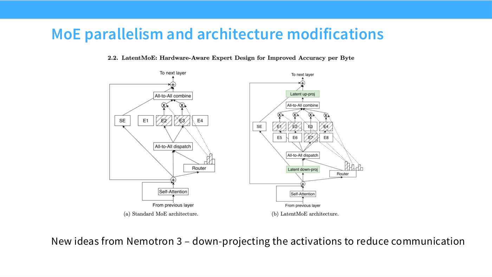
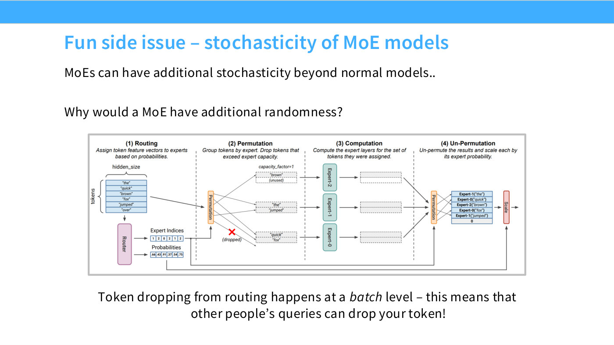
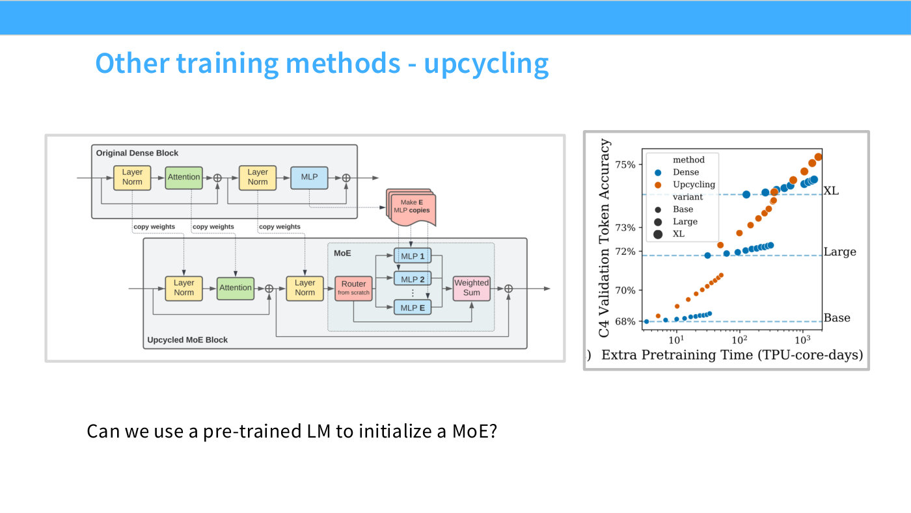

# Expert parallelism

The systems half of [mixture of experts](mixture-of-experts.md): experts are natural
chunks to place on separate devices, which gives large-model training a third axis of
parallelism. Lecture 4 introduces it and defers the detail to the systems lectures
([40:08], [1:11:37]).

**[Lecture 7](07-parallelism.md) now supplies part of that detail** — specifically the
communication primitive expert parallelism runs on. See
[the all-to-all section below](#the-primitive-all-to-all). The full treatment of MoE
systems is still not in this knowledge base.

## Why a third axis is worth having

Large models do not fit on one device, "either to train or to run inference," so "you want
many different ways of cutting up your model to serve or train it efficiently" ([40:08]).

The two standard axes each saturate:

- **Data parallelism** — split the batch across machines. "You're maxed out by your batch
  size — once you hit your batch size, you can't parallelize by data anymore" ([1:12:23]).
- **Model parallelism** — split the model across machines. "There are natural cut points
  where you can cut your model; once you exhaust those, you can't parallelize anymore."

Expert parallelism adds a third, orthogonal to both, and it exists for free in an MoE
because the experts are already separate blocks of parameters that no single token needs
all of.

## The hardware fit

Beyond just being another axis, MoE computation happens to match what accelerators are
good at.

The naive implementation of several experts on one GPU is several small matrix multiplies,
which is the wrong shape — "this isn't nice, because you ideally want these bigger matrix
multiplies where you can reuse caches and do all sorts of things" ([1:12:23]). The better
framing is one large **structured-sparse** multiply:

> You can nicely leverage sparsity — block-diagonal, of course, is the most basic form, but
> you can use much more complicated forms of structured sparsity that are natively
> supported in hardware, letting you multiply experts and inputs in very clean, very fast
> ways. ([1:13:09])

Hashimoto's conclusion: "if you think about the computation patterns of MoEs, they almost
correspond to these kinds of structured matrix multiplications that are very easy and
efficient to support in hardware. So there's this hardware/architecture co-design happening
with MoEs."

## The cost: communication

Routing means activations must travel. "When we do expert parallelism, we have to ship
activations from device to device, to say, 'Oh, you belong in that expert, I need to ship
you over.' That can result in significant communications overhead" ([1:13:57]).

Asked about this directly, Hashimoto frames it as a three-way trade rather than a free
lunch:

> You pay the communication cost of shipping an activation over… in general, you're trading
> certain things off: you're getting more aggregate FLOPs, you're reducing your memory use,
> and in exchange you're going to pay for coms. So it's highly dependent on your topology
> and all these other things, whether this is going to be a net win. ([41:41])

And there is a ceiling: "in general there's an upper limit to parallelization, because as
you shard over more and more devices, the communication cost explodes" ([43:59]). He notes
the course's own assignment asks students to work out sharding against a networking
topology, or the reverse.

## The primitive: all-to-all

[Lecture 7](07-parallelism.md) names the
[collective operation](collective-operations.md#the-general-one) that expert parallelism is
built on, and it is the most general one in the catalogue: **all-to-all**, where every rank
sends a distinct piece to every other rank.

The reason it has to be all-to-all is [routing](moe-routing.md). Percy's framing: "each rank
has both a split of the data and also a subset of experts. And the key idea of the MoE is
that it's dynamic routing. You have to look at your data to figure out which experts you
need to route those activations to. So, it ends up being an all-to-all communication"
([17:54]–[18:39]). Both the data *and* the experts are distributed, and which token needs
which expert is not known until the router has run — so in general every rank has something
to send every other rank.

**When the splits are balanced, all-to-all is a transpose**: "if you think about this as a
matrix, all you're doing is transposing that matrix" ([18:39]). Unbalanced splits are
supported — you can configure any number of bytes to any rank — "but, in general, you want
the splits to be as balanced as possible."

That is a second, purely systems-level argument for
[load balancing losses](load-balancing-losses.md), independent of the quality argument in
Lecture 4. Percy makes the connection explicitly: "remember Tatsu's lecture, where we had
load balancing to make sure that things were as balanced as possible. So, morally, the ideal
goal is to have the all-to-all look like this" ([19:25]). An imbalanced router does not just
waste capacity — it turns a clean transpose into a skewed communication pattern in which
every rank waits for the busiest one.

Lecture 7 does not implement expert parallelism. It lists it among the axes it leaves out,
alongside sequence parallelism, noting only that it "allows you to parallelize the experts
for MoEs, and this is where the all-to-all that I mentioned comes in" ([1:15:51]). In its
closing taxonomy, expert parallelism is grouped with
[tensor parallelism](tensor-parallelism.md) as a cut along the **width** ([1:18:54]).

## Nemotron 3's down-projection trick

Slide 46, which Hashimoto flags as "a very recent development" ([1:13:57]) and offers as
the answer to the communication question raised earlier in the lecture.

*Slide 46 — MoE parallelism and architecture modifications. [Deck](https://github.com/stanford-cs336/lectures/blob/main/lecture_04.pdf)*

The observation is that the shared expert and the routed experts have different
communication requirements. A shared expert processes every token locally, so it never
needs its activations shipped and can stay at full width. Routed experts do need shipping.
So: **shrink the thing you have to send.**

> My shared expert, which I'm not going to communicate, can be in big dimensions, but my
> experts — I need to communicate those activations, so I want those to be in smaller,
> lower-dimensional vectors. So you might take your residual stream and down-project it
> first, and then do the collective communication call of sending this activation out.
> ([1:13:57])

The payoff: "that significantly saves on communication, without fully having the drawbacks
of a smaller hidden dimension size" ([1:14:43]) — because only the routed path is narrowed,
not the model as a whole.

## Shared experts undo the savings

A consequence worth keeping straight, raised by a student. Always-on
[shared experts](moe-routing.md) must see every token, so they cannot be sharded the way
routed experts can:

> In the shared-expert case, you wouldn't get any parallelization savings; every activation
> has to route through those. You can copy the shared expert to trade memory for reduced
> comms cost. ([57:51])

Replicating the shared expert on every device removes the communication but pays for it in
memory — the usual trade.

## Token dropping, and why it used to make inference non-deterministic

Slide 47. Hashimoto calls this "one final trivia detail of MoEs that I think is fun — but
which has been solved in recent years" ([1:14:43]).

*Slide 47 — Fun side issue – stochasticity of MoE models. [Deck](https://github.com/stanford-cs336/lectures/blob/main/lecture_04.pdf)*

Unless experts are perfectly balanced on the input distribution, some fill up faster than
others. Older infrastructure handled overflow by discarding:

> If some expert — say, expert zero — is just a really popular expert, you start running
> into situations where this expert's queue of tokens keeps building up and building up,
> and eventually you get to a point where you say, "My queue is so long, I have to start
> dropping tokens." In the earlier generation of MoE inference infrastructure and code, a
> lot of what happened was you'd just silently drop the token for that expert, and proceed
> with your computation as if nothing happened — you'd just send a zero back and pretend
> that was fine. ([1:15:30])

Because queues are per-batch and batches mix users, this leaked across requests:

> If other users are sending queries that hit the experts you're using, you could actually
> get a worse result, because they'd bump you out of the expert queue. ([1:15:30])

Your output depended on who else was being served alongside you. **Dropless**
implementations — MegaBlocks and the other common open-source MoE frameworks — have removed
this, and "this isn't really an issue anymore" ([1:16:16]).

This is also the systems argument for [load balancing losses](load-balancing-losses.md):
balanced experts mean queues that do not overflow, which is why DeepSeek adds a *device*-level
balancing term on top of the per-expert one.

## Related pages

- [Mixture of experts](mixture-of-experts.md) — the parent topic.
- [Load balancing losses](load-balancing-losses.md) — including the per-device variant.
- [MoE routing](moe-routing.md) — shared experts and the table of what models use.
- [Resource accounting](resource-accounting.md) and
  [memory accounting for training](memory-accounting-for-training.md) — the accounting this
  parallelism is trying to improve, from lecture 2.
- [Collective operations](collective-operations.md) — all-to-all and the rest of the
  catalogue, from lecture 7.
- [Tensor parallelism](tensor-parallelism.md) — the other width cut; lecture 7 groups the
  two together.
- [Lecture 4](04-attention-alternatives.md), [Lecture 7](07-parallelism.md).

## Where lecture 8 takes this

Lecture 8 promotes expert parallelism from "a thing MoE models allow" to a
first-class parallelism axis with its own rules — and its own mess.

**Prefer it over tensor parallelism.** Slide 51 reproduces Megatron's guideline
directly: if you are going to do either EP or TP, use EP ([54:19]). Two reasons
([55:04]): cutting matrices too finely starves GPU utilisation — "you want your
matmuls as big as possible, and tensor parallel reduces that" — and routing sparse
token activations is easier than routing dense tensor-parallel ones. The general
rule for MoE runs: "once you go to MoEs, you replace tensor parallelism with expert
parallelism — they serve similar goals, but expert parallelism is just a little
more efficient" ([1:14:16]).

*Slide 51 — Other training methods - upcycling. [Deck](https://github.com/stanford-cs336/lectures/blob/main/lecture_04.pdf)*

**It is genuinely hard.** Both DeepSeek and NVIDIA ship dedicated libraries —
**DeepEP** and **HybridEP** — for expert dispatch, working at the level of
"low-level GPU networking primitives" ([55:50]–[56:37]). The difficulty is
all-to-all dispatch under a latency constraint: "you need to do this in a very
latency-sensitive way, because your computation is waiting for your tokens to
arrive" ([56:37]). The lecture's favourite detail: the DeepEP authors found
**undocumented [PTX](ptx.md) instructions** to speed the networking up ([57:23]).

**Two composition problems**, and these are what make EP messier than the other
axes:

1. **EP is usually nested inside DP.** The naive arrangement makes the DP and EP
   replica groups the same — "say I have a data parallelism of eight: I'm going to
   shard my eight experts across those eight replicas" ([58:08]). Natural, but it
   "bound[s] how far you can parallelize with EP, and it constrains how DP and TP
   interact" ([58:53]).
2. **EP applies unevenly to the model.** MoE changes the MLPs, not the attention
   ([59:39]). So you want *high* tensor parallelism to cut up attention and *low*
   tensor parallelism to keep the expert matmuls big — a direct conflict. The
   modern fix decouples them: "the attention layers get one kind of tensor
   parallel, and the MoE layers get another kind of tensor parallel" ([1:00:25]).

**In the wild** ([parallelism case studies](parallelism-case-studies.md)): DeepSeek
V3 runs 64-way EP by grouping eight machines, using pipelining tricks to keep
utilisation up ([1:13:31]); Qwen 3 runs EP 32; Mixtral 8x22B runs EP 8. Slide 72's
summary is that "EP can be big (but hard!)".
