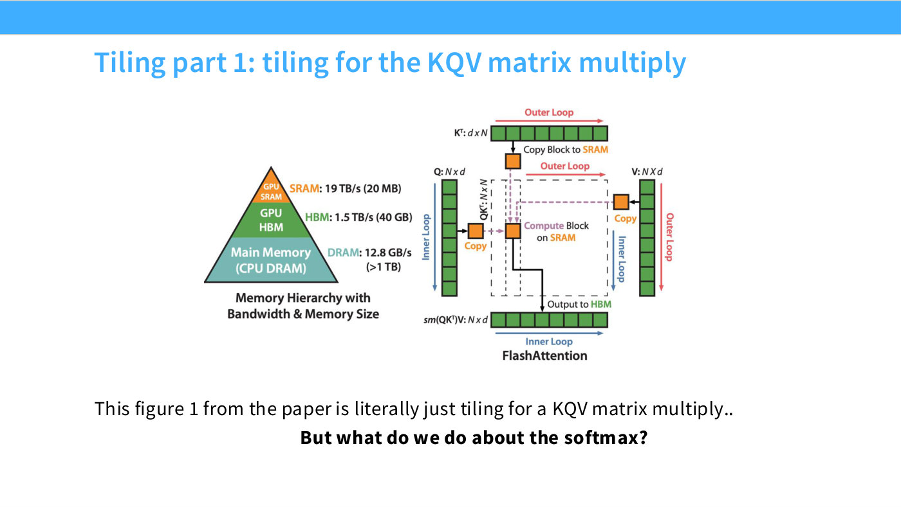
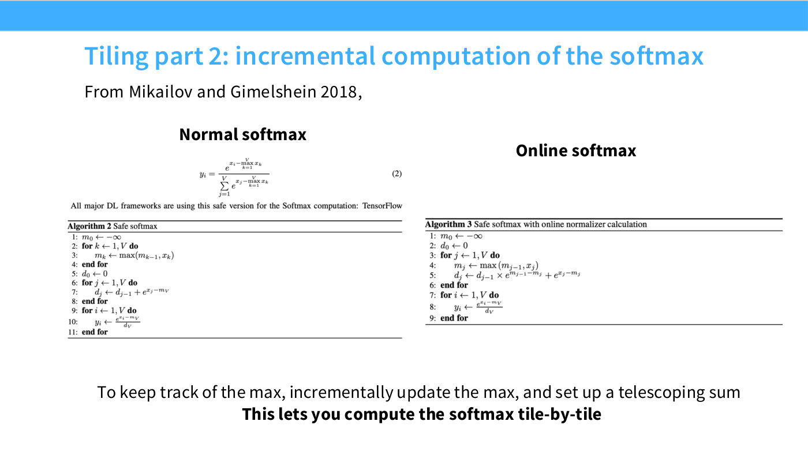
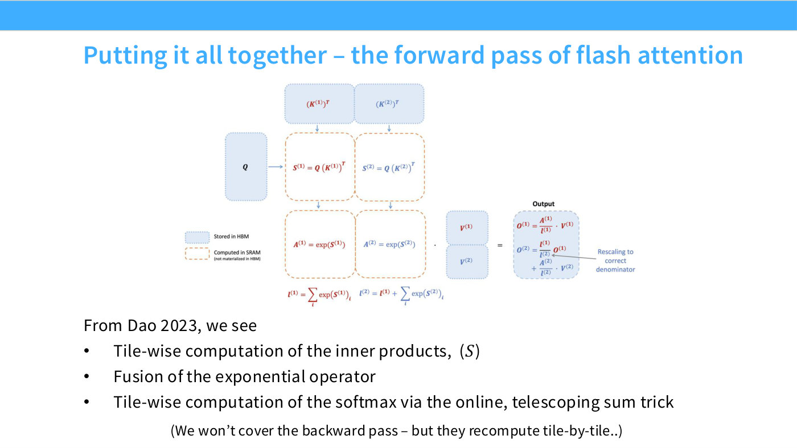
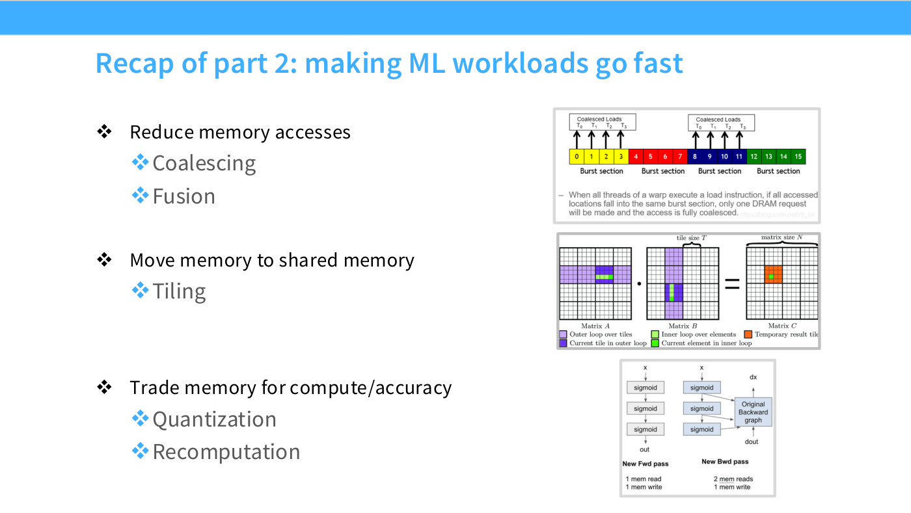

# FlashAttention

FlashAttention is where Lecture 5 lands, and Hashimoto frames it as the payoff for
everything before it: "we've learned a bunch of things about GPUs, and it would be
nice to tie that all together" ([1:11:23]). He calls it the lecture's victory lap —
by this point "we understand everything we need in order to reinvent our own flash
attention" ([3:55]).

The claim that makes it worth studying in a systems lecture rather than an
architecture one: **FlashAttention changes no mathematics.** It computes exactly
the attention that a naive implementation computes. It is "all systems — it's going
from PyTorch's naive implementation of attention to a single, very cleverly fused
kernel" ([1:12:09]), and the gains "come from improvements in the amount of memory
transferred from HBM, the global memory."

## What it is made of

The paper's own summary, as Hashimoto reads it at [1:12:56], is that it does two
things: **tiling** and **recomputation**. Both are tricks the lecture has already
covered — see [tiling](tiling.md) and
[activation checkpointing](activation-checkpointing.md) — and the result is
sub-quadratic behaviour in the number of memory accesses.

Attention itself is four operations ([1:12:56]): a matmul of $Q$ and $K$, a softmax,
and a matmul with $V$ — "three matrix multiplies and one softmax."

The three matmuls are not the problem. We know how to tile a matmul, and slide 52's
figure is "literally just tiled matrix multiplies — we've seen this before."

*Slide 52 — Tiling part 1: tiling for the KQV matrix multiply. [Deck](https://github.com/stanford-cs336/lectures/blob/main/lecture_05.pdf)*

## The obstacle: softmax is global

The difficulty is the softmax in the middle. As Hashimoto puts it at [1:13:42]:
"there's a big global softmax over the whole thing — we can't do this naively,
because the softmax is a global operation that ties everyone together. It connects
all of the different tiles together."

A tile of the score matrix cannot be normalized on its own, because the denominator
sums over the whole row — including entries in tiles that have not been computed
yet. So it "might not seem obvious how to tile attention."

## The key trick: the online softmax

The resolution predates FlashAttention. Slide 53 credits Milakov and Gimelshein
(2018) and shows the two algorithms side by side.

*Slide 53 — Tiling part 2: incremental computation of the softmax. [Deck](https://github.com/stanford-cs336/lectures/blob/main/lecture_05.pdf)*

**Safe softmax** (the version every framework uses) takes three passes: find the
maximum for numerical stability, sum the shifted exponentials, then divide.

$$y_i = \frac{e^{x_i - \max_{k=1}^{V} x_k}}{\sum_{j=1}^{V} e^{x_j - \max_{k=1}^{V} x_k}}$$

Here $x$ is the vector of scores being normalized, $V$ its length, $m$ the running
maximum and $d$ the running denominator.

**Online softmax** folds the maximum pass into the sum pass. Slide 53's Algorithm 3
keeps a running max $m_j$ and a running denominator $d_j$, and updates both in a
single loop:

$$m_j \leftarrow \max(m_{j-1}, x_j)$$

$$d_j \leftarrow d_{j-1}\, e^{m_{j-1}-m_j} + e^{x_j - m_j}$$

The second term is the whole idea. Whenever the running maximum changes, every
contribution accumulated so far was shifted by the *old* maximum, so the
accumulator is rescaled by $e^{m_{j-1}-m_j}$ to put it on the new footing. Nothing
has to be revisited.

Hashimoto's description at [1:14:28]: "as you go, you compute the normalized
softmax, and every time you encounter a bigger number than what you've seen before,
you swap out the maximum... Otherwise, this is really just an online running sum of
an exponential over everything we've seen. At the end, you divide everything by the
accumulator you've computed online."

**Why this unblocks tiling** ([1:15:14]): "because it's online and goes block by
block, or piece by piece, we can compute it tile by tile — I don't need to see the
rest of the tiles to compute this."

## The forward pass, two tiles

Slide 54 traces it concretely, with a legend separating what is **stored in HBM**
from what is **computed in SRAM and never materialized in HBM**. For tiles 1 and 2:

*Slide 54 — Putting it all together – the forward pass of flash attention. [Deck](https://github.com/stanford-cs336/lectures/blob/main/lecture_05.pdf)*

$$S^{(1)} = Q (K^{(1)})^\top, \qquad A^{(1)} = \exp(S^{(1)}), \qquad l^{(1)} = \sum_i \exp(S^{(1)})_i$$

$$l^{(2)} = l^{(1)} + \sum_i \exp(S^{(2)})_i$$

$$O^{(1)} = \frac{A^{(1)}}{l^{(1)}} \cdot V^{(1)}, \qquad O^{(2)} = \frac{l^{(1)}}{l^{(2)}} O^{(1)} + \frac{A^{(2)}}{l^{(2)}} \cdot V^{(2)}$$

$S$ is the score tile, $A$ its exponentiated form, $l$ the running denominator, $O$
the running output. The deck annotates the $\frac{l^{(1)}}{l^{(2)}}$ factor as
"Rescaling to correct denominator": it converts the tile-1-only estimate into one
correctly normalized by the combined denominator. That is the online-softmax update
of the previous section, now applied to the output rather than to a scalar sum.

The bullets on slide 54 name the three ingredients: tile-wise inner products,
**fusion of the exponential operator** — see [operator fusion](operator-fusion.md) —
and tile-wise softmax via the online telescoping sum.

Note what never touches global memory: the $S$ and $A$ tiles. The full
$N \times N$ score matrix is never written out. Hashimoto walks the same picture at
[1:15:59]: keep the tiles in SRAM, compute the exponential there, carry "the partial
running sums of my softmax as I go, in shared memory or registers or elsewhere.
That's a very small number of things to keep track of."

## The backward pass: recomputation

The forward pass alone does not finish the job, because the naive backward pass
wants those activations back. "If you saved your activations, you'd still have this
N-squared-sized activation you'd need to save for attention. Instead, throw it all
away and recompute everything tile by tile on the backward pass" ([1:16:44]).

That is exactly the trade in
[activation checkpointing](activation-checkpointing.md) — spend compute, save
memory traffic — applied at tile granularity. The deck (slide 54) says the backward
pass is out of scope but notes "they recompute tile-by-tile."

## Provenance note

Two attributions in this section of the deck are worth reading carefully. Slide 53
prints the online-softmax credit as "Mikailov and Gimelshein 2018"; the deck's own
spelling is transcribed as printed. Hashimoto is uncertain at [1:15:14] about which
paper a figure comes from — "I think this is from flash attention two, or maybe
three — I think it's two" — and slide 54 credits Dao 2023. The transcript preserves
the hedge rather than resolving it.

## Lecture 6: the ingredients for building it

Lecture 6 never implements FlashAttention, but it is explicitly the destination.
Introducing the four kernels, Percy says that by the end of them "you'll have all the
ingredients you need to do the assignment and implement flash attention" ([57:54]).

Read in that light, the ladder is a construction plan: [fused
softmax](fused-softmax.md) gives you the reduction and the numerically-stable
max-subtraction; the row-sum kernel gives you the pattern for a reduction over data
too big to hold at once; and [tiling](tiling.md) gives you the block structure with an
accumulator in shared memory. What Lecture 5 supplies on top is the online-softmax
reformulation that makes the reduction work in one pass — the piece no compiler
derived on its own.

The kernels are written in [Triton](triton.md), which is what Assignment 2 asks for.

## Related

- [Tiling](tiling.md) — the mechanism, and the tile-size and alignment concerns.
- [Activation checkpointing](activation-checkpointing.md) — recomputation as a
  general trade.
- [Operator fusion](operator-fusion.md) — the third ingredient.
- [Attention variants](attention-variants.md) — the architectural alternatives, as
  opposed to this systems-level one.
- [Arithmetic intensity](arithmetic-intensity.md) — why moving less memory raises
  throughput.
- [Lecture 5 — GPUs and TPUs](05-gpus-tpus.md).
- [Transcript](../raw/transcripts/05-gpus-tpus.md), [slide deck](../raw/slides/05-gpus-tpus.md).

## Its place in the activation-memory budget

Lecture 8 gives FlashAttention a precise role in the memory accounting. Per-layer
[activation memory](activation-memory.md) is $sbh(34 + 5as/h)$, and that second
term is exactly what FlashAttention removes ([47:25]):

> This odd-looking term, $5as/h$, comes from the quadratic attention terms,
> including the dropout terms, and we can drop this term via recomputation, if we
> do flash attention.

That is the difference between rows 2 and 4 of slide 49's table, and between rows 3
and 5. The reason it is worth doing here specifically, rather than recomputing the
MLP as well, is the asymmetry noted at ([52:48]): attention recomputation "is
generally cheaper, because you do it tile-wise as well, and also you don't want to
pay the quadratic cost again". Cheap to recompute, quadratic to store.

*Slide 49 — Recap of part 2: making ML workloads go fast. [Deck](https://github.com/stanford-cs336/lectures/blob/main/lecture_05.pdf)*

[Context parallelism / ring attention](context-parallelism.md) applies the same
block-wise accumulation across *devices* rather than within one, so a sequence too
long for any single accelerator can still be attended over ([1:01:12]).
