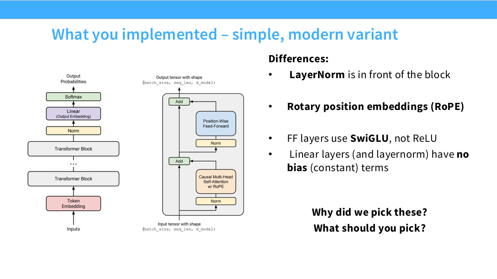
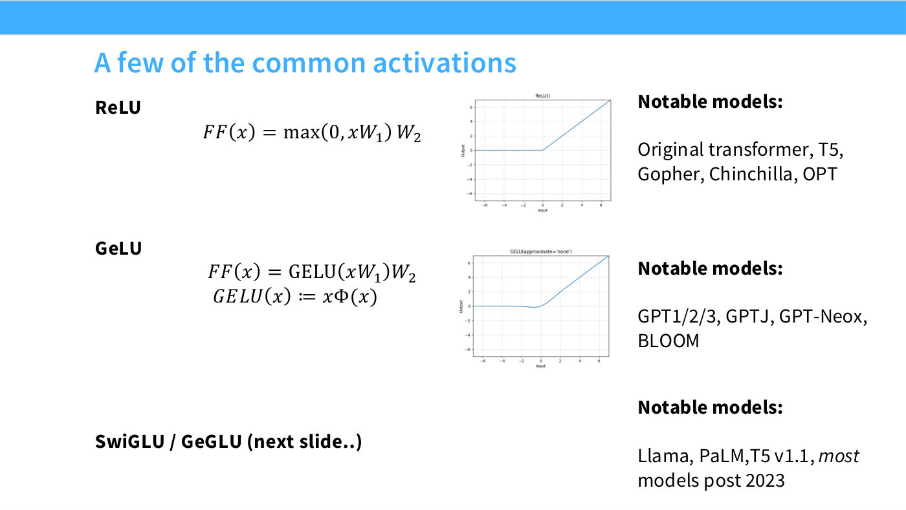
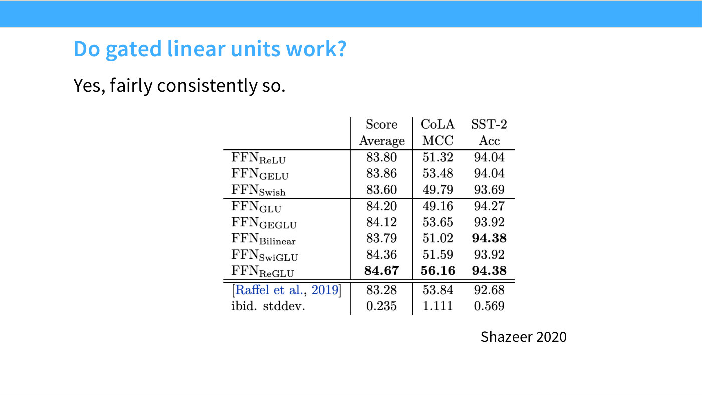
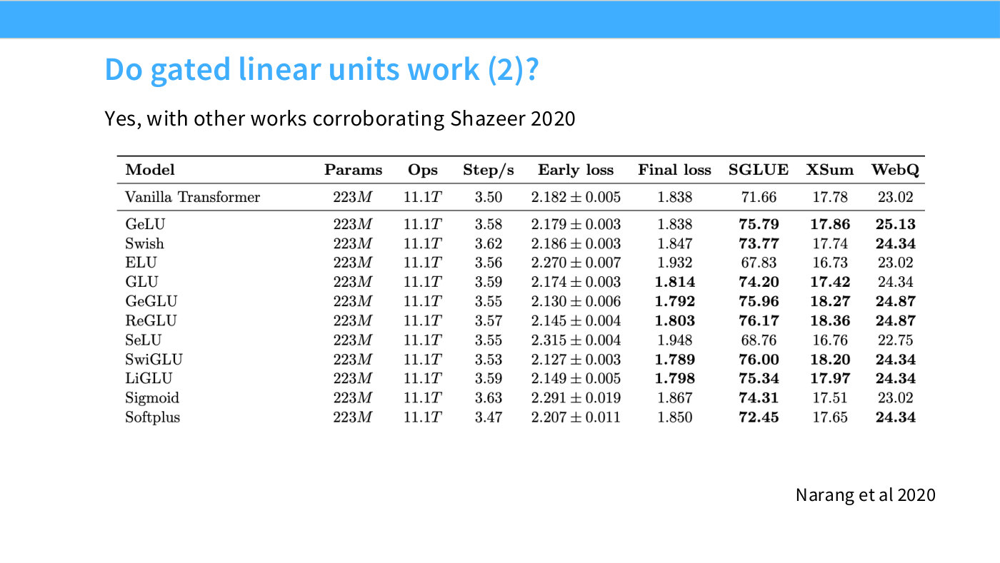

# Gated activations — GLU, SwiGLU and GeGLU

The feedforward layer's nonlinearity, and the one architectural change in Lecture 3
that appears to buy real quality rather than just speed. Hashimoto's summary at
[21:31]: "almost all credible modern language models use a gated linear unit of
some kind."

This is also the change you implement in assignment 1, which asks for SwiGLU rather
than ReLU (slide 4).

*Slide 4 — What you implemented – simple, modern variant. [Deck](https://github.com/stanford-cs336/lectures/blob/main/lecture_03.pdf)*

## From ReLU to a gate

Start with the standard feedforward layer — project up with $W_1$, threshold, project
back down with $W_2$:

$$\mathrm{FF}(x) = \max(0, xW_1)\,W_2$$

The gating idea modifies only the first part. Instead of passing the activated
value straight through, multiply it entrywise by a second, *linear* projection of
the same input through a new matrix $V$:

$$\max(0, xW_1) \rightarrow \max(0, xW_1) \otimes (xV)$$

where $\otimes$ is the entrywise (Hadamard) product. That gives the gated variant:

$$\mathrm{FF}_{\mathrm{ReGLU}}(x) = \big(\max(0, xW_1) \otimes xV\big)\,W_2$$

The second branch $xV$ modulates the first — it is a learned, input-dependent gate
on each coordinate of the hidden layer. Hashimoto's framing at [22:17] is that
this comes from a general design heuristic rather than a language-specific insight:
"another thing that is often said in architecture design is that gating is often
very helpful."

Slides 22 and 23 print these three equations, with the changing parts in red.

## The naming scheme

The names are mechanical, which makes them easy once you see the rule ([23:03]):
take the base activation, and append **GLU**.

| Name | Base activation | Definition |
| --- | --- | --- |
| ReGLU | ReLU | $(\max(0, xW) \otimes xV)W_2$ |
| GeGLU | GeLU | $(\mathrm{GELU}(xW) \otimes xV)W_2$ |
| SwiGLU | Swish | $(\mathrm{Swish}_1(xW) \otimes xV)W_2$ |

where **GeLU** is the Gaussian error linear unit, $\mathrm{GELU}(x) = x\,\Phi(x)$
with $\Phi$ the standard normal CDF, and **Swish** is $x \cdot \mathrm{sigmoid}(x)$.
Slide 21 plots ReLU and GeLU side by side: they are identical for large positive
inputs, and GeLU differs only in a smooth knee near zero and a small negative lobe
dipping to about $-0.17$ around input $-0.75$. As Hashimoto puts it at [20:45], the
difference is "this tiny divot at the bottom here, which for most of the activation
doesn't change anything, but changes the gradients right near zero."

*Slide 21 — A few of the common activations. [Deck](https://github.com/stanford-cs336/lectures/blob/main/lecture_03.pdf)*

Which gated variant a model uses splits roughly by lineage ([23:50]): **Google
models use GeGLU** — T5 v1.1, mT5, LaMDA, Phi-3, and the Gemma series — while
**LLaMA descendants use SwiGLU** — LLaMA 1/2/3, PaLM, Mistral, OLMo, and most
models after 2023. Hashimoto's verdict on the choice between them: "SwiGLU is
probably the more dominant one, but honestly, amongst the gated units, it doesn't
really matter."

## The 2/3 rule — a piece of trivia that becomes a hyperparameter

Gating adds a third matrix $V$, so a gated layer at the same $d_{ff}$ has more
parameters than an ungated one. The convention is to shrink $d_{ff}$ **by a factor
of 2/3** to keep the parameter count matched ([23:50]–[24:35]). Slide 23 prints the
rule as a footnote: "Gated models use smaller dimensions for the $d_{ff}$ by 2/3."

This is why the feedforward multipliers in the model database cluster around 2.67
rather than 4 — $\tfrac{2}{3} \times 4 = \tfrac{8}{3} \approx 2.67$. The rule
matters for reading the tables, and it reappears in
[transformer hyperparameters](transformer-hyperparameters.md) as the first
exception to the factor-of-four rule of thumb.

Hashimoto flags that it is a convention, not a law: "this is a general rule of
thumb that people have followed, but it's not really an iron rule" ([24:35]).

## The evidence

Two independent studies, and they agree.

**Shazeer 2020** (slide 24) compares eight feedforward variants on a
parameter-matched basis — the 2/3 correction is applied throughout, which is what
makes the comparison fair. On the headline "Score Average" column, every gated
variant except Bilinear beats every non-gated one:

*Slide 24 — Do gated linear units work? [Deck](https://github.com/stanford-cs336/lectures/blob/main/lecture_03.pdf)*

| | Score Average | CoLA MCC | SST-2 Acc |
| --- | --- | --- | --- |
| FFNReLU | 83.80 | 51.32 | 94.04 |
| FFNGELU | 83.86 | 53.48 | 94.04 |
| FFNSwish | 83.60 | 49.79 | 93.69 |
| FFNGLU | 84.20 | 49.16 | 94.27 |
| FFNGEGLU | 84.12 | 53.65 | 93.92 |
| FFNSwiGLU | 84.36 | 51.59 | 93.92 |
| FFNReGLU | **84.67** | **56.16** | **94.38** |

Hashimoto credits Shazeer's methodology at [24:35] — "a lot of his papers have
these error-bar assessments — training multiple replicates and checking to see if
they're better." The last two rows of the slide's table are the Raffel et al.
baseline and *its standard deviation* (0.235 on Score Average), not further
experimental conditions.

**Narang et al. 2020** (slide 25) sweeps twelve activations on the same 223M
setup used for the RMSNorm comparison. The five gated rows hold the five lowest
final losses in the table — SwiGLU lowest at **1.789**, against 1.838 for the
vanilla ReLU transformer — while the ungated alternatives ELU (1.932) and SeLU
(1.948) are markedly worse than baseline.

*Slide 25 — Do gated linear units work (2)? [Deck](https://github.com/stanford-cs336/lectures/blob/main/lecture_03.pdf)*

The size of the effect is worth keeping in proportion. Hashimoto calls it "a nice
boost without much computational cost" ([26:08]) and "in some ways a free win"
([25:22]) — consistent, parameter-matched, and small.

## Gating is not required

Slide 26 is careful about this, and so is the lecture. A working model does not
need a GLU: **GPT-3** is ungated, and **Nemotron 340B** uses a squared ReLU, which
Hashimoto calls "a kind of crazy choice, but that works, too" ([26:08]–[26:54]).
The deck files Nemotron under "Some outlier models.."

His conclusion is about frequency, not necessity: "it's actually quite rare to see
anything that's not trained on a gated linear unit."

> **A note on the transcript here.** At [26:08] the captions garble the sentence in
> which GPT-3 is named as the counterexample — they read "I mean, GPT-3 was that",
> where the deck's framing implies something like "wasn't gated." The transcript
> marks this with an `[Ed:]` note rather than guessing. The deck's own statement —
> "\*GLU isn't *necessary* for a working model (see GPT3)" — is unambiguous, and is
> what this page follows.

## Related

- [Transformer hyperparameters](transformer-hyperparameters.md) — where the 2/3
  rule turns into the $d_{ff}/d_{model}$ ratio you actually have to pick.
- [RMSNorm and dropping bias terms](rmsnorm.md) — the other change to the
  feedforward block, made for systems reasons rather than quality.
- [Lecture 3 — architectures](03-architectures.md).
