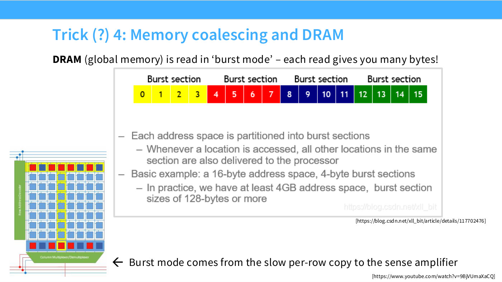
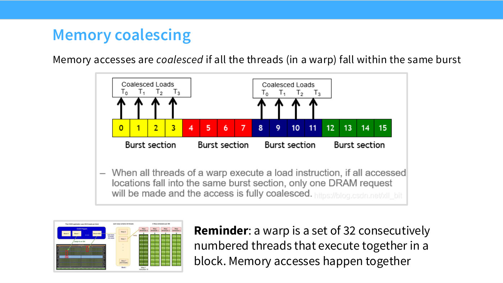
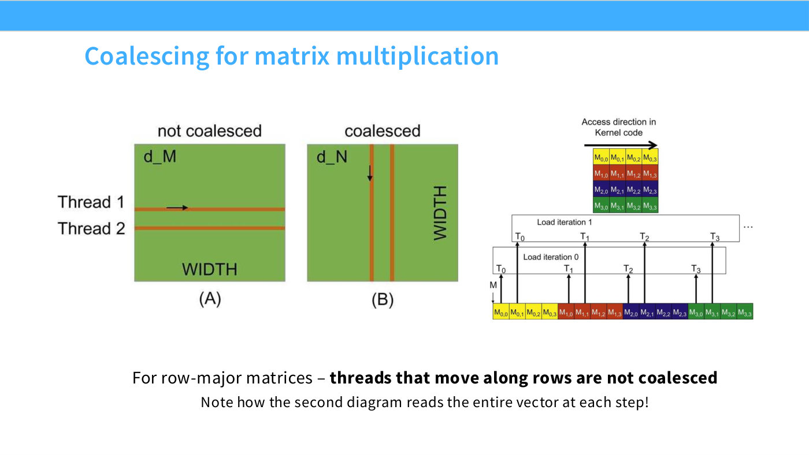
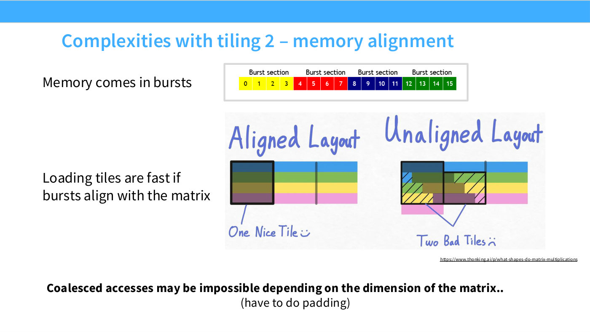

# Memory coalescing and DRAM bursts

Coalescing is a piece of hardware trivia that turns out to govern how you should
lay out matrices. Hashimoto introduces it in Lecture 5 as "another memory-trivia
thing, but it surprisingly becomes important, and it's also why it's sometimes
important to understand the hardware model of what you're interacting with"
([52:17]).

## DRAM delivers in bursts, not in single values

Global memory on a GPU is DRAM, and DRAM does not hand back one value at a time.
The cells are laid out in a grid, and reading involves activating an amplifier
across a whole line of them. Once that amplifier is active, the remaining values on
that line come back essentially for free ([53:04]).

Slide 37 calls the resulting unit a **burst section**: whenever a location in a
section is accessed, all the other locations in it can be delivered at no extra
cost. A typical figure is **128 bytes to a burst** ([53:49]) — one read returning
up to 128 bytes, provided the data lives in the same contiguous block.

*Slide 37 — Trick (?) 4: Memory coalescing and DRAM. [Deck](https://github.com/stanford-cs336/lectures/blob/main/lecture_05.pdf)*

Hashimoto's own account of the physics, at [54:35]–[55:20], is hedged and the
transcript marks it as a garbled exchange: the memory cells are arranged in a grid,
the amplifiers select at a column-wise level, and "activating the voltage for this
often takes a significant amount of time, so once you've selected the column,
reading out multiple elements within that column is comparatively much cheaper."
Treat the row/column orientation in that passage as approximate; the load-bearing
claim — that a read returns a contiguous block, and that using all of it is free
while wasting it is not — is stated unambiguously on the slides.

## What "coalesced" means

Slide 38 gives the definition: **a memory access is coalesced if all the threads in
a warp fall in the same burst section.**

*Slide 38 — Memory coalescing. [Deck](https://github.com/stanford-cs336/lectures/blob/main/lecture_05.pdf)*

That is the whole idea. A [warp](gpu-execution-model.md) is 32 threads issuing the
same instruction at the same time. If their 32 addresses land inside one burst
section, the hardware serves them with one burst and the section is fully used. If
they land in 32 different sections, the hardware performs 32 bursts and throws away
most of every one of them.

Hashimoto's worked case at [53:49]: four threads whose reads all live inside a
single burst section are coalesced, "because they're using up the entire burst
section, and I'm fully utilizing this nice property of DRAM memory."

## Why row-major layout decides which loops are fast

The consequence for matrices is concrete, and slide 39 states the rule: for
row-major matrices, threads reading **along** the major axis are *not* coalesced.

*Slide 39 — Coalescing for matrix multiplication. [Deck](https://github.com/stanford-cs336/lectures/blob/main/lecture_05.pdf)*

Hashimoto's mnemonic, with the 4×4 example at [56:05]–[56:51]. The matrix is stored
row-major, so consecutive memory addresses run along each row. Now have the threads
read a *column* — one element from each row:

- Each of those four elements sits in a different burst window. Reading one column
  therefore drags in essentially the entire matrix, "even though all I wanted was a
  single column."
- Reverse the traversal, reading *down* the storage order instead, and "every
  thread would get its read in a single read of memory."

Same data, same amount of arithmetic, one traversal order fast and the other slow.
This is why "you might want to think a little about row versus column versus other
kinds of ordering" ([57:37]).

## Where this bites in practice

Coalescing rarely appears as a thing you tune directly. It appears as the
*explanation* for other things:

- **Tile alignment.** A tile whose boundaries line up with burst sections is read in
  a few bursts; shift the matrix size by one and the same tile needs at least twice
  as many reads because the data is ragged against the burst boundaries. See
  [tiling](tiling.md), and slide 44.
- **Padding a dimension to make it faster.** Karpathy's nanoGPT vocabulary padding —
  50257 to 50304 for a ~25% speedup — is a coalescing result. More arithmetic, less
  wasted memory bandwidth.
- **The "divisible by 32" folklore.** Hashimoto is explicit at [1:07:32] that
  dimensions divisible by 16 or 32 help because the tile then fits the burst window,
  not because powers of two are magic. It is a divisor property: going higher does
  not help further ([1:10:35]).

*Slide 44 — Complexities with tiling 2 – memory alignment. [Deck](https://github.com/stanford-cs336/lectures/blob/main/lecture_05.pdf)*

## Lecture 6: not the same thing as a bank conflict

Lecture 6 restates coalescing in the same terms — a warp's 32 accesses "get combined
into a transaction of ... 128 bytes, which are called cache lines", best case being
all 32 threads on one line. (The captions garble the size as "20 to 128 bytes" and
the transcript marks it unclear; the lecture source prints only 128.) — and then draws the distinction this page's readers most
often need ([17:01]–[17:46]):

> "This can feel similar to bank conflicts, but it's a very different constraint:
> that one is about shared memory, and this one is about HBM."

[Bank conflicts](bank-conflicts.md) are 32 banks of 4 bytes inside an SM; coalescing
is 128-byte lines coming off global memory. Reading down a column hurts in both
cases, for two unrelated reasons.

## Related

- [GPU execution model](gpu-execution-model.md) — warps, the unit whose threads must
  fall in one burst.
- [GPU architecture](gpu-architecture.md) — where DRAM sits in the hierarchy and why
  it is the slow path.
- [Tiling](tiling.md) — the technique whose alignment depends on this.
- [Lecture 5 — GPUs and TPUs](05-gpus-tpus.md).
- [Transcript](../raw/transcripts/05-gpus-tpus.md), [slide deck](../raw/slides/05-gpus-tpus.md).
