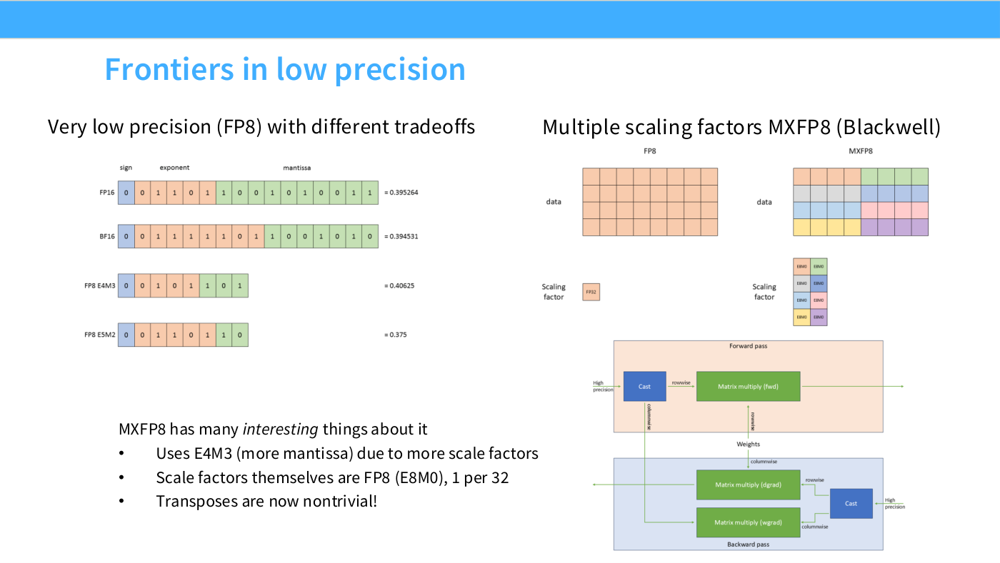
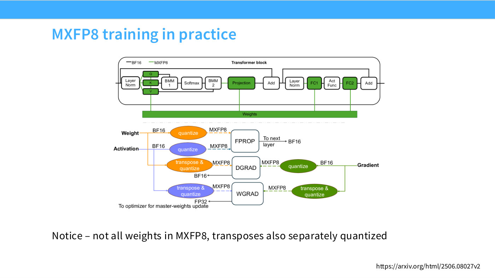
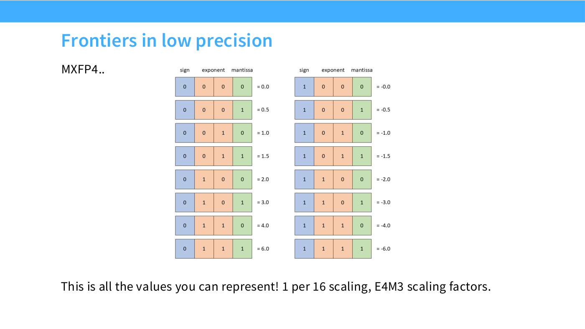

# Microscaling formats — MXFP8 and MXFP4

This page covers the **block-scaled** low-precision formats that arrived with
recent hardware, as Lecture 5 presents them. For the general treatment of floating
point in training — fp32, bf16, fp8, mixed precision — see
[precision and data types](precision-and-data-types.md).

Hashimoto's framing at [38:30]: "the really interesting thing is the more advanced
low-precision number formats coming out with new hardware. I'll talk briefly about
MXFP8, because it's both cool and what it does to training is strange, to say the
least."

## Why a scaling factor exists at all

With few exponent bits you overflow or underflow almost immediately. Traditional
FP8 training therefore keeps the tensor in 8 bits and carries a separate **FP32
scaling factor** to move the whole tensor into representable range ([38:30]).

"The scaling factor is necessary because you only have, say, four bits of exponent
— that's so few bits of exponent, you're going to quickly over- or underflow. So
you need the scaling factor to keep you in the right range, so you can keep some
information" ([39:15]).

## The microscaling idea: many scale factors, not one

One factor per tensor is a poor fit for real activations, because "a single matrix
might have very different magnitudes — one part of my sequence might have much
bigger activations than another" ([39:15]).

So: use many. **MXFP8 assigns one scale factor per small block of elements.** Slide
27's diagram shows a 4×8 grid of data cells divided into eight colour groups of
four, each group paired with its own scale-factor swatch.

*Slide 27 — Frontiers in low precision. [Deck](https://github.com/stanford-cs336/lectures/blob/main/lecture_05.pdf)*

Two design choices follow, both printed on slide 27:

- **The elements use E4M3** — the FP8 variant with more mantissa and less exponent
  — precisely *because* the scale factors now handle range. "MXFP8 uses more
  mantissa in the elements" ([40:01]).
- **The scale factors are themselves FP8, in E8M0 format, one per 32 elements.**
  E8M0 is all exponent and no mantissa: "they only have exponent bits — they're all
  powers of two, in eight bits" ([40:01]).

## The transpose problem

Hashimoto pauses the lecture to pose this as a question — "don't read the third
thing. Think for a moment: what is the problem with this design?" ([40:01]) — and
it is the part worth remembering.

**A transpose does not preserve the blocking.** Slide 27's own bullet is blunt:
"Transposes are now nontrivial!" Under a single per-tensor scale, transposing is
free. Under per-32-element scales, "the transpose does not have the same scaling
pattern as the original matrix... I now have to potentially re-quantize the whole
matrix to fit this one-out-of-32 pattern" ([40:47]).

This matters because training needs both orientations. The forward pass consumes
the data one way and the backward pass the other — which is what slide 27's
forward/backward flow diagram shows, with a "Cast" feeding a rowwise
`Matrix multiply (fwd)` and a columnwise path into `Matrix multiply (dgrad)` and
`Matrix multiply (wgrad)`.

**The fix is brute force.** Training with MXFP8 "creates two copies of every
quantized matrix: one for your original matrix, one for the transpose. So if you
ever want to transpose, you have the transposed version waiting for you"
([40:47]). Hashimoto's own assessment: "a crazy and cool thing."

## What it costs and what it buys

Slide 28 makes the point that quantization is selective — "not all weights" — and
Hashimoto ties it to the trial-and-error character of the whole area: "you're only
going to quantize certain layers you think are safe to quantize" ([42:18]).

*Slide 28 — MXFP8 training in practice. [Deck](https://github.com/stanford-cs336/lectures/blob/main/lecture_05.pdf)*

The payoff is real but not the factor you might expect: **20 to 30% savings on the
matrix multiplies, maybe more depending on matrix size** ([42:18]). Not a 2×
speedup, "because you have to do all these quantization operations — there's a big
overhead, so it's not free."

Asked which layers resist quantization, he answers only partly ([42:18]–[43:04]):
he has no intuition for the first layer, but the last layer is hard "because it's
kind of a first-order factor — it derives a ton of the loss," so quantizing it
brings both instability and loss increases.

## MXFP4

Slide 29 shows the entire format on one page — all sixteen representable values,
running $-6$ to $6$. "The entirety of MXFP4 can be shown to you in this slide"
([43:04]).

*Slide 29 — Frontiers in low precision. [Deck](https://github.com/stanford-cs336/lectures/blob/main/lecture_05.pdf)*

The structure is the same idea at four bits: a block of 4-bit values sharing a
scale factor. Hashimoto states the parameters at [43:04] as "every 16 of these
numbers, you have one scaling factor, and that scaling factor is itself FP8 — an
E4M3 scaling factor."

**A caution when citing this.** Slide 29 prints "1 per 16 scaling, E4M3 scaling
factors", while slide 27 gives MXFP8's scale factors as E8M0, one per 32. The deck
does not reconcile the two, and the slide transcription records both exactly as
printed rather than choosing between them. A figure audit confirmed slide 29's text
verbatim and confirmed that no other format name appears anywhere on that page. If
you need the authoritative encoding for a specific format, check the hardware
vendor's specification rather than relying on this slide pair.

On maturity, Hashimoto is candid ([43:50]): a paper has trained with FP4, but "I
don't think I've heard of anyone successfully training real, big, serious models
with FP4 in the wild, but I think this is coming — the next generation of models
will probably be FP4."

## Why quantization concentrates on matmuls

A student asks whether this applies only to matrices ([43:50]). The answer is that
you *can* quantize anything — activations after a ReLU, for instance — "but there
just isn't as much need to." The throughput win is concentrated where the
arithmetic is: "something like a matmul — if you quantize that, you get really big
throughput improvements, and that's why, if you look at the MXFP8 training case,
these are all matmuls getting FP8-quantized" ([44:36]). Elsewhere the overhead is
not worth it.

He also separates two benefits that are easy to conflate ([45:21]): quantization
helps compute "basically linearly just from multiplying the quantized numbers," not
only memory bandwidth — "but the fact that you have to quantize and dequantize means
the benefits are more diluted."

And on how scale factors are obtained: they are an implementation choice, not
learned parameters. "You might have quantization factors that scan through and pick
the max and min, or scaling factors that look at historical running statistics...
I wouldn't really call that training, per se" ([45:21]).

## Related

- [Precision and data types](precision-and-data-types.md) — fp32/bf16/fp8/fp4 and
  the mixed-precision recipe.
- [Tensor cores](tensor-cores.md) — the hardware that makes low precision pay.
- [Arithmetic intensity](arithmetic-intensity.md) — halving bytes per FLOP is the
  reason this works.
- [Training stability](training-stability.md) — the risk side of quantization.
- [Lecture 5 — GPUs and TPUs](05-gpus-tpus.md).
- [Transcript](../raw/transcripts/05-gpus-tpus.md), [slide deck](../raw/slides/05-gpus-tpus.md).
