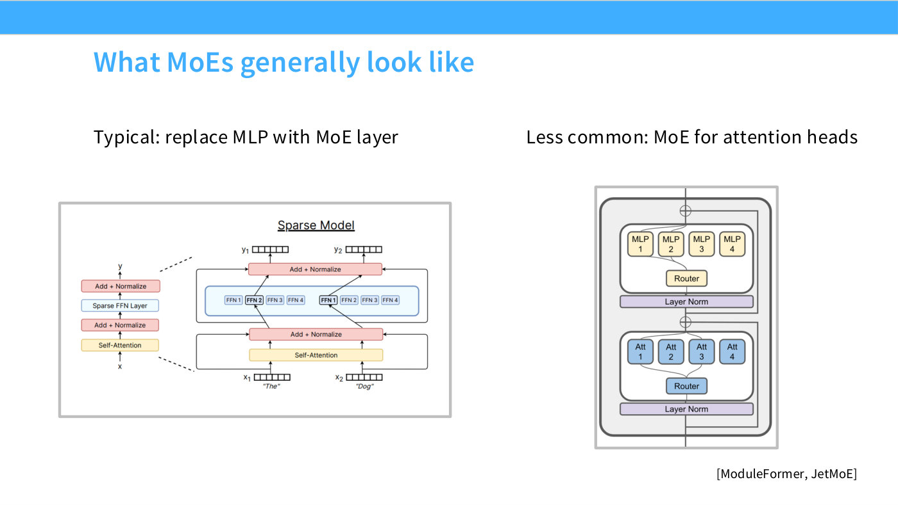
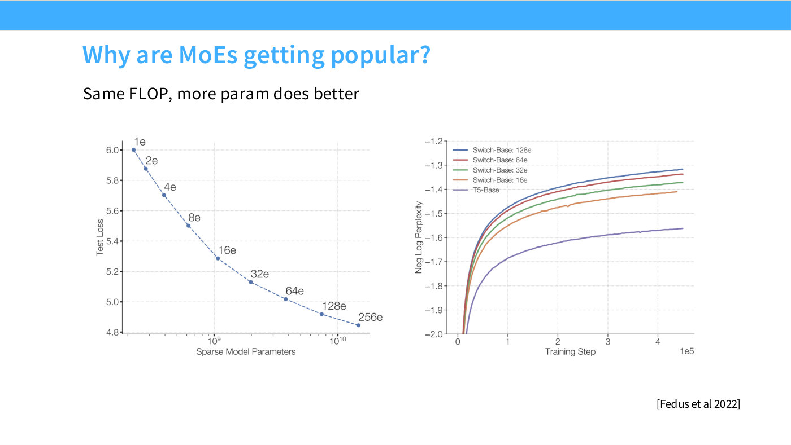
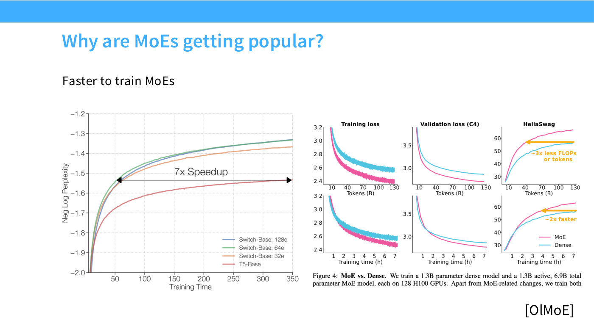
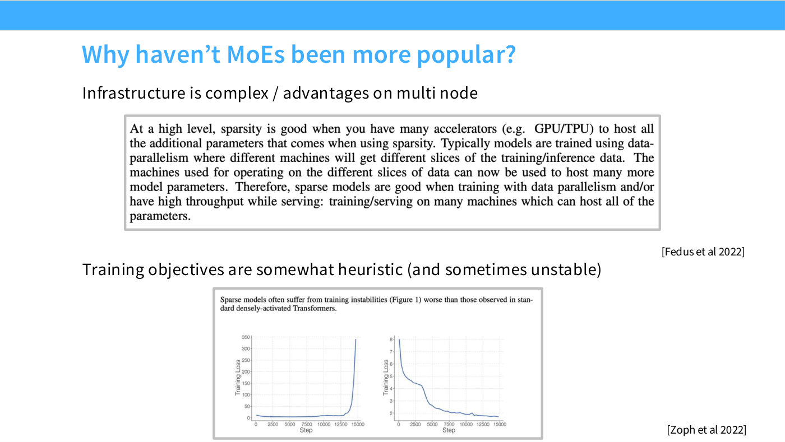
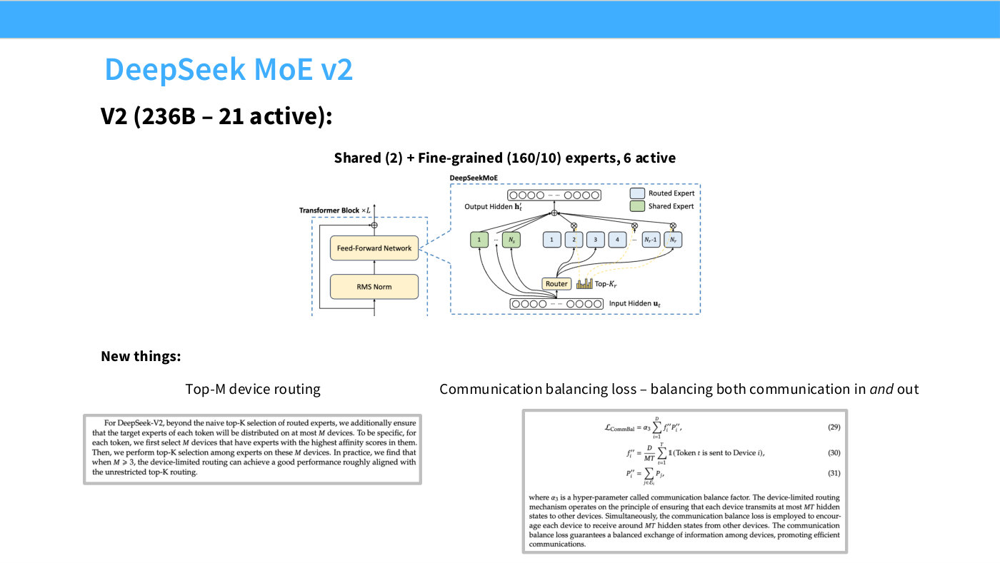

# Mixture of experts

Replace the transformer's feedforward block with many feedforward blocks, and route each
token to only a few of them. The result has far more parameters than a dense model but
costs the same per token to run.

Lecture 4's one-line mental model: **increase parameters without increasing FLOPs**
([36:14]). Hashimoto is upfront that conceptually this is a small idea — "one way of
thinking about mixture of experts is that they're just a more efficient MLP" ([33:56])
— and that the interest is in the mechanics of making it train.

## The construction

Slide 25 draws it. The usual block is attention, normalization, then a feedforward
network where "a lot of the dense, big information processing happens" ([35:29]).
Replace that single FFN with $N$ of them, plus a router that picks which to use.

*Slide 25 — What MoEs generally look like. [Deck](https://github.com/stanford-cs336/lectures/blob/main/lecture_04.pdf)*

If each of the $N$ experts is the size of the original FFN and you activate one per
token, you have $N\times$ the parameters at $1\times$ the compute:

> I have four FFNs' worth of parameters, but on any forward or backward pass I'm only
> going to pay one FFN's worth of cost. ([36:14])

The original papers approached it from exactly this direction — a parameter-centric
view that starts, in Hashimoto's paraphrase, "Well, let's say you just wanted more
parameters, because you believe more parameters are good" ([36:14]).

Two counts matter throughout, and conflating them is the usual mistake:

- **Total parameters** — everything in the model. Governs memory and how hard it is to
  fit on a device.
- **Active parameters** — what a single token actually touches. Governs FLOPs, and so
  governs the cost to train and serve.

MoEs are compared against dense models at equal *active* parameters, which is why they
look so good.

## Why they took over

Slides 16–23 assemble the case, and it is unusually one-sided.

*Slide 16 — Why are MoEs getting popular? [Deck](https://github.com/stanford-cs336/lectures/blob/main/lecture_04.pdf)*

*Slide 17 — Why are MoEs getting popular? [Deck](https://github.com/stanford-cs336/lectures/blob/main/lecture_04.pdf)*

**Same FLOPs, more experts, lower loss.** Fedus et al. 2022's Switch Transformer curves
(slide 16) hold active parameters fixed and vary expert count from 1 to 256; test loss
falls monotonically, from about 6.00 at one expert to 4.85 at 256. On the right panel,
for fixed training compute, more experts is uniformly better — 128 experts above 64
above 32 above 16 above dense T5-Base at every point.

**Faster to train.** OLMoE's ablations (slide 17) show "something like two times faster,
or thereabouts, training an MoE relative to a dense model" ([38:35]) on training loss,
validation loss and downstream benchmarks alike.

**Competitive at far fewer active parameters.** "When DeepSeek V2 and the earlier
DeepSeek MoEs came out, it was really kind of a big shift from a lot of the dense models
everyone else was training. You saw that, wow — we have much fewer active parameters,
and just as good, if not better, MMLU performance compared to everyone else" ([39:22]).

**An extra axis of parallelism.** Experts are natural units to place on separate
devices, which matters because large models do not fit on one — see
[expert parallelism](expert-parallelism.md) ([40:08]).

Hashimoto's summary of the empirical situation: "for both training and inference, MoEs
just give you a free win" ([37:47]), and past a certain size essentially every released
model is one ([37:01]).

## Why, then, did they take so long

Slide 24. Google was publishing seriously on MoEs in 2022; the field moved to them
around 2024. The gap is engineering, not science.

*Slide 24 — Why haven't MoEs been more popular? [Deck](https://github.com/stanford-cs336/lectures/blob/main/lecture_04.pdf)*

> There are a lot of complexities that come from MoEs: it's not easy to train an MoE, or
> to use one, or to do many things with them — the infrastructure is very complex.
> ([45:33])

Specifically: expert parallelism is hard to make efficient, the parameter count makes
models hard to fit, and training is fragile — "MoEs can really blow up on you"
([46:19]). Most academic work stayed dense for exactly these reasons.

## Two industrial notes

**Attention MoEs mostly did not work.** Applying the same idea to attention heads rather
than the FFN has been tried in a few papers, but "they're much less common, and I think
the things I've seen suggest they haven't been quite as easy to tame" ([46:19]).
Essentially all large models apply MoE to the MLP only ([47:06]).

**Most of the progress happened in China.** In the West, Llama 4 and GPT-OSS are the
main open MoE releases, and Hashimoto notes open releases there "have kind of stalled"
([40:54]). Qwen, DeepSeek and MiniCPM did the early work, and Qwen 1.5 MoE's 2.7B-active
model beating contemporaneous 7B dense models is what he credits with convincing the
open-source community ([41:41]).

## The three axes of variation

The lecture organizes the design space (slide 26) as:

1. **The routing function** — how tokens get assigned to experts. See
   [MoE routing](moe-routing.md).
2. **Expert sizes** — for a fixed budget, many small experts or few large ones, and
   whether some are always-on shared experts. Also [MoE routing](moe-routing.md).
3. **Training** — the hard part, because routing is discrete. See
   [load balancing losses](load-balancing-losses.md).

## Why training is the hard part

Worth stating here because it is the crux of the whole topic. During training the model
is *also* sparse — you only get gradients for the experts that fired.

> The hard thing about MoEs is that during training you only have one or k experts
> active, so you don't know what happened with the rest of them — you only know the ones
> that activated. Despite this, you must somehow learn to route. So it's kind of got this
> RL-bandit flavor to the problem. ([42:27])

Activating everything during training would make learning to route easy and defeat the
purpose. Hashimoto's punchline is that the field solved this without the tools the
framing suggests: "we're not going to solve it with either RL or bandits — we're going to
solve it with the power of heuristics and deep learning magic" ([43:12]).

He is candid that he expected otherwise: "Initially, when I was learning about MoEs, I
thought there's no way we could train these things well, or reasonably — but it turns out
there are lots of tricks that, combined together, just really work well and robustly, for
some reason" ([58:36]).

## Experts are not experts

A recurring misconception, and Hashimoto dismisses it directly. Because routers are a
single matrix multiply, there is no mechanism by which semantic specialization would
arise.

> Because the routers are so simple, it's not like the experts are smart experts —
> they're not medical experts, legal experts, or whatever. You do see that certain tokens
> are routed to different things — punctuation might be routed to one expert, or other
> symbols might be routed to one expert, non-English character sets might be routed to
> another. But it's not really something where you can look at it and say, "Oh, this is
> the Wall Street Journal expert," or something — nothing like that. There's no
> semantics. ([1:10:05])

The name is historical. Treat an expert as a shard of FFN capacity, not a specialist.

## Where the field stands

"It's quite clear this is where the future of these big models is going to be for the
foreseeable future — at least the next couple of years, I imagine, will be MoEs"
([44:46]). The closing summary (slide 60) adds the reason routing turned out to be
tractable: "You might initially think that this routing problem is very hard, but it
turns out that very simple things work well, even at scale" ([1:25:27]).

## Related pages

- [MoE routing](moe-routing.md) — routers, top-$k$, shared and fine-grained experts.
- [Load balancing losses](load-balancing-losses.md) — how these are actually trained.
- [Expert parallelism](expert-parallelism.md) — the systems side, including the
  [all-to-all](collective-operations.md#the-general-one) primitive that dynamic
  routing forces on you.
- [Collective operations](collective-operations.md) — from Lecture 7. All-to-all is
  introduced there specifically as the MoE operation ([7:50], [17:54]).
- [Upcycling](upcycling.md) — building an MoE from a trained dense model.
- [Model architecture survey](model-architecture-survey.md) — what the large models do.
- [Lecture 4](04-attention-alternatives.md).

## The systems consequence

Lecture 8 treats MoE not as an architecture choice but as a fact that reshapes the
whole parallelism plan.

It changes which **hardware** suits you. MoE routing is unpredictable — tokens go
wherever the router sends them — so it wants all-to-all connectivity rather than
neighbour-local links. That is the lecture's explanation for GPUs suiting MoE and
TPUs suiting dense models ([6:59]), and for Google's TPU8i moving toward a tree
topology: "modern-day language models are MoEs, and if you're going to serve a MoE,
you're going to have all sorts of bandwidth flying around" ([7:45]). See
[network topology](network-topology.md).

It changes which **parallelism** you use: [expert parallelism](expert-parallelism.md)
replaces tensor parallelism for the MLPs, and is preferred whenever both apply
([54:19]).

And it creates a problem dense models do not have. Because MoE touches only the
MLPs, parallelism applies **unevenly** across the model — you want high tensor
parallelism for the attention and low tensor parallelism for the experts, which is
a genuine conflict resolved only by decoupling the two ([59:39]–[1:00:25]).

The [case studies](parallelism-case-studies.md) show the split cleanly: every MoE
row in slide 72's table has TP of 1 or 2 and EP of 8 to 64, while the dense rows
(Llama 3 405B, Gemma 2) have TP 8 and EP 0.

## Scaling laws for MoE (lecture 9)

Once total and active parameters decouple, the basic accounting question changes:
what is a parameter *worth*? [Lecture 9](09-scaling-laws.md) treats this as newly
urgent — "now that mixture of experts is, you'd say, the dominant way of training
large models, it's quite important to think about what the value of a parameter is
in this new world" ([39:12]).

The study is Abnar et al. 2025 (Apple and MIT), and it is
[IsoFLOP](isoflop-method.md)-style by design: sparsity is an unusually clean sweep
variable because "I can vary my sparsity without really changing the amount of
compute I'm spending" ([39:57]).

Two results:

- **Optimal models get sparser as they get bigger.** Sweep total parameters against
  loss at fixed compute and the optimum moves toward higher sparsity as scale grows
  ([39:12]).
- **Inactive parameters still help.** Holding active parameters fixed and adding
  more total parameters lowers loss — "the parameters in an MoE that aren't active
  are still helping you reduce your loss, which is kind of cool" ([40:42]).

Slide 55 carries both as 3D IsoFLOP surfaces, one over sparsity and total
parameters and one over sparsity and active parameters, with a shared sparsity
colour scale running orange at 0% to dark purple at 98%.

*Slide 55 — DeepSeek MoE v2. [Deck](https://github.com/stanford-cs336/lectures/blob/main/lecture_04.pdf)*

The point Hashimoto draws is methodological rather than architectural: "all of these
kinds of quantities we care about in optimizing an MoE have predictable scaling and
regularities" ([40:42]). MoE design is not exempt from the scaling-law programme —
it just adds an axis.

This also connects to why the field moved past Chinchilla's 20:1 ratio. The shift to
MoE and the shift to deliberate overtraining are the same shift, both driven by
serving cost rather than training cost — see
[compute-optimal scaling](compute-optimal-scaling.md) ([1:15:17]).
