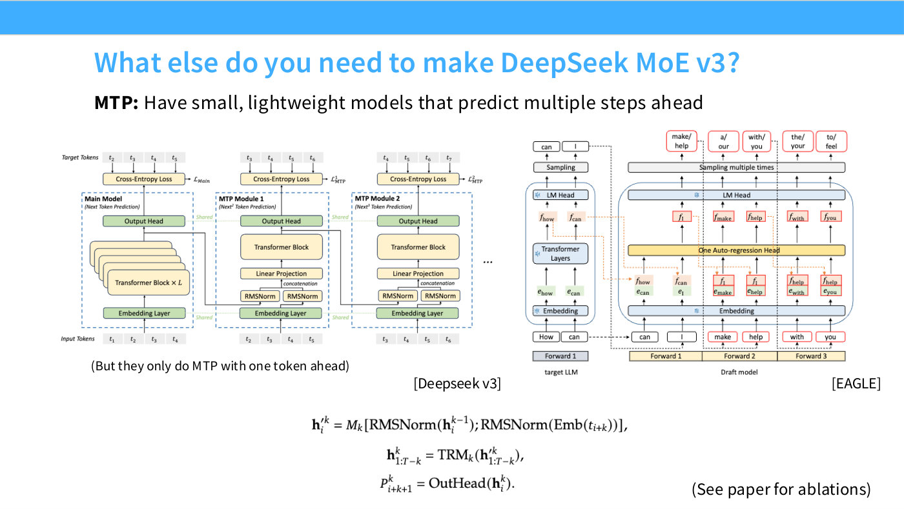

# Multi-token prediction (MTP)

Train the model to predict several future tokens rather than only the next one. Lecture 4
covers it in slide 59 as the last of DeepSeek V3's bonus mechanisms, and as the one
Hashimoto likes most while conceding it did not catch on: "something I thought was a very
cool idea for MoE… but this hasn't caught on very much" ([1:24:41]).

*Slide 59 — What else do you need to make DeepSeek MoE v3? [Deck](https://github.com/stanford-cs336/lectures/blob/main/lecture_04.pdf)*

## The idea

Standard language modelling trains one head to predict token $t+1$ from the prefix. MTP adds
lightweight modules that predict $t+2$, $t+3$, and so on, each trained with its own
cross-entropy loss.

DeepSeek's formulation, from slide 59, for the $k$-th MTP module at position $i$:

$$\mathbf{h}'^{k}_i = M_k\left[\mathrm{RMSNorm}\!\left(\mathbf{h}^{k-1}_i\right);\; \mathrm{RMSNorm}\!\left(\mathrm{Emb}(t_{i+k})\right)\right]$$

$$\mathbf{h}^{k}_{1:T-k} = \mathrm{TRM}_k\!\left(\mathbf{h}'^{k}_{1:T-k}\right)$$

$$P^{k}_{i+k+1} = \mathrm{OutHead}\!\left(\mathbf{h}^{k}_i\right)$$

Read it as three steps. Concatenate the previous module's hidden state with the embedding of
the token $k$ ahead, both normalized, and project with $M_k$. Run that through a single
transformer block $\mathrm{TRM}_k$. Emit a distribution over the token $k+1$ ahead.

The modules are chained: module 1 takes the main model's last hidden state, module 2 takes
module 1's, and so on. Each is a **single** transformer block, not a copy of the model —
"small, lightweight models that predict multiple steps ahead," in the slide's words. Slide
59's diagram also shows the embedding layer and output head **shared** across the main model
and every MTP module, so the added parameters are one transformer block per module.

Slide 59 records that DeepSeek "only do MTP with one token ahead" — the architecture
generalizes, the shipped model uses a single extra module.

## The two arguments for it

Hashimoto gives both, and is more confident about the second.

**Statistical.** Predicting further ahead is a richer training signal — "there are
statistical arguments for why that's a good idea — maybe it lets you predict the future a
little better" ([1:24:41]). The hedging is his.

**Systems.** This is the one he presents as the real payoff:

> There's this nice systems argument that you kind of now have a speculative decoder built
> in. ([1:24:41])

Speculative decoding normally requires a separate draft model to propose tokens that the
large model then verifies in parallel. A model with MTP heads can propose its own
continuations, so the draft model comes free with the architecture. Slide 59 places
DeepSeek's MTP diagram directly beside EAGLE's speculative-decoding diagram to make the
parallel visible.

Hashimoto defers the mechanism itself: "Percy will talk about that when he covers inference,
later" ([1:25:27]) — lecture 10, which is not yet in this knowledge base.

## Related pages

- [Multi-head latent attention](multi-head-latent-attention.md) — DeepSeek V3's other bonus
  mechanism.
- [Mixture of experts](mixture-of-experts.md) — the architecture these are bolted onto.
- [Lecture 4](04-attention-alternatives.md).
