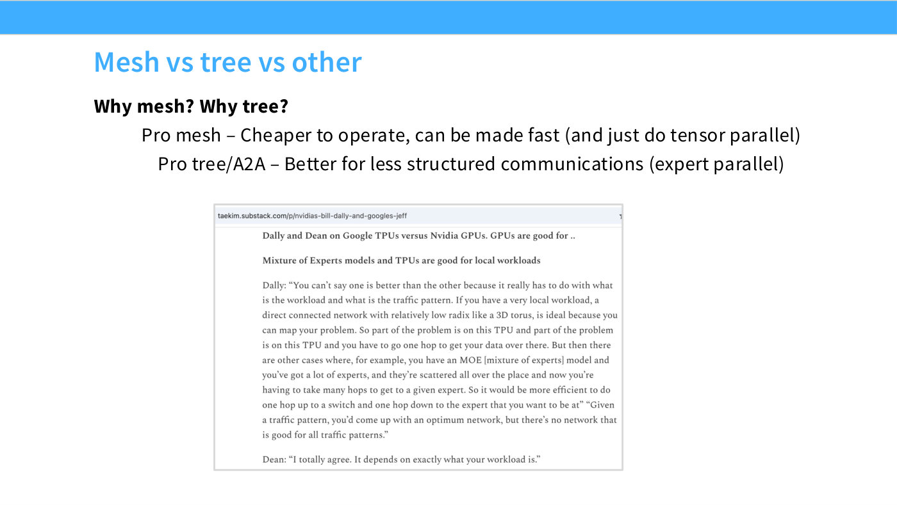
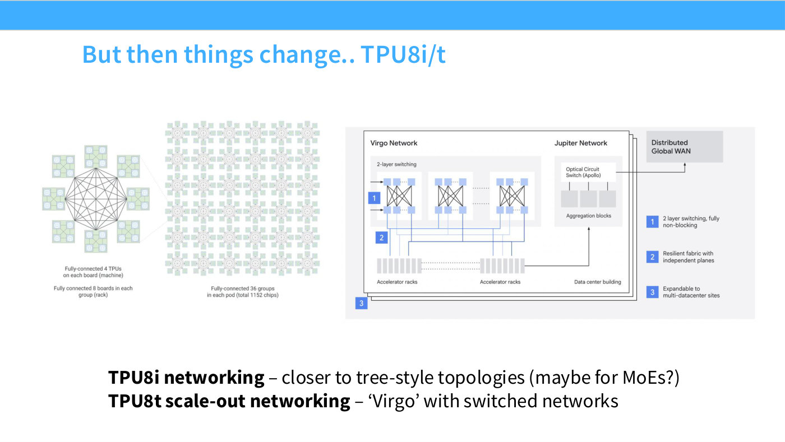
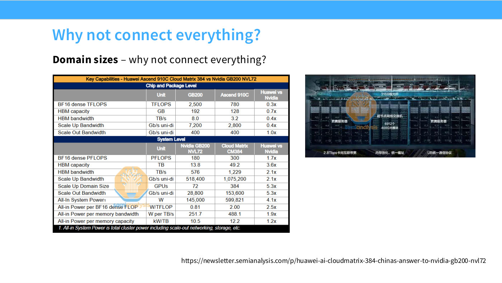
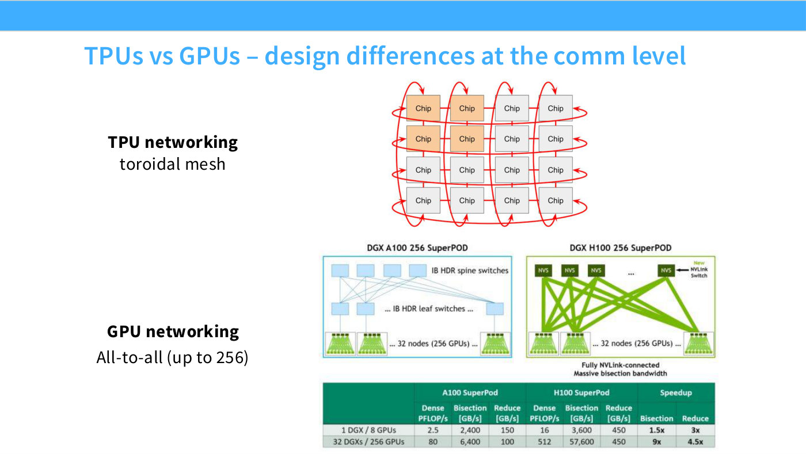

# Network topology: mesh vs tree

How accelerators are wired together, and why the answer differs between TPUs and
GPUs. This is the hardware layer beneath every parallelism strategy — it decides
which cuts are cheap. Lecture 8 opens with it because "it leads to different
parallelization strategies across different model-training companies" ([4:40]).

For the *bandwidth* side of the same story — link speeds, NVLink domains, RDMA —
see [GPU interconnect](gpu-interconnect.md).

## The TPU answer: a toroidal mesh

A grid in which the edges wrap around, so every chip talks only to its immediate
neighbours ([4:40]–[5:26]):

> All the chips are networked to neighbors, and the neighbors wrap around. So what
> does this let you do? This lets you have a very simple networking topology that
> can be scaled up indefinitely, very simply — the number of neighbors you have
> stays the same no matter how large your network gets.

That last property is the whole point: **degree stays constant as the machine
grows**. Adding chips does not make any individual chip's wiring more complex.

## The GPU answer: a fat tree

The opposite philosophy — "much more of an all-to-all philosophy" ([5:26]):

> Your GPUs are connected very quickly at the lowest layers, and then you have
> groups of GPUs connected in a pod, and the pods might have spine switches that
> allow them to communicate with each other.

Here degree does *not* stay constant. "As the number of nodes grows, the tree gets
bigger and bigger, and your communication cost is going to get higher, or your
communication topology will get more complicated" ([6:12]).

## The trade-off

Slide 10 states it as a pro/con ([6:12]):

*Slide 10 — Mesh vs tree vs other. [Deck](https://github.com/stanford-cs336/lectures/blob/main/lecture_08.pdf)*

> If you're communicating only to neighbors, TPUs are great — they're
> cost-effective, and you can make each connection more beefy with the same power
> consumption. But if you're connecting in very random, stochastic, unpredictable
> ways, then GPU networking will be more flexible.

The lecture attributes the framing to remarks by Bill Dally and Jeff Dean, and
gives the workload split ([6:59]):

- **GPUs** suit [mixture-of-experts](mixture-of-experts.md) models, "where the
  communication is much less predictable because tokens route to different experts".
- **TPUs** suit dense models "that you're doing very predictable partitions of" —
  i.e. [tensor parallelism](tensor-parallelism.md).

### Why this shows up in the parallelism strategy

On GPUs there is a hard boundary at eight: inside a node, NVLink; outside, much
slower links. That is why [tensor parallelism](tensor-parallelism.md) is capped
around 8 and pipelines go across nodes. On a TPU mesh that boundary does not exist
([43:36]):

> For TPUs, you don't really have this distinction between fast eight-GPU groups
> and other machines — you just have this big mesh. And so, one of the big
> advantages TPU people will tell you is that you can tensor-parallel over very
> large numbers, compared to the GPU world.

[Gemma 2](parallelism-case-studies.md) is the evidence: FSDP plus tensor and
sequence parallel, **no pipeline parallelism at all** ([1:16:36]).

## Convergent evolution

Slide 11 records news that broke the morning of the lecture: Google's TPU8i and
TPU8t ([7:45]):

*Slide 11 — But then things change.. TPU8i/t. [Deck](https://github.com/stanford-cs336/lectures/blob/main/lecture_08.pdf)*

> "Oh my god, TPU8i, that's a tree topology — they've switched to a much more
> all-to-all connection." And if you think about it, it makes sense: modern-day
> language models are MoEs, and if you're going to serve a MoE, you're going to
> have all sorts of bandwidth flying around as you route tokens to different
> experts.

TPU8t, the training chip, gets cross-rack connectivity "that looks a lot more like
a GPU", via a higher-level switch fabric called Virgo. The conclusion ([8:31]):

> There are really interesting things happening — it's a little bit of a convergent
> evolution across both TPUs and GPUs, where the workloads are really defining the
> network that we need to have.

## The brute-force corner: Huawei Ascend

Slide 12 asks why you would not simply connect everything with fast optics, and
answers with the Huawei Ascend 910 ([8:31]–[10:02]). Per chip it is "a lot worse
than an H200 — it's a lot slower at matmuls". But with a rack of fibre-optic
switches connecting **384 chips**, you can compensate for slower chips with far
more of them.

*Slide 12 — Why not connect everything? [Deck](https://github.com/stanford-cs336/lectures/blob/main/lecture_08.pdf)*

The catch is power: "the power consumption is insanely high — it's four times that
of the equivalent NVIDIA system" ([9:16]). The lesson generalises ([10:02]):

> If you're willing to pay the power cost, you can solve a lot of communication
> problems by brute force, and you can scale out much more aggressively … but
> you're paying a power cost.

The lecture explicitly parallels this to Groq and the all-SRAM question from
[lecture 5](05-gpus-tpus.md) ([8:31]): if you want efficient hardware you end up in
one place, and if you want to brute-force a constraint you end up somewhere very
different.

*(At [10:02] the speaker says "300 chips" where both slide 12 and his own figure a
minute earlier say 384; the transcript flags this rather than silently correcting
it.)*

## The unit of compute is the data center

Slide 13's summary of part 1 ([10:02]):

> The first thing you should think about is that the new unit of compute is not the
> GPU, it's the entire data center.

with three things wanted from multi-machine scaling: control over memory, control
over compute brought to bear, and losslessness — "we want to use all of the
resources we have" ([10:48]).

## See also

- [GPU interconnect](gpu-interconnect.md) — bandwidth tiers and link types.
- [TPUs](tpus.md) — the accelerator on the other side of this comparison.
- [Tensor parallelism](tensor-parallelism.md) — the strategy topology most constrains.
- [Collective operations](collective-operations.md) — what runs on top of the topology.
- [Lecture 8](08-parallelism-2.md) · [slides 9–13](../raw/slides/08-parallelism-2.md#slide-9--tpus-vs-gpus--design-differences-at-the-comm-level) · [transcript](../raw/transcripts/08-parallelism-2.md)

*Slide 9 — TPUs vs GPUs – design differences at the comm level. [Deck](https://github.com/stanford-cs336/lectures/blob/main/lecture_08.pdf)*
