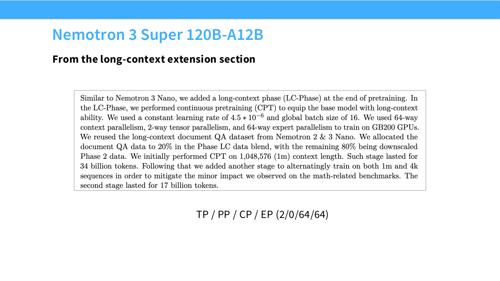
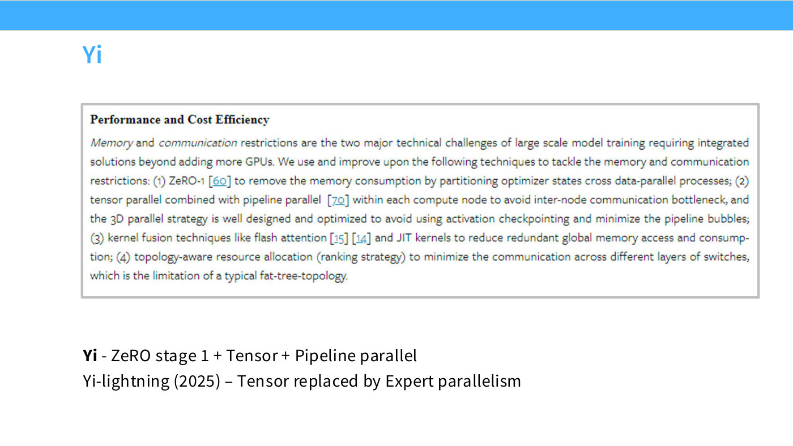
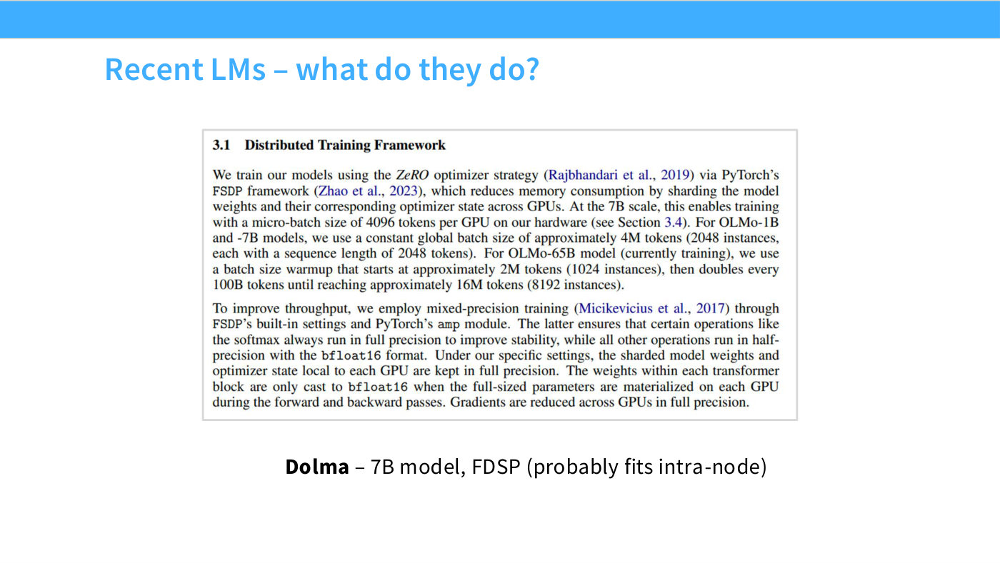
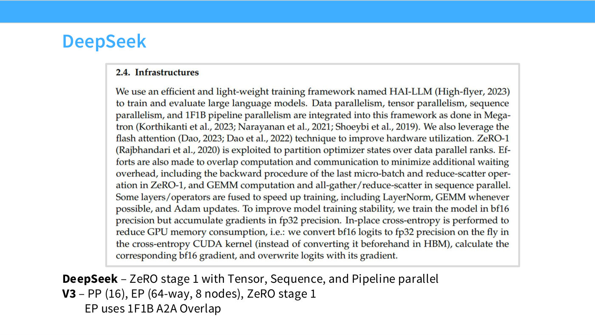
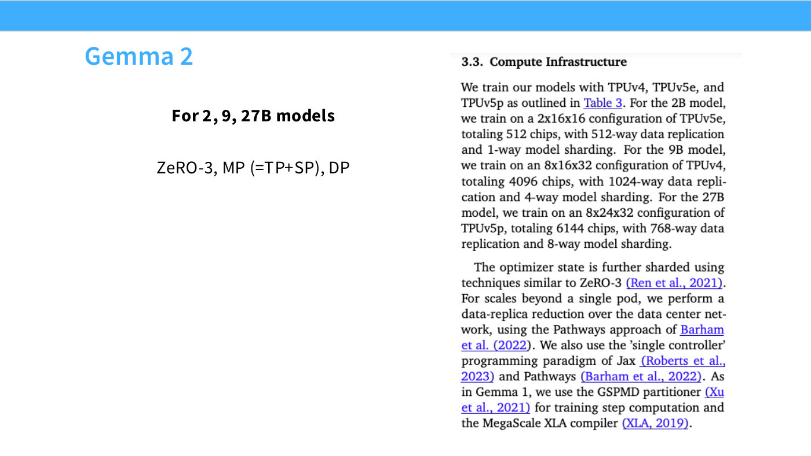

# What real training runs actually do

Lecture 8 closes by walking through published parallelism configurations from ten
recent models, "get a sense of how modern parallelization is used in practice,
and how it's evolving" ([1:11:57]). It is the best evidence in the course that the
[3D parallelism prescription](3d-parallelism.md) is what practitioners follow.

## The summary table

Slide 72, reproduced exactly as printed — including the `??` cells, which mean the
value is **not published**, distinct from a printed `0` meaning not used:

| | DP | TP/SP | EP | PP | CP |
| --- | --- | --- | --- | --- | --- |
| Deepseek | ?? (Zero1) | 1 | 8 | 16 | ?? |
| Deepseek v3 | ?? (Zero1) | 1 | 64 | 16 | ?? |
| Yi | ?? (Zero1) | >0 | 1 | >0 | ?? |
| Llama3 405B | 128 | 8 | 0 | 16 | 1 |
| Gemma 2 | 768 | 8 | 0 | 0 | 0 |
| Mixtral 8x22 (megatron) | 2 | 4 | 8 | 4 | 1 |
| Nemotron 3 120B (long context) | ?? | 2 | 64 | ?? | 64 |
| Qwen 3 (megatron) | ?? | 2 | 32 | 8 | 1 |

The slide's own conclusion, printed beneath it: **"TP generally <= 8. EP can be
big (but hard!). Long context phases use large CP"**.

And the lecture's ([1:18:55]):

> Really, the thing that's common here is that, as much as they can, all the models
> use data parallel — they maximize the data-parallel domains to the extent they
> can. Tensor parallel almost always remains below eight. And expert parallel can
> sometimes be big now, and I think that's partly because of DeepSeek V3 and a lot
> of the infrastructure they built for large-scale expert-parallel training.

**Two caveats on this table**, neither of them the lecturer's words. Slide 70
states Nemotron 3 Super's pipeline degree outright as 0 — "TP / PP / CP / EP
(2/0/64/64)" — while this table records it as `??`. The deck disagrees with itself,
and the slide file leaves both as printed rather than reconciling them. Separately,
the Llama3 405B row matches the **second** of slide 66's three rows (16,384 GPUs),
not the first.

*Slide 70 — Nemotron 3 Super 120B-A12B. [Deck](https://github.com/stanford-cs336/lectures/blob/main/lecture_08.pdf)*

## The individual runs

### FSDP is enough, if the model is small

**OLMo-7B** (AI2, trained on the Dolma dataset) used FSDP and nothing else
([1:12:44]):

> This is one example of FSDP scaling surprisingly well, even to many, many GPUs,
> as long as you're training a small model — FSDP is actually a pretty good
> strategy for parallelization, and I think many 7B-ish models are trained purely
> with FSDP.

### The classic dense combination

**Yi** uses "ZeRO stage 1, and tensor and pipeline parallel" — described as "the
classic data-parallel, tensor-parallel, pipeline-parallel combo" ([1:14:16]).
**DeepSeek V1** is the same shape: data parallel with ZeRO stage 1, plus tensor,
sequence and pipeline parallel ([1:13:31]).

Note the pattern in the table: all three ZeRO-1 rows leave DP as `??` but annotate
the mechanism. ZeRO stage 1 is the near-universal default because it is
[free](zero-and-fsdp.md).

### MoE replaces tensor parallel with expert parallel

**DeepSeek V3** drops tensor parallelism to 1 and runs **64-way expert
parallelism** ([1:13:31]):

> Their expert parallel is actually a little exotic, because they have 64-way
> parallelism — they group eight different machines together, and that's their
> expert-parallel domain. And to enable this large expert parallel, they basically
> use the same tricks they have from their pipeline-parallel pipelining, to try to
> make sure expert parallel doesn't have low-utilization periods.

Eight machines rather than one is well beyond the "keep it in the box" guidance,
and it is achieved with pipelining tricks applied to expert dispatch. The general
rule ([1:14:16]): "once you go to MoEs, you replace tensor parallelism with expert
parallelism — they serve similar goals, but expert parallelism is just a little
more efficient."

**Yi-Lightning** (2025) makes the same swap, replacing tensor with expert
parallelism (slide 65).

*Slide 65 — Yi. [Deck](https://github.com/stanford-cs336/lectures/blob/main/lecture_08.pdf)*

### The full breakdown: Llama 3 405B

The most informative report, because it gives per-stage configurations rather than
one number ([1:15:03]). Slide 66's table, in full:

| GPUs | TP | CP | PP | DP | Seq. len. | Tokens/batch | TFLOPs/GPU | BF16 MFU |
| --- | --- | --- | --- | --- | --- | --- | --- | --- |
| 8,192 | 8 | 1 | 16 | 64 | 8,192 | 16M | 430 | 43% |
| 16,384 | 8 | 1 | 16 | 128 | 8,192 | 16M | 400 | 41% |
| 16,384 | 8 | 16 | 16 | 8 | 131,072 | 16M | 380 | 38% |

Read down the CP and DP columns and the long-context stage tells its own story:
context parallel goes 1 → 1 → 16 while data parallel collapses 64 → 128 → 8, and
sequence length jumps from 8,192 to 131,072 ([1:15:03]):

> At the very end, because they want a long-context model, they do long-context
> extension, and for this they crank up the context parallel, lower the data
> parallel, and that's how they parallelize this very memory-hungry stage.

Tensor parallel is 8 and pipeline 16 throughout. There is no expert parallelism
because "Llama 3 405B is a gigantic dense model, it's not a MoE model".

Note also the [MFU](flops-and-mfu.md) column: 43% → 41% → 38%, so even a
well-engineered run gives up several points to double the GPU count and more again
to extend context.

### Hardware fails at this scale

Slide 67 is a side note that matters operationally ([1:15:49]):

> GPUs fail all the time. Apparently, during Llama 3 405B training, GPUs failed 148
> times. So, you need not just fast parallelism, you need redundancy, to be able to
> deal with all these horrible things that can happen to your training — there's a
> distributed-systems challenge as well.

The slide's pasted table (Llama 3's Table 5) attributes 419 interruptions over a
54-day period, of which 148 are faulty GPUs, and the paper's caption notes about
78% were confirmed or suspected hardware issues. *(The printed percentages sum to
94.9% rather than 100%, and are not percentages of 419 — the table lists only
leading categories. The slide file records both facts.)*

### No pipelines on a TPU mesh

**Gemma 2** (2B, 9B, 27B) uses ZeRO-3 plus tensor and sequence parallelism, with
zero pipeline and zero context parallelism — the only row in the table with DP in
the hundreds (768) ([1:16:36]):

> This is basically a realization of the Google claim that, for TPUs, you really
> don't need to do pipelines — you just take a really big toroidal mesh, and do
> tensor parallel over that big mesh network you have. It's unclear whether this
> can scale out forever … but at least at the Gemma scales, this is definitely the
> case.

That is [network topology](network-topology.md) visible directly in a
configuration table.

### Recommended configurations from Megatron Bridge

For the 2025 models the source is NVIDIA's **Megatron Bridge** repository, "where
they release a lot of recommended training configurations, for a lot of different
model sizes and settings" ([1:16:36]) — useful because it publishes configurations
for models whose labs did not.

- **Mixtral 8x22B**: EP 8, PP 4, TP 4 — the TP being "for the attention layers".
  Follows "the prescription of keeping your expert parallel roughly around eight"
  ([1:17:23]).
- **Nemotron 3 Super 120B-A12B**: heavy expert *and* context parallelism, the
  latter because the cited configuration is for long-context extension.
- **Qwen 3 235B-A22B**: "follows the DeepSeek recipe — a fairly large amount of
  expert parallel, 32 — and they have eight pipeline parallel and two tensor
  parallel, to split up things like the attention matrices" ([1:18:09]).

Even within a fixed strategy the sub-configuration matters: "there are all sorts of
different sub-configurations you can pick, even within tensor parallel, that can
significantly affect the performance" ([1:18:09]).

## See also

- [3D parallelism](3d-parallelism.md) — the prescription these runs follow.
- [ZeRO and FSDP](zero-and-fsdp.md) — why ZeRO-1 appears almost everywhere.
- [Expert parallelism](expert-parallelism.md) — the axis that grew most recently.
- [Context parallelism](context-parallelism.md) — the long-context stage.
- [Network topology](network-topology.md) — why Gemma 2 has no pipeline.
- [Lecture 8](08-parallelism-2.md) · [slides 63–72](../raw/slides/08-parallelism-2.md#slide-63--recent-lms--what-do-they-do) · [transcript](../raw/transcripts/08-parallelism-2.md)

*Slide 63 — Recent LMs – what do they do? [Deck](https://github.com/stanford-cs336/lectures/blob/main/lecture_08.pdf)*

*Slide 64 — DeepSeek. [Deck](https://github.com/stanford-cs336/lectures/blob/main/lecture_08.pdf)*

*Slide 68 — Gemma 2. [Deck](https://github.com/stanford-cs336/lectures/blob/main/lecture_08.pdf)*
