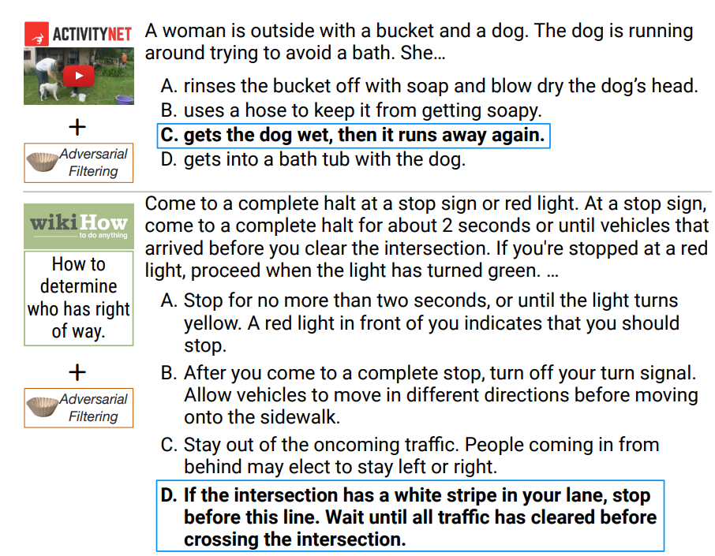

# Perplexity as an evaluation

Perplexity is the metric the whole course has been implicitly optimising since
lecture 1, and [lecture 12](12-evaluation.md) is where it finally gets examined as
an *evaluation* rather than as a training objective. The section is unusual for
this course in arguing both sides: perplexity is simultaneously defended as
sufficient in the limit and criticised as badly targeted in practice.

## The definition

A language model is a probability distribution $p(x)$ over sequences of tokens.
Perplexity asks how much probability mass that distribution puts on a held-out
dataset $D$:

$$\text{perplexity}(p, D) = \left(\frac{1}{p(D)}\right)^{1/|D|}$$

The exponent normalises by length so the number is comparable across datasets of
different sizes. Percy's gloss is exactly that plain: you have a test set, you see
how much probability mass the model assigns to it, and you divide so the numbers
are interpretable (≈[5:29]).

Perplexity, likelihood and log loss are the same quantity under different
transformations, which is why the training objective and the evaluation metric are
the same thing here.

## The classic paradigm, and what replaced it

Through the 2010s, language modelling papers evaluated **in-distribution**: train
on the train split of a dataset, test on the test split of the same dataset
(≈[6:14]). The standard datasets were

- **Penn Treebank** (Wall Street Journal),
- **WikiText-103** (Wikipedia),
- the **One Billion Word Benchmark**, drawn from machine-translation sources —
  EuroParl, UN proceedings, news.

Progress was measured purely as perplexity reduction, and it was real progress. A
2016 result took the One Billion Word Benchmark from perplexity 51.3 to 30.0 with
CNNs and LSTMs ([arXiv 1602.02410](https://arxiv.org/abs/1602.02410)) — at a time
when n-gram and hybrid models were still competitive, and this was the first
definitive demonstration that pure neural models were the way to go (≈[7:00]).

**GPT-2 broke the paradigm.** It was trained on WebText — 40GB of text from sites
linked on Reddit — and then evaluated *zero-shot* on everyone else's standard
datasets, which makes it **out-of-distribution** evaluation (≈[7:46]). The
lecture's reading of the resulting table is the important part:

- On **PTB**, a tiny dataset, GPT-2 reached about **35** perplexity against a
  state of the art of about **46** — a large win.
- On the **One Billion Word Benchmark**, where there is plenty of in-distribution
  training data, it did *not* beat the state of the art.

So the transfer helps where in-distribution data is scarce and does not where it
is plentiful (≈[8:33]). Percy adds a caveat in passing that becomes a whole
section later: nobody knows how carefully that comparison was decontaminated
(≈[8:33]) — see [benchmark contamination](benchmark-contamination.md).

*GPT-2's own results table. Bold marks where GPT-2 beats the prior state of the art — note that nothing in the 1BW column ever is, which is the whole of the claim above.*

That paper ushered in a new paradigm, in Percy's phrase: train on a large corpus,
evaluate on standard benchmarks. Now standard, then a novelty (≈[8:33]–[9:19];
the phrase itself straddles the [9:19] marker in the captions, so it is given
here without quotation marks).

## "Perplexity is all you need" — more faith than science

The source's own heading, and its own hedge. The argument is short:

- there is a true distribution $t$, and you are training a model $p$;
- the best achievable perplexity is the entropy $H(t)$, attained **iff** $p = t$;
- if $p = t$ then you can solve every task, because you can condition:
  $p(\text{solution} \mid \text{problem})$, $p(\text{answer} \mid \text{question})$;
- therefore pushing perplexity down eventually "reaches AGI".

Percy is explicit that this should not be taken too seriously as an argument, and
equally explicit about why it matters anyway: it is *a mindset*, and it drove a lot
of language-modelling research (≈[9:19]). Before GPT-3 it was not obvious that
scaling language models would have the impact it did, and it was this belief —
drive perplexity down and good things will happen — that motivated people to keep
scaling (≈[10:51]).

That is the honest historical claim in the section, and it is worth keeping
separate from the mathematical one. The mathematics is a statement about a unique
minimiser; the history is a statement about what people believed while the
evidence was thin.

## "Perplexity is maybe more than you need"

The complaint that follows is not that perplexity is wrong but that it is
**untargeted**. Take the sentence *Stanford was founded in 1885*. Perplexity
charges the model for its prediction on every token. The prediction of **1885** is
genuinely interesting — it is a question-answering problem in disguise, and it
tests knowledge of the world. The prediction of **founded**, or of the first word
of the sentence, is not (≈[11:36]).

Perplexity does not care about the difference. It charges bits for every deviation
from the true distribution wherever it occurs (≈[12:23]).

The repair is **conditional perplexity**: condition on a prompt and measure only
the response,

$$p(\text{response} \mid \text{prompt})^{1/|\text{response}|}$$

which lets you concentrate the measurement on the tokens you believe carry the
content and ignore the incidental ones (≈[12:23]).

Read the two headings as a matched pair. The first says perplexity is *sufficient*
in the limit; the second says it is *poorly aimed* in practice. Conditional
perplexity answers the second complaint only.

## Benchmarks that are perplexity in disguise

Two well-known benchmarks are reported as accuracy but are essentially
next-token prediction.

**LAMBADA** ([arXiv 1606.06031](https://arxiv.org/abs/1606.06031)) is a cloze
task — fill in the blank at the end of a passage. The example in the lecture is a
short narrative context followed by a sentence whose final word must be recovered.
What makes it more than plain perplexity is the selection: the target words are
*carefully chosen* so that resolving them requires a long stretch of preceding
context (≈[13:11]). That is exactly why the early GPT papers latched onto it — they
were interested in long-context modelling, and LAMBADA sharpens perplexity onto the
positions where long-range dependencies actually matter (≈[13:56]).

*A LAMBADA item. The point is the length of context you have to hold to recover the final word — that is what separates it from ordinary perplexity.*

**HellaSwag** ([arXiv 1905.07830](https://arxiv.org/pdf/1905.07830)) is
multiple-choice sentence completion: given *"A woman is outside with a pug and a
dog. The dog is running around, she ___"*, choose the continuation that fits best.
Multiple choice on the surface, perplexity underneath (≈[14:41]).

*A HellaSwag item. Four candidate continuations, scored by how probable the model finds each — accuracy on the surface, likelihood underneath.*

The general point is a useful one when reading any benchmark table: a task scored
by accuracy may still be scoring the same quantity as perplexity, just restricted
to positions the benchmark's authors selected.

## A warning for anyone running a perplexity leaderboard

This is the section's sharpest practical point, and it is about **what a
leaderboard can verify**.

On a perplexity leaderboard, a participant submits a model, you hand it the test
data, and it hands you back a log-probability. You have to *trust* that the
probabilities are a valid distribution — that they sum to one. Otherwise the
winning entry is a model that always returns probability 1, i.e. log-probability 0,
and takes the top of the table with a distribution that is not a distribution
(≈[15:27]).

Nothing in the interface lets you check this. You would have to read the code
(≈[16:14]).

Downstream task leaderboards do not have the problem. There the model is a genuine
black box: you send a prompt, you get a response, and you score the response
yourself (≈[16:14]). The asymmetry is fundamental — perplexity is a claim about a
distribution, and accuracy is a claim about an output you hold in your hand.

Percy adds a second case: for models where the exact likelihood is not computable
at all, such as VAEs, you get only a *bound*, and now you must trust the
mathematics of the bound as well (≈[16:59]).

## Where perplexity is still the right tool

The summary is deliberately two-sided:

- **Perplexity is still used heavily in language-model development**, and the
  reason given is the one this course has already relied on: it varies *smoothly*
  with scale, which is what makes [scaling laws](scaling-laws.md) fittable at all
  (≈[16:59]). See [scaling-law methodology](scaling-law-methodology.md).
- **You still need benchmarks that capture real-world situations** — for the
  non-believers. Percy's line is that a believer is convinced by a remarkably low
  perplexity, and everyone else wants to see a task (≈[17:46]).

Two connections elsewhere in this knowledge base sharpen the caution:

- [Upstream vs downstream](upstream-vs-downstream.md) is lecture 9's evidence that
  a clean perplexity trend can reorder completely when you measure task accuracy.
  That is the empirical version of *perplexity is maybe more than
you need*.
- [Private evaluations](benchmark-contamination.md#route-4-private-evals) are
  easiest to run with perplexity, because a private eval needs only text and no
  answer key.

## Sources

- Course material: [`raw/slides/12-evaluation.md`](../raw/slides/12-evaluation.md),
  section *Perplexity* (`lecture_12.py` lines 60–106).
- Transcript: [lecture 12](../raw/transcripts/12-evaluation.md), ≈[5:29]–[17:46].
