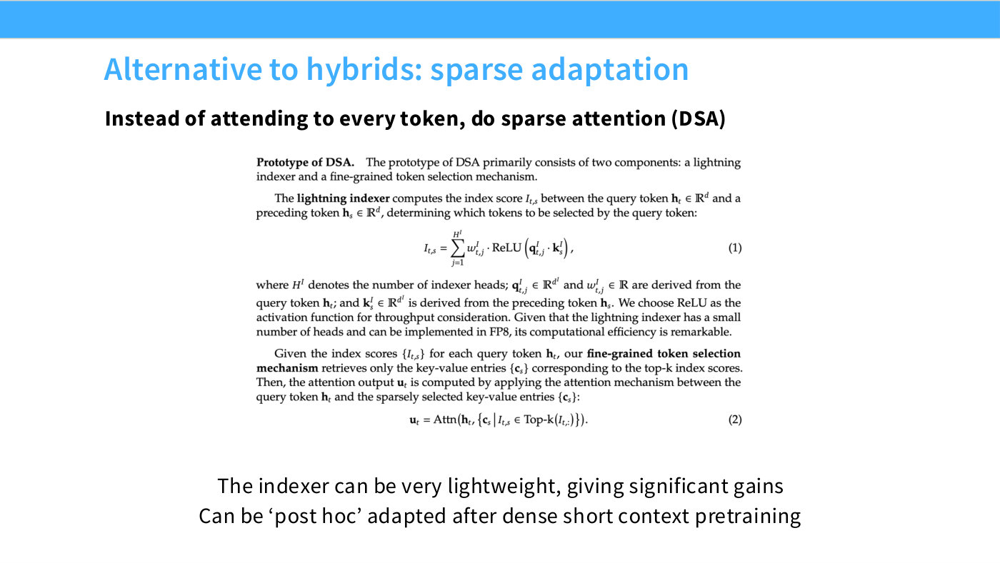
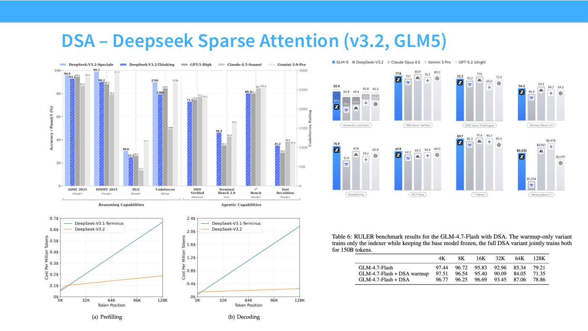

# Sparse attention and DSA

The second answer to attention's quadratic cost, and structurally the opposite of
[linear attention](linear-attention.md): instead of removing the softmax and keeping
every token, it keeps the softmax and discards most of the tokens.

DeepSeek Sparse Attention (DSA) is lecture 4's worked example, introduced in DeepSeek
V3.2 and adopted by GLM-5 (slides 12–13).

*Slide 12 — Alternative to hybrids: sparse adaptation. [Deck](https://github.com/stanford-cs336/lectures/blob/main/lecture_04.pdf)*

*Slide 13 — DSA – Deepseek Sparse Attention (v3.2, GLM5). [Deck](https://github.com/stanford-cs336/lectures/blob/main/lecture_04.pdf)*

## The mechanism

Two components. A **lightning indexer** scores every preceding token against the current
query, and a **fine-grained token selection** step keeps only the top-$k$ of them for
the real attention computation.

The indexer score between query token $\mathbf{h}_t$ and preceding token
$\mathbf{h}_s$:

$$I_{t,s} = \sum_{j=1}^{H^I} w^I_{t,j} \cdot \mathrm{ReLU}\!\left(\mathbf{q}^I_{t,j} \cdot \mathbf{k}^I_s\right)$$

$H^I$ is the number of indexer heads, $\mathbf{q}^I_{t,j}$ and the scalar weight
$w^I_{t,j}$ come from the query token, and $\mathbf{k}^I_s$ from the preceding token.
The paper's stated reason for ReLU rather than a softmax is throughput.

Then attention runs over the surviving entries only:

$$\mathbf{u}_t = \mathrm{Attn}\!\left(\mathbf{h}_t, \left\{\mathbf{c}_s \mid I_{t,s} \in \text{Top-}k\left(I_{t,:}\right)\right\}\right)$$

Hashimoto's plain-language version: "you have your normal Qs and Ks, but then you pass
this through the indexer… take the QK inner products, take a ReLU, and then it has these
weights that are derived from the preceding tokens… And then you pick through this with
a top-k" ([23:55]).

## It is not linear time, and the lecture is emphatic about that

This is the most commonly mistaken thing about DSA, and Hashimoto corrects it directly
when a student asks about the indexer's complexity.

> **Student:** So, the indexer — the time complexity for that, is it —
> **Hashimoto:** It's quadratic. …because, in order to know what to select, it does have
> to look at everything. ([26:58])

And there is no hidden trick: "there's no clever state-transition trick happening here —
it's really brute-force inner products" ([27:44]).

So DSA does not change the asymptotics. It attacks the constant factors, on both terms:

- **The indexer is cheap per pair.** Few heads, low dimension, and implementable in FP8.
  "You can do it in much lower precision… You can do it in ways that are
  lower-dimensional, by projecting the Qs and Ks further just for the indexing"
  ([27:44]).
- **The expensive attention runs on a bounded subset.** "Even though it's quadratic, it's
  quadratic on a shorter context length, because it's top-k, we can control k. So now
  it's — this is expensive, but small" ([27:44]).

This is the lecture's [3:09] theme returning: "you shouldn't get too stuck on
quadratic-versus-not — sometimes the constant factors are really, really important"
([28:29]). Compare [FlashAttention](efficiency.md), which is also pure constant-factor
work.

Asked whether $k$ scales with input length, Hashimoto says it is bounded: "you'd pick
values much closer to short-context performance, and you'd bound it; so regardless of
the input size, they'd be bound" ([29:15]).

## It can be bolted on after pretraining

The property that makes DSA cheap to adopt. You do not train with the indexer from
scratch:

> What you do is just train a normal transformer, and when you do your long-context
> extension, you drop in this lightning indexer, and then train the model to handle this
> indexer, in an extension stage that's separate from pre-training. ([24:41])

This costs almost nothing extra, because the stage already exists. Models are not
pretrained at full context length for compute reasons — "you train a shortish-context
model first, and then you've got these long-context extension stages. So the nice idea
here is: we're going to do the second phase anyway, so why don't we bolt the long-context
cost savings on at the same stage?" ([28:29]).

The usual pipeline he describes: short-context pretraining → long-context extension →
post-training ([29:15]).

He finds it surprising that this works at all — "it's kind of surprising that it works,
honestly, that you can bolt on this frankly scary-looking top-k non-differentiable
object" ([28:29]) — which is the bridge into the MoE half of the lecture.

## The evidence

**DeepSeek V3.2** (slide 13) is competitive with the frontier models of its moment across
reasoning and agentic benchmarks, and its cost curves are the more striking part: on
prefilling, V3.1-Terminus rises roughly linearly to about \$0.66 per million tokens at
128K while V3.2 rises to only about \$0.19; on decoding the gap is wider still, V3.2
staying nearly flat around \$0.15–0.24 where the previous generation climbs past \$1.75.

**GLM-5** independently adopted DSA, and its ablation table (slide 13, Table 6) compares
the base model, an indexer-warmup-only variant, and full DSA training on RULER at
context lengths from 4K to 128K. Hashimoto's summary: "if you do full DSA training, you
don't lose very much performance relative to full attention, even on long-context
retrieval tasks that are fairly difficult for RNN-style architectures" ([26:12]) — the
full-DSA row is at or above the base model at 16K, 32K and 64K, and within half a point
at 128K, while the warmup-only variant degrades noticeably at long context.

That last clause is a genuine advantage over the state-space family: retrieval over long
contexts is exactly where a fixed-size state struggles, and DSA keeps full attention
over whatever it selects.

## The connection to mixture of experts

The lecture plants this deliberately. The top-$k$ selection here is the same
non-differentiable primitive that MoE routing uses, and Hashimoto flags it twice — "it
turns out that this idea of top-k selection is going to be core to the next part of this
lecture" ([26:58]) and, on returning to it, that the same trick appears in DSA and in
H-Net's attempt to remove tokenizers ([1:09:20]).

His conclusion is that this is a general pattern worth recognizing: "this idea of top-k
selection, and using load balancing or other kinds of auxiliary losses to work around
that non-differentiability, will be an ingredient of future architecture design"
([1:10:05]).

## Related pages

- [Linear attention](linear-attention.md) and [state space models](state-space-models.md)
  — the other half of the lecture's answer to context cost.
- [MoE routing](moe-routing.md) — the same top-$k$ primitive, used to pick experts.
- [Attention variants](attention-variants.md) — sliding-window and fixed-pattern sparsity
  from lecture 3, which is sparsity with a *static* pattern rather than a learned one.
- [Lecture 4](04-attention-alternatives.md).
