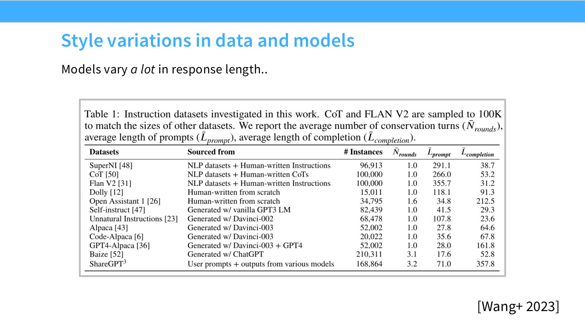
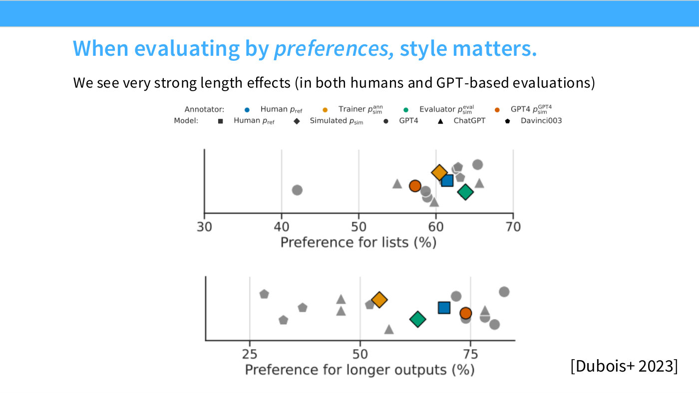
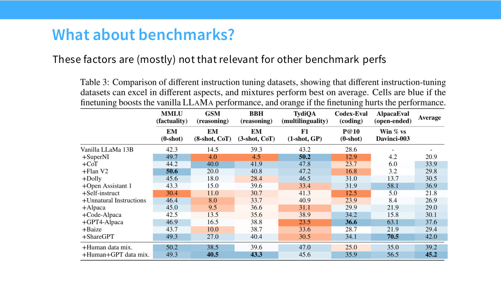
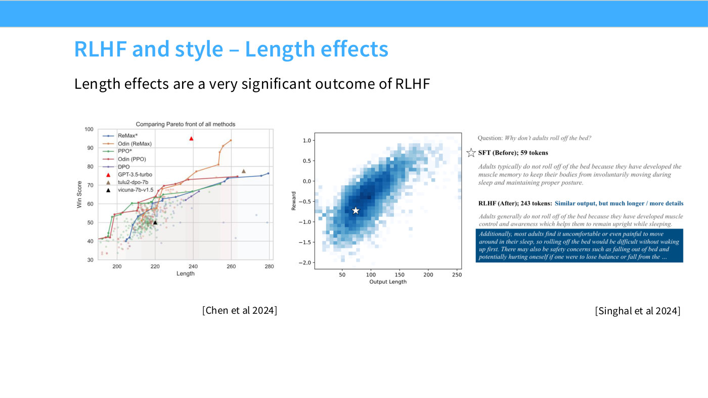

# Style and length bias

Preference-based training and preference-based evaluation both reward **how** a
response is written, not just what it says — and the two effects compound.
CS336's lecture 15 treats this as one of the central practical hazards of
post-training, returning to it in both halves of the lecture.

The evaluation-side treatment is in [chat benchmarks](chat-benchmarks.md), from
lecture 12. This page is the training-side one: where the bias enters your data,
what it does to your model, and why the fix is separation rather than correction.

## Style is a decision someone made

The first thing lecture 15 wants understood is that a model's register is not
emergent. It is chosen (≈19:18):

> People say, you know, Claude has a different tone than ChatGPT, ChatGPT is too
> chatty, and so forth — all of these are conscious decisions made by the data
> collection folks.

And the raw material varies enormously: response lengths differ widely across
[instruction-tuning datasets](instruction-tuning-datasets.md), which slide 16
tabulates directly.

*Slide 16 — the instruction datasets compared side by side; length and register differ substantially between them.*

## Raters reward style, and they know it

> When you go and evaluate preferences, these stylistic factors matter a ton.
> People will get very easily tricked — I don't know if "tricked" is the right
> word — but they will very often select responses that have bullet-pointed lists
> in their outputs, or responses that have more, longer detail. (≈20:03)

The lecturer's hesitation over "tricked" is deliberate and worth keeping. This is
not straightforwardly irrational behaviour: "I think part of this is very natural,
especially in an evaluation setting where you're put in front of two examples and
asked which one's better — more detailed, list-like responses are generally good."

The problem is not that the preference is wrong. It is that it is *systematic*,
so optimizing against it moves your model along an axis that has little to do
with capability — inducing "very explicit distortions in the kind of tone that a
chatbot has, relative to people."

*Slide 17 — preference outcomes plotted against stylistic properties of the responses.*

## The measurement that makes it concrete

Train on different post-training datasets and score the results two ways. The
preference-based number moves a great deal; the benchmark number barely moves at
all (≈21:35):

> You'll see big variations in preferences when you train on some of these
> things — kind of the right column over there, AlpacaEval, for example. But it
> really doesn't necessarily change standard benchmarking evaluations — your
> models aren't necessarily smarter because you've trained on certain kinds of
> post-training data, at least in these cases. But you can very much shift the
> engagement signals.

*Slide 18 — "Table 3: Comparison of different instruction tuning datasets" — the preference column and the benchmark columns disagree.*

## The design rule

> This is telling you that you want to think about style control separately from
> capabilities control.

Two separate levers, measured separately. Note that this is a rule about *how to
organize your work*, not a claim that style is unimportant — a chatbot's register
is a product decision worth making deliberately. The failure is conflating the two
and reading a style improvement as a capability improvement.

## Why this is dangerous in a company

The failure mode has a specific shape when the feedback signal is engagement
(≈20:49):

> If you're looking at engagement signals, as most of these companies are, it's
> very easy to fool yourself into thinking you're getting better data when, in
> reality, your model's capabilities are not changing.

## Model judges have the same bias, and it is exploitable

Moving from human raters to [model-based annotation](model-based-annotation.md)
does not fix this. "Models are also very susceptible to the same kinds of biases
as humans — sometimes in ways that are quite problematic as well, even more
problematic" (≈1:04:01).

Two results the lecture cites (≈1:04:48):

- **Length alone buys win rate.** "You could just push the length of your
  responses way out, and you would continue to get improvements in the win rates
  of model-judged performance." The one outlier on that chart is GPT-3.5-turbo,
  which the lecturer reads as the model saying "we're not just length-hacking,
  we're actually a model that is actually better."
- **You can RLHF on length by itself.** "Others showed — this was a very nice
  paper — that you can just RLHF on length alone and do quite well on many of
  these benchmarks."

*Slide 48 — win rate against response length: the Pareto front of methods, with GPT-3.5-turbo as the notable outlier above the length trend.*

That second result is the sharp one. If a policy trained on *nothing but* a length
reward scores well on a benchmark, the benchmark is substantially measuring
length.

## What people do about it

- **Length-normalized DPO and SimPO** divide each side of the preference loss by
  response length, explicitly "in order to avoid certain length-hacking issues
  that seem to arise" (≈1:14:49). The lecture's verdict on the DPO variants as a
  family is that "none of these variants seem to matter very much" — see
  [DPO](dpo.md).
- **Style-controlled leaderboards** attempt the correction at evaluation time;
  see [chat benchmarks](chat-benchmarks.md).

## See also

- [Chat benchmarks](chat-benchmarks.md) — AlpacaEval, Chatbot Arena, and the evaluation-side treatment
- [DPO](dpo.md) — length-normalized variants
- [Reward models](reward-models.md) — what inherits the bias
- [Model-based annotation](model-based-annotation.md) — where it also applies
- [Upstream vs downstream](upstream-vs-downstream.md) · [Construct validity](construct-validity.md)
- [Lecture 15](15-mid-post-training.md)
