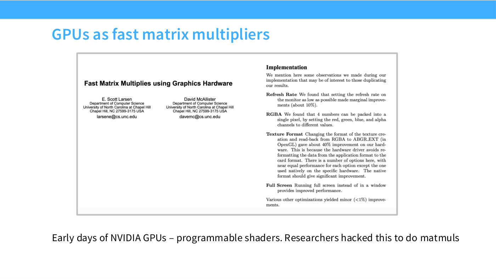
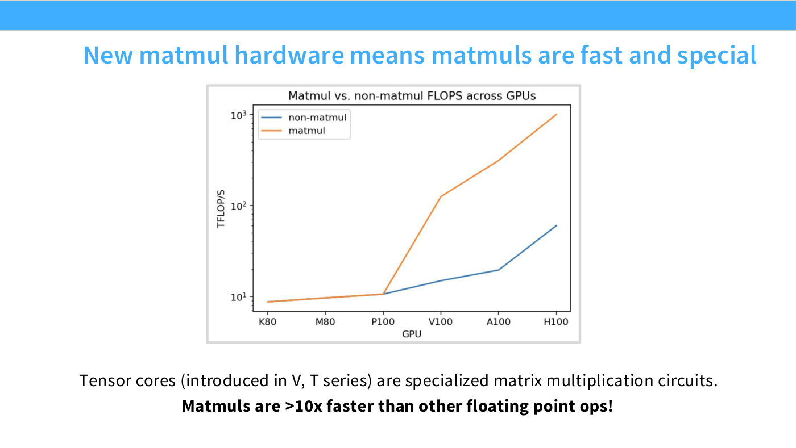
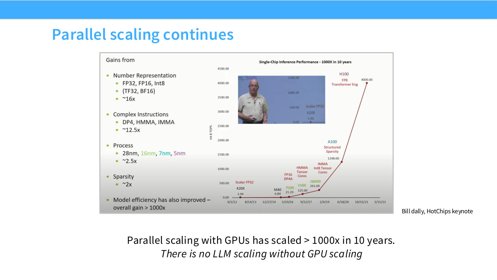

# Tensor cores and why matmuls are privileged

One hardware decision shapes more of modern architecture design than any other: as
of the V100, Nvidia GPUs contain a circuit that does nothing but multiply matrices.
Everything else you can compute on a GPU is, by comparison, slow.

## Before tensor cores

Hashimoto's potted history in Lecture 5 ([23:51]): even in the early days, before
any matmul hardware existed, people saw that commodity graphics chips with massive
parallelism would be useful for scientific computing. Slide 16 shows one of the
original papers on using graphics hardware for fast matrix multiplies — "really,
really cool hacker work," where people "figured out, well, we have these shaders
that are implemented, but we can program specific shaders that will actually give
us matrix multiplies, and different rendering settings give us faster matrix
multiplies."

*Slide 16 — GPUs as fast matrix multipliers. [Deck](https://github.com/stanford-cs336/lectures/blob/main/lecture_05.pdf)*

That era ended when the hardware arrived. "As of the V100, Nvidia decided, here is
a piece of hardware that will do your matrix multiplies for you" ([24:37]).
Confirmed in Q&A at [27:43]: before the V100 there was no tensor core specialized
for matmul, and while many SMs and ALUs still gave decent throughput, "a specialized
circuit for matrix multiply really changes the game."

## The gap

Slide 17 is the quantitative claim, and it is large. Once tensor cores existed,
"matmuls became the one privileged operation in machine learning. At this point,
there's a gigantic gap between the throughput you'll get on parallelizable but
non-matrix-multiply operations and the amount of operations you can do in a matrix
multiply" ([24:37]).

*Slide 17 — New matmul hardware means matmuls are fast and special. [Deck](https://github.com/stanford-cs336/lectures/blob/main/lecture_05.pdf)*

The size of it: **more than 10× faster than any other floating-point operation you
can do on a GPU** ([25:23]).

The chart on slide 17 plots matmul against non-matmul throughput across GPU
generations — K80, M80, P100, V100, A100, H100 — with the two diverging sharply
after P100. (The deck's second tick reads "M80" where the Maxwell part is normally
called M40; the slide transcription records it as printed rather than correcting
it, and a figure audit confirmed the label at 2400 dpi.)

## Why this constrains architecture design

This is the load-bearing consequence, and it reaches well outside the systems unit:

> "This is one of the reasons why any near-future machine learning architecture that
> scales with compute is going to have a matrix multiply in it — because this is the
> one way you can really effectively get a lot of compute throughput" ([24:37]).

An architecture that replaces matmuls with something structurally cleverer but not
matmul-shaped starts more than an order of magnitude behind on hardware
utilization. It is the same argument the lecture's closing summary makes when it
says the growth of compute "means we really want to think about matmuls — those are
the core operations that are very arithmetically dense" ([1:17:30]).

It also explains a pattern visible across
[the architecture survey](model-architecture-survey.md) and in
[attention alternatives](attention-variants.md): proposals that survive tend to be
ones that keep the heavy work inside dense matrix multiplies.

Compare [arithmetic intensity](arithmetic-intensity.md), which makes the same point
from the other direction: matrix–matrix multiplication is the one common operation
whose intensity is high enough to be compute-bound rather than memory-bound.

## Where the FLOPs have come from

Slide 7's chart tracks GPU throughput by generation, and Hashimoto reads the
inflection at [6:12]: in the era of K20s and M40s the numbers were "respectable, but
somewhat pitiful by today's standards," and then "around P100s and V100s, this curve
takes off, and you get super-exponential scaling."

*Slide 7 — Parallel scaling continues. [Deck](https://github.com/stanford-cs336/lectures/blob/main/lecture_05.pdf)*

Two ingredients drive that, and neither is clock speed ([6:59]):

- **Tensor cores**, from the V100 in 2017.
- **Structured sparsity and lower number formats** — FP8 and below — in the years
  after. See [microscaling formats](microscaling-formats.md).

Hashimoto's caution at [34:37] is worth keeping attached to that chart: "a pretty
non-trivial part of it is number representations: you start at FP32, go to BF16,
and then to INT8." Some of the curve is better silicon; some of it is counting
smaller numbers.

## A naming collision worth knowing

"Tensor core" means two different things depending on the vendor. On a GPU it is
the matrix multiply unit. On a TPU it is the *processor* — the equivalent of a
streaming multiprocessor — and the matrix multiply unit inside it is called an MXU.
Hashimoto flags this explicitly at [20:00]: "they're named exactly the same thing,
so you will have to disambiguate them based on context." See [TPUs](tpus.md).

## Related

- [TPUs](tpus.md) — the alternative design, and the naming collision.
- [Microscaling formats](microscaling-formats.md) — the low-precision half of the
  throughput story.
- [Arithmetic intensity](arithmetic-intensity.md) — why matmul is the one
  compute-bound operation.
- [GPU architecture](gpu-architecture.md).
- [Lecture 5 — GPUs and TPUs](05-gpus-tpus.md).
- [Transcript](../raw/transcripts/05-gpus-tpus.md), [slide deck](../raw/slides/05-gpus-tpus.md).
