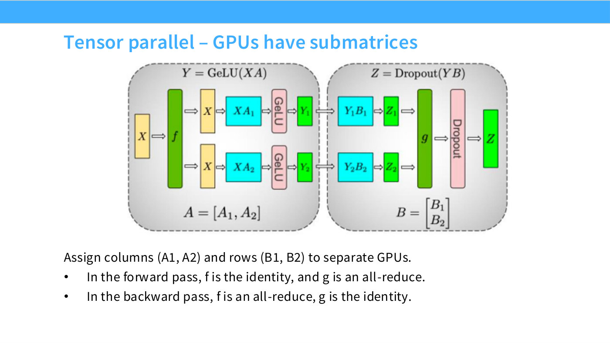
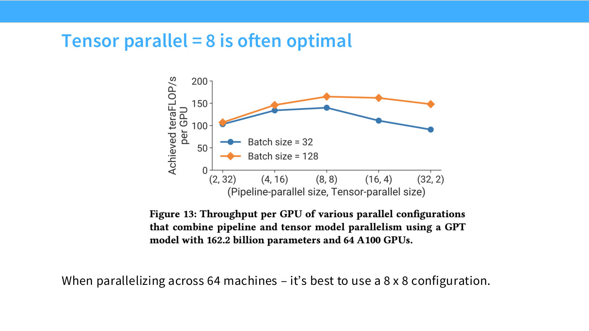

# Tensor parallelism

Cut along the **width**: every rank holds a stripe of every weight matrix, all
ranks see all the data, and the activations are re-assembled by a collective after
each layer. It is the mirror image of [data parallelism](data-parallelism.md) —
there the data was cut and the parameters replicated; here the parameters are cut
and the data replicated ([1:02:44]).

It is also the expensive one. Generally, this "means that we're going to have to
transfer a lot more data".

## The mechanism

Same setup: 128 × 1024 data, four layers, world size 4 ([1:03:31]).

**1. Every rank gets all the data.** No slicing.

**2. Shard the width.** `local_num_dim = num_dim / world_size` = 256, so each
rank's per-layer weight is $1024 \times 256$ rather than $1024 \times 1024$. "If
this were one of the parameter matrices for one layer, I would be doing —
splitting down the columns. So, this is also known as column tensor-parallel.
You can also do it by rows, but we're not going to talk about that right now"
([1:04:17]).

**3. Each layer, in three steps** ([1:05:03]–[1:06:36]):

```python
x = x @ params[layer]   # (128 x 1024) @ (1024 x 256) -> 128 x 256, this rank's slice
x = F.gelu(x)           # fine to do now: elementwise
dist.all_gather(tensor_list=activations, tensor=x)   # collect all four slices
x = torch.cat(activations, dim=1)                    # back to 128 x 1024
```

Each rank computes a $128 \times 256$ slice of the activations,
[all-gathers](collective-operations.md#the-three-workhorses) the four slices, and
concatenates along the width to rebuild the full $128 \times 1024$ activation for
the next layer.

The nonlinearity goes *before* the communication, and the reason is worth naming:
"I can still proceed — I can apply this nonlinearity, because this is elementwise
anyway" ([1:05:03]). An elementwise function of a slice is the slice of the
function. This would not work for anything that mixes across the width — a
[softmax](fused-softmax.md) or an [RMSNorm](rmsnorm.md) would need the gathered
tensor first.

The underlying fact being exploited: "this is strongly leveraging the fact that if
you want to do a matrix multiplication, you can split it up into a set of small
matrix — smaller matrix multiplications. You can do those on different ranks, and then we can
gather the results" ([1:07:21]).

In the course's [recorded run](../raw/slides/07-parallelism.md#tensor-parallelism--implementation),
all four ranks finish with the same $128 \times 1024$ activations.

## The backward pass

Left as a homework exercise, but the rule is given ([1:08:08]):

> In the backprop, you have your activations, and you have to reduce-scatter all
> the different gradients. So, in some ways, all-gather and reduce-scatter have
> this duality, where, in forward, if you're all-gathering, in the backward you're
> reduce-scattering.

And autograd will not do it for you. Asked directly: "if you just call
`.backward()`, it's not going to do it, because there's no parallelism in that…
Here, we're managing things fairly explicitly, which means … you would have to
manage and call the reduce-scatter yourself. And that's baked in by design,
because this is 336 — building language models from scratch. In practice, you
probably wouldn't have to do that" ([1:08:08]–[1:08:54]).

## The cost, and where it can live

Communication happens **once per layer**, not once per step, and it carries
*activations*, which are large. That is the whole reason this technique has a
hardware prerequisite ([1:15:51]):

> Tensor parallelism — there's a lot of communication, because, for every layer,
> you need to send all these activations, which are fairly big. So, generally,
> tensor parallelism happens within a node, on NVLink, where you have high
> bandwidth.

The lecture's summary line is blunt: tensor parallelism "requires very fast
interconnects (e.g., NVLink)" ([1:18:54]). Outside an
[NVLink domain](gpu-interconnect.md), don't ([1:16:37]).

The other cost is to your code. Where DDP is modular, this is invasive: "now we
have to muck around with the model. Data-parallel is very elegant, because it's
splitting by data — the model is treated as a module. But now we have to muck
around with a model" ([1:07:21]).

## Other axes

Two more cuts are named but not implemented ([1:15:05]–[1:15:51]):

- **Sequence parallelism** — "takes a whole sequence and chops it up into pieces,
  and that allows you to parallelize attention computation". Cutting along
  *length* rather than width.
- **[Expert parallelism](expert-parallelism.md)** — "allows you to parallelize the
  experts for MoEs, and this is where the all-to-all that I mentioned comes in"
  ([all-to-all](collective-operations.md#the-general-one)). Also a width cut, but along a dimension
  [MoE models](mixture-of-experts.md) already have.

The lecture groups tensor and expert parallelism together as width cuts in its
final summary ([1:18:54]).

## Where lecture 8 takes this

Lecture 7 implemented a column-wise cut; lecture 8 fills in the transformer-level
picture, the cost model, and the memory consequences.

**Both cuts, in their places** ([41:20]). Column-wise at the inputs — the MLP
inputs and the attention projections. Row-wise at the corresponding second stage —
the MLP down-projections and the attention outputs. Small layers (LayerNorm,
the nonlinearity, [MoE routers](moe-routing.md)) stay **fully replicated**, because
"you don't really want to bother with the overhead of cutting those" ([42:05]).

**The $f$/$g$ duality**, on slide 40 ([40:34]): in the forward pass $f$ is the
identity (just copy $X$ to both ranks) and $g$ is an all-reduce; in the backward
pass they swap — $g$ becomes the identity and $f$ becomes the sum of partials.
This is the same forward/backward collective swap that appears in
[sequence parallelism](sequence-parallelism.md).



*Slide 40 — Tensor parallel – GPUs have submatrices. [Deck](https://github.com/stanford-cs336/lectures/blob/main/lecture_08.pdf)*

**The degree-8 rule.** Communication is activation-sized and happens at every
matmul, so tensor parallelism is "extremely communication-hungry" ([42:05]) and
belongs inside one node: "for GPUs, eight GPUs are networked tightly together in a
single box, so up to eight, you might be willing to do some tensor parallel"
([42:50]). Slide 61 confirms 8 is quantitatively the right stopping point
([1:11:12]), and slide 72 shows TP ≤ 8 across essentially every published run.



*Slide 61 — Tensor parallel = 8 is often optimal. [Deck](https://github.com/stanford-cs336/lectures/blob/main/lecture_08.pdf)*

This is a **GPU** constraint, not a law. On a TPU [toroidal mesh](network-topology.md)
there is no fast-group boundary, so "you can tensor-parallel over very large
numbers, compared to the GPU world" ([43:36]) — which is why
[Gemma 2](parallelism-case-studies.md) needs no pipeline at all.

**Against pipelines** ([44:21]): no bubble and low complexity, but communication
rises from point-to-point $B \times S \times H$ to roughly
$8 \times B \times S \times H$ all-to-all. "Tensor parallel is great whenever we
have high-speed interconnects — every other time, we probably want to use pipeline
parallel."

**What it does not fix.** It divides 24 of the 34 terms of
[activation memory](activation-memory.md), leaving a stubborn $10sbh$ that needs
[sequence parallelism](sequence-parallelism.md) ([48:56]). And for MoE models
[expert parallelism](expert-parallelism.md) is preferred outright ([54:19]).

## See also

- [Data parallelism](data-parallelism.md) — the batch cut.
- [Pipeline parallelism](pipeline-parallelism.md) — the depth cut.
- [GPU interconnect](gpu-interconnect.md) — why "within a node" is the operative
  constraint.
