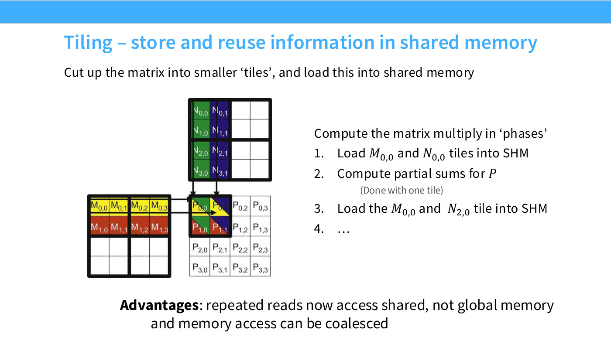
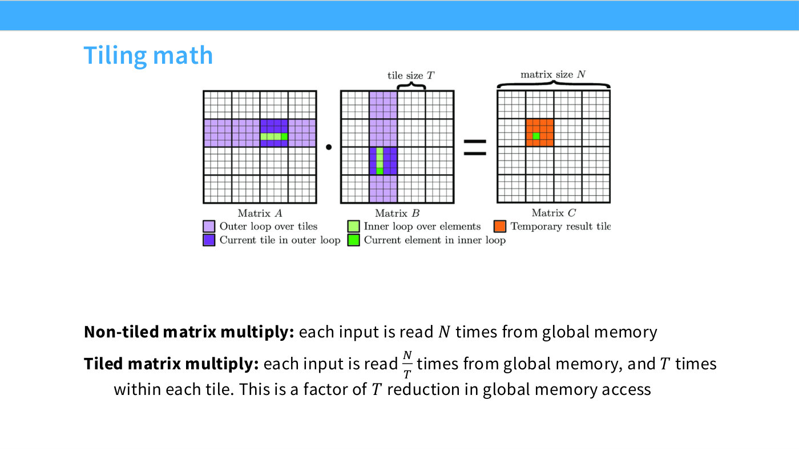
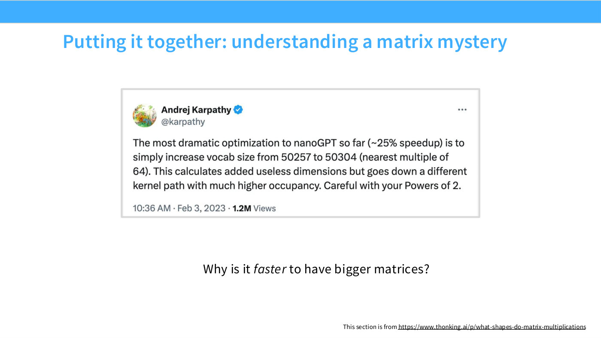

# Tiling

Tiling is the single most important technique for making a matrix multiply fast on
a GPU, and Tatsunori Hashimoto introduces it that way in Lecture 5 — "the last one
I want to talk about, and this is the big one — maybe the most important idea, I've
saved it for last" ([57:37]). It is also the idea that FlashAttention is built out
of, so it is worth understanding properly before reading
[flash attention](flash-attention.md).

The problem it solves is the one the whole lecture circles: **global memory is
slow, and a naive matrix multiply reads from it far more often than it needs to.**

## The waste in a naive matmul

Multiply two $N \times N$ matrices the obvious way and every input element is read
$N$ times from global memory — once for each output element whose computation it
participates in. Hashimoto states it at [58:22]: "each entry gets read $N$ times in
an $N$-by-$N$ matrix multiply, naively."

Those reads are redundant. The same value is fetched over the slow path again and
again, when it could have been fetched once into fast memory and reused there.

## The fix: cut the matrices into tiles

The name comes from the geometry. Cut each matrix into small square submatrices —
tiles — and process a tile at a time. Slide 41 gives the phases:

*Slide 41 — Tiling – store and reuse information in shared memory. [Deck](https://github.com/stanford-cs336/lectures/blob/main/lecture_05.pdf)*

1. Load the $M_{0,0}$ and $N_{0,0}$ tiles into shared memory.
2. Compute partial sums for the output tile $P$ (done with one tile).
3. Load the $M_{0,0}$ and $N_{2,0}$ tiles into shared memory.
4. Continue.

The deck's stated advantages are that "repeated reads now access shared, not global
memory" and that "memory access can be coalesced" — the second of which is why
[memory coalescing](memory-coalescing.md) is a prerequisite for this section rather
than an aside.

The mechanism rests directly on the [execution model](gpu-execution-model.md): a
*block* of threads is guaranteed to run on one SM, and an SM has its own shared
memory, so a block of threads can cooperatively load a tile and then all read it at
shared-memory speed. Hashimoto makes that connection at [14:36]: blocks matter
"when we talk about tiling, where these blocks are going to be reusing the same
pieces of memory."

## The arithmetic

Slide 42 states the result in two lines:

*Slide 42 — Tiling math. [Deck](https://github.com/stanford-cs336/lectures/blob/main/lecture_05.pdf)*

- **Non-tiled matrix multiply:** each input is read $N$ times from global memory.
- **Tiled matrix multiply:** each input is read $\frac{N}{T}$ times from global
  memory, and $T$ times within each tile.

where $T$ is the tile size and $N$ the matrix size. That is a **factor of $T$
reduction in global memory access.**

The extreme case is the sanity check, and Hashimoto uses it at [1:00:39]: if
$T = N$ — one tile covering the whole matrix — you read each input exactly once
from global memory and access it $N$ times in shared memory. The traffic you were
paying for has moved from the slow path to the fast one.

This is why he adds the aside about all-SRAM accelerators at [1:00:39]: if you
could afford to build a chip that is entirely fast memory, "you'd just put the
whole matrix in there and be very fast with the whole thing — but very, very
expensive." Tiling is the technique you need precisely *because* the
[memory hierarchy](gpu-architecture.md) exists.

## Tile size is an optimization problem, not a constant

The lecture spends as long on tiling's complications as on tiling itself, and this
is the part that explains real benchmark curves.

**Tiles that do not divide the matrix.** With a $128 \times 128$ tile and a
$256 \times 256$ matrix, you get four tiles and life is good. Increase one
dimension by one and you have generated "two very skinny tiles with basically
nothing inside them" ([1:02:56]) — tiles that occupy scheduling slots and do almost
no work. So the optimal tile size depends on the matrix size, the coalescing
behaviour, and how much shared memory the accelerator has.

**This is what `max-autotune` is doing.** PyTorch's compiler flag, described at
[1:02:56]–[1:03:43], spends around fifteen minutes running "an endless series of
benchmarking tests" — trying different tile sizes against your actual matrices to
find which is fastest. Hashimoto's verdict: "you'll find you get non-trivial
benefits from optimizing these things."

**Misalignment against burst sections.** Slide 44's case is subtler and more
interesting. If the tile you want to read lines up with the DRAM burst sections,
four reads fetch the whole submatrix. Shift the matrix size by one and the tile is
ragged against the burst boundaries — "there's no way to coalesce my reads to read
a single tile in one go" — so you need at least two tiles' worth of reads to get
one tile of data ([1:04:28]). The fix is **padding**, to line the burst-section
boundaries up with the tile size.

*Slide 44 — Complexities with tiling 2 – memory alignment. [Deck](https://github.com/stanford-cs336/lectures/blob/main/lecture_05.pdf)*

## Why padding a vocabulary made nanoGPT 25% faster

That padding result explains a famous oddity, which slide 45 reproduces as a
screenshot of Andrej Karpathy's tweet:

*Slide 45 — Putting it together: understanding a matrix mystery. [Deck](https://github.com/stanford-cs336/lectures/blob/main/lecture_05.pdf)*

> The most dramatic optimization to nanoGPT so far (~25% speedup) is to simply
> increase vocab size from 50257 to 50304 (nearest multiple of 64). This calculates
> added useless dimensions but goes down a different kernel path with much higher
> occupancy. Careful with your Powers of 2.

Doing *more* arithmetic made the model faster. Hashimoto's reading at [1:05:14]:
"it's kind of weird that padding gets you a speedup, but it makes sense once you
realize things like this — padding can shift the rows and columns so that you
actually get very efficient reads, whereas otherwise you might not."

## What this means for choosing model dimensions

Asked directly whether one should pick tile sizes, Hashimoto separates the two
concerns at [1:05:59]: you do not think about tile sizes, which are "a lower-level
systems thing, unless you're writing your own kernels" — but you *do* think about
the size of your matrices, and want them "generally powers of two, ideally also
divisible by something like 32."

He is careful to say why, because the reason is not superstition. Divisibility by
16 or 32 helps not because powers of two are magic but "because 16 and 32 are
sufficiently large that they have the right burst-window property — the tile fits
the whole burst window, so you get coalesced reads into your entire tile"
([1:07:32]). And in the summary at [1:17:30] he says explicitly that he does not
want students who "cargo-cult, say, multiples of 32."

Note that this is a *divisor* property, not a monotone one. Asked at [1:10:35]
whether going beyond 32 helps further, he says no: "as long as it divides your
burst size, you're good to go."

## Lecture 6 — the kernel, written out

Lecture 5 argued for tiling from the memory hierarchy. Lecture 6 writes the kernel,
and gets there through a three-rung ladder measured in
[arithmetic intensity](arithmetic-intensity.md) ([1:12:37]–[1:17:59]).

**Rung 1 — naive.** Fix one output element $C[m,n]$; loop over $k$; read $A[m,k]$
and $B[k,n]$ from HBM; multiply, accumulate, write once. Correct, and "if you look
at how many reads and writes it's doing, this is not good" ([1:13:25]): the reads
are $O(MKN)$, the same order as the FLOPs, so intensity is $O(1)$ — a constant,
"which is not good" ([1:14:10]).

The waste is visible by eye. "Imagine computing C4 — you needed to read A4, A5, and
A6, and if you compute C5, you're going to have to read those over again as well.
So if you can just read those once, then you really save on reads" ([1:14:10]).

**Rung 2 — idealized.** Load all of $A$ and all of $B$ into shared memory, then
compute. Reads fall to $O(MK + KN)$ and intensity rises to $O(N)$ — "which, in the
second lecture, I said was an ideal thing you could hope for" ([1:14:56]). The
problem is stated in the same breath: $A$ and $B$ are usually far too large to fit
in shared memory.

**Rung 3 — tiling.** Percy's one-line summary is the best description of the
technique in either lecture:

> "It's going to globally look like the naive approach, but locally look like the
> idealized approach." ([1:16:29])

Cut $C$ into tiles and make **each tile a thread block**. That block sweeps the row
tiles of $A$ against the column tiles of $B$, loading each pair into shared memory,
multiplying, and accumulating a partial sum; only when the sweep finishes does it
write its output tile to HBM ([1:17:14]–[1:17:59]). Intensity becomes
$O(\text{tile size})$ — "you can generally not reach order N, because that would
require you to fit everything into shared memory, but if your tiles are big, then
that's still not too bad."

### The implementation

Two mechanical details carry the kernel.

**Strides.** A tensor is multi-dimensional but memory is flat, and "the strides of a
tensor tell you how to map from a multi-dimensional index — such as a row, comma,
column — into an actual index", by $\text{row} \times \text{stride}_{\text{row}}
+ \text{col} \times \text{stride}_{\text{col}}$ ([1:18:46]). For the lecture's
2×4 example the strides are $(4, 1)$: "every time you advance to the next row, you
go four positions in memory, and every time you advance a column, you go one. If it
were a transpose, it would be flipped" ([1:19:31]). Every pointer expression in the
kernel is built from these, which is why the launcher passes six of them.

**Pointer matrices.** The kernel holds `a_ptrs` of shape `[BLOCK_M, BLOCK_K]` and
`b_ptrs` of shape `[BLOCK_K, BLOCK_N]`, and advances them by `BLOCK_K * stride` each
time round the loop rather than recomputing them. The 2-D grid means the block reads
*two* program ids, one per tile axis.

Inside the loop the code becomes ordinary again: "whenever things are in shared
memory, things look like PyTorch, and I can just say, 'matmul it,' and it'll do the
thing" ([1:21:06]) — that is `acc += tl.dot(a, b)`, and `tl.dot` is what maps onto
the [tensor cores](tensor-cores.md).

### The free activation function

The lecture computes matmul *followed by ReLU*, and says why only at the end. Since
the accumulator is already in fast memory and about to be written out once, an
elementwise non-linearity costs one instruction instead of a second full pass over
$C$:

> "The bonus is that, if I wanted to apply an elementwise non-linearity, I might as
> well do that here, before I write it out to HBM — I can do any sort of operation
> on it." ([1:21:06])

That is [operator fusion](operator-fusion.md) arriving for free inside a kernel you
were writing anyway — and it is not a contrived example, since "if you have one
linear layer, it's a matmul, and then you apply a ReLU activation" ([1:11:51]).

### Tiles are not blocks

A vocabulary warning the lecture makes twice, because the pictures look alike. In
the elementwise GeLU kernel a row is split into pieces and each piece is an
independent **block**. In the row-sum and matmul kernels the block owns the whole
row or output tile and walks a sequence of **tiles** inside it:

> "These are not blocks, these are tiles. The block corresponds to this whole row,
> and has to process all the tiles. So this is where it starts to not look like
> PyTorch, because you're not able to process all your data in one nice — not
> everything fits into shared memory." ([1:11:04])

The intermediate case — the row-sum kernel, where each thread accumulates across
tiles and the accumulators are reduced at the end — is what Percy calls "baby
tiling" ([1:23:24]).

## Where tiling shows up next

- [Wave quantization](wave-quantization.md) — what happens when the *number* of
  tiles fits badly against the number of SMs. This is the other half of the
  benchmark mystery.
- [FlashAttention](flash-attention.md) — tiling applied to attention, where the
  obstacle is that softmax is a global operation.
- Tiling also underlies the parallelism strategies later in the course; asked
  whether data and tensor parallelism are the same idea at a larger scale,
  Hashimoto agrees that "all of these forms of parallelism look a little bit like
  tiling, in some ways" ([1:01:25]).

## Related

- [Memory coalescing](memory-coalescing.md) — the burst-section behaviour that tile
  alignment has to respect.
- [GPU architecture](gpu-architecture.md) — the memory hierarchy tiling exploits.
- [Arithmetic intensity](arithmetic-intensity.md) — the roofline framing that says
  why reducing memory traffic raises throughput.
- [Triton](triton.md) — the language the lecture-6 kernel is written in.
- [Fused softmax](fused-softmax.md) — the reduction kernel that comes before it.
- [Lecture 5 — GPUs and TPUs](05-gpus-tpus.md),
  [Lecture 6 — Kernels and Triton](06-kernels-triton.md).
- [Lecture 5 transcript](../raw/transcripts/05-gpus-tpus.md) and
  [slide deck](../raw/slides/05-gpus-tpus.md);
  [Lecture 6 transcript](../raw/transcripts/06-kernels-triton.md) and
  [lecture source](../raw/slides/06-kernels-triton.md).
