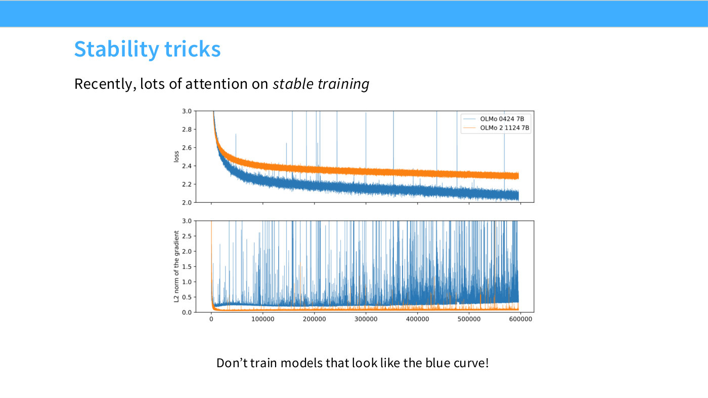
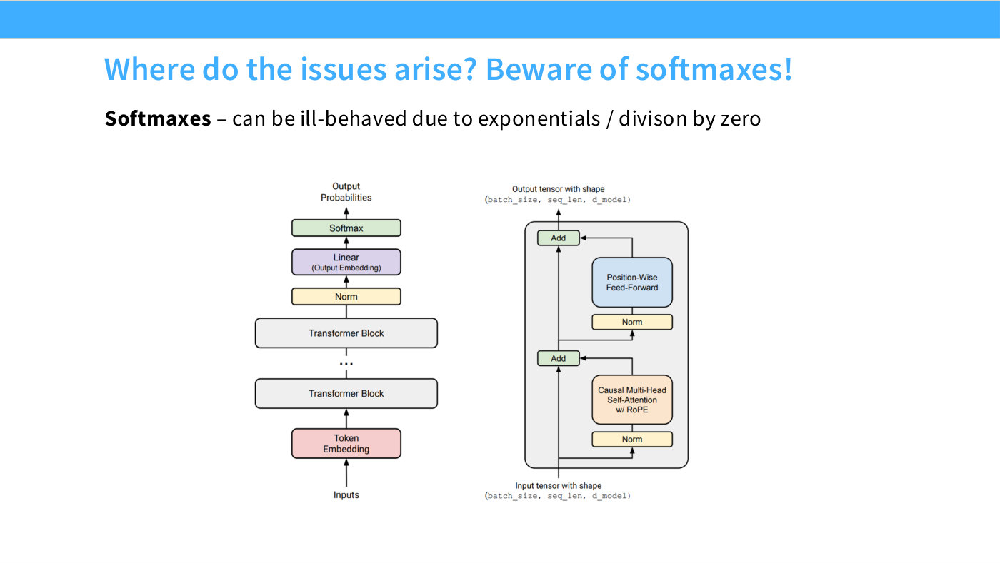
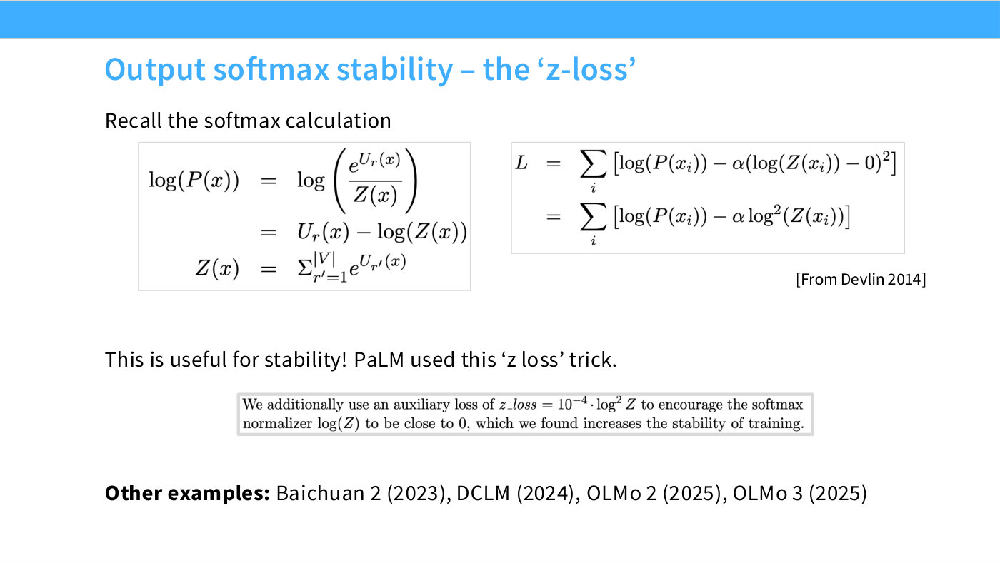
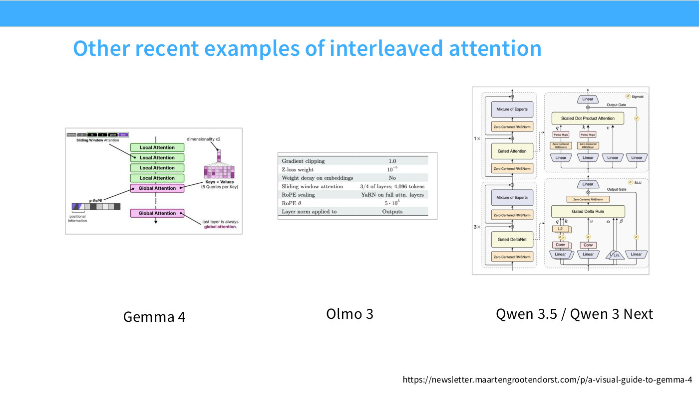
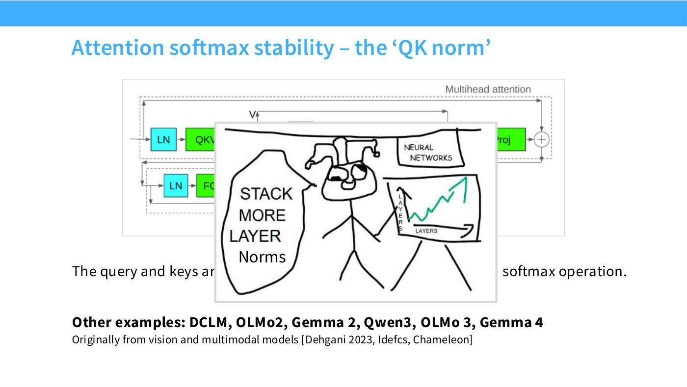
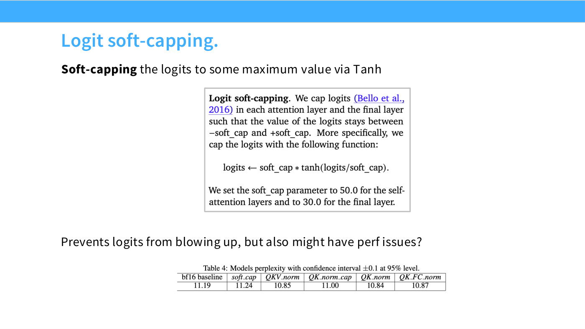
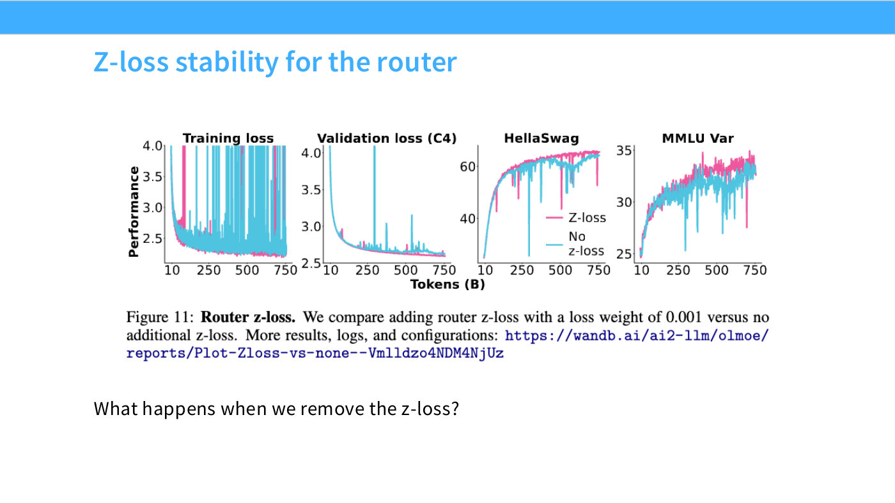

# Training stability

Why a language model blows up partway through training, and the three
architectural interventions people use to stop it. This has become, over the last
few years, at least as important as raw quality — because a stability failure at
scale is not a slightly worse model, it is a wasted training run.

Hashimoto's motivation ([1:05:21]):

> if your model suddenly blows up partway into training — you get these
> horrible-looking spikes all over the place — you might end up with a model that
> is actually not very good quality, or it might be unrecoverable. You might have
> spent millions of dollars in training, and you get to a point where the model is
> no longer able to be trained any further.

That is the asymmetry. The [hyperparameters](transformer-hyperparameters.md) are
forgiving — get one wrong and you lose a percent of loss. Stability is not.

## What instability looks like

Slide 52 shows two OLMo runs on shared axes. The top panel is loss, the bottom is
the L2 norm of the gradient, and both carry the same two series: blue **OLMo 0424
7B** and orange **OLMo 2 1124 7B**.

*Slide 52 — Stability tricks. [Deck](https://github.com/stanford-cs336/lectures/blob/main/lecture_03.pdf)*

The instructive part is that **the blue run has the lower loss**. It falls to about
2.2 by 100k steps and drifts to about 2.1 by 600k, while orange sits consistently
higher, around 2.45 falling to 2.28. If you were reading the loss panel alone,
blue is the better run.

But blue's loss curve is punctuated by tall thin spikes shooting off the top of
the panel, at roughly 50k, 150k, 185k, 245k, 300k, 435k and 570k steps among
others — and the gradient-norm panel below shows why. Blue settles at a baseline
around 0.25 and then throws hundreds of spikes reaching 1.0–3.0, with the spike
density *increasing* as training proceeds until the trace is almost solid after
about 350k steps. Orange drops to a baseline near 0.08 within the first few
thousand steps and stays there, smooth, for the whole run.

The slide's instruction is blunt: "Don't train models that look like the blue
curve!" The lesson is that a run can be simultaneously ahead on loss and heading
for trouble, and the gradient norm is where you see it first.

## The usual suspect: softmax

Slide 53 asks where instability comes from and answers: **softmaxes**, because they
contain the two operations most likely to misbehave numerically. Hashimoto at
[1:06:07]: "One of them is an exponential — we can see how that blows up very
quickly. You also divide two numbers, and that's also a potentially very dangerous
operation."

*Slide 53 — Where do the issues arise? Beware of softmaxes! [Deck](https://github.com/stanford-cs336/lectures/blob/main/lecture_03.pdf)*

A transformer has exactly two softmaxes, and the slide points at both on the
architecture diagram:

1. The **output softmax**, converting final-layer logits into a distribution over
   the vocabulary.
2. The **attention softmax**, normalizing attention scores inside every block.

Each gets its own fix.

## Fix 1 — the z-loss, for the output softmax

The log-probability of a token splits into two terms, one well-behaved and one not
(slide 54):

*Slide 54 — Output softmax stability – the 'z-loss'. [Deck](https://github.com/stanford-cs336/lectures/blob/main/lecture_03.pdf)*

$$\log P(x) = \log\left(\frac{e^{U_r(x)}}{Z(x)}\right) = U_r(x) - \log Z(x), \qquad Z(x) = \sum_{r'=1}^{|V|} e^{U_{r'}(x)}$$

Here $U_r(x)$ is the model's logit for the correct token and $Z(x)$ is the softmax
normalizer summed over the vocabulary. Hashimoto's diagnosis ([1:07:38]): $U$ is
"the output of your residual stream, with all the things that are added in," so if
the model is healthy, $U$ is healthy. But $Z$ is a sum of exponentials — it "could
potentially blow up very quickly on you, or, if this is zero, it could also blow up
on you. So both of those directions are very, very bad."

What makes this fixable is that **the softmax is overparameterized** ([1:08:23]):
adding a constant to every logit changes $Z$ without changing the output
distribution at all, since the shift cancels between numerator and normalizer. That
slack is free to constrain. So add a penalty pulling $\log Z$ toward zero:

$$L = \sum_i \left[\log P(x_i) - \alpha \log^2 Z(x_i)\right]$$

With $\log Z \approx 0$, we have $Z \approx 1$ and the whole expression is
numerically well-behaved. This is the **z-loss**.

PaLM's own description, quoted on slide 54: "We additionally use an auxiliary loss
of $z\_loss = 10^{-4} \cdot \log^2 Z$ to encourage the softmax normalizer $\log(Z)$
to be close to 0, which we found increases the stability of training."

The idea is old — Hashimoto credits Jacob Devlin's 2014 paper, correcting himself
mid-sentence from 2024 ([1:08:23]) — and was revived by open models. Slide 54's
adopter list: **Baichuan 2 (2023), DCLM (2024), OLMo 2 (2025), OLMo 3 (2025)**.
OLMo 3's hyperparameter table on slide 66 records a z-loss weight of $10^{-5}$.

*Slide 66 — Other recent examples of interleaved attention. [Deck](https://github.com/stanford-cs336/lectures/blob/main/lecture_03.pdf)*

## Fix 2 — QK norm, for the attention softmax

The attention softmax is the harder case, and the fix is the "sprinkle in more
norms" heuristic from [pre-norm and post-norm](pre-norm-and-post-norm.md) applied
one level deeper. Hashimoto at [1:09:54]: "if you have instability, if you can throw
a layer norm in there somehow, it might control it. And that's really, in some
sense, the design philosophy behind this idea called QK norm."

**QK norm normalizes the queries and keys before they are multiplied together and
fed to the softmax.** Because RMSNorm fixes their scale to roughly one, the inputs
to the matrix multiply — and so the inputs to the softmax — cannot drift to
extreme magnitudes ([1:10:40]).

Slide 55 states it as: "The query and keys are Layer (RMS) normed before going into
the softmax operation." Adopters, per the slide: **DCLM, OLMo 2, Gemma 2, Qwen 3,
OLMo 3, Gemma 4**. It came from vision and multimodal work first — "Originally from
vision and multimodal models [Dehgani 2023, Idefcs, Chameleon]" (spellings as
printed on the slide) — which Hashimoto confirms at [1:10:40]: "Some folks who were
making multimodal models initially discovered QK norm. Idefics and Chameleon really
used this and proved it out."

*Slide 55 — Attention softmax stability – the 'QK norm'. [Deck](https://github.com/stanford-cs336/lectures/blob/main/lecture_03.pdf)*

His assessment at [1:11:27]: "QK norm is actually a very standard intervention that
most of the large models now introduce. It doesn't seem to affect performance ...
but it does definitely prevent the kinds of attention degeneracies."

This is also where he notices the pattern out loud, to laughter: norms started in
the pre-norm position, then got added after the nonlinearities, "and now we're
throwing them into both the Q's and the K's."

> Slide 55 is the one page in this deck where a pasted meme physically covers part
> of the slide's own sentence — the words between "are" and "softmax operation" are
> hidden on the rendered page. The KB records this rather than reconstructing the
> missing words. The visible joke, "STACK MORE LAYER Norms", is the point of the
> section.

## Fix 3 — logit soft-capping

The strongest and least popular intervention. Where QK norm controls the *inputs*
to the softmax and hopes the outputs behave, soft-capping constrains the logits
directly, squashing them through a scaled $\tanh$ so they can never leave a bounded
range (slide 56):

*Slide 56 — Logit soft-capping. [Deck](https://github.com/stanford-cs336/lectures/blob/main/lecture_03.pdf)*

$$\mathrm{logits} \leftarrow \mathrm{soft\_cap} \cdot \tanh(\mathrm{logits}/\mathrm{soft\_cap})$$

Gemma 2 sets `soft_cap` to **50.0 for the self-attention layers and 30.0 for the
final layer**. Hashimoto notes it is "more of a Google-specific trick" ([1:12:14])
and that Gemma 2, 3 and 4 all use it.

**And unlike the other two, it costs quality.** Slide 56 carries an NVIDIA
comparison of stability interventions, at a perplexity confidence interval of
$\pm 0.1$:

| bf16 baseline | soft_cap | QKV_norm | QK_norm_cap | QK_norm | QK_FC_norm |
| --- | --- | --- | --- | --- | --- |
| 11.19 | 11.24 | 10.85 | 11.00 | 10.84 | 10.87 |

Soft-capping alone (11.24) is the **only** column worse than the bf16 baseline
(11.19). Every QK-norm variant is better, the best being QK_norm at 10.84.
Hashimoto's explanation at [1:13:01]: QK norm "does slightly better, due to the fact
that you can crank up the learning rate a little bit," whereas soft-capping is "a
very strong intervention: you can never express very confident signals in your
softmax beyond a certain point."

## How to hold all this

The three interventions form a ladder from gentle to severe: **z-loss** adds a
penalty that exploits slack the model was not using; **QK norm** constrains the
scale of the softmax's inputs; **logit soft-capping** hard-bounds its inputs and
pays for it in expressiveness.

The two cheap ones are near-universal in recent models and appear to be free. The
expensive one is used by one lab. That ordering — try the intervention that costs
nothing, and only reach for the constraining one if you must — is the practical
takeaway.

## The MoE router adds another softmax

[Lecture 4](04-attention-alternatives.md) extends this page's central rule —
exponentials and divisions are the danger zone — to
[mixture of experts](mixture-of-experts.md), which introduces a *new* softmax in the
router on top of the two discussed above ([1:16:16]).

Hashimoto notes that Barrett Zoph and others "wrote an entire paper on MoE stability"
in the early Google MoE work, and that the router softmax was one of the things they
flagged ([1:17:02]). Two fixes carry over, both narrower than their dense
counterparts because they target the router alone:

- **float32 for the router specifically** — keep the rest of the model in low
  precision and compute only the routing softmax in higher precision. See
  [precision and data types](precision-and-data-types.md).
- **A z-loss on the router**, the same construction as Fix 1 above. OLMoE's ablation
  (slide 49) removes it and gets visibly spikier training-loss curves; Hashimoto's
  reading is that "z-loss on the router can be quite helpful," and that it "was
  actually quite popular for MoE router stability, even in the early days" ([1:17:48]).

*Slide 49 — Z-loss stability for the router. [Deck](https://github.com/stanford-cs336/lectures/blob/main/lecture_04.pdf)*

Note this is a different failure mode from
[expert collapse](load-balancing-losses.md), which is about routing *dynamics* rather
than numerical range. Both afflict the same softmax; they need different fixes.

## Related

- [Load balancing losses](load-balancing-losses.md) — the other thing that goes wrong
  with an MoE router, and the auxiliary loss that fixes it.
- [Pre-norm and post-norm](pre-norm-and-post-norm.md) — where "sprinkle in layer
  norms" starts.
- [RMSNorm](rmsnorm.md) — the norm QK norm actually uses.
- [Attention variants](attention-variants.md) — the other set of changes made to
  the attention computation, for cost rather than stability.
- **[Optimizer scaling](optimizer-scaling.md)** — lecture 11's blow-up case, and the sharpest
  instance of instability in this KB: a scaling law whose seven fitted points sat on the line to
  within ±0.16% drifted 0.8% one decade out, 2.5% two decades out, and then **diverged
  outright** two and a half decades out.
- **[Maximal update parametrization](maximal-update-parametrization.md)** — the stability
  argument for muP: under standard parametrization the larger models diverge at learning rates
  the smaller ones tolerate.
- [Lecture 3 — architectures](03-architectures.md).
