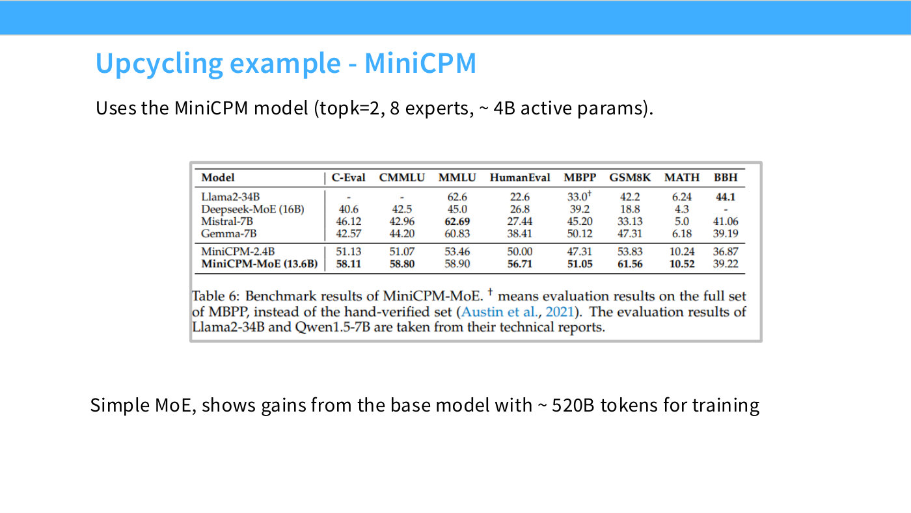
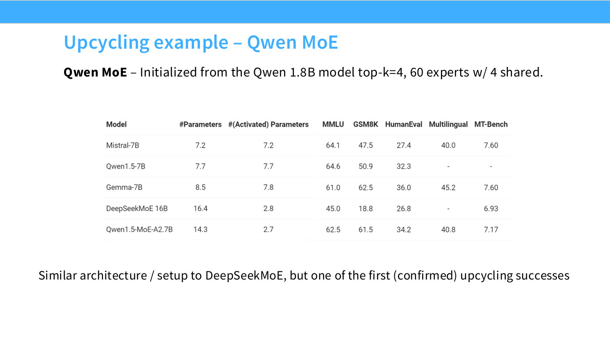

# Upcycling — building an MoE from a dense model

Take a trained dense model, clone its feedforward block into $N$ experts, bolt on a
randomly initialized router, and keep training. Lecture 4 covers it in slides 51–53 as a
technique worth understanding that has largely fallen out of use.

*Slide 51 — Other training methods - upcycling. [Deck](https://github.com/stanford-cs336/lectures/blob/main/lecture_04.pdf)*

*Slide 52 — Upcycling example - MiniCPM. [Deck](https://github.com/stanford-cs336/lectures/blob/main/lecture_04.pdf)*

*Slide 53 — Upcycling example – Qwen MoE. [Deck](https://github.com/stanford-cs336/lectures/blob/main/lecture_04.pdf)*

Hashimoto is explicit about that framing: "This has actually become a lot less popular in
the last year — I don't think I've seen a single upcycled model this year — but it's a cool
idea, and there were some very nice models earlier on using this trick, so I want to
mention it" ([1:19:18]).

## The construction

> Upcycling is this idea that, if you want an MoE, maybe you can just take a dense model
> you've trained, and instantiate an MoE based on that dense model. The idea is you just
> copy everything, including the MLPs — you make a whole bunch of copies of these MLPs, you
> have a router with a random initialization, and then you just train this model.
> ([1:20:05])

The obvious objection is that identical copies should stay identical — if every expert
begins as the same function, what breaks the symmetry? The answer is the router:

> Because of the stochasticity of which inputs go where in the MLP, you get these experts
> that start to specialize, and in the end you actually end up with an MoE. ([1:20:05])

The randomly initialized router sends different tokens to different copies from the first
step, so each copy receives a different gradient signal and they diverge. Symmetry is
broken by the routing, not by the initialization of the experts themselves.

Note this is genuinely the same mechanism as ordinary [MoE](mixture-of-experts.md)
specialization, and it inherits the same caveat: the resulting experts are not semantic
specialists, just differently-adapted shards. See
[mixture of experts](mixture-of-experts.md#experts-are-not-experts).

## Why you would do it

The claim from the original papers is that upcycling beats simply continuing to train the
dense model: "an upcycled model could get much better language-modeling — in this case,
validation accuracy performance — than continuing to train the dense model" ([1:20:05]).

That is the right comparison to keep in mind. Upcycling is not competing against training
an MoE from scratch; it is competing against what else you could do with a dense checkpoint
and some remaining compute budget.

## The two worked examples

**MiniCPM** (slide 52). Hashimoto likes this group's work "because they do a lot of
carefully controlled ablations" ([1:20:51]). They upcycled MiniCPM-2.4B into an MoE and
"got a bunch of almost-free wins from doing that." Slide 52's Table 6 shows MiniCPM-MoE
improving on its own 2.4B base in every benchmark column.

> **A discrepancy worth knowing.** Hashimoto says the upcycled model is "13.4 billion"
> parameters ([1:20:51]); slide 52's table prints **MiniCPM-MoE (13.6B)**. The transcript
> marks this with an `[Ed:]` note and leaves the spoken figure as spoken. The deck is the
> better authority for a printed number.

**Qwen** (slide 53). Qwen initialized from their 1.8B dense model and upcycled it to
Qwen1.5-MoE-A2.7B ([1:21:37]) — "one of the first larger-scale upcycling successes," and
the model that appears in [MoE routing](moe-routing.md)'s table with 60 routed experts, 4
active and 4 shared.

## Why it stopped

The reason is not that upcycling fails. It is that the premise disappeared:

> These days I don't think anyone's really upcycling anymore, because you don't really train
> dense models and then convert them — you might as well just train your big hero run as an
> MoE to start with. ([1:21:37])

Upcycling made sense while dense models were the default and MoEs were the risky option, so
that a good dense checkpoint was the thing you had lying around. Once MoE became the default
architecture past a certain scale — see [mixture of experts](mixture-of-experts.md) — there
is no dense checkpoint to upcycle *from*, and nothing to convert.

It remains, in Hashimoto's words, "an important thing to know in the design space of
mixture-of-experts models" ([1:21:37]) — a technique whose obsolescence is a fact about how
the field's defaults shifted rather than about the technique.

## Related pages

- [Mixture of experts](mixture-of-experts.md) — the parent topic.
- [MoE routing](moe-routing.md) — the router that breaks the symmetry, and the table Qwen 1.5
  appears in.
- [Lecture 4](04-attention-alternatives.md).
