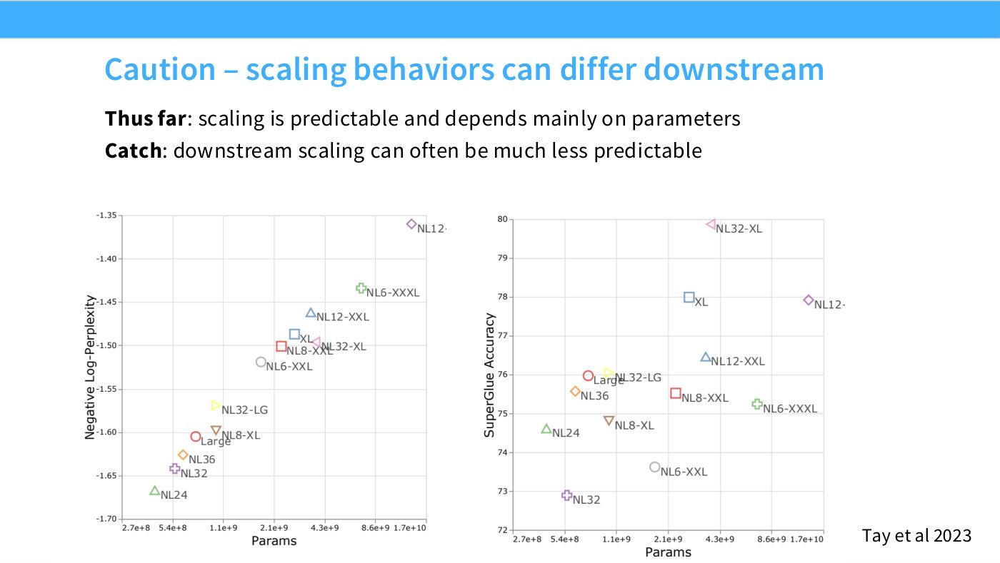
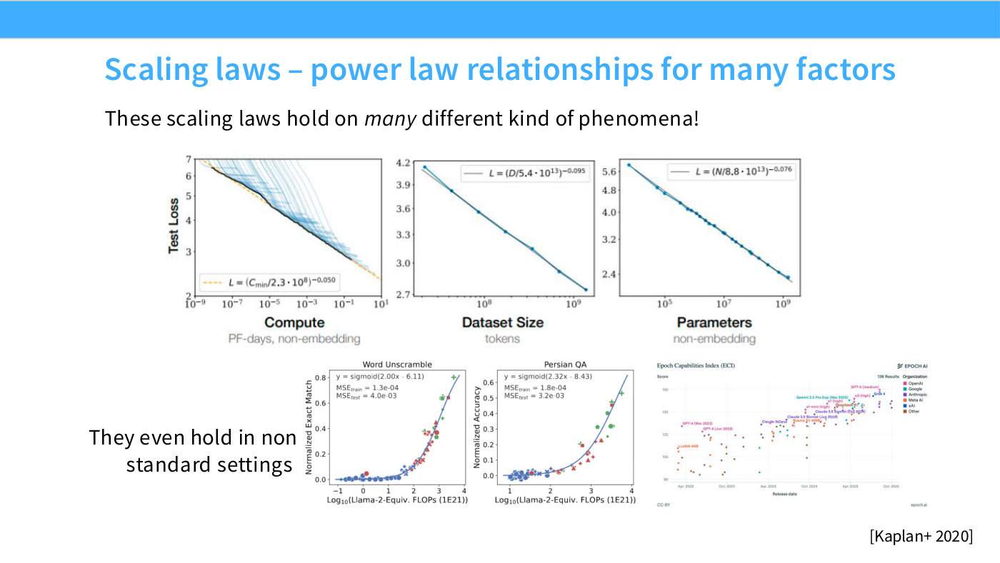

# Upstream vs downstream

Scaling laws are clean on perplexity and unreliable on benchmarks. This is the
sharpest caution in [lecture 9](09-scaling-laws.md), and the place where the
lecture's own confidence in the paradigm stops.

## The result

From Tay et al. 2023 (slide 41), the same 13 T5 variants plotted twice: negative
log-perplexity against parameters on the left, SuperGLUE accuracy against
parameters on the right.

*Slide 41 — Caution – scaling behaviors can differ downstream. [Deck](https://github.com/stanford-cs336/lectures/blob/main/lecture_09.pdf)*

The left panel is "a very beautiful linear trend" — more parameters, better
perplexity, predictably ([51:27]). The right panel reorders the models. The best
downstream model is **NL32-XL**, at about 79.7 on SuperGLUE, and it is only
mid-table on perplexity (≈−1.49, tied with two others).

Hashimoto's verdict: "this is probably one of the worst correlations I've seen from
upstream to downstream" ([51:27]).

> **What the reshuffle does and does not say.** It is driven by a mid-table model
> rising, not by the leader falling. NL12- has the best perplexity, and downstream
> it still scores ≈77.9 — about 2nd–3rd of 13, near the top on both axes. This
> knowledge base's first transcription of slide 41 read the SuperGLUE values
> systematically low and concluded that NL12- "only reaches the middle of the
> ranking", which inverts the slide's argument; the figure audit caught it and the
> [slide file](../raw/slides/09-scaling-laws.md) now records the corrected values.
> The lecturer's spoken account — "we're going to ship our best model, NL12." It
> turns out NL12 is not your best model — it was actually NL32-XL" ([51:27]) — is
> about which model *wins*, and is correct as stated.

## Why it matters practically

The failure lands on someone. Hashimoto's anecdote about former students doing
post-training ([52:13]):

> "Oh, those pre-training people, they hand you this model and say, 'the perplexity
> is good, it's all your problem now'" — but often the problems started on the
> pre-training side.

The instruction is not to abandon scaling laws but to stop treating a perplexity
extrapolation as a claim about capability. "You want to really think about transfer
as well, not just focus on perplexities."

## The recommended discipline

Asked directly whether people fit scaling laws on downstream metrics, the answer is
yes — and that it inherits the same problem ([54:30]). The method Hashimoto
prescribes instead ([55:15]):

1. **Establish regularity where the signal is clean.** Perplexity trends are
   low-variance and visibly regular, so you can believe the line will continue.
2. **Then argue about transfer separately** — either by assuming it, knowingly, or
   by establishing it elsewhere.

The contrast that makes the point is a hypothetical: if the upstream trend itself
were "a very noisy, jagged line of this form — you wouldn't really know what's going
on. You'd say, 'maybe I believe it will go on, but maybe it's a line, maybe it's a
curve'" ([55:15]). The whole method rests on starting from a measurement you can
trust.

## Variance, and where it bites

A related exchange on how many runs go into each scaling-law point ([53:44]).

- **Perplexity points are almost always singletons.** Reruns differ "in the second
  decimal place", because the training data is homogeneous and plentiful and the
  eval sets are large.
- **Learning-rate and critical-batch-size scaling laws are not.** "You will see some
  truly horrendous stuff." Variance reduction is done, but "not as common as it
  should be" ([54:30]).

So the confidence you can place in a single point depends entirely on which
quantity you are scaling — an easy thing to carry over wrongly from the perplexity
plots to everything else.

## A related discontinuity: emergence

The reason downstream metrics behave differently at all is partly that accuracy is
a much more discontinuous measure than loss — a point already made by Hestness et
al. in 2017, where capabilities appear suddenly as models grow ([9:15]). Slide 13
shows the corresponding shape: benchmark scaling curves are fitted as **sigmoids**
in compute, not lines ([12:19]).

*Slide 13 — Scaling laws – power law relationships for many factors. [Deck](https://github.com/stanford-cs336/lectures/blob/main/lecture_09.pdf)*

## See also

- [Lecture 9](09-scaling-laws.md) · [Scaling law methodology](scaling-law-methodology.md)
- [Data scaling laws](data-scaling-laws.md) — the clean case this contrasts with.
- [Model architecture survey](model-architecture-survey.md) — the Tay et al. studies.
- Slide [41](../raw/slides/09-scaling-laws.md) · [transcript](../raw/transcripts/09-scaling-laws.md)
