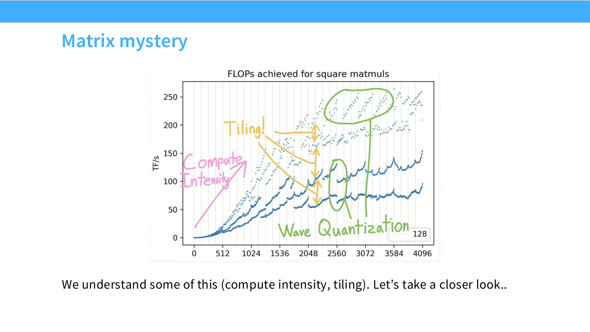
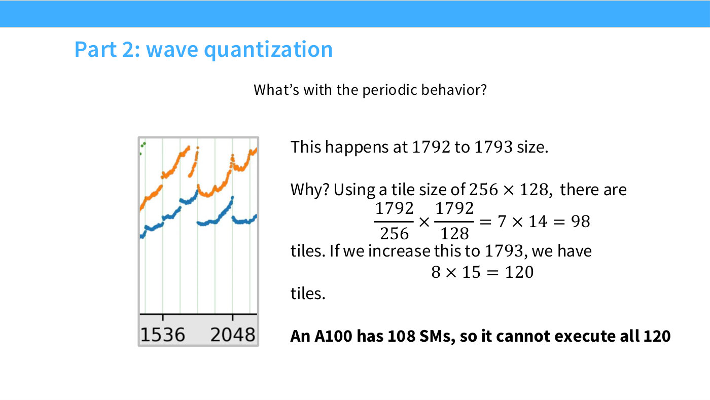
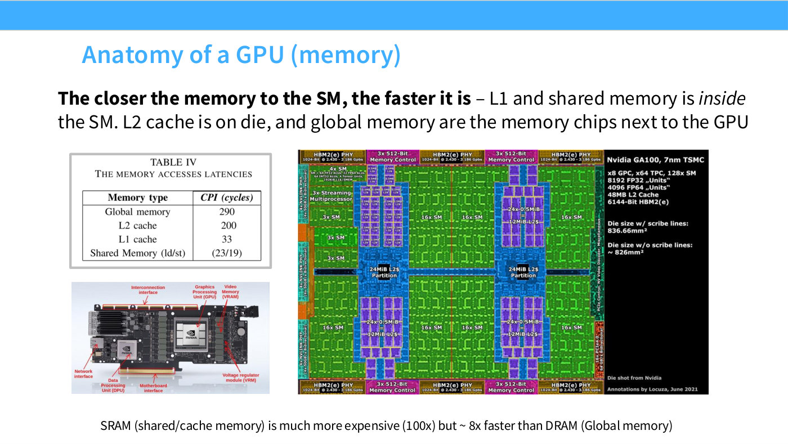

# Wave quantization

Wave quantization is the effect that explains the strangest feature of Lecture 5's
running benchmark: a matrix multiply that gets *dramatically* slower when you
increase the matrix size by one.

It is the second half of the "matrix mystery" the lecture is built around. The
first half is [tiling](tiling.md) and alignment, which explains why divisibility by
16 or 32 matters. This one explains the periodic collapses that remain after
divisibility is accounted for.

## The observation

Slide 46 shows throughput for square matmuls against matrix size $N$. After
colour-coding by divisibility, one band still shows "weird periodic behavior, where
performance suddenly drops" ([1:07:32]).

*Slide 46 — Matrix mystery. [Deck](https://github.com/stanford-cs336/lectures/blob/main/lecture_05.pdf)*

Hashimoto's reaction is the right one to have: "This is very strange, because I'm
just multiplying matrices — why does adding a single extra dimension suddenly kill
my throughput?"

The specific cliff, from slide 48: **it happens between $N = 1792$ and $N = 1793$.**

*Slide 48 — Part 2: wave quantization. [Deck](https://github.com/stanford-cs336/lectures/blob/main/lecture_05.pdf)*

## The arithmetic

Slide 48 works it out with a tile size of $256 \times 128$:

$$\frac{1792}{256} \times \frac{1792}{128} = 7 \times 14 = 98 \text{ tiles}$$

Bump both dimensions by one and the tile count becomes:

$$8 \times 15 = 120 \text{ tiles}$$

From 98 tiles to 120. As Hashimoto says, "that's bad, but not this bad, right? This
drop is gigantic" ([1:08:17]). A 22% increase in work does not explain a collapse
in throughput.

## The explanation: 108 SMs

The missing number is a property of the chip, not of the matrices. Slide 48 states
it in bold: **"An A100 has 108 SMs, so it cannot execute all 120."**

98 tiles fit in 108 SMs — one wave, every tile resident, the whole GPU busy. 120
tiles do not. "So you finish 108 SMs' worth, and you've got 12 more of these to
process, and most of your GPU sits idle" ([1:08:17]).

The second wave costs as much wall-clock time as the first, because a wave takes as
long as its tiles take regardless of how many of the SMs are occupied. Twelve tiles
of work occupy a full wave's worth of time while 96 of the 108 SMs do nothing.

"You can end up with these very weird effects, where bumping up your tile count by
a little suddenly means waiting a whole extra cycle to process a bunch of tiles.
That's called wave quantization" ([1:09:03]).

## Why it is called quantization

The resource being quantized is *time*, in units of waves. Execution time does not
vary smoothly with tile count; it steps. Any tile count in $(108, 216]$ costs two
waves, so 109 tiles and 216 tiles take the same wall-clock time. The cliff sits
exactly where the count crosses a multiple of the SM count.

This makes the effect **hardware-specific**. The cliff is at 1792→1793 because that
is where 98 becomes 120 against *an A100's* 108 SMs. Change the GPU, the tile size,
or the shape of the matmul, and the cliffs move.

Asked why 108 in the first place, Hashimoto has no deeper answer ([1:10:35]):
"That's just the number of SMs — you'll have to ask Jensen for that."

## Two SM counts, both correct

The lecture quotes two different SM counts for an A100, and it is worth knowing why
before treating one as an error. At [10:02] Hashimoto says "an A100 will have 128
SMs," reading from slide 10's die annotation, which reports the GA100 die as
"x8 GPC, x64 TPC, 128x SM". Slide 48 then says the A100 has 108 SMs. The die and
the shipped product are not the same thing — chips are sold with some units
disabled — and the wave-quantization arithmetic is the one that has to match the
benchmark, so 108 is the number that governs this effect.

*Slide 10 — Anatomy of a GPU (memory). [Deck](https://github.com/stanford-cs336/lectures/blob/main/lecture_05.pdf)*

## Practical upshot

Wave quantization is not something you fix; it is something you avoid landing on.
It is one more reason the lecture's advice about matrix dimensions is what it is —
see [tiling](tiling.md) for the divisibility side. It is also a good argument for
`max-autotune`-style search, since the tile size is what converts a matrix shape
into a tile count, and a different tile size moves the cliff.

More generally, it is Hashimoto's best evidence for the lecture's thesis. Nothing
about the mathematics of a matmul predicts a discontinuity at 1793. You can only
see it if you know what an SM is and how many the chip has. "Percy calls this GPU
trivia, and I think he hates it, but I love it" ([1:07:32]).

## Lecture 6's version

Lecture 6 gives the same phenomenon under the name **block occupancy**, with a B200's
148 SMs instead of an A100's 108 ([18:31]):

> "If you launch 160 thread blocks, then you can only schedule 148 of them, and then
> you have to wait until they're done, and then you schedule the 12. But what happens
> if you schedule the 12 is that a bunch of the SMs are just not doing anything.
> That's called low occupancy — when the last wave of thread blocks has fewer than
> the total maximum number of thread blocks."

Its stated remedy is to make the number of thread blocks divide the number of SMs.

A student asks the obvious follow-up — could two blocks share an SM to fill the gap?
— and the answer is that sharing does not recover the loss when the resident block is
already using the SM's resources: "if you have a block that's, for example, using most
of the tensor cores on the SM, then putting another block there isn't really going to
speed things up. I think fundamentally there is this jagged problem here of
unevenness — because the blocks have to stay together." The fix is to change the block
size so the tail disappears ([20:03]–[20:50]).

Note that this is *block* occupancy, a different quantity from the [warp
occupancy](warp-occupancy.md) set by each thread's register use.

## Related

- [Tiling](tiling.md) — where tile counts come from, and the other half of the
  mystery.
- [GPU architecture](gpu-architecture.md) — what an SM is.
- [GPU execution model](gpu-execution-model.md) — blocks, and why one lands on one SM.
- [Lecture 5 — GPUs and TPUs](05-gpus-tpus.md).
- [Transcript](../raw/transcripts/05-gpus-tpus.md), [slide deck](../raw/slides/05-gpus-tpus.md).
